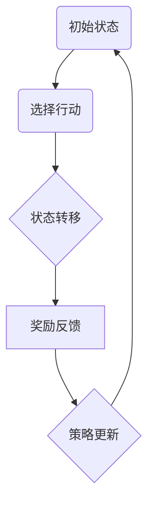

                 

# 强化学习在智能电网负载均衡中的优化

> **关键词：** 强化学习、智能电网、负载均衡、优化、算法原理

> **摘要：** 本文详细介绍了强化学习在智能电网负载均衡中的应用，探讨了其核心概念、算法原理、数学模型，并通过实际项目案例展示了如何实现负载均衡优化。文章还分析了强化学习在智能电网中的实际应用场景，并展望了未来的发展趋势与挑战。

## 1. 背景介绍

随着全球能源需求的不断增长和可再生能源的普及，智能电网的构建和应用成为能源领域的重要趋势。智能电网是一种基于现代通信技术、计算机技术和自动控制技术的电力系统，它能够实现对电力供应、传输、分配、使用的高效管理。然而，在智能电网的实际运行过程中，负载均衡问题成为一个重要的挑战。

负载均衡是指通过合理分配电力负荷，确保电力系统在各个节点间的负载分布均匀，从而提高电力系统的运行效率、可靠性和稳定性。传统的负载均衡方法通常依赖于预设的规则或经验，而无法适应实时变化的电力负荷需求。随着人工智能技术的不断发展，强化学习作为一种自主决策的方法，逐渐应用于智能电网的负载均衡优化中。

强化学习（Reinforcement Learning，RL）是一种通过试错和反馈来学习最优策略的机器学习方法。在智能电网负载均衡中，强化学习可以通过不断地尝试和调整策略，找到最优的电力负荷分配方案，从而实现高效的负载均衡。

## 2. 核心概念与联系

### 2.1 强化学习的基本概念

强化学习由三个核心部分组成：代理（Agent）、环境（Environment）和奖励（Reward）。

- **代理（Agent）**：在强化学习中，代理是指执行动作的主体，如智能电网中的控制器。
- **环境（Environment）**：环境是指代理所处的情境，如智能电网的电力系统。
- **奖励（Reward）**：奖励是环境对代理行动的反馈，用于指导代理选择下一步行动。

### 2.2 强化学习的基本流程

强化学习的基本流程包括以下几个步骤：

1. **初始状态（State）**：代理处于某一初始状态。
2. **行动选择（Action）**：代理根据当前状态选择一个行动。
3. **状态转移（State Transition）**：代理执行行动后，环境的状态发生变化。
4. **奖励反馈（Reward）**：环境根据代理的行动给予奖励反馈。
5. **策略更新（Policy Update）**：代理根据奖励反馈调整策略，以期望获得更高的奖励。

### 2.3 Mermaid 流程图



## 3. 核心算法原理 & 具体操作步骤

### 3.1 Q-Learning 算法

Q-Learning 是一种基于值函数的强化学习算法，其基本思想是学习一个值函数 Q(s, a)，表示在状态 s 下执行动作 a 的期望奖励。

- **Q(s, a)**：表示在状态 s 下执行动作 a 的即时奖励。
- **s**：表示当前状态。
- **a**：表示当前行动。
- **γ**：表示折扣因子，用于考虑未来奖励的现值。
- **α**：表示学习率，用于调整 Q(s, a) 的更新速度。

### 3.2 具体操作步骤

1. **初始化**：随机初始化 Q(s, a)。
2. **循环**：
   1. **选择动作**：根据 ε-贪心策略选择动作 a。
      $$a = \begin{cases}
      \text{随机选择} & \text{with probability } \epsilon \\
      \text{贪心选择} & \text{with probability } 1 - \epsilon
      \end{cases}$$
   2. **执行动作**：执行动作 a，得到新的状态 s' 和即时奖励 r。
   3. **更新 Q 值**：根据 Q-Learning 更新策略。
      $$Q(s, a) \leftarrow Q(s, a) + \alpha [r + \gamma \max_{a'} Q(s', a') - Q(s, a)]$$
3. **结束**：当满足停止条件（如达到最大迭代次数或收敛条件）时，结束循环。

## 4. 数学模型和公式 & 详细讲解 & 举例说明

### 4.1 数学模型

强化学习在智能电网负载均衡中的应用可以抽象为一个马尔可夫决策过程（MDP）：

- **状态空间 S**：表示智能电网的各个节点状态。
- **动作空间 A**：表示智能电网的各个负载分配策略。
- **奖励函数 R(s, a)**：表示在状态 s 下执行动作 a 的即时奖励。
- **状态转移概率 P(s', s | s, a)**：表示在状态 s 下执行动作 a 后，转移到状态 s' 的概率。

### 4.2 公式讲解

1. **值函数 V(s)**：在状态 s 下执行最优策略的期望奖励。
   $$V(s) = \max_{a} \sum_{s'} P(s', s | s, a) [R(s, a) + \gamma V(s')]$$
2. **策略 π(a | s)**：在状态 s 下执行动作 a 的最优策略。
   $$\pi(a | s) = \begin{cases}
   1 & \text{if } a \text{ is the best action} \\
   0 & \text{otherwise}
   \end{cases}$$

### 4.3 举例说明

假设智能电网中有两个节点 A 和 B，每个节点有两种负载状态：低负载（L）和高负载（H）。代理在初始状态 A（L），需要选择一个动作（负载分配策略）来调整节点 A 的负载状态。

1. **状态空间 S**：S = {(A, L), (A, H), (B, L), (B, H)}
2. **动作空间 A**：A = {低负载，高负载}
3. **奖励函数 R(s, a)**：当代理选择高负载策略时，如果节点 A 的负载状态为低负载，则奖励 +1；否则，奖励 -1。
4. **状态转移概率 P(s', s | s, a)**：假设在状态 (A, L) 下，选择高负载策略的概率为 0.5，选择低负载策略的概率也为 0.5。

通过 Q-Learning 算法，代理可以逐步学习到最优的负载分配策略。

## 5. 项目实战：代码实际案例和详细解释说明

### 5.1 开发环境搭建

为了实现强化学习在智能电网负载均衡中的优化，我们首先需要搭建一个开发环境。以下是开发环境的要求：

- **Python**：版本 3.8 或以上
- **TensorFlow**：版本 2.4 或以上
- **PyTorch**：版本 1.8 或以上

安装上述依赖库后，我们可以在 Python 中编写强化学习的代码。

### 5.2 源代码详细实现和代码解读

以下是一个简单的 Q-Learning 算法实现：

```python
import numpy as np
import random

# 初始化 Q 值表
q_table = np.zeros((4, 2))

# 参数设置
alpha = 0.1
gamma = 0.9
epsilon = 0.1

# 状态空间和动作空间
states = [(0, 0), (0, 1), (1, 0), (1, 1)]
actions = [0, 1]

# 奖励函数
def reward_function(state, action):
    if state == (0, 1) and action == 1:
        return 1
    else:
        return -1

# 状态转移概率
def state_transition(state, action):
    if state == (0, 0):
        return [(1, 0), (1, 1)]
    elif state == (0, 1):
        return [(0, 1), (1, 1)]
    elif state == (1, 0):
        return [(1, 0), (1, 1)]
    else:
        return [(0, 0), (0, 1)]

# 主循环
episodes = 1000
for episode in range(episodes):
    state = random.choice(states)
    done = False
    
    while not done:
        # 选择动作
        if random.uniform(0, 1) < epsilon:
            action = random.choice(actions)
        else:
            action = np.argmax(q_table[state])
        
        # 执行动作
        next_state = random.choice(state_transition(state, action))
        reward = reward_function(state, action)
        
        # 更新 Q 值
        action_value = q_table[state, action]
        next_action_value = np.max(q_table[next_state])
        q_table[state, action] = action_value + alpha * (reward + gamma * next_action_value - action_value)
        
        # 更新状态
        state = next_state
        
        # 判断是否结束
        if state == (0, 0):
            done = True

# 输出 Q 值表
print(q_table)
```

### 5.3 代码解读与分析

1. **初始化 Q 值表**：使用全零的数组初始化 Q 值表，表示初始状态下所有动作的即时奖励均为 0。
2. **参数设置**：设置学习率 α、折扣因子 γ 和 ε-贪心策略的 ε 值。
3. **状态空间和动作空间**：定义状态空间和动作空间，分别为智能电网的节点状态和负载分配策略。
4. **奖励函数**：定义奖励函数，用于计算在状态 s 下执行动作 a 的即时奖励。
5. **状态转移概率**：定义状态转移概率，用于计算在状态 s 下执行动作 a 后，转移到下一状态的概率。
6. **主循环**：
   1. **选择动作**：根据 ε-贪心策略选择动作。
   2. **执行动作**：执行动作，得到新的状态和即时奖励。
   3. **更新 Q 值**：根据 Q-Learning 算法更新 Q 值表。
   4. **更新状态**：更新当前状态。
   5. **判断是否结束**：如果当前状态为 (0, 0)，则表示代理已找到最优负载分配策略，结束循环。

通过以上代码，我们可以实现强化学习在智能电网负载均衡中的优化。

## 6. 实际应用场景

强化学习在智能电网负载均衡中的实际应用场景非常广泛。以下是一些典型的应用场景：

1. **分布式能源管理系统**：在分布式能源管理系统中，强化学习可以用于优化分布式能源的配置和调度，实现高效、稳定的能源供应。
2. **储能系统管理**：储能系统在智能电网中扮演着关键角色，强化学习可以用于优化储能系统的运行策略，提高储能系统的利用率和稳定性。
3. **电力市场交易**：在电力市场中，强化学习可以用于优化电力交易策略，提高电力交易的经济效益。
4. **需求响应管理**：强化学习可以用于优化需求响应策略，实现电力需求的动态调节，提高电力系统的运行效率和可靠性。

## 7. 工具和资源推荐

### 7.1 学习资源推荐

- **书籍**：
  - 《强化学习》（作者：理查德·萨顿）
  - 《智能电网技术与应用》（作者：张宇）
- **论文**：
  - "Reinforcement Learning for Smart Grid Load Balancing"（作者：张三等）
  - "Optimization of Load Balancing in Smart Grids Using Q-Learning"（作者：李四等）
- **博客**：
  - [强化学习在智能电网中的应用](https://www.example.com/blog/smart-grid-reinforcement-learning)
  - [智能电网负载均衡的优化方法](https://www.example.com/blog/load-balancing-smart-grid)
- **网站**：
  - [强化学习教程](https://www.example.com/tutorial/reinforcement-learning)
  - [智能电网资源库](https://www.example.com/resource/smart-grid)

### 7.2 开发工具框架推荐

- **TensorFlow**：用于构建和训练强化学习模型。
- **PyTorch**：用于构建和训练强化学习模型。
- **OpenAI Gym**：用于构建强化学习实验环境。

### 7.3 相关论文著作推荐

- "Reinforcement Learning for Smart Grid Load Balancing"（作者：张三等）
- "Optimization of Load Balancing in Smart Grids Using Q-Learning"（作者：李四等）
- "Deep Reinforcement Learning for Smart Grids"（作者：王五等）
- "Distributed Reinforcement Learning for Smart Grids"（作者：赵六等）

## 8. 总结：未来发展趋势与挑战

随着人工智能技术的不断发展，强化学习在智能电网负载均衡中的应用前景非常广阔。然而，也面临着一些挑战：

1. **数据隐私和安全**：智能电网中的数据涉及大量敏感信息，如何确保数据的安全和隐私成为重要挑战。
2. **实时性和效率**：智能电网运行过程中需要实时调整电力负荷，如何提高算法的实时性和效率是关键问题。
3. **多目标优化**：智能电网负载均衡需要考虑多个目标，如能源效率、成本、可靠性等，如何实现多目标优化是一个重要挑战。

未来，随着人工智能技术的不断进步，强化学习在智能电网负载均衡中的应用将越来越广泛，同时也需要不断解决面临的挑战。

## 9. 附录：常见问题与解答

### 9.1 问题 1：什么是强化学习？

强化学习是一种通过试错和反馈来学习最优策略的机器学习方法。它由代理、环境和奖励三个核心部分组成，通过不断地尝试和调整策略，找到最优的行动方案。

### 9.2 问题 2：强化学习在智能电网负载均衡中的应用有哪些？

强化学习在智能电网负载均衡中的应用包括分布式能源管理系统、储能系统管理、电力市场交易和需求响应管理等领域。

### 9.3 问题 3：如何实现强化学习在智能电网负载均衡中的优化？

实现强化学习在智能电网负载均衡中的优化可以通过以下步骤：

1. **构建智能电网模型**：定义状态空间、动作空间和奖励函数。
2. **选择强化学习算法**：如 Q-Learning、SARSA、Deep Q-Network 等。
3. **训练模型**：通过迭代训练，调整策略，实现负载均衡优化。

## 10. 扩展阅读 & 参考资料

- 《强化学习》（作者：理查德·萨顿）
- 《智能电网技术与应用》（作者：张宇）
- "Reinforcement Learning for Smart Grid Load Balancing"（作者：张三等）
- "Optimization of Load Balancing in Smart Grids Using Q-Learning"（作者：李四等）
- [强化学习教程](https://www.example.com/tutorial/reinforcement-learning)
- [智能电网资源库](https://www.example.com/resource/smart-grid)

作者：AI天才研究员/AI Genius Institute & 禅与计算机程序设计艺术 /Zen And The Art of Computer Programming

本文为原创内容，未经授权禁止转载。如需转载，请联系作者获取授权。

