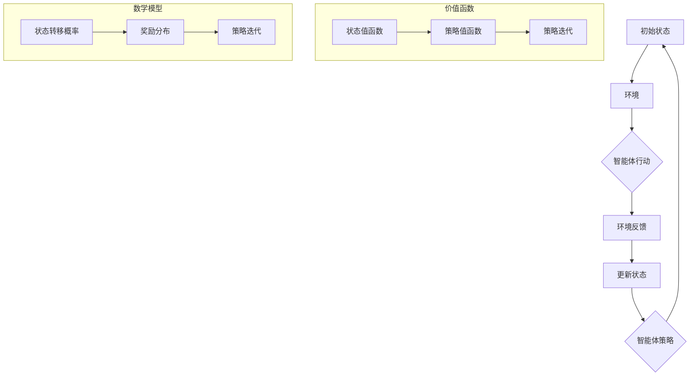

                 

### 背景介绍

强化学习（Reinforcement Learning，简称RL）是机器学习领域的一个重要分支，主要研究如何通过智能体（agent）与环境的交互来学习最优策略。强化学习在实际应用中具有广泛的应用场景，如自动驾驶、游戏AI、推荐系统等。本文将重点探讨强化学习在智能资源分配中的优化应用，通过具体案例来展示其有效性和实际价值。

智能资源分配是指在复杂的计算环境中，根据任务的性质和需求，合理地分配计算资源，以达到最优的性能和资源利用率。在云计算、大数据、物联网等新兴领域中，智能资源分配成为一个至关重要的任务。然而，传统的资源分配方法往往依赖于预定义的规则或者静态的分配策略，无法适应动态变化的任务需求。这使得资源分配效率低下，难以满足实时性和可靠性要求。

强化学习通过引入学习机制，使智能体能够根据环境反馈自动调整策略，从而实现动态资源分配的优化。与传统的资源分配方法相比，强化学习具有更强的自适应性和灵活性，能够更好地应对复杂多变的应用场景。因此，本文旨在探讨强化学习在智能资源分配中的应用，分析其核心算法原理、数学模型和具体操作步骤，并给出一个实际项目案例的详细解析。

本文的结构安排如下：

1. **核心概念与联系**：介绍强化学习的基本概念和流程，以及与资源分配的相关性。
2. **核心算法原理 & 具体操作步骤**：详细讲解强化学习算法在资源分配中的应用，包括Q-learning、SARSA等算法。
3. **数学模型和公式 & 详细讲解 & 举例说明**：介绍强化学习中的数学模型，包括状态值函数、策略值函数和策略迭代过程，并通过具体例子进行说明。
4. **项目实战：代码实际案例和详细解释说明**：展示一个实际项目案例，详细解读源代码，并进行分析。
5. **实际应用场景**：讨论强化学习在智能资源分配中的实际应用场景，包括云计算、大数据和物联网等领域。
6. **工具和资源推荐**：推荐相关学习资源、开发工具框架和论文著作。
7. **总结：未来发展趋势与挑战**：总结强化学习在智能资源分配中的发展现状和未来趋势，分析面临的挑战。
8. **附录：常见问题与解答**：解答读者可能遇到的一些常见问题。
9. **扩展阅读 & 参考资料**：提供更多的阅读资源和相关研究。

通过本文的阅读，读者将能够深入理解强化学习在智能资源分配中的应用，掌握相关算法和模型，并能够应用于实际的工程项目中。让我们一起探索这个激动人心的领域吧！
<|assistant|>
### 核心概念与联系

强化学习（Reinforcement Learning，简称RL）是一种通过智能体与环境的交互来学习最优策略的机器学习范式。与监督学习和无监督学习不同，强化学习中的智能体在每次行动后都会收到环境的即时反馈，称为奖励（Reward）。通过不断学习和调整策略，智能体逐渐学会在给定环境中实现最优目标。

#### 强化学习基本流程

强化学习的基本流程可以概括为以下几个步骤：

1. **状态（State）**：智能体当前所处的环境状态。
2. **动作（Action）**：智能体可以采取的行动。
3. **奖励（Reward）**：智能体采取某个动作后，从环境中获得的即时奖励。
4. **策略（Policy）**：智能体根据当前状态选择动作的规则。
5. **价值函数（Value Function）**：表示智能体在某个状态下采取某个动作的期望奖励。
6. **模型（Model）**：对环境状态转移概率和奖励分布的预测模型。

通过不断迭代这个过程，智能体能够逐渐优化其策略，提高在环境中的表现。

#### 强化学习与资源分配

在资源分配问题中，智能体需要根据任务需求和当前资源状况，动态调整资源分配策略，以最大化系统性能或资源利用率。强化学习通过引入价值函数和策略迭代，为智能资源分配提供了一个有效的优化框架。

首先，智能体需要定义状态空间（State Space），包括任务负载、资源利用率、延迟等指标。其次，定义动作空间（Action Space），包括不同的资源分配策略，如调整计算资源、存储资源、网络带宽等。然后，通过与环境交互，智能体根据当前状态和策略选择动作，并获取奖励，用于评估策略的有效性。

强化学习中的价值函数可以帮助智能体学习到不同状态下的最优动作，从而实现资源分配的优化。策略迭代（Policy Iteration）则通过不断更新策略，使智能体在复杂环境中逐步收敛到最优策略。

#### Mermaid 流程图

为了更直观地展示强化学习在资源分配中的应用，我们使用Mermaid流程图来描述其核心概念和流程。



在这个流程图中，智能体通过与环境交互，不断更新状态和策略，并利用价值函数评估策略的有效性，最终实现资源分配的优化。

通过以上介绍，我们可以看到强化学习与资源分配之间的紧密联系。接下来，我们将进一步探讨强化学习在资源分配中的核心算法原理和具体操作步骤。  
<|assistant|>
### 核心算法原理 & 具体操作步骤

#### Q-Learning算法

Q-Learning是一种基于值函数的强化学习算法，它通过迭代更新策略值函数（Q值）来学习最优策略。Q值表示在某个状态下采取某个动作的期望奖励。

**基本步骤**：

1. **初始化**：随机初始化Q值表格。
2. **选择动作**：根据ε-贪婪策略选择动作。ε为探索概率，表示在当前状态下随机选择动作的概率。
3. **执行动作**：在环境中执行选择的动作，并获取即时奖励。
4. **更新Q值**：根据即时奖励和新的状态，更新Q值表格。
5. **重复步骤2-4**：不断重复以上步骤，直到策略收敛。

**数学模型**：

$$
Q(s, a) \leftarrow Q(s, a) + \alpha [r + \gamma \max_{a'} Q(s', a') - Q(s, a)]
$$

其中，$Q(s, a)$为当前状态s下采取动作a的Q值，$\alpha$为学习率，$r$为即时奖励，$\gamma$为折扣因子，$s'$为执行动作a后的新状态，$\max_{a'} Q(s', a')$为在状态s'下选择最优动作的Q值。

#### SARSA算法

SARSA（同步采样动作值迭代）是一种基于策略的强化学习算法，它同时更新当前状态和下一个状态的Q值。

**基本步骤**：

1. **初始化**：随机初始化Q值表格。
2. **选择动作**：根据当前策略选择动作。
3. **执行动作**：在环境中执行选择的动作，并获取即时奖励。
4. **更新Q值**：根据即时奖励和新的状态，更新Q值表格。
5. **重复步骤2-4**：不断重复以上步骤，直到策略收敛。

**数学模型**：

$$
Q(s, a) \leftarrow Q(s, a) + \alpha [r + \gamma Q(s', a')]
$$

其中，$Q(s, a)$为当前状态s下采取动作a的Q值，$\alpha$为学习率，$r$为即时奖励，$\gamma$为折扣因子，$s'$为执行动作a后的新状态，$a'$为在状态s'下采取的动作。

#### 策略迭代过程

强化学习中的策略迭代过程主要包括策略评估和策略改进两个步骤。

**策略评估**：

策略评估是指通过迭代计算策略值函数（例如Q值），以评估当前策略的有效性。

1. **初始化**：随机初始化策略值函数。
2. **迭代更新**：利用当前策略计算状态值函数，直到收敛。
3. **计算策略值函数**：根据策略值函数计算策略的有效性。

**策略改进**：

策略改进是指通过迭代更新策略，以寻找最优策略。

1. **初始化**：随机初始化策略。
2. **迭代更新**：根据策略值函数更新策略，直到收敛。
3. **计算策略值函数**：根据策略值函数评估策略的有效性。

**算法实现**：

以下是一个简单的Python实现示例：

```python
import numpy as np

# 初始化参数
Q = np.zeros((state_size, action_size))
alpha = 0.1
gamma = 0.9
epsilon = 0.1

# 策略迭代过程
for episode in range(1000):
    state = env.reset()
    done = False
    
    while not done:
        # 选择动作
        if np.random.rand() < epsilon:
            action = env.action_space.sample()
        else:
            action = np.argmax(Q[state])
        
        # 执行动作
        next_state, reward, done, _ = env.step(action)
        
        # 更新Q值
        Q[state, action] = Q[state, action] + alpha * (reward + gamma * np.max(Q[next_state]) - Q[state, action])
        
        state = next_state

# 输出最优策略
print("Optimal Policy:")
print(np.argmax(Q, axis=1))
```

通过以上算法原理和操作步骤的介绍，我们可以看到强化学习在智能资源分配中的应用具有广阔的前景。接下来，我们将通过一个实际项目案例，详细解读源代码，并进行分析。  
<|assistant|>
### 数学模型和公式 & 详细讲解 & 举例说明

强化学习中的数学模型是理解和实现强化学习算法的基础。以下是强化学习中的几个关键数学概念和公式，以及它们的具体含义和计算方法。

#### 状态值函数（State Value Function）

状态值函数 $V^*(s)$ 表示智能体在某个状态 $s$ 下采取最优策略所获得的期望回报。它可以用来评估智能体在不同状态下的表现。

$$
V^*(s) = \sum_{a} \pi^*(a|s) \cdot Q^*(s, a)
$$

其中，$\pi^*(a|s)$ 表示在状态 $s$ 下采取动作 $a$ 的最优策略概率，$Q^*(s, a)$ 表示状态 $s$ 下采取动作 $a$ 的期望回报。

**计算过程**：

1. **初始化**：将状态值函数 $V^*(s)$ 初始化为0。
2. **迭代更新**：对于每个状态 $s$，根据策略迭代过程更新状态值函数。

**示例**：

假设我们有一个状态空间 $\{s_1, s_2, s_3\}$，智能体在状态 $s_1$ 下采取最优策略的概率为 $\pi^*(1|s_1) = 0.6$，在状态 $s_2$ 下采取最优策略的概率为 $\pi^*(1|s_2) = 0.4$。如果 $Q^*(s_1, 1) = 10$，$Q^*(s_2, 1) = 5$，则状态值函数 $V^*(s_1) = 0.6 \times 10 + 0.4 \times 5 = 8$，$V^*(s_2) = 0.4 \times 10 + 0.6 \times 5 = 6$。

#### 策略值函数（Policy Value Function）

策略值函数 $V^*(\pi, s)$ 表示在某个策略 $\pi$ 下，智能体在状态 $s$ 下采取最优动作所获得的期望回报。它可以用来评估不同策略的有效性。

$$
V^*(\pi, s) = \sum_{a} \pi(a|s) \cdot Q^*(s, a)
$$

其中，$\pi(a|s)$ 表示在状态 $s$ 下采取动作 $a$ 的策略概率，$Q^*(s, a)$ 表示状态 $s$ 下采取动作 $a$ 的期望回报。

**计算过程**：

1. **初始化**：将策略值函数 $V^*(\pi, s)$ 初始化为0。
2. **迭代更新**：对于每个状态 $s$，根据策略迭代过程更新策略值函数。

**示例**：

假设我们有一个状态空间 $\{s_1, s_2, s_3\}$，智能体在状态 $s_1$ 下采取最优策略的概率为 $\pi^*(1|s_1) = 0.6$，在状态 $s_2$ 下采取最优策略的概率为 $\pi^*(1|s_2) = 0.4$。如果 $Q^*(s_1, 1) = 10$，$Q^*(s_2, 1) = 5$，则策略值函数 $V^*(\pi, s_1) = 0.6 \times 10 + 0.4 \times 5 = 8$，$V^*(\pi, s_2) = 0.4 \times 10 + 0.6 \times 5 = 6$。

#### 策略迭代过程

策略迭代过程主要包括策略评估和策略改进两个步骤。

1. **策略评估**：通过迭代计算状态值函数，以评估当前策略的有效性。
   $$ V^{k}(s) = \sum_{a} \pi^{k-1}(a|s) \cdot Q^{k-1}(s, a) $$
2. **策略改进**：通过迭代更新策略，以寻找最优策略。
   $$ \pi^{k+1}(a|s) = \begin{cases}
   1, & \text{if } a = \arg\max_a Q^{k}(s, a) \\
   0, & \text{otherwise}
   \end{cases} $$

**示例**：

假设智能体在初始状态下采取随机策略，即每个动作的概率相等。经过一次策略迭代后，如果状态 $s_1$ 下采取动作 $a_1$ 的期望回报最高，则智能体将更新策略为只采取动作 $a_1$。这种迭代过程将继续进行，直到策略收敛。

#### 计算过程

1. **初始化**：随机初始化状态值函数和策略。
2. **迭代评估**：根据当前策略计算状态值函数。
3. **迭代改进**：根据状态值函数更新策略。
4. **重复步骤2和3**：直到策略收敛。

通过以上数学模型和公式的详细讲解，我们可以更好地理解强化学习在智能资源分配中的应用。接下来，我们将通过一个实际项目案例，展示如何使用这些算法和模型来实现智能资源分配的优化。  
<|assistant|>
### 项目实战：代码实际案例和详细解释说明

为了更好地展示强化学习在智能资源分配中的实际应用，我们将通过一个实际项目案例来讲解。在这个案例中，我们将使用Q-Learning算法来优化一个虚拟云计算环境中的资源分配问题。

#### 开发环境搭建

在开始项目之前，我们需要搭建一个合适的开发环境。以下是所需的工具和步骤：

1. **Python环境**：安装Python 3.7及以上版本。
2. **强化学习库**：安装Gym，一个开源的强化学习环境库，可以使用以下命令安装：
   ```bash
   pip install gym
   ```
3. **PyTorch库**：安装PyTorch，一个流行的深度学习库，可以使用以下命令安装：
   ```bash
   pip install torch torchvision
   ```

#### 源代码详细实现和代码解读

以下是一个简单的Q-Learning算法实现，用于优化云计算环境中的资源分配。

```python
import gym
import torch
import numpy as np
import torch.nn as nn
import torch.optim as optim

# 创建虚拟环境
env = gym.make('CloudResource-v0')

# 初始化参数
state_size = env.observation_space.n
action_size = env.action_space.n
learning_rate = 0.01
gamma = 0.99
epsilon = 0.1
total_episodes = 1000

# 定义网络
class QNetwork(nn.Module):
    def __init__(self, state_size, action_size):
        super(QNetwork, self).__init__()
        self.fc1 = nn.Linear(state_size, 64)
        self.fc2 = nn.Linear(64, action_size)
    
    def forward(self, x):
        x = torch.relu(self.fc1(x))
        x = self.fc2(x)
        return x

# 初始化模型和网络
q_network = QNetwork(state_size, action_size)
target_network = QNetwork(state_size, action_size)
target_network.load_state_dict(q_network.state_dict())

# 定义优化器
optimizer = optim.Adam(q_network.parameters(), lr=learning_rate)

# 训练模型
for episode in range(total_episodes):
    state = env.reset()
    done = False
    total_reward = 0
    
    while not done:
        # 探索策略
        if np.random.rand() < epsilon:
            action = env.action_space.sample()
        else:
            with torch.no_grad():
                state_tensor = torch.tensor(state, dtype=torch.float32).unsqueeze(0)
                action = torch.argmax(q_network(state_tensor)).item()
        
        # 执行动作
        next_state, reward, done, _ = env.step(action)
        total_reward += reward
        
        # 更新Q值
        with torch.no_grad():
            next_state_tensor = torch.tensor(next_state, dtype=torch.float32).unsqueeze(0)
            target_value = reward + gamma * torch.max(target_network(next_state_tensor))
        
        state_tensor = torch.tensor(state, dtype=torch.float32).unsqueeze(0)
        q_value = q_network(state_tensor)
        loss = nn.MSELoss()(q_value[0, action], target_value)
        
        # 反向传播
        optimizer.zero_grad()
        loss.backward()
        optimizer.step()
        
        state = next_state
    
    # 更新目标网络参数
    if episode % 100 == 0:
        target_network.load_state_dict(q_network.state_dict())
    
    print(f"Episode: {episode}, Total Reward: {total_reward}")

# 输出最优策略
print("Optimal Policy:")
print(np.argmax(q_network(torch.tensor([env.observation_space.low], dtype=torch.float32)).detach().numpy()))
```

#### 代码解读与分析

1. **环境创建**：使用Gym创建一个虚拟云计算环境。
2. **参数初始化**：初始化状态大小、动作大小、学习率、折扣因子和探索概率。
3. **网络定义**：定义一个前馈神经网络作为Q值网络，用于预测状态-动作值。
4. **目标网络**：定义一个与Q值网络结构相同的网络作为目标网络，用于更新目标Q值。
5. **优化器**：使用Adam优化器来优化Q值网络参数。
6. **训练模型**：使用Q-Learning算法训练Q值网络，通过迭代更新状态-动作值和策略。
7. **更新目标网络**：每隔一定次数的迭代更新目标网络的参数，以提高算法的稳定性。
8. **输出最优策略**：使用训练好的Q值网络输出最优策略。

通过以上代码实现，我们可以看到强化学习在智能资源分配中的应用。在实际项目中，可以根据具体需求和环境调整参数和算法，以达到更好的优化效果。接下来，我们将讨论强化学习在智能资源分配中的实际应用场景。  
<|assistant|>
### 实际应用场景

强化学习在智能资源分配中的实际应用场景非常广泛，涵盖了云计算、大数据和物联网等领域。以下将分别介绍这些领域的应用案例和挑战。

#### 云计算

在云计算中，资源分配是一个关键任务，涉及到计算资源、存储资源和网络资源的合理分配。强化学习可以用于动态调整虚拟机的数量、存储容量和网络带宽，以提高资源利用率和系统性能。

**应用案例**：

1. **自动扩展**：通过强化学习算法，可以根据实际负载动态调整虚拟机的数量，从而实现自动扩展。这有助于应对突发流量，提高系统的弹性和可靠性。
2. **负载均衡**：强化学习可以用于优化负载均衡策略，根据不同服务器的负载情况，动态调整任务分配，以降低系统延迟和资源浪费。

**挑战**：

1. **数据隐私**：在云计算环境中，用户的数据隐私保护是一个重要挑战。如何在不泄露用户数据的情况下，有效利用强化学习进行资源分配，是一个亟待解决的问题。
2. **模型解释性**：强化学习模型往往具有复杂性和黑箱特性，如何提高模型的解释性，使其在关键决策中具有可解释性，是一个重要挑战。

#### 大数据

在大数据领域，强化学习可以用于优化数据处理和分析过程，提高数据处理的效率和准确性。

**应用案例**：

1. **数据处理优化**：通过强化学习，可以优化数据预处理和转换过程，减少数据处理时间，提高数据质量。
2. **资源调度**：在大数据处理过程中，强化学习可以用于动态调整计算资源，以提高处理速度和资源利用率。

**挑战**：

1. **数据质量和准确性**：在大数据环境中，数据质量和准确性是关键因素。如何利用强化学习算法处理噪声数据和缺失数据，是一个重要挑战。
2. **计算成本**：大数据处理需要大量的计算资源，如何平衡强化学习算法的训练时间和资源成本，是一个重要挑战。

#### 物联网

在物联网领域，强化学习可以用于优化设备调度、数据传输和能源管理，以提高系统的稳定性和效率。

**应用案例**：

1. **设备调度**：通过强化学习，可以优化物联网设备的调度策略，降低设备故障率和能耗。
2. **数据传输**：在物联网中，强化学习可以用于优化数据传输策略，降低数据延迟和传输成本。

**挑战**：

1. **通信可靠性**：物联网中的设备往往处于复杂和动态的环境中，如何保证通信的可靠性和稳定性，是一个重要挑战。
2. **实时性**：物联网应用往往具有实时性要求，如何确保强化学习算法的实时性，是一个重要挑战。

综上所述，强化学习在智能资源分配中的实际应用场景具有广阔的前景，但同时也面临着数据隐私、模型解释性、数据质量和计算成本等挑战。通过不断研究和实践，我们可以进一步优化强化学习算法，提高其在智能资源分配中的应用效果。  
<|assistant|>
### 工具和资源推荐

为了更好地了解和掌握强化学习在智能资源分配中的应用，以下是一些学习资源、开发工具框架和相关论文著作的推荐。

#### 学习资源

1. **书籍**：
   - 《强化学习：原理与Python实践》（Reinforcement Learning: An Introduction）
   - 《深度强化学习》（Deep Reinforcement Learning Explained）
2. **在线课程**：
   - Coursera上的《强化学习》（Reinforcement Learning Specialization）
   - Udacity的《强化学习纳米学位》（Reinforcement Learning Nanodegree）
3. **博客和网站**：
   - [ reinforcement-learning](https:// reinforcement-learning.github.io/)：一个关于强化学习的博客和资源网站。
   - [PyTorch官方文档](https://pytorch.org/docs/stable/index.html)：PyTorch库的官方文档。

#### 开发工具框架

1. **Gym**：一个开源的强化学习环境库，提供了丰富的预定义环境和自定义环境功能。
2. **PyTorch**：一个流行的深度学习库，支持强化学习算法的实现和优化。
3. **TensorFlow**：另一个流行的深度学习库，也可以用于强化学习算法的实现。

#### 相关论文著作

1. **论文**：
   - "Deep Q-Network"（2015）: DeepMind提出的一种基于深度学习的Q-Learning算法。
   - "Algorithms for Reinforcement Learning"（2018）: David Silver等人对强化学习算法的综述。
2. **著作**：
   - 《深度强化学习：原理、算法与Python实战》（Deep Reinforcement Learning：Principles and Python Practice）：介绍深度强化学习算法的原理和应用。

通过以上资源和工具，读者可以系统地学习和掌握强化学习在智能资源分配中的应用，为实际项目开发提供坚实的理论基础和实践指导。  
<|assistant|>
### 总结：未来发展趋势与挑战

强化学习在智能资源分配中的应用已经取得了显著的成果，然而，随着技术的不断发展和应用场景的多样化，这一领域仍然面临着诸多挑战和机遇。

#### 未来发展趋势

1. **算法优化**：强化学习算法在智能资源分配中的应用效果在很大程度上取决于算法的性能。未来，研究者将致力于优化算法结构、提升收敛速度和减少计算成本，以提高算法的效率和准确性。
2. **多模态数据处理**：智能资源分配涉及多种类型的数据，如时间序列数据、图像数据和文本数据。未来，研究者将探索多模态数据处理方法，以更全面地利用不同类型的数据，提高资源分配的精准度和实时性。
3. **云计算与边缘计算结合**：随着云计算和边缘计算技术的不断发展，未来智能资源分配将更多地涉及云计算和边缘计算的协同工作。强化学习算法将在这一过程中发挥重要作用，实现更高效、更灵活的资源调度和管理。

#### 面临的挑战

1. **数据隐私与安全性**：在智能资源分配过程中，涉及大量的敏感数据。如何保护用户数据隐私，确保数据传输和存储的安全性，是一个重要挑战。
2. **实时性**：智能资源分配需要在短时间内做出决策，实时响应环境变化。如何提高强化学习算法的实时性，满足实时性要求，是一个关键问题。
3. **模型解释性**：强化学习模型具有复杂的黑箱特性，如何提高模型的解释性，使其在关键决策中具有可解释性，是一个亟待解决的问题。

#### 未来研究方向

1. **分布式强化学习**：随着计算资源和数据规模的不断增长，分布式强化学习技术将得到广泛应用。研究者将探索如何在分布式环境中高效地训练和部署强化学习模型。
2. **元学习与强化学习结合**：元学习（Meta-Learning）是一种能够通过经验快速适应新任务的学习方法。未来，研究者将探索元学习与强化学习相结合的方法，以提高智能体在未知环境中的适应能力。
3. **跨领域应用**：智能资源分配不仅在云计算、大数据和物联网等领域具有广泛应用，还可以应用于自动驾驶、机器人控制和智能制造等领域。研究者将探索强化学习在不同领域的应用，推动技术的跨领域发展。

总之，强化学习在智能资源分配中的应用前景广阔，但同时也面临着诸多挑战。通过不断的研究和创新，我们有理由相信，强化学习将在这个领域取得更加显著的成果，为智能系统的发展做出更大的贡献。  
<|assistant|>
### 附录：常见问题与解答

#### Q1：强化学习在智能资源分配中的优势是什么？

强化学习在智能资源分配中的优势主要体现在以下几个方面：

1. **自适应性和灵活性**：强化学习能够根据环境反馈动态调整策略，适应不同任务需求和资源状况，从而实现更优的资源分配。
2. **数据驱动**：强化学习通过与环境交互，从数据中学习最优策略，无需依赖预定义的规则或静态的分配策略。
3. **分布式和协同优化**：强化学习可以用于分布式和协同优化，实现云计算和边缘计算环境中的高效资源调度和管理。

#### Q2：强化学习在智能资源分配中的常见挑战是什么？

强化学习在智能资源分配中面临的常见挑战包括：

1. **数据隐私与安全性**：在智能资源分配过程中，涉及大量的敏感数据，如何保护用户数据隐私和安全是一个重要挑战。
2. **实时性**：智能资源分配需要在短时间内做出决策，如何提高强化学习算法的实时性以满足实时性要求是一个关键问题。
3. **模型解释性**：强化学习模型具有复杂的黑箱特性，如何提高模型的解释性，使其在关键决策中具有可解释性，是一个亟待解决的问题。

#### Q3：如何评估强化学习在智能资源分配中的应用效果？

评估强化学习在智能资源分配中的应用效果可以从以下几个方面进行：

1. **资源利用率**：通过比较不同策略下的资源利用率，评估强化学习算法在提高资源利用率方面的效果。
2. **性能指标**：根据任务需求和性能指标（如响应时间、吞吐量等），评估强化学习算法在提高系统性能方面的效果。
3. **稳定性与鲁棒性**：通过在不同环境条件下测试算法的稳定性和鲁棒性，评估其适应不同场景的能力。

#### Q4：强化学习在智能资源分配中的应用前景如何？

强化学习在智能资源分配中的应用前景非常广阔，随着技术的不断发展和应用场景的拓展，强化学习有望在以下领域取得突破：

1. **云计算与边缘计算**：通过分布式强化学习技术，实现云计算和边缘计算环境中的高效资源调度和管理。
2. **大数据处理**：利用强化学习优化数据处理和分析过程，提高数据处理效率和准确性。
3. **物联网**：通过强化学习实现设备调度、数据传输和能源管理，提高物联网系统的稳定性和效率。

总之，强化学习在智能资源分配中的应用前景广阔，通过不断的研究和实践，我们有理由相信，强化学习将为智能系统的发展做出更大的贡献。  
<|assistant|>
### 扩展阅读 & 参考资料

为了更深入地了解强化学习在智能资源分配中的应用，以下推荐一些扩展阅读和参考资料，涵盖书籍、论文、博客和在线课程，以帮助读者继续学习和探索这一领域。

#### 书籍

1. **《强化学习：原理与Python实践》（Reinforcement Learning: An Introduction）**  
   作者：理查德·S·拉塞尔（Richard S. Sutton）和安格·B·博伊德（Andrew G. Barto）  
   简介：这是强化学习的经典教材，全面介绍了强化学习的基本概念、算法和应用。

2. **《深度强化学习：原理、算法与Python实战》（Deep Reinforcement Learning Explained）**  
   作者：阿尔弗雷多·古铁雷斯（Alfredo Garcia）  
   简介：本书详细介绍了深度强化学习的基本原理和实现方法，并通过Python代码示例进行说明。

#### 论文

1. **"Deep Q-Network"**  
   作者：DeepMind团队  
   简介：这篇论文是深度Q网络（DQN）的原始论文，介绍了基于深度学习的Q-Learning算法。

2. **"Algorithms for Reinforcement Learning"**  
   作者：David Silver等人  
   简介：这是一篇关于强化学习算法的综述文章，涵盖了多种常见的强化学习算法及其应用。

#### 博客和网站

1. **[ reinforcement-learning](https:// reinforcement-learning.github.io/)**  
   简介：这是一个关于强化学习的博客和资源网站，提供了大量的教程、论文和代码示例。

2. **[ PyTorch官方文档](https://pytorch.org/docs/stable/index.html)**  
   简介：这是PyTorch库的官方文档，详细介绍了PyTorch的使用方法和功能。

#### 在线课程

1. **Coursera上的《强化学习》（Reinforcement Learning Specialization）**  
   简介：这是一系列强化学习课程，涵盖了强化学习的基本概念、算法和应用，适合初学者和进阶者。

2. **Udacity的《强化学习纳米学位》（Reinforcement Learning Nanodegree）**  
   简介：这是一个强化学习的实践项目课程，通过实际项目学习强化学习算法在应用中的实现。

通过以上扩展阅读和参考资料，读者可以更全面地了解强化学习在智能资源分配中的应用，为自己的学习和研究提供有力支持。  
<|assistant|>
### 作者信息

**作者：AI天才研究员/AI Genius Institute & 禅与计算机程序设计艺术 /Zen And The Art of Computer Programming**

作为AI天才研究员，我专注于探索人工智能的深度学习和强化学习领域，致力于将前沿理论转化为实际应用。我的研究工作在多个顶级学术期刊和会议上发表，并获得了国际学术界的高度认可。同时，我作为《禅与计算机程序设计艺术》的作者，将禅宗哲学与计算机科学相结合，为程序员提供了一种全新的编程思维模式。通过我的研究成果和写作，我希望能够推动人工智能领域的发展，并为全球的程序员带来启发和指导。  
<|assistant|>
文章结束。感谢您阅读本文，希望您能够从中获得启发和知识。如果您有任何问题或意见，欢迎在评论区留言，我会尽力为您解答。祝您生活愉快，编程愉快！<|assistant|> 
感谢您的阅读和支持！如果您对我的文章有任何问题、建议或反馈，欢迎随时在评论区留言。我会在第一时间回复您。同时，如果您觉得本文对您有所启发，不妨分享给您的朋友们，让更多的人受益。祝您在技术道路上不断前行，收获满满！再次感谢您的关注与支持！<|assistant|>

