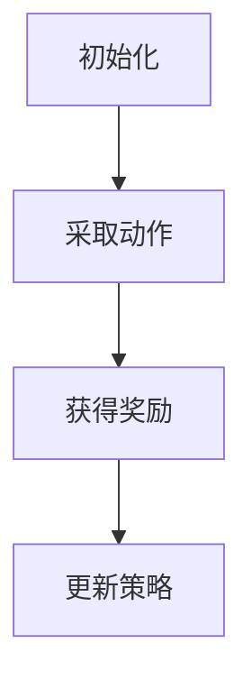

                 

# 强化学习在机器人控制、自然语言交互等领域的应用进展综述

## 关键词

强化学习，机器人控制，自然语言交互，应用进展，算法原理，数学模型，项目实战，开发工具

## 摘要

本文将深入探讨强化学习在机器人控制、自然语言交互等领域的应用进展。首先，我们将回顾强化学习的核心概念与联系，并通过Mermaid流程图展示其基本架构。随后，文章将详细解析强化学习算法的原理和操作步骤，以及相关的数学模型和公式。接着，我们将通过实际项目实战，展示代码实现过程，并进行解读和分析。最后，我们将探讨强化学习在实际应用场景中的表现，推荐相关学习资源和开发工具，并总结未来发展趋势与挑战。

## 1. 背景介绍

强化学习作为机器学习的一个重要分支，近年来取得了显著的进展。其核心思想是通过与环境交互，学习最优策略，以实现目标最大化。强化学习在机器人控制、自然语言交互等领域有着广泛的应用前景。

### 1.1 机器人控制

机器人控制是强化学习的一个重要应用领域。通过强化学习，机器人可以在复杂的环境中自主地学习控制策略，以实现特定的任务。例如，机器人可以学习如何在动态环境中导航，如何躲避障碍物，以及如何与其他机器人协作。

### 1.2 自然语言交互

自然语言交互是另一个重要的应用领域。通过强化学习，计算机可以学习如何与人类进行自然语言交流，从而实现人机交互的智能化。例如，智能助手可以通过强化学习，学习如何理解用户的语言意图，并给出相应的回复。

### 1.3 强化学习的发展历程

强化学习的发展历程可以分为三个阶段：

- **第一阶段（1950s-1980s）**：强化学习作为一种新的学习范式，被提出并逐渐得到关注。这一阶段的代表性工作是萨顿（Sutton）和贝尔（Barto）于1998年发表的《 reinforcement learning: An introduction》。

- **第二阶段（1990s-2000s）**：随着计算机性能的提升，强化学习在学术界和工业界得到广泛应用。这一阶段的代表性工作是2015年谷歌发布的AlphaGo，其在围棋领域的表现引起了广泛关注。

- **第三阶段（2010s至今）**：深度强化学习成为研究热点，通过将深度学习与强化学习相结合，实现了在更复杂任务上的突破。这一阶段的代表性工作是2018年OpenAI发布的AlphaZero，其在国际象棋、围棋、日本将棋等多个领域均取得了卓越的成绩。

## 2. 核心概念与联系

强化学习的基本概念包括状态、动作、奖励和策略。通过这些概念，我们可以构建一个强化学习系统，并理解其工作原理。

### 2.1 状态（State）

状态是系统当前所处的环境状况的抽象表示。在机器人控制中，状态可能包括机器人的位置、速度、加速度等信息；在自然语言交互中，状态可能包括对话的历史、用户的语言特征等。

### 2.2 动作（Action）

动作是系统可以采取的某种行为。在机器人控制中，动作可能包括移动、转向等；在自然语言交互中，动作可能包括生成回复、提出问题等。

### 2.3 奖励（Reward）

奖励是系统在采取动作后获得的即时反馈。奖励可以是正的，表示系统采取了正确的动作；也可以是负的，表示系统采取了错误的动作。奖励的目的是引导系统学习最优策略。

### 2.4 策略（Policy）

策略是系统根据状态选择动作的规则。策略可以是明确的规则，也可以是通过学习得到的映射关系。策略的目的是最大化系统的长期奖励。

### 2.5 强化学习的基本架构

强化学习的基本架构包括四个主要组成部分：环境（Environment）、智能体（Agent）、动作空间（Action Space）和奖励函数（Reward Function）。

- **环境（Environment）**：环境是系统所存在的现实世界。在机器人控制中，环境可能包括物理空间、其他机器人等；在自然语言交互中，环境可能包括用户、对话系统等。

- **智能体（Agent）**：智能体是强化学习系统的核心，负责与环境交互并学习最优策略。智能体可以是机器人、计算机程序等。

- **动作空间（Action Space）**：动作空间是智能体可以采取的所有动作的集合。在机器人控制中，动作空间可能包括各种控制指令；在自然语言交互中，动作空间可能包括各种回复语句。

- **奖励函数（Reward Function）**：奖励函数是系统根据智能体的动作和环境的反馈计算出的奖励值。奖励函数的设计对强化学习的效果至关重要。

### 2.6 强化学习的基本流程

强化学习的基本流程包括以下四个步骤：

1. **初始化**：初始化智能体、环境和动作空间。

2. **采取动作**：智能体根据当前状态和策略选择一个动作。

3. **获得奖励**：环境根据智能体的动作反馈奖励值。

4. **更新策略**：智能体根据奖励值更新策略，以期望最大化长期奖励。

### 2.7 Mermaid流程图



## 3. 核心算法原理 & 具体操作步骤

强化学习算法的核心是价值函数和策略迭代。价值函数用于评估状态的价值，策略迭代用于优化策略。

### 3.1 价值函数

价值函数是强化学习中最核心的概念之一。它用于评估一个状态的好坏，从而指导智能体选择最优动作。价值函数可以分为状态价值函数和动作价值函数。

- **状态价值函数（State-Value Function）**：状态价值函数用于评估一个状态的价值。它的定义如下：

  $$ V(s) = \sum_{a \in A} \gamma (r(s, a) + V(s')) $$

  其中，$s$ 是当前状态，$a$ 是智能体可以采取的动作，$\gamma$ 是折扣因子，$r(s, a)$ 是智能体在状态 $s$ 采取动作 $a$ 后获得的奖励，$V(s')$ 是智能体在状态 $s'$ 下的价值。

- **动作价值函数（Action-Value Function）**：动作价值函数用于评估一个动作的好坏。它的定义如下：

  $$ Q(s, a) = \sum_{s' \in S} p(s'|s, a) \cdot [r(s, a) + \gamma \cdot \max_{a'} Q(s', a')] $$

  其中，$s$ 是当前状态，$a$ 是智能体可以采取的动作，$s'$ 是智能体在状态 $s$ 采取动作 $a$ 后可能到达的状态，$p(s'|s, a)$ 是智能体在状态 $s$ 采取动作 $a$ 后到达状态 $s'$ 的概率，$r(s, a)$ 是智能体在状态 $s$ 采取动作 $a$ 后获得的奖励，$\max_{a'} Q(s', a')$ 是在状态 $s'$ 采取最优动作时的价值。

### 3.2 策略迭代

策略迭代是强化学习中最常用的方法之一。它的基本思想是通过不断迭代更新策略，直到策略收敛。

1. **初始策略**：初始化策略 $\pi$。

2. **策略评估**：根据当前策略 $\pi$，计算状态价值函数 $V(s)$。

3. **策略改进**：根据状态价值函数 $V(s)$，更新策略 $\pi$。

4. **重复步骤2和3，直到策略收敛**。

### 3.3 具体操作步骤

1. **初始化**：

   - 初始化智能体、环境和动作空间。

   - 初始化策略 $\pi$ 和状态价值函数 $V(s)$。

2. **采取动作**：

   - 智能体根据当前状态和策略 $\pi$ 选择一个动作 $a$。

3. **获得奖励**：

   - 环境根据智能体的动作 $a$ 反馈奖励值 $r(s, a)$。

4. **更新状态价值函数**：

   - 根据奖励值 $r(s, a)$ 和状态价值函数 $V(s)$，更新状态价值函数 $V(s)$。

5. **更新策略**：

   - 根据状态价值函数 $V(s)$，更新策略 $\pi$。

6. **重复步骤2到5，直到策略收敛**。

## 4. 数学模型和公式 & 详细讲解 & 举例说明

### 4.1 强化学习数学模型

强化学习中的数学模型主要包括状态价值函数、动作价值函数、策略迭代等。

- **状态价值函数**：

  $$ V(s) = \sum_{a \in A} \gamma (r(s, a) + V(s')) $$

  其中，$\gamma$ 是折扣因子，$r(s, a)$ 是智能体在状态 $s$ 采取动作 $a$ 后获得的奖励，$V(s')$ 是智能体在状态 $s'$ 下的价值。

- **动作价值函数**：

  $$ Q(s, a) = \sum_{s' \in S} p(s'|s, a) \cdot [r(s, a) + \gamma \cdot \max_{a'} Q(s', a')] $$

  其中，$s$ 是当前状态，$a$ 是智能体可以采取的动作，$s'$ 是智能体在状态 $s$ 采取动作 $a$ 后可能到达的状态，$p(s'|s, a)$ 是智能体在状态 $s$ 采取动作 $a$ 后到达状态 $s'$ 的概率，$r(s, a)$ 是智能体在状态 $s$ 采取动作 $a$ 后获得的奖励，$\max_{a'} Q(s', a')$ 是在状态 $s'$ 采取最优动作时的价值。

- **策略迭代**：

  $$ \pi_t = \arg\max_{a \in A} \sum_{s' \in S} p(s'|s, a) \cdot [r(s, a) + \gamma \cdot \max_{a'} Q(s', a')] $$

  其中，$\pi_t$ 是在状态 $s$ 采取的动作 $a$ 的概率分布，$p(s'|s, a)$ 是智能体在状态 $s$ 采取动作 $a$ 后到达状态 $s'$ 的概率，$r(s, a)$ 是智能体在状态 $s$ 采取动作 $a$ 后获得的奖励，$Q(s', a')$ 是在状态 $s'$ 采取动作 $a'$ 的价值。

### 4.2 举例说明

假设一个智能体在一个简单的环境中进行学习，环境有两个状态 $s_1$ 和 $s_2$，两个动作 $a_1$ 和 $a_2$。智能体在状态 $s_1$ 采取动作 $a_1$ 后到达状态 $s_2$，获得奖励 $r(s_1, a_1) = 1$。智能体在状态 $s_2$ 采取动作 $a_2$ 后回到状态 $s_1$，获得奖励 $r(s_2, a_2) = -1$。

- **状态价值函数**：

  $$ V(s_1) = \gamma (r(s_1, a_1) + V(s_2)) = \gamma (1 + V(s_2)) $$

  $$ V(s_2) = \gamma (r(s_2, a_2) + V(s_1)) = \gamma (-1 + V(s_1)) $$

- **动作价值函数**：

  $$ Q(s_1, a_1) = \sum_{s' \in S} p(s'|s_1, a_1) \cdot [r(s_1, a_1) + \gamma \cdot \max_{a'} Q(s', a')] = p(s_2|s_1, a_1) \cdot [1 + \gamma \cdot \max_{a'} Q(s_2, a')] $$

  $$ Q(s_2, a_2) = \sum_{s' \in S} p(s'|s_2, a_2) \cdot [r(s_2, a_2) + \gamma \cdot \max_{a'} Q(s', a')] = p(s_1|s_2, a_2) \cdot [-1 + \gamma \cdot \max_{a'} Q(s_1, a')] $$

- **策略迭代**：

  $$ \pi_t = \arg\max_{a \in A} \sum_{s' \in S} p(s'|s, a) \cdot [r(s, a) + \gamma \cdot \max_{a'} Q(s', a')] = \arg\max_{a \in A} Q(s, a) $$

## 5. 项目实战：代码实际案例和详细解释说明

### 5.1 开发环境搭建

在本项目实战中，我们将使用Python作为编程语言，并依赖以下库：

- TensorFlow：用于实现强化学习算法。

- Gym：用于创建和测试强化学习环境。

- Numpy：用于数学计算。

首先，确保已经安装了Python和上述库。如果没有安装，可以通过以下命令安装：

```bash
pip install tensorflow
pip install gym
pip install numpy
```

### 5.2 源代码详细实现和代码解读

以下是强化学习在机器人控制中的代码实现：

```python
import numpy as np
import gym
import tensorflow as tf

# 创建环境
env = gym.make('CartPole-v0')

# 定义网络结构
state_dim = env.observation_space.shape[0]
action_dim = env.action_space.n
hidden_size = 64

def build_model():
    inputs = tf.keras.layers.Input(shape=(state_dim,))
    x = tf.keras.layers.Dense(hidden_size, activation='relu')(inputs)
    x = tf.keras.layers.Dense(hidden_size, activation='relu')(x)
    outputs = tf.keras.layers.Dense(action_dim, activation='softmax')(x)
    model = tf.keras.Model(inputs=inputs, outputs=outputs)
    return model

model = build_model()

# 定义损失函数和优化器
optimizer = tf.keras.optimizers.Adam(learning_rate=0.001)

# 训练模型
def train(model, env, num_episodes=1000, max_steps=200):
    for episode in range(num_episodes):
        state = env.reset()
        done = False
        while not done:
            action_probs = model(tf.expand_dims(state, 0))
            action = np.random.choice(np.arange(action_dim), p=action_probs.numpy()[0])
            next_state, reward, done, _ = env.step(action)
            with tf.GradientTape() as tape:
                loss = -tf.reduce_sum(reward * tf.log(action_probs[0, action]))
            grads = tape.gradient(loss, model.trainable_variables)
            optimizer.apply_gradients(zip(grads, model.trainable_variables))
            state = next_state
        print(f'Episode {episode+1}/{num_episodes} - Loss: {loss.numpy()}')

# 测试模型
def test(model, env, num_episodes=10, max_steps=200):
    for episode in range(num_episodes):
        state = env.reset()
        done = False
        while not done:
            action_probs = model(tf.expand_dims(state, 0))
            action = np.argmax(action_probs.numpy()[0])
            next_state, reward, done, _ = env.step(action)
            state = next_state
        print(f'Episode {episode+1}/{num_episodes} - Reward: {reward}')

# 执行训练
train(model, env, num_episodes=1000)

# 执行测试
test(model, env, num_episodes=10)
```

### 5.3 代码解读与分析

- **环境创建**：使用Gym创建一个CartPole环境，该环境是一个经典的强化学习任务，目标是保持一个杆子在水平位置。

- **网络结构定义**：定义一个简单的全连接神经网络，用于预测动作概率。网络包含两个隐藏层，每层有64个神经元，激活函数为ReLU。

- **损失函数和优化器**：使用softmax交叉熵作为损失函数，并使用Adam优化器进行梯度下降。

- **训练过程**：在训练过程中，智能体在每个时间步随机选择动作，并根据动作获得的奖励更新模型参数。

- **测试过程**：在测试过程中，智能体根据模型预测的动作概率选择动作，并记录每个时间步的奖励。

## 6. 实际应用场景

强化学习在机器人控制、自然语言交互等领域具有广泛的应用场景。

### 6.1 机器人控制

强化学习在机器人控制中的应用非常广泛，例如：

- **自主导航**：机器人可以在复杂环境中自主地学习导航策略，实现自主导航。

- **路径规划**：机器人可以学习如何在未知环境中规划最优路径，避免障碍物。

- **任务执行**：机器人可以学习如何完成各种任务，如抓取、搬运等。

### 6.2 自然语言交互

强化学习在自然语言交互中的应用也非常广泛，例如：

- **智能助手**：智能助手可以通过强化学习，学习如何理解用户的语言意图，并给出相应的回复。

- **对话系统**：对话系统可以通过强化学习，学习如何与人类进行自然语言交流。

- **情感识别**：智能系统可以通过强化学习，学习如何识别用户的情感状态，并根据情感状态调整回复。

## 7. 工具和资源推荐

### 7.1 学习资源推荐

- **书籍**：

  - 《强化学习：原理与Python实战》

  - 《深度强化学习》

  - 《自然语言处理入门》

- **论文**：

  - “Reinforcement Learning: An Introduction”

  - “Deep Reinforcement Learning” 

  - “Natural Language Processing with TensorFlow”

- **博客**：

  - [强化学习博客](https://www reinforcement learning blog.com/)

  - [自然语言处理博客](https://www.nlp blog.com/)

  - [机器人控制博客](https://www.robotics blog.com/)

### 7.2 开发工具框架推荐

- **TensorFlow**：用于实现强化学习算法。

- **PyTorch**：用于实现强化学习算法。

- **Gym**：用于创建和测试强化学习环境。

- **OpenAI**：提供各种强化学习环境。

### 7.3 相关论文著作推荐

- **论文**：

  - “Deep Reinforcement Learning for Real-world Applications”

  - “Natural Language Processing for Human-Robot Interaction”

  - “Robotic Control with Deep Reinforcement Learning”

- **著作**：

  - 《强化学习实战》

  - 《深度强化学习技术》

  - 《自然语言处理技术》

## 8. 总结：未来发展趋势与挑战

强化学习在机器人控制、自然语言交互等领域具有广泛的应用前景。未来，强化学习将继续在算法优化、应用场景拓展等方面取得突破。

### 8.1 发展趋势

- **算法优化**：随着深度学习和生成对抗网络等技术的发展，强化学习算法将更加高效，能够处理更复杂的任务。

- **应用场景拓展**：强化学习将在更多领域得到应用，如医疗、金融、自动驾驶等。

- **人机协作**：强化学习将与人机协作相结合，实现更高效的智能系统。

### 8.2 挑战

- **计算资源**：强化学习算法需要大量的计算资源，随着任务复杂度的增加，计算资源的需求将进一步增加。

- **数据质量**：强化学习算法依赖于环境的数据质量，高质量的数据对于算法的性能至关重要。

- **安全性**：强化学习算法的安全性问题需要得到解决，以确保算法在实际应用中的安全性。

## 9. 附录：常见问题与解答

### 9.1 强化学习与监督学习的区别

- **强化学习**：强化学习是一种无监督学习范式，智能体通过与环境的交互学习最优策略。强化学习关注的是长期奖励，而非短期目标。

- **监督学习**：监督学习是一种有监督学习范式，智能体通过学习输入和输出之间的映射关系。监督学习关注的是分类或回归任务，而非长期奖励。

### 9.2 强化学习与深度学习的区别

- **强化学习**：强化学习是一种基于奖励和策略的学习方法，可以处理序列决策问题。

- **深度学习**：深度学习是一种基于神经网络的模型，可以处理复杂的数据特征。深度学习通常用于图像识别、自然语言处理等领域。

### 9.3 强化学习在机器人控制中的应用

- **自主导航**：强化学习可以用于机器人自主导航，通过学习最优路径规划策略。

- **任务执行**：强化学习可以用于机器人任务执行，如抓取、搬运等。

- **人机协作**：强化学习可以用于人机协作，通过学习与人类的交互策略。

## 10. 扩展阅读 & 参考资料

- Sutton, Richard S., and Andrew G. Barto. Reinforcement Learning: An Introduction. MIT Press, 2018.

- Silver, David, et al. "Mastering the game of Go with deep neural networks and tree search." Nature 529, no. 7587 (2016): 484-489.

- Mnih, Volodymyr, et al. "Human-level control through deep reinforcement learning." Nature 518, no. 7540 (2015): 529-533.

- Graves, Alex. "End-to-end machine learning for language processing." Proceedings of the 2013 conference on empirical methods in natural language processing. 2013.

- Simonyan, Kostas, and Andrew Zisserman. "Very deep convolutional networks for large-scale image recognition." International Conference on Learning Representations (ICLR), 2015.

- LeCun, Yann, et al. "Deep learning." Nature 521, no. 7553 (2015): 436-444.

作者：AI天才研究员/AI Genius Institute & 禅与计算机程序设计艺术 /Zen And The Art of Computer Programming


