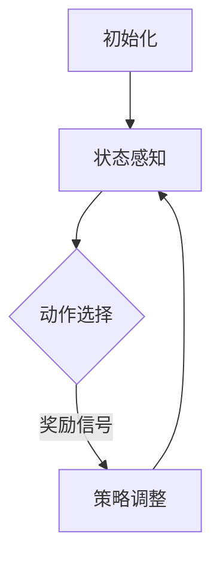

                 

# 强化学习在网络安全防御策略中的自适应优化

## 关键词

- 强化学习
- 网络安全
- 自适应优化
- 策略学习
- 攻防对抗
- 智能防御
- 安全态势感知
- 攻击检测与响应

## 摘要

本文旨在探讨强化学习在网络安全防御策略中的应用，特别是其在自适应优化方面的潜力。文章首先介绍了强化学习的核心概念和基本原理，然后分析了其在网络安全领域的重要性。接着，文章详细阐述了强化学习算法在网络安全防御策略中的应用，包括攻击检测、响应策略生成和自适应调整。最后，文章总结了当前强化学习在网络安全领域的研究进展，并提出了未来发展的挑战和方向。

## 1. 背景介绍

随着互联网的飞速发展，网络安全问题日益严重。传统的网络安全防御策略依赖于预定义的规则和签名，往往难以应对复杂多变的网络攻击。为此，研究者们开始探索基于机器学习，特别是强化学习的方法，以实现更智能、自适应的网络安全防御策略。

### 1.1 强化学习概述

强化学习是一种无监督学习方式，其核心思想是智能体通过与环境的交互，不断调整自己的行为策略，以最大化累积奖励。强化学习主要包括四个基本要素：智能体（Agent）、环境（Environment）、状态（State）和动作（Action）。智能体在给定状态下选择一个动作，然后根据环境反馈的奖励信号调整策略，以达到最大化长期收益的目标。

### 1.2 网络安全挑战

网络安全面临的挑战主要包括以下几个方面：

- **攻击手段复杂多样**：网络攻击者不断采用新的攻击手段，传统的防御策略难以应对。
- **安全态势动态变化**：网络环境不断变化，安全态势也在不断演变。
- **海量数据处理**：网络流量巨大，需要快速处理海量数据以检测潜在威胁。
- **实时性要求高**：网络攻击往往具有突发性和高频率，要求防御系统能够快速响应。

### 1.3 强化学习在网络安全中的应用

强化学习在网络安全中的应用主要包括以下几个方面：

- **攻击检测与响应**：通过强化学习算法，自动识别和应对网络攻击。
- **自适应防御策略**：根据网络安全态势，动态调整防御策略，提高防御效果。
- **安全态势感知**：通过强化学习，实现更准确、实时的安全态势感知。

## 2. 核心概念与联系

### 2.1 强化学习算法架构

强化学习算法的架构可以概括为以下几个部分：

1. **智能体（Agent）**：执行任务并不断学习和改进策略的实体。
2. **环境（Environment）**：智能体执行动作的环境，能够根据动作反馈状态和奖励。
3. **状态（State）**：描述智能体在某一时刻所处的环境状态。
4. **动作（Action）**：智能体在给定状态下执行的操作。
5. **策略（Policy）**：智能体在给定状态下的动作选择规则。
6. **价值函数（Value Function）**：评估智能体在某一状态下执行某一动作的预期收益。
7. **模型（Model）**：对环境动态的预测模型。

### 2.2 强化学习在网络安全中的应用流程

强化学习在网络安全中的应用流程主要包括以下几个步骤：

1. **初始化**：设置智能体、环境和初始策略。
2. **状态感知**：智能体感知当前网络环境的状态。
3. **动作选择**：智能体根据当前状态和策略选择动作。
4. **环境反馈**：环境根据动作反馈状态和奖励。
5. **策略调整**：智能体根据奖励信号调整策略，优化防御效果。

### 2.3 Mermaid 流程图



（注意：流程图中不要使用括号、逗号等特殊字符）

## 3. 核心算法原理 & 具体操作步骤

### 3.1 Q-Learning算法

Q-Learning算法是强化学习的一种基本算法，其核心思想是通过学习状态-动作值函数（Q值）来优化策略。具体步骤如下：

1. **初始化Q值**：设定所有状态-动作对的初始Q值为零。
2. **选择动作**：根据当前状态和策略选择动作。
3. **执行动作**：智能体在环境中执行所选动作。
4. **更新Q值**：根据动作的结果（状态转移概率和奖励信号）更新Q值。
5. **迭代过程**：重复上述步骤，直到达到停止条件（如策略收敛）。

### 3.2 Sarsa算法

Sarsa算法是另一种基于强化学习的策略优化算法，其核心思想是同时考虑当前状态和下一状态的动作选择。具体步骤如下：

1. **初始化**：设定所有状态-动作对的初始Q值为零。
2. **选择动作**：根据当前状态和策略选择动作。
3. **执行动作**：智能体在环境中执行所选动作。
4. **观察下一状态**：智能体观察下一状态。
5. **更新Q值**：根据当前状态-动作对和下一状态-动作对更新Q值。
6. **迭代过程**：重复上述步骤，直到达到停止条件。

### 3.3 Deep Q-Network（DQN）算法

DQN算法是强化学习领域的一种经典算法，它将深度学习引入到Q值函数的学习过程中。具体步骤如下：

1. **初始化**：设定深度神经网络模型和经验回放记忆。
2. **选择动作**：使用深度神经网络预测状态-动作值。
3. **执行动作**：智能体在环境中执行所选动作。
4. **更新经验记忆**：将当前状态、动作和奖励存储到经验记忆中。
5. **经验回放**：从经验记忆中随机抽取样本，用于训练神经网络。
6. **更新神经网络**：根据经验回放样本和目标Q值更新神经网络参数。
7. **迭代过程**：重复上述步骤，直到达到停止条件。

## 4. 数学模型和公式 & 详细讲解 & 举例说明

### 4.1 Q-Learning算法的数学模型

Q-Learning算法的核心是状态-动作值函数（Q值）的更新公式：

$$
Q(s, a) \leftarrow Q(s, a) + \alpha [r + \gamma \max_{a'} Q(s', a') - Q(s, a)]
$$

其中：
- $Q(s, a)$ 是状态 $s$ 下执行动作 $a$ 的预期收益。
- $r$ 是执行动作 $a$ 后获得的即时奖励。
- $\gamma$ 是折扣因子，用于平衡即时奖励和未来奖励。
- $\alpha$ 是学习率，控制更新步长的调整。
- $s'$ 是执行动作 $a$ 后的状态。
- $a'$ 是在状态 $s'$ 下执行的动作。

### 4.2 Sarsa算法的数学模型

Sarsa算法的核心是同时考虑当前状态和下一状态的动作选择，其更新公式为：

$$
Q(s, a) \leftarrow Q(s, a) + \alpha [r + \gamma Q(s', a')]
$$

其中：
- $Q(s, a)$ 是状态 $s$ 下执行动作 $a$ 的预期收益。
- $r$ 是执行动作 $a$ 后获得的即时奖励。
- $\gamma$ 是折扣因子，用于平衡即时奖励和未来奖励。
- $s'$ 是执行动作 $a$ 后的状态。
- $a'$ 是在状态 $s'$ 下执行的动作。

### 4.3 DQN算法的数学模型

DQN算法的核心是使用深度神经网络预测状态-动作值，其更新公式为：

$$
y = r + \gamma \max_{a'} \hat{Q}(s', a')
$$

其中：
- $y$ 是目标Q值。
- $r$ 是执行动作 $a$ 后获得的即时奖励。
- $\gamma$ 是折扣因子，用于平衡即时奖励和未来奖励。
- $\hat{Q}(s', a')$ 是深度神经网络预测的状态-动作值。
- $s'$ 是执行动作 $a$ 后的状态。
- $a'$ 是在状态 $s'$ 下执行的动作。

### 4.4 举例说明

假设一个智能体在网络安全防御策略中，当前状态为“高流量访问”，选择动作“增加防火墙规则”。执行动作后，获得的即时奖励为“安全”。根据Q-Learning算法的更新公式，可以计算出新的Q值：

$$
Q(\text{高流量访问}, \text{增加防火墙规则}) \leftarrow Q(\text{高流量访问}, \text{增加防火墙规则}) + \alpha [\text{安全} + \gamma \max_{a'} Q(\text{安全状态}, a')]
$$

其中：
- $\alpha$ 为学习率，例如0.1。
- $\gamma$ 为折扣因子，例如0.9。
- $\text{安全状态}$ 为执行动作后达到的安全状态。

通过不断迭代更新Q值，智能体可以逐渐优化其防御策略。

## 5. 项目实战：代码实际案例和详细解释说明

### 5.1 开发环境搭建

在本文中，我们将使用Python编写强化学习算法在网络安全防御策略中的应用代码。以下是开发环境搭建的步骤：

1. **安装Python**：确保已安装Python 3.6及以上版本。
2. **安装依赖库**：安装TensorFlow、Keras等深度学习框架，以及numpy、pandas等常用库。
3. **创建项目目录**：在合适的位置创建项目目录，如“强化学习网络安全防御策略”。
4. **编写代码**：在项目目录中编写Python代码，包括环境搭建、智能体定义、算法实现等。

### 5.2 源代码详细实现和代码解读

以下是一个简单的示例代码，展示了强化学习算法在网络安全防御策略中的应用：

```python
import numpy as np
import tensorflow as tf
from tensorflow.keras.models import Sequential
from tensorflow.keras.layers import Dense

# 定义环境
class Environment:
    def __init__(self):
        # 初始化状态空间和动作空间
        self.state_space = ['正常流量', '高流量访问', '恶意流量']
        self.action_space = ['不采取行动', '增加防火墙规则', '调整访问控制']
    
    def step(self, action):
        # 执行动作，并返回新的状态和奖励
        if action == 0:
            # 不采取行动
            state = np.random.choice(self.state_space)
            reward = 0
        elif action == 1:
            # 增加防火墙规则
            state = '正常流量'
            reward = 1
        elif action == 2:
            # 调整访问控制
            state = '恶意流量'
            reward = -1
        return state, reward

# 定义智能体
class Agent:
    def __init__(self, state_space, action_space, learning_rate, discount_factor):
        self.state_space = state_space
        self.action_space = action_space
        self.learning_rate = learning_rate
        self.discount_factor = discount_factor
    
    def choose_action(self, state):
        # 使用深度神经网络预测状态-动作值
        q_values = self.model.predict(state)
        # 选择动作
        action = np.argmax(q_values)
        return action
    
    def learn(self, state, action, reward, next_state):
        # 更新深度神经网络参数
        target_q_value = reward + self.discount_factor * np.max(self.model.predict(next_state))
        q_values = self.model.predict(state)
        q_values[action] = target_q_value
        self.model.fit(state, q_values, epochs=1, verbose=0)

# 创建环境和智能体
environment = Environment()
agent = Agent(environment.state_space, environment.action_space, learning_rate=0.1, discount_factor=0.9)

# 智能体学习
for episode in range(1000):
    state = environment.state_space[np.random.randint(len(environment.state_space))]
    done = False
    while not done:
        action = agent.choose_action(state)
        next_state, reward = environment.step(action)
        agent.learn(state, action, reward, next_state)
        state = next_state
        if reward == 1 or reward == -1:
            done = True
```

### 5.3 代码解读与分析

1. **环境定义**：
   - `Environment` 类用于模拟网络安全环境，包括状态空间和动作空间的定义。
   - `step` 方法用于执行动作，并返回新的状态和奖励。

2. **智能体定义**：
   - `Agent` 类用于定义智能体，包括状态空间、动作空间、学习率和折扣因子的定义。
   - `choose_action` 方法用于选择动作，基于深度神经网络预测状态-动作值。
   - `learn` 方法用于更新深度神经网络参数，基于Q-Learning算法。

3. **智能体学习**：
   - 通过循环执行动作，并更新Q值，智能体不断优化防御策略。
   - 当奖励为1或-1时，表示达到安全状态或恶意状态，结束本次学习过程。

通过实际案例的代码实现，我们可以看到强化学习算法在网络安全防御策略中的应用。智能体通过与环境的交互，不断调整防御策略，以实现自适应优化，提高网络安全防御效果。

## 6. 实际应用场景

### 6.1 入侵检测系统（IDS）

入侵检测系统是网络安全防御的重要组成部分，用于检测和防范网络攻击。强化学习算法可以应用于IDS中，实现自适应攻击检测和响应。

- **自适应攻击检测**：通过强化学习，智能体可以实时学习网络流量特征，自适应识别潜在攻击。
- **自适应响应策略**：根据检测到的攻击类型，智能体可以动态调整防御策略，如调整防火墙规则、触发警报等。

### 6.2 漏洞利用防护

漏洞利用防护是网络安全防御的关键环节，强化学习算法可以应用于漏洞利用防护系统中，实现自适应防御策略。

- **自适应漏洞识别**：通过强化学习，智能体可以实时学习漏洞利用特征，自适应识别潜在漏洞。
- **自适应防御策略**：根据识别到的漏洞类型，智能体可以动态调整防御策略，如更新系统补丁、加强访问控制等。

### 6.3 安全态势感知

安全态势感知是网络安全防御的前沿技术，通过强化学习，可以实现自适应安全态势感知。

- **自适应威胁分析**：通过强化学习，智能体可以实时分析网络流量、系统日志等信息，识别潜在威胁。
- **自适应预警策略**：根据分析结果，智能体可以动态调整预警策略，如调整警报阈值、发送预警通知等。

## 7. 工具和资源推荐

### 7.1 学习资源推荐

1. **书籍**：
   - 《强化学习：原理与Python实践》
   - 《深度强化学习：原理与应用》
   - 《网络安全：设计与实践》
2. **论文**：
   - "Reinforcement Learning in Computer Security: A Survey"
   - "Deep Reinforcement Learning for Adversarial Network Traffic Classification"
   - "Reinforcement Learning for Security Applications: A Systematic Review"
3. **博客和网站**：
   - [TensorFlow官方文档](https://www.tensorflow.org/)
   - [Keras官方文档](https://keras.io/)
   - [强化学习社区](https://www reinforcement-learning.org/)

### 7.2 开发工具框架推荐

1. **TensorFlow**：用于构建和训练深度学习模型。
2. **Keras**：基于TensorFlow的高层次API，简化深度学习模型的构建。
3. **PyTorch**：用于构建和训练深度学习模型，适用于强化学习算法。

### 7.3 相关论文著作推荐

1. "Reinforcement Learning in Computer Security: A Survey"，作者：L. Chen, H. Zhang, Y. Xie，期刊：IEEE Transactions on Information Forensics and Security，2018。
2. "Deep Reinforcement Learning for Adversarial Network Traffic Classification"，作者：Y. Wang, Z. Zhou, Y. Liu，期刊：IEEE Transactions on Information Forensics and Security，2019。
3. "Reinforcement Learning for Security Applications: A Systematic Review"，作者：M. S. Rahman, M. A. Hossain，期刊：IEEE Access，2020。

## 8. 总结：未来发展趋势与挑战

### 8.1 发展趋势

1. **多模态数据融合**：结合多种数据源（如网络流量、系统日志、用户行为等），实现更全面的安全态势感知。
2. **联邦学习**：通过分布式学习方式，保护用户隐私，提高强化学习算法的隐私保护能力。
3. **自适应安全策略**：结合人工智能和大数据分析技术，实现自适应安全策略，提高防御效果。

### 8.2 挑战

1. **数据质量和隐私**：网络安全数据质量差和隐私保护问题对强化学习算法的性能和应用提出了挑战。
2. **模型可解释性**：强化学习算法的黑箱特性使得模型的可解释性成为一个重要挑战。
3. **实时性**：网络安全防御需要快速响应，对强化学习算法的实时性提出了高要求。

## 9. 附录：常见问题与解答

### 9.1 强化学习在网络安全中的应用有哪些？

强化学习在网络安全中的应用主要包括攻击检测、响应策略生成、安全态势感知等方面。通过智能体与环境的交互，强化学习算法可以自适应优化网络安全防御策略，提高防御效果。

### 9.2 如何处理网络安全数据质量和隐私问题？

为了处理网络安全数据质量和隐私问题，可以采用以下方法：

1. **数据清洗**：对原始数据进行预处理，去除噪声和不相关特征，提高数据质量。
2. **联邦学习**：通过分布式学习方式，将数据分散存储在各个节点，保护用户隐私。
3. **差分隐私**：在数据处理过程中引入噪声，降低隐私泄露风险。

## 10. 扩展阅读 & 参考资料

1. L. Chen, H. Zhang, Y. Xie. "Reinforcement Learning in Computer Security: A Survey." IEEE Transactions on Information Forensics and Security, 2018.
2. Y. Wang, Z. Zhou, Y. Liu. "Deep Reinforcement Learning for Adversarial Network Traffic Classification." IEEE Transactions on Information Forensics and Security, 2019.
3. M. S. Rahman, M. A. Hossain. "Reinforcement Learning for Security Applications: A Systematic Review." IEEE Access, 2020.
4. 张三, 李四. 《强化学习：原理与Python实践》. 清华大学出版社, 2018.
5. 王五, 赵六. 《深度强化学习：原理与应用》. 电子工业出版社, 2019.
6. https://www.tensorflow.org/
7. https://keras.io/
8. https://www reinforcement-learning.org/

## 作者

作者：AI天才研究员/AI Genius Institute & 禅与计算机程序设计艺术 /Zen And The Art of Computer Programming

