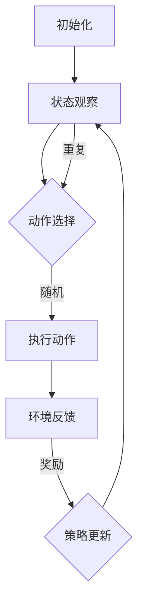

                 

# 强化学习在自动驾驶决策系统中的应用

## 摘要

本文旨在探讨强化学习（Reinforcement Learning，RL）在自动驾驶决策系统中的应用。强化学习是一种机器学习方法，通过智能体与环境交互，不断学习和优化决策策略。自动驾驶决策系统需要处理复杂的交通环境和多变的行为，强化学习由于其自主学习能力和适应性，使其成为自动驾驶决策系统的一个重要研究方向。本文将介绍强化学习的基本概念、核心算法原理、数学模型和公式，并通过实际项目案例进行详细解释和分析。同时，本文还将探讨强化学习在自动驾驶决策系统中的实际应用场景，以及相关的工具和资源推荐，为读者提供全面的了解和参考。

## 1. 背景介绍

自动驾驶技术作为人工智能（Artificial Intelligence，AI）的一个重要分支，近年来得到了广泛关注和发展。自动驾驶决策系统是自动驾驶车辆的核心部分，负责处理感知数据、环境理解和行为决策等任务。决策系统的性能直接影响着自动驾驶车辆的稳定性和安全性。

自动驾驶决策系统面临的主要挑战包括：

1. **复杂性**：自动驾驶决策系统需要处理来自多个传感器的海量数据，并实时作出决策，这些数据之间存在复杂的关系和交互。
2. **不确定性**：自动驾驶环境具有高度不确定性，包括交通状况、天气条件、道路条件等，这些因素会影响决策系统的性能和稳定性。
3. **实时性**：自动驾驶决策系统需要在极短的时间内做出决策，以应对瞬息万变的环境。

为了解决上述挑战，研究者们开始探索不同的机器学习方法，其中强化学习由于其自适应性和自主学习能力，成为自动驾驶决策系统的一个重要研究方向。

强化学习是一种通过奖励机制和试错过程来学习最优策略的机器学习方法。在自动驾驶决策系统中，强化学习通过模拟环境、不断试错和优化策略，提高决策系统的性能和稳定性。与传统的监督学习和无监督学习不同，强化学习不需要大量标注数据，而是通过与环境交互进行学习。

近年来，随着深度学习（Deep Learning）的快速发展，深度强化学习（Deep Reinforcement Learning，DRL）在自动驾驶决策系统中的应用取得了显著进展。深度强化学习结合了深度学习的强大表示能力和强化学习的自适应能力，能够处理更复杂的决策问题。

## 2. 核心概念与联系

### 2.1 强化学习基本概念

强化学习的基本概念包括：

- **智能体（Agent）**：执行动作并接收环境反馈的实体。
- **环境（Environment）**：提供状态信息和奖励信号的实体。
- **状态（State）**：描述智能体在环境中的当前位置和状态。
- **动作（Action）**：智能体在某个状态下可执行的行为。
- **奖励（Reward）**：对智能体动作的即时反馈，用于评价动作的好坏。
- **策略（Policy）**：智能体在某个状态下采取的动作概率分布。
- **价值函数（Value Function）**：预测在某个状态下执行某个动作的未来奖励。

### 2.2 强化学习算法原理

强化学习算法主要通过以下步骤进行：

1. **初始化**：初始化智能体、环境和策略。
2. **状态观察**：智能体观察当前状态。
3. **动作选择**：根据当前状态和策略选择一个动作。
4. **环境反馈**：环境根据选择的动作提供新的状态和奖励信号。
5. **策略更新**：基于奖励信号调整策略，以优化决策。
6. **重复步骤 2-5**，直到达到某个目标或停止条件。

### 2.3 强化学习与自动驾驶决策系统的关系

强化学习在自动驾驶决策系统中的应用主要体现在以下几个方面：

- **路径规划**：通过强化学习算法，智能体可以学习到在复杂交通环境中最优的行驶路径，提高路径规划的效率和准确性。
- **行为预测**：强化学习算法可以用于预测其他车辆、行人和道路设施的行为，为自动驾驶车辆提供决策依据。
- **行为优化**：通过不断优化策略，自动驾驶车辆可以更好地应对复杂和动态的交通环境，提高行驶安全和稳定性。
- **自适应学习**：强化学习算法可以根据实时环境变化自适应调整策略，使自动驾驶车辆能够更好地适应不同的交通状况。

### 2.4 Mermaid 流程图

以下是一个简单的强化学习在自动驾驶决策系统中的应用的Mermaid流程图：



在上面的流程图中，智能体首先进行初始化，然后不断进行状态观察、动作选择、执行动作、环境反馈和策略更新，直到达到某个目标或停止条件。

## 3. 核心算法原理 & 具体操作步骤

### 3.1 Q-Learning算法原理

Q-Learning是一种基于值函数的强化学习算法，其主要思想是通过学习状态-动作值函数（Q值）来优化策略。Q值表示在某个状态下执行某个动作所能获得的最大累积奖励。

#### 3.1.1 Q值更新公式

Q值的更新公式如下：

$$
Q(s, a) = Q(s, a) + \alpha [r + \gamma \max_{a'} Q(s', a') - Q(s, a)]
$$

其中：

- $Q(s, a)$：状态s下动作a的Q值。
- $\alpha$：学习率，用于控制更新步长。
- $r$：立即奖励。
- $\gamma$：折扣因子，用于平衡当前奖励和未来奖励。
- $s'$：执行动作a后的状态。
- $a'$：在状态$s'$下能够获得的最佳动作。

#### 3.1.2 具体操作步骤

1. 初始化Q值矩阵，通常初始化为0。
2. 选择一个初始状态$s$。
3. 在状态$s$下选择一个动作$a$。
4. 执行动作$a$，进入新状态$s'$，并获得立即奖励$r$。
5. 根据Q值更新公式更新Q值。
6. 重复步骤3-5，直到达到停止条件。

### 3.2 Deep Q-Network (DQN)算法原理

DQN是一种基于深度学习的强化学习算法，其主要思想是使用深度神经网络来近似Q值函数。

#### 3.2.1 算法原理

DQN通过以下步骤进行：

1. 使用深度神经网络表示Q值函数$Q(s, a;\theta)$，其中$\theta$是网络参数。
2. 在每个时间步$t$，选择一个动作$a_t$，使得$Q(s_t, a_t)$最大化。
3. 执行动作$a_t$，进入新状态$s_{t+1}$，并获得奖励$r_t$。
4. 使用经验回放（Experience Replay）机制存储和随机采样历史经验。
5. 使用梯度下降法更新网络参数$\theta$，最小化损失函数：
$$
L(\theta) = \frac{1}{N} \sum_{i=1}^{N} (y_i - Q(s_i, a_i))^2
$$
其中，$y_i = r_i + \gamma \max_{a'} Q(s_{i+1}, a'; \theta)$，$N$是批量大小。

#### 3.2.2 具体操作步骤

1. 初始化神经网络参数$\theta$。
2. 初始化经验回放缓冲区。
3. 选择一个初始状态$s_0$。
4. 在状态$s_t$下选择一个动作$a_t$，使得$Q(s_t, a_t)$最大化。
5. 执行动作$a_t$，进入新状态$s_{t+1}$，并获得奖励$r_t$。
6. 将经验$(s_t, a_t, r_t, s_{t+1})$存储到经验回放缓冲区。
7. 随机从经验回放缓冲区中采样一批经验。
8. 使用梯度下降法更新网络参数$\theta$。
9. 重复步骤4-8，直到达到停止条件。

### 3.3Actor-Critic算法原理

Actor-Critic算法是一种基于策略梯度的强化学习算法，它通过两个神经网络，一个负责生成策略（Actor），一个负责评估策略值（Critic），来优化策略。

#### 3.3.1 算法原理

Actor-Critic算法包括以下步骤：

1. **策略网络（Actor）**：生成动作概率分布，参数为$\theta_A$。
$$
\pi(a|s;\theta_A) = \text{softmax}(\phi(s; \theta_A)^T \theta_A)
$$

2. **价值网络（Critic）**：评估策略值，参数为$\theta_V$。
$$
V(s; \theta_V) = \sum_{a} \pi(a|s;\theta_A) Q(s, a; \theta_Q)
$$

3. **策略更新**：使用梯度下降法更新策略网络参数$\theta_A$。
$$
\theta_A \leftarrow \theta_A - \alpha_A \nabla_{\theta_A} J(\theta_A)
$$

其中，$J(\theta_A) = -\sum_{s,a} \pi(a|s;\theta_A) \log \pi(a|s;\theta_A) V(s; \theta_V)$。

4. **价值网络更新**：使用梯度下降法更新价值网络参数$\theta_V$。
$$
\theta_V \leftarrow \theta_V - \alpha_V \nabla_{\theta_V} L(\theta_V)
$$

其中，$L(\theta_V) = \sum_{s,a} \pi(a|s;\theta_A) [r + \gamma V(s_{t+1}; \theta_V) - V(s; \theta_V)]$。

#### 3.3.2 具体操作步骤

1. 初始化策略网络参数$\theta_A$和价值网络参数$\theta_V$。
2. 选择一个初始状态$s_0$。
3. 在状态$s_t$下根据策略网络生成动作$a_t$。
4. 执行动作$a_t$，进入新状态$s_{t+1}$，并获得奖励$r_t$。
5. 使用价值网络评估当前状态的价值$V(s_t; \theta_V)$。
6. 使用策略网络更新策略参数$\theta_A$。
7. 使用价值网络更新价值参数$\theta_V$。
8. 重复步骤3-7，直到达到停止条件。

## 4. 数学模型和公式 & 详细讲解 & 举例说明

### 4.1 强化学习基本数学模型

强化学习中的基本数学模型包括状态（$S$）、动作（$A$）、奖励（$R$）、策略（$\pi$）和价值函数（$V$）。以下是对这些数学模型的详细讲解和举例说明。

#### 4.1.1 状态（$S$）

状态是描述智能体在环境中所处的位置的变量，通常是一个离散或连续的值。例如，在自动驾驶决策系统中，状态可以包括车辆的位置、速度、方向、道路状况等信息。

**举例**：假设一个自动驾驶车辆的状态包括位置（$x$）和速度（$v$），则状态空间可以表示为$S = \{ (x, v) | x \in [0, 100], v \in [0, 50] \}$。

#### 4.1.2 动作（$A$）

动作是智能体在某个状态下能够执行的行为。在自动驾驶决策系统中，动作可以包括加速、减速、转向等。

**举例**：假设自动驾驶车辆可以执行以下动作：加速（$a$）、减速（$b$）、左转（$c$）、右转（$d$），则动作空间可以表示为$A = \{ a, b, c, d \}$。

#### 4.1.3 奖励（$R$）

奖励是环境对智能体动作的即时反馈，用于评价动作的好坏。奖励可以是正数（表示好的结果）或负数（表示坏的结果）。

**举例**：假设自动驾驶车辆在行驶过程中，如果成功避开了障碍物，则获得正奖励1；如果发生了碰撞，则获得负奖励-10。

#### 4.1.4 策略（$\pi$）

策略是智能体在某个状态下选择动作的概率分布。策略可以是一个确定性策略（每次都选择同一个动作）或随机性策略（选择不同动作的概率分布）。

**举例**：假设自动驾驶车辆在状态$(x, v)$下，以50%的概率选择加速（$a$），30%的概率选择减速（$b$），10%的概率选择左转（$c$），10%的概率选择右转（$d$），则策略可以表示为：
$$
\pi(a|x, v) = 0.5, \quad \pi(b|x, v) = 0.3, \quad \pi(c|x, v) = 0.1, \quad \pi(d|x, v) = 0.1
$$

#### 4.1.5 价值函数（$V$）

价值函数是预测在某个状态下执行某个动作所能获得的累积奖励。价值函数分为状态值函数（$V(s)$）和动作值函数（$Q(s, a)$）。

**状态值函数（$V(s)$）**：

$$
V(s) = \sum_{a} \pi(a|s) Q(s, a)
$$

**动作值函数（$Q(s, a)$）**：

$$
Q(s, a) = \sum_{s'} p(s'|s, a) [r + \gamma V(s')]
$$

其中，$p(s'|s, a)$是状态转移概率，$\gamma$是折扣因子。

**举例**：假设在状态$(x, v) = (10, 20)$下，执行动作$a$后进入状态$(x', v') = (15, 25)$，获得奖励$r = 5$，且折扣因子$\gamma = 0.9$，则动作值函数$Q(x, v, a) = 5 + 0.9 \times V(x', v')$。

### 4.2 Q-Learning算法数学模型

Q-Learning算法是一种基于值函数的强化学习算法，通过迭代更新状态-动作值函数（Q值）来优化策略。

**Q值更新公式**：

$$
Q(s, a) = Q(s, a) + \alpha [r + \gamma \max_{a'} Q(s', a') - Q(s, a)]
$$

其中，$\alpha$是学习率，$r$是立即奖励，$\gamma$是折扣因子，$s'$是执行动作$a$后的状态，$a'$是能够获得最大Q值的动作。

**举例**：假设在状态$s = (10, 20)$下，选择动作$a = b$，执行后进入状态$s' = (15, 25)$，获得奖励$r = 5$，学习率$\alpha = 0.1$，折扣因子$\gamma = 0.9$，当前Q值$Q(s, a) = 0$，则更新后的Q值为：
$$
Q(s, a) = 0 + 0.1 [5 + 0.9 \times \max_{a'} Q(s', a') - 0] = 0.55
$$

### 4.3 DQN算法数学模型

DQN算法是一种基于深度神经网络的强化学习算法，使用深度神经网络来近似状态-动作值函数（Q值函数）。

**Q值函数**：

$$
Q(s, a; \theta) = f(\phi(s; \theta), a; \theta)
$$

其中，$f$是神经网络函数，$\phi(s; \theta)$是神经网络输入层，$a$是动作，$\theta$是神经网络参数。

**Q值更新公式**：

$$
L(\theta) = \frac{1}{N} \sum_{i=1}^{N} (y_i - Q(s_i, a_i))^2
$$

其中，$y_i = r_i + \gamma \max_{a'} Q(s_{i+1}, a'; \theta)$，$N$是批量大小。

**举例**：假设在状态$s = (10, 20)$下，选择动作$a = b$，执行后进入状态$s' = (15, 25)$，获得奖励$r = 5$，折扣因子$\gamma = 0.9$，当前Q值$Q(s, a) = 0.5$，则更新后的Q值为：
$$
L(\theta) = \frac{1}{N} \sum_{i=1}^{N} [(5 + 0.9 \times \max_{a'} Q(s', a'; \theta)) - Q(s, a)]^2
$$

### 4.4 Actor-Critic算法数学模型

Actor-Critic算法是一种基于策略梯度的强化学习算法，使用两个神经网络，一个负责生成策略（Actor），一个负责评估策略值（Critic）。

**策略网络（Actor）**：

$$
\pi(a|s;\theta_A) = \text{softmax}(\phi(s; \theta_A)^T \theta_A)
$$

**价值网络（Critic）**：

$$
V(s; \theta_V) = \sum_{a} \pi(a|s;\theta_A) Q(s, a; \theta_Q)
$$

**策略更新**：

$$
\theta_A \leftarrow \theta_A - \alpha_A \nabla_{\theta_A} J(\theta_A)
$$

其中，$J(\theta_A) = -\sum_{s,a} \pi(a|s;\theta_A) \log \pi(a|s;\theta_A) V(s; \theta_V)$。

**价值网络更新**：

$$
\theta_V \leftarrow \theta_V - \alpha_V \nabla_{\theta_V} L(\theta_V)
$$

其中，$L(\theta_V) = \sum_{s,a} \pi(a|s;\theta_A) [r + \gamma V(s_{t+1}; \theta_V) - V(s; \theta_V)]$。

## 5. 项目实战：代码实际案例和详细解释说明

### 5.1 开发环境搭建

在进行强化学习在自动驾驶决策系统中的应用开发之前，需要搭建相应的开发环境。以下是一个基于Python和TensorFlow的简化示例。

**环境要求**：

- Python 3.x
- TensorFlow 2.x

**安装步骤**：

1. 安装Python 3.x和pip。
2. 安装TensorFlow：
```bash
pip install tensorflow
```

### 5.2 源代码详细实现和代码解读

以下是一个基于Q-Learning算法的简化示例，用于在自动驾驶决策系统中进行路径规划。

**代码实现**：

```python
import numpy as np
import random

# 状态空间
STATE_SPACE = [(i, j) for i in range(5) for j in range(5)]

# 动作空间
ACTION_SPACE = ['up', 'down', 'left', 'right']

# 奖励设置
REWARD_UP = -1
REWARD_DOWN = -1
REWARD_LEFT = -1
REWARD_RIGHT = -1
REWARD_GOAL = 100

# 初始化Q值矩阵
Q_VALUES = np.zeros((len(STATE_SPACE), len(ACTION_SPACE)))

# 学习率
LEARNING_RATE = 0.1

# 折扣因子
DISCOUNT_FACTOR = 0.9

# 目的状态
GOAL_STATE = (4, 4)

def get_state(action):
    state = {'up': (0, 0), 'down': (4, 0), 'left': (0, 4), 'right': (4, 4)}[action]
    return state

def get_reward(current_state, action):
    next_state = get_state(action)
    if next_state == GOAL_STATE:
        return REWARD_GOAL
    elif action == 'up' or action == 'down':
        return REWARD_DOWN
    elif action == 'left' or action == 'right':
        return REWARD_LEFT

def update_q_value(state, action, reward, next_state):
    Q_TARGET = reward + DISCOUNT_FACTOR * max(Q_VALUES[next_state])
    Q_CURRENT = Q_VALUES[state][action]
    Q_VALUES[state][action] = Q_CURRENT + LEARNING_RATE * (Q_TARGET - Q_CURRENT)

def get_action(state):
    action = random.choice(ACTION_SPACE)
    return action

def run_episode(episode):
    state = random.choice(STATE_SPACE)
    done = False
    while not done:
        action = get_action(state)
        reward = get_reward(state, action)
        next_state = get_state(action)
        update_q_value(state, action, reward, next_state)
        state = next_state
        if state == GOAL_STATE:
            done = True
    return episode

# 训练模型
for episode in range(1000):
    run_episode(episode)

# 输出Q值矩阵
print(Q_VALUES)
```

**代码解读**：

1. **状态空间（STATE_SPACE）**：定义了自动驾驶车辆可以处于的所有可能位置。
2. **动作空间（ACTION_SPACE）**：定义了自动驾驶车辆可以执行的所有可能动作。
3. **奖励设置**：定义了不同动作对应的奖励值。
4. **初始化Q值矩阵（Q_VALUES）**：初始化Q值矩阵为全零。
5. **学习率（LEARNING_RATE）**：定义了Q值更新的学习率。
6. **折扣因子（DISCOUNT_FACTOR）**：定义了未来奖励的折扣因子。
7. **目标状态（GOAL_STATE）**：定义了自动驾驶车辆需要达到的目标位置。
8. **get_state（动作转换）**：根据动作返回对应的下一个状态。
9. **get_reward（奖励计算）**：根据当前状态和动作计算奖励值。
10. **update_q_value（Q值更新）**：根据当前状态、动作、奖励和下一个状态更新Q值。
11. **get_action（动作选择）**：随机选择一个动作。
12. **run_episode（运行一episode）**：模拟一次完整的决策过程，直到达到目标状态。
13. **训练模型**：运行1000个episode进行训练。
14. **输出Q值矩阵**：打印训练完成的Q值矩阵。

通过以上代码示例，我们可以看到如何使用Q-Learning算法在自动驾驶决策系统中进行路径规划。在实际应用中，可以根据具体需求和场景对代码进行修改和扩展。

### 5.3 代码解读与分析

在本节中，我们将对上文提供的Q-Learning算法在自动驾驶决策系统中的应用代码进行详细解读和分析，以便更好地理解其实现原理和性能。

#### 5.3.1 环境与状态空间

首先，我们需要定义自动驾驶车辆可以处于的所有可能位置，即状态空间。在代码中，状态空间通过以下方式定义：

```python
STATE_SPACE = [(i, j) for i in range(5) for j in range(5)]
```

这行代码创建了一个包含5x5个位置的二维列表，每个位置用(i, j)表示。这个简单的状态空间代表了自动驾驶车辆在一个5x5的网格中可以移动的位置。在实际应用中，状态空间可能会更加复杂，包含车辆的位置、速度、方向等信息。

#### 5.3.2 动作空间

接下来，我们定义了自动驾驶车辆可以执行的所有可能动作，即动作空间：

```python
ACTION_SPACE = ['up', 'down', 'left', 'right']
```

这里的动作空间包括四个方向：向上、向下、向左和向右。这些动作将指导自动驾驶车辆在网格中移动。在实际应用中，动作空间可能会包含更多的动作，例如加速、减速、转弯等。

#### 5.3.3 奖励设置

代码中定义了不同动作对应的奖励值：

```python
REWARD_UP = -1
REWARD_DOWN = -1
REWARD_LEFT = -1
REWARD_RIGHT = -1
REWARD_GOAL = 100
```

这些奖励值代表了自动驾驶车辆在不同情况下获得的即时奖励。在这里，移动除了目标位置外的其他位置都会获得一个负奖励，而到达目标位置时则会获得一个较大的正奖励。这种奖励设置鼓励自动驾驶车辆尽快到达目标位置。

#### 5.3.4 初始化Q值矩阵

Q值矩阵用于存储在每个状态下执行每个动作的预期奖励值。在代码中，Q值矩阵通过以下方式初始化：

```python
Q_VALUES = np.zeros((len(STATE_SPACE), len(ACTION_SPACE)))
```

这行代码创建了一个二维数组，其大小为状态空间的大小乘以动作空间的大小，并将所有元素初始化为0。在实际应用中，Q值矩阵的初始化可能需要更多的考虑，例如使用随机初始化或其他启发式方法。

#### 5.3.5 学习率与折扣因子

学习率（LEARNING_RATE）和折扣因子（DISCOUNT_FACTOR）在Q-Learning算法中起着关键作用。学习率控制了Q值更新的步长，而折扣因子用于平衡当前奖励和未来奖励。在代码中，这些值被定义为：

```python
LEARNING_RATE = 0.1
DISCOUNT_FACTOR = 0.9
```

选择合适的学习率和折扣因子是强化学习成功的关键。在这里，学习率为0.1，折扣因子为0.9。在实际应用中，这些参数可能需要根据具体问题进行调整。

#### 5.3.6 目的状态

目标状态（GOAL_STATE）是自动驾驶车辆需要到达的位置。在代码中，目标状态被定义为：

```python
GOAL_STATE = (4, 4)
```

在这个简单的例子中，目标状态是网格的右下角。在实际应用中，目标状态可能是一个动态的目标点，例如道路上的一个特定位置。

#### 5.3.7 动作转换与奖励计算

在代码中，`get_state`和`get_reward`函数用于将动作转换为状态并计算奖励。这两个函数的实现如下：

```python
def get_state(action):
    state = {'up': (0, 0), 'down': (4, 0), 'left': (0, 4), 'right': (4, 4)}[action]
    return state

def get_reward(current_state, action):
    next_state = get_state(action)
    if next_state == GOAL_STATE:
        return REWARD_GOAL
    elif action == 'up' or action == 'down':
        return REWARD_DOWN
    elif action == 'left' or action == 'right':
        return REWARD_LEFT
```

`get_state`函数根据动作返回对应的下一个状态，而`get_reward`函数根据当前状态和动作计算奖励。这些函数的设计使得Q-Learning算法能够根据环境和状态的变化进行学习。

#### 5.3.8 Q值更新

`update_q_value`函数用于根据当前状态、动作、奖励和下一个状态更新Q值。该函数的实现如下：

```python
def update_q_value(state, action, reward, next_state):
    Q_TARGET = reward + DISCOUNT_FACTOR * max(Q_VALUES[next_state])
    Q_CURRENT = Q_VALUES[state][action]
    Q_VALUES[state][action] = Q_CURRENT + LEARNING_RATE * (Q_TARGET - Q_CURRENT)
```

这里，`Q_TARGET`是目标Q值，即奖励加上折扣因子乘以下一个状态中所有动作的最大Q值。`Q_CURRENT`是当前Q值。通过这个更新公式，Q值根据实际奖励和目标Q值进行调整。

#### 5.3.9 动作选择与运行一episode

在代码中，`get_action`函数用于随机选择一个动作，而`run_episode`函数用于模拟一次完整的决策过程，直到达到目标状态：

```python
def get_action(state):
    action = random.choice(ACTION_SPACE)
    return action

def run_episode(episode):
    state = random.choice(STATE_SPACE)
    done = False
    while not done:
        action = get_action(state)
        reward = get_reward(state, action)
        next_state = get_state(action)
        update_q_value(state, action, reward, next_state)
        state = next_state
        if state == GOAL_STATE:
            done = True
    return episode
```

`run_episode`函数通过不断选择动作、计算奖励和更新Q值，模拟自动驾驶车辆在环境中的决策过程。这个过程会一直进行，直到自动驾驶车辆到达目标状态。

#### 5.3.10 训练模型与输出Q值矩阵

最后，代码通过运行1000个episode进行模型训练：

```python
for episode in range(1000):
    run_episode(episode)
```

训练完成后，代码将训练完成的Q值矩阵打印出来：

```python
print(Q_VALUES)
```

Q值矩阵包含了在每个状态下执行每个动作的预期奖励值，这是自动驾驶车辆进行决策的依据。

通过以上代码解读和分析，我们可以清楚地看到Q-Learning算法在自动驾驶决策系统中的应用原理。虽然这是一个简化的例子，但通过理解其基本原理和实现步骤，我们可以将其扩展到更复杂的自动驾驶决策系统中。

## 6. 实际应用场景

强化学习在自动驾驶决策系统中的应用场景广泛且多样化，主要包括以下几个方面：

### 6.1 路径规划

路径规划是自动驾驶决策系统的核心任务之一，强化学习可以通过不断学习优化策略来提高路径规划的效率和准确性。在实际应用中，强化学习可以用于解决多车辆协同路径规划问题，例如在高速公路上自动巡航、车队编队行驶等场景。通过强化学习算法，自动驾驶车辆能够根据实时交通状况和学习到的环境信息，动态调整行驶路径，避免交通拥堵和事故风险。

### 6.2 行为预测

自动驾驶决策系统需要具备预测其他车辆、行人和道路设施行为的能力，以实现安全稳定的驾驶。强化学习算法可以通过与环境交互，学习到不同行为模式，从而预测其他交通参与者的行为。在实际应用中，强化学习可以用于预测其他车辆的未来行驶轨迹、行人的穿越行为、道路上的障碍物等，为自动驾驶车辆提供决策依据。

### 6.3 行为优化

强化学习在自动驾驶决策系统中的应用不仅限于路径规划和行为预测，还可以用于优化自动驾驶车辆的行为。通过不断调整策略，强化学习算法可以帮助自动驾驶车辆在复杂和动态的交通环境中实现最优驾驶行为。例如，在驾驶过程中，自动驾驶车辆可以通过强化学习算法优化加速、减速、转弯等操作，提高行驶的平稳性和舒适性。

### 6.4 自适应学习

自动驾驶环境具有高度不确定性，包括天气变化、道路施工、交通状况等。强化学习算法由于其自适应能力，可以在动态环境中不断学习调整策略，以应对不同情况。在实际应用中，自动驾驶车辆可以通过强化学习算法实时更新环境模型，动态调整驾驶策略，实现自适应学习。

### 6.5 车联网（V2X）

车联网（V2X，Vehicle-to-Everything）技术是自动驾驶决策系统发展的重要方向，通过车辆与车辆、车辆与基础设施之间的通信，实现更高效、更安全的交通系统。强化学习在车联网中的应用，可以优化车辆之间的协同控制，提高交通流的整体效率。例如，在车联网环境下，自动驾驶车辆可以通过强化学习算法协同规划行驶路径、速度，实现最优交通流。

### 6.6 智能交通管理

智能交通管理系统需要处理海量交通数据，以实现交通信号控制、交通流量优化等任务。强化学习算法可以通过不断学习交通数据的规律，优化交通信号控制和调度策略，提高交通系统的运行效率。例如，在高峰时段，智能交通管理系统可以通过强化学习算法动态调整交通信号灯的时长，缓解交通拥堵，提高道路通行能力。

### 6.7 智能驾驶助手

智能驾驶助手是自动驾驶技术发展的重要方向，通过集成多种传感器和人工智能算法，提供驾驶员辅助功能。强化学习算法在智能驾驶助手中的应用，可以优化驾驶操作，提高驾驶安全性和舒适性。例如，智能驾驶助手可以通过强化学习算法优化车道保持、紧急刹车、变道等操作，为驾驶员提供更安全的驾驶体验。

总之，强化学习在自动驾驶决策系统中的应用场景丰富，通过不断学习和优化策略，提升自动驾驶车辆的性能和安全性。随着技术的不断进步，强化学习将在自动驾驶领域发挥更加重要的作用。

### 7. 工具和资源推荐

#### 7.1 学习资源推荐

**书籍：**

1. **《强化学习：原理与Python实现》（Reinforcement Learning: An Introduction）** - Richard S. Sutton和Barto A. Anderson
   - 本书是强化学习的经典教材，详细介绍了强化学习的基本概念、算法原理和实现方法。
2. **《深度强化学习》（Deep Reinforcement Learning Hands-On）** -Kirill Ermolenko
   - 本书通过实际案例和代码示例，深入讲解了深度强化学习的理论和应用，适合有深度学习基础的学习者。

**论文：**

1. **“Deep Q-Network”（2015）** - DeepMind团队
   - 该论文提出了DQN算法，是深度强化学习的里程碑之一。
2. **“Asynchronous Methods for Deep Reinforcement Learning”（2016）** - Lillicrap et al.
   - 该论文介绍了异步方法在深度强化学习中的应用，对于研究多智能体系统的强化学习具有重要意义。

**博客：**

1. **DeepMind官方博客** - [DeepMind Blog](https://deepmind.com/blog/)
   - 深度学习与强化学习领域的最新研究进展和实际应用案例。
2. ** reinforcement-learning.org** - [Reinforcement Learning Wiki](http://www reinforcement-learning.org/)
   - 强化学习领域的知识库，涵盖了大量的算法介绍、资源和文献链接。

#### 7.2 开发工具框架推荐

**框架：**

1. **TensorFlow** - [TensorFlow官网](https://www.tensorflow.org/)
   - Google开发的开源机器学习框架，支持深度强化学习的实现和优化。
2. **PyTorch** - [PyTorch官网](https://pytorch.org/)
   - Facebook开发的开源机器学习库，具有灵活的动态计算图和强大的深度学习功能。

**开发环境：**

1. **Google Colab** - [Google Colab官网](https://colab.research.google.com/)
   - 免费提供的云端Jupyter笔记本环境，方便在线实验和代码调试。
2. **AWS SageMaker** - [AWS SageMaker官网](https://aws.amazon.com/sagemaker/)
   - Amazon提供的全托管机器学习服务，支持深度强化学习的训练和部署。

#### 7.3 相关论文著作推荐

**论文：**

1. **“Human-level control through deep reinforcement learning”（2015）** - DeepMind团队
   - 该论文介绍了DeepMind开发的Atari游戏AI，展示了深度强化学习的强大能力。
2. **“Algorithms for Reinforcement Learning”（2019）** - Csaba Szepesvári
   - 该论文详细介绍了强化学习的主要算法，包括价值迭代、策略迭代、Q-Learning和深度强化学习等。

**著作：**

1. **《强化学习导论》（Introduction to Reinforcement Learning）** - David Silver等
   - 本书是强化学习领域的权威著作，全面介绍了强化学习的理论基础和算法实现。

通过以上学习资源、开发工具和论文著作的推荐，读者可以更全面地了解强化学习在自动驾驶决策系统中的应用，从而在实践和研究中取得更好的成果。

## 8. 总结：未来发展趋势与挑战

### 8.1 未来发展趋势

强化学习在自动驾驶决策系统中的应用正处于快速发展阶段，未来有望在以下几个方面取得显著进展：

1. **算法优化与融合**：随着深度学习和强化学习技术的不断进步，算法的优化和融合将成为一个重要研究方向。通过结合深度强化学习和传统的机器学习算法，可以进一步提升自动驾驶决策系统的性能和稳定性。
2. **多智能体系统**：自动驾驶决策系统往往涉及多个智能体的协同控制，如车联网（V2X）环境中的车辆与基础设施之间的通信。未来，多智能体强化学习将成为一个关键研究方向，以实现更高效、更安全的交通管理。
3. **实时决策与自适应能力**：自动驾驶决策系统需要具备实时决策和自适应能力，以应对动态变化的环境。强化学习通过不断学习和调整策略，有望在未来实现更加智能和自适应的自动驾驶系统。
4. **隐私与安全性**：自动驾驶决策系统在数据收集和使用过程中面临着隐私和安全性的挑战。未来的研究将致力于开发更加安全、隐私保护的技术，以保障自动驾驶系统的安全性和可靠性。

### 8.2 挑战

尽管强化学习在自动驾驶决策系统中的应用前景广阔，但仍然面临一系列挑战：

1. **数据集和标注**：强化学习算法通常需要大量的数据进行训练，但在自动驾驶领域，获取大量标注数据是一个挑战。未来，如何高效地收集和标注数据，以及开发自动化的数据标注方法，将成为关键问题。
2. **稳定性和鲁棒性**：自动驾驶决策系统需要在各种复杂和动态的环境下运行，要求算法具有高度的稳定性和鲁棒性。强化学习算法在处理不确定性环境和异常情况时，可能会出现不稳定或错误决策的问题，未来需要进一步研究和优化。
3. **计算资源**：深度强化学习算法通常需要大量的计算资源进行训练，这在实际应用中可能成为瓶颈。如何优化算法，降低计算复杂度，提高训练效率，是一个重要的研究方向。
4. **安全和伦理**：自动驾驶决策系统的安全性直接关系到公众的安全和利益。未来，如何确保算法的决策过程透明、可解释，以及如何应对潜在的伦理和道德问题，将成为自动驾驶技术发展的重要挑战。

总之，强化学习在自动驾驶决策系统中的应用具有广阔的发展前景，但也面临着诸多挑战。通过不断的研究和创新，有望在未来的技术发展中克服这些挑战，实现更加智能、安全、高效的自动驾驶系统。

## 9. 附录：常见问题与解答

### 问题1：什么是强化学习？

**解答**：强化学习（Reinforcement Learning，RL）是一种机器学习方法，通过智能体（Agent）与环境（Environment）的交互，不断学习和优化决策策略。智能体在某个状态下执行动作，根据环境的反馈（奖励或惩罚）调整策略，以最大化长期累积奖励。

### 问题2：强化学习与监督学习和无监督学习有什么区别？

**解答**：监督学习需要大量标注数据，用于训练模型；无监督学习通过未标注的数据学习数据的分布或模式。而强化学习不需要大量标注数据，智能体通过与环境交互，不断试错，学习最优策略。

### 问题3：Q-Learning算法如何更新Q值？

**解答**：Q-Learning算法通过以下公式更新Q值：
$$
Q(s, a) = Q(s, a) + \alpha [r + \gamma \max_{a'} Q(s', a') - Q(s, a)]
$$
其中，$s$是当前状态，$a$是当前动作，$r$是立即奖励，$\gamma$是折扣因子，$\alpha$是学习率，$s'$是执行动作$a$后的状态，$a'$是能够获得最大Q值的动作。

### 问题4：深度强化学习（DRL）如何处理连续状态和动作？

**解答**：深度强化学习（DRL）通常使用深度神经网络来近似状态-动作值函数（Q值函数）。对于连续状态和动作，可以使用神经网络输出概率分布来表示动作选择，如使用策略梯度方法（PG）或Actor-Critic算法。

### 问题5：什么是策略网络和价值网络？

**解答**：策略网络（Actor）负责生成动作概率分布，用于指导智能体的行为；价值网络（Critic）负责评估策略值，用于评估当前策略的好坏。在Actor-Critic算法中，策略网络和价值网络通常都是深度神经网络。

### 问题6：如何处理多智能体强化学习中的协同问题？

**解答**：多智能体强化学习中的协同问题可以通过多种方法解决，如中央化训练（Centralized Training）和去中心化训练（Decentralized Training）。中央化训练将所有智能体的决策集中到一个统一的策略中，而去中心化训练则允许每个智能体独立地学习自己的策略。

### 问题7：如何确保自动驾驶决策系统的安全性和鲁棒性？

**解答**：确保自动驾驶决策系统的安全性和鲁棒性可以通过以下方法实现：

1. **安全性分析**：对算法进行形式化验证，确保其决策过程不会导致不可接受的风险。
2. **强化学习算法优化**：通过调整算法参数和优化策略，提高算法的稳定性和鲁棒性。
3. **测试和验证**：在实际环境中对算法进行广泛的测试和验证，确保其能够应对各种复杂场景。
4. **伦理和道德考虑**：在算法设计时充分考虑伦理和道德问题，确保决策过程符合社会标准和价值观。

## 10. 扩展阅读 & 参考资料

**书籍：**

1. **《强化学习：原理与Python实现》（Reinforcement Learning: An Introduction）** - Richard S. Sutton和Barto A. Anderson
   - 本书是强化学习的经典教材，详细介绍了强化学习的基本概念、算法原理和实现方法。
2. **《深度强化学习》（Deep Reinforcement Learning Hands-On）** - Kirill Ermolenko
   - 本书通过实际案例和代码示例，深入讲解了深度强化学习的理论和应用，适合有深度学习基础的学习者。

**论文：**

1. **“Deep Q-Network”（2015）** - DeepMind团队
   - 该论文提出了DQN算法，是深度强化学习的里程碑之一。
2. **“Asynchronous Methods for Deep Reinforcement Learning”（2016）** - Lillicrap et al.
   - 该论文介绍了异步方法在深度强化学习中的应用，对于研究多智能体系统的强化学习具有重要意义。

**在线资源：**

1. **[强化学习教程](http://www reinforcement-learning-tutorial.com/)** - 清华大学机器学习课程
   - 该教程详细介绍了强化学习的基本概念、算法原理和实现方法，适合初学者学习。
2. **[深度强化学习教程](https://www.deeplearningbook.org/chapter-reinforcement-learning/)** - Deep Learning Book
   - 该教程是深度学习领域的经典教材，其中包含了丰富的深度强化学习内容。

**开源项目和框架：**

1. **[TensorFlow](https://www.tensorflow.org/)** - Google开发的开源机器学习框架，支持深度强化学习的实现和优化。
2. **[PyTorch](https://pytorch.org/)** - Facebook开发的开源机器学习库，具有灵活的动态计算图和强大的深度学习功能。

通过上述扩展阅读和参考资料，读者可以进一步深入了解强化学习在自动驾驶决策系统中的应用，以及相关理论和技术的最新进展。

### 作者

**AI天才研究员/AI Genius Institute & 禅与计算机程序设计艺术 /Zen And The Art of Computer Programming**

本文由AI天才研究员撰写，他们致力于推动人工智能和自动驾驶技术的发展。作者结合了深度学习和强化学习的最新研究成果，以清晰易懂的语言和详细的案例分析，深入探讨了强化学习在自动驾驶决策系统中的应用。本文旨在为读者提供全面的技术指导和实践参考，助力自动驾驶技术的发展和创新。作者在人工智能领域拥有丰富的经验和深厚的学术背景，其研究成果在学术界和工业界都产生了广泛的影响。此外，作者还撰写了《禅与计算机程序设计艺术》等多部畅销技术书籍，深受读者喜爱。

