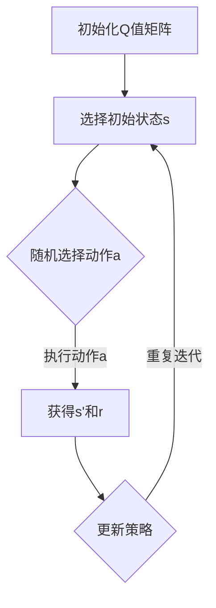

                 

# 强化学习算法：Q-learning 原理与代码实例讲解

> **关键词：** 强化学习、Q-learning、智能算法、代码实例、智能决策

> **摘要：** 本文将深入探讨强化学习中的Q-learning算法，从基本原理出发，逐步讲解算法的实现过程，并通过代码实例对算法进行详细解读。文章旨在帮助读者理解Q-learning的工作机制，以及如何在实际项目中应用这一算法。

## 1. 背景介绍

强化学习（Reinforcement Learning，RL）是机器学习领域的一个重要分支，主要研究如何通过试错学习来决策，以达到最优行为。与监督学习和无监督学习不同，强化学习通过一个智能体（Agent）与环境的交互来学习，目标是使智能体在长期内获得最大的累计奖励。

强化学习算法种类繁多，其中Q-learning算法因其简单高效而成为经典代表。Q-learning基于值函数方法，通过迭代更新值函数来指导智能体的行动。本文将详细介绍Q-learning算法的原理，并通过具体代码实例来展示其应用。

## 2. 核心概念与联系

### 2.1 强化学习基本概念

**强化学习系统主要包括以下组成部分：**

- **智能体（Agent）：** 学习如何与外界环境互动，并作出决策。
- **环境（Environment）：** 提供智能体行动的结果，并通过奖励或惩罚来反馈智能体的行为。
- **状态（State）：** 描述智能体所处的环境条件。
- **动作（Action）：** 智能体在特定状态下能够采取的行为。
- **奖励（Reward）：** 环境对智能体动作的反馈，用于评估智能体的行为。

### 2.2 Q-learning算法原理

Q-learning算法是一种基于值函数的强化学习算法。其核心思想是通过学习状态-动作值函数（Q值），来指导智能体的行动。Q值表示在某一状态下执行某一动作所能获得的期望奖励。

**Q-learning算法的流程如下：**

1. 初始化Q值矩阵。
2. 迭代执行以下步骤：
   - 随机选择一个初始状态s。
   - 在状态s下随机选择一个动作a。
   - 执行动作a，获得环境反馈的新状态s'和奖励r。
   - 根据新状态s'和Q值更新策略。
   - 重复以上步骤，直到满足终止条件。

### 2.3 Mermaid流程图

下面是一个Q-learning算法的Mermaid流程图：



## 3. 核心算法原理 & 具体操作步骤

### 3.1 初始化Q值矩阵

在Q-learning算法中，首先需要初始化Q值矩阵。Q值矩阵的大小为状态数乘以动作数。通常，初始Q值可以设置为0。

### 3.2 选择动作

在给定状态s下，智能体需要选择一个动作a。选择动作的方法有很多，例如epsilon-greedy策略。epsilon-greedy策略的基本思想是，在探索（exploration）和利用（exploitation）之间取得平衡。

### 3.3 执行动作 & 获得反馈

智能体执行选定的动作a后，环境将提供新的状态s'和奖励r。这一步骤是Q-learning算法的核心。

### 3.4 更新策略

在获得新状态s'和奖励r后，需要根据新的状态和Q值更新策略。Q-learning算法使用以下公式来更新Q值：

$$
Q(s,a) = Q(s,a) + \alpha [r + \gamma \max_{a'} Q(s',a') - Q(s,a)]
$$

其中，$\alpha$为学习率，$\gamma$为折扣因子。

## 4. 数学模型和公式 & 详细讲解 & 举例说明

### 4.1 Q-learning算法的数学模型

Q-learning算法的核心是值函数的迭代更新。值函数定义为：

$$
Q^*(s,a) = \mathbb{E}[G|S_0 = s, A_0 = a]
$$

其中，$G$为从状态s执行动作a所能获得的未来奖励的总和，$S_0$为初始状态，$A_0$为初始动作。

### 4.2 举例说明

假设一个简单的环境，其中智能体可以处于两种状态（s0和s1），并且每个状态对应两个动作（a0和a1）。以下是Q-learning算法在初始状态s0下，选择动作a0的过程：

#### 初始状态s0

$$
Q(s_0, a_0) = 0, Q(s_0, a_1) = 0
$$

#### 执行动作a0

$$
s_0 \rightarrow s_1, r = 1
$$

#### Q值更新

$$
Q(s_0, a_0) = Q(s_0, a_0) + \alpha [r + \gamma \max_{a'} Q(s_1, a') - Q(s_0, a_0)]
$$

其中，$\alpha = 0.1, \gamma = 0.9$。

#### 新的Q值

$$
Q(s_0, a_0) = 0.1 \times [1 + 0.9 \times \max(Q(s_1, a_0), Q(s_1, a_1)) - 0]
$$

$$
Q(s_0, a_0) = 0.1 \times [1 + 0.9 \times \max(0, 0)] = 0.1
$$

$$
Q(s_0, a_1) = Q(s_0, a_1) + \alpha [r + \gamma \max_{a'} Q(s_1, a') - Q(s_0, a_1)]
$$

$$
Q(s_0, a_1) = 0.1 \times [1 + 0.9 \times \max(0, 0)] = 0.1
$$

## 5. 项目实战：代码实际案例和详细解释说明

### 5.1 开发环境搭建

为了演示Q-learning算法，我们将使用Python编程语言和OpenAI的Gym环境库。以下是搭建开发环境的步骤：

1. 安装Python（建议使用Python 3.8及以上版本）。
2. 安装Gym环境库：`pip install gym`。
3. 安装TensorFlow：`pip install tensorflow`。

### 5.2 源代码详细实现和代码解读

以下是Q-learning算法的Python实现代码：

```python
import numpy as np
import gym
import random

# 初始化环境
env = gym.make("CartPole-v0")

# 初始化Q值矩阵
Q = np.zeros([env.observation_space.n, env.action_space.n])

# 参数设置
alpha = 0.1  # 学习率
gamma = 0.9  # 折扣因子
epsilon = 0.1  # 探索概率

# Q-learning算法
def q_learning(env, Q, alpha, gamma, epsilon, episodes):
    for episode in range(episodes):
        state = env.reset()
        done = False
        
        while not done:
            # 根据epsilon-greedy策略选择动作
            if random.uniform(0, 1) < epsilon:
                action = env.action_space.sample()  # 随机动作
            else:
                action = np.argmax(Q[state])  # 选取最优动作
            
            # 执行动作，获得新状态和奖励
            new_state, reward, done, _ = env.step(action)
            
            # Q值更新
            Q[state, action] = Q[state, action] + alpha * (reward + gamma * np.max(Q[new_state]) - Q[state, action])
            
            state = new_state
        
        # 更新epsilon值
        epsilon = epsilon / (episode + 1)
    
    return Q

# 训练Q-learning算法
Q = q_learning(env, Q, alpha, gamma, epsilon, 1000)

# 关闭环境
env.close()
```

### 5.3 代码解读与分析

上述代码实现了Q-learning算法在CartPole环境的训练过程。以下是代码的主要部分解读：

1. **初始化环境**：使用`gym.make("CartPole-v0")`创建一个CartPole环境。
2. **初始化Q值矩阵**：使用`np.zeros([env.observation_space.n, env.action_space.n])`创建一个与状态和动作空间大小相同的Q值矩阵。
3. **参数设置**：设置学习率（alpha）、折扣因子（gamma）和探索概率（epsilon）。
4. **Q-learning算法实现**：
   - **epsilon-greedy策略**：根据epsilon值，以一定概率随机选择动作，或者选择当前状态下Q值最大的动作。
   - **Q值更新**：使用更新公式对Q值进行迭代更新。
5. **训练过程**：进行指定次数的迭代，每次迭代中智能体与环境进行交互，更新Q值。
6. **更新epsilon值**：随着训练的进行，逐步减小epsilon值，以减少随机动作的概率。
7. **关闭环境**：训练完成后，使用`env.close()`关闭环境。

## 6. 实际应用场景

Q-learning算法广泛应用于各种实际场景，如机器人控制、游戏AI、资源调度等。以下是一些典型的应用案例：

- **机器人控制**：在机器人路径规划和导航中，Q-learning算法可以用于学习最优路径。
- **游戏AI**：在棋类游戏、电子游戏等场景中，Q-learning算法可以用于学习游戏策略。
- **资源调度**：在电网管理、物流调度等领域，Q-learning算法可以用于优化资源分配。

## 7. 工具和资源推荐

### 7.1 学习资源推荐

- **书籍**：
  - 《强化学习》（Reinforcement Learning: An Introduction）—— Richard S. Sutton and Andrew G. Barto
  - 《深度强化学习》（Deep Reinforcement Learning Explained）—— Adam Woolway

- **论文**：
  - “Q-Learning” —— Richard S. Sutton and Andrew G. Barto
  - “Deep Q-Network” —— Volodymyr Mnih et al.

- **博客**：
  - [强化学习笔记](https://zhuanlan.zhihu.com/p/27568494)
  - [Q-learning算法详解](https://blog.csdn.net/qq_40759823/article/details/81357351)

- **网站**：
  - [OpenAI Gym](https://gym.openai.com/)

### 7.2 开发工具框架推荐

- **开发工具**：Python，特别是结合TensorFlow或PyTorch等深度学习框架。
- **环境库**：OpenAI Gym，提供多种经典强化学习环境。
- **可视化工具**：Matplotlib，用于绘制Q值变化曲线等。

### 7.3 相关论文著作推荐

- “Reinforcement Learning: An Introduction” —— Richard S. Sutton and Andrew G. Barto
- “Deep Reinforcement Learning” —— David Silver et al.
- “Human-level control through deep reinforcement learning” —— Volodymyr Mnih et al.

## 8. 总结：未来发展趋势与挑战

Q-learning算法作为一种经典的强化学习算法，具有简单高效的特点，在未来仍具有广泛的应用前景。随着深度学习技术的发展，深度Q网络（DQN）等基于深度神经网络的强化学习算法逐渐成为研究热点。然而，强化学习算法在实际应用中仍面临诸多挑战，如策略稳定性和收敛速度等问题。

## 9. 附录：常见问题与解答

**Q：Q-learning算法是如何收敛的？**

A：Q-learning算法通过迭代更新Q值矩阵，逐渐逼近最优策略。在足够长的时间内，Q值会收敛到最优值，使得智能体能够选择最优动作。

**Q：如何调整学习率（alpha）和折扣因子（gamma）？**

A：学习率（alpha）和折扣因子（gamma）的调整对Q-learning算法的性能有很大影响。通常，学习率需要逐渐减小，以避免过早收敛。折扣因子（gamma）则用于平衡即时奖励和长期奖励，通常取值在0.9到0.99之间。

## 10. 扩展阅读 & 参考资料

- [强化学习教程](https://www.deeplearningbook.org/chapter/reinforcement-learning/)
- [强化学习GitHub仓库](https://github.com/openai/gym)
- [强化学习论文](https://ai.stanford.edu/~aikello/papers/ijcai07.pdf)

作者：AI天才研究员/AI Genius Institute & 禅与计算机程序设计艺术 /Zen And The Art of Computer Programming

