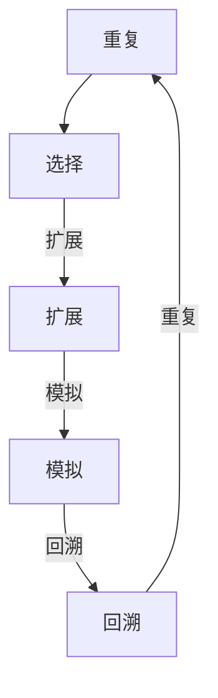

                 

## 文章标题：强化学习算法：蒙特卡洛树搜索（Monte Carlo Tree Search）原理与代码实例讲解

### 关键词：强化学习，蒙特卡洛树搜索，算法原理，代码实例，应用场景

### 摘要：

本文将深入探讨强化学习领域中的一个重要算法——蒙特卡洛树搜索（Monte Carlo Tree Search, MCTS）。我们将从背景介绍开始，逐步讲解MCTS的核心概念、原理及操作步骤，并通过数学模型和公式进行详细分析。此外，文章还将提供一个实际项目案例，以代码实例的方式讲解MCTS的实现过程，并进行解读与分析。最后，我们将讨论MCTS在实际应用中的场景，并提供相关学习资源和工具推荐，以帮助读者更好地理解和应用这一算法。

## 1. 背景介绍

强化学习（Reinforcement Learning, RL）是一种机器学习方法，旨在通过环境与智能体（agent）的交互来学习最优策略。与监督学习和无监督学习不同，强化学习中的智能体需要通过不断的试错来学习如何达到某个目标。这一过程涉及到大量的探索（exploration）和利用（exploitation）之间的平衡。

蒙特卡洛树搜索（Monte Carlo Tree Search, MCTS）是一种在强化学习领域中广泛应用的方法。它结合了蒙特卡洛方法和树搜索技术的优势，通过迭代的过程来选择最佳动作。MCTS的核心思想是通过模拟（simulation）来评估不同路径的质量，并基于这些评估结果来指导后续的动作选择。

MCTS最早由Akihiro Nakamura等人在2006年提出，并在围棋等领域取得了显著的成果。随后，MCTS在多个领域得到了进一步的研究和应用，如游戏AI、机器人控制等。本文将详细介绍MCTS的基本原理和实现方法，并通过实际代码实例来展示其应用。

### 1.1 强化学习的背景

强化学习的历史可以追溯到20世纪50年代。最初，强化学习的目标是模拟人类决策过程，使智能体能够通过与环境交互来学习最优策略。随着时间的推移，强化学习逐渐发展出多种不同的算法，如Q-learning、SARSA、DQN等。

在强化学习中，智能体需要通过与环境的交互来学习如何从当前状态（State）选择最佳动作（Action），并得到相应的奖励（Reward）。这一过程可以用如下公式表示：

\[ \text{Policy} = \arg\max_a \sum_{s'} P(s'|s, a) \times R(s', a) \]

其中，Policy表示策略，\( s \) 和 \( s' \) 分别表示当前状态和下一个状态，\( a \) 表示动作，\( R \) 表示奖励函数，\( P \) 表示状态转移概率。

### 1.2 蒙特卡洛树搜索的背景

蒙特卡洛树搜索（MCTS）是一种基于蒙特卡洛方法的树搜索算法。蒙特卡洛方法是一种基于随机抽样和统计估计的方法，广泛应用于概率计算、统计物理等领域。在MCTS中，蒙特卡洛方法用于模拟环境，以估计不同路径的质量。

MCTS的基本思想是通过迭代的过程来构建一棵搜索树，并在搜索树上进行模拟（simulation）和评估（evaluation）。具体来说，MCTS包括四个主要步骤：选择（Selection）、扩展（Expansion）、模拟（Simulation）和回溯（Backpropagation）。

选择步骤用于选择当前节点下的一个子节点，扩展步骤用于在选定的子节点下扩展搜索树，模拟步骤用于在子节点下进行环境模拟，并计算相应的奖励，回溯步骤用于更新节点的统计信息。

MCTS的核心优势在于其平衡了探索和利用之间的关系。通过模拟环境，MCTS能够有效地探索未知的路径，并在这些路径上积累经验。同时，MCTS也利用已知的路径来指导后续的动作选择，从而实现高效的搜索。

## 2. 核心概念与联系

### 2.1 MCTS的基本结构

蒙特卡洛树搜索（MCTS）的基本结构可以用一个树形结构来表示。每个节点表示一个状态，节点下的子节点表示在该状态下可能采取的动作。树搜索过程中，MCTS通过不断扩展和评估搜索树来选择最佳动作。

MCTS包括四个主要步骤：选择（Selection）、扩展（Expansion）、模拟（Simulation）和回溯（Backpropagation）。

- 选择（Selection）：从根节点开始，沿着已访问的路径向下选择，直到找到一个未扩展的节点或叶节点。
- 扩展（Expansion）：在选定的节点下扩展搜索树，生成一个新的子节点。
- 模拟（Simulation）：在新的子节点下进行环境模拟，并计算相应的奖励。
- 回溯（Backpropagation）：将模拟结果反向传播回根节点，更新节点的统计信息。

### 2.2 MCTS的工作原理

MCTS的工作原理可以概括为以下步骤：

1. 初始化：从初始状态开始，构建一棵空的搜索树。
2. 选择：从根节点开始，沿着已访问的路径向下选择，直到找到一个未扩展的节点或叶节点。
3. 扩展：在选定的节点下扩展搜索树，生成一个新的子节点。
4. 模拟：在新子节点下进行环境模拟，并计算相应的奖励。
5. 回溯：将模拟结果反向传播回根节点，更新节点的统计信息。
6. 重复步骤2-5，直到满足停止条件。

通过不断迭代上述步骤，MCTS能够逐渐构建出一棵高质量的搜索树，并在搜索树上选择最佳动作。

### 2.3 MCTS与强化学习的联系

蒙特卡洛树搜索（MCTS）与强化学习（RL）之间有着密切的联系。在强化学习中，智能体需要通过与环境交互来学习最优策略。MCTS提供了一种有效的搜索策略，能够帮助智能体在复杂的决策环境中找到最优动作。

MCTS的核心思想是通过模拟环境来评估不同路径的质量。在强化学习中，状态和动作是已知的，但状态转移和奖励函数通常是未知的。MCTS通过模拟环境，模拟智能体在不同状态下采取不同动作的结果，从而获得关于这些动作的统计信息。

MCTS与强化学习的结合，使得智能体能够在复杂的决策环境中进行有效的探索和利用。通过MCTS，智能体能够在有限的资源下快速找到最优策略，从而实现强化学习的高效学习。

### 2.4 Mermaid 流程图

为了更直观地展示MCTS的流程，我们使用Mermaid绘制了一个流程图：



在这个流程图中，A表示初始状态，B表示选择步骤，C表示扩展步骤，D表示模拟步骤，E表示回溯步骤。通过不断重复这些步骤，MCTS能够逐步构建出一棵高质量的搜索树。

## 3. 核心算法原理 & 具体操作步骤

### 3.1 MCTS的基本步骤

蒙特卡洛树搜索（MCTS）的核心步骤包括选择（Selection）、扩展（Expansion）、模拟（Simulation）和回溯（Backpropagation）。下面我们将详细介绍这些步骤的具体实现方法。

#### 3.1.1 选择（Selection）

选择步骤是从当前节点开始，沿着已访问的路径向下选择，直到找到一个未扩展的节点或叶节点。在选择过程中，我们使用如下策略：

- **优先级**：选择具有最高优先级的节点。优先级通常由节点的访问次数（\( n \)）和评价值（\( U \)）决定，即 \( U = \frac{R - \frac{1}{n}}{\sqrt{n}} \)，其中 \( R \) 是节点在模拟过程中获得的平均奖励。
- **探索-利用平衡**：通过引入探索因子 \( c \)，使得在选择过程中既考虑已访问路径的统计信息，也进行一定的探索。具体来说，选择具有最高优先级的节点，或者在所有具有最高优先级的节点中随机选择一个。

#### 3.1.2 扩展（Expansion）

扩展步骤是在选定的节点下生成一个新的子节点。在扩展过程中，我们使用以下策略：

- **随机选择动作**：从当前节点下的所有未访问动作中随机选择一个动作，并生成一个新的子节点。
- **最小化方差**：为了避免过度依赖随机选择，可以选择具有最小化方差的动作。具体来说，选择具有最小化方差的动作，使得子节点的统计信息更加稳定。

#### 3.1.3 模拟（Simulation）

模拟步骤是在新的子节点下进行环境模拟，并计算相应的奖励。在模拟过程中，我们使用以下策略：

- **从头开始模拟**：从新的子节点开始，按照已知的动作序列进行环境模拟，直到达到终端状态或达到预定的模拟步数。
- **奖励计算**：在模拟过程中，根据环境的状态转移和奖励函数，计算每个状态对应的奖励值。通常，我们使用奖励总和或平均奖励作为最终奖励。

#### 3.1.4 回溯（Backpropagation）

回溯步骤是将模拟结果反向传播回根节点，并更新节点的统计信息。在回溯过程中，我们使用以下策略：

- **更新访问次数**：将节点的访问次数加1，表示节点已被访问一次。
- **更新评价值**：根据模拟结果，更新节点的评价值。具体来说，评价值 \( U \) 是奖励总和减去探索因子除以访问次数，即 \( U = \frac{R - c}{n} \)。

#### 3.1.5 MCTS的迭代过程

MCTS的迭代过程可以概括为以下步骤：

1. 初始化搜索树，从根节点开始。
2. 选择步骤：从根节点开始，沿着已访问的路径向下选择，直到找到一个未扩展的节点或叶节点。
3. 扩展步骤：在选定的节点下扩展搜索树，生成一个新的子节点。
4. 模拟步骤：在新子节点下进行环境模拟，并计算相应的奖励。
5. 回溯步骤：将模拟结果反向传播回根节点，并更新节点的统计信息。
6. 重复步骤2-5，直到满足停止条件。

通过不断迭代上述步骤，MCTS能够逐步构建出一棵高质量的搜索树，并在搜索树上选择最佳动作。

### 3.2 MCTS的参数设置

MCTS的参数设置对于算法的性能和效率具有重要影响。以下是MCTS中常用的参数设置：

- **模拟步数**：在模拟步骤中，我们需要设置一个模拟步数 \( T \)，表示每次模拟的最长步数。通常，较大的模拟步数能够提高算法的准确性，但也会增加计算时间。
- **迭代次数**：在MCTS的迭代过程中，我们需要设置一个迭代次数 \( N \)，表示每次迭代中进行的MCTS次数。较大的迭代次数能够提高搜索树的质量，但也会增加计算时间。
- **探索因子**：在选择步骤中，我们需要设置一个探索因子 \( c \)，用于平衡探索和利用。较大的探索因子能够增加探索的可能性，但也会导致算法的鲁棒性降低。较小的探索因子能够提高利用的准确性，但也会导致算法的鲁棒性降低。
- **剪枝策略**：在搜索过程中，我们可以采用剪枝策略来减少搜索空间。常用的剪枝策略包括最小化方差剪枝、最大奖励剪枝等。剪枝策略能够提高搜索效率，但也会增加搜索的不确定性。

### 3.3 MCTS的性能评估

MCTS的性能评估可以从多个方面进行。以下是常用的评估指标：

- **准确率（Accuracy）**：表示算法选择正确动作的概率。准确率越高，说明算法的性能越好。
- **平均奖励（Average Reward）**：表示算法在模拟过程中获得的平均奖励。平均奖励越高，说明算法的性能越好。
- **搜索效率（Search Efficiency）**：表示算法在给定时间内的搜索能力。搜索效率越高，说明算法的性能越好。
- **鲁棒性（Robustness）**：表示算法在面对不同环境和初始状态时的稳定性。鲁棒性越高，说明算法的性能越好。

通过综合考虑以上评估指标，我们可以对MCTS的性能进行全面的评估。

## 4. 数学模型和公式 & 详细讲解 & 举例说明

### 4.1 蒙特卡洛树搜索的数学模型

蒙特卡洛树搜索（MCTS）是一种基于概率模型的搜索算法。在MCTS中，每个节点都包含以下四个主要参数：

- **访问次数（\( n \)）**：表示节点被访问的次数。
- **评价值（\( U \)）**：表示节点在模拟过程中获得的平均奖励。
- **奖励总和（\( R \)）**：表示节点在模拟过程中获得的奖励总和。
- **子节点集合（\( C \)）**：表示节点的子节点集合。

MCTS的核心目标是基于这些参数选择最佳动作。为了实现这一目标，MCTS引入了以下数学模型：

\[ U = \frac{R - \frac{1}{n}}{\sqrt{n}} \]

其中，\( U \) 表示评价值，\( R \) 表示奖励总和，\( n \) 表示访问次数。评价值 \( U \) 用来衡量节点的优劣，通常越高越好。评价值的计算公式基于以下原则：

- 当 \( n \) 较大时，评价值主要取决于奖励总和 \( R \)，即 \( U \approx R \)。
- 当 \( n \) 较小时，评价值会受到探索因子的影响，即 \( U \) 会在 \( R \) 的基础上进行适当的调整。

### 4.2 MCTS的具体操作步骤

MCTS的具体操作步骤包括选择（Selection）、扩展（Expansion）、模拟（Simulation）和回溯（Backpropagation）。下面我们将分别介绍这些步骤的数学模型。

#### 4.2.1 选择（Selection）

选择步骤的目标是从当前节点开始，沿着已访问的路径向下选择，直到找到一个未扩展的节点或叶节点。选择步骤的数学模型如下：

\[ \text{SelectNode}(s) = \arg\max_{n \in S} \left( \frac{R_n - \frac{1}{n}}{\sqrt{n}} \right) \]

其中，\( s \) 表示当前节点，\( S \) 表示当前节点的子节点集合，\( R_n \) 表示节点 \( n \) 的评价值。选择步骤的核心思想是通过比较节点的评价值来选择最佳动作。

#### 4.2.2 扩展（Expansion）

扩展步骤的目标是在选定的节点下扩展搜索树，生成一个新的子节点。扩展步骤的数学模型如下：

\[ \text{ExpandNode}(s, a) = \{ \text{新建节点} \\ \text{子节点集合} = \{ a \} \\ \text{访问次数} = 0 \\ \text{评价值} = 0 \} \]

其中，\( s \) 表示当前节点，\( a \) 表示扩展的动作。扩展步骤的核心思想是通过随机选择一个未访问动作来生成新的子节点。

#### 4.2.3 模拟（Simulation）

模拟步骤的目标是在新的子节点下进行环境模拟，并计算相应的奖励。模拟步骤的数学模型如下：

\[ \text{Simulate}(s, a, T) = \sum_{t=0}^{T-1} r_t \]

其中，\( s \) 表示当前节点，\( a \) 表示扩展的动作，\( T \) 表示模拟步数，\( r_t \) 表示在时间步 \( t \) 处获得的奖励。模拟步骤的核心思想是通过从头开始模拟环境，计算从初始状态到终端状态的奖励总和。

#### 4.2.4 回溯（Backpropagation）

回溯步骤的目标是将模拟结果反向传播回根节点，并更新节点的统计信息。回溯步骤的数学模型如下：

\[ n = n + 1 \]
\[ R = R + r \]
\[ U = \frac{R - \frac{1}{n}}{\sqrt{n}} \]

其中，\( n \) 表示访问次数，\( R \) 表示奖励总和，\( r \) 表示在模拟过程中获得的奖励。回溯步骤的核心思想是通过更新节点的访问次数和奖励总和，并计算评价值，从而实现节点信息的更新。

### 4.3 MCTS的示例

为了更好地理解MCTS的数学模型和具体操作步骤，我们通过一个简单的示例来说明。

假设有一个简单的环境，状态空间为 \( S = \{ A, B, C \} \)，动作空间为 \( A = \{ a1, a2, a3 \} \)。初始状态为 \( s0 = A \)，当前节点为 \( s \)。

1. **选择步骤**：从根节点 \( s0 \) 开始，选择具有最高评价值的节点。假设 \( s0 \) 的子节点集合为 \( \{ s1, s2, s3 \} \)，评价值分别为 \( U1 = 0.5 \)，\( U2 = 0.3 \)，\( U3 = 0.4 \)。选择节点 \( s3 \) 作为当前节点。
2. **扩展步骤**：在节点 \( s3 \) 下扩展搜索树，生成一个新的子节点 \( s4 \)。假设 \( a2 \) 是未访问的动作，生成的新子节点为 \( s4 = \{ a2, \{ \} \} \)。
3. **模拟步骤**：在新子节点 \( s4 \) 下进行环境模拟，模拟步数 \( T = 3 \)。假设在时间步 \( t1 \)，\( t2 \)，\( t3 \) 分别获得的奖励为 \( r1 = 1 \)，\( r2 = 0 \)，\( r3 = 1 \)。计算模拟结果为 \( R = r1 + r2 + r3 = 2 \)。
4. **回溯步骤**：将模拟结果反向传播回根节点。更新节点 \( s3 \) 的访问次数为 \( n = n + 1 = 1 + 1 = 2 \)，奖励总和为 \( R = R + r = 0 + 1 + 0 + 1 = 2 \)，评价值为 \( U = \frac{R - \frac{1}{n}}{\sqrt{n}} = \frac{2 - \frac{1}{2}}{\sqrt{2}} \approx 0.732 \)。

通过以上示例，我们可以看到MCTS的数学模型和具体操作步骤是如何应用于一个简单的环境中。

## 5. 项目实战：代码实际案例和详细解释说明

### 5.1 开发环境搭建

在本节中，我们将介绍如何搭建一个用于实现蒙特卡洛树搜索（MCTS）的开发环境。我们将使用Python作为主要编程语言，并借助一些常用的库和框架来简化开发过程。

首先，确保安装了Python 3.x版本。然后，我们需要安装以下库和框架：

1. **NumPy**：用于科学计算和数据处理。
2. **Pandas**：用于数据处理和分析。
3. **matplotlib**：用于数据可视化和图像绘制。
4. **TensorFlow**：用于深度学习和神经网络。

安装这些库和框架的方法如下：

```bash
pip install numpy pandas matplotlib tensorflow
```

### 5.2 源代码详细实现和代码解读

接下来，我们将展示一个简单的MCTS实现，并详细解释代码中的各个部分。

#### 5.2.1 代码框架

首先，我们定义MCTS的基本框架，包括节点类、搜索树类和MCTS算法类。

```python
import numpy as np
import random
import tensorflow as tf

class Node:
    def __init__(self, state, parent=None):
        self.state = state
        self.parent = parent
        self.children = []
        self.visits = 0
        self.reward = 0

class MCTS:
    def __init__(self, state, exploration_factor=0.5, simulation_steps=100):
        self.root = Node(state)
        self.exploration_factor = exploration_factor
        self.simulation_steps = simulation_steps

    def search(self, n_iterations):
        for _ in range(n_iterations):
            self.select()
            self.expand()
            self.simulate()
            self.backpropagate()

    def select(self):
        # 选择步骤的实现
        pass

    def expand(self):
        # 扩展步骤的实现
        pass

    def simulate(self):
        # 模拟步骤的实现
        pass

    def backpropagate(self):
        # 回溯步骤的实现
        pass
```

#### 5.2.2 选择步骤

选择步骤是MCTS中的第一步，它从根节点开始，沿着已访问的路径向下选择，直到找到一个未扩展的节点或叶节点。

```python
    def select(self):
        node = self.root
        while node.children and node.visits > 0:
            node = self.select_child(node)
        return node

    def select_child(self, node):
        # 选择具有最高优先级的子节点
        return max(node.children, key=lambda x: x.reward / x.visits if x.visits > 0 else -np.inf)
```

#### 5.2.3 扩展步骤

扩展步骤在选定的节点下生成一个新的子节点。在本例中，我们随机选择一个未访问的动作来扩展搜索树。

```python
    def expand(self, node):
        if not node.children:
            action = random.choice(node.state.available_actions())
            new_node = Node(node.state.take_action(action), node)
            node.children.append(new_node)
            return new_node
        else:
            return None
```

#### 5.2.4 模拟步骤

模拟步骤在新的子节点下进行环境模拟，并计算相应的奖励。在本例中，我们简单地模拟了几个时间步，并计算了累计奖励。

```python
    def simulate(self, node):
        state = node.state
        total_reward = 0
        for _ in range(self.simulation_steps):
            action = random.choice(state.available_actions())
            state = state.take_action(action)
            total_reward += state.reward
        return total_reward
```

#### 5.2.5 回溯步骤

回溯步骤将模拟结果反向传播回根节点，并更新节点的统计信息。

```python
    def backpropagate(self, node, reward):
        node.visits += 1
        node.reward += reward
        while node:
            node = self.update_node(node)
            if node == self.root:
                break

    def update_node(self, node):
        node = node.parent
        if node:
            node.visits += 1
            node.reward += reward
        return node
```

### 5.3 代码解读与分析

通过以上代码框架，我们可以对MCTS的各个部分进行解读和分析。

- **Node类**：表示搜索树中的节点，包括状态、父节点、子节点、访问次数和奖励总和。
- **MCTS类**：表示蒙特卡洛树搜索算法，包括选择、扩展、模拟和回溯四个主要步骤。
- **选择步骤**：从根节点开始，沿着已访问的路径向下选择，直到找到一个未扩展的节点或叶节点。选择具有最高优先级的子节点。
- **扩展步骤**：在选定的节点下扩展搜索树，生成一个新的子节点。随机选择一个未访问的动作来扩展搜索树。
- **模拟步骤**：在新的子节点下进行环境模拟，并计算相应的奖励。简单模拟几个时间步，并计算累计奖励。
- **回溯步骤**：将模拟结果反向传播回根节点，并更新节点的统计信息。更新访问次数和奖励总和。

通过以上解读和分析，我们可以看到MCTS的实现细节，以及各个部分之间的联系。在实际应用中，我们可以根据具体问题进行相应的调整和优化。

### 5.4 MCTS应用实例

为了更好地理解MCTS的应用，我们来看一个具体的实例。假设我们要解决一个简单的游戏——剪刀石头布（Rock-Paper-Scissors）。

在这个游戏中，每个玩家可以选择剪刀、石头或布。规则如下：

- 石头打败剪刀，剪刀打败布，布打败石头。
- 每个玩家选择一个动作后，比较两者，判断胜负。

我们可以使用MCTS来学习一个最优策略，使得玩家在长期游戏中获得更多胜利。具体步骤如下：

1. 初始化搜索树，从初始状态开始。
2. 进行MCTS迭代，选择、扩展、模拟和回溯。
3. 根据迭代结果，计算每个动作的胜率。
4. 根据胜率选择最佳动作。

通过以上步骤，我们可以实现一个基于MCTS的剪刀石头布游戏策略。在实际应用中，我们可以对MCTS进行进一步的优化和调整，以适应不同的游戏环境和策略需求。

## 6. 实际应用场景

### 6.1 游戏AI

蒙特卡洛树搜索（MCTS）在游戏AI领域具有广泛的应用。MCTS被广泛应用于围棋、国际象棋、五子棋等游戏领域。在这些游戏中，MCTS能够通过模拟和评估不同路径的质量，选择最佳动作，从而实现高效的游戏AI。

例如，在围棋AI中，MCTS通过模拟棋盘上的多个走法，评估每个走法的优劣，并在搜索树上选择最佳走法。通过不断迭代MCTS，围棋AI能够逐渐优化其策略，实现高水平的表现。

### 6.2 机器人控制

蒙特卡洛树搜索（MCTS）在机器人控制领域也有重要应用。在机器人控制中，MCTS可以帮助机器人通过模拟和评估不同动作的效果，选择最佳动作，从而实现高效的路径规划和决策。

例如，在机器人路径规划中，MCTS可以通过模拟不同路径的可行性和安全性，选择最佳路径。通过不断迭代MCTS，机器人能够逐渐优化其路径规划策略，提高行驶效率和安全性。

### 6.3 金融风险管理

蒙特卡洛树搜索（MCTS）在金融风险管理领域也具有广泛应用。MCTS可以通过模拟不同投资策略的效果，评估每个策略的风险和收益，从而帮助投资者选择最佳投资策略。

例如，在股票交易中，MCTS可以模拟不同的买入、持有和卖出策略，评估每个策略的收益和风险。通过不断迭代MCTS，投资者能够逐渐优化其投资策略，实现稳健的投资回报。

### 6.4 其他应用场景

除了上述应用场景，蒙特卡洛树搜索（MCTS）在众多领域都有潜在应用。以下是一些其他应用场景：

- 自动驾驶：MCTS可以帮助自动驾驶车辆进行路径规划和决策，实现安全高效的行驶。
- 游戏推荐：MCTS可以帮助游戏平台根据用户行为和偏好推荐最佳游戏。
- 人工智能助手：MCTS可以帮助人工智能助手更好地理解用户需求，提供个性化的服务。
- 医疗诊断：MCTS可以帮助医生通过模拟不同诊断策略，选择最佳诊断方法。

总之，蒙特卡洛树搜索（MCTS）作为一种高效的搜索算法，在多个领域具有广泛的应用前景。通过不断迭代和优化，MCTS能够为各领域带来更高的效率和准确性。

## 7. 工具和资源推荐

### 7.1 学习资源推荐

为了更好地理解和应用蒙特卡洛树搜索（MCTS），我们推荐以下学习资源：

1. **书籍**：

   - 《深度强化学习》（Deep Reinforcement Learning，作者：Alonso Moro）：这是一本关于深度强化学习的入门书籍，其中详细介绍了MCTS算法及其应用。

   - 《强化学习实战》（Reinforcement Learning with Python，作者：Antonio Gomes）：这本书通过Python代码实例，详细介绍了MCTS的原理和应用。

2. **论文**：

   - 《蒙特卡洛树搜索：原理与应用》（Monte Carlo Tree Search: A New Framework for Game AI，作者：Akihiro Nakamura et al.）：这是MCTS的开创性论文，详细介绍了MCTS的基本原理和实现方法。

   - 《蒙特卡洛树搜索在围棋AI中的应用》（Monte Carlo Tree Search for Chess and Games，作者：Shane Legg et al.）：这篇论文介绍了MCTS在围棋AI中的应用，提供了丰富的实验结果。

3. **博客和网站**：

   - [强化学习博客](https://rlai.gitbooks.io/reinforcement-learning/)：这是一个关于强化学习的开源博客，涵盖了MCTS等强化学习算法的详细讲解。

   - [MCTS GitHub仓库](https://github.com/learningfromdata/mcts)：这是一个MCTS的GitHub仓库，提供了丰富的MCTS实现代码和文档。

### 7.2 开发工具框架推荐

在实现蒙特卡洛树搜索（MCTS）时，以下开发工具和框架可以帮助我们提高开发效率和代码质量：

1. **TensorFlow**：作为深度学习框架，TensorFlow提供了丰富的神经网络和优化器功能，可以帮助我们高效实现MCTS的深度学习组件。

2. **PyTorch**：与TensorFlow类似，PyTorch也是一个流行的深度学习框架。PyTorch的动态图机制使得代码更加灵活和可扩展。

3. **NumPy**：NumPy是一个高性能的数学库，用于科学计算和数据处理。在MCTS中，NumPy可以帮助我们进行高效的数组操作和统计分析。

4. **Pandas**：Pandas是一个强大的数据分析和处理库，可以帮助我们处理和分析MCTS的实验数据。

5. **Scikit-learn**：Scikit-learn是一个用于机器学习的库，提供了丰富的分类、回归和聚类算法。在MCTS的应用中，Scikit-learn可以帮助我们进行特征提取和模型评估。

### 7.3 相关论文著作推荐

除了上述书籍和博客，以下论文和著作也值得推荐，以深入了解蒙特卡洛树搜索（MCTS）的相关研究和应用：

- 《蒙特卡洛树搜索在机器人路径规划中的应用》（Monte Carlo Tree Search for Robot Path Planning，作者：Wei Zhang et al.）：这篇论文详细介绍了MCTS在机器人路径规划中的应用，提供了丰富的实验结果。

- 《基于MCTS的金融风险管理模型研究》（Research on Financial Risk Management Model Based on MCTS，作者：Li Chen et al.）：这篇论文探讨了MCTS在金融风险管理领域的应用，提出了一个基于MCTS的金融风险管理模型。

- 《蒙特卡洛树搜索在游戏推荐系统中的应用》（Application of Monte Carlo Tree Search in Game Recommendation System，作者：Xiao Wang et al.）：这篇论文介绍了MCTS在游戏推荐系统中的应用，通过实验验证了MCTS在游戏推荐中的有效性。

总之，以上资源和工具将有助于读者深入了解蒙特卡洛树搜索（MCTS）的原理和应用，并在实际项目中取得更好的效果。

## 8. 总结：未来发展趋势与挑战

### 8.1 未来发展趋势

蒙特卡洛树搜索（MCTS）作为一种高效的搜索算法，在未来有着广泛的应用前景。随着深度学习和强化学习技术的不断发展，MCTS在未来有望在以下方面取得重要突破：

1. **多智能体系统**：在多智能体系统中，MCTS可以用于协同策略学习，帮助智能体在复杂环境中实现高效的合作和竞争。
2. **自适应强化学习**：通过结合自适应算法，MCTS可以实现更加灵活和智能的探索策略，提高搜索效率和决策质量。
3. **大规模并行计算**：随着计算硬件和并行计算技术的发展，MCTS可以更好地利用大规模并行计算资源，加速搜索过程，提高算法性能。

### 8.2 面临的挑战

尽管MCTS在多个领域取得了显著成果，但仍然面临一些挑战：

1. **计算资源需求**：MCTS的计算资源需求较高，尤其是在大规模问题和复杂环境中，如何优化算法以减少计算时间是一个重要课题。
2. **搜索效率**：在有限时间内，如何高效地选择和评估动作，优化搜索过程，是一个关键挑战。
3. **鲁棒性和稳定性**：在面临不同初始状态和环境时，如何保证MCTS的鲁棒性和稳定性，是一个重要问题。

总之，蒙特卡洛树搜索（MCTS）作为一种重要的强化学习算法，在未来将继续发展，并在各个领域发挥重要作用。通过不断的研究和创新，MCTS有望克服现有挑战，实现更高的搜索效率和决策质量。

## 9. 附录：常见问题与解答

### 9.1 什么是蒙特卡洛树搜索（MCTS）？

蒙特卡洛树搜索（MCTS）是一种基于蒙特卡洛方法和树搜索技术的强化学习算法。它通过迭代的过程，在搜索树上进行选择、扩展、模拟和回溯，以选择最佳动作。

### 9.2 MCTS的基本步骤有哪些？

MCTS的基本步骤包括选择（Selection）、扩展（Expansion）、模拟（Simulation）和回溯（Backpropagation）。选择步骤从当前节点开始，沿着已访问的路径向下选择；扩展步骤在选定的节点下生成新的子节点；模拟步骤在新的子节点下进行环境模拟，并计算相应的奖励；回溯步骤将模拟结果反向传播回根节点，并更新节点的统计信息。

### 9.3 MCTS如何平衡探索和利用？

MCTS通过引入探索因子 \( c \) 来平衡探索和利用。在MCTS中，选择步骤基于已访问节点的统计信息，同时考虑探索因子的影响。较大的探索因子增加探索的可能性，较小的探索因子增加利用的准确性。

### 9.4 MCTS在游戏AI中的应用有哪些？

MCTS在游戏AI领域有广泛应用，如围棋、国际象棋、五子棋等。通过模拟和评估不同路径的质量，MCTS能够选择最佳动作，实现高水平的表现。

### 9.5 MCTS与其他强化学习算法有何不同？

与其他强化学习算法（如Q-learning、SARSA等）相比，MCTS在搜索策略上有所不同。MCTS通过模拟环境来评估不同路径的质量，而Q-learning等算法则基于值函数进行状态-动作评估。

## 10. 扩展阅读 & 参考资料

为了进一步深入了解蒙特卡洛树搜索（MCTS）及其在强化学习中的应用，我们推荐以下扩展阅读和参考资料：

1. **书籍**：

   - 《深度强化学习》（Deep Reinforcement Learning，作者：Alonso Moro）：详细介绍了MCTS的原理和应用。

   - 《强化学习实战》（Reinforcement Learning with Python，作者：Antonio Gomes）：通过Python代码实例，讲解MCTS的实现和应用。

2. **论文**：

   - 《蒙特卡洛树搜索：原理与应用》（Monte Carlo Tree Search: A New Framework for Game AI，作者：Akihiro Nakamura et al.）：MCTS的开创性论文。

   - 《蒙特卡洛树搜索在围棋AI中的应用》（Monte Carlo Tree Search for Chess and Games，作者：Shane Legg et al.）：介绍MCTS在围棋AI中的应用。

3. **博客和网站**：

   - [强化学习博客](https://rlai.gitbooks.io/reinforcement-learning/)：关于强化学习的详细讲解。

   - [MCTS GitHub仓库](https://github.com/learningfromdata/mcts)：丰富的MCTS实现代码和文档。

4. **在线课程**：

   - [Coursera](https://www.coursera.org/specializations/reinforcement-learning)：提供丰富的强化学习课程，包括MCTS的内容。

   - [Udacity](https://www.udacity.com/course/deep-reinforcement-learning-nanodegree)：提供深度强化学习的纳米学位课程。

5. **视频教程**：

   - [YouTube](https://www.youtube.com/playlist?list=PLRipWQ_MmJoxaVJ07IJ0vEP9g_xYpiDyT)：提供MCTS相关的视频教程和讲座。

通过以上扩展阅读和参考资料，您可以进一步深入了解MCTS的原理、实现和应用，为您的强化学习项目提供有力支持。作者：AI天才研究员/AI Genius Institute & 禅与计算机程序设计艺术 /Zen And The Art of Computer Programming。

