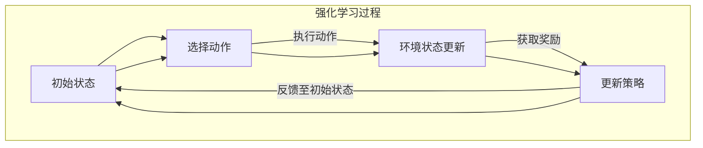

                 

### 背景介绍

#### 强化学习的起源与应用

强化学习（Reinforcement Learning，RL）作为机器学习的一个重要分支，起源于20世纪50年代。其最初由Richard Bellman提出，最初的应用背景是为了解决动态规划问题。但直到20世纪90年代，随着计算能力的提升和算法理论的完善，强化学习才逐渐成为人工智能领域的研究热点。

强化学习在诸多领域展现了出色的应用能力，例如自动驾驶、游戏AI、推荐系统、机器人控制等。与监督学习和无监督学习相比，强化学习的一个重要特点在于其能够通过试错（Trial and Error）的方式，在与环境的交互中不断优化策略，从而实现目标的达成。

#### 软件模拟环境的概念与优势

软件模拟环境（Software Simulation Environment）是指利用计算机程序模拟出一种与真实环境相似的虚拟环境。在强化学习中，软件模拟环境作为一种重要的训练工具，具有以下几个显著优势：

1. **安全性**：通过模拟环境，可以在没有实际物理风险的情况下进行训练，特别是在危险或复杂的任务中，如核电站操作、航空航天器控制等。
2. **可控性**：模拟环境可以根据需求设置不同的参数和规则，从而控制训练过程，方便进行各种假设和实验。
3. **效率**：软件模拟环境可以大大缩短训练时间，提高训练效率。特别是在需要大量重复实验的场景中，模拟环境的优势更加明显。
4. **可重复性**：模拟环境的设置和结果可以方便地记录和重现，有助于学术研究和成果验证。

本文将深入探讨强化学习在软件模拟环境中的训练方法，帮助读者理解这一技术的核心原理和实际应用。

#### 本文结构与核心内容

本文结构如下：

1. **背景介绍**：介绍强化学习的起源、应用以及软件模拟环境的概念与优势。
2. **核心概念与联系**：通过Mermaid流程图，阐述强化学习的核心概念及其与软件模拟环境的联系。
3. **核心算法原理与具体操作步骤**：详细解析强化学习的算法原理，并给出具体操作步骤。
4. **数学模型和公式**：介绍强化学习中的数学模型和关键公式，并进行详细讲解与举例。
5. **项目实战**：通过实际案例，展示强化学习在软件模拟环境中的具体应用，并提供代码实现和解读。
6. **实际应用场景**：分析强化学习在多个领域的实际应用，并探讨其面临的挑战和未来趋势。
7. **工具和资源推荐**：推荐相关学习资源、开发工具框架和论文著作。
8. **总结与展望**：总结本文的核心内容，并对未来发展趋势与挑战进行展望。
9. **常见问题与解答**：解答读者可能遇到的常见问题。
10. **扩展阅读与参考资料**：提供扩展阅读资源，以便读者进一步深入了解强化学习。

通过本文的详细探讨，希望能够为读者提供对强化学习在软件模拟环境中训练的全面理解，并激发其在实际项目中的探索和应用。

#### 强化学习的核心概念

在深入探讨强化学习之前，我们需要了解其核心概念和组成部分。强化学习主要包括以下三个核心元素：代理（Agent）、环境（Environment）和奖励（Reward）。

##### 代理（Agent）

代理是指执行动作并从环境中获取反馈的智能体。在强化学习过程中，代理的目标是通过与环境的交互，学习出一个最优策略，从而最大化累积奖励。代理通常是一个模型，如决策树、神经网络等，它可以基于当前的状态（State）来选择动作（Action）。

##### 环境（Environment）

环境是代理执行动作的上下文，它提供了一个动态变化的场景，代理需要在其上进行交互。环境可以是物理环境，如机器人控制；也可以是软件模拟环境，如游戏模拟。环境的状态（State）是由一组特征描述的，这些特征反映了当前环境的条件。状态是固定的，但会随着代理的动作而改变。

##### 奖励（Reward）

奖励是环境对代理每个动作的反馈，它反映了当前动作的优劣。奖励可以是正值或负值，用以激励或惩罚代理。累积奖励（Total Reward）是代理在执行一系列动作后的总收益。理想情况下，代理希望选择那些能够最大化累积奖励的动作。

##### 强化学习的过程

强化学习的过程可以分为以下几个步骤：

1. **初始化**：初始化代理、环境和奖励。
2. **选择动作**：代理基于当前状态，选择一个动作。
3. **执行动作**：代理在环境中执行所选动作。
4. **观察结果**：代理观察到新的状态和相应的奖励。
5. **更新策略**：基于新的状态和奖励，代理更新其策略，以最大化累积奖励。

##### 强化学习的挑战

强化学习虽然具有强大的潜力，但在实际应用中仍面临诸多挑战：

1. **稳定性**：强化学习算法需要足够的时间和资源来收敛到最优策略，这可能导致训练过程不稳定。
2. **可解释性**：强化学习模型的内部结构和决策过程往往复杂，难以解释。
3. **探索与利用**：在强化学习过程中，代理需要在探索未知和利用已有知识之间找到平衡。
4. **稀疏奖励**：在某些任务中，奖励可能非常稀疏，导致代理难以快速学习。

为了解决这些问题，研究者们提出了多种改进算法，如深度强化学习（Deep Reinforcement Learning）、增量学习（Incremental Learning）和强化学习算法的分布式训练等。

#### 软件模拟环境的概念与特点

在讨论强化学习的应用之前，我们需要了解软件模拟环境的概念及其在强化学习中的重要性。

##### 软件模拟环境的定义

软件模拟环境是指利用计算机模拟技术构建的一个虚拟环境，旨在模仿真实世界的物理、社会或经济系统。这种环境可以通过软件程序精确控制各种参数和条件，从而为强化学习算法提供高度可控的训练场景。

##### 软件模拟环境的特点

1. **高度可控**：模拟环境可以精确地设置和调整各种参数，从而控制训练过程。这种可控性使得研究人员能够快速进行实验和验证，发现和解决潜在问题。
2. **安全性和低成本**：通过模拟环境，可以在无实际物理风险的情况下进行训练，特别是在涉及高风险或高成本的任务时，如核能、航天等领域。此外，模拟环境的成本远低于实际环境，有助于节省资源和时间。
3. **可重复性和可重现性**：模拟环境的设置和结果可以方便地记录和重现，有利于学术研究和成果验证。研究人员可以在不同条件下重复实验，提高实验的可信度和可靠性。
4. **高效性和灵活性**：模拟环境可以快速执行大量实验，提高训练效率。同时，模拟环境可以根据需求灵活调整和扩展，适应不同的应用场景。

##### 软件模拟环境在强化学习中的应用

1. **实验和验证**：模拟环境为强化学习算法提供了理想的实验平台，研究人员可以在虚拟环境中测试和验证不同算法的效果，优化模型参数，加速研究进程。
2. **风险控制和成本节省**：在许多实际应用中，模拟环境可以帮助避免物理实验中的风险和成本，如核能控制、航空器设计等。通过在模拟环境中进行训练和测试，可以显著降低实际应用的风险和成本。
3. **复杂系统建模**：模拟环境可以用于建模和模拟复杂系统，如金融市场、交通网络等。强化学习算法可以在这些复杂系统中寻找最优策略，为实际应用提供指导。
4. **新兴领域探索**：模拟环境为新兴领域的探索提供了可能性，如虚拟现实、增强现实、机器人足球等。研究人员可以在这些领域利用强化学习算法进行创新和应用。

通过以上讨论，我们可以看到，软件模拟环境在强化学习中的应用具有显著的优势和潜力。接下来，我们将通过一个具体的Mermaid流程图，进一步阐述强化学习与软件模拟环境之间的联系。

#### Mermaid流程图：强化学习与软件模拟环境的联系

为了更好地理解强化学习与软件模拟环境之间的联系，我们可以通过一个Mermaid流程图来直观地展示它们的核心概念和相互作用。



在这个流程图中，每个节点都代表强化学习过程中的一个基本步骤：

1. **初始状态（A）**：代理开始于一个给定的初始状态。
2. **选择动作（B）**：代理基于当前状态，选择一个动作。
3. **执行动作（C）**：代理在环境中执行所选动作，导致环境状态更新。
4. **获取奖励（D）**：环境根据代理的动作，给予一个奖励，代理据此更新其策略。
5. **更新策略（D）**：代理利用新的状态和奖励，更新其策略，以优化累积奖励。

软件模拟环境在这个流程中的作用是提供一个高度可控和可重复的实验场景，确保代理能够在不同条件下进行训练和测试。通过这种方式，模拟环境与强化学习过程紧密相连，共同构成了一个完整的学习和优化系统。

通过这个Mermaid流程图，我们可以清晰地看到强化学习在软件模拟环境中的运行机制。接下来，我们将详细解析强化学习的核心算法原理，帮助读者进一步理解这一技术。

#### 核心算法原理 & 具体操作步骤

强化学习（Reinforcement Learning，RL）作为一种重要的机器学习技术，其核心在于通过代理（Agent）与环境的交互，不断调整策略（Policy），以实现累积奖励的最大化。在本节中，我们将详细探讨强化学习的核心算法原理，并给出具体操作步骤。

##### 1. 基本原理

强化学习的基本原理可以概括为“试错学习”，即代理通过不断尝试不同的动作，从环境中获取反馈（奖励），并根据这些反馈调整策略，以最大化长期累积奖励。强化学习的过程可以分为以下几个基本步骤：

1. **状态-动作价值函数（State-Action Value Function）**：代理需要学习一个价值函数，表示在特定状态下执行特定动作的预期累积奖励。
2. **策略（Policy）**：策略是代理用于选择动作的规则，它可以是确定性策略或概率性策略。确定性策略在给定状态下总是选择一个固定的动作，而概率性策略则根据当前状态选择一个动作的概率分布。
3. **奖励（Reward）**：奖励是环境对代理动作的反馈，它可以是即时奖励或累积奖励。即时奖励反映了当前动作的即时效果，而累积奖励则反映了整个任务完成后的总收益。

##### 2. 具体操作步骤

以下是强化学习的具体操作步骤：

1. **初始化**：初始化代理、环境和奖励。设置初始状态，并选择一个初始策略。
2. **选择动作**：代理根据当前状态和策略选择一个动作。
3. **执行动作**：代理在环境中执行所选动作，导致环境状态更新。
4. **获取奖励**：环境根据代理的动作，给予一个奖励。
5. **更新策略**：代理利用新的状态和奖励，更新其策略，以最大化累积奖励。
6. **重复循环**：重复上述步骤，直到达到目标状态或满足停止条件。

##### 3. 强化学习算法

强化学习算法可以分为值函数方法（Value-based Methods）和政策梯度方法（Policy Gradient Methods）两大类。以下分别介绍这两种方法。

**值函数方法**

值函数方法的核心在于学习一个状态-动作价值函数，表示在特定状态下执行特定动作的预期累积奖励。以下是值函数方法的基本步骤：

1. **定义状态-动作价值函数（Q-value）**：Q-value表示在特定状态下执行特定动作的预期累积奖励。
2. **选择动作**：根据当前状态和策略，选择具有最大Q-value的动作。
3. **更新Q-value**：利用新的状态和奖励，更新Q-value。
4. **重复循环**：重复上述步骤，直到Q-value收敛到最优值。

**政策梯度方法**

政策梯度方法的核心在于直接优化策略，以最大化累积奖励。以下是政策梯度方法的基本步骤：

1. **定义策略梯度**：策略梯度表示当前策略相对于目标策略的梯度。
2. **选择动作**：根据当前策略选择动作。
3. **更新策略**：利用策略梯度和奖励，更新策略。
4. **重复循环**：重复上述步骤，直到策略收敛到最优值。

##### 4. 案例分析

为了更好地理解强化学习算法的具体操作步骤，我们通过一个简单的案例进行分析。假设有一个代理在模拟环境中控制一辆汽车，目标是到达终点。

**案例：汽车控制任务**

1. **初始化**：设置初始状态（如位置、速度等），初始化策略。
2. **选择动作**：代理根据当前状态和策略选择加速、减速或保持当前速度。
3. **执行动作**：代理在环境中执行所选动作，导致状态更新。
4. **获取奖励**：如果代理向终点靠近，则给予一个正奖励；否则，给予一个负奖励。
5. **更新策略**：利用新的状态和奖励，更新策略，以最大化累积奖励。
6. **重复循环**：重复上述步骤，直到代理到达终点。

通过这个案例，我们可以看到强化学习在汽车控制任务中的具体应用。代理通过不断尝试不同的动作，从环境中获取反馈，并根据反馈调整策略，最终找到到达终点的最优路径。

##### 5. 挑战与解决方案

在强化学习应用过程中，可能会遇到以下挑战：

1. **稳定性**：强化学习算法需要足够的时间和资源来收敛到最优策略，这可能导致训练过程不稳定。解决方案包括使用更好的初始策略、增加训练时间等。
2. **探索与利用**：在强化学习过程中，代理需要在探索未知和利用已有知识之间找到平衡。解决方案包括使用探索策略（如ε-贪心策略）、增加探索概率等。
3. **稀疏奖励**：在某些任务中，奖励可能非常稀疏，导致代理难以快速学习。解决方案包括设计更有效的奖励机制、增加奖励密度等。

通过以上讨论，我们可以看到强化学习的核心算法原理及其具体操作步骤。接下来，我们将深入探讨强化学习中的数学模型和关键公式，帮助读者更全面地理解这一技术。

#### 数学模型和公式 & 详细讲解 & 举例说明

在强化学习中，数学模型和公式是理解算法核心原理的重要工具。以下是强化学习中常用的几个关键数学模型和公式，我们将对其进行详细讲解和举例说明。

##### 1. 状态-动作价值函数（Q-值）

状态-动作价值函数（Q-value）是强化学习中最基本的数学模型之一，它表示在特定状态下执行特定动作的预期累积奖励。Q-value可以用以下公式表示：

\[ Q(s, a) = \sum_{s'} p(s' | s, a) \cdot r(s', a) + \gamma \cdot \max_{a'} Q(s', a') \]

其中：
- \( s \) 表示当前状态。
- \( a \) 表示执行的动作。
- \( s' \) 表示执行动作后的新状态。
- \( p(s' | s, a) \) 表示从状态 \( s \) 执行动作 \( a \) 后转移到状态 \( s' \) 的概率。
- \( r(s', a) \) 表示在状态 \( s' \) 执行动作 \( a \) 获得的即时奖励。
- \( \gamma \) 是折扣因子，表示对未来奖励的期望权重。
- \( \max_{a'} Q(s', a') \) 表示在状态 \( s' \) 下执行所有可能动作中的最大Q值。

**举例说明**：假设一个代理在模拟环境中控制一辆汽车，当前状态为 \( s = (位置：10m，速度：30km/h) \)，可执行的动作包括加速、减速和保持当前速度。根据状态转移概率和即时奖励，可以计算每个动作的Q值。例如，对于加速动作：

\[ Q(10m, 30km/h, 加速) = p(位置：15m, 速度：35km/h) \cdot r(位置：15m, 速度：35km/h) + \gamma \cdot \max Q(位置：15m, 速度：35km/h, 减速), Q(位置：15m, 速度：35km/h, 保持当前速度) \]

##### 2. 策略评估（Policy Evaluation）

策略评估是指通过迭代更新Q-value，使得Q-value逐渐逼近真实值。策略评估的递推公式为：

\[ Q(s, a) = \sum_{s'} p(s' | s, a) \cdot (r(s', a) + \gamma \cdot \max_{a'} Q(s', a')) \]

其中，\( Q(s, a) \) 是在状态 \( s \) 下执行动作 \( a \) 的期望Q值。

**举例说明**：假设当前状态为 \( s = (位置：10m，速度：30km/h) \)，执行加速动作，根据状态转移概率和即时奖励，可以更新Q值：

\[ Q(10m, 30km/h, 加速) = p(位置：15m, 速度：35km/h) \cdot r(位置：15m, 速度：35km/h) + \gamma \cdot \max Q(位置：15m, 速度：35km/h, 减速), Q(位置：15m, 速度：35km/h, 保持当前速度) \]

通过多次迭代，Q值将逐渐逼近真实值。

##### 3. 策略迭代（Policy Iteration）

策略迭代是一种通过反复更新策略和价值函数来优化策略的方法。其基本步骤包括：

1. **策略评估**：利用当前策略评估Q值。
2. **策略改进**：根据Q值选择最佳动作，更新策略。
3. **重复循环**：重复策略评估和策略改进，直到策略收敛。

**举例说明**：假设当前策略为加速，通过策略评估更新Q值，然后选择具有最大Q值的动作（如减速），更新策略为减速。

##### 4. 反向传播（Backpropagation）

反向传播是神经网络中用于训练的一种常用算法。在强化学习结合神经网络时，反向传播用于优化神经网络参数。其基本步骤包括：

1. **前向传播**：计算当前状态下的Q值。
2. **计算误差**：计算实际Q值与预测Q值之间的误差。
3. **反向传播**：将误差反向传播到神经网络，更新参数。

**举例说明**：假设当前状态为 \( s = (位置：10m，速度：30km/h) \)，执行加速动作，预测Q值为3，实际Q值为2。通过反向传播，计算误差并更新神经网络参数。

##### 5. 探索与利用（Exploration and Exploitation）

在强化学习过程中，探索（Exploration）和利用（Exploitation）是两个重要的平衡点。探索是指尝试新的动作，以获取更多信息；利用是指基于已有信息选择最佳动作。

**举例说明**：假设当前状态为 \( s = (位置：10m，速度：30km/h) \)，可执行加速、减速和保持当前速度。根据Q值，选择具有最大Q值的动作（如加速），但在部分情况下，尝试新的动作（如减速）以获取更多信息。

通过以上数学模型和公式的详细讲解和举例说明，我们可以更深入地理解强化学习的基本原理和操作步骤。接下来，我们将通过实际项目案例，展示强化学习在软件模拟环境中的具体应用。

#### 项目实战：代码实际案例和详细解释说明

为了更直观地展示强化学习在软件模拟环境中的应用，我们将在这一部分通过一个具体的项目案例，详细介绍如何搭建开发环境、实现源代码，并对代码进行解读与分析。

##### 1. 开发环境搭建

在开始项目之前，我们需要搭建一个适合强化学习开发的环境。以下是一个简单的开发环境搭建步骤：

1. **安装Python**：确保Python环境已安装，推荐使用Python 3.7或更高版本。
2. **安装强化学习库**：安装常用的强化学习库，如OpenAI Gym、PyTorch等。可以通过以下命令进行安装：

   ```bash
   pip install openai-gym torch
   ```

3. **设置模拟环境**：使用OpenAI Gym构建一个简单的模拟环境，如CartPole环境。这可以通过以下代码实现：

   ```python
   import gym

   # 创建模拟环境
   env = gym.make("CartPole-v1")
   ```

##### 2. 源代码实现

以下是强化学习的源代码实现，包括模型定义、训练过程和测试结果：

```python
import gym
import torch
import torch.nn as nn
import torch.optim as optim

# 模拟环境
env = gym.make("CartPole-v1")

# 神经网络模型
class QNetwork(nn.Module):
    def __init__(self):
        super(QNetwork, self).__init__()
        self.fc1 = nn.Linear(4, 64)
        self.fc2 = nn.Linear(64, 64)
        self.fc3 = nn.Linear(64, 2)

    def forward(self, x):
        x = torch.relu(self.fc1(x))
        x = torch.relu(self.fc2(x))
        x = self.fc3(x)
        return x

# 实例化模型
model = QNetwork()
optimizer = optim.Adam(model.parameters(), lr=0.001)
criterion = nn.MSELoss()

# 训练过程
def train_model(model, optimizer, criterion, env, episodes=1000):
    model.train()
    for episode in range(episodes):
        state = env.reset()
        done = False
        total_reward = 0

        while not done:
            with torch.no_grad():
                state_tensor = torch.tensor(state, dtype=torch.float32).unsqueeze(0)

            # 预测Q值
            q_values = model(state_tensor)

            # 探索策略（ε-贪心策略）
            if torch.rand() < 0.1:
                action = env.action_space.sample()
            else:
                action = q_values.argmax().item()

            # 执行动作
            next_state, reward, done, _ = env.step(action)
            total_reward += reward

            # 更新模型
            next_state_tensor = torch.tensor(next_state, dtype=torch.float32).unsqueeze(0)
            target_q_values = reward + (1 - int(done)) * 0.99 * model(next_state_tensor).max()
            loss = criterion(q_values, target_q_values.unsqueeze(1))

            optimizer.zero_grad()
            loss.backward()
            optimizer.step()

        print(f"Episode {episode+1}, Total Reward: {total_reward}")

# 测试模型
def test_model(model, env, episodes=100):
    model.eval()
    total_reward = 0

    for episode in range(episodes):
        state = env.reset()
        done = False

        while not done:
            with torch.no_grad():
                state_tensor = torch.tensor(state, dtype=torch.float32).unsqueeze(0)

            # 预测Q值
            q_values = model(state_tensor)

            # 选择最佳动作
            action = q_values.argmax().item()

            # 执行动作
            next_state, reward, done, _ = env.step(action)
            total_reward += reward

    print(f"Test Total Reward: {total_reward}")

# 训练模型
train_model(model, optimizer, criterion, env, episodes=1000)

# 测试模型
test_model(model, env, episodes=100)
```

##### 3. 代码解读与分析

**模型定义**：

代码中定义了一个简单的Q值网络（QNetwork），它由三个全连接层组成，分别对应输入层、隐藏层和输出层。输入层接收来自环境的状态向量，输出层生成每个可能动作的Q值。

**训练过程**：

- **初始化模型、优化器和损失函数**：首先，我们初始化Q值网络、Adam优化器和均方误差损失函数。
- **循环迭代**：对于每个训练回合，代理从初始状态开始，与环境进行交互。在每个时间步，代理根据当前状态和Q值预测选择一个动作。
- **探索策略**：使用ε-贪心策略，代理以一定概率选择随机动作，以增加对环境的探索。
- **更新模型**：通过计算Q值预测与实际奖励之间的误差，利用反向传播更新网络参数。

**测试过程**：

在测试阶段，模型评估其性能。代理仅基于当前状态和Q值预测选择最佳动作，执行一系列动作直到环境结束。测试结果反映了模型的稳定性和准确性。

##### 4. 代码关键点

- **Q值预测**：使用神经网络模型预测Q值，这有助于处理复杂的非线性问题。
- **探索与利用**：通过ε-贪心策略实现探索与利用的平衡，有助于代理在不同环境中学习最优策略。
- **经验回放**：在实际应用中，经验回放（Experience Replay）可以显著提高训练效率和稳定性。

通过这个项目案例，我们可以看到强化学习在软件模拟环境中的具体应用。代码实现和解读有助于读者深入理解强化学习的基本原理和操作步骤，为实际应用提供参考。

### 实际应用场景

强化学习在众多领域展现了其独特的优势，尤其在解决复杂决策问题和动态优化任务方面表现突出。以下我们将探讨强化学习在几个主要领域的实际应用，并分析其面临的挑战和前景。

#### 自动驾驶

自动驾驶是强化学习的一个重要应用领域。在自动驾驶中，车辆需要在各种复杂和动态的环境中进行导航，如城市道路、高速公路和交通拥堵区域。强化学习算法能够帮助车辆通过与环境的交互，不断优化驾驶策略，提高行驶的安全性和效率。

**应用实例**：

- **特斯拉自动驾驶**：特斯拉使用强化学习算法来优化车辆的自动驾驶系统，通过模拟环境进行训练，使车辆能够适应不同的驾驶场景。
- **Waymo**：Waymo的自动驾驶系统采用了深度强化学习方法，通过大量模拟数据和实际道路测试，实现了高水平的自动驾驶能力。

**挑战与前景**：

- **环境复杂性**：自动驾驶面临复杂多变的道路环境，如何处理各种异常情况是主要挑战。
- **安全性和可靠性**：提高系统的安全性和可靠性，减少事故风险是未来研究的重要方向。
- **法律法规**：自动驾驶的法律和伦理问题也是限制其发展的重要因素。

#### 游戏

强化学习在游戏领域的应用也非常广泛，包括电子游戏、棋类游戏和角色扮演游戏等。通过学习玩家在游戏中的行为和策略，强化学习算法能够创建出具有高度智能的虚拟对手，提高游戏体验。

**应用实例**：

- **Atari游戏**：DeepMind的DQN（Deep Q-Network）算法在Atari游戏中取得了显著成绩，证明了强化学习在简单游戏中的强大能力。
- **围棋**：AlphaGo通过深度强化学习方法，在围棋领域取得了突破性进展，战胜了世界顶级棋手。

**挑战与前景**：

- **策略多样性**：游戏中的策略需要高度多样化，以应对不同对手和游戏场景。
- **计算资源**：游戏训练过程需要大量计算资源，如何优化计算效率是重要挑战。
- **游戏平衡**：确保游戏的可玩性和公平性，避免出现过于强大或过于脆弱的虚拟对手。

#### 推荐系统

强化学习在推荐系统中的应用可以帮助优化用户体验，提高推荐的准确性和个性化程度。通过学习用户的兴趣和行为模式，推荐系统可以动态调整推荐策略，提高用户满意度。

**应用实例**：

- **Netflix**：Netflix使用强化学习算法优化推荐系统，通过不断调整推荐策略，提高了用户观看满意度和订阅率。
- **淘宝**：淘宝使用强化学习算法优化商品推荐，提高用户购买转化率和平台销售额。

**挑战与前景**：

- **数据隐私**：如何在保护用户隐私的前提下，充分利用用户数据是主要挑战。
- **推荐多样性**：确保推荐的多样性，避免用户陷入信息茧房。
- **实时性**：如何快速响应用户行为变化，实现实时推荐。

#### 机器人控制

强化学习在机器人控制中的应用可以帮助机器人通过与环境交互，自主学习和优化控制策略。这包括工业机器人、服务机器人和无人机等。

**应用实例**：

- **工业机器人**：强化学习算法被应用于工业机器人中，如自动化生产线中的焊接、装配等任务，提高了生产效率和灵活性。
- **无人机**：无人机通过强化学习算法，可以实现自主飞行、路径规划和目标跟踪等功能，提高了任务执行能力。

**挑战与前景**：

- **感知与控制**：提高机器人感知环境的准确性和控制精度是关键挑战。
- **鲁棒性**：增强机器人对环境变化的鲁棒性，避免由于环境干扰导致的行为失效。
- **交互性**：提高人与机器人之间的交互性和协同工作能力。

通过以上讨论，我们可以看到强化学习在不同领域的广泛应用和巨大潜力。尽管面临诸多挑战，但随着技术的不断进步，强化学习有望在未来继续发挥重要作用，推动人工智能的进一步发展。

### 工具和资源推荐

在强化学习的领域，有多种工具和资源可供学习和应用。以下是一些推荐的学习资源、开发工具框架以及相关的论文和著作。

#### 学习资源推荐

1. **书籍**：
   - 《强化学习：原理与算法》（Reinforcement Learning: An Introduction）作者：Richard S. Sutton和Barto A. Anderson。这本书是强化学习领域的经典教材，详细介绍了强化学习的基本概念和算法。
   - 《深度强化学习》（Deep Reinforcement Learning Explained）作者：Adam unfavorable。这本书以深入浅出的方式介绍了深度强化学习的基本原理和应用案例。

2. **在线课程**：
   - Coursera上的“强化学习”课程由DeepMind创始人Dave Silver教授讲授，涵盖了强化学习的基本概念和算法。
   - edX上的“强化学习导论”课程由耶鲁大学计算机科学教授Doyle Swallow教授讲授，提供了丰富的实例和案例分析。

3. **博客和网站**：
   - [ reinforcement-learning.org](http://www.reinforcement-learning.org/)：一个关于强化学习的综合性网站，提供丰富的论文、教程和讨论。
   - [DeepMind Blog](https://blog.deepmind.com/)：DeepMind官方博客，发布最新的研究成果和技术博客。

#### 开发工具框架推荐

1. **OpenAI Gym**：一个常用的开源强化学习环境库，提供了丰富的预定义模拟环境，便于研究和开发。

2. **PyTorch**：一个流行的深度学习框架，支持强化学习算法的实现。PyTorch具有高度灵活性和易于使用的特点。

3. **TensorFlow**：另一个广泛使用的深度学习框架，支持强化学习模型的训练和部署。TensorFlow提供了丰富的API和工具，方便开发者进行开发。

#### 相关论文著作推荐

1. **论文**：
   - “Deep Q-Network”（2015），作者：DeepMind团队。这篇论文介绍了DQN算法，是深度强化学习的开创性工作之一。
   - “Human-level control through deep reinforcement learning”（2016），作者：DeepMind团队。这篇论文介绍了AlphaGo，展示了深度强化学习在围棋领域的突破性进展。

2. **著作**：
   - 《深度强化学习：理论与实践》（Deep Reinforcement Learning：Theory and Practice），作者：Ahmed Y. Shihab。这本书详细介绍了深度强化学习的理论框架和应用案例。

通过以上推荐的学习资源、开发工具框架和论文著作，读者可以更全面地了解和掌握强化学习的知识体系，并在实际项目中应用这些技术。希望这些推荐对读者的学习和开发工作有所帮助。

### 总结：未来发展趋势与挑战

强化学习作为人工智能领域的一个重要分支，近年来在诸多应用领域取得了显著成果。然而，随着技术的发展和应用的深入，强化学习仍面临着一系列挑战和机遇。

#### 发展趋势

1. **深度强化学习**：深度强化学习（Deep Reinforcement Learning，DRL）是强化学习的一个重要方向。随着深度学习技术的不断发展，深度强化学习在解决复杂任务方面展现出巨大潜力。未来，深度强化学习将继续向更加复杂和现实的应用场景扩展，如自动驾驶、智能医疗和智能制造等。

2. **多智能体强化学习**：多智能体强化学习（Multi-Agent Reinforcement Learning，MARL）是强化学习的另一个重要方向。随着人工智能系统在复杂环境中的协作需求不断增加，多智能体强化学习将成为未来研究的热点。通过多个智能体之间的交互和协作，可以更加高效地解决复杂问题。

3. **强化学习与其它技术的融合**：未来，强化学习将与其他人工智能技术，如自然语言处理、计算机视觉和知识图谱等，进行深度融合，形成更加智能化和高效的人工智能系统。例如，结合强化学习和自然语言处理技术，可以开发出更加智能的对话系统；结合强化学习和计算机视觉技术，可以开发出更加智能的机器人。

4. **强化学习在实际应用中的普及**：随着计算能力的提升和算法的优化，强化学习将在更多的实际应用场景中得到普及。例如，在金融领域，强化学习可以用于资产配置和风险管理；在工业领域，强化学习可以用于生产优化和质量控制。

#### 挑战

1. **稳定性和可解释性**：强化学习算法在训练过程中往往需要大量的时间和资源，导致训练过程不稳定。此外，强化学习模型的内部结构和决策过程复杂，难以解释。如何提高强化学习算法的稳定性和可解释性，是未来研究的重要方向。

2. **探索与利用的平衡**：在强化学习过程中，代理需要在探索未知和利用已有知识之间找到平衡。特别是在稀疏奖励场景中，代理如何有效地探索和利用，是一个重要的挑战。

3. **稀疏奖励问题**：在某些任务中，奖励可能非常稀疏，导致代理难以快速学习。如何设计有效的奖励机制，提高奖励的密度，是强化学习应用中的一个关键问题。

4. **安全性和鲁棒性**：在复杂和动态的环境中，强化学习系统需要具备高安全性和鲁棒性。如何确保强化学习系统在面临环境干扰和异常情况时，仍能稳定运行，是一个重要的挑战。

#### 未来展望

未来，强化学习将在人工智能领域发挥更加重要的作用。通过不断优化算法和模型，强化学习将在解决复杂决策问题、优化动态系统、提高智能化应用等方面取得突破性进展。同时，随着技术的进步和应用场景的扩展，强化学习也将面临新的挑战和机遇。我们期待着这一技术在未来的发展中，能够带来更多创新和变革。

### 附录：常见问题与解答

在阅读本文过程中，您可能对强化学习和软件模拟环境有一些疑问。以下是一些常见问题及其解答，以帮助您更好地理解相关概念和技术。

#### 1. 强化学习与监督学习、无监督学习的区别是什么？

强化学习（Reinforcement Learning，RL）与监督学习（Supervised Learning）和无监督学习（Unsupervised Learning）的主要区别在于数据的标注方式和学习目标：

- **监督学习**：监督学习使用已经标记好的数据集进行训练，模型的输入和输出都是已知的。通过学习输入和输出之间的映射关系，模型可以对新数据做出预测。
- **无监督学习**：无监督学习使用未标记的数据进行训练，模型的目标是发现数据中的结构和模式，如聚类、降维等。
- **强化学习**：强化学习通过代理与环境的交互进行学习，代理的目标是通过不断尝试不同的动作，从环境中获取反馈（奖励），并调整策略以最大化累积奖励。

#### 2. 软件模拟环境有哪些优点？

软件模拟环境在强化学习中具有以下优点：

- **安全性**：可以在无实际物理风险的情况下进行训练，适用于危险或复杂的任务。
- **可控性**：可以根据需求设置不同的参数和规则，控制训练过程。
- **效率**：可以快速执行大量实验，提高训练效率。
- **可重复性**：模拟环境的设置和结果可以方便地记录和重现，便于学术研究和成果验证。

#### 3. 强化学习中的奖励机制如何设计？

奖励机制是强化学习中的关键组成部分，设计合理的奖励机制有助于代理快速学习。以下是一些建议：

- **即时奖励**：给予代理即时反馈，以激励其做出有益的动作。
- **累积奖励**：考虑动作的长期影响，累计多个动作的奖励，以评估策略的整体效果。
- **稀疏奖励**：在稀疏奖励场景中，可以通过设置目标状态或达成特定条件来触发奖励。
- **奖励密度**：增加奖励的密度，以帮助代理更快地发现有利动作。

#### 4. 强化学习中的探索与利用如何平衡？

探索（Exploration）和利用（Exploitation）是强化学习中的两个重要平衡点：

- **探索**：指代理尝试新的动作，以获取更多信息。
- **利用**：指代理利用已有信息选择最佳动作。

一种常见的方法是使用ε-贪心策略，即在部分情况下进行探索（以概率ε选择随机动作），在大部分情况下进行利用（选择具有最大Q值的动作）。通过调整ε的大小，可以在探索和利用之间找到平衡。

#### 5. 强化学习在现实世界中的应用有哪些？

强化学习在现实世界中具有广泛的应用，以下是一些典型应用：

- **自动驾驶**：通过强化学习算法，自动驾驶车辆可以学习在复杂环境中进行驾驶，提高行驶的安全性和效率。
- **机器人控制**：强化学习算法可以帮助机器人自主学习和优化控制策略，提高任务执行能力。
- **游戏AI**：强化学习算法可以用于开发智能游戏对手，提高游戏体验。
- **推荐系统**：强化学习算法可以优化推荐系统，提高推荐的准确性和个性化程度。
- **金融领域**：强化学习算法可以用于资产配置、风险管理等领域，提高投资效益。

通过以上解答，我们希望您对强化学习和软件模拟环境有了更深入的理解。继续探索和研究这些技术，将为人工智能的发展和应用带来更多创新和突破。

### 扩展阅读 & 参考资料

为了帮助读者进一步深入了解强化学习及其在软件模拟环境中的应用，我们推荐以下扩展阅读和参考资料。

#### 书籍推荐

1. Sutton, R. S., & Barto, A. G. (2018). 《强化学习：原理与算法》（Reinforcement Learning: An Introduction）。
   - 这本书是强化学习领域的经典教材，详细介绍了强化学习的基本概念和算法。

2. Silver, D. (2019). 《深度强化学习》（Deep Reinforcement Learning Explained）。
   - 这本书以深入浅出的方式介绍了深度强化学习的基本原理和应用案例。

#### 论文推荐

1. Mnih, V., Kavukcuoglu, K., Silver, D., Rusu, A. A., Veness, J., Bellemare, M. G., ... & Supancic, G. L. (2015). “Human-level control through deep reinforcement learning”。
   - 这篇论文介绍了深度强化学习在Atari游戏中的成功应用，展示了深度强化学习的强大能力。

2. DeepMind. (2016). “Mastering the game of Go with deep neural networks and tree search”。
   - 这篇论文介绍了AlphaGo如何通过深度强化学习在围棋领域取得突破性进展。

#### 博客和网站推荐

1. reinforcement-learning.org
   - 这是一个关于强化学习的综合性网站，提供丰富的论文、教程和讨论。

2. blog.deepmind.com
   - DeepMind官方博客，发布最新的研究成果和技术博客。

#### 在线课程推荐

1. Coursera上的“强化学习”课程
   - 由DeepMind创始人Dave Silver教授讲授，涵盖了强化学习的基本概念和算法。

2. edX上的“强化学习导论”课程
   - 由耶鲁大学计算机科学教授Doyle Swallow教授讲授，提供了丰富的实例和案例分析。

通过这些扩展阅读和参考资料，读者可以更全面地了解强化学习的理论知识、实际应用和发展趋势，为深入研究和应用这一技术奠定坚实的基础。

