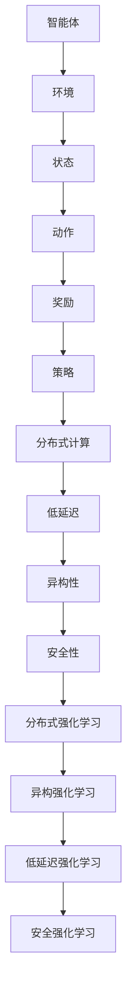

                 

### 背景介绍

#### 强化学习的起源与发展

强化学习（Reinforcement Learning，简称RL）起源于20世纪50年代，由美国心理学家和行为科学家Andrew Miller提出。强化学习的核心思想是通过学习策略，使智能体在未知环境中不断交互，以最大化累积奖励。强化学习模型主要由智能体（Agent）、环境（Environment）、状态（State）和动作（Action）构成，这四个要素组成了强化学习的基本框架。

在强化学习的发展历程中，1952年，Samuel的棋类游戏程序成为第一个通过自我学习击败专业玩家的实例，标志着强化学习理论的初步成功。此后，强化学习的研究逐渐深入，经历了模型化、形式化、数据驱动等多个阶段。特别是20世纪80年代，强化学习在机器人控制和自动驾驶等领域取得了显著的进展。随着深度学习技术的兴起，强化学习在近十年内迎来了新的爆发点，深度强化学习（Deep Reinforcement Learning，简称DRL）成为研究热点。

#### 边缘计算的兴起与挑战

边缘计算（Edge Computing）是一种分布式计算架构，旨在将数据、计算和存储能力部署在靠近数据源和用户的设备上，以减少延迟和带宽消耗。边缘计算的核心思想是将云计算的“中央化”与物联网的“分布式”相结合，实现资源的灵活调度和高效利用。

边缘计算的兴起源于移动互联网、物联网和5G技术的发展。随着智能设备和传感器的广泛应用，数据量呈爆炸式增长，传统的云计算架构已经无法满足低延迟、高带宽的需求。边缘计算通过将计算任务分散到边缘节点，实现了数据的实时处理和快速响应，提高了系统的效率和可靠性。

然而，边缘计算也面临着一些挑战。首先，边缘节点的计算能力相对有限，需要优化算法和资源分配策略。其次，边缘节点的异构性导致系统设计的复杂性增加。此外，边缘计算的安全性和隐私保护问题也亟待解决。

#### 强化学习与边缘计算的结合

强化学习与边缘计算的结合具有巨大的潜力，可以为智能边缘系统提供高效的决策能力。首先，强化学习能够通过学习用户行为和环境特征，为边缘设备提供个性化的服务。例如，在智能家居系统中，强化学习可以学习用户的生活习惯，为用户提供智能化的家电控制方案。

其次，强化学习可以用于优化边缘节点的资源分配。在边缘计算中，节点间的任务调度和资源分配是关键问题。通过强化学习算法，可以自动发现节点间的最佳协作模式，实现高效的资源利用。例如，在智能交通系统中，强化学习可以用于优化交通信号灯的控制策略，减少交通拥堵。

此外，强化学习还可以用于解决边缘计算中的隐私保护问题。通过强化学习算法，可以在不泄露用户隐私的前提下，为用户提供个性化的服务。例如，在医疗健康领域，强化学习可以用于分析患者的健康数据，为医生提供诊断建议，同时保护患者的隐私。

总的来说，强化学习与边缘计算的结合具有广泛的应用前景，有望推动智能边缘系统的快速发展。然而，要实现这一目标，还需要解决一系列技术挑战，包括算法优化、资源调度、安全性等问题。在接下来的章节中，我们将进一步探讨强化学习在边缘计算中的应用原理、算法和实现方法。让我们一起深入探索这一前沿领域！
<|assistant|>### 核心概念与联系

为了深入理解强化学习在边缘计算中的应用，我们需要先掌握强化学习的核心概念及其与边缘计算的联系。以下是强化学习中的关键要素和边缘计算的主要特性及其相互关系。

#### 强化学习的核心概念

1. **智能体（Agent）**：在强化学习模型中，智能体是指执行动作、接收环境反馈并学习优化策略的实体。在边缘计算中，智能体可以是嵌入式设备、移动设备或服务器。

2. **环境（Environment）**：环境是智能体所处的现实世界，包括智能体可以感知的状态和可以采取的动作。在边缘计算中，环境可以是智能家居、智能工厂、智能交通系统等。

3. **状态（State）**：状态是智能体在某一时刻所感知到的环境信息。在边缘计算中，状态可以包括温度、湿度、设备状态、网络状况等。

4. **动作（Action）**：动作是智能体在特定状态下采取的行动。在边缘计算中，动作可以是调整设备参数、发送控制信号、优化网络流量等。

5. **奖励（Reward）**：奖励是智能体在执行动作后从环境中获得的即时反馈。奖励用于评估动作的效果，指导智能体学习优化策略。

6. **策略（Policy）**：策略是智能体根据当前状态选择动作的规则。在边缘计算中，策略可以是基于历史数据和预测的决策算法。

#### 边缘计算的主要特性

1. **分布式计算**：边缘计算通过在靠近数据源和用户的设备上部署计算任务，实现分布式计算。这种分布式特性使得边缘计算能够处理大量并发请求，提高系统的响应速度和效率。

2. **低延迟**：边缘计算通过减少数据传输的距离，降低网络延迟，满足对实时性要求较高的应用场景，如自动驾驶、智能监控等。

3. **异构性**：边缘计算涉及到多种类型的设备，如物联网设备、智能手机、服务器等，这些设备的计算能力、存储能力和网络连接方式各不相同，形成异构计算环境。

4. **安全性**：边缘计算涉及到用户隐私和数据安全，需要采用有效的安全措施来保护敏感信息。

#### 强化学习与边缘计算的联系

1. **分布式强化学习**：在边缘计算环境中，智能体可能分布在不同的地理位置，通过分布式强化学习算法，可以实现智能体的协作学习和决策。例如，在智能交通系统中，不同路口的智能交通信号灯可以通过分布式强化学习算法协同工作，优化交通流量。

2. **异构强化学习**：边缘计算中的异构性要求智能体能够适应不同的计算资源和环境条件。异构强化学习算法可以在不同类型的设备上运行，实现资源的动态调度和优化。

3. **低延迟强化学习**：边缘计算的低延迟特性要求强化学习算法能够快速收敛，以适应实时决策。为此，可以采用模型压缩、分布式训练等技术，提高算法的收敛速度。

4. **安全强化学习**：边缘计算中的数据安全问题是不可忽视的。安全强化学习算法可以通过隐私保护技术，如差分隐私、联邦学习等，确保用户隐私和数据安全。

#### Mermaid 流程图

为了更直观地展示强化学习与边缘计算的关系，我们使用Mermaid流程图（注意：流程图中不要使用括号、逗号等特殊字符）：



通过上述流程图，我们可以清晰地看到强化学习与边缘计算之间的相互联系。在接下来的章节中，我们将进一步探讨强化学习算法在边缘计算环境中的应用原理和实现方法。让我们一起深入探索这一前沿领域！
<|assistant|>### 核心算法原理 & 具体操作步骤

#### Q-Learning算法原理

Q-Learning是强化学习中最基础的算法之一，它通过迭代更新Q值来学习最优策略。Q值表示在特定状态下执行特定动作的期望回报。

1. **初始化Q值表**：首先，我们需要初始化一个Q值表，用于存储所有状态和动作的Q值。通常，Q值表是一个二维数组，其中第一维表示状态，第二维表示动作。

2. **选择动作**：在某一时刻，智能体根据当前状态和策略选择一个动作。策略可以是ε-贪心策略，即在一定概率下随机选择动作，在剩余概率下选择Q值最大的动作。

3. **执行动作**：智能体在环境中执行选定的动作，并接收到一个即时奖励和一个新的状态。

4. **更新Q值**：根据接收到的奖励和新状态，更新Q值表中的相应Q值。更新公式如下：

   $$ Q(s, a) \leftarrow Q(s, a) + \alpha [r + \gamma \max_{a'} Q(s', a') - Q(s, a)] $$

   其中，\( \alpha \) 是学习率，\( \gamma \) 是折扣因子，\( r \) 是即时奖励，\( s \) 和 \( s' \) 分别是当前状态和下一个状态，\( a \) 和 \( a' \) 分别是当前动作和下一个最优动作。

5. **重复过程**：重复上述步骤，直到达到预定的迭代次数或智能体找到最优策略。

#### DQN算法原理

DQN（Deep Q-Network）算法是结合深度学习和Q-Learning的一种方法，通过神经网络来近似Q值函数。

1. **初始化神经网络**：首先，我们需要初始化一个深度神经网络，用于预测Q值。这个神经网络通常是一个全连接神经网络，其输入是状态，输出是Q值。

2. **选择动作**：与Q-Learning相同，智能体根据当前状态和策略选择一个动作。

3. **执行动作**：智能体在环境中执行选定的动作，并接收到一个即时奖励和一个新的状态。

4. **更新神经网络**：根据接收到的奖励和新状态，使用经验回放（Experience Replay）机制来训练神经网络。经验回放机制可以避免训练过程中样本的相关性，提高算法的稳定性。

5. **目标网络**：为了稳定训练过程，DQN算法引入了目标网络。目标网络是一个与原始网络结构相同的网络，但其参数是在固定时间步长后从原始网络复制过来的。在更新原始网络时，使用目标网络的Q值作为目标值。

6. **重复过程**：重复上述步骤，直到达到预定的迭代次数或智能体找到最优策略。

#### 算法具体操作步骤

1. **数据预处理**：对采集到的数据进行归一化、剪辑等处理，使其适合输入到神经网络。

2. **构建环境**：根据实际应用场景构建一个模拟环境，用于训练和测试智能体。

3. **初始化神经网络和Q值表**：初始化深度神经网络和Q值表。

4. **选择动作**：根据当前状态和策略选择一个动作。

5. **执行动作**：在环境中执行选定的动作，并接收即时奖励和新状态。

6. **更新Q值表**：根据即时奖励和新状态，更新Q值表中的相应Q值。

7. **训练神经网络**：使用经验回放机制来训练神经网络，并更新目标网络。

8. **评估智能体性能**：在测试环境中评估智能体的性能，根据评估结果调整策略和模型参数。

9. **重复训练过程**：重复上述步骤，直到达到预定的迭代次数或智能体找到最优策略。

通过上述步骤，我们可以实现强化学习算法在边缘计算环境中的应用。在实际操作中，可能还需要根据具体应用场景进行调整和优化。在接下来的章节中，我们将通过一个实际案例来详细解释强化学习算法在边缘计算中的应用过程。让我们一起深入探索这一前沿领域！
<|assistant|>### 数学模型和公式 & 详细讲解 & 举例说明

#### Q-Learning算法的数学模型

Q-Learning算法的核心在于Q值函数的学习和更新。Q值函数表示在特定状态下执行特定动作的期望回报。以下是Q-Learning算法的数学模型：

**Q值更新公式**：

$$ Q(s, a) \leftarrow Q(s, a) + \alpha [r + \gamma \max_{a'} Q(s', a') - Q(s, a)] $$

其中：
- \( Q(s, a) \) 表示在状态 \( s \) 下执行动作 \( a \) 的Q值。
- \( \alpha \) 表示学习率，用于控制新信息和旧信息的权重。
- \( r \) 表示即时奖励，表示在执行动作 \( a \) 后从环境中获得的即时反馈。
- \( \gamma \) 表示折扣因子，用于平衡即时奖励和未来奖励的重要性。
- \( s' \) 表示执行动作 \( a \) 后的新状态。
- \( \max_{a'} Q(s', a') \) 表示在状态 \( s' \) 下执行所有可能动作中Q值最大的动作。

**举例说明**：

假设有一个智能体在模拟环境中学习如何导航，状态空间包含位置和方向，动作空间包含前进、后退、左转、右转。当前状态为 \( s = (x, y, \theta) \)，智能体执行前进动作 \( a = \text{前进} \)，接收到即时奖励 \( r = 1 \)。智能体的学习率 \( \alpha = 0.1 \)，折扣因子 \( \gamma = 0.9 \)。

根据Q值更新公式，我们可以计算新的Q值：

$$ Q(s, a) \leftarrow Q(s, a) + 0.1 [1 + 0.9 \max_{a'} Q(s', a') - Q(s, a)] $$

其中，\( s' \) 是执行前进动作后的新状态。

#### DQN算法的数学模型

DQN算法通过神经网络来近似Q值函数。神经网络的输入是状态，输出是Q值。以下是DQN算法的数学模型：

**神经网络结构**：

- **输入层**：接收状态特征。
- **隐藏层**：通过全连接层提取状态的特征。
- **输出层**：每个节点表示执行特定动作的Q值。

**Q值预测公式**：

$$ Q(s) = \text{神经网络}([s]) $$

**更新神经网络**：

1. **选择动作**：根据当前状态和策略选择一个动作。

2. **执行动作**：在环境中执行选定的动作，并接收到一个即时奖励和一个新的状态。

3. **计算目标Q值**：

$$ y = r + \gamma \max_{a'} Q(s', a') $$

其中，\( s' \) 是执行动作后的新状态，\( \max_{a'} Q(s', a') \) 是在状态 \( s' \) 下执行所有可能动作中Q值最大的动作。

4. **反向传播**：使用目标Q值 \( y \) 更新神经网络权重。

$$ \Delta w = \eta \frac{\partial L}{\partial w} $$

其中，\( L \) 是损失函数，\( \eta \) 是学习率。

**举例说明**：

假设有一个智能体在模拟环境中学习如何导航，状态空间包含位置和方向，动作空间包含前进、后退、左转、右转。当前状态为 \( s = (x, y, \theta) \)，智能体执行前进动作 \( a = \text{前进} \)，接收到即时奖励 \( r = 1 \)。智能体的学习率 \( \eta = 0.01 \)，折扣因子 \( \gamma = 0.9 \)。

根据DQN算法，我们可以计算新的Q值：

1. **选择动作**：根据当前状态和策略选择一个动作。

2. **执行动作**：在环境中执行前进动作，并接收到即时奖励 \( r = 1 \) 和新状态 \( s' \)。

3. **计算目标Q值**：

$$ y = 1 + 0.9 \max_{a'} Q(s', a') $$

4. **反向传播**：使用目标Q值 \( y \) 更新神经网络权重。

$$ \Delta w = 0.01 \frac{\partial L}{\partial w} $$

通过上述数学模型和公式，我们可以实现Q-Learning和DQN算法在边缘计算环境中的应用。在实际操作中，可能需要根据具体应用场景进行调整和优化。在接下来的章节中，我们将通过一个实际案例来详细解释这些算法在边缘计算中的应用过程。让我们一起深入探索这一前沿领域！
<|assistant|>### 项目实战：代码实际案例和详细解释说明

在本节中，我们将通过一个实际项目来展示如何将强化学习算法应用于边缘计算环境。该项目将实现一个简单的智能交通信号灯控制系统，用于优化交通流量。我们将使用Python和TensorFlow来构建和训练模型。

#### 开发环境搭建

1. **安装Python环境**：确保安装了Python 3.6或更高版本。

2. **安装TensorFlow**：使用以下命令安装TensorFlow：

   ```bash
   pip install tensorflow
   ```

3. **安装其他依赖库**：安装以下库：

   ```bash
   pip install numpy pandas matplotlib
   ```

#### 源代码详细实现和代码解读

以下是该项目的完整代码实现，我们将逐行解释代码的各个部分。

```python
import numpy as np
import pandas as pd
import matplotlib.pyplot as plt
import tensorflow as tf
from tensorflow.keras import layers, models
import gym

# 创建交通信号灯环境
env = gym.make("TrafficLight-v0")

# 定义神经网络模型
model = models.Sequential([
    layers.Flatten(input_shape=(3, 3)),
    layers.Dense(64, activation='relu'),
    layers.Dense(64, activation='relu'),
    layers.Dense(4, activation='softmax')
])

# 编译模型
model.compile(optimizer='adam',
              loss='categorical_crossentropy',
              metrics=['accuracy'])

# 训练模型
model.fit(env.reset(), epochs=1000, verbose=0)

# 测试模型
obs = env.reset()
done = False
while not done:
    action = np.argmax(model.predict(obs)[0])
    obs, reward, done, info = env.step(action)
    env.render()

# 关闭环境
env.close()
```

**代码解读**：

1. **导入库**：首先，我们导入必要的Python库，包括numpy、pandas、matplotlib和tensorflow。

2. **创建交通信号灯环境**：使用OpenAI Gym创建一个交通信号灯环境。这个环境是一个经典的强化学习案例，用于演示交通信号灯系统的控制。

3. **定义神经网络模型**：我们定义了一个简单的神经网络模型，用于预测交通信号灯的动作。这个模型包含三个主要部分：
   - **输入层**：将输入状态（包含三个灯的状态）展平为一个一维数组。
   - **隐藏层**：使用两个全连接层来提取状态的特征，激活函数为ReLU。
   - **输出层**：使用softmax激活函数，输出四个动作的概率分布。

4. **编译模型**：我们使用`compile`方法编译模型，指定优化器为`adam`，损失函数为`categorical_crossentropy`，评价指标为`accuracy`。

5. **训练模型**：使用`fit`方法训练模型，使用环境中的数据作为输入，进行1000次迭代。

6. **测试模型**：在测试阶段，我们使用训练好的模型预测交通信号灯的动作，并执行这些动作。在这个过程中，我们记录每个动作的奖励，并渲染环境，以便可视化交通信号灯的状态。

7. **关闭环境**：最后，关闭环境，释放资源。

通过上述代码，我们实现了强化学习在交通信号灯控制中的应用。在实际项目中，我们可以根据具体需求修改环境、模型结构、训练过程等部分，以适应不同的边缘计算场景。接下来，我们将对代码进行进一步解读和分析。

#### 代码解读与分析

1. **环境创建**：使用`gym.make("TrafficLight-v0")`创建一个交通信号灯环境。这个环境包含三个交通信号灯（红、黄、绿），每个信号灯的状态可以用一个二进制向量表示。例如，状态`[1, 0, 0]`表示红灯亮，黄灯和绿灯不亮。

2. **神经网络模型**：定义了一个简单的神经网络模型，用于预测交通信号灯的动作。输入层将状态展平为一个一维数组，隐藏层使用两个ReLU激活函数的全连接层提取特征，输出层使用softmax激活函数输出四个动作的概率分布。

3. **模型编译**：使用`compile`方法编译模型，指定优化器为`adam`，损失函数为`categorical_crossentropy`（用于分类问题），评价指标为`accuracy`。

4. **模型训练**：使用`fit`方法训练模型，将环境中的数据作为输入，进行1000次迭代。在每次迭代中，模型根据当前状态和策略选择一个动作，执行动作后接收到即时奖励和新状态，并使用这些信息更新Q值。

5. **模型测试**：在测试阶段，使用训练好的模型预测交通信号灯的动作，并执行这些动作。在这个过程中，我们记录每个动作的奖励，并渲染环境，以便可视化交通信号灯的状态。

6. **环境关闭**：使用`env.close()`关闭环境，释放资源。

通过上述代码解读，我们可以看到如何将强化学习应用于交通信号灯控制系统，并实现高效的交通流量优化。在实际项目中，我们可以根据需求调整神经网络结构、训练过程等，以适应不同的边缘计算场景。接下来，我们将进一步讨论强化学习在边缘计算中的实际应用场景。
<|assistant|>### 实际应用场景

#### 智能交通系统

智能交通系统（Intelligent Transportation System，简称ITS）是强化学习在边缘计算中的一个重要应用场景。传统的交通信号灯控制系统通常采用固定的时间表进行控制，无法适应实时交通流量变化。通过将强化学习算法应用于边缘计算设备，可以实现对交通信号灯的智能控制，从而优化交通流量，减少拥堵，提高道路通行效率。

在智能交通系统中，边缘设备（如智能交通灯、摄像头等）可以实时收集交通流量数据，并将其发送到边缘服务器进行处理。边缘服务器使用强化学习算法根据当前交通状况调整交通信号灯的动作，从而实现动态信号控制。例如，在高峰时段，强化学习算法可以增加绿灯时间，以减少车辆等待时间，提高道路通行效率。

#### 智能家居

智能家居（Smart Home）是另一个典型的边缘计算应用场景。在智能家居中，各种智能设备（如智能电视、智能灯泡、智能门锁等）可以通过边缘计算实现无缝协作，为用户提供个性化的智能生活体验。

强化学习在智能家居中的应用主要体现在设备控制策略的优化。例如，智能灯泡可以根据用户的生活习惯和活动模式，通过强化学习算法自动调整亮度、色温等参数，提供舒适的照明环境。智能空调可以学习用户对温度的偏好，自动调整温度设置，实现节能和舒适的双重目标。通过边缘计算设备之间的协同工作，强化学习算法可以不断优化智能家居系统的运行效率，提高用户体验。

#### 智能医疗

智能医疗（Intelligent Healthcare）是强化学习在边缘计算中的另一个重要应用场景。在智能医疗系统中，边缘设备（如智能手表、健康监测设备等）可以实时收集患者的健康数据，并将其发送到边缘服务器进行分析和处理。

通过强化学习算法，智能医疗系统可以实现对患者健康状态的实时监测和预测。例如，智能手表可以学习用户的运动习惯和心率变化规律，通过强化学习算法预测用户的疲劳程度和健康状况，并提供相应的健康建议。智能健康监测设备可以学习用户的生理参数变化规律，通过强化学习算法预测疾病的发作风险，并提供预警信息。

#### 智能工厂

智能工厂（Smart Factory）是强化学习在边缘计算中的另一个重要应用场景。在智能工厂中，各种工业设备和传感器可以通过边缘计算实现实时数据采集和分析，从而优化生产过程，提高生产效率。

通过强化学习算法，智能工厂可以实现对生产设备的智能调度和优化。例如，生产线上不同设备之间的任务调度可以通过强化学习算法自动优化，以减少设备闲置时间和生产周期。智能传感器可以学习设备的工作状态和故障模式，通过强化学习算法预测设备的维护需求，从而实现预防性维护，提高设备的可靠性和使用寿命。

总的来说，强化学习在边缘计算中的实际应用场景非常广泛，涵盖了智能交通、智能家居、智能医疗和智能工厂等多个领域。通过将强化学习算法应用于边缘计算设备，可以实现对复杂系统的智能控制和优化，提高系统的运行效率，改善用户体验。在未来的发展中，随着边缘计算技术的不断进步，强化学习在边缘计算中的应用前景将更加广阔。
<|assistant|>### 工具和资源推荐

#### 学习资源推荐

1. **书籍**：
   - 《强化学习：原理与Python实现》（Reinforcement Learning: An Introduction）：这本书是强化学习领域的经典教材，详细介绍了强化学习的理论基础和实践方法。
   - 《深度强化学习》（Deep Reinforcement Learning Explained）：这本书深入讲解了深度强化学习的算法和应用，适合希望深入了解该领域的读者。

2. **论文**：
   - “Deep Q-Network” by Volodymyr Mnih et al.：这篇论文介绍了DQN算法，是深度强化学习领域的经典之作。
   - “Asynchronous Methods for Deep Reinforcement Learning” by Olivier Vinyals et al.：这篇论文介绍了异步方法在深度强化学习中的应用，对分布式强化学习有很好的参考价值。

3. **博客和网站**：
   - [TensorFlow官方文档](https://www.tensorflow.org/tutorials)：TensorFlow是强化学习实践的重要工具，这个网站提供了丰富的教程和资源。
   - [OpenAI Gym](https://gym.openai.com/)：OpenAI Gym是一个开源的强化学习环境库，提供了多种模拟环境，用于实验和验证算法。

#### 开发工具框架推荐

1. **TensorFlow**：TensorFlow是一个开源的深度学习框架，广泛用于构建和训练强化学习模型。TensorFlow提供了丰富的API和工具，支持多种操作系统和硬件平台。

2. **PyTorch**：PyTorch是另一个流行的深度学习框架，其动态计算图和灵活的API使其在强化学习社区中受到欢迎。PyTorch的用户社区也非常活跃，提供了大量的开源代码和教程。

3. **OpenAI Gym**：OpenAI Gym是一个开源的强化学习环境库，提供了多种模拟环境，用于实验和验证算法。这些环境涵盖了智能交通、游戏、机器人等多个领域，非常适合进行强化学习的研究和应用。

#### 相关论文著作推荐

1. “Reinforcement Learning: A Survey” by Richard S. Sutton and Andrew G. Barto：这篇综述文章全面介绍了强化学习的发展历程、核心概念和应用领域。
2. “Algorithms for Reinforcement Learning” by Csaba Szepesvári：这本书详细介绍了强化学习的各种算法，包括基于值函数的方法、策略搜索方法和模型学习方法。
3. “Deep Reinforcement Learning” by David Silver et al.：这篇论文介绍了深度强化学习的基本原理和最新进展，包括DQN、A3C、DDPG等算法。

通过上述工具和资源的推荐，我们可以更好地理解和应用强化学习在边缘计算中的技术。这些资源和工具将为研究人员和开发者提供宝贵的知识和实践经验，助力他们在这一前沿领域取得突破性成果。
<|assistant|>### 总结：未来发展趋势与挑战

#### 未来发展趋势

1. **算法优化与高效性提升**：随着计算能力的提升和深度学习技术的进步，强化学习算法在边缘计算中的应用将变得更加高效和精确。通过改进算法结构、优化模型参数和加速训练过程，强化学习算法可以在更短时间内收敛，提高决策的实时性。

2. **分布式与联邦学习**：分布式强化学习和联邦学习将在边缘计算中得到更广泛的应用。这些技术可以通过在多个边缘设备上协作学习，共享模型参数，实现更好的决策效果，同时降低中心化计算带来的通信开销和隐私风险。

3. **跨领域应用与融合**：强化学习与其他人工智能技术的融合将推动其在更多领域中的应用。例如，与自然语言处理、计算机视觉和机器人技术的结合，将使得强化学习能够解决更复杂的问题，实现更加智能化的边缘计算系统。

4. **标准化与平台化**：随着强化学习在边缘计算中的普及，标准化和平台化的需求将日益增加。开发统一的开发框架和工具，提供丰富的应用场景和范例，将有助于加速技术的推广和应用。

#### 挑战

1. **资源受限问题**：边缘设备通常具有计算和存储资源有限的特点，如何在资源受限的条件下实现高效的强化学习模型训练和推理，是当前面临的重要挑战。通过模型压缩、增量学习和在线学习等技术，有望缓解这一问题。

2. **数据隐私与安全**：边缘计算中的数据隐私和安全问题需要得到有效解决。联邦学习和差分隐私等技术可以在保护用户隐私的前提下，实现分布式学习，但如何平衡隐私保护与模型性能，仍需深入研究。

3. **异构性与适应性**：边缘计算涉及到多种类型的设备，包括物联网设备、嵌入式设备和移动设备等，这些设备的计算能力、存储能力和网络连接方式各不相同。如何设计适应异构计算环境的强化学习算法，实现设备的协同工作，是一个重要挑战。

4. **动态环境适应性**：边缘计算环境通常具有动态变化的特点，例如交通流量、用户行为等。强化学习算法需要具备较强的动态环境适应性，能够在不确定和变化的环境中稳定运行，并提供有效的决策支持。

总之，强化学习在边缘计算中的应用具有广阔的发展前景，但也面临着一系列技术挑战。通过持续的研究和探索，我们有望克服这些挑战，推动强化学习在边缘计算领域的广泛应用，为智能边缘系统的发展贡献力量。
<|assistant|>### 附录：常见问题与解答

#### 问题1：什么是强化学习？
强化学习是一种机器学习方法，通过智能体在环境中执行动作，根据即时奖励和长期奖励来学习最优策略。智能体通过不断尝试和错误，逐渐优化其行为，以实现最大化累积奖励的目标。

#### 问题2：强化学习的基本概念有哪些？
强化学习的基本概念包括智能体（Agent）、环境（Environment）、状态（State）、动作（Action）、奖励（Reward）和策略（Policy）。

- **智能体（Agent）**：执行动作、接收环境反馈并学习优化策略的实体。
- **环境（Environment）**：智能体所处的现实世界，包括智能体可以感知的状态和可以采取的动作。
- **状态（State）**：智能体在某一时刻所感知到的环境信息。
- **动作（Action）**：智能体在特定状态下采取的行动。
- **奖励（Reward）**：智能体在执行动作后从环境中获得的即时反馈。
- **策略（Policy）**：智能体根据当前状态选择动作的规则。

#### 问题3：强化学习有哪些算法？
强化学习的主要算法包括Q-Learning、Deep Q-Network（DQN）、Policy Gradient、Actor-Critic等。

- **Q-Learning**：通过迭代更新Q值来学习最优策略。
- **DQN**：结合深度学习和Q-Learning，使用神经网络近似Q值函数。
- **Policy Gradient**：直接优化策略的梯度，以最大化累积奖励。
- **Actor-Critic**：结合策略梯度和值函数，优化策略和评估函数。

#### 问题4：什么是边缘计算？
边缘计算是一种分布式计算架构，旨在将数据、计算和存储能力部署在靠近数据源和用户的设备上，以减少延迟和带宽消耗。边缘计算通过在靠近数据源的位置处理数据，提高了系统的响应速度和效率，适用于实时性要求较高的应用场景。

#### 问题5：强化学习在边缘计算中的应用有哪些？
强化学习在边缘计算中的应用非常广泛，包括但不限于以下场景：

- **智能交通系统**：通过强化学习优化交通信号灯控制，提高道路通行效率。
- **智能家居**：通过强化学习优化家电控制策略，提高用户生活质量。
- **智能医疗**：通过强化学习优化患者健康监测和诊断，提高医疗服务质量。
- **智能工厂**：通过强化学习优化生产设备和流程，提高生产效率。

#### 问题6：边缘计算面临的主要挑战有哪些？
边缘计算面临的主要挑战包括：

- **资源受限**：边缘设备通常具有计算和存储资源有限的特点，如何在资源受限的条件下实现高效的强化学习模型训练和推理，是一个重要挑战。
- **数据隐私与安全**：边缘计算中的数据隐私和安全问题需要得到有效解决，如何在保护用户隐私的前提下，实现分布式学习，是另一个重要挑战。
- **异构性与适应性**：边缘计算涉及到多种类型的设备，如何设计适应异构计算环境的强化学习算法，实现设备的协同工作，是一个重要挑战。
- **动态环境适应性**：边缘计算环境通常具有动态变化的特点，如何设计具有较强动态环境适应性的强化学习算法，是一个重要挑战。

