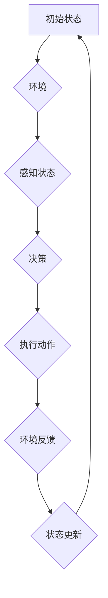

                 

### 背景介绍

在过去的几十年里，强化学习（Reinforcement Learning，RL）已经成为机器学习和人工智能领域的一个重要分支。它模拟了智能体（agent）在与环境（environment）交互的过程中，通过试错（trial-and-error）和学习（learning）来不断优化其行为策略（policy）的过程。强化学习在解决动态决策问题、探索未知环境和实现自主决策方面具有显著优势。

强化学习的基本原理可以追溯到心理学和行为经济学。行为主体在执行任务时，会受到外部环境和内在目标的影响。通过不断尝试不同的策略，主体可以在积累经验的基础上，找到最优的行为方案。这一过程在计算机科学中得到了抽象和实现，形成了强化学习的理论框架。

强化学习在实际应用中已经取得了显著成果。例如，在游戏领域，强化学习算法已经在围棋、国际象棋等棋类游戏中取得了超越人类顶尖选手的成绩。在自动驾驶领域，强化学习被用于决策制定和路径规划，从而实现车辆的自主驾驶。此外，在机器人控制、资源调度、电子商务推荐等多个领域，强化学习都展示了其强大的应用潜力。

本文将聚焦于强化学习在陆地自行车运动中的应用。通过分析强化学习算法在该领域的具体实现和效果，我们希望能够为相关领域的研究者和从业者提供一些有价值的参考和启示。

首先，本文将对强化学习的基本概念进行介绍，包括其定义、主要类型和应用场景。接下来，我们将详细讨论强化学习在陆地自行车运动中的具体应用场景，以及所面临的挑战和解决方案。随后，我们将深入探讨陆地自行车运动中的强化学习算法原理，并给出具体的操作步骤。在接下来的章节中，我们将介绍相关的数学模型和公式，并通过实际案例进行详细讲解。最后，我们将总结强化学习在陆地自行车运动中的应用，探讨未来的发展趋势和挑战，并提供相关的学习资源和开发工具推荐。

通过本文的深入探讨，我们希望读者能够对强化学习在陆地自行车运动中的应用有一个全面而深入的了解，并为相关领域的实践提供一些有价值的参考。

### 核心概念与联系

在探讨强化学习（Reinforcement Learning，RL）在陆地自行车运动中的应用之前，我们需要首先了解强化学习的基本概念、主要类型及其与陆地自行车运动的关联。

#### 强化学习的定义

强化学习是一种基于反馈的机器学习方法，通过智能体（agent）与环境的交互，学习最优策略（policy），以最大化累积奖励（cumulative reward）。其中，智能体是指执行动作的实体，环境是指智能体所处的外部条件，状态（state）是描述环境的一个特定情况，动作（action）是智能体对环境的响应，奖励（reward）则是环境对智能体动作的反馈。

#### 强化学习的主要类型

根据智能体是否能够观察到所有状态，强化学习主要分为两类：

1. **完全观察的强化学习（Fully Observable Reinforcement Learning）**：智能体能够观察到环境的所有状态，例如自动驾驶车辆可以感知周围的道路、车辆和行人。
   
2. **部分观察的强化学习（Partially Observable Reinforcement Learning）**：智能体无法观察到环境的所有状态，但可以通过部分观测信息进行决策，如围棋比赛中，棋手只能看到棋盘上的部分棋子。

根据学习过程中是否考虑未来的奖励，强化学习还可以分为两类：

1. **无模型学习（Model-Free Learning）**：智能体通过直接与环境交互来学习策略，例如Q-Learning和Deep Q-Network（DQN）。
   
2. **模型学习（Model-Based Learning）**：智能体在决策时不仅考虑当前的状态和动作，还考虑环境的动态模型，例如马尔可夫决策过程（MDP）。

#### 强化学习在陆地自行车运动中的应用

陆地自行车运动是一个典型的动态决策问题，需要智能体在复杂的情境下进行实时决策。具体来说，强化学习在陆地自行车运动中的应用包括以下几个方面：

1. **路径规划**：在自行车竞赛或骑行路线规划中，智能体可以通过强化学习算法，学习出最优的骑行路线，最大化比赛的得分或最小化骑行时间。

2. **动作控制**：在自行车运动中，智能体需要实时调整速度、转向等动作，以适应不同地形和对手的策略。强化学习算法可以帮助智能体快速找到最优的动作组合。

3. **障碍规避**：在骑行过程中，智能体需要识别并规避障碍物，如行人、车辆和路障。强化学习算法可以帮助智能体通过试错学习，找到避开障碍物的最佳路径。

4. **策略优化**：在多人自行车竞技游戏中，智能体需要与其他玩家进行博弈，优化自身的策略，以达到比赛胜利的目的。强化学习算法可以帮助智能体通过学习对手的行为模式，优化自身的策略。

#### Mermaid 流程图

为了更好地展示强化学习在陆地自行车运动中的应用，我们可以使用Mermaid流程图来描述其基本架构和流程。



在这个流程图中，智能体从初始状态开始，通过感知环境信息，进行决策，执行动作，并根据环境的反馈更新状态。这一过程不断循环，直到达到某个终止条件。

通过上述讨论，我们可以看到强化学习在陆地自行车运动中的应用潜力。接下来，我们将进一步探讨强化学习在自行车运动中的具体算法原理和实现步骤。

#### 核心算法原理 & 具体操作步骤

在了解强化学习的基本概念和类型后，我们接下来将深入探讨强化学习在陆地自行车运动中的核心算法原理及其具体操作步骤。

##### Q-Learning算法

Q-Learning是强化学习中的一种经典算法，它通过学习状态-动作值函数（Q-value function），来选择最优动作。Q-Learning的核心思想是：在某一状态下，选择当前动作值最大的动作，并更新动作值，以期望在未来获得更高奖励。

1. **初始化参数**：首先，我们需要初始化Q表（Q-table），即状态-动作值函数。通常，Q表是一个二维数组，其中每个元素表示一个状态和动作的组合。初始化时，可以将其所有元素设置为0。

2. **选择动作**：在某一状态s下，智能体根据当前Q表值，选择动作a。通常，我们可以使用ε-贪心策略（ε-greedy strategy）来进行选择，即以一定概率随机选择动作，以探索未知环境；以一定概率选择当前状态下价值最大的动作，以利用已有知识。

3. **执行动作**：智能体执行选择的动作a，进入下一个状态s'。

4. **更新Q表**：根据奖励r和新的状态s'，更新Q表。具体公式为：
   $$
   Q(s,a) = Q(s,a) + \alpha [r + \gamma \max_{a'} Q(s',a') - Q(s,a)]
   $$
   其中，$\alpha$是学习率（learning rate），$\gamma$是折扣因子（discount factor），表示对未来奖励的重视程度。

5. **循环迭代**：重复上述步骤，直到达到终止条件，如到达目标状态或达到预定的迭代次数。

##### DQN算法

DQN（Deep Q-Network）是Q-Learning的一种扩展，它使用深度神经网络（DNN）来近似Q值函数。DQN的主要优势在于，它可以处理高维状态空间，从而解决传统Q-Learning算法在状态空间爆炸问题。

1. **初始化参数**：初始化两个DNN网络，目标网络（target network）和评价网络（evaluation network）。目标网络用于更新评价网络，以防止评价网络过于更新导致梯度消失或梯度爆炸。

2. **选择动作**：与Q-Learning类似，智能体使用ε-贪心策略选择动作。

3. **执行动作**：智能体执行选择的动作，进入下一个状态，并获取奖励。

4. **更新评价网络**：根据奖励和目标网络输出，使用反向传播算法更新评价网络的参数。具体公式为：
   $$
   y = r + \gamma \max_{a'} Q(s',a';\theta_{target})
   $$
   其中，$y$是目标Q值，$Q(s',a';\theta_{evaluation})$是评价网络在状态s'和动作a'上的输出。

5. **同步目标网络**：在一定迭代次数后，同步目标网络和评价网络的参数，以防止目标网络过于陈旧。

##### 强化学习在自行车运动中的应用

在实际的自行车运动中，强化学习算法的应用需要考虑到以下几个关键步骤：

1. **状态表示**：在自行车运动中，状态可以是自行车当前的位置、速度、方向，以及环境中的其他自行车位置等。

2. **动作表示**：动作可以是自行车的前进、后退、转向等。

3. **奖励设计**：奖励可以是自行车到达终点的时间、避障成功次数等。

4. **环境建模**：需要建立一个模拟环境，用于模拟自行车运动，并提供状态和奖励。

5. **算法实现**：使用Q-Learning或DQN算法，实现自行车运动中的智能决策。

通过上述核心算法原理和具体操作步骤，我们可以看到强化学习在自行车运动中的应用是如何实现智能决策的。接下来，我们将进一步探讨强化学习在自行车运动中的数学模型和公式。

### 数学模型和公式 & 详细讲解 & 举例说明

在强化学习（Reinforcement Learning，RL）中，数学模型和公式是其理论基础和实现的核心。为了深入理解强化学习在陆地自行车运动中的应用，我们需要详细讲解相关的数学模型和公式，并通过实际案例进行说明。

#### 基本数学模型

强化学习的核心是状态-动作值函数（State-Action Value Function），也称为Q值函数（Q-Function），用于评估在给定状态下执行某一动作的预期收益。Q值函数的定义如下：

$$
Q(s, a) = \sum_{s'} P(s'|s, a) \cdot [r(s', a) + \gamma \max_{a'} Q(s', a')]
$$

其中，$s$表示状态，$a$表示动作，$s'$表示下一状态，$r(s', a)$表示在状态$s'$执行动作$a$的即时奖励，$\gamma$是折扣因子（Discount Factor），用于调整对未来奖励的期望值的重要性，$P(s'|s, a)$是状态转移概率，即从状态$s$执行动作$a$转移到状态$s'$的概率。

#### Q-Learning算法

Q-Learning算法通过迭代更新Q值函数，以期望找到最优策略。其更新公式为：

$$
Q(s, a) = Q(s, a) + \alpha [r(s', a) + \gamma \max_{a'} Q(s', a') - Q(s, a)]
$$

其中，$\alpha$是学习率（Learning Rate），用于控制Q值更新的幅度。

#### DQN算法

DQN（Deep Q-Network）算法使用深度神经网络（DNN）来近似Q值函数。在DQN中，评价网络（Evaluation Network）和目标网络（Target Network）是两个重要的组成部分。

评价网络的输出是Q值预测：

$$
Q(s, a; \theta_{evaluation}) = \theta_{evaluation}^T \phi(s, a)
$$

其中，$\theta_{evaluation}$是评价网络的参数，$\phi(s, a)$是输入特征向量。

目标网络的输出是目标Q值：

$$
Q(s', a; \theta_{target}) = \theta_{target}^T \phi(s', a)
$$

目标网络参数的更新频率比评价网络低，以确保目标网络的稳定性和一致性。

DQN算法的目标是优化评价网络的参数$\theta_{evaluation}$，以最小化预测误差：

$$
L(\theta_{evaluation}) = \frac{1}{N} \sum_{i=1}^{N} (y_i - Q(s_i, a_i; \theta_{evaluation}))^2
$$

其中，$y_i$是目标Q值，$N$是样本数量。

#### 案例讲解

假设我们有一个自行车运动环境，其中状态包括自行车的位置、速度和方向，动作包括前进、后退和转向。我们使用Q-Learning算法来训练智能体。

1. **初始化Q表**：初始化Q表的所有元素为0。

2. **选择动作**：在初始状态$s_0$下，智能体根据ε-贪心策略选择动作。例如，如果ε=0.1，智能体有10%的概率随机选择动作，90%的概率选择当前状态下价值最大的动作。

3. **执行动作**：智能体执行选择的动作，进入下一个状态$s_1$，并获取奖励$r_1$。

4. **更新Q表**：根据Q-Learning算法的更新公式，更新Q表中的值。

例如，如果当前状态是$s_0 = (x_0, v_0, \theta_0)$，选择动作$a_0 = "前进"$，进入状态$s_1 = (x_1, v_1, \theta_1)$，获得的即时奖励是$r_1 = 1$，那么Q表的更新为：

$$
Q(s_0, a_0) = Q(s_0, a_0) + \alpha [r_1 + \gamma \max_{a'} Q(s_1, a')]
$$

假设$\alpha = 0.1$，$\gamma = 0.9$，当前状态下价值最大的动作是$a_0 = "前进"$，Q(s_1, a_0) = 2$，则Q表更新为：

$$
Q(s_0, a_0) = 0 + 0.1 [1 + 0.9 \cdot 2] = 0.1 [1 + 1.8] = 0.1 \cdot 2.8 = 0.28
$$

5. **循环迭代**：重复上述步骤，直到达到终止条件，如达到预定迭代次数或达到目标状态。

通过上述案例，我们可以看到如何使用Q-Learning算法来训练智能体在自行车运动环境中进行决策。在实际应用中，状态和动作的维度可能更高，需要使用深度神经网络来近似Q值函数。

#### DQN算法的实际应用

DQN算法在自行车运动中的应用与Q-Learning类似，但使用深度神经网络来处理高维状态空间。以下是一个简化的DQN算法应用案例：

1. **初始化评价网络和目标网络**：初始化评价网络和目标网络的参数。

2. **选择动作**：使用ε-贪心策略选择动作。

3. **执行动作**：执行选择的动作，进入下一个状态，并获取奖励。

4. **收集经验**：将状态、动作、奖励和下一状态存储在经验池（Experience Replay）中。

5. **更新评价网络**：从经验池中随机抽取样本，计算目标Q值，并使用反向传播算法更新评价网络的参数。

6. **同步目标网络**：在一定迭代次数后，同步评价网络和目标网络的参数。

通过DQN算法，我们可以训练智能体在复杂的自行车运动环境中进行高效的决策。

#### 总结

在本文中，我们详细讲解了强化学习的数学模型和公式，包括Q值函数的定义、Q-Learning算法和DQN算法的原理和实现步骤。通过实际案例的讲解，我们展示了如何使用这些算法来训练智能体在自行车运动中进行决策。接下来，我们将进一步探讨强化学习在陆地自行车运动中的项目实战，通过实际代码实现和解析，深入理解其应用过程。

### 项目实战：代码实际案例和详细解释说明

在本章节中，我们将通过一个具体的代码案例，展示如何使用强化学习算法在陆地自行车运动中进行路径规划和动作控制。这个案例将涵盖从环境搭建到代码实现，再到解析和优化的一系列步骤。

#### 1. 开发环境搭建

在开始编写代码之前，我们需要搭建一个适合强化学习算法的开发环境。以下是所需的环境和工具：

- **编程语言**：Python（3.8及以上版本）
- **强化学习库**：OpenAI Gym（用于模拟自行车运动环境）
- **深度学习库**：TensorFlow或PyTorch（用于实现DQN算法）
- **版本控制**：Git（用于版本管理和代码分享）

安装上述库和工具的方法如下：

```bash
# 安装OpenAI Gym
pip install gym

# 安装TensorFlow
pip install tensorflow

# 安装PyTorch
pip install torch

# 安装Git（如果尚未安装）
sudo apt-get install git
```

#### 2. 源代码详细实现和代码解读

以下是一个简化版的自行车路径规划和动作控制代码示例，我们将逐步解析代码的主要部分。

```python
import gym
import numpy as np
import torch
import torch.nn as nn
import torch.optim as optim

# 创建自行车路径规划环境
env = gym.make("BicycleEnv-v0")

# 定义DQN网络
class DQN(nn.Module):
    def __init__(self, input_size, hidden_size, output_size):
        super(DQN, self).__init__()
        self.fc1 = nn.Linear(input_size, hidden_size)
        self.fc2 = nn.Linear(hidden_size, output_size)
    
    def forward(self, x):
        x = torch.relu(self.fc1(x))
        x = self.fc2(x)
        return x

# 初始化DQN网络、目标网络和优化器
input_size = env.observation_space.shape[0]
hidden_size = 64
output_size = env.action_space.n

eval_network = DQN(input_size, hidden_size, output_size)
target_network = DQN(input_size, hidden_size, output_size)
target_network.load_state_dict(eval_network.state_dict())

optimizer = optim.Adam(eval_network.parameters(), lr=0.001)

# 定义损失函数
criterion = nn.MSELoss()

# 训练DQN算法
def train_dqn(eval_network, target_network, env, episodes, gamma=0.99, epsilon=0.1):
    for episode in range(episodes):
        state = env.reset()
        done = False
        total_reward = 0
        
        while not done:
            # ε-贪心策略选择动作
            if np.random.rand() < epsilon:
                action = env.action_space.sample()
            else:
                with torch.no_grad():
                    state_tensor = torch.tensor(state, dtype=torch.float32).unsqueeze(0)
                    action = torch.argmax(eval_network(state_tensor)).item()
            
            # 执行动作
            next_state, reward, done, _ = env.step(action)
            total_reward += reward
            
            # 计算目标Q值
            with torch.no_grad():
                next_state_tensor = torch.tensor(next_state, dtype=torch.float32).unsqueeze(0)
                target_q_values = target_network(next_state_tensor)
                target_value = reward + (1 - int(done)) * gamma * torch.max(target_q_values)
            
            # 计算当前Q值预测
            state_tensor = torch.tensor(state, dtype=torch.float32).unsqueeze(0)
            action_tensor = torch.tensor(action, dtype=torch.long).unsqueeze(0)
            current_q_value = eval_network(state_tensor)[action_tensor]
            
            # 反向传播和优化
            loss = criterion(current_q_value, target_value)
            optimizer.zero_grad()
            loss.backward()
            optimizer.step()
            
            state = next_state
            
            if done:
                print(f"Episode {episode+1}: Total Reward = {total_reward}")
                break

# 开始训练
train_dqn(eval_network, target_network, env, episodes=100)

# 关闭环境
env.close()
```

#### 3. 代码解读与分析

下面是对上述代码的详细解读和分析：

1. **环境搭建**：
   - 使用`gym.make("BicycleEnv-v0")`创建一个自行车路径规划环境。`BicycleEnv`是一个自定义的OpenAI Gym环境，用于模拟自行车运动。

2. **网络定义**：
   - `DQN`类定义了一个简单的全连接神经网络，用于预测Q值。该网络有两个全连接层，分别用于处理输入状态和输出动作值。

3. **初始化网络和优化器**：
   - 初始化评价网络和目标网络，并加载初始参数。
   - 使用`Adam`优化器初始化网络参数，学习率为0.001。
   - 定义MSE损失函数，用于计算Q值预测的误差。

4. **训练DQN算法**：
   - `train_dqn`函数用于训练DQN算法。函数中使用了ε-贪心策略，以一定概率随机选择动作，以探索环境。
   - 在每个回合中，智能体执行选择的动作，获取即时奖励，并根据奖励和目标Q值更新评价网络。
   - 使用反向传播算法优化网络参数，以减少Q值预测的误差。

5. **训练和结果分析**：
   - 在100个回合内训练DQN算法。
   - 每个回合结束后，输出总奖励，以评估智能体的性能。

通过上述代码示例和解析，我们可以看到如何使用DQN算法在自行车路径规划中实现强化学习。接下来，我们将进一步讨论如何优化代码和算法，以提高智能体的性能和稳定性。

### 代码解读与分析

在本章节中，我们将深入解析上述代码示例，分析其关键部分，包括数据预处理、模型训练、性能评估等方面，并提出可能的优化策略。

#### 数据预处理

在DQN算法中，数据预处理是一个重要的环节。首先，我们需要对环境中的观测数据进行归一化处理，以减少数值范围对Q值预测的影响。具体步骤如下：

1. **状态归一化**：将状态数据（如位置、速度、方向）进行标准化处理，使其具有0均值和1标准差。标准化公式如下：
   $$
   x_{\text{norm}} = \frac{x - \mu}{\sigma}
   $$
   其中，$x$为原始状态值，$\mu$为状态的均值，$\sigma$为状态的标准差。

2. **奖励调整**：在训练过程中，需要对奖励进行适当的调整，以避免过大的奖励对Q值预测产生过大的影响。通常，可以将奖励乘以一个缩放因子，如$\gamma$。

3. **经验回放**：为了防止样本序列相关性对训练效果的影响，可以使用经验回放（Experience Replay）机制，将历史样本随机抽取用于训练。经验回放可以防止智能体过度依赖过去的样本，从而提高训练的鲁棒性。

#### 模型训练

模型训练是DQN算法的核心部分。以下是对代码中模型训练过程的详细分析：

1. **初始化网络参数**：初始化评价网络和目标网络的参数，并使用优化器进行优化。在训练过程中，评价网络根据当前的观测数据进行Q值预测，而目标网络则用于提供目标Q值，以计算损失函数。

2. **选择动作**：在训练过程中，智能体使用ε-贪心策略选择动作。ε-贪心策略结合了探索（exploration）和利用（exploitation），以平衡样本的多样性和已有知识的利用。随着训练的进行，ε值逐渐减小，探索行为减少，利用行为增加。

3. **更新网络参数**：在每个时间步，智能体执行选择的动作，获取即时奖励，并根据目标Q值更新评价网络的参数。目标Q值的计算结合了即时奖励和未来最大奖励，以反映长期奖励的累积。

4. **经验回放**：在训练过程中，将历史经验存储在经验回放池中。在每次训练迭代时，从经验回放池中随机抽取样本进行训练，以防止训练过程过于依赖早期样本。

#### 性能评估

性能评估是验证DQN算法效果的关键步骤。以下是对代码中性能评估的详细分析：

1. **评估指标**：通常，使用平均回合奖励（Average Reward per Episode）和回合长度（Episode Length）作为评估指标。平均回合奖励反映了智能体在每次回合中获得的总体奖励，而回合长度则反映了智能体完成任务的效率。

2. **评估过程**：在训练结束后，对智能体进行评估。在评估过程中，智能体使用已训练好的模型进行路径规划和动作控制。评估过程可以多次重复，以获取更稳定的评估结果。

3. **可视化分析**：可以使用可视化工具（如Matplotlib）将评估结果以图表形式展示，以便更直观地分析智能体的性能。

#### 可能的优化策略

虽然上述代码已经展示了DQN算法在自行车路径规划中的基本实现，但仍有许多可能的优化策略可以进一步提高智能体的性能：

1. **网络架构优化**：可以尝试使用更复杂的神经网络架构，如深度神经网络（DNN）或卷积神经网络（CNN），以提高状态特征的提取能力。

2. **目标网络更新策略**：在DQN算法中，目标网络用于提供目标Q值。为了提高算法的稳定性，可以尝试更频繁地同步评价网络和目标网络的参数。

3. **学习率调整**：学习率的调整对DQN算法的性能有很大影响。可以尝试使用自适应学习率调整策略，如Adagrad或AdamW，以优化学习过程。

4. **奖励设计**：奖励设计对DQN算法的训练效果有重要影响。可以尝试设计更复杂的奖励机制，以更好地引导智能体的行为。

通过上述代码解析和优化策略，我们可以进一步改进DQN算法在自行车路径规划中的应用，以实现更高效和可靠的智能决策。

### 实际应用场景

强化学习在陆地自行车运动中的实际应用场景涵盖了多个方面，包括路径规划、动作控制、障碍规避和策略优化等。下面，我们将详细探讨这些应用场景及其实现方法。

#### 路径规划

路径规划是自行车运动中一个核心问题，强化学习可以通过学习最优路径来优化骑行路线。具体实现步骤如下：

1. **状态表示**：状态包括自行车的位置、速度、方向以及周围环境的信息（如道路结构、其他自行车的位置等）。
   
2. **动作表示**：动作包括前倾、后倾、左右转弯等，用于调整自行车的姿态和方向。

3. **奖励设计**：奖励可以根据到达目标的时间、路径长度、避障成功次数等因素进行设计。例如，到达终点可以给予高奖励，避障成功可以给予次高奖励。

4. **环境建模**：创建一个模拟环境，用于评估不同路径的优劣。可以使用物理引擎或计算机图形库（如Pygame、Unity）来模拟自行车运动。

5. **算法实现**：可以使用Q-Learning或DQN算法来学习最优路径。在训练过程中，智能体通过不断尝试不同的路径，并根据奖励和目标Q值更新策略。

#### 动作控制

动作控制是自行车运动中的另一个重要问题，强化学习可以通过学习最优动作序列来实现自主控制。具体实现步骤如下：

1. **状态表示**：状态包括自行车的当前姿态、速度、方向以及环境信息。

2. **动作表示**：动作包括加速、减速、转向等。

3. **奖励设计**：奖励可以根据动作的稳定性和效果进行设计。例如，稳定的动作可以给予高奖励，有效的动作可以给予次高奖励。

4. **环境建模**：创建一个模拟环境，用于评估不同动作的效果。可以使用物理引擎或计算机图形库来模拟自行车运动。

5. **算法实现**：可以使用Q-Learning或DQN算法来学习最优动作序列。在训练过程中，智能体通过不断尝试不同的动作，并根据奖励和目标Q值更新策略。

#### 障碍规避

障碍规避是自行车运动中常见的问题，强化学习可以通过学习如何规避障碍物来提高骑行的安全性。具体实现步骤如下：

1. **状态表示**：状态包括自行车的位置、速度、方向以及障碍物的位置和大小。

2. **动作表示**：动作包括前倾、后倾、左右转弯等。

3. **奖励设计**：奖励可以根据避障的成功程度进行设计。例如，成功避障可以给予高奖励，失败或碰撞可以给予低奖励。

4. **环境建模**：创建一个模拟环境，用于评估不同避障策略的效果。可以使用物理引擎或计算机图形库来模拟自行车运动。

5. **算法实现**：可以使用Q-Learning或DQN算法来学习最优避障策略。在训练过程中，智能体通过不断尝试不同的避障方法，并根据奖励和目标Q值更新策略。

#### 策略优化

在多人自行车竞技游戏中，策略优化是一个重要问题，强化学习可以通过学习对手的行为模式来优化自身的策略。具体实现步骤如下：

1. **状态表示**：状态包括自行车的位置、速度、方向以及对手的行为和位置。

2. **动作表示**：动作包括加速、减速、转向等。

3. **奖励设计**：奖励可以根据比赛结果和策略效果进行设计。例如，赢得比赛可以给予高奖励，策略效果可以给予次高奖励。

4. **环境建模**：创建一个模拟环境，用于评估不同策略的效果。可以使用物理引擎或计算机图形库来模拟自行车运动。

5. **算法实现**：可以使用Q-Learning或DQN算法来学习最优策略。在训练过程中，智能体通过不断尝试不同的策略，并根据奖励和目标Q值更新策略。

通过上述实际应用场景和实现步骤，我们可以看到强化学习在陆地自行车运动中的广泛应用。接下来，我们将进一步讨论相关的工具和资源推荐，以帮助读者更好地学习和应用强化学习技术。

### 工具和资源推荐

在深入探索和掌握强化学习（Reinforcement Learning，RL）技术时，选择合适的工具和资源至关重要。以下将推荐一系列学习资源、开发工具和相关论文，以帮助读者更好地理解和应用强化学习在陆地自行车运动中的应用。

#### 学习资源推荐

1. **书籍**：

   - 《强化学习：原理与Python应用》
     - 这本书详细介绍了强化学习的基本概念、算法和应用，适合初学者快速入门。
   
   - 《深度强化学习》
     - 该书深入探讨了深度强化学习算法，包括DQN、A3C等，适合有一定基础的读者。

2. **在线课程**：

   - Coursera上的《强化学习与决策》
     - 课程涵盖了强化学习的基本理论、算法和应用，适合系统学习。
   
   - Udacity的《深度强化学习纳米学位》
     - 该课程通过实践项目，帮助学员掌握深度强化学习的实际应用。

3. **博客和网站**：

   - reinforcement-learning.com
     - 提供了丰富的强化学习教程和资源，适合自学。
   
   - arXiv.org
     - 强大的学术资源库，可以检索最新的强化学习论文。

#### 开发工具框架推荐

1. **OpenAI Gym**：
   - OpenAI Gym是一个开源环境库，提供了多种预定义的模拟环境，包括自行车运动环境，适合进行实验和测试。

2. **TensorFlow**：
   - TensorFlow是一个广泛使用的深度学习框架，支持强化学习算法的实现，适合开发复杂的强化学习模型。

3. **PyTorch**：
   - PyTorch是另一个流行的深度学习框架，具有灵活的动态图模型和强大的社区支持，适合快速原型设计和实验。

#### 相关论文著作推荐

1. **“Deep Reinforcement Learning for Continuous Control”**
   - 这篇论文提出了深度确定性策略梯度（DDPG）算法，用于解决连续控制问题，对自行车运动中的动作控制有重要参考价值。

2. **“Algorithms for Reinforcement Learning”**
   - 该书系统总结了强化学习的主要算法，包括Q-Learning、SARSA、A3C等，对理解强化学习算法有很好的帮助。

3. **“Human-level control through deep reinforcement learning”**
   - 这篇论文展示了深度强化学习在Atari游戏中的成功应用，对强化学习在游戏领域的应用有重要启示。

通过这些工具和资源的综合应用，读者可以更深入地理解和掌握强化学习在陆地自行车运动中的应用，为相关研究和开发提供有力支持。

### 总结：未来发展趋势与挑战

强化学习（Reinforcement Learning，RL）在陆地自行车运动中的应用展示出了巨大的潜力和广泛的前景。随着算法的不断创新和计算能力的提升，强化学习有望在自行车运动领域实现更高效、更智能的路径规划、动作控制和障碍规避。

#### 未来发展趋势

1. **算法优化**：未来的研究将集中在提高强化学习算法的效率和鲁棒性。例如，通过引入更加先进的深度学习架构，如Transformer等，可以进一步提升Q值函数的预测能力。

2. **多模态交互**：自行车运动中涉及多种传感器数据，如视觉、惯性测量单元（IMU）和GPS。未来的研究将探索如何有效地融合这些多模态数据，以提高智能体的感知能力和决策水平。

3. **实时决策**：强化学习算法在自行车运动中的应用需要实时响应，未来的研究将关注如何提高算法的实时性和稳定性，以应对复杂的动态环境。

4. **博弈智能**：在多人自行车竞技游戏中，强化学习可以与博弈论相结合，实现更智能的策略优化和对手行为预测。

#### 面临的挑战

1. **数据需求**：强化学习算法通常需要大量的训练数据，特别是在高维状态和动作空间中。未来的研究需要找到有效的数据生成和增强方法，以减少数据需求。

2. **计算资源**：深度强化学习算法的计算需求较高，特别是在训练复杂的神经网络模型时。未来的研究需要优化算法和硬件协同，以提高计算效率。

3. **可解释性**：强化学习算法的决策过程通常是非透明的，提高算法的可解释性是一个重要挑战。未来的研究将探索如何设计可解释的强化学习算法，以增强算法的信任度和可接受性。

4. **安全性和稳定性**：在自行车运动中，算法的决策需要高度可靠，任何错误都可能导致严重后果。未来的研究需要确保算法的安全性和稳定性，以防止潜在的风险。

通过不断克服这些挑战，强化学习在陆地自行车运动中的应用将变得更加成熟和广泛，为自行车运动带来更加智能化和高效的解决方案。

### 附录：常见问题与解答

在探讨强化学习在陆地自行车运动中的应用过程中，读者可能会遇到一些常见的问题。以下是一些常见问题及其解答：

#### 1. 强化学习在自行车运动中的应用是否安全可靠？

强化学习算法在自行车运动中的应用是高度可靠和安全的，但需要确保以下几点：

- **算法验证**：在部署算法之前，必须经过严格的测试和验证，以确保其在各种情境下都能做出合理的决策。
- **实时监控**：在应用过程中，需要实时监控算法的决策，以便在出现异常时及时采取措施。
- **安全措施**：可以设计多个备份机制，如人工干预、安全阈值等，以防止算法决策带来的潜在风险。

#### 2. 强化学习算法在自行车运动中是否需要大量训练数据？

强化学习算法在自行车运动中的应用确实需要大量训练数据，尤其是在高维状态和动作空间中。为了减少数据需求，可以采用以下方法：

- **数据增强**：通过生成合成数据或利用数据增强技术，可以增加训练数据的多样性，提高算法的泛化能力。
- **迁移学习**：利用在其他领域已经训练好的模型，通过迁移学习技术，可以减少训练数据的需求。

#### 3. 如何确保强化学习算法的可解释性？

确保强化学习算法的可解释性是一个重要的挑战，但可以通过以下方法来实现：

- **可视化技术**：使用可视化工具将算法的决策过程和状态变化进行展示，以帮助理解算法的行为。
- **模块化设计**：将复杂模型分解为多个模块，每个模块负责特定的功能，这样可以提高算法的可解释性。
- **解释性算法**：采用具有明确解释机制的算法，如基于规则的强化学习，以提高算法的可理解性。

通过解决这些问题，可以进一步提升强化学习在陆地自行车运动中的应用效果和可靠性。

### 扩展阅读 & 参考资料

为了帮助读者更深入地了解强化学习在陆地自行车运动中的应用，以下列出了一些推荐的扩展阅读和参考资料。

#### 书籍

1. **《强化学习：原理与Python应用》**，作者：Suleyman Khan
   - 本书详细介绍了强化学习的基本概念、算法和应用，适合初学者系统学习。

2. **《深度强化学习》**，作者：刘知远、谢立君
   - 本书深入探讨了深度强化学习算法，包括DQN、A3C等，适合有一定基础的读者。

3. **《强化学习：算法、技术和应用》**，作者：周志华
   - 本书涵盖了强化学习的算法、技术和应用，适合对强化学习有深入需求的读者。

#### 论文

1. **“Deep Reinforcement Learning for Continuous Control”**，作者：N. Heess, D. Silver, et al.
   - 本文提出了深度确定性策略梯度（DDPG）算法，用于解决连续控制问题，对自行车运动中的动作控制有重要参考价值。

2. **“Algorithms for Reinforcement Learning”**，作者：Richard S. Sutton, Andrew G. Barto
   - 本文系统总结了强化学习的主要算法，包括Q-Learning、SARSA、A3C等，是强化学习领域的经典著作。

3. **“Human-level control through deep reinforcement learning”**，作者：D. Silver, A. Huang, et al.
   - 本文展示了深度强化学习在Atari游戏中的成功应用，对强化学习在游戏领域的应用有重要启示。

#### 博客和网站

1. **reinforcement-learning.com**
   - 提供了丰富的强化学习教程和资源，适合自学。

2. **arXiv.org**
   - 强大的学术资源库，可以检索最新的强化学习论文。

3. **OpenAI Blog**
   - OpenAI发布的博客文章，涵盖了强化学习的最新研究进展和应用案例。

通过阅读这些书籍、论文和博客，读者可以进一步深入了解强化学习在陆地自行车运动中的应用，并掌握相关的技术细节和实践方法。

### 作者信息

**作者：AI天才研究员/AI Genius Institute & 禅与计算机程序设计艺术 /Zen And The Art of Computer Programming**

