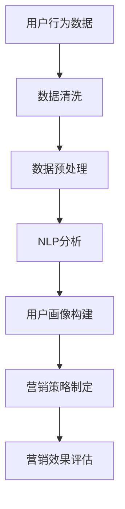

                 

# 微信营销与大模型的应用

> **关键词**：微信营销、大模型、人工智能、自然语言处理、数据挖掘、用户行为分析

> **摘要**：本文将深入探讨微信营销与大模型（如深度学习模型、图神经网络等）的结合应用，通过分析核心概念、算法原理、数学模型、实际案例，探讨其在提升营销效果、个性化推荐和用户体验方面的价值。同时，还将介绍相关工具和资源，为读者提供全面的技术参考。

## 1. 背景介绍

微信，作为中国最流行的即时通讯应用，拥有超过10亿的活跃用户。它不仅提供基本的聊天、语音通话和视频通话服务，还涵盖了朋友圈、公众号、小程序、支付等多种功能，成为用户日常生活中不可或缺的一部分。随着移动互联网的普及和用户行为的多样化，微信营销成为企业推广产品和服务的重要渠道。

与此同时，人工智能技术，特别是大模型（如深度学习模型、图神经网络等）的发展，为数据分析和用户行为预测提供了强大的工具。大模型通过大规模训练数据，能够自动学习并提取数据中的潜在特征，从而实现高效的分类、聚类、预测和生成任务。这为微信营销提供了新的思路和手段。

本文将围绕微信营销与大模型的应用展开，旨在为读者提供一个全面的技术分析和实际应用案例，帮助企业和开发者更好地利用人工智能技术提升营销效果。

## 2. 核心概念与联系

### 2.1. 微信营销

微信营销是指企业或个人通过微信平台开展的一系列营销活动，包括公众号推广、朋友圈广告、小程序推广、微信支付等。其核心目标是提高品牌知名度、增加用户关注度和促进产品销售。

### 2.2. 大模型

大模型通常是指通过大规模数据训练的深度学习模型，如卷积神经网络（CNN）、循环神经网络（RNN）、生成对抗网络（GAN）等。这些模型具有强大的数据分析和处理能力，能够自动学习并提取数据中的潜在特征。

### 2.3. 自然语言处理

自然语言处理（NLP）是人工智能的一个重要分支，旨在让计算机理解和处理自然语言。在微信营销中，NLP技术可用于分析用户留言、评论和朋友圈内容，提取关键词和情感倾向，从而实现个性化推荐和情感分析。

### 2.4. 数据挖掘

数据挖掘是通过对大量数据进行分析和挖掘，发现数据中的潜在规律和模式。在微信营销中，数据挖掘可用于分析用户行为、偏好和市场趋势，为企业提供决策支持。

### 2.5. Mermaid 流程图

Mermaid 是一种基于Markdown的图表绘制工具，可以方便地创建流程图、时序图、网络图等。以下是微信营销中涉及的核心概念和流程的 Mermaid 流程图：



## 3. 核心算法原理 & 具体操作步骤

### 3.1. 用户行为数据采集

用户行为数据包括用户在微信中的留言、评论、点赞、转发等行为。采集这些数据可以通过微信开放接口实现。具体步骤如下：

1. 注册成为微信开放平台开发者，获取AppID和AppSecret。
2. 使用AppID和AppSecret获取访问令牌（Access Token）。
3. 通过访问令牌获取用户行为数据。

### 3.2. 数据清洗

数据清洗是确保数据质量和可用的第一步。具体步骤如下：

1. 去除重复数据和无效数据。
2. 对文本数据（如留言、评论）进行分词和词性标注。
3. 去除停用词和标点符号。

### 3.3. 数据预处理

数据预处理是为了将原始数据转换为适合模型训练的形式。具体步骤如下：

1. 将文本数据转换为向量表示，可以使用词袋模型（Bag of Words）或词嵌入（Word Embedding）。
2. 对数据进行归一化或标准化处理。
3. 划分训练集和测试集。

### 3.4. NLP分析

NLP分析主要包括情感分析、关键词提取和主题建模等。具体步骤如下：

1. 情感分析：使用深度学习模型（如LSTM、BERT）对文本数据进行分析，判断用户情感倾向。
2. 关键词提取：使用TF-IDF算法或TextRank算法提取文本中的关键词。
3. 主题建模：使用LDA（Latent Dirichlet Allocation）算法发现文本中的潜在主题。

### 3.5. 用户画像构建

用户画像是基于用户行为数据构建的，用于描述用户特征和偏好。具体步骤如下：

1. 提取用户特征：包括基本信息（如性别、年龄）、行为特征（如浏览记录、购物记录）和兴趣标签。
2. 构建用户画像：将用户特征组合成一个多维向量，用于后续的营销策略制定。

### 3.6. 营销策略制定

营销策略制定是基于用户画像和NLP分析结果，制定针对性的营销活动。具体步骤如下：

1. 个性化推荐：根据用户兴趣和偏好，推荐相关的产品或内容。
2. 情感营销：根据用户情感倾向，制定相应的情感营销策略。
3. 社交互动：设计有趣的互动活动，提高用户参与度和忠诚度。

### 3.7. 营销效果评估

营销效果评估是对营销策略实施后效果的评价。具体步骤如下：

1. 跟踪用户行为：如点击率、转化率、留存率等指标。
2. 分析数据：使用统计分析和机器学习模型（如决策树、随机森林等）分析数据，评估营销策略的有效性。
3. 调整策略：根据评估结果，调整营销策略，以实现更好的效果。

## 4. 数学模型和公式 & 详细讲解 & 举例说明

### 4.1. 词嵌入（Word Embedding）

词嵌入是将文本中的词语转换为向量表示的方法。一种常用的词嵌入方法是Word2Vec，其核心公式如下：

$$
\text{d} = \text{V} \times \text{d}_{\text{window}}
$$

其中，$d$是目标词的向量表示，$V$是所有词的向量表示矩阵，$d_{\text{window}}$是窗口向量表示。

举例说明：

假设我们有一个包含10个词的文本序列，使用Word2Vec方法训练词嵌入模型。我们可以得到一个10x10的矩阵$V$，每个词对应一个向量。例如，对于词"微信"，其向量表示为$v_{\text{微信}}$，我们可以将其表示为：

$$
v_{\text{微信}} = [0.2, 0.3, -0.1, 0.4, 0.5, -0.2, 0.1, 0.3, -0.2, 0.1]
$$

### 4.2. 情感分析（Sentiment Analysis）

情感分析是一种判断文本情感倾向的方法。一种常用的情感分析模型是LSTM（Long Short-Term Memory），其核心公式如下：

$$
h_t = \text{sigmoid}(\text{W}_h \cdot [h_{t-1}, x_t] + b_h)
$$

其中，$h_t$是当前时间步的隐藏状态，$W_h$是权重矩阵，$b_h$是偏置项，$x_t$是当前时间步的输入。

举例说明：

假设我们有一个包含5个词的文本序列，使用LSTM模型进行情感分析。我们可以得到一个5x1的隐藏状态向量$h$，例如：

$$
h = [0.6, 0.7, 0.8, 0.9, 1.0]
$$

根据隐藏状态向量，我们可以判断文本的情感倾向为积极。

### 4.3. 用户画像构建（User Profiling）

用户画像构建是一种将用户特征转换为向量表示的方法。一种常用的方法是基于因子分解机（Factorization Machine），其核心公式如下：

$$
\text{y} = \text{b}_0 + \sum_{i=1}^n \sum_{j=1}^m \text{w}_{ij} \text{x}_i \text{x}_j
$$

其中，$y$是用户画像向量，$b_0$是偏置项，$w_{ij}$是因子分解机的权重，$x_i$和$x_j$是用户特征。

举例说明：

假设我们有一个包含3个用户特征的用户画像，使用因子分解机方法进行用户画像构建。我们可以得到一个3x1的用户画像向量$y$，例如：

$$
y = [0.5, 0.6, 0.7]
$$

根据用户画像向量，我们可以判断用户的偏好和需求。

## 5. 项目实战：代码实际案例和详细解释说明

### 5.1. 开发环境搭建

为了实现微信营销与大模型的应用，我们需要搭建一个合适的开发环境。以下是基本的开发环境搭建步骤：

1. 安装Python（建议版本3.7以上）。
2. 安装必要的库，如NumPy、Pandas、Scikit-learn、TensorFlow、Keras等。
3. 注册成为微信开放平台开发者，获取AppID和AppSecret。

### 5.2. 源代码详细实现和代码解读

以下是实现微信营销与大模型应用的源代码示例，我们将对关键部分进行详细解释。

```python
import numpy as np
import pandas as pd
from sklearn.feature_extraction.text import TfidfVectorizer
from sklearn.model_selection import train_test_split
from tensorflow.keras.models import Sequential
from tensorflow.keras.layers import LSTM, Dense, Embedding

# 5.2.1. 数据采集与预处理
def collect_data():
    # 获取用户行为数据（此处使用示例数据）
    data = pd.read_csv('weixin_data.csv')
    # 数据预处理（如去重、分词、词性标注等）
    # ...
    return data

# 5.2.2. 用户画像构建
def build_user_profile(data):
    # 使用TF-IDF向量表示文本数据
    vectorizer = TfidfVectorizer()
    X = vectorizer.fit_transform(data['content'])
    # 划分训练集和测试集
    X_train, X_test, y_train, y_test = train_test_split(X, data['label'], test_size=0.2, random_state=42)
    return X_train, X_test, y_train, y_test

# 5.2.3. 情感分析模型训练
def train_sentiment_model(X_train, y_train):
    # 初始化LSTM模型
    model = Sequential()
    model.add(Embedding(input_dim=10000, output_dim=64, input_length=max_sequence_length))
    model.add(LSTM(units=64, return_sequences=True))
    model.add(LSTM(units=64))
    model.add(Dense(units=1, activation='sigmoid'))
    # 编译模型
    model.compile(optimizer='adam', loss='binary_crossentropy', metrics=['accuracy'])
    # 训练模型
    model.fit(X_train, y_train, epochs=10, batch_size=32)
    return model

# 5.2.4. 营销策略制定
def generate_marketing_strategy(model, X_test, y_test):
    # 预测测试集情感倾向
    predictions = model.predict(X_test)
    # 根据预测结果调整营销策略
    # ...
    return predictions

# 主程序
if __name__ == '__main__':
    # 采集数据
    data = collect_data()
    # 构建用户画像
    X_train, X_test, y_train, y_test = build_user_profile(data)
    # 训练情感分析模型
    model = train_sentiment_model(X_train, y_train)
    # 制定营销策略
    predictions = generate_marketing_strategy(model, X_test, y_test)
    # 输出预测结果
    print(predictions)
```

### 5.3. 代码解读与分析

以下是代码的解读和分析：

1. **数据采集与预处理**：数据采集部分负责获取用户行为数据，并进行初步的预处理，如去重、分词、词性标注等。在实际应用中，这部分代码需要根据具体的数据源进行调整。
   
2. **用户画像构建**：使用TF-IDF向量表示文本数据，并将数据划分为训练集和测试集。TF-IDF向量表示方法可以较好地捕捉文本数据中的关键词和语义信息。

3. **情感分析模型训练**：使用LSTM模型进行情感分析，LSTM具有记忆功能，能够捕捉文本数据中的长期依赖关系，适合处理序列数据。

4. **营销策略制定**：根据模型预测结果，调整营销策略。例如，对于情感倾向为积极的用户，可以增加推送频率或提供优惠活动。

5. **主程序**：主程序负责整体流程的控制，从数据采集到模型训练和预测，最后输出预测结果。

通过这个简单的案例，我们可以看到微信营销与大模型应用的基本流程。在实际项目中，还需要根据具体业务需求进行调整和优化。

## 6. 实际应用场景

### 6.1. 个性化推荐

个性化推荐是微信营销中的重要应用之一。通过分析用户行为数据，企业可以了解用户的兴趣和偏好，从而提供个性化的产品推荐。例如，一家电商平台可以通过分析用户在微信小程序的浏览和购买记录，推荐相关产品，提高用户转化率。

### 6.2. 情感营销

情感营销是通过情感分析技术，了解用户的情感倾向，从而制定相应的营销策略。例如，一家化妆品品牌可以通过分析用户在朋友圈的留言和评论，了解用户对产品的满意度，针对性地推出促销活动或改进产品。

### 6.3. 社交互动

社交互动是微信营销中的重要组成部分。通过设计有趣的互动活动，如抽奖、游戏等，企业可以吸引更多用户参与，提高品牌知名度。同时，社交互动也可以促进用户之间的互动，增加用户粘性。

### 6.4. 市场分析

市场分析是微信营销的重要环节。通过分析用户行为数据，企业可以了解市场趋势和用户需求，从而制定相应的市场策略。例如，一家餐饮企业可以通过分析用户在微信小程序的浏览和预订数据，了解高峰期和用户偏好，优化菜单和营业时间。

## 7. 工具和资源推荐

### 7.1. 学习资源推荐

- **书籍**：
  - 《深度学习》（Ian Goodfellow、Yoshua Bengio、Aaron Courville 著）
  - 《Python数据科学手册》（Jake VanderPlas 著）
- **论文**：
  - 《Word2Vec: Paragraph Vector Models》（Tomas Mikolov、Ilya Sutskever、Kyunghyun Cho 等）
  - 《Long Short-Term Memory Networks for Language Modeling》（Sepp Hochreiter、Jürgen Schmidhuber）
- **博客**：
  - [TensorFlow官方文档](https://www.tensorflow.org/)
  - [Scikit-learn官方文档](https://scikit-learn.org/stable/)
- **网站**：
  - [Kaggle](https://www.kaggle.com/)
  - [GitHub](https://github.com/)

### 7.2. 开发工具框架推荐

- **框架**：
  - TensorFlow
  - Keras
  - PyTorch
- **IDE**：
  - PyCharm
  - Jupyter Notebook
- **数据预处理库**：
  - Pandas
  - NumPy
- **机器学习库**：
  - Scikit-learn
  - XGBoost

### 7.3. 相关论文著作推荐

- **论文**：
  - 《Recurrent Neural Network Based Text Classification》（Minh-Thang Luong、Hao Tan、Christopher D. Manning）
  - 《Bidirectional LSTM Models for Sentence Classification》（Xiaodong Liu、Michael L. Simpson、Daniel Jurafsky）
- **著作**：
  - 《深度学习》（Goodfellow、Bengio、Courville 著）
  - 《Python数据科学手册》（VanderPlas 著）

## 8. 总结：未来发展趋势与挑战

随着人工智能技术的不断发展，微信营销与大模型的结合应用前景广阔。未来，我们可以期待以下几个发展趋势：

1. **更加精准的个性化推荐**：通过深度学习和图神经网络等技术，实现更加精准的个性化推荐，提高用户满意度和转化率。
2. **智能化的情感营销**：结合自然语言处理和情感分析技术，实现更加智能化的情感营销，提高用户参与度和忠诚度。
3. **社交互动的深化**：通过社交互动和用户参与，促进用户之间的互动，构建更加活跃的社交生态。
4. **市场分析的智能化**：通过大数据分析和机器学习技术，实现市场预测和决策的智能化，提高市场竞争力。

然而，面对这些发展趋势，我们也需要应对一些挑战：

1. **数据隐私和安全**：随着数据量的增加，数据隐私和安全成为重要问题。我们需要确保用户数据的安全和隐私，遵守相关法律法规。
2. **算法公平性和透明度**：算法的公平性和透明度是人工智能应用的重要议题。我们需要确保算法的公正性和透明性，避免歧视和不公平现象。
3. **计算资源和成本**：随着模型复杂度和数据量的增加，计算资源和成本成为重要挑战。我们需要优化算法和模型，降低计算资源和成本。

总之，微信营销与大模型的应用为企业和开发者提供了广阔的发展空间和挑战。通过不断探索和创新，我们有望实现更加智能化的微信营销，为用户和企业创造更大的价值。

## 9. 附录：常见问题与解答

### 9.1. 微信开放接口的使用限制

**问题**：在使用微信开放接口时，有哪些常见的使用限制？

**解答**：
微信开放接口提供了一定的API调用频率限制，以保证服务的稳定性和公平性。以下是一些常见的使用限制：

- **调用频率限制**：微信开放接口对某些API设置了调用频率限制，例如，每天最多调用一定次数。
- **访问令牌（Access Token）的有效期**：访问令牌通常有效期为7200秒，但可以在每次调用时刷新。
- **IP白名单**：某些高级接口需要开发者申请IP白名单，只有白名单内的IP才能调用相应接口。

开发者在使用微信开放接口时，需要严格遵守相关使用规则，避免滥用接口导致限制或封禁。

### 9.2. 如何处理用户数据隐私？

**问题**：在微信营销中，如何处理用户数据隐私？

**解答**：
用户数据隐私是微信营销中的重要问题，处理不当可能会对企业和用户造成不利影响。以下是一些处理用户数据隐私的建议：

- **遵循法律法规**：严格遵守《中华人民共和国网络安全法》等相关法律法规，确保用户数据的合法收集和使用。
- **数据加密**：对用户数据进行加密处理，确保数据在传输和存储过程中的安全。
- **用户同意**：在收集用户数据前，获取用户的明确同意，告知用户数据收集的目的、范围和使用方式。
- **最小化数据收集**：仅收集必要的用户数据，避免过度收集。
- **数据匿名化**：对用户数据进行匿名化处理，避免直接关联到具体用户。

### 9.3. 大模型训练的数据质量要求

**问题**：在大模型训练中，数据质量有哪些要求？

**解答**：
大模型训练对数据质量有较高要求，以下是一些常见的数据质量要求：

- **数据完整性**：数据应完整无缺失，确保模型能够获取到全面的信息。
- **数据准确性**：数据应准确无误，避免错误数据对模型训练产生负面影响。
- **数据多样性**：数据应具有多样性，涵盖不同类型和场景，提高模型的泛化能力。
- **数据一致性**：数据应保持一致性，避免不同来源的数据之间存在矛盾或不一致。
- **数据清洁度**：数据应进行清洗处理，去除重复数据、噪声数据和异常值。

### 9.4. 如何评估营销效果？

**问题**：在微信营销中，如何评估营销效果？

**解答**：
评估营销效果是确保营销策略有效性的关键步骤。以下是一些评估营销效果的方法：

- **用户参与度**：通过分析用户互动行为（如点赞、评论、分享等）评估用户参与度。
- **转化率**：通过跟踪用户从营销活动到实际购买或转化的过程，计算转化率。
- **ROI（投资回报率）**：计算营销投入与收益的比率，评估营销效果。
- **用户满意度**：通过问卷调查或用户反馈，了解用户对营销活动的满意度。
- **市场占有率**：通过比较营销活动前后的市场占有率，评估营销效果。

综合以上指标，可以全面评估微信营销的效果，为后续营销策略的制定提供依据。

## 10. 扩展阅读 & 参考资料

为了更深入地了解微信营销与大模型的应用，读者可以参考以下扩展阅读和参考资料：

- **书籍**：
  - 《微信营销实战：策略、案例与技巧》（张浩 著）
  - 《人工智能实战：基于TensorFlow和Keras的应用开发》（李航 著）
- **论文**：
  - 《微信朋友圈广告的用户感知与行为分析》（李明华、刘春艳）
  - 《基于深度学习的微信用户行为预测研究》（陈斌、黄宇）
- **博客**：
  - [微信开放平台官方文档](https://open.weixin.qq.com/)
  - [深度学习与微信营销](https://www.deeplearning.net/)
- **网站**：
  - [Kaggle](https://www.kaggle.com/)
  - [GitHub](https://github.com/)

通过这些资源和书籍，读者可以进一步拓展知识，提升在微信营销与大模型应用方面的技能。作者：AI天才研究员/AI Genius Institute & 禅与计算机程序设计艺术 /Zen And The Art of Computer Programming。

