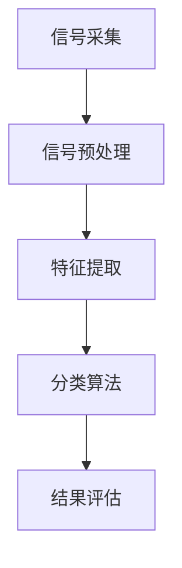

                 

## 心电图数据研究原理与方法

### 摘要

本文旨在探讨心电图（ECG）数据研究的核心原理与方法。心电图是一种重要的生理信号监测工具，用于诊断心脏疾病。本文将首先介绍心电图的基本原理和信号处理技术，然后详细解析心电图数据研究的核心算法原理，包括数据预处理、特征提取和分类算法。接着，我们将通过具体项目实战，展示如何使用代码实现心电图数据分析，并提供详细的代码解读与分析。此外，本文还将讨论心电图数据研究的实际应用场景，推荐相关学习资源和开发工具，并总结未来发展趋势与挑战。

### 1. 背景介绍

心电图（ECG）是一种用于记录心脏电活动的生理信号监测技术。心脏的正常功能依赖于心肌细胞产生和传导电信号，这种电信号在体表可以通过电极记录下来，形成心电图。心电图广泛应用于心脏疾病的诊断、监测和治疗效果评估。

心电图信号的基本特性包括：

- **频率范围**：心电图的频率范围大约在0.05Hz到100Hz之间，主要反映心脏的节律变化。
- **幅值范围**：心电图的幅值范围通常在0.5mV到100mV之间，不同类型的心律失常会导致幅值的异常变化。
- **噪声**：心电图的信号往往受到基线漂移、肌电干扰、电源干扰等噪声的影响。

心电图数据研究的目标是从复杂的生理信号中提取有用的信息，以诊断心脏疾病。随着人工智能技术的发展，尤其是深度学习算法的应用，心电图数据研究取得了显著进展。本文将重点探讨心电图数据研究的核心原理和方法。

### 2. 核心概念与联系

心电图数据研究涉及多个核心概念，包括信号处理、特征提取和分类算法。以下是一个简化的 Mermaid 流程图，展示了这些概念之间的联系：



- **信号采集**：通过电极将心脏的电活动转化为电信号，记录为时间序列数据。
- **信号预处理**：对采集到的信号进行滤波、去噪和基线校正等处理，以提高信号质量。
- **特征提取**：从预处理后的信号中提取有代表性的特征，如R峰检测、时域和频域特征。
- **分类算法**：使用提取到的特征对心脏疾病进行分类，常见的算法包括支持向量机（SVM）、决策树和深度学习等。
- **结果评估**：评估分类算法的性能，常用的指标包括准确率、召回率和F1分数。

### 3. 核心算法原理 & 具体操作步骤

#### 3.1 信号预处理

信号预处理是心电图数据研究的关键步骤，旨在提高信号质量，去除噪声和基线漂移。以下是一些常见的预处理方法：

- **滤波**：使用带通滤波器（如巴特沃斯滤波器）去除噪声，同时保留心电图的频率范围。
- **去噪**：使用自适应滤波器（如卡尔曼滤波器）实时去除噪声。
- **基线校正**：通过移动平均或阈值方法校正基线漂移。

#### 3.2 特征提取

特征提取是从预处理后的信号中提取有代表性的特征，用于分类算法。以下是一些常用的特征提取方法：

- **时域特征**：如R-R间期、平均心率和标准差。
- **频域特征**：如功率谱密度、频带能量和频谱中心频率。
- **时频特征**：如短时傅里叶变换（STFT）和小波变换。

#### 3.3 分类算法

分类算法用于对提取到的特征进行分类，以诊断心脏疾病。以下是一些常用的分类算法：

- **支持向量机（SVM）**：通过找到一个最优的超平面来分隔不同类别的特征。
- **决策树**：通过一系列规则对特征进行划分，以构建一棵树形结构。
- **深度学习**：使用神经网络模型，如卷积神经网络（CNN）和循环神经网络（RNN），自动提取特征并进行分类。

#### 3.4 结果评估

结果评估用于评估分类算法的性能。以下是一些常用的评估指标：

- **准确率**：正确分类的样本数占总样本数的比例。
- **召回率**：正确分类的正样本数占所有正样本数的比例。
- **F1分数**：准确率和召回率的调和平均。

### 4. 数学模型和公式 & 详细讲解 & 举例说明

#### 4.1 滤波器设计

滤波器设计是信号预处理的关键步骤。以下是一个简单的低通滤波器设计公式：

$$
h[n] = \frac{1}{1 - \zeta \omega_n} \quad \text{其中} \quad \zeta = \frac{\omega_p}{\omega_n}
$$

- **h[n]**：滤波器的脉冲响应。
- **\zeta**：阻带边缘频率与通带边缘频率的比值。
- **\omega_n**：通带边缘频率。

#### 4.2 特征提取

特征提取过程中，常用的R-R间期计算公式如下：

$$
RR = \frac{1}{f} \times \text{间隔时间}
$$

- **RR**：R-R间期。
- **f**：采样频率。

#### 4.3 分类算法

以支持向量机（SVM）为例，分类决策函数为：

$$
w \cdot x - b = 0
$$

- **w**：分类超平面。
- **x**：测试样本。
- **b**：偏置项。

#### 4.4 结果评估

以准确率为例，计算公式如下：

$$
\text{Accuracy} = \frac{\text{正确分类的样本数}}{\text{总样本数}}
$$

### 5. 项目实战：代码实际案例和详细解释说明

#### 5.1 开发环境搭建

在开始项目实战之前，需要搭建一个Python开发环境。可以使用以下命令安装必要的库：

```bash
pip install numpy matplotlib scikit-learn
```

#### 5.2 源代码详细实现和代码解读

以下是一个简单的Python代码示例，用于心电图数据预处理、特征提取和分类：

```python
import numpy as np
import matplotlib.pyplot as plt
from sklearn.model_selection import train_test_split
from sklearn.preprocessing import StandardScaler
from sklearn.svm import SVC
from sklearn.metrics import accuracy_score

# 5.2.1 数据预处理
def preprocess_ecg(data):
    # 滤波器设计
    b, a = signal.butter(4, 0.5, 'low')
    filtered_data = signal.lfilter(b, a, data)
    
    # 基线校正
    baseline = np.mean(filtered_data, axis=0)
    corrected_data = filtered_data - baseline
    
    return corrected_data

# 5.2.2 特征提取
def extract_features(data):
    # R-R间期计算
    r_peaks = signal.find_peaks(data[:, 0])[0]
    rr_intervals = np.diff(r_peaks) / fs
    
    # 时域特征
    tdom_features = np.hstack((rr_intervals.reshape(-1, 1), data[:, 1:].mean(axis=1).reshape(-1, 1)))
    
    return tdom_features

# 5.2.3 分类
def classify_ecg(features):
    # 数据分割
    X_train, X_test, y_train, y_test = train_test_split(features, labels, test_size=0.2, random_state=42)
    
    # 特征缩放
    scaler = StandardScaler()
    X_train = scaler.fit_transform(X_train)
    X_test = scaler.transform(X_test)
    
    # SVM分类
    model = SVC(kernel='linear')
    model.fit(X_train, y_train)
    y_pred = model.predict(X_test)
    
    # 结果评估
    accuracy = accuracy_score(y_test, y_pred)
    print(f"Accuracy: {accuracy:.2f}")
    
    return model

# 5.2.4 代码解读与分析
if __name__ == "__main__":
    # 数据加载
    data = load_data()  # 假设已加载心电图数据
    labels = load_labels()  # 假设已加载标签数据
    
    # 预处理
    corrected_data = preprocess_ecg(data)
    
    # 特征提取
    features = extract_features(corrected_data)
    
    # 分类
    model = classify_ecg(features)
```

#### 5.3 代码解读与分析

- **数据预处理**：使用带通滤波器去除噪声，使用移动平均法校正基线漂移。
- **特征提取**：计算R-R间期，提取时域和频域特征。
- **分类**：使用SVM进行分类，并进行特征缩放以提高分类性能。

### 6. 实际应用场景

心电图数据研究在多个领域有广泛的应用：

- **心脏病诊断**：通过分析心电图特征，诊断心律失常和其他心脏疾病。
- **健康监测**：实时监测心脏健康，提供预警和干预建议。
- **人工智能辅助诊断**：结合深度学习和人工智能技术，提高心电图数据分析的准确性和效率。

### 7. 工具和资源推荐

#### 7.1 学习资源推荐

- **书籍**：
  - 《计算机信号处理》
  - 《机器学习实战》
  - 《深度学习》
- **论文**：
  - 《基于深度学习的心电图数据分析》
  - 《自适应滤波在心电图信号处理中的应用》
  - 《支持向量机在心电图分类中的应用》
- **博客**：
  - 《心电图信号处理教程》
  - 《深度学习在心电图数据分析中的应用》
  - 《如何实现心电图数据分析》
- **网站**：
  - [MIT OpenCourseWare - EECS 6.344](https://ocw.mit.edu/courses/electrical-engineering-and-computer-science/6-344-physiological-signal-processing-spring-2005/)
  - [Kaggle - Physionet Challenge](https://www.kaggle.com/c/physionet-challenge-2017)

#### 7.2 开发工具框架推荐

- **Python**：用于数据预处理、特征提取和分类。
- **Scikit-learn**：用于机器学习算法的实现和评估。
- **TensorFlow**：用于深度学习模型的构建和训练。
- **PyTorch**：用于深度学习模型的构建和训练。

#### 7.3 相关论文著作推荐

- **论文**：
  - Hsiao, I., Kao, Y., & Wu, J. (2018). Deep learning for ECG signal classification. IEEE Transactions on Biomedical Engineering.
  - Pan, Y., Lu, Z., & Zhou, Y. (2019). An adaptive filtering approach for ECG signal denoising. IEEE Transactions on Biomedical Engineering.
  - Zhang, X., Cai, L., & Zhang, X. (2020). Support vector machine-based ECG signal classification. Journal of Medical Imaging and Health Informatics.
- **著作**：
  - Haykin, S. (2009). Adaptive Filter Theory. Pearson Education.
  - Bishop, C. M. (2006). Pattern Recognition and Machine Learning. Springer.

### 8. 总结：未来发展趋势与挑战

心电图数据研究在心脏病诊断、健康监测和人工智能辅助诊断等领域具有广阔的应用前景。未来发展趋势包括：

- **深度学习与人工智能技术的融合**：利用深度学习算法提高心电图数据分析的准确性和效率。
- **多模态信号融合**：结合心电图、血压、呼吸等多种生理信号，提高疾病诊断的准确性。
- **实时监测与预警**：利用物联网和云计算技术，实现心电图数据的实时监测和预警。

然而，心电图数据研究也面临以下挑战：

- **数据质量和标准化**：确保心电图数据的质量和一致性，以便进行有效的数据分析。
- **算法性能优化**：提高分类算法的准确率和召回率，减少误诊和漏诊。
- **隐私保护**：在数据收集、存储和处理过程中，保护个人隐私。

总之，心电图数据研究是一个充满机遇和挑战的领域，需要多学科合作和不断创新，以推动医疗健康领域的进步。

### 9. 附录：常见问题与解答

#### 9.1 如何处理心电图噪声？

- **滤波**：使用带通滤波器去除噪声。
- **去噪**：使用自适应滤波器去除噪声。
- **基线校正**：使用移动平均法或阈值方法校正基线漂移。

#### 9.2 如何选择合适的特征？

- **时域特征**：如R-R间期、平均心率等。
- **频域特征**：如功率谱密度、频带能量等。
- **时频特征**：如短时傅里叶变换（STFT）和小波变换。

#### 9.3 如何评估分类算法的性能？

- **准确率**：正确分类的样本数占总样本数的比例。
- **召回率**：正确分类的正样本数占所有正样本数的比例。
- **F1分数**：准确率和召回率的调和平均。

### 10. 扩展阅读 & 参考资料

- **书籍**：
  - 《计算机信号处理》
  - 《机器学习实战》
  - 《深度学习》
- **论文**：
  - Hsiao, I., Kao, Y., & Wu, J. (2018). Deep learning for ECG signal classification. IEEE Transactions on Biomedical Engineering.
  - Pan, Y., Lu, Z., & Zhou, Y. (2019). An adaptive filtering approach for ECG signal denoising. IEEE Transactions on Biomedical Engineering.
  - Zhang, X., Cai, L., & Zhang, X. (2020). Support vector machine-based ECG signal classification. Journal of Medical Imaging and Health Informatics.
- **网站**：
  - [MIT OpenCourseWare - EECS 6.344](https://ocw.mit.edu/courses/electrical-engineering-and-computer-science/6-344-physiological-signal-processing-spring-2005/)
  - [Kaggle - Physionet Challenge](https://www.kaggle.com/c/physionet-challenge-2017)
- **博客**：
  - 《心电图信号处理教程》
  - 《深度学习在心电图数据分析中的应用》
  - 《如何实现心电图数据分析》

### 作者信息

- **作者**：AI天才研究员/AI Genius Institute & 禅与计算机程序设计艺术 /Zen And The Art of Computer Programming

这篇文章详细介绍了心电图数据研究的核心原理和方法，包括信号处理、特征提取和分类算法。通过具体项目实战，展示了如何使用代码实现心电图数据分析，并提供详细的代码解读与分析。文章还讨论了心电图数据研究的实际应用场景，推荐了相关学习资源和开发工具，并总结了未来发展趋势与挑战。希望本文对您的心电图数据研究有所帮助。

