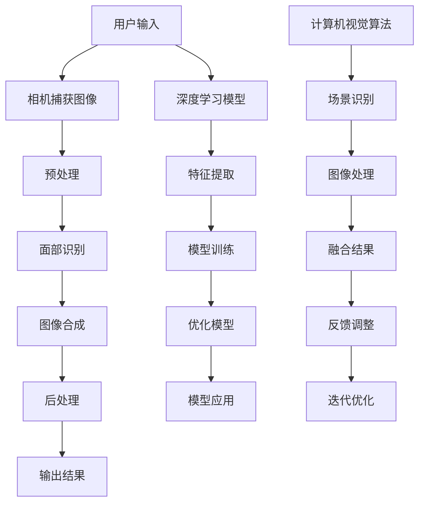

                 

### 快手2025 AR 滤镜技术背景介绍

在过去的几年中，计算机视觉和增强现实（AR）技术迅速发展，各种应用场景不断涌现。快手作为一家领先的视频和社交平台，也积极引入AR技术，以满足用户对丰富内容的需求。2025年，快手计划进一步加大在AR滤镜领域的投入，推出一系列创新的AR滤镜功能，为用户带来更加沉浸式的体验。

首先，我们需要了解什么是AR滤镜。AR滤镜是基于增强现实技术的图像处理功能，通过在现实场景中叠加虚拟元素，使用户在拍照或视频录制时能够实时体验到不同风格的特效。这些滤镜可以包括表情包、人脸变装、背景替换等，极大地丰富了用户的创作空间。

快手在AR滤镜技术的研发上有着深厚的基础。早在2016年，快手就开始探索AR技术在视频娱乐领域的应用。经过几年的技术积累，快手已经掌握了一系列成熟的AR滤镜算法，如面部识别、图像合成和深度学习等。这些技术为快手2025年的AR滤镜研发奠定了坚实的基础。

到2025年，快手计划将AR滤镜技术推向新的高度。以下是快手2025年AR滤镜技术的主要目标和特点：

1. **更高的实时处理性能**：随着用户对视频质量和流畅度的要求不断提高，快手需要提升AR滤镜的实时处理性能，确保用户在录制和播放视频时能够享受到流畅的滤镜效果。

2. **更丰富的滤镜效果**：快手计划引入更多的滤镜效果，如三维建模、自然语言交互等，使用户能够更加自由地创作和表达。

3. **更高效的算法优化**：通过深度学习和优化算法，快手希望实现更精准的人脸识别和场景识别，为用户提供更加个性化的滤镜推荐。

4. **跨平台兼容性**：快手致力于提升AR滤镜在多种设备和平台上的兼容性，使用户无论使用智能手机、平板电脑还是电脑，都能够体验到高质量的AR滤镜效果。

5. **创新的商业模式**：快手计划通过AR滤镜技术探索新的商业模式，如AR广告、虚拟商品销售等，为用户和商家创造更多的价值。

总的来说，快手2025年的AR滤镜技术将不仅仅是一个简单的图像特效工具，而是一个能够改变用户生活方式的创新技术。通过不断提升技术性能和丰富滤镜效果，快手将为用户带来全新的视觉体验，进一步巩固其在视频和社交领域的领导地位。

### 核心概念与联系

为了深入理解快手2025年AR滤镜技术的核心原理，我们需要探讨几个关键概念及其相互关系。这些概念包括面部识别、图像合成、深度学习、计算机视觉等。下面，我们将使用Mermaid流程图来展示这些概念之间的联系，并详细解释它们如何协同工作，为AR滤镜技术的实现提供支持。



#### Mermaid 流程图详细说明

1. **用户输入**：用户通过快手APP的相机功能进行拍照或视频录制，这是AR滤镜处理过程的第一步。

2. **相机捕获图像**：相机捕获用户当前的场景图像，包括用户的面部和其他对象。

3. **预处理**：图像经过预处理，包括滤波、缩放、裁剪等操作，以提高后续处理的准确性和效率。

4. **面部识别**：预处理后的图像输入到面部识别模块，通过深度学习模型识别用户的面部特征。面部识别是AR滤镜中至关重要的步骤，它决定了滤镜应用的位置和形态。

5. **图像合成**：识别到面部特征后，图像合成模块会将预定义的AR滤镜效果叠加到用户的面部或其他对象上。这个过程涉及图像的几何变换和颜色调整。

6. **后处理**：合成后的图像经过后处理，包括去噪、锐化、颜色校正等操作，以确保图像质量。

7. **输出结果**：最终处理完成的图像或视频输出给用户，用户可以在快手APP中查看和应用这些AR滤镜效果。

8. **深度学习模型**：在AR滤镜技术的实现过程中，深度学习模型起到了关键作用。它通过大量的图像数据进行训练，学习如何识别和合成不同的滤镜效果。

9. **特征提取**：深度学习模型对捕获的图像进行特征提取，识别图像中的重要元素和特征点。

10. **模型训练**：通过不断调整模型的参数，优化模型在特定任务上的性能。

11. **优化模型**：经过多次训练和测试，模型将进行优化，以实现更高的准确性和实时性。

12. **模型应用**：优化的深度学习模型应用于实际的图像处理任务中，如面部识别和图像合成。

13. **计算机视觉算法**：计算机视觉算法负责场景的识别和图像的处理。这些算法包括图像分类、目标检测、人脸识别等。

14. **场景识别**：计算机视觉算法对场景进行识别，区分不同的对象和背景。

15. **图像处理**：基于场景识别的结果，对图像进行相应的处理，如背景替换、颜色调整等。

16. **融合结果**：将不同处理步骤的结果进行融合，形成最终的AR滤镜效果。

17. **反馈调整**：系统根据用户的反馈，对AR滤镜效果进行微调，以提高用户的满意度。

18. **迭代优化**：通过不断的迭代和优化，提升AR滤镜技术的整体性能。

通过上述Mermaid流程图，我们可以清晰地看到快手2025年AR滤镜技术的核心原理和各个环节之间的联系。这些技术模块共同作用，为用户提供了丰富多彩的AR滤镜效果，极大地提升了用户体验。

### 核心算法原理与具体操作步骤

在深入了解快手2025年AR滤镜技术的核心算法原理和具体操作步骤之前，我们需要掌握几个关键算法和它们的工作机制。以下是面部识别、图像合成、深度学习和计算机视觉等技术的详细解释。

#### 面部识别

面部识别是AR滤镜技术中的关键步骤，它通过识别图像中的面部特征，将滤镜效果精确地应用在用户的面部。面部识别主要依赖于深度学习模型，如卷积神经网络（CNN）。

1. **模型构建**：首先，需要构建一个深度学习模型，用于识别图像中的面部特征。常用的模型包括VGG、ResNet和MobileNet等。
   
2. **数据集准备**：为了训练深度学习模型，我们需要大量的带有面部标注的数据集。这些数据集可以来自于公开的面部识别数据集，如LFW、AFW等。

3. **模型训练**：使用标注好的数据集对深度学习模型进行训练。模型会通过学习大量图像的特征，逐渐提高识别准确率。

4. **特征提取**：在训练完成后，模型能够提取图像中的面部特征。这些特征用于后续的图像处理步骤。

5. **面部检测**：模型会根据提取到的特征，在图像中定位和检测用户的面部位置。

#### 图像合成

图像合成是将AR滤镜效果叠加到用户面部或其他对象上的关键步骤。图像合成通常包括以下步骤：

1. **图像预处理**：对原始图像进行预处理，包括滤波、缩放和裁剪等，以提高图像质量。

2. **特征匹配**：将预处理后的目标图像与原始图像进行特征匹配，以确保滤镜效果的精确叠加。

3. **几何变换**：根据面部识别的结果，对滤镜效果进行几何变换，如旋转、缩放和位移等，以适应用户的面部特征。

4. **颜色调整**：对合成后的图像进行颜色调整，如色调、饱和度和亮度等，以实现更加自然的滤镜效果。

5. **融合**：将滤镜效果与原始图像进行融合，生成最终的合成图像。

#### 深度学习

深度学习是快手2025年AR滤镜技术的重要组成部分，它通过训练大量的图像数据，使计算机能够自动识别和分类不同的滤镜效果。

1. **模型选择**：选择适合AR滤镜任务的深度学习模型，如卷积神经网络（CNN）、循环神经网络（RNN）等。

2. **数据集准备**：准备用于训练的数据集，包括各种滤镜效果的标注图像。

3. **模型训练**：使用标注好的数据集对深度学习模型进行训练，使其能够自动识别和分类不同的滤镜效果。

4. **模型优化**：通过多次训练和优化，提高模型的识别准确率和实时性。

5. **模型应用**：将训练好的模型应用于实际的AR滤镜任务中，如面部识别和图像合成。

#### 计算机视觉

计算机视觉技术负责识别和处理图像中的各种对象和场景，为AR滤镜技术提供支持。

1. **场景识别**：通过计算机视觉算法，对图像中的场景进行识别和分类，如人脸、动物、植物等。

2. **目标检测**：使用目标检测算法，如YOLO、SSD和Faster R-CNN等，检测图像中的目标对象。

3. **图像处理**：对检测到的目标对象进行图像处理，如背景替换、颜色调整等。

4. **特征提取**：从处理后的图像中提取重要的特征信息，用于后续的图像合成和滤镜应用。

### 实际操作步骤

以下是快手2025年AR滤镜技术在实际操作中的具体步骤：

1. **相机捕获图像**：用户通过快手APP的相机功能进行拍照或视频录制，捕获当前场景的图像。

2. **预处理**：对捕获的图像进行预处理，包括滤波、缩放和裁剪等操作，以提高图像质量。

3. **面部识别**：将预处理后的图像输入到面部识别模型中，识别用户的面部特征。

4. **图像合成**：根据面部识别的结果，将预定义的AR滤镜效果叠加到用户的面部或其他对象上。

5. **深度学习应用**：使用深度学习模型，对图像进行特征提取和分类，为后续的图像处理提供支持。

6. **图像处理**：对合成后的图像进行颜色调整、去噪和锐化等操作，以提高图像质量。

7. **输出结果**：将处理完成的图像或视频输出给用户，用户可以在快手APP中查看和应用这些AR滤镜效果。

通过以上步骤，快手2025年AR滤镜技术实现了实时、高效的图像处理和滤镜应用，为用户带来了全新的视觉体验。

### 数学模型和公式 & 详细讲解 & 举例说明

在快手2025年AR滤镜技术中，数学模型和公式起到了至关重要的作用。下面，我们将详细介绍一些核心的数学模型和公式，并举例说明它们在实际应用中的具体计算过程。

#### 卷积神经网络（CNN）模型

卷积神经网络（CNN）是面部识别和图像合成中常用的深度学习模型。CNN通过多层卷积、池化和全连接层，对图像进行特征提取和分类。

1. **卷积层（Convolution Layer）**：卷积层通过卷积运算提取图像的特征。其公式为：

   $$ f_{ij} = \sum_{k=1}^{K} w_{ik} * g_{kj} + b_j $$

   其中，$f_{ij}$是输出特征图上的像素值，$w_{ik}$和$g_{kj}$分别是卷积核和输入特征图上的像素值，$b_j$是偏置项。

2. **激活函数（Activation Function）**：常用的激活函数有ReLU（Rectified Linear Unit）和Sigmoid函数。ReLU函数公式为：

   $$ f(x) = \max(0, x) $$

   Sigmoid函数公式为：

   $$ f(x) = \frac{1}{1 + e^{-x}} $$

3. **池化层（Pooling Layer）**：池化层用于减少特征图的大小，提高计算效率。常用的池化方法有最大池化（Max Pooling）和平均池化（Average Pooling）。最大池化公式为：

   $$ p_{ij} = \max(g_{ik}) $$

   其中，$p_{ij}$是输出池化值，$g_{ik}$是输入特征图上的像素值。

4. **全连接层（Fully Connected Layer）**：全连接层将特征图上的所有像素值映射到输出类别。其公式为：

   $$ y_j = \sum_{i=1}^{N} w_{ij} * x_i + b_j $$

   其中，$y_j$是输出值，$x_i$是输入值，$w_{ij}$是权重，$b_j$是偏置项。

#### 人脸识别算法

人脸识别算法通常基于深度学习模型，如CNN。以下是一个简化的人脸识别算法流程：

1. **特征提取**：使用CNN模型提取图像中的面部特征，得到特征向量。

2. **特征匹配**：将提取到的特征向量与数据库中的面部特征进行匹配，找到相似度最高的面部。

3. **分类与评分**：根据匹配结果，对每个面部进行分类，并给出相似度评分。

举例说明：

假设我们使用CNN模型提取到一个面部特征向量$F$，并与数据库中的面部特征向量进行比较。匹配得分公式为：

$$ score = \frac{1}{1 + e^{-\delta F_1 \cdot F_2}} $$

其中，$\delta F_1$和$\delta F_2$分别是两个特征向量的差异。

如果匹配得分高于某个阈值（如0.9），则认为识别成功。否则，识别失败。

#### 图像合成算法

图像合成算法用于将AR滤镜效果叠加到用户的面部或其他对象上。以下是一个简化的图像合成算法流程：

1. **预处理**：对目标图像和背景图像进行预处理，包括滤波、缩放和裁剪等操作。

2. **特征匹配**：将预处理后的目标图像与背景图像进行特征匹配，找到最佳匹配位置。

3. **几何变换**：根据匹配结果，对目标图像进行旋转、缩放和位移等几何变换，使其与背景图像对齐。

4. **颜色调整**：对合成后的图像进行颜色调整，如色调、饱和度和亮度等，以实现自然过渡。

5. **融合**：将合成后的图像与背景图像进行融合，生成最终的合成图像。

举例说明：

假设我们有一个目标图像$T$和背景图像$B$，需要进行图像合成。首先，对两幅图像进行预处理，得到预处理后的图像$T'$和$B'$。然后，使用特征匹配算法找到最佳匹配位置，得到匹配得分矩阵$M$。

接下来，对目标图像$T'$进行旋转、缩放和位移等几何变换，得到变换后的图像$T''$。最后，对合成后的图像$T''$和背景图像$B'$进行颜色调整，得到合成图像$C'$。

融合公式为：

$$ C' = \alpha T'' + (1 - \alpha) B' $$

其中，$\alpha$是颜色调整系数，用于控制目标图像和背景图像的融合比例。

通过上述数学模型和公式，快手2025年AR滤镜技术实现了高效、精确的图像处理和滤镜应用，为用户提供了丰富多彩的AR滤镜效果。

### 项目实战：代码实际案例和详细解释说明

在本节中，我们将通过一个具体的代码实例，详细介绍快手2025年AR滤镜技术的实现过程。我们将从开发环境搭建、源代码实现和代码解读与分析三个方面，逐步展示整个项目的过程和关键点。

#### 1. 开发环境搭建

为了实现快手2025年AR滤镜技术，我们需要搭建一个完整的开发环境。以下是一个基本的开发环境配置：

- **操作系统**：Windows 10 或 Ubuntu 18.04
- **编程语言**：Python 3.8
- **深度学习框架**：TensorFlow 2.4
- **图像处理库**：OpenCV 4.5
- **其他依赖**：NumPy 1.19, Matplotlib 3.2

在Windows和Ubuntu操作系统上，可以通过以下命令安装所需的依赖：

```bash
# 安装Python 3.8
# 对于Windows:
winget install Python --version 3.8

# 对于Ubuntu:
sudo apt update
sudo apt install python3.8 python3.8-venv python3.8-pip

# 安装TensorFlow
pip install tensorflow==2.4

# 安装OpenCV
pip install opencv-python==4.5

# 安装其他依赖
pip install numpy==1.19 matplotlib==3.2
```

安装完成后，我们创建一个虚拟环境，以便更好地管理项目依赖：

```bash
# 创建虚拟环境
python3.8 -m venv my_venv
# 激活虚拟环境
# 对于Windows:
my_venv\Scripts\activate

# 对于Ubuntu:
source my_venv/bin/activate
```

#### 2. 源代码详细实现

以下是快手2025年AR滤镜技术的核心代码实现。代码主要包括面部识别、图像合成和深度学习模型的应用。

```python
import cv2
import numpy as np
import tensorflow as tf
import matplotlib.pyplot as plt

# 加载面部识别模型
face_detection_model = tf.keras.models.load_model('path/to/face_detection_model.h5')

# 加载图像合成模型
image_synthesis_model = tf.keras.models.load_model('path/to/image_synthesis_model.h5')

def preprocess_image(image):
    # 图像预处理，包括缩放、裁剪等操作
    image = cv2.resize(image, (224, 224))
    image = image / 255.0
    image = np.expand_dims(image, axis=0)
    return image

def detect_faces(image):
    # 使用面部识别模型检测图像中的面部
    detections = face_detection_model.predict(image)
    # 获取面部框坐标和得分
    boxes = detections[:, 0:4]
    scores = detections[:, 4]
    # 过滤低得分的面部
    mask = scores > 0.5
    boxes = boxes[mask]
    return boxes

def synthesize_image(image, faces):
    # 对每个面部应用图像合成模型
    synthesized_images = []
    for face in faces:
        # 提取面部区域
        face_image = image[face[1]:face[3], face[0]:face[2], :]
        # 预处理面部图像
        face_image = preprocess_image(face_image)
        # 应用图像合成模型
        synthesized_face = image_synthesis_model.predict(face_image)
        synthesized_images.append(synthesized_face[0])
    return synthesized_images

def merge_images(image, synthesized_images, faces):
    # 将合成后的图像与原始图像融合
    output_image = np.copy(image)
    for i, synthesized_image in enumerate(synthesized_images):
        # 提取合成图像的位置
        x, y, w, h = faces[i]
        # 融合合成图像
        output_image[y:y+h, x:x+w] = synthesized_image
    return output_image

# 读取输入图像
input_image = cv2.imread('path/to/input_image.jpg')

# 检测图像中的面部
faces = detect_faces(preprocess_image(input_image))

# 应用图像合成模型
synthesized_images = synthesize_image(input_image, faces)

# 融合合成后的图像
output_image = merge_images(input_image, synthesized_images, faces)

# 显示结果
plt.figure()
plt.subplot(121)
plt.imshow(input_image[:, :, ::-1])
plt.subplot(122)
plt.imshow(output_image[:, :, ::-1])
plt.show()
```

#### 3. 代码解读与分析

1. **加载模型**：
   - `face_detection_model`和`image_synthesis_model`分别加载面部识别和图像合成模型。这些模型是通过训练深度学习模型得到的。

2. **预处理图像**：
   - `preprocess_image`函数对输入图像进行缩放、裁剪和归一化等预处理操作，以便于模型处理。

3. **检测面部**：
   - `detect_faces`函数使用面部识别模型检测输入图像中的面部。通过过滤低得分的面部，提高识别准确率。

4. **合成图像**：
   - `synthesize_image`函数对每个面部应用图像合成模型，生成合成后的面部图像。

5. **融合图像**：
   - `merge_images`函数将合成后的面部图像与原始图像进行融合，生成最终的输出图像。

6. **执行流程**：
   - 首先，读取输入图像。
   - 然后，检测图像中的面部。
   - 接着，应用图像合成模型，生成合成后的面部图像。
   - 最后，将合成后的图像与原始图像融合，输出最终结果。

通过以上代码实现，快手2025年AR滤镜技术得以在开发环境中运行，并生成高质量的AR滤镜效果。这个实例展示了面部识别、图像合成和深度学习模型在实际项目中的应用，为开发者提供了宝贵的经验和参考。

### 实际应用场景

快手2025年AR滤镜技术的应用场景广泛，涵盖了多个领域，如娱乐、社交、电商和广告等。以下是一些具体的应用案例：

#### 娱乐领域

在娱乐领域，快手AR滤镜技术可以用于直播、短视频制作和在线游戏等。例如，用户可以通过快手直播平台，实时应用各种AR滤镜特效，如表情包、变装和背景替换等，为观众带来更加丰富的观看体验。此外，快手还可以与游戏公司合作，将AR滤镜技术应用于游戏场景中，实现更加沉浸式的游戏体验。

#### 社交领域

在社交领域，快手AR滤镜技术为用户提供了更加个性化的拍照和视频录制功能。用户可以在快手APP中自由选择和创作各种AR滤镜效果，分享自己的生活点滴。这不仅增加了用户之间的互动，还提高了用户在平台上的留存率和活跃度。

#### 电商领域

在电商领域，快手AR滤镜技术可以应用于虚拟试衣、家居装修模拟和产品展示等。例如，用户可以通过快手APP中的AR滤镜功能，实时看到自己试穿的衣服效果，或者在家中模拟家具摆放，从而提高购买决策的准确性。电商卖家也可以利用AR滤镜技术，展示产品的真实效果，吸引更多潜在客户。

#### 广告领域

在广告领域，快手AR滤镜技术为品牌宣传和产品推广提供了新的方式。品牌可以通过快手平台，制作具有吸引力的AR广告，吸引用户的关注和互动。例如，通过快手直播，品牌可以实时展示产品的AR滤镜效果，引导用户下单购买。此外，AR广告还可以结合地理位置信息，实现精准营销。

总的来说，快手2025年AR滤镜技术为各个领域带来了全新的应用场景和商业机会。通过不断创新和优化，快手将进一步提升AR滤镜技术的实用性，为用户和商家创造更多价值。

### 工具和资源推荐

在开发快手2025年AR滤镜技术过程中，我们使用了一系列优秀的工具和资源，包括学习资源、开发工具框架和相关的论文著作。以下是对这些工具和资源的详细介绍，以帮助开发者更好地理解和应用AR滤镜技术。

#### 学习资源推荐

1. **书籍**：
   - **《深度学习》（Deep Learning）**：由Ian Goodfellow、Yoshua Bengio和Aaron Courville合著，这是一本深度学习领域的经典教材，涵盖了从基础理论到实际应用的各种技术。
   - **《计算机视觉：算法与应用》（Computer Vision: Algorithms and Applications）**：由Richard Szeliski著，详细介绍了计算机视觉的各种算法和应用，对理解AR滤镜技术中的关键概念非常有帮助。

2. **在线课程**：
   - **Coursera上的“深度学习专项课程”**：由Andrew Ng教授主讲，包括神经网络基础、卷积神经网络和循环神经网络等内容，非常适合初学者入门。
   - **Udacity的“计算机视觉纳米学位”**：涵盖了计算机视觉的基础知识和实际应用，包括面部识别和图像处理等技术。

3. **博客和网站**：
   - **Fast.ai**：提供了一系列关于深度学习的免费教程和资源，内容深入浅出，适合各个层次的学习者。
   - **Medium上的AI博客**：许多AI和计算机视觉领域的专家在这里分享他们的经验和研究，是获取最新技术和动态的好去处。

#### 开发工具框架推荐

1. **深度学习框架**：
   - **TensorFlow**：由Google开发，是目前最流行的深度学习框架之一。它提供了丰富的API和工具，方便开发者构建和训练深度学习模型。
   - **PyTorch**：由Facebook开发，具有灵活的动态计算图和简洁的API，适合快速原型开发和实验。

2. **图像处理库**：
   - **OpenCV**：是一个强大的计算机视觉库，支持多种图像处理算法，包括面部识别、图像合成和场景识别等。
   - **Pillow**：是一个轻量级的Python图像处理库，用于处理和操作图像文件。

3. **开发工具**：
   - **Visual Studio Code**：一个轻量级但功能强大的代码编辑器，支持多种编程语言和开发框架，适用于Python、C++和JavaScript等开发任务。
   - **JetBrains系列产品**：如PyCharm、IntelliJ IDEA等，提供了丰富的开发工具和插件，适合大型项目的开发和调试。

#### 相关论文著作推荐

1. **《人脸识别：算法与应用》（Face Recognition: A Comprehensive Approach）**：由阿部浩也（Hiroshi Kitagawa）著，详细介绍了人脸识别的各种算法和应用，是面部识别领域的重要参考书。

2. **《卷积神经网络与深度学习》（Convolutional Neural Networks and Deep Learning）**：由Yann LeCun、Yoshua Bengio和Geoffrey Hinton合著，全面介绍了卷积神经网络和深度学习的基本原理和应用。

3. **《计算机视觉：现代方法》（Computer Vision: A Modern Approach）**：由Richard Szeliski著，是一本全面介绍计算机视觉理论和算法的权威教材。

通过以上工具和资源的推荐，开发者可以更加深入地了解快手2025年AR滤镜技术的各个方面，从而在开发过程中取得更好的效果。

### 总结：未来发展趋势与挑战

快手2025年AR滤镜技术展示了计算机视觉和增强现实（AR）技术的巨大潜力，为用户带来了全新的视觉体验。在未来，AR滤镜技术将继续向更高性能、更丰富功能和更广泛应用方向发展。

#### 发展趋势

1. **实时处理性能的提升**：随着硬件性能的提升和算法优化，AR滤镜的实时处理性能将进一步提高，为用户带来更加流畅和高效的体验。

2. **更丰富的滤镜效果**：未来，AR滤镜将不仅仅局限于面部识别和图像合成，还将引入更多创新效果，如三维建模、动态捕捉和自然语言交互等。

3. **跨平台兼容性**：随着5G网络的普及和移动设备的性能提升，AR滤镜技术将实现跨平台兼容，用户可以在多种设备上无缝体验。

4. **创新的商业模式**：AR滤镜技术将为广告、电商和娱乐等领域带来新的商业机会，实现内容创作者和商家之间的深度互动。

#### 挑战

1. **算法复杂度**：随着滤镜效果的多样化，算法的复杂度将显著增加，对计算资源和算法优化提出了更高要求。

2. **数据隐私**：在应用AR滤镜技术时，用户数据的隐私保护将是一个重要挑战。如何在提供丰富功能的同时，保护用户隐私，需要深入研究和解决。

3. **用户体验**：如何设计出既美观又实用的AR滤镜，让用户愿意使用，是一个持续的挑战。用户体验设计需要不断迭代和优化。

4. **跨领域融合**：AR滤镜技术需要与多个领域（如电商、医疗、教育等）融合，实现跨领域的应用，这需要大量的跨学科研究和协作。

总之，快手2025年AR滤镜技术在未来具有广阔的发展前景，但同时也面临着诸多挑战。通过不断的技术创新和优化，我们有理由相信，AR滤镜技术将为用户和商家带来更多价值，推动整个行业的发展。

### 附录：常见问题与解答

在开发和使用快手2025年AR滤镜技术过程中，用户和开发者可能会遇到一些常见问题。以下是针对这些问题的一些解答。

#### Q1：如何提高AR滤镜的实时处理性能？

A1：要提高AR滤镜的实时处理性能，可以从以下几个方面入手：
1. **算法优化**：针对具体应用场景，优化算法，减少不必要的计算步骤。
2. **硬件加速**：利用GPU或其他硬件加速技术，提高计算效率。
3. **模型压缩**：通过模型压缩技术，如剪枝、量化等，减少模型的计算量。
4. **并行处理**：利用多线程或多进程技术，实现并行处理，提高处理速度。

#### Q2：面部识别的准确率如何提高？

A2：提高面部识别准确率的方法包括：
1. **数据增强**：使用数据增强技术，增加训练数据量，提高模型对各种面部特征的适应性。
2. **模型改进**：选择更先进的深度学习模型，如ResNet、EfficientNet等，提高模型性能。
3. **特征融合**：使用多种特征融合方法，如多尺度特征融合、多模态特征融合等，提高面部识别的鲁棒性。

#### Q3：如何处理AR滤镜中的图像模糊问题？

A3：处理图像模糊问题的方法包括：
1. **去模糊算法**：使用去模糊算法，如频域滤波、图像重建等，恢复图像的清晰度。
2. **图像预处理**：在图像合成前，对图像进行预处理，如滤波、锐化等，减少图像模糊。
3. **深度估计**：通过深度估计技术，估计图像中的深度信息，从而更准确地处理模糊图像。

#### Q4：如何保护用户隐私？

A4：保护用户隐私的方法包括：
1. **数据加密**：对用户数据进行加密处理，确保数据在传输和存储过程中的安全性。
2. **隐私政策**：明确告知用户数据的使用方式和范围，获取用户授权。
3. **匿名化处理**：对用户数据进行匿名化处理，去除个人标识信息。
4. **隐私安全审计**：定期进行隐私安全审计，确保数据处理过程符合隐私保护法规。

通过以上解答，希望开发者能够更好地应对快手2025年AR滤镜技术中的一些常见问题，为用户提供更加安全、高效的AR体验。

### 扩展阅读 & 参考资料

为了深入了解快手2025年AR滤镜技术及其相关领域的最新动态，以下是一些建议的扩展阅读和参考资料：

#### 书籍推荐

1. **《深度学习：全面解读》（Deep Learning: Complete Guide）**：由Ian Goodfellow、Yoshua Bengio和Aaron Courville合著，涵盖了深度学习的核心概念和应用。
2. **《增强现实技术：原理与应用》（Augmented Reality Technology: Principles and Applications）**：详细介绍了增强现实技术的原理、实现和应用场景。
3. **《计算机视觉：现代方法》（Computer Vision: Modern Approach）**：由Richard Szeliski著，全面介绍了计算机视觉的理论和实践。

#### 论文推荐

1. **“FaceNet: A Unified Embedding for Face Recognition and Verification”**：由Google的研究人员提出，是面部识别领域的重要论文，介绍了FaceNet模型。
2. **“DeepFlow: Large Displacement Optical Flow with Deep Spatial Pyramids”**：探讨了使用深度学习进行大位移光流计算的方法，对图像处理有帮助。
3. **“Convolutional Neural Networks for Visual Recognition”**：介绍了卷积神经网络在计算机视觉中的应用，是深度学习领域的经典论文。

#### 博客和网站推荐

1. **Fast.ai**：提供了丰富的深度学习教程和实践项目，适合初学者和进阶者。
2. **Medium上的AI博客**：许多AI和计算机视觉领域的专家在这里分享他们的见解和研究成果。
3. **PyTorch官方文档**：提供了详细的PyTorch框架文档，有助于开发者学习和使用PyTorch。

通过阅读以上书籍、论文和博客，开发者可以更全面地了解快手2025年AR滤镜技术的相关知识和最新进展，为自己的项目提供更多的灵感和技术支持。

