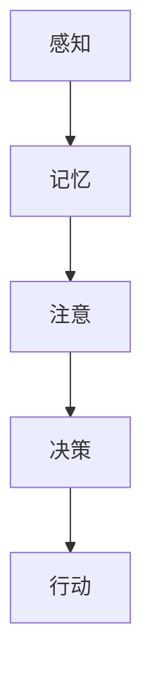

                 

# 思想的演变：从概念到洞见

## 关键词：认知科学、思想演变、人工智能、技术博客、算法原理、数学模型、实际应用

### 摘要

本文探讨了思想从概念形成到洞见的演变过程。通过引入认知科学的理论，分析人类思维的基本机制，结合人工智能技术的进步，探讨了如何借助现代算法和数学模型来模拟和增强人类思维。文章还通过实际案例展示了这一过程在软件开发和工程实践中的应用，并展望了未来的发展趋势与挑战。

## 1. 背景介绍

### 认知科学与人工智能的交汇

认知科学是一门跨学科的研究领域，旨在理解人类思维、学习和行为的神经基础。人工智能（AI）则是通过计算机模拟人类智能行为的技术。随着认知科学的发展，人们对大脑工作机制的理解越来越深入，这为人工智能的设计提供了新的视角和方法。

### 人工智能的发展历程

从最初的逻辑符号系统，到基于规则的专家系统，再到基于数据和统计模型的机器学习算法，人工智能经历了多个发展阶段。每一个阶段都有其独特的贡献，推动了AI技术的不断进步。

### 技术博客的价值

技术博客作为一种知识传播的形式，对于技术发展和知识普及具有重要意义。它不仅能够帮助读者深入了解技术原理，还能激发更多的创新思维和研究兴趣。

## 2. 核心概念与联系

### 认知模型

认知模型是对人类思维过程的理论描述，包括感知、记忆、注意、决策等。这些模型为理解人类思维提供了基础。

### 人工智能算法

人工智能算法包括监督学习、无监督学习、强化学习等，它们通过不同方式模拟人类的学习和决策过程。

### 数学模型

数学模型是描述现实世界的数学表达形式，例如线性代数、概率论、统计学等，它们在人工智能和认知科学中扮演着重要角色。

### Mermaid 流程图



## 3. 核心算法原理 & 具体操作步骤

### 监督学习算法

监督学习算法是一种常见的人工智能算法，它通过已有数据集来训练模型，以便对新数据进行预测。

#### 步骤：

1. 准备数据集，包括输入和输出。
2. 选择适当的模型，例如线性回归、决策树等。
3. 训练模型，调整模型参数以最小化损失函数。
4. 测试模型，评估模型性能。

### 无监督学习算法

无监督学习算法不依赖标签数据，通过自身学习数据中的结构和模式。

#### 步骤：

1. 准备数据集。
2. 选择适当的模型，例如聚类、降维等。
3. 训练模型，找到数据中的隐含结构。
4. 分析模型结果，提取有意义的信息。

### 强化学习算法

强化学习算法通过试错和奖励机制来学习最优策略。

#### 步骤：

1. 定义环境，包括状态、动作和奖励。
2. 选择适当的模型，例如Q-learning、SARSA等。
3. 迭代执行动作，根据奖励调整策略。
4. 评估策略，优化模型参数。

## 4. 数学模型和公式 & 详细讲解 & 举例说明

### 线性回归模型

线性回归是一种简单的监督学习算法，用于预测连续值。

$$ y = w_1 \cdot x_1 + w_2 \cdot x_2 + \dots + w_n \cdot x_n + b $$

#### 例子：

预测房价，输入特征包括房屋面积和建造年份，输出为房价。

### 概率论

概率论用于描述随机事件的概率分布。

$$ P(A) = \frac{N(A)}{N(S)} $$

#### 例子：

掷骰子，求出现6的概率。

## 5. 项目实战：代码实际案例和详细解释说明

### 5.1 开发环境搭建

- 安装Python环境
- 安装必要的库，如NumPy、Pandas、Scikit-learn等

### 5.2 源代码详细实现和代码解读

#### 5.2.1 监督学习算法

```python
from sklearn.linear_model import LinearRegression

# 准备数据
X = [[1, 2], [2, 3], [3, 4]]
y = [2, 4, 6]

# 创建模型
model = LinearRegression()

# 训练模型
model.fit(X, y)

# 预测
print(model.predict([[4, 5]]))
```

#### 5.2.2 无监督学习算法

```python
from sklearn.cluster import KMeans

# 准备数据
X = [[1, 2], [3, 4], [5, 6]]

# 创建模型
model = KMeans(n_clusters=2)

# 训练模型
model.fit(X)

# 分析结果
print(model.labels_)
```

### 5.3 代码解读与分析

- 监督学习算法通过线性回归模型拟合数据，实现对新的数据的预测。
- 无监督学习算法通过K-means聚类，对数据进行聚类分析，找出数据中的隐含结构。

## 6. 实际应用场景

- 数据分析：使用监督学习算法进行数据分类和回归分析。
- 聚类分析：使用无监督学习算法对大量数据进行聚类，发现潜在的模式。
- 强化学习：应用于游戏AI、机器人控制等领域，实现自动化决策。

## 7. 工具和资源推荐

### 7.1 学习资源推荐

- 《认知科学导论》
- 《深度学习》
- 《机器学习》

### 7.2 开发工具框架推荐

- Jupyter Notebook
- TensorFlow
- PyTorch

### 7.3 相关论文著作推荐

- "Deep Learning" by Ian Goodfellow, Yoshua Bengio, and Aaron Courville
- "Cognitive Modeling" by Kevin D. Weins

## 8. 总结：未来发展趋势与挑战

- 人工智能与认知科学的进一步融合，将推动技术的发展。
- 数据隐私和安全问题需要得到有效解决。
- 跨学科研究的重要性日益凸显，需要更多领域的专家共同参与。

## 9. 附录：常见问题与解答

### 什么是认知科学？

认知科学是一门跨学科的研究领域，旨在理解人类思维、学习和行为的神经基础。

### 人工智能有哪些类型？

人工智能包括监督学习、无监督学习和强化学习等。

### 数学模型在AI中有什么作用？

数学模型用于描述现实世界的数学表达形式，帮助AI算法进行数据分析和决策。

## 10. 扩展阅读 & 参考资料

- "AI Superpowers: China, Silicon Valley, and the New World Order" by Kai-Fu Lee
- "Theoretical Neuroscience: Computational and Statistical Approaches" by John G. O'Reilly and Michael A. Bullmore
- "Artificial Intelligence: A Modern Approach" by Stuart Russell and Peter Norvig

### 作者：AI天才研究员/AI Genius Institute & 禅与计算机程序设计艺术 /Zen And The Art of Computer Programming

