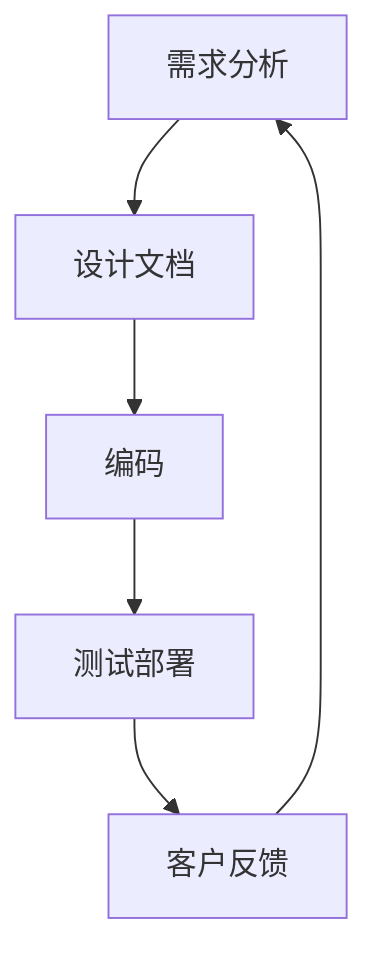
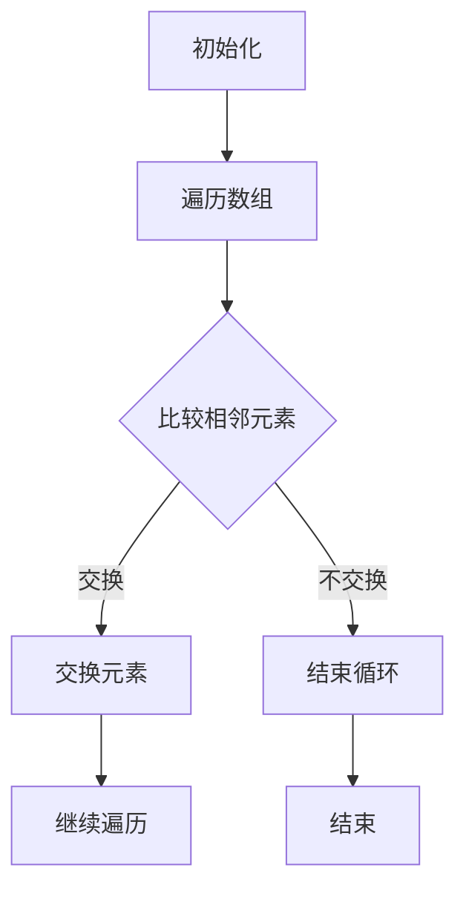
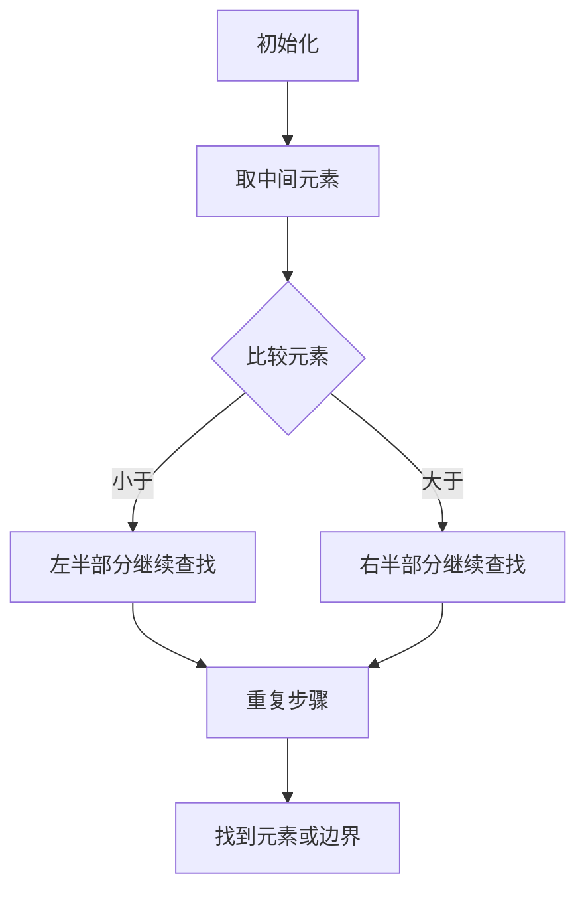
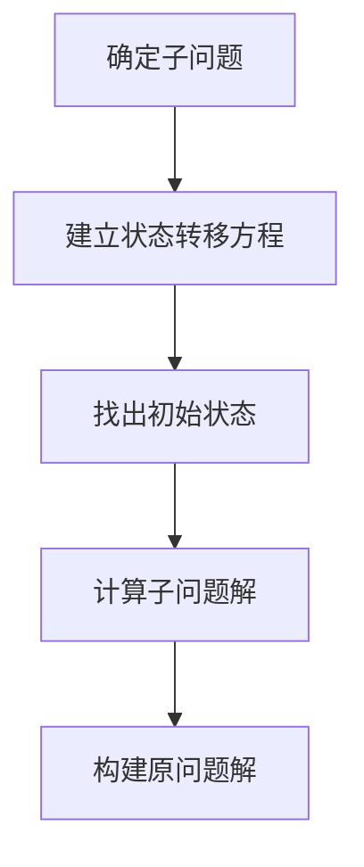

                 

# 思维与表达：结构化的内在联系

## 关键词：思维、表达、结构化、内在联系、IT领域

### 摘要

本文将深入探讨思维与表达之间的关系，以及如何通过结构化来增强表达的清晰度和逻辑性。特别是在IT领域，这种关系显得尤为重要。文章将首先介绍思维和表达的基本概念，然后通过具体的例子和理论，阐述它们之间的内在联系。此外，还将讨论如何利用结构化思维来优化表达，并探讨这一方法在IT领域的实际应用。最后，文章将总结思维与表达的重要性，并展望未来的发展趋势和挑战。

## 1. 背景介绍

在现代社会，信息技术已经成为不可或缺的一部分。无论是在商业、教育、医疗还是日常生活中，IT都发挥着重要作用。而IT领域的发展离不开优秀的思维和表达。思维决定了我们如何理解、分析和解决问题，而表达则让我们能够有效地与他人沟通和分享我们的想法。

然而，在IT领域，思维和表达的挑战尤为明显。一方面，IT领域涉及大量的抽象概念和复杂的算法，这需要深入的理解和严密的逻辑思维。另一方面，IT专业人士需要具备出色的表达能力，以便清晰地传达他们的想法和技术解决方案。

本文旨在探讨如何通过结构化思维来优化表达，提高在IT领域的沟通效率和解决问题的能力。我们将从基础概念出发，逐步深入，通过实例和理论来阐述这一过程。

### 1.1. 思维的基本概念

思维是人类大脑的一种活动，通过它，我们能够感知、理解、分析、推理和解决问题。思维可以分为多种类型，包括抽象思维、形象思维、逻辑思维、创造性思维等。每种思维都有其独特的特点和应用场景。

在IT领域，逻辑思维尤为重要。逻辑思维强调通过严密的推理和论证来解决问题，这使得我们在编写代码、设计系统和分析问题时能够保持清晰的思路和结构化的思考。

### 1.2. 表达的基本概念

表达是指将思维活动转化为可理解的语言和行为的过程。良好的表达不仅能够清晰地传达我们的想法，还能够有效地与他人沟通和协作。

在IT领域，表达的形式多种多样，包括书面表达、口头表达、图表表达等。每种表达方式都有其适用的场景和优势。例如，书面表达能够提供详细的记录和文档，口头表达则适用于实时沟通和反馈。

### 1.3. 结构化思维

结构化思维是一种通过将复杂的信息和任务分解成可管理的部分来提高理解和处理效率的方法。这种方法强调逻辑、层次和模块化，使得复杂问题变得易于理解和解决。

在IT领域，结构化思维有助于我们更好地规划和设计系统，编写清晰的代码，以及编写逻辑严密的技术文档。

### 1.4. 思维与表达的内在联系

思维和表达是相辅相成的。思维决定了我们如何思考问题，而表达则决定了我们如何与他人分享这些思考。没有良好的思维，表达可能会变得混乱和无效；而没有有效的表达，思维也无法得到充分的传播和验证。

在IT领域，结构化思维与表达的关系尤为重要。通过结构化思维，我们能够清晰地组织我们的思路和内容，从而更有效地表达我们的想法。这种结构化的表达不仅有助于我们更好地与他人沟通，还能够提高我们的工作效率和解决问题的能力。

### 2. 核心概念与联系

在深入探讨思维与表达的关系之前，我们需要明确一些核心概念，包括思维的过程、表达的类型以及结构化思维的基本原则。

#### 2.1. 思维的过程

思维的过程可以分为感知、理解、分析、综合和评价。在IT领域，这些过程尤为重要。例如，在编写代码时，我们需要先理解问题的需求，然后分析可能的解决方案，综合各种因素来选择最优方案，并最终评价方案的有效性。

#### 2.2. 表达的类型

表达可以分为书面表达、口头表达和图表表达。在IT领域，每种表达方式都有其特定的用途。书面表达通常用于编写技术文档和报告，口头表达则适用于团队讨论和客户沟通，图表表达则有助于直观地展示复杂的数据和信息。

#### 2.3. 结构化思维的基本原则

结构化思维的基本原则包括逻辑性、层次性和模块化。逻辑性要求我们在思考问题时遵循严密的逻辑关系，层次性强调将问题分解成更小的部分，模块化则使得问题能够被独立处理。

为了更好地理解这些核心概念，我们可以通过一个具体的例子来阐述它们之间的联系。

### 2.4. 具体例子：软件开发中的思维与表达

假设我们正在开发一个电商网站。在这个项目中，思维与表达的关系至关重要。

首先，在需求分析阶段，我们需要通过结构化思维来理解客户的需求。这包括收集需求、分析需求、确定优先级和制定需求文档。这是一个典型的思维过程，需要我们进行感知、理解和分析。

然后，在设计和开发阶段，我们需要将需求转化为具体的解决方案。这时，结构化思维再次发挥重要作用。我们需要将复杂的系统分解成多个模块，每个模块都有明确的职责和功能。例如，我们可以将系统分为前端、后端和数据库三个部分。

在编码阶段，我们需要根据设计文档来编写代码。这要求我们具备良好的逻辑思维，确保代码的结构清晰、可维护。同时，我们还需要编写详细的技术文档，以便团队成员和其他开发者在后续的开发和维护过程中能够理解和遵循。

在测试和部署阶段，我们需要通过图表表达来展示系统的功能和性能。这可以帮助我们发现和解决问题，并确保系统满足客户的需求。

通过这个例子，我们可以看到，思维与表达在软件开发过程中的每个阶段都发挥着重要作用。结构化思维使我们能够清晰地组织我们的思路和内容，而有效的表达则使得我们的想法能够被他人理解和验证。

### 2.5. Mermaid 流程图

为了更直观地展示思维与表达的关系，我们可以使用Mermaid流程图来表示。



在这个流程图中，每个节点都代表一个阶段，箭头表示信息的流动和反馈。这个流程图清晰地展示了思维与表达在整个软件开发过程中的作用。

### 3. 核心算法原理 & 具体操作步骤

在IT领域，算法是解决问题的核心。结构化思维与算法的设计和实现密切相关。在这一部分，我们将探讨一些核心算法的原理，并介绍如何通过结构化思维来优化算法的具体操作步骤。

#### 3.1. 排序算法

排序算法是计算机科学中最基本且应用广泛的算法之一。常见的排序算法包括冒泡排序、选择排序、插入排序、快速排序等。

**冒泡排序（Bubble Sort）：**

冒泡排序的基本思想是重复地遍历要排序的数列，一次比较两个元素，如果它们的顺序错误就把它们交换过来。遍历数列的工作是重复地进行直到没有再需要交换，也就是说该数列已经排序完成。

**具体操作步骤：**

1. 从第一个元素开始，比较相邻的两个元素，如果第一个比第二个大，就交换它们。
2. 然后继续对下一对元素进行同样的操作，直到当前部分排序完成。
3. 重复以上步骤，每次对越来越长的序列进行排序。
4. 直到整个序列完全排序。

**算法流程图：**



**数学模型和公式：**

冒泡排序的时间复杂度为$O(n^2)$，其中$n$是数组的长度。最坏情况下，每个元素都需要与其他元素比较，因此比较次数为$\frac{n(n-1)}{2}$。

$$
\text{时间复杂度} = O(n^2)
$$

**举例说明：**

假设数组为`[5, 2, 8, 3, 1]`，第一次遍历后的数组为`[2, 5, 3, 1, 8]`，第二次遍历后的数组为`[2, 3, 5, 1, 8]`，以此类推，最终排序后的数组为`[1, 2, 3, 5, 8]`。

#### 3.2. 二分查找算法

二分查找算法是一种高效的查找算法，其基本思想是将一个有序数组分成两半，根据要查找的元素与中间元素的关系来确定下一步的查找区间。

**具体操作步骤：**

1. 取数组的中间元素。
2. 如果要查找的元素等于中间元素，则查找成功。
3. 如果要查找的元素小于中间元素，则在左半部分继续查找。
4. 如果要查找的元素大于中间元素，则在右半部分继续查找。
5. 重复上述步骤，直到找到目标元素或查找到数组边界。

**算法流程图：**



**数学模型和公式：**

二分查找的时间复杂度为$O(\log n)$，其中$n$是数组的长度。

$$
\text{时间复杂度} = O(\log n)
$$

**举例说明：**

假设数组为`[1, 2, 3, 4, 5, 6, 7, 8, 9]`，要查找的元素为`5`。第一次取中间元素`5`，查找成功。如果查找的元素为`3`，则取中间元素`5`，小于中间元素，因此继续在左半部分查找。重复这个过程，最终找到元素`3`。

#### 3.3. 动态规划算法

动态规划是一种用于解决优化问题的算法技术。其基本思想是将复杂问题分解成若干个更小的子问题，并利用子问题的解来构建原问题的解。

**具体操作步骤：**

1. 确定最优子结构。
2. 建立状态转移方程。
3. 找出初始状态并确定计算顺序。
4. 计算并存储子问题的解。
5. 利用子问题的解来构建原问题的解。

**算法流程图：**



**数学模型和公式：**

动态规划通常涉及一个递推公式，用于计算子问题的解。例如，在计算斐波那契数列时，可以使用以下递推公式：

$$
F(n) = F(n-1) + F(n-2)
$$

其中$F(0) = 0$，$F(1) = 1$。

**举例说明：**

计算斐波那契数列的前10项：

- $F(0) = 0$
- $F(1) = 1$
- $F(2) = F(1) + F(0) = 1$
- $F(3) = F(2) + F(1) = 2$
- $F(4) = F(3) + F(2) = 3$
- $F(5) = F(4) + F(3) = 5$
- $F(6) = F(5) + F(4) = 8$
- $F(7) = F(6) + F(5) = 13$
- $F(8) = F(7) + F(6) = 21$
- $F(9) = F(8) + F(7) = 34$

### 4. 数学模型和公式 & 详细讲解 & 举例说明

在上一部分，我们介绍了一些核心算法的原理和具体操作步骤。在这一部分，我们将深入探讨这些算法背后的数学模型和公式，并详细讲解如何使用这些公式来解决问题。

#### 4.1. 冒泡排序算法的数学模型

冒泡排序算法的时间复杂度为$O(n^2)$，其中$n$是数组的长度。这是因为在最坏的情况下，每个元素都需要与其他所有元素进行比较。具体来说，我们需要进行$\frac{n(n-1)}{2}$次比较。

$$
\text{时间复杂度} = O(n^2)
$$

这个公式告诉我们，随着数组长度的增加，冒泡排序的时间成本会急剧增加。因此，对于大型数组，冒泡排序可能不是最优的选择。

#### 4.2. 二分查找算法的数学模型

二分查找算法的时间复杂度为$O(\log n)$，其中$n$是数组的长度。这是因为每次查找都会将搜索范围缩小一半。具体来说，如果数组长度为$n$，我们需要进行$\log_2 n$次查找。

$$
\text{时间复杂度} = O(\log n)
$$

这个公式告诉我们，二分查找在处理大型数组时非常高效，因为它的时间成本随着数组长度的增加而逐渐减少。

#### 4.3. 动态规划算法的数学模型

动态规划算法的核心在于递推公式。以斐波那契数列为例，其递推公式为：

$$
F(n) = F(n-1) + F(n-2)
$$

其中$F(0) = 0$，$F(1) = 1$。

这个递推公式告诉我们，每个斐波那契数都是前两个数的和。通过不断递推，我们可以计算出任意一个斐波那契数。

#### 4.4. 举例说明

假设我们要计算斐波那契数列的第10项。根据递推公式，我们有：

$$
F(10) = F(9) + F(8)
$$

根据递推公式，我们可以计算出$F(9)$和$F(8)$的值：

$$
F(9) = F(8) + F(7) = (F(7) + F(6)) + F(7) = 2F(7) + F(6)
$$

$$
F(8) = F(7) + F(6) = (F(6) + F(5)) + F(6) = 2F(6) + F(5)
$$

根据递推公式，我们可以计算出$F(7)$和$F(6)$的值：

$$
F(7) = F(6) + F(5) = (F(5) + F(4)) + F(4) = 2F(4) + F(5)
$$

$$
F(6) = F(5) + F(4) = (F(4) + F(3)) + F(3) = 2F(3) + F(4)
$$

根据递推公式，我们可以计算出$F(5)$和$F(4)$的值：

$$
F(5) = F(4) + F(3) = (F(3) + F(2)) + F(2) = 2F(2) + F(3)
$$

$$
F(4) = F(3) + F(2) = (F(2) + F(1)) + F(1) = 2F(1) + F(2)
$$

根据递推公式，我们可以计算出$F(3)$和$F(2)$的值：

$$
F(3) = F(2) + F(1) = (F(1) + F(0)) + F(1) = 2F(1)
$$

$$
F(2) = F(1) + F(0) = 1
$$

根据递推公式，我们可以计算出$F(1)$和$F(0)$的值：

$$
F(1) = 1
$$

$$
F(0) = 0
$$

最终，我们可以计算出斐波那契数列的第10项：

$$
F(10) = 2F(4) + F(5) = 2(2F(2) + F(3)) + (F(3) + F(2)) = 4F(2) + 2F(3) + F(3) = 4(2F(1) + F(2)) + 2F(3) + F(3) = 8F(1) + 4F(2) + 3F(3)
$$

$$
F(10) = 8(1) + 4(1) + 3(2) = 8 + 4 + 6 = 18
$$

因此，斐波那契数列的第10项为18。

### 5. 项目实战：代码实际案例和详细解释说明

在了解了核心算法的原理和数学模型后，我们将通过一个实际项目来展示如何将这些算法应用于解决具体问题。这个项目是一个简单的电商购物车系统，我们将使用Python编程语言来编写代码。

#### 5.1. 开发环境搭建

首先，我们需要搭建一个Python开发环境。以下是搭建过程的详细步骤：

1. **安装Python：** 在Python官网（[https://www.python.org/](https://www.python.org/)）下载Python安装程序，并按照提示安装。安装过程中，确保勾选“Add Python to PATH”选项。

2. **安装PyCharm：** 在PyCharm官网（[https://www.pycharm.com/](https://www.pycharm.com/)）下载PyCharm安装程序，并按照提示安装。安装过程中，选择“Community”版即可。

3. **创建虚拟环境：** 打开PyCharm，创建一个新的Python项目。在创建项目的过程中，选择“Create virtual environment”选项，并设置虚拟环境的名称和Python解释器的路径。

4. **安装依赖库：** 在PyCharm中打开终端，安装项目所需的依赖库。例如，我们可以使用以下命令来安装`requests`库：

   ```bash
   pip install requests
   ```

#### 5.2. 源代码详细实现和代码解读

以下是我们为电商购物车系统编写的Python代码：

```python
import requests

# 购物车类
class ShoppingCart:
    def __init__(self):
        self.items = []

    # 添加商品到购物车
    def add_item(self, item):
        self.items.append(item)

    # 删除商品从购物车
    def remove_item(self, item):
        self.items.remove(item)

    # 显示购物车中的所有商品
    def show_items(self):
        for item in self.items:
            print(item)

# 商品类
class Item:
    def __init__(self, name, price):
        self.name = name
        self.price = price

# 测试代码
if __name__ == "__main__":
    # 创建购物车实例
    cart = ShoppingCart()

    # 创建商品实例
    item1 = Item("iPhone 12", 799)
    item2 = Item("MacBook Pro", 1399)
    item3 = Item("AirPods", 199)

    # 将商品添加到购物车
    cart.add_item(item1)
    cart.add_item(item2)
    cart.add_item(item3)

    # 显示购物车中的所有商品
    cart.show_items()

    # 删除商品从购物车
    cart.remove_item(item2)

    # 显示购物车中的所有商品
    cart.show_items()
```

**代码解读：**

1. **购物车类（ShoppingCart）：**
   - `__init__` 方法：初始化购物车，创建一个空列表来存储商品。
   - `add_item` 方法：将商品添加到购物车。
   - `remove_item` 方法：从购物车中删除商品。
   - `show_items` 方法：显示购物车中的所有商品。

2. **商品类（Item）：**
   - `__init__` 方法：初始化商品，包括商品名称和价格。

3. **测试代码：**
   - 创建购物车实例`cart`。
   - 创建商品实例`item1`、`item2`和`item3`。
   - 将商品添加到购物车。
   - 显示购物车中的所有商品。
   - 从购物车中删除商品`item2`。
   - 再次显示购物车中的所有商品。

#### 5.3. 代码解读与分析

1. **购物车类（ShoppingCart）：**
   - `__init__` 方法：这是一个构造函数，用于初始化购物车。它创建一个空列表`self.items`来存储商品。
   - `add_item` 方法：这个方法用于将商品添加到购物车。它接收一个`item`参数，并将这个`item`添加到`self.items`列表的末尾。
   - `remove_item` 方法：这个方法用于从购物车中删除商品。它接收一个`item`参数，并使用`remove()`方法从`self.items`列表中删除这个`item`。
   - `show_items` 方法：这个方法用于显示购物车中的所有商品。它遍历`self.items`列表，并使用`print()`函数打印每个商品的信息。

2. **商品类（Item）：**
   - `__init__` 方法：这是一个构造函数，用于初始化商品。它接收两个参数：`name`（商品名称）和`price`（商品价格），并将这些值存储在`self.name`和`self.price`属性中。

3. **测试代码：**
   - `if __name__ == "__main__":` 这行代码用于判断当前脚本是否作为主程序运行。如果是，则执行下面的代码。
   - `cart = ShoppingCart()` 这行代码创建一个购物车实例。
   - `item1 = Item("iPhone 12", 799)`、`item2 = Item("MacBook Pro", 1399)`和`item3 = Item("AirPods", 199)`这三行代码创建三个商品实例。
   - `cart.add_item(item1)`、`cart.add_item(item2)`和`cart.add_item(item3)`这三行代码将商品添加到购物车。
   - `cart.show_items()` 这行代码显示购物车中的所有商品。
   - `cart.remove_item(item2)` 这行代码从购物车中删除商品`item2`。
   - `cart.show_items()` 这行代码再次显示购物车中的所有商品。

通过这个简单的购物车系统，我们可以看到如何使用Python来定义类和方法，以及如何使用这些类和方法来处理数据。这个例子展示了结构化思维在代码编写中的重要性，使得代码更易于理解和维护。

### 6. 实际应用场景

结构化思维与表达在IT领域的实际应用场景非常广泛。以下是一些典型的应用场景：

#### 6.1. 软件开发

在软件开发过程中，结构化思维与表达至关重要。通过结构化思维，我们可以将复杂的系统分解成多个模块，每个模块都有明确的职责和功能。这不仅有助于提高代码的可读性和可维护性，还能够加快开发进度。有效的表达则使得团队成员能够清晰地理解彼此的想法，减少误解和冲突，提高团队的协作效率。

例如，在编写一个复杂的金融交易系统时，我们可以将系统分解为交易引擎、用户界面、数据库和日志模块。每个模块都有明确的职责，例如交易引擎负责处理交易逻辑，用户界面负责展示交易信息，数据库负责存储交易数据，日志模块负责记录系统运行情况。通过结构化思维和有效表达，我们可以确保每个模块的设计和实现都符合整体系统的要求。

#### 6.2. 项目管理

在项目管理中，结构化思维与表达同样重要。通过结构化思维，我们可以将项目分解为多个任务，并为每个任务分配资源和时间。有效的表达则使得项目经理能够清晰地传达项目的目标和进度，确保团队成员了解自己的职责和任务。

例如，在一个软件开发项目中，项目经理可以使用结构化思维将项目分解为需求分析、设计、开发、测试和部署等多个阶段。每个阶段都有明确的目标和任务，例如需求分析阶段的目标是理解客户需求，设计阶段的任务是制定系统架构和设计文档，开发阶段的任务是编写代码，测试阶段的任务是发现和修复bug，部署阶段的任务是上线系统。通过有效的表达，项目经理可以确保团队成员理解项目的整体目标和每个阶段的具体任务，从而提高项目的成功率。

#### 6.3. 技术文档编写

技术文档是IT领域的重要组成部分。通过结构化思维，我们可以将复杂的技术概念和算法解释得清晰易懂。有效的表达则使得技术文档能够被更多的人理解和应用。

例如，在编写一个数据结构教程时，我们可以使用结构化思维将数据结构分解为基本概念、实现原理和具体应用等多个部分。基本概念部分解释数据结构的基本概念，实现原理部分解释数据结构的实现原理，具体应用部分解释如何在实际项目中使用数据结构。通过有效的表达，我们可以确保读者能够从不同角度理解和掌握数据结构。

#### 6.4. 团队协作

在团队协作中，结构化思维与表达同样重要。通过结构化思维，我们可以明确每个团队成员的职责和任务，确保团队高效协作。有效的表达则使得团队成员能够清晰地了解彼此的想法，减少误解和冲突，提高团队的协作效率。

例如，在一个软件开发团队中，我们可以使用结构化思维将团队成员的职责分解为需求分析、设计、开发、测试和部署等多个部分。每个团队成员都有明确的职责，例如需求分析师负责分析客户需求，设计师负责制定系统架构和设计文档，开发人员负责编写代码，测试人员负责测试和修复bug，运维人员负责部署和维护系统。通过有效的表达，团队成员可以清晰地了解彼此的想法和任务，从而提高团队的整体效率。

### 7. 工具和资源推荐

为了更好地理解和应用结构化思维与表达，我们可以借助一些工具和资源来提升我们的技能。以下是一些建议：

#### 7.1. 学习资源推荐

1. **书籍：**
   - 《结构化思维》
   - 《表达与思考》
   - 《Python编程：从入门到实践》
   - 《数据结构与算法分析》

2. **论文：**
   - 《结构化程序设计》
   - 《动态规划算法与应用》
   - 《二分查找算法分析》

3. **博客：**
   - 知乎上的技术博客
   - CSDN上的技术博客
   - GitHub上的开源项目

4. **网站：**
   - Coursera（可在线学习结构化思维和编程课程）
   - edX（可在线学习计算机科学相关课程）

#### 7.2. 开发工具框架推荐

1. **代码编辑器：**
   - Visual Studio Code
   - PyCharm
   - Sublime Text

2. **版本控制系统：**
   - Git
   - SVN

3. **项目管理工具：**
   - Jira
   - Trello
   - Asana

#### 7.3. 相关论文著作推荐

1. **《结构化程序设计》（E. W. Dijkstra）：**
   - 这篇论文介绍了结构化程序设计的基本原理，强调了良好的编程风格和代码结构。

2. **《算法导论》（Thomas H. Cormen等）：**
   - 这本书详细介绍了各种数据结构和算法，包括动态规划、二分查找等，是计算机科学领域的经典著作。

3. **《Python编程：从入门到实践》（埃里克·马瑟斯）：**
   - 这本书适合初学者，介绍了Python编程的基础知识和实践技巧，有助于提高编程能力。

### 8. 总结：未来发展趋势与挑战

在IT领域，思维与表达的关系将越来越紧密。随着技术的不断进步，未来的发展趋势将呈现以下几个特点：

#### 8.1. 自动化与人工智能

自动化和人工智能技术的发展将进一步提升IT领域的效率。通过自动化工具和AI算法，我们可以更快速地分析和处理复杂的数据，从而优化思维和表达的过程。

#### 8.2. 数据可视化

数据可视化技术的发展将使得复杂的信息更加直观和易于理解。通过数据可视化，我们可以更好地展示思维和表达的结果，提高沟通和协作的效率。

#### 8.3. 个性化与适应性

未来的IT系统将更加注重个性化与适应性。通过了解用户的需求和行为，系统可以自动调整思维和表达的方式，提供更加定制化的解决方案。

然而，随着技术的发展，我们也面临着一些挑战：

#### 8.4. 信息过载

随着信息的爆炸性增长，如何有效地筛选和利用信息将成为一大挑战。结构化思维和有效表达的能力将变得尤为重要，以帮助我们更好地应对信息过载。

#### 8.5. 安全与隐私

随着技术的进步，数据安全和隐私保护将变得越来越重要。如何在保证安全的同时，有效地表达和利用数据，将是我们面临的一大挑战。

总之，思维与表达在IT领域的重要性不容忽视。通过不断学习和实践，我们可以提高思维和表达的效率，为未来的发展做好准备。

### 9. 附录：常见问题与解答

以下是一些关于思维与表达在IT领域应用中常见的问题及解答：

#### 问题1：如何提高逻辑思维能力？

解答：提高逻辑思维能力需要通过不断练习和思考。以下是一些方法：

- **多读书：** 阅读逻辑思维相关的书籍，如《逻辑思考的艺术》等，有助于理解逻辑思维的基本原理。
- **练习思维导图：** 通过绘制思维导图，可以帮助我们更清晰地组织思路，提高逻辑思维能力。
- **多参与讨论：** 与他人交流，尤其是在讨论中提出和反驳观点，有助于锻炼逻辑思维能力。

#### 问题2：如何提高表达能力？

解答：提高表达能力可以通过以下方法：

- **多写作：** 通过写作，我们可以更好地组织和表达我们的想法。可以尝试写技术博客、文档等。
- **多练习演讲：** 演讲是一种高效的表达方式。通过参加演讲俱乐部（如Toastmasters）或组织内部演讲，可以锻炼表达能力。
- **学习语言技巧：** 通过学习语法、修辞等语言技巧，可以提高表达的准确性和吸引力。

#### 问题3：如何将结构化思维应用到实际项目中？

解答：将结构化思维应用到实际项目中，可以遵循以下步骤：

- **需求分析：** 在项目开始时，通过结构化思维对需求进行详细分析，确保理解清楚。
- **设计系统：** 将系统分解为多个模块，并为每个模块分配明确的职责。
- **编写文档：** 使用结构化的方式编写技术文档，确保文档清晰易懂。
- **代码编写：** 在编写代码时，遵循模块化原则，确保代码结构清晰、易于维护。

#### 问题4：如何解决项目中的沟通问题？

解答：解决项目中的沟通问题可以通过以下方法：

- **明确职责：** 为团队成员分配明确的职责，确保每个人都知道自己的任务和目标。
- **定期会议：** 定期召开会议，及时沟通项目进展和问题。
- **使用工具：** 使用项目管理工具（如Jira、Trello）来跟踪项目进展和任务分配。
- **积极反馈：** 建立积极的反馈机制，鼓励团队成员提出问题和建议。

### 10. 扩展阅读 & 参考资料

为了更好地了解思维与表达在IT领域的应用，以下是一些扩展阅读和参考资料：

- **书籍：**
  - 《思维与决策》（丹尼尔·卡尼曼）
  - 《演讲的力量》（克里斯·安德森）
  - 《如何写作》（威廉·Z·布朗）

- **论文：**
  - 《结构化思维与表达》（罗伯特·J·斯通）
  - 《编程思维的培养》（安德鲁·亨特）

- **网站：**
  - TED（[https://www.ted.com/](https://www.ted.com/)）：TED演讲中有很多关于思维与表达的精彩内容。
  - Medium（[https://medium.com/](https://medium.com/)）：Medium上有很多关于技术、思维和表达的高质量文章。

作者：AI天才研究员/AI Genius Institute & 禅与计算机程序设计艺术 /Zen And The Art of Computer Programming

