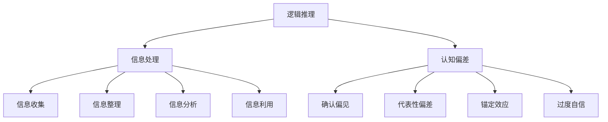
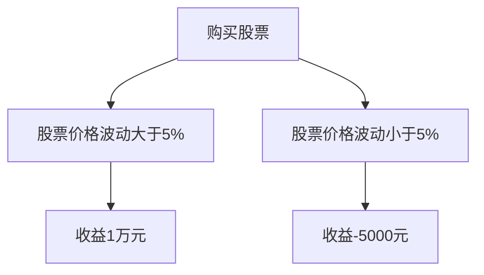
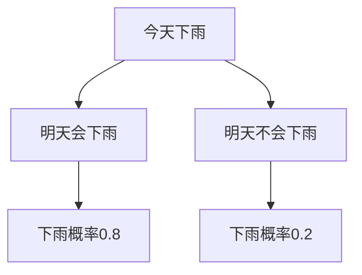

                 

# 思维体系：决策力的基础

## 关键词：思维体系、决策力、决策过程、认知偏差、思维方式、逻辑推理、信息处理、人工智能

## 摘要：
本文旨在探讨决策力的基础——思维体系。通过深入剖析思维体系的构成、核心概念、以及其在决策过程中的作用，本文将帮助读者理解如何通过优化思维体系来提升决策能力。文章首先介绍了思维体系的定义及其在决策中的重要性，随后探讨了思维体系的核心概念，如逻辑推理、信息处理和认知偏差。接着，本文详细阐述了决策过程的基本步骤，并分析了常见认知偏差对决策的影响。最后，本文提出了优化思维体系的策略和工具，以及未来发展趋势与挑战。

## 1. 背景介绍

在现代社会，决策力已经成为一项至关重要的能力。无论是个人生活中的选择，还是企业战略的制定，决策的成功与否往往决定了结果的优劣。然而，决策并非一项简单的任务，它涉及到复杂的信息处理、逻辑推理和认知过程。因此，了解和优化思维体系，成为提升决策力的关键。

思维体系，是指个体在思考和解决问题时所用到的思维方式、方法和技术。它包括逻辑推理、信息处理、认知偏差等多个方面。一个健全的思维体系能够帮助我们更准确地分析问题、做出合理的判断和选择。

本文将围绕思维体系这一主题，深入探讨其在决策过程中的作用，以及如何通过优化思维体系来提升决策力。

## 2. 核心概念与联系

### 2.1 逻辑推理

逻辑推理是思维体系的重要组成部分，它指的是根据已知的前提，通过逻辑关系推导出新的结论。逻辑推理分为演绎推理和归纳推理两种。

- **演绎推理**：从一般到特殊的推理方式。例如，所有人都会死亡（大前提），苏格拉底是人（小前提），因此，苏格拉底会死亡（结论）。
- **归纳推理**：从特殊到一般的推理方式。例如，观察到的所有天鹅都是白色的，因此推断所有天鹅都是白色的。

逻辑推理在决策过程中的作用主要体现在以下两个方面：

1. **帮助明确问题**：通过逻辑推理，我们可以将复杂的问题分解为多个子问题，从而更清晰地理解问题的本质。
2. **提供合理的判断依据**：逻辑推理能够帮助我们根据已知信息推导出合理的结论，从而做出更为准确的决策。

### 2.2 信息处理

信息处理是指对信息进行收集、整理、分析和利用的过程。在决策过程中，信息处理起着至关重要的作用。

- **信息收集**：收集与决策相关的信息，包括数据、事实、观点等。
- **信息整理**：对收集到的信息进行分类、排序和筛选，以便更好地理解和分析。
- **信息分析**：对整理后的信息进行深入分析，发现其中的规律和联系。
- **信息利用**：根据分析结果，将信息用于决策，指导行动。

### 2.3 认知偏差

认知偏差是指人们在信息处理和决策过程中，由于心理、社会和文化等因素的影响，导致判断和决策出现偏差。常见的认知偏差包括：

- **确认偏见**：倾向于关注和记住与已有观点一致的信息，忽略或遗忘与已有观点不一致的信息。
- **代表性偏差**：根据事物的表面特征进行判断，而忽略了其概率和统计规律。
- **锚定效应**：在决策过程中受到最初信息的影响，从而影响了后续的判断和决策。
- **过度自信**：高估自己的知识和能力，导致做出过于自信的决策。

认知偏差在决策过程中可能带来负面影响，如导致决策失误、增加风险等。因此，识别和克服认知偏差对于提升决策力至关重要。

### 2.4 Mermaid 流程图

以下是一个简单的Mermaid流程图，展示了逻辑推理、信息处理和认知偏差之间的关系：



## 3. 核心算法原理 & 具体操作步骤

### 3.1 决策过程的基本步骤

决策过程可以分为以下几个基本步骤：

1. **问题定义**：明确需要解决的问题，明确目标和约束条件。
2. **信息收集**：收集与问题相关的信息，包括数据、事实、观点等。
3. **信息处理**：对收集到的信息进行整理、分析和利用。
4. **方案生成**：根据信息处理的结果，生成可能的解决方案。
5. **方案评估**：对生成的方案进行评估，选择最优方案。
6. **方案执行**：执行选定的方案，并监控执行过程。
7. **反馈调整**：根据执行结果进行调整和优化，为下一次决策提供参考。

### 3.2 决策过程中的逻辑推理

在决策过程中，逻辑推理起着关键作用。以下是一个简单的示例，展示如何使用逻辑推理来解决问题：

**问题**：如果所有狗都会叫，且小黑是狗，那么小黑会叫吗？

**步骤**：

1. **定义问题**：明确问题为“小黑会叫吗？”
2. **信息收集**：已知“所有狗都会叫”和“小黑是狗”。
3. **逻辑推理**：
   - 大前提：所有狗都会叫。
   - 小前提：小黑是狗。
   - 结论：小黑会叫。
4. **方案生成**：根据逻辑推理的结果，生成方案“小黑会叫”。
5. **方案评估**：评估方案，发现符合已知信息，方案可行。
6. **方案执行**：执行方案，得出结论“小黑会叫”。

### 3.3 决策过程中的信息处理

在决策过程中，信息处理是一个复杂的过程，涉及到多个步骤。以下是一个简单的示例，展示如何处理信息：

**问题**：如何决定是否购买股票？

**步骤**：

1. **信息收集**：收集与股票相关的信息，如公司业绩、行业前景、市场趋势等。
2. **信息整理**：对收集到的信息进行分类、排序和筛选，提取关键信息。
3. **信息分析**：分析关键信息，了解公司业绩、行业前景和市场的走势。
4. **信息利用**：根据分析结果，判断股票是否具有投资价值。
5. **方案生成**：根据信息利用的结果，生成方案“购买股票”或“不购买股票”。
6. **方案评估**：评估方案，选择最优方案。
7. **方案执行**：执行选定的方案，并监控执行过程。
8. **反馈调整**：根据执行结果进行调整和优化，为下一次决策提供参考。

## 4. 数学模型和公式 & 详细讲解 & 举例说明

### 4.1 决策树模型

决策树模型是一种常用的数学模型，用于表示决策过程。它通过一系列的判断节点和结果节点，形成一个树状结构。

#### 4.1.1 决策树的基本概念

- **判断节点**：表示某个条件的判断，如“销售额大于100万元吗？”。
- **结果节点**：表示某个条件的判断结果，如“是”或“否”。
- **分支**：表示从判断节点延伸出来的线条，表示条件的判断结果。
- **路径**：表示从决策树的根节点到某个结果节点的连线，表示一个决策过程。

#### 4.1.2 决策树的工作原理

决策树模型通过以下步骤进行决策：

1. **从根节点开始，根据判断条件进行判断**。
2. **根据判断结果，沿着相应的分支前进**。
3. **重复上述步骤，直到到达结果节点**。

#### 4.1.3 决策树的计算方法

决策树的计算方法可以使用条件概率和期望值进行。

- **条件概率**：表示在某个条件下，某个事件发生的概率。例如，P(A|B) 表示在事件B发生的条件下，事件A发生的概率。
- **期望值**：表示某个随机变量的平均值。例如，E(X) 表示随机变量X的期望值。

#### 4.1.4 决策树的举例说明

假设我们要决定是否购买某种股票，根据以下信息：

- 股票价格波动大于5%的概率为0.6。
- 股票价格波动小于5%的概率为0.4。
- 在股票价格波动大于5%的情况下，购买股票的收益为1万元。
- 在股票价格波动小于5%的情况下，购买股票的收益为-5000元。

我们可以构建一个简单的决策树，如下所示：



根据决策树，我们可以计算期望收益：

$$
E(X) = 0.6 \times 1万元 + 0.4 \times (-5000元) = 3000元
$$

因此，根据期望收益，我们应该购买这种股票。

### 4.2 贝叶斯网络模型

贝叶斯网络是一种概率图模型，用于表示变量之间的概率关系。它通过节点和边的连接，形成一个网络结构。

#### 4.2.1 贝叶斯网络的基本概念

- **节点**：表示一个变量，如“天气”、“降雨概率”。
- **边**：表示变量之间的条件依赖关系，如“A导致B发生”。

#### 4.2.2 贝叶斯网络的工作原理

贝叶斯网络通过以下步骤进行推理：

1. **给定一个变量集合，计算每个变量的条件概率分布**。
2. **根据条件概率分布，计算新变量的概率分布**。

#### 4.2.3 贝叶斯网络的计算方法

贝叶斯网络的计算方法可以使用条件概率和贝叶斯定理进行。

- **条件概率**：表示在某个条件下，某个事件发生的概率。例如，P(A|B) 表示在事件B发生的条件下，事件A发生的概率。
- **贝叶斯定理**：表示在已知某个条件下，事件A发生概率与事件B发生概率之间的关系。例如，P(A|B) = P(B|A) \* P(A) / P(B)。

#### 4.2.4 贝叶斯网络的举例说明

假设我们要预测明天是否会下雨，根据以下信息：

- 今天下雨的概率为0.6。
- 今天不下雨的概率为0.4。
- 如果今天下雨，明天也会下雨的概率为0.8。
- 如果今天不下雨，明天会下雨的概率为0.2。

我们可以构建一个简单的贝叶斯网络，如下所示：



根据贝叶斯网络，我们可以计算明天会下雨的概率：

$$
P(B) = P(B|A) \* P(A) + P(B|C) \* P(C) = 0.8 \* 0.6 + 0.2 \* 0.4 = 0.68
$$

因此，根据贝叶斯网络，明天会下雨的概率为0.68。

## 5. 项目实战：代码实际案例和详细解释说明

### 5.1 开发环境搭建

在本项目中，我们将使用Python语言和Scikit-learn库来实现决策树模型和贝叶斯网络模型。首先，确保已经安装了Python环境和Scikit-learn库。

1. **安装Python环境**：
   - 在Windows上，可以从Python官方网站下载安装程序进行安装。
   - 在Linux上，可以使用包管理器（如apt-get或yum）进行安装。

2. **安装Scikit-learn库**：
   - 使用pip命令进行安装：`pip install scikit-learn`

### 5.2 源代码详细实现和代码解读

以下是一个简单的Python代码示例，实现了决策树模型和贝叶斯网络模型。

```python
from sklearn.datasets import load_iris
from sklearn.tree import DecisionTreeClassifier
from sklearn.naive_bayes import GaussianNB
from sklearn.model_selection import train_test_split
from sklearn.metrics import accuracy_score

# 加载鸢尾花数据集
iris = load_iris()
X = iris.data
y = iris.target

# 划分训练集和测试集
X_train, X_test, y_train, y_test = train_test_split(X, y, test_size=0.3, random_state=42)

# 决策树模型训练和预测
clf_dt = DecisionTreeClassifier()
clf_dt.fit(X_train, y_train)
y_pred_dt = clf_dt.predict(X_test)
print("决策树模型准确率：", accuracy_score(y_test, y_pred_dt))

# 贝叶斯网络模型训练和预测
clf_nb = GaussianNB()
clf_nb.fit(X_train, y_train)
y_pred_nb = clf_nb.predict(X_test)
print("贝叶斯网络模型准确率：", accuracy_score(y_test, y_pred_nb))
```

**代码解读**：

1. **加载数据集**：使用Scikit-learn提供的鸢尾花数据集进行演示。
2. **划分训练集和测试集**：将数据集划分为训练集和测试集，以评估模型的性能。
3. **决策树模型训练和预测**：使用决策树模型进行训练，并使用测试集进行预测，计算准确率。
4. **贝叶斯网络模型训练和预测**：使用贝叶斯网络模型进行训练，并使用测试集进行预测，计算准确率。

### 5.3 代码解读与分析

在上述代码中，我们使用了决策树模型和贝叶斯网络模型对鸢尾花数据集进行了训练和预测。以下是代码的详细解读和分析：

1. **加载数据集**：
   - 使用Scikit-learn提供的鸢尾花数据集，该数据集包含了150个样本，每个样本有4个特征。
   - 数据集被划分为训练集和测试集，以评估模型的性能。

2. **划分训练集和测试集**：
   - 使用train_test_split函数将数据集划分为训练集和测试集，其中测试集的比例为30%。

3. **决策树模型训练和预测**：
   - 创建一个决策树分类器实例，并使用fit函数进行训练。
   - 使用predict函数对测试集进行预测，并计算准确率。

4. **贝叶斯网络模型训练和预测**：
   - 创建一个高斯朴素贝叶斯分类器实例，并使用fit函数进行训练。
   - 使用predict函数对测试集进行预测，并计算准确率。

通过以上步骤，我们可以使用决策树模型和贝叶斯网络模型对鸢尾花数据集进行分类预测，并评估模型的性能。

## 6. 实际应用场景

思维体系在决策力中的应用场景非常广泛，以下是一些实际应用场景：

### 6.1 企业战略决策

在企业战略决策中，思维体系可以帮助企业领导者更准确地分析市场趋势、竞争对手、客户需求等信息，从而做出更为合理的战略决策。例如，通过逻辑推理和信息处理，企业可以制定有针对性的市场营销策略、产品创新策略和资源配置策略。

### 6.2 项目管理

在项目管理中，思维体系可以帮助项目经理更好地理解项目需求、风险和资源等信息，从而制定合理的项目计划和风险管理策略。例如，通过决策树模型和贝叶斯网络模型，项目经理可以预测项目进度、评估项目风险，并制定相应的应对措施。

### 6.3 个人生活决策

在个人生活中，思维体系可以帮助我们更好地处理各种决策问题，如职业规划、教育投资、健康管理等。通过逻辑推理和信息处理，我们可以更全面地分析各种因素，从而做出更为明智的决策。

### 6.4 政策制定

在政策制定中，思维体系可以帮助政府官员更准确地评估政策的影响、制定合理的政策方案，并提高政策执行效果。例如，通过决策树模型和贝叶斯网络模型，政府可以评估不同政策的可行性、成本和效益，从而制定更科学、合理的政策。

## 7. 工具和资源推荐

### 7.1 学习资源推荐

- **书籍**：
  - 《逻辑思维与决策》（作者：刘未鹏）
  - 《决策与判断：认知心理学视角》（作者：丹尼尔·卡内曼）
  - 《数学模型》（作者：詹姆斯·斯图尔特）
- **论文**：
  - Google Scholar（谷歌学术搜索）：用于查找相关领域的研究论文。
  - IEEE Xplore：用于查找计算机科学领域的论文和会议论文。
- **博客**：
  - 阮一峰的网络日志：介绍编程、算法和数据结构的博客。
  - 清新的博客：介绍人工智能、机器学习的博客。

### 7.2 开发工具框架推荐

- **Python**：一种通用编程语言，广泛应用于数据科学、机器学习和人工智能领域。
- **Scikit-learn**：Python开源机器学习库，提供了多种机器学习算法的实现。
- **TensorFlow**：由谷歌开发的开源机器学习框架，广泛应用于深度学习和人工智能领域。
- **PyTorch**：由Facebook开发的开源深度学习框架，具有灵活性和高效性。

### 7.3 相关论文著作推荐

- **《机器学习》（作者：周志华）**：介绍了机器学习的基本概念、算法和应用。
- **《深度学习》（作者：Ian Goodfellow、Yoshua Bengio、Aaron Courville）**：介绍了深度学习的基本概念、算法和应用。
- **《模式识别与机器学习》（作者：Christos H. Papadopoulos）**：介绍了模式识别和机器学习的基本概念、算法和应用。

## 8. 总结：未来发展趋势与挑战

思维体系在决策力中的应用前景广阔，未来发展趋势包括：

1. **人工智能辅助决策**：随着人工智能技术的发展，将有望实现更智能的决策支持系统，为人类提供更高效的决策工具。
2. **跨领域融合**：思维体系与其他领域的结合，如心理学、经济学、社会学等，将有助于更全面地分析和解决复杂问题。
3. **个性化决策**：根据个体特点和需求，实现个性化决策，提高决策的针对性和有效性。

然而，思维体系在决策力中的应用也面临挑战：

1. **数据隐私与安全**：在数据驱动的决策中，如何确保数据隐私和安全成为一个重要问题。
2. **算法透明性与可解释性**：随着人工智能技术的发展，算法的复杂性和黑箱化程度越来越高，如何提高算法的透明性和可解释性成为挑战。
3. **伦理道德问题**：在决策过程中，如何平衡人类价值观和算法的客观性，确保决策的公平性和合理性。

总之，思维体系在决策力中的应用具有重要意义，未来将不断发展，为人类决策提供更强大的支持。

## 9. 附录：常见问题与解答

### 9.1 思维体系是什么？

思维体系是指个体在思考和解决问题时所用到的思维方式、方法和技术。它包括逻辑推理、信息处理、认知偏差等多个方面。

### 9.2 逻辑推理在决策过程中有什么作用？

逻辑推理在决策过程中可以帮助明确问题、提供合理的判断依据，从而帮助个体做出更为准确的决策。

### 9.3 如何优化思维体系？

优化思维体系可以通过以下方法实现：

1. **学习逻辑推理、信息处理和认知偏差等基本概念**。
2. **培养良好的思维习惯，如批判性思维、系统性思维等**。
3. **实践和反思，不断调整和优化自己的思维方式**。

### 9.4 思维体系在项目管理和企业战略决策中的应用有哪些？

思维体系在项目管理和企业战略决策中可以帮助明确项目目标、评估风险、制定策略等，从而提高决策的准确性和有效性。

## 10. 扩展阅读 & 参考资料

- **《逻辑思维与决策》**：刘未鹏著，机械工业出版社，2014年。
- **《决策与判断：认知心理学视角》**：丹尼尔·卡内曼著，浙江人民出版社，2012年。
- **《机器学习》**：周志华著，清华大学出版社，2016年。
- **《深度学习》**：Ian Goodfellow、Yoshua Bengio、Aaron Courville著，电子工业出版社，2016年。
- **《模式识别与机器学习》**：Christos H. Papadopoulos著，清华大学出版社，2012年。
- **《Python数据分析》**：Alex Martelli、Anna Ravenscroft、David Ascher著，清华大学出版社，2013年。

