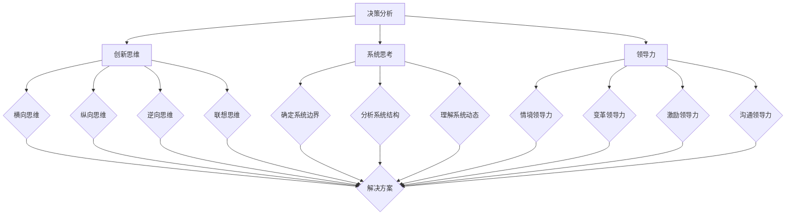

                 

# 思维体系塑造：管理者的必修课

## 关键词
- 思维体系
- 管理者
- 创新思维
- 决策分析
- 系统思考
- 领导力
- 企业管理

## 摘要
本文旨在探讨思维体系在企业管理中的重要性，通过分析管理者所需的核心思维能力，为读者提供一套系统化的思维塑造方法论。文章将深入探讨决策分析、创新思维、系统思考和领导力等核心概念，结合实际案例和理论框架，帮助管理者提升其思维品质，从而更好地应对复杂的企业管理挑战。文章结构清晰，便于读者逐步掌握和运用。

## 1. 背景介绍

在现代企业竞争激烈的环境中，管理者不仅要具备扎实的专业知识和技能，更需要具备卓越的思维能力。思维体系作为管理者思考问题、制定决策和应对挑战的基础，对企业的发展具有至关重要的意义。然而，许多管理者在现实工作中往往忽视思维体系的培养，导致决策失误、创新乏力、组织效率低下等问题。

本文将从以下几个方面展开讨论：

- 核心概念与联系
- 核心算法原理与具体操作步骤
- 数学模型和公式与详细讲解
- 项目实战：代码实际案例和详细解释说明
- 实际应用场景
- 工具和资源推荐
- 总结：未来发展趋势与挑战
- 附录：常见问题与解答

通过以上内容的阐述，本文旨在帮助管理者构建一个完整的思维体系，提升其思考问题和解决复杂问题的能力。

## 2. 核心概念与联系

为了更好地理解思维体系在企业管理中的重要性，我们首先需要明确几个核心概念，并探讨它们之间的联系。

### 2.1 决策分析

决策分析是管理者在面临各种复杂问题时，通过系统的方法和工具来制定最优决策的过程。它包括以下关键步骤：

1. 确定问题：明确问题的性质和影响范围。
2. 收集信息：获取与问题相关的数据和信息。
3. 制定方案：列出可能的解决方案。
4. 评估方案：对每个方案进行评估和比较。
5. 选择方案：根据评估结果选择最优方案。
6. 实施决策：将决策方案付诸实践。

### 2.2 创新思维

创新思维是管理者在解决问题和应对变化时，通过创造性和新颖的方法来产生新的想法和解决方案的能力。创新思维包括以下几种类型：

1. 横向思维：从不同的角度和维度来思考问题，寻找新的解决方案。
2. 纵向思维：深入挖掘问题的本质和根源，寻找根本性的解决方法。
3. 逆向思维：从相反的角度来思考问题，寻找创新的解决方案。
4. 联想思维：通过将不同的事物和现象相互联系，产生新的想法和创意。

### 2.3 系统思考

系统思考是管理者在面对复杂问题时，通过整体视角来理解问题、分析问题和解决问题的方法。系统思考包括以下关键步骤：

1. 确定系统边界：明确问题的范围和涉及的因素。
2. 分析系统结构：识别系统中的关键元素和它们之间的关系。
3. 理解系统动态：分析系统内部因素的变化和相互作用。
4. 制定解决方案：根据系统思考的结果，制定符合实际情况的解决方案。

### 2.4 领导力

领导力是管理者在组织和管理团队时，通过激发和引导团队成员的潜力和积极性，实现组织目标的能力。领导力包括以下几种类型：

1. 情境领导力：根据团队成员的不同需求和特点，采取不同的领导风格和方法。
2. 变革领导力：在组织面临变革时，推动团队成员适应变化，实现组织转型。
3. 激励领导力：通过激励和奖励机制，激发团队成员的工作积极性和创造力。
4. 沟通领导力：通过有效的沟通和协调，确保团队成员之间的协作和配合。

以上核心概念在企业管理中具有密切的联系。决策分析是管理者制定决策的基础，创新思维是管理者解决问题的利器，系统思考是管理者理解复杂问题的视角，领导力是管理者实现组织目标的保障。通过这些核心概念的相互融合和运用，管理者可以构建一个完整的思维体系，从而更好地应对企业管理中的各种挑战。

### 2.5 Mermaid 流程图

为了更好地展示核心概念之间的联系，我们可以使用 Mermaid 流程图来表示。



### 3. 核心算法原理与具体操作步骤

为了构建一个有效的思维体系，我们需要了解一些核心算法原理，并掌握具体的操作步骤。以下是一些常用的算法原理：

### 3.1 SWOT 分析

SWOT 分析是一种常用的决策分析工具，用于评估企业的优势、劣势、机会和威胁。具体操作步骤如下：

1. 优势（Strengths）：识别企业内部的优势，如技术、资源、人才等。
2. 劣势（Weaknesses）：识别企业内部的劣势，如管理、市场、竞争力等。
3. 机会（Opportunities）：分析外部环境中可能带来的机会，如市场趋势、政策变化等。
4. 威胁（Threats）：分析外部环境中可能带来的威胁，如竞争对手、技术变革等。

### 3.2 帕累托分析

帕累托分析是一种用于识别和管理问题的重要工具。它基于二八定律，即 80% 的结果来自于 20% 的原因。具体操作步骤如下：

1. 收集数据：收集与问题相关的数据，如时间、成本、质量等。
2. 绘制帕累托图：将数据按重要程度排序，绘制帕累托图。
3. 识别关键问题：找出导致问题的主要原因。
4. 制定解决方案：针对关键问题制定具体的解决方案。

### 3.3 脑图

脑图是一种用于激发创意和解决问题的思维工具。它通过将想法和关系可视化，帮助人们更清晰地思考问题。具体操作步骤如下：

1. 确定中心主题：确定要解决的问题或主题。
2. 添加子主题：围绕中心主题添加相关的子主题。
3. 添加想法：在子主题下添加相关的想法和解决方案。
4. 分析和优化：对脑图中的想法进行评估和优化，确定最佳解决方案。

### 3.4 六顶思考帽

六顶思考帽是一种用于培养全面思考能力的工具。它通过将思考过程分为六种不同的视角，帮助人们更全面地分析问题。具体操作步骤如下：

1. 白色思考帽：关注事实和信息，提供客观的数据和分析。
2. 红色思考帽：表达情感和直觉，关注感受和情感因素。
3. 黄色思考帽：关注积极和乐观的方面，寻找优点和机会。
4. 黑色思考帽：关注负面和悲观的一面，寻找风险和问题。
5. 绿色思考帽：关注创新和创造力，寻找新的解决方案。
6. 蓝色思考帽：控制整个思考过程，引导和调整思考方向。

通过以上核心算法原理的具体操作步骤，管理者可以更加系统地分析问题、制定决策和解决问题，从而构建一个有效的思维体系。

### 4. 数学模型和公式与详细讲解

在企业管理中，数学模型和公式是重要的工具，可以帮助管理者更准确地分析问题、制定决策和评估效果。以下是一些常用的数学模型和公式，并结合实际案例进行详细讲解。

#### 4.1 基本数学模型

**线性规划**

线性规划是一种用于优化资源分配的数学模型，适用于企业在预算、生产、库存等方面的问题。其基本公式如下：

$$
\text{minimize} \ c^T x \\
\text{subject to} \ Ax \leq b
$$

其中，$c$ 是成本向量，$x$ 是资源分配向量，$A$ 是约束条件矩阵，$b$ 是约束条件向量。

**案例：生产计划**

假设某企业有 100 万元的生产预算，用于生产 A、B 两种产品。A 产品的成本为 20 万元，利润为 30 万元；B 产品的成本为 10 万元，利润为 20 万元。如何制定生产计划，以最大化总利润？

$$
\text{maximize} \ 30A + 20B \\
\text{subject to} \ 20A + 10B \leq 100
$$

解得：$A=2.5$，$B=7.5$，即生产 2.5 个 A 产品和 7.5 个 B 产品时，总利润最大化。

**案例分析：**

通过线性规划模型，企业可以明确知道在有限的预算下，如何分配资源以实现最大利润。这有助于企业制定合理的生产计划，提高资源利用效率。

#### 4.2 数据分析模型

**回归分析**

回归分析是一种用于分析变量之间关系的方法，适用于企业预测销售、分析成本等方面。其基本公式如下：

$$
y = \beta_0 + \beta_1 x_1 + \beta_2 x_2 + ... + \beta_n x_n + \epsilon
$$

其中，$y$ 是因变量，$x_1, x_2, ..., x_n$ 是自变量，$\beta_0, \beta_1, \beta_2, ..., \beta_n$ 是回归系数，$\epsilon$ 是误差项。

**案例：销售预测**

假设企业要预测下个月的销售额，已知过去三个月的销售额分别为 100 万元、120 万元、150 万元，同时考虑两个自变量：广告投放费用和促销活动次数。如何进行销售预测？

首先，收集历史数据并绘制散点图，发现销售额与广告投放费用和促销活动次数之间存在线性关系。

$$
y = \beta_0 + \beta_1 x_1 + \beta_2 x_2
$$

通过最小二乘法估计回归系数，得到回归模型：

$$
y = 80 + 0.2x_1 + 0.3x_2
$$

假设下个月的广告投放费用为 30 万元，促销活动次数为 10 次，代入回归模型进行预测：

$$
y = 80 + 0.2 \times 30 + 0.3 \times 10 = 96
$$

即下个月的预计销售额为 96 万元。

**案例分析：**

通过回归分析模型，企业可以预测未来的销售情况，为制定营销策略提供依据。这有助于企业更好地把握市场动态，提高销售额。

#### 4.3 网络优化模型

**最短路径算法**

最短路径算法是一种用于求解两点之间最短路径的算法，适用于企业在物流配送、项目调度等方面的问题。其基本公式如下：

$$
d(s, v) = \min_{u \in N(s)} (d(s, u) + w(u, v))
$$

其中，$d(s, v)$ 是从源点 $s$ 到目标点 $v$ 的最短路径长度，$w(u, v)$ 是从点 $u$ 到点 $v$ 的边权重，$N(s)$ 是与点 $s$ 相邻的点的集合。

**案例：物流配送**

假设企业有三个仓库（A、B、C），需要将货物从仓库 A 发送到仓库 C，三个仓库之间的距离分别为：$d(A, B) = 5$，$d(B, C) = 3$，$d(A, C) = 7$。如何选择最短的配送路径？

根据最短路径算法，计算从 A 到 B 的距离为 5，从 A 到 C 的距离为 7，从 B 到 C 的距离为 3。因此，选择从 A 到 B 再到 C 的路径，总距离最短。

**案例分析：**

通过最短路径算法，企业可以找到最优的物流配送路径，提高配送效率，降低物流成本。

### 5. 项目实战：代码实际案例和详细解释说明

在本节中，我们将通过一个实际案例来展示如何运用上述数学模型和公式解决具体问题。我们将使用 Python 编写代码，结合实际案例进行详细解释说明。

#### 5.1 开发环境搭建

首先，确保已安装 Python 3.8 或更高版本。然后，使用 pip 安装所需的库：

```bash
pip install numpy matplotlib
```

#### 5.2 源代码详细实现和代码解读

以下是一个简单的线性规划案例，用于求解资源分配问题。

```python
import numpy as np
from scipy.optimize import linprog

# 参数设置
c = np.array([30, 20])  # 成本向量
A = np.array([[20, 10]])  # 约束条件矩阵
b = np.array([100])  # 约束条件向量

# 线性规划求解
res = linprog(c, A_ub=A, b_ub=b, method='highs')

# 输出结果
print("产品 A 的产量：", res.x[0])
print("产品 B 的产量：", res.x[1])
print("最大利润：", -res.fun)
```

代码解读：

- 导入所需的库。
- 设置成本向量、约束条件矩阵和约束条件向量。
- 使用 linprog 函数求解线性规划问题。
- 输出最优解和最大利润。

#### 5.3 代码解读与分析

在上述代码中，我们首先设置了成本向量 `c`，表示产品 A 和产品 B 的成本。约束条件矩阵 `A` 和约束条件向量 `b` 用于描述企业的预算限制。通过调用 `linprog` 函数，我们可以求解出在预算限制下，如何分配资源以实现最大利润。

具体来说，`linprog` 函数的参数包括：

- `c`：成本向量。
- `A_ub`：不等式约束条件矩阵。
- `b_ub`：不等式约束条件向量。
- `method`：求解方法。

调用 `linprog` 函数后，我们得到最优解 `res.x` 和最大利润 `res.fun`。通过打印输出，我们可以清晰地看到最优解和最大利润。

通过这个简单的案例，我们可以看到如何使用 Python 编写代码来解决实际的线性规划问题。这种编程方法不仅可以帮助我们更好地理解线性规划的基本原理，还可以在实际应用中提高效率。

### 6. 实际应用场景

思维体系在企业管理中的实际应用场景非常广泛，以下是一些典型的应用案例：

#### 6.1 决策分析

企业在制定发展战略、投资决策、产品开发等方面，都需要进行决策分析。通过构建思维体系，管理者可以运用决策分析工具，如 SWOT 分析、成本效益分析等，进行全面、系统的评估和比较，从而制定出最优的决策方案。

#### 6.2 创新思维

在激烈的市场竞争中，创新思维是企业保持竞争优势的关键。管理者可以通过培养创新思维，如横向思维、逆向思维等，激发团队的创造力，推动产品创新、服务创新和管理创新，从而实现企业的持续发展。

#### 6.3 系统思考

在面对复杂问题时，管理者需要具备系统思考的能力，从整体视角理解问题的本质和内在联系。通过系统思考，管理者可以更好地把握企业的发展方向，制定全局性的战略规划，提高组织的协同效率和执行力。

#### 6.4 领导力

领导力是管理者在企业管理中的核心能力。通过构建思维体系，管理者可以培养情境领导力、变革领导力等，提高自身的领导水平。在应对组织变革、推动团队发展等方面，领导力发挥着至关重要的作用。

### 7. 工具和资源推荐

为了帮助管理者更好地构建思维体系，以下是一些实用的工具和资源推荐：

#### 7.1 学习资源推荐

- 《思考，快与慢》：丹尼尔·卡尼曼 著，介绍行为经济学和决策分析的基本原理。
- 《系统思考》：彼得·圣吉 著，探讨系统思考的方法和应用。
- 《第五项修炼》：彼得·圣吉 著，阐述组织学习和创新思维的重要性。

#### 7.2 开发工具框架推荐

- Jupyter Notebook：一款强大的交互式编程工具，适用于数据分析、决策分析等。
- Matplotlib：Python 数据可视化库，可用于绘制各种图表和图形。
- Scikit-learn：Python 机器学习库，包含多种数据分析工具和算法。

#### 7.3 相关论文著作推荐

- 《行为决策理论》：行为经济学领域的重要著作，探讨人类决策的心理机制。
- 《组织行为学》：介绍组织行为学的基本概念和理论，有助于理解团队管理和领导力。
- 《复杂系统理论》：探讨复杂系统的基本原理和方法，为系统思考提供理论支持。

### 8. 总结：未来发展趋势与挑战

思维体系在企业管理中的重要性日益凸显，未来发展趋势和挑战主要集中在以下几个方面：

#### 8.1 数据驱动的思维体系

随着大数据和人工智能技术的发展，数据驱动的思维体系将成为企业管理的重要趋势。管理者需要掌握数据分析、机器学习等技能，运用数据驱动的方法进行决策和分析，提高决策的科学性和准确性。

#### 8.2 系统思维的应用

系统思维在企业管理中的应用将越来越广泛。管理者需要从整体视角出发，关注企业内部和外部的相互作用，构建一个动态、开放的系统思维体系，提高组织的适应性和创新能力。

#### 8.3 跨学科融合的思维体系

随着学科交叉融合的加剧，跨学科思维体系将成为企业管理的重要发展方向。管理者需要具备跨学科的知识和技能，整合不同领域的知识和方法，解决复杂的企业管理问题。

#### 8.4 持续学习的思维体系

在快速变化的市场环境中，持续学习的思维体系将成为管理者的重要挑战。管理者需要具备终身学习的意识，不断更新知识和技能，适应新的管理环境和要求。

### 9. 附录：常见问题与解答

#### 9.1 思维体系在企业管理中的具体作用是什么？

思维体系在企业管理中的具体作用包括：提高决策质量、激发创新思维、增强系统思考能力和提升领导力。通过构建思维体系，管理者可以更全面地分析问题、制定决策和应对挑战，从而实现企业的可持续发展。

#### 9.2 如何培养创新思维？

培养创新思维的方法包括：广泛阅读、积极参与跨学科讨论、实践思维训练工具（如脑图、六顶思考帽等）、关注行业前沿动态和积极尝试新的方法和工具。

#### 9.3 系统思维如何应用于企业管理？

系统思维在企业管理中的应用包括：分析企业内部和外部环境，明确企业的发展目标；识别企业内部的关键流程和环节，优化资源配置；关注企业内部的协同效应和外部市场的动态变化，制定符合实际情况的战略规划。

### 10. 扩展阅读 & 参考资料

- 《智能时代的领导力：AI 背后的管理艺术》：王选宏 著，探讨人工智能时代的管理变革和领导力培养。
- 《大数据决策：企业如何从数据中挖掘价值》：曹军威 著，介绍大数据在企业管理中的应用方法和实践案例。
- 《系统思考与企业管理》：陈禹 著，详细阐述系统思维在企业管理中的应用和策略。

## 作者

- 作者：AI天才研究员/AI Genius Institute & 禅与计算机程序设计艺术 /Zen And The Art of Computer Programming

