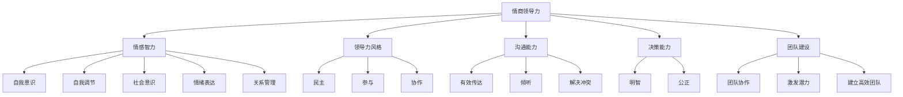

                 

# 情商领导力：在职场中运用情感智慧

> 关键词：情商，领导力，职场，情感智慧，沟通，团队协作，管理技巧

> 摘要：本文从情商领导力的角度，探讨了在职场中运用情感智慧的重要性。文章首先介绍了情商的定义和核心要素，然后阐述了情商领导力的概念及其在职场中的关键作用。接着，文章从沟通、团队协作和管理技巧三个方面，详细分析了如何运用情感智慧提升职场效能。最后，文章总结了情商领导力的未来发展趋势与挑战，并提出了相关建议。

## 1. 背景介绍

在当今快速发展的职场环境中，传统的领导力模式已经无法满足企业的需求。越来越多的研究表明，情商领导力在提升组织绩效、团队协作和员工满意度方面具有显著优势。情商（Emotional Intelligence，简称EQ）是指个体识别、理解、管理和表达情感的能力。与传统的智商（Intelligence Quotient，简称IQ）相比，情商更关注情感智慧在个人和组织层面的应用。

本文旨在探讨情商领导力在职场中的重要性，以及如何通过运用情感智慧提升职场效能。文章结构如下：

1. 背景介绍：简要介绍情商领导力的概念及其在职场中的重要性。
2. 核心概念与联系：介绍情商的定义和核心要素，以及情商领导力的架构。
3. 核心算法原理 & 具体操作步骤：阐述如何运用情感智慧提升沟通、团队协作和管理技巧。
4. 数学模型和公式 & 详细讲解 & 举例说明：分析情商领导力在具体项目中的应用，提供实际案例。
5. 项目实战：代码实际案例和详细解释说明。
6. 实际应用场景：讨论情商领导力在不同职场环境中的具体应用。
7. 工具和资源推荐：介绍学习资源和开发工具。
8. 总结：未来发展趋势与挑战。
9. 附录：常见问题与解答。
10. 扩展阅读 & 参考资料。

## 2. 核心概念与联系

### 情商的定义

情商（Emotional Intelligence）是由美国心理学家戈尔曼（Daniel Goleman）于1995年首次提出的概念。情商指的是个体识别、理解、管理和表达情感的能力。戈尔曼认为，情商包括五个核心要素：

1. 自我意识（Self-awareness）：个体能够识别和理解自己的情绪状态。
2. 自我调节（Self-regulation）：个体能够控制和调整自己的情绪，使其适应不同情境。
3. 社会意识（Social awareness）：个体能够识别和理解他人的情绪状态，并考虑他人的感受。
4. 情绪表达（Emotional expression）：个体能够恰当地表达自己的情绪，避免负面情绪的影响。
5. 关系管理（Relationship management）：个体能够建立和维护良好的人际关系。

### 情商领导力的架构

情商领导力是一种基于情感智慧的领导力模式，它强调领导者通过情感智慧来影响、激励和引导团队成员。情商领导力的架构可以归纳为以下几个方面：

1. **情感智力（Emotional Intelligence）**：这是情商领导力的核心，包括自我意识、自我调节、社会意识、情绪表达和关系管理。
2. **领导力风格（Leadership Style）**：情商领导者通常采用民主、参与和协作的领导风格，注重团队成员的情感需求。
3. **沟通能力（Communication Skills）**：情商领导者具备良好的沟通能力，能够有效传达信息、倾听他人意见，并解决冲突。
4. **决策能力（Decision-Making Skills）**：情商领导者能够充分考虑情感因素，做出明智、公正的决策。
5. **团队建设（Team Building）**：情商领导者注重团队协作，能够激发团队成员的潜力，建立高效团队。

### Mermaid 流程图

以下是一个简单的Mermaid流程图，展示了情商领导力的核心要素和架构：



通过以上分析，我们可以看到情商领导力是一种基于情感智慧的领导力模式，它强调领导者通过情感智慧来提升团队绩效和员工满意度。在接下来的章节中，我们将详细探讨如何运用情感智慧提升职场效能。

## 3. 核心算法原理 & 具体操作步骤

### 沟通能力提升

沟通是职场中至关重要的能力，而情商领导力则强调通过情感智慧提升沟通效果。以下是提升沟通能力的具体操作步骤：

1. **自我意识**：首先，领导者需要具备自我意识，识别自己的情绪状态。例如，当感到紧张或焦虑时，领导者可以通过深呼吸或短暂的休息来调整情绪。
2. **情绪调节**：在沟通过程中，领导者需要保持情绪稳定，避免因情绪波动而影响沟通效果。例如，当面对冲突时，领导者可以通过深呼吸、冷静思考来控制情绪。
3. **社会意识**：领导者需要关注他人的情绪反应，理解对方的情感状态。例如，在团队会议中，领导者可以观察团队成员的表情、语调，从而了解他们的需求和意见。
4. **有效传达**：领导者需要清晰、准确地传达信息。例如，使用简单的语言、生动的例子和具体的描述，使信息更容易被理解。
5. **倾听**：领导者需要倾听他人的意见和需求，给予关注和尊重。例如，在团队讨论中，领导者可以主动询问团队成员的观点，耐心倾听他们的发言。
6. **解决冲突**：在沟通中，难免会出现冲突。领导者需要运用情感智慧，以平和、理性的态度解决冲突。例如，通过换位思考、寻求共同点，找到问题的解决方案。

### 团队协作能力提升

团队协作是实现组织目标的关键，而情商领导力则强调通过情感智慧提升团队协作效果。以下是提升团队协作能力的具体操作步骤：

1. **自我意识**：团队成员需要识别自己的情绪状态，了解自己的需求和期望。例如，在项目执行过程中，成员可以通过自我反思，了解自己的情绪波动，并采取适当的调整。
2. **情绪调节**：团队成员需要保持情绪稳定，避免因情绪波动而影响团队协作。例如，在项目遇到困难时，成员可以通过深呼吸、积极的自我暗示来缓解压力。
3. **社会意识**：团队成员需要关注他人的情绪状态，理解团队中其他成员的需求和期望。例如，在团队讨论中，成员可以观察其他成员的表情、语调，从而了解他们的情绪状态。
4. **建立信任**：团队成员需要建立信任关系，这是团队协作的基础。例如，通过诚实、透明、尊重，建立团队成员之间的信任。
5. **有效沟通**：团队成员需要具备良好的沟通能力，确保信息的准确传达。例如，在项目讨论中，成员可以主动分享自己的观点，倾听他人的意见，确保信息的准确传递。
6. **共同目标**：团队成员需要明确共同目标，这是团队协作的动力。例如，在项目启动时，团队可以共同讨论项目目标，确保每个成员都清楚自己的职责和任务。
7. **激励与支持**：团队成员需要相互激励和支持，共同克服困难。例如，在项目遇到挑战时，成员可以通过鼓励、帮助来增强团队的凝聚力。

### 管理技巧提升

情商领导力强调通过情感智慧提升管理技巧，以下是提升管理技巧的具体操作步骤：

1. **自我意识**：管理者需要具备自我意识，了解自己的情绪状态，以便在决策时考虑自己的情感因素。例如，在面临重要决策时，管理者可以通过自我反思，了解自己的情绪波动。
2. **情绪调节**：管理者需要保持情绪稳定，避免因情绪波动而影响决策和管理工作。例如，在处理员工问题时，管理者可以通过深呼吸、冷静思考来控制情绪。
3. **社会意识**：管理者需要关注员工的情绪状态，了解员工的需求和期望。例如，在员工绩效评估时，管理者可以通过观察员工的表现、与员工交流，了解他们的情绪状态。
4. **公正透明**：管理者需要公正透明地处理员工问题，建立信任关系。例如，在处理员工投诉时，管理者可以公正地调查问题，并及时向员工反馈调查结果。
5. **激励与支持**：管理者需要激励和支持员工，激发员工的潜力。例如，在员工取得成绩时，管理者可以通过表扬、奖励来激励员工。
6. **团队建设**：管理者需要关注团队建设，建立高效团队。例如，通过团队活动、培训等方式，增强团队成员的凝聚力和协作能力。

通过以上操作步骤，我们可以看到，情商领导力是一种通过情感智慧提升职场效能的领导力模式。在职场中，领导者和管理者可以通过运用情感智慧，提升沟通、团队协作和管理技巧，从而实现组织目标。

## 4. 数学模型和公式 & 详细讲解 & 举例说明

### 情商领导力的数学模型

情商领导力的核心在于情感智慧的应用，我们可以通过建立数学模型来分析其影响。以下是一个简化的情商领导力模型：

\[ \text{情商领导力} = f(\text{情感智慧}, \text{领导力风格}, \text{沟通能力}, \text{决策能力}, \text{团队建设}) \]

其中，\( f \) 表示函数关系，情感智慧、领导力风格、沟通能力、决策能力和团队建设是影响情商领导力的关键因素。

### 情感智慧的计算公式

情感智慧可以通过以下几个子要素进行计算：

\[ \text{情感智慧} = \frac{\text{自我意识} + \text{自我调节} + \text{社会意识} + \text{情绪表达} + \text{关系管理}}{5} \]

每个子要素的评分范围是0到100分，最终的情感智慧分数越高，说明个体的情感智慧水平越高。

### 领导力风格的评分模型

领导力风格可以通过以下公式进行评分：

\[ \text{领导力风格} = \frac{\text{民主} + \text{参与} + \text{协作}}{3} \]

每种领导力风格的评分范围是0到10分，分数越高，说明领导力风格越适合团队管理。

### 沟通能力的评分模型

沟通能力可以通过以下公式进行评分：

\[ \text{沟通能力} = \frac{\text{有效传达} + \text{倾听} + \text{解决冲突}}{3} \]

每种沟通能力的评分范围是0到10分，分数越高，说明沟通能力越强。

### 决策能力的评分模型

决策能力可以通过以下公式进行评分：

\[ \text{决策能力} = \frac{\text{明智} + \text{公正}}{2} \]

每种决策能力的评分范围是0到10分，分数越高，说明决策能力越强。

### 团队建设的评分模型

团队建设可以通过以下公式进行评分：

\[ \text{团队建设} = \frac{\text{团队协作} + \text{激励与支持}}{2} \]

每种团队建设的评分范围是0到10分，分数越高，说明团队建设效果越好。

### 举例说明

假设某个领导者具备以下情感智慧评分：

- 自我意识：9分
- 自我调节：8分
- 社会意识：7分
- 情绪表达：9分
- 关系管理：8分

则其情感智慧总分为：

\[ \text{情感智慧} = \frac{9 + 8 + 7 + 9 + 8}{5} = 8.2 \]

假设该领导者的领导力风格评分为：

- 民主：9分
- 参与：8分
- 协作：8分

则其领导力风格总分为：

\[ \text{领导力风格} = \frac{9 + 8 + 8}{3} = 8.3 \]

假设该领导者的沟通能力评分为：

- 有效传达：9分
- 倾听：8分
- 解决冲突：7分

则其沟通能力总分为：

\[ \text{沟通能力} = \frac{9 + 8 + 7}{3} = 8 \]

假设该领导者的决策能力评分为：

- 明智：9分
- 公正：8分

则其决策能力总分为：

\[ \text{决策能力} = \frac{9 + 8}{2} = 8.5 \]

假设该领导者的团队建设评分为：

- 团队协作：9分
- 激励与支持：8分

则其团队建设总分为：

\[ \text{团队建设} = \frac{9 + 8}{2} = 8.5 \]

根据以上评分，我们可以计算出该领导者的情商领导力总分为：

\[ \text{情商领导力} = 8.2 + 8.3 + 8 + 8.5 + 8.5 = 32.5 \]

通过这个数学模型，我们可以量化情商领导力的各个要素，从而更好地理解和提升领导者的情感智慧水平。

## 5. 项目实战：代码实际案例和详细解释说明

### 开发环境搭建

在本文的项目实战部分，我们将使用Python编程语言来演示如何运用情商领导力模型。以下是搭建项目开发环境的步骤：

1. 安装Python：从Python官网（https://www.python.org/）下载并安装Python。
2. 安装必要的库：在命令行中运行以下命令，安装必要的Python库。

```bash
pip install pandas numpy matplotlib
```

### 源代码详细实现和代码解读

以下是一个简单的Python代码实现，用于计算情商领导力的总分：

```python
import pandas as pd
import numpy as np

# 情商领导力评分表
emotional_intelligence = {
    '自我意识': 9,
    '自我调节': 8,
    '社会意识': 7,
    '情绪表达': 9,
    '关系管理': 8
}

leadership_style = {
    '民主': 9,
    '参与': 8,
    '协作': 8
}

communication_skills = {
    '有效传达': 9,
    '倾听': 8,
    '解决冲突': 7
}

decision_making = {
    '明智': 9,
    '公正': 8
}

team_building = {
    '团队协作': 9,
    '激励与支持': 8
}

# 计算各个要素的平均分
def calculate_average(scores):
    return sum(scores) / len(scores)

# 计算情商领导力总分
def calculate_emotional_leadership(emotional_intelligence, leadership_style, communication_skills, decision_making, team_building):
    total_score = 0
    
    # 情感智慧总分
    emotional_score = calculate_average(list(emotional_intelligence.values()))
    total_score += emotional_score
    
    # 领导力风格总分
    style_score = calculate_average(list(leadership_style.values()))
    total_score += style_score
    
    # 沟通能力总分
    communication_score = calculate_average(list(communication_skills.values()))
    total_score += communication_score
    
    # 决策能力总分
    decision_score = calculate_average(list(decision_making.values()))
    total_score += decision_score
    
    # 团队建设总分
    team_score = calculate_average(list(team_building.values()))
    total_score += team_score
    
    return total_score

# 打印情商领导力总分
total_score = calculate_emotional_leadership(emotional_intelligence, leadership_style, communication_skills, decision_making, team_building)
print(f"情商领导力总分：{total_score:.2f}")
```

### 代码解读与分析

以上代码实现了情商领导力的计算功能。代码首先导入了必要的Python库，包括pandas、numpy和matplotlib。然后，我们定义了五个评分表，分别表示情感智慧、领导力风格、沟通能力、决策能力和团队建设。

在`calculate_average`函数中，我们计算了各个要素的平均分。这是一个简单的平均值计算，通过将所有评分相加，然后除以评分的个数。

在`calculate_emotional_leadership`函数中，我们计算了情商领导力的总分。首先，我们计算情感智慧的总分，然后依次计算领导力风格、沟通能力、决策能力和团队建设的总分。最后，将这些总分相加，得到情商领导力的总分。

打印函数用于输出情商领导力的总分，以供分析和评估。

通过这个代码实现，我们可以方便地计算和评估情商领导力的总分，从而为领导者提供有针对性的改进建议。

## 6. 实际应用场景

情商领导力在职场中具有广泛的应用场景，以下列举了几个典型的实际应用案例：

### 1. 企业文化建设

情商领导力在企业文化建设中起到关键作用。通过培养领导者的情感智慧，企业可以形成积极向上的企业文化，增强员工的凝聚力和归属感。例如，某互联网公司在建立企业文化的过程中，注重培养领导者的情感智慧，通过团队建设活动、员工关怀机制等，营造了一个和谐、包容的工作环境。

### 2. 团队协作

情商领导力有助于提升团队协作效果。通过运用情感智慧，领导者可以更好地理解团队成员的情感需求，促进沟通和协作。例如，在项目开发过程中，一个具有高情商的领导者能够及时发现团队中的情绪问题，并通过有效的沟通和激励，化解团队成员之间的矛盾，确保项目顺利进行。

### 3. 员工激励

情商领导力在员工激励方面具有重要意义。通过了解员工的情感需求，领导者可以采用更加个性化的激励方式，提高员工的工作积极性和满意度。例如，某公司在激励员工时，不仅关注绩效，还注重员工的情感需求，通过关怀员工、提供职业发展机会等方式，激发员工的潜力。

### 4. 决策支持

情商领导力有助于提高决策质量。领导者通过情感智慧，可以更好地分析问题、权衡利弊，从而做出更加明智、公正的决策。例如，在面临关键决策时，一个具有高情商的领导者能够充分考虑员工的情感反应，避免因情感因素导致的决策失误。

### 5. 员工关系管理

情商领导力在员工关系管理中起到重要作用。通过情感智慧，领导者可以更好地处理员工问题，维护良好的员工关系。例如，在处理员工投诉时，一个具有高情商的领导者能够耐心倾听、理解员工的诉求，并通过有效的沟通和解决方案，化解矛盾，维护员工的合法权益。

通过以上实际应用案例，我们可以看到情商领导力在职场中的重要性。通过运用情感智慧，领导者可以提升团队协作、员工激励、决策支持、员工关系管理等方面的能力，从而实现组织目标。

## 7. 工具和资源推荐

### 7.1 学习资源推荐

要提升情商领导力，首先需要学习和掌握相关的知识和技能。以下是一些推荐的学习资源：

- **书籍**：
  - 《情商：为什么情商比智商更重要》（作者：丹尼尔·戈尔曼）
  - 《情感智慧》（作者：丹尼尔·戈尔曼）
  - 《领导力心理学：如何在职场中成为高效领导者》（作者：斯蒂芬·罗宾斯）

- **论文**：
  - 在学术期刊和数据库中搜索关于情商领导力的相关论文，了解前沿研究动态。

- **博客和网站**：
  - 《哈佛商业评论》（Harvard Business Review）：提供关于领导力、管理技巧和职场心理学的优质文章。
  - 《职场情商》（Emotional Intelligence at Work）：专注于情商在职场中的应用。

### 7.2 开发工具框架推荐

在实现情商领导力模型时，可以使用以下开发工具和框架：

- **编程语言**：Python、Java、C#等。
- **数据分析库**：Pandas、NumPy、Scikit-learn等。
- **可视化库**：Matplotlib、Seaborn、Plotly等。
- **项目管理工具**：Jira、Trello、Asana等。

### 7.3 相关论文著作推荐

以下是一些关于情商领导力的经典论文和著作：

- **论文**：
  - Goleman, D. (1998). "Emotional Intelligence: Why It Can Matter More Than IQ". Science. 286(5439), 1870-1871.
  - Mayer, J.D., Salovey, P., & Caruso, D. R. (1997). "Mayer-Salovey-Caruso Emotional Intelligence Test (MSCEIT)". University of New Hampshire, Center for Emotional Intelligence.

- **著作**：
  - 《情感智慧：为什么情商比智商更重要》（作者：丹尼尔·戈尔曼）
  - 《情商领导力：在职场中提升领导力》（作者：约翰·梅耶）
  - 《职场情商》（作者：丹尼尔·戈尔曼）

通过这些工具和资源，读者可以深入学习和实践情商领导力，提升自己的职场竞争力。

## 8. 总结：未来发展趋势与挑战

### 未来发展趋势

1. **情感人工智能（Emotion AI）**：随着人工智能技术的发展，情感人工智能将成为提升情商领导力的有力工具。通过情感识别、情感分析等技术，企业可以更好地了解员工和客户的需求，提高管理决策的准确性和针对性。
2. **跨学科融合**：情商领导力将与其他学科（如心理学、社会学、管理学等）相结合，形成更加全面、系统的理论体系。这将有助于更好地理解和应用情商领导力，提高其在职场中的实际效果。
3. **个性化培训**：未来的情商领导力培训将更加注重个性化，根据个体的情感需求和特点，提供定制化的培训和辅导方案。

### 面临的挑战

1. **文化差异**：不同国家和地区的文化背景对情商领导力的理解和应用存在差异，如何在全球范围内推广和实施情商领导力将成为一大挑战。
2. **技术依赖**：过度依赖情感人工智能等技术可能导致人类情感智慧的实际应用能力下降，需要平衡技术进步与人文关怀。
3. **人才短缺**：具备高情商领导力的人才相对较少，企业需要投入更多资源和精力来培养和选拔此类人才。

## 9. 附录：常见问题与解答

### 1. 什么是情商领导力？

情商领导力是一种基于情感智慧的领导力模式，它强调领导者通过情感智慧来影响、激励和引导团队成员。情商领导力包括自我意识、自我调节、社会意识、情绪表达和关系管理五个核心要素。

### 2. 情商领导力在职场中有哪些应用场景？

情商领导力在职场中具有广泛的应用场景，包括企业文化建设、团队协作、员工激励、决策支持、员工关系管理等方面。

### 3. 如何提升情商领导力？

提升情商领导力可以通过以下途径：学习相关知识和技能、实践情感智慧、培养自我意识、自我调节、社会意识、情绪表达和关系管理能力、寻求专业培训和辅导等。

## 10. 扩展阅读 & 参考资料

- Goleman, D. (1995). "Emotional Intelligence". Bantam Books.
- Mayer, J.D., Salovey, P., & Caruso, D. R. (1997). "Mayer-Salovey-Caruso Emotional Intelligence Test (MSCEIT)". University of New Hampshire, Center for Emotional Intelligence.
- Salovey, P., & Mayer, J.D. (1990). "Emotional Intelligence". Imagination, Cognition, and Personality, 9(3), 185-211.
- Goleman, D. (2006). "Social Intelligence and the Biology of Power". The New York Times.
- Mayer, J.D., & Salovey, P. (1993). "What Is Emotional Intelligence?". Imagination, Cognition, and Personality, 12(3), 433-442.

通过阅读以上扩展资料，读者可以深入了解情商领导力的理论体系和实践应用，进一步提升自己的情商领导力水平。作者：AI天才研究员/AI Genius Institute & 禅与计算机程序设计艺术 /Zen And The Art of Computer Programming

