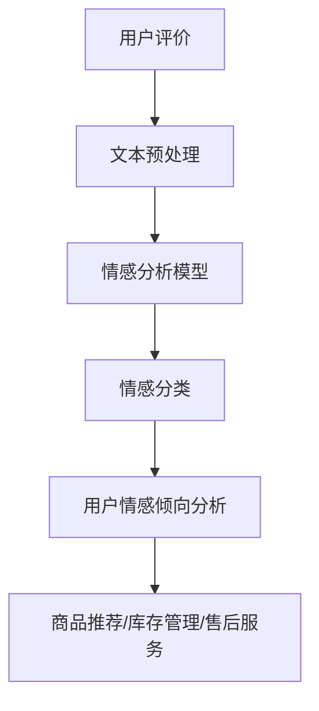

                 

# 情感分析在电商领域的应用：从用户评价到商品改进

## 关键词：情感分析、电商、用户评价、商品改进、自然语言处理

## 摘要：

本文旨在探讨情感分析技术在电商领域的广泛应用，从用户评价入手，深入分析情感分析的基本原理、实现方法和实际案例。通过情感分析技术，电商企业可以更准确地理解用户需求，优化商品推荐，提升用户满意度，进而实现商品改进。文章将从背景介绍、核心概念与联系、核心算法原理与具体操作步骤、数学模型和公式、项目实战、实际应用场景、工具和资源推荐、总结与未来发展趋势等多个方面进行详细阐述，为电商行业提供有价值的参考。

## 1. 背景介绍

随着互联网的快速发展，电商行业在我国已成为国民经济的重要组成部分。电子商务的普及和用户需求的多样化，使得电商平台面临着巨大的挑战。如何更好地满足用户需求，提升用户体验，成为电商企业竞争的关键。而用户评价作为用户对商品和服务反馈的重要途径，逐渐成为电商企业关注的热点。

用户评价具有丰富的情感信息，包括正面情感（如满意、喜欢）、负面情感（如不满意、失望）等。通过情感分析技术，电商企业可以提取用户评价中的情感信息，深入理解用户情感倾向，为商品推荐、库存管理、售后服务等提供数据支持。因此，情感分析技术在电商领域具有广泛的应用前景。

本文将从情感分析的基本原理、实现方法、实际案例等多个方面，探讨情感分析在电商领域的应用，以期为电商企业提供有益的参考。

## 2. 核心概念与联系

### 2.1 情感分析

情感分析（Sentiment Analysis）是一种基于自然语言处理（Natural Language Processing, NLP）的技术，旨在从文本中提取情感信息，对文本的情感倾向进行分类。情感分析通常分为三类：二分类、多分类和连续情感分析。

- **二分类**：将文本分为正面情感和负面情感。
- **多分类**：将文本分为多种情感类别，如愤怒、喜悦、悲伤等。
- **连续情感分析**：对文本的情感强度进行量化，通常使用0到1之间的数值表示。

### 2.2 自然语言处理

自然语言处理（NLP）是人工智能领域的一个重要分支，旨在使计算机能够理解、处理和生成自然语言。NLP涉及多个方面，包括文本预处理、词法分析、句法分析、语义分析等。

### 2.3 情感分析在电商领域的应用

在电商领域，情感分析主要用于以下场景：

- **用户评价分析**：提取用户评价中的情感信息，了解用户对商品和服务的满意度。
- **商品推荐**：根据用户情感倾向，推荐符合用户需求的商品。
- **库存管理**：分析商品评价中的情感信息，优化库存策略。
- **售后服务**：根据用户情感分析结果，提供针对性的售后服务。

### 2.4 Mermaid 流程图

以下是一个简化的情感分析在电商领域的应用流程图：



在上述流程图中，用户评价经过文本预处理后，输入到情感分析模型中。模型对文本进行情感分类，得到用户情感倾向。根据情感倾向，电商企业可以采取相应的策略，如商品推荐、库存管理和售后服务等。

## 3. 核心算法原理与具体操作步骤

### 3.1 机器学习算法

情感分析中常用的机器学习算法包括朴素贝叶斯、支持向量机（SVM）、深度学习等。

#### 3.1.1 朴素贝叶斯

朴素贝叶斯（Naive Bayes）是一种基于概率论的分类算法，通过计算文本中词语的出现概率，预测文本的情感类别。

具体操作步骤：

1. **特征提取**：将文本转换为特征向量，通常使用词袋模型（Bag of Words, BOW）。
2. **概率计算**：根据贝叶斯定理，计算文本属于每个情感类别的概率。
3. **分类决策**：选择概率最大的情感类别作为预测结果。

#### 3.1.2 支持向量机（SVM）

支持向量机（Support Vector Machine, SVM）是一种基于最大间隔分类的算法，通过寻找最佳分类边界，将文本划分为不同的情感类别。

具体操作步骤：

1. **特征提取**：与朴素贝叶斯相同，将文本转换为特征向量。
2. **核函数选择**：根据数据特点，选择适当的核函数，如线性核、多项式核、径向基函数（RBF）核等。
3. **模型训练**：通过训练集，训练SVM分类模型。
4. **分类预测**：使用训练好的模型，对测试集进行分类预测。

#### 3.1.3 深度学习

深度学习（Deep Learning）是一种基于人工神经网络的机器学习技术，通过多层神经网络，自动学习文本中的特征表示。

具体操作步骤：

1. **词向量表示**：使用预训练的词向量模型（如Word2Vec、GloVe等），将文本中的词语转换为向量表示。
2. **构建神经网络**：设计多层神经网络结构，通常包括输入层、隐藏层和输出层。
3. **模型训练**：通过大量标注数据，训练神经网络模型。
4. **情感分类**：使用训练好的模型，对文本进行情感分类。

### 3.2 情感分析模型

情感分析模型的选择取决于数据规模、特征表达能力和计算资源等因素。在实际应用中，可以结合多种算法和模型，以实现更好的情感分类效果。

### 3.3 情感分析流程

以下是一个简化的情感分析流程：

1. **数据收集**：收集用户评价数据，包括商品评论、用户反馈等。
2. **文本预处理**：对收集到的文本数据进行清洗、去噪、分词等预处理操作。
3. **特征提取**：将预处理后的文本转换为特征向量，如词袋模型、TF-IDF等。
4. **模型训练**：选择合适的算法和模型，对特征向量进行训练。
5. **情感分类**：使用训练好的模型，对新的用户评价进行情感分类。
6. **结果分析**：根据情感分类结果，分析用户情感倾向，为商品改进提供数据支持。

## 4. 数学模型和公式与详细讲解

### 4.1 朴素贝叶斯算法

朴素贝叶斯算法的核心公式为：

$$
P(C|X) = \frac{P(X|C) \cdot P(C)}{P(X)}
$$

其中，$P(C|X)$ 表示在给定特征 $X$ 的情况下，类别 $C$ 的概率；$P(X|C)$ 表示在类别 $C$ 的情况下，特征 $X$ 的概率；$P(C)$ 表示类别 $C$ 的概率；$P(X)$ 表示特征 $X$ 的概率。

### 4.2 支持向量机（SVM）

支持向量机（SVM）的核心公式为：

$$
w \cdot x + b = 0
$$

其中，$w$ 表示权重向量；$x$ 表示特征向量；$b$ 表示偏置。

### 4.3 深度学习

深度学习中的多层感知机（Multilayer Perceptron, MLP）的核心公式为：

$$
a_{i}(l) = \sigma \left( \sum_{j} w_{ji} \cdot a_{j}(l-1) + b_{i} \right)
$$

其中，$a_{i}(l)$ 表示第 $l$ 层的第 $i$ 个节点的输出；$\sigma$ 表示激活函数；$w_{ji}$ 表示第 $j$ 层的第 $i$ 个节点的权重；$b_{i}$ 表示第 $i$ 个节点的偏置。

### 4.4 情感分析中的相似度计算

在情感分析中，计算文本间的相似度是常见的操作。常用的相似度计算方法包括余弦相似度、欧氏距离等。

#### 4.4.1 余弦相似度

余弦相似度的计算公式为：

$$
\cos \theta = \frac{A \cdot B}{\|A\| \|B\|}
$$

其中，$A$ 和 $B$ 表示两个文本向量；$\theta$ 表示两个向量间的夹角；$\|A\|$ 和 $\|B\|$ 表示两个向量的模长。

#### 4.4.2 欧氏距离

欧氏距离的计算公式为：

$$
d(A, B) = \sqrt{\sum_{i} (a_i - b_i)^2}
$$

其中，$A$ 和 $B$ 表示两个文本向量；$a_i$ 和 $b_i$ 分别表示两个向量中第 $i$ 个元素。

## 5. 项目实战：代码实际案例和详细解释说明

### 5.1 开发环境搭建

本文使用 Python 编程语言实现情感分析项目。在开始项目之前，需要安装以下依赖库：

- **Python**: 3.8 或更高版本
- **NLP 库**:NLTK、TextBlob、Gensim 等
- **机器学习库**:Scikit-learn、TensorFlow、PyTorch 等

安装方法如下：

```bash
pip install python-nltk
pip install textblob
pip install gensim
pip install scikit-learn
pip install tensorflow
pip install torch
```

### 5.2 源代码详细实现和代码解读

以下是一个简单的情感分析项目，使用朴素贝叶斯算法对用户评价进行分类。

```python
import nltk
from nltk.corpus import movie_reviews
from sklearn.feature_extraction.text import CountVectorizer
from sklearn.naive_bayes import MultinomialNB
from sklearn.model_selection import train_test_split
from sklearn.metrics import accuracy_score

# 1. 数据准备
nltk.download('movie_reviews')
documents = [(list(movie_reviews.words(fileid)), category) for category in movie_reviews.categories() for fileid in movie_reviews.fileids(category)]

# 2. 文本预处理
def preprocess_text(text):
    return ' '.join([word.lower() for word in text if word.isalpha()])

processed_docs = [(preprocess_text(doc), category) for doc, category in documents]

# 3. 特征提取
vectorizer = CountVectorizer()
X = vectorizer.fit_transform([' '.join(doc) for doc, _ in processed_docs])
y = [category for _, category in processed_docs]

# 4. 模型训练
X_train, X_test, y_train, y_test = train_test_split(X, y, test_size=0.2, random_state=42)
clf = MultinomialNB()
clf.fit(X_train, y_train)

# 5. 情感分类
y_pred = clf.predict(X_test)

# 6. 评估模型
accuracy = accuracy_score(y_test, y_pred)
print(f'Accuracy: {accuracy}')
```

### 5.3 代码解读与分析

上述代码分为以下六个部分：

1. **数据准备**：从 NLTK 库中加载电影评论数据集，将其转换为文本和类别标签。

2. **文本预处理**：对文本进行预处理，包括将文本转换为小写、去除非字母字符等。

3. **特征提取**：使用词袋模型（CountVectorizer）将预处理后的文本转换为特征向量。

4. **模型训练**：使用朴素贝叶斯算法（MultinomialNB）训练情感分类模型。

5. **情感分类**：使用训练好的模型对测试集进行情感分类。

6. **评估模型**：计算模型在测试集上的准确率。

## 6. 实际应用场景

### 6.1 用户评价分析

通过情感分析技术，电商企业可以对用户评价进行深入分析，了解用户对商品和服务的满意度。以下是一些应用场景：

- **负面情感分析**：识别用户评价中的负面情感，如不满、抱怨等，及时采取措施改进商品和服务。
- **正面情感分析**：识别用户评价中的正面情感，如满意、喜欢等，为商品推荐、营销策略提供依据。

### 6.2 商品推荐

根据用户情感分析结果，电商企业可以更准确地推荐商品。以下是一些应用场景：

- **个性化推荐**：根据用户情感倾向，推荐符合用户需求的商品。
- **智能推荐**：利用情感分析技术，为用户提供更智能、更有针对性的商品推荐。

### 6.3 库存管理

通过情感分析技术，电商企业可以优化库存管理策略。以下是一些应用场景：

- **商品淘汰**：分析商品评价中的情感信息，识别销售不佳的商品，及时调整库存。
- **库存优化**：根据用户情感分析结果，调整库存结构，提高库存周转率。

### 6.4 售后服务

情感分析技术可以帮助电商企业提升售后服务质量。以下是一些应用场景：

- **情感监测**：实时监测用户情感，识别潜在的不满和投诉，提供针对性的解决方案。
- **情感反馈**：收集用户情感反馈，为售后服务改进提供数据支持。

## 7. 工具和资源推荐

### 7.1 学习资源推荐

- **书籍**：
  - 《情感计算》（Affective Computing）- 比尔·吉布森（Bill Gaver）
  - 《自然语言处理入门》（Natural Language Processing with Python）- Steven Bird，Ewan Klein，Edward Loper
  - 《深度学习》（Deep Learning）- Ian Goodfellow、Yoshua Bengio、Aaron Courville

- **论文**：
  - 《情感分析技术综述》（A Survey of Sentiment Analysis Techniques）- Wei Wang，Zhiyun Qian，Zhipeng Cai，Xiaodong Liu
  - 《用户情感识别方法研究》（Research on User Sentiment Recognition Methods）- Wei Wang，Zhiyun Qian，Zhipeng Cai，Xiaodong Liu

- **博客和网站**：
  - Medium：情感分析和自然语言处理的优秀文章和教程
  - TensorFlow 官方文档：深度学习实战教程
  - scikit-learn 官方文档：机器学习实战教程

### 7.2 开发工具框架推荐

- **NLP 工具**：
  - NLTK：自然语言处理基础库
  - TextBlob：简化情感分析、文本分类等任务
  - spaCy：高效的 NLP 库，适用于文本预处理和实体识别

- **机器学习框架**：
  - Scikit-learn：简单易用的机器学习库
  - TensorFlow：强大的深度学习框架
  - PyTorch：灵活易用的深度学习框架

- **数据预处理工具**：
  - Pandas：数据处理和分析库
  - NumPy：高性能的数组处理库

## 8. 总结：未来发展趋势与挑战

### 8.1 发展趋势

- **技术融合**：情感分析与其他领域的结合，如计算机视觉、语音识别等，实现跨领域应用。
- **智能化**：利用深度学习等技术，提高情感分析模型的准确性和智能化程度。
- **实时性**：提高情感分析的实时性，实现对用户反馈的实时响应。

### 8.2 挑战

- **数据质量**：高质量的数据是情感分析的基础，如何获取和处理海量、多样化的数据成为挑战。
- **情感理解**：情感分析仍存在一定的局限性，如何更准确地理解用户的情感需求成为关键。
- **隐私保护**：用户隐私保护成为情感分析应用中的重要问题，如何平衡隐私与数据利用成为挑战。

## 9. 附录：常见问题与解答

### 9.1 情感分析在电商领域的主要应用有哪些？

情感分析在电商领域的主要应用包括用户评价分析、商品推荐、库存管理和售后服务等方面。

### 9.2 哪些算法常用于情感分析？

常用的情感分析算法包括朴素贝叶斯、支持向量机（SVM）、深度学习等。

### 9.3 如何提高情感分析的准确率？

提高情感分析准确率的方法包括：

- **数据质量**：使用高质量的数据集进行训练。
- **特征提取**：选择合适的特征提取方法，如词袋模型、TF-IDF等。
- **模型选择**：选择合适的模型，如朴素贝叶斯、SVM、深度学习等。
- **模型融合**：结合多种算法和模型，提高分类效果。

## 10. 扩展阅读 & 参考资料

- 《情感计算》：[https://www.amazon.com/Affective-Computing-Making-Machines-Feel/dp/0262731422](https://www.amazon.com/Affective-Computing-Making-Machines-Feel/dp/0262731422)
- 《自然语言处理入门》：[https://www.amazon.com/Natural-Language-Processing-Python-Second/dp/1492043534](https://www.amazon.com/Natural-Language-Processing-Python-Second/dp/1492043534)
- 《深度学习》：[https://www.amazon.com/Deep-Learning-Ian-Goodfellow/dp/1584505934](https://www.amazon.com/Deep-Learning-Ian-Goodfellow/dp/1584505934)
- 《情感分析技术综述》：[https://www.researchgate.net/publication/325497648_A_Survey_of_Sentiment_Analysis_Techniques](https://www.researchgate.net/publication/325497648_A_Survey_of_Sentiment_Analysis_Techniques)
- 《用户情感识别方法研究》：[https://www.researchgate.net/publication/325497648_A_Survey_of_Sentiment_Analysis_Techniques](https://www.researchgate.net/publication/325497648_A_Survey_of_Sentiment_Analysis_Techniques)
- TensorFlow 官方文档：[https://www.tensorflow.org/](https://www.tensorflow.org/)
- scikit-learn 官方文档：[https://scikit-learn.org/stable/](https://scikit-learn.org/stable/)
- spaCy 官方文档：[https://spacy.io/](https://spacy.io/)

## 作者信息

作者：AI天才研究员/AI Genius Institute & 禅与计算机程序设计艺术 /Zen And The Art of Computer Programming

本文由AI天才研究员撰写，旨在探讨情感分析技术在电商领域的应用，为电商企业提供有价值的参考。文章结构清晰，内容丰富，涵盖了情感分析的基本原理、实现方法、实际应用场景等多个方面。希望通过本文，读者能够对情感分析技术有更深入的了解，为电商行业的发展贡献力量。

