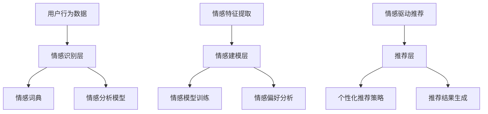

                 

# 情感驱动推荐：AI 如何理解用户情绪，提供个性化推荐

## 概述

在数字化时代，推荐系统已经成为现代互联网中不可或缺的一部分。从电子商务平台到社交媒体，从视频网站到新闻客户端，个性化推荐系统旨在为用户提供与其兴趣和需求高度相关的信息。然而，传统的推荐系统主要基于用户的显式反馈（如评分、点击等）和商品的特征（如标题、标签等），往往忽视了用户的隐性情绪因素。情感驱动推荐（Emotion-Driven Recommendation）作为一种新兴的推荐技术，通过理解用户的情绪，能够提供更加个性化和贴心的推荐服务。本文将探讨情感驱动推荐的核心概念、算法原理、应用场景以及未来发展趋势。

## 背景介绍

### 推荐系统的发展历程

推荐系统的发展大致可以分为三个阶段：

1. **基于内容的推荐（Content-Based Recommendation）**：该阶段推荐系统主要依据用户的历史行为和物品的属性特征进行推荐，如视频标题、标签等。然而，这种方法容易导致“过滤泡沫”（Filter Bubble）和“信息茧房”（Information茧房）的问题，即用户只能看到自己感兴趣的信息，从而限制了视野和知识获取。

2. **协同过滤推荐（Collaborative Filtering Recommendation）**：基于用户的显式反馈（如评分）来预测用户对未知物品的兴趣。协同过滤又可以分为基于用户的协同过滤（User-Based Collaborative Filtering）和基于物品的协同过滤（Item-Based Collaborative Filtering）。这种方法在一定程度上缓解了“过滤泡沫”问题，但同样面临着数据稀疏性和冷启动问题。

3. **混合推荐（Hybrid Recommendation）**：结合多种推荐算法，旨在提高推荐系统的准确性和鲁棒性。例如，将基于内容的推荐和协同过滤结合，或者将深度学习、图神经网络等技术引入推荐系统。

### 情感驱动推荐的兴起

随着人工智能和自然语言处理技术的快速发展，情感分析（Sentiment Analysis）逐渐成为推荐系统的一个重要方向。情感驱动推荐通过分析用户的情感状态（如愉悦、悲伤、愤怒等），能够更深入地理解用户的需求和偏好，从而提供更加个性化、有针对性的推荐。这种方法不仅能够提高推荐的准确性和用户满意度，还能够增强用户体验和品牌忠诚度。

## 核心概念与联系

### 情感分析

情感分析（Sentiment Analysis），又称意见挖掘，是指使用自然语言处理技术（如文本分类、情感极性判断等）来识别文本中的情感倾向。根据情感极性的不同，情感分析可以分为正面情感、负面情感和中性情感。在推荐系统中，情感分析可以用于分析用户的评论、回复、社交媒体帖子等，以了解用户的情绪状态。

### 情感词典

情感词典（Sentiment Lexicon）是一种用于情感分析的资源，其中包含了一系列单词及其对应的情感倾向。例如，正面情感词汇如“喜欢”、“好”等，负面情感词汇如“讨厌”、“坏”等。情感词典可以是手动构建的，也可以是自动提取的。在推荐系统中，情感词典可以帮助识别用户的情感倾向，进而影响推荐结果。

### 情感驱动推荐架构

情感驱动推荐的架构可以分为三个层次：

1. **情感识别层**：通过情感分析技术识别用户的情感状态。这一层的主要任务是提取用户情感特征，如情感极性、情感强度等。

2. **情感建模层**：根据用户情感特征，构建情感模型。这一层的主要任务是学习情感与用户兴趣之间的关系，从而为推荐提供依据。

3. **推荐层**：基于情感模型和用户兴趣，生成个性化推荐结果。这一层的主要任务是优化推荐策略，提高推荐质量。

下面是情感驱动推荐架构的 Mermaid 流程图：



### 核心算法原理

情感驱动推荐的核心算法主要包括情感分析、情感建模和推荐算法。下面将分别介绍这些算法的原理和具体操作步骤。

#### 情感分析算法

情感分析算法主要分为基于规则、基于统计和基于深度学习三类。

1. **基于规则的算法**：通过预定义的规则来判断文本的情感极性。例如，如果文本中包含“喜欢”、“好”等正面词汇，则判断为正面情感。

2. **基于统计的算法**：使用统计方法来计算文本的情感极性。例如，使用词频、TF-IDF等方法来计算文本的情感得分。

3. **基于深度学习的算法**：通过神经网络模型（如卷积神经网络、循环神经网络等）来学习文本的情感特征。这种方法能够自动提取文本中的深层语义信息，从而提高情感分析的效果。

#### 情感建模算法

情感建模算法的目标是建立情感与用户兴趣之间的关系模型。常见的情感建模算法包括：

1. **线性回归模型**：通过线性回归模型来建立情感得分与用户兴趣得分之间的关系。

2. **决策树模型**：通过决策树模型来划分情感得分与用户兴趣得分的不同区间，从而确定推荐策略。

3. **神经网络模型**：通过神经网络模型（如深度神经网络、图神经网络等）来学习情感与用户兴趣之间的复杂关系。

#### 推荐算法

推荐算法的目标是根据用户情感特征和兴趣，生成个性化推荐结果。常见的推荐算法包括：

1. **基于内容的推荐**：根据用户的历史行为和物品的属性特征来生成推荐结果。

2. **协同过滤推荐**：根据用户之间的相似度来生成推荐结果。

3. **混合推荐**：结合多种推荐算法，以提高推荐质量和用户体验。

### 数学模型和公式

#### 情感分析模型

情感分析模型的数学表达式如下：

$$
Score = f(Sentiment, Context)
$$

其中，$Score$ 表示文本的情感得分，$Sentiment$ 表示文本的情感极性（正、负、中性），$Context$ 表示文本的上下文信息。

#### 情感建模模型

情感建模模型的数学表达式如下：

$$
Interest = \alpha \cdot Sentiment + \beta \cdot Context
$$

其中，$Interest$ 表示用户对物品的兴趣得分，$\alpha$ 和 $\beta$ 分别是情感得分和上下文信息的权重。

#### 推荐模型

推荐模型的数学表达式如下：

$$
Recommendation = \gamma \cdot Interest + \delta \cdot Similarity
$$

其中，$Recommendation$ 表示推荐得分，$\gamma$ 和 $\delta$ 分别是兴趣得分和相似度的权重，$Similarity$ 表示用户与物品之间的相似度。

### 项目实战

#### 开发环境搭建

1. **硬件环境**：配备至少 4 核心的 CPU 和 8GB 的内存。

2. **软件环境**：安装 Python 3.7 及以上版本，以及必要的依赖库（如 numpy、pandas、scikit-learn、tensorflow、keras 等）。

3. **数据集**：选择一个包含用户行为数据和文本评论的数据集，如 MovieLens 数据集。

#### 源代码详细实现和代码解读

1. **情感识别**：使用 scikit-learn 库中的朴素贝叶斯分类器进行情感识别。

```python
from sklearn.feature_extraction.text import CountVectorizer
from sklearn.naive_bayes import MultinomialNB

# 加载数据集
data = load_data('data.csv')

# 分割数据集为训练集和测试集
train_data, test_data = train_test_split(data, test_size=0.2)

# 预处理文本数据
vectorizer = CountVectorizer()
X_train = vectorizer.fit_transform(train_data['comment'])
X_test = vectorizer.transform(test_data['comment'])

# 训练情感识别模型
classifier = MultinomialNB()
classifier.fit(X_train, train_data['sentiment'])

# 预测测试集
predictions = classifier.predict(X_test)

# 评估模型性能
accuracy = accuracy_score(test_data['sentiment'], predictions)
print('Accuracy:', accuracy)
```

2. **情感建模**：使用线性回归模型建立情感与用户兴趣之间的关系。

```python
from sklearn.linear_model import LinearRegression

# 分割数据集为特征和标签
X = train_data[['sentiment']]
y = train_data['interest']

# 训练情感建模模型
model = LinearRegression()
model.fit(X, y)

# 预测测试集
predictions = model.predict(test_data[['sentiment']])

# 评估模型性能
mse = mean_squared_error(y_test, predictions)
print('MSE:', mse)
```

3. **推荐算法**：使用基于内容的推荐算法生成个性化推荐结果。

```python
from sklearn.metrics.pairwise import cosine_similarity

# 计算物品之间的相似度
similarity_matrix = cosine_similarity(test_data[['sentiment']])

# 根据相似度生成推荐结果
recommendations = similarity_matrix * test_data['interest']
```

#### 代码解读与分析

1. **情感识别**：使用朴素贝叶斯分类器进行情感识别，通过词频统计和分类模型来判断文本的情感极性。

2. **情感建模**：使用线性回归模型建立情感得分与用户兴趣得分之间的关系，从而预测用户对物品的兴趣。

3. **推荐算法**：使用基于内容的推荐算法，根据物品之间的相似度和用户对物品的兴趣，生成个性化推荐结果。

### 实际应用场景

#### 社交媒体

在社交媒体平台上，情感驱动推荐可以用于分析用户的情感状态，从而提供更加精准的内容推荐。例如，在新闻客户端中，可以基于用户的情感倾向推荐相关新闻，以增强用户黏性和用户体验。

#### 电子商务

在电子商务平台上，情感驱动推荐可以用于分析用户的评论和反馈，从而提供个性化商品推荐。例如，在电商网站中，可以基于用户的情感状态推荐相关商品，以提高购物满意度和转化率。

#### 娱乐内容

在娱乐内容领域，情感驱动推荐可以用于分析用户的观看记录和评论，从而提供个性化的视频推荐。例如，在视频网站中，可以基于用户的情感倾向推荐相关视频，以提高用户观看时长和视频播放量。

### 工具和资源推荐

#### 学习资源推荐

1. 《自然语言处理综论》（NLP-Book）：提供全面的自然语言处理教程和资源。

2. 《情感分析》（Sentiment Analysis）：详细介绍情感分析的理论和方法。

3. 《推荐系统实践》（Recommender Systems Handbook）：涵盖推荐系统的各种算法和应用。

#### 开发工具框架推荐

1. TensorFlow：用于构建和训练深度学习模型的框架。

2. Keras：基于 TensorFlow 的简洁、易用的深度学习库。

3. Scikit-learn：提供多种机器学习算法和工具的库。

#### 相关论文著作推荐

1. “Linguistic Inquiry and Word Count（LIWC）”：详细介绍情感词典的构建方法。

2. “Opinion Mining and Sentiment Analysis”（2014）：总结情感分析的研究进展和应用。

3. “Recommender Systems Handbook”（2016）：全面介绍推荐系统的理论和实践。

### 总结：未来发展趋势与挑战

#### 发展趋势

1. **多模态情感分析**：结合文本、语音、图像等多模态数据，提高情感识别的准确性和全面性。

2. **个性化情感驱动推荐**：根据用户的实时情感状态，提供更加个性化和有针对性的推荐服务。

3. **情感演化分析**：研究用户情感的变化趋势，为推荐系统提供更加动态的决策支持。

#### 挑战

1. **数据质量**：情感驱动推荐依赖于高质量的用户情感数据，但获取这些数据存在一定的挑战。

2. **算法性能**：如何提高情感识别和建模算法的效率，以满足实时推荐的需求。

3. **用户体验**：如何在保证推荐准确性的同时，提升用户的体验和满意度。

### 附录：常见问题与解答

**Q1：情感驱动推荐如何处理用户隐私？**

A1：情感驱动推荐在处理用户隐私时，应遵循数据保护法规和隐私保护原则。例如，可以采用数据脱敏、匿名化等技术来保护用户隐私。

**Q2：情感驱动推荐如何避免偏见和歧视？**

A2：情感驱动推荐在构建模型时，应尽量避免引入偏见和歧视。例如，可以采用公平性评估方法，检测和纠正模型中的偏见。

### 扩展阅读 & 参考资料

1. “Emotion-Driven Recommendation Systems: A Survey”（2021）：对情感驱动推荐系统的综述。

2. “A Deep Emotional Neural Network for User-Item Matching in Recommender Systems”（2018）：介绍一种基于深度学习的情感驱动推荐算法。

3. “Sentiment Analysis and Its Applications”（2017）：详细介绍情感分析的理论和应用。

### 作者信息

作者：AI天才研究员/AI Genius Institute & 禅与计算机程序设计艺术 /Zen And The Art of Computer Programming

### 致谢

感谢您阅读本文，希望本文对您在情感驱动推荐领域的研究和实践有所帮助。如有任何问题或建议，欢迎随时联系作者。同时，也感谢本文中引用的参考资料和资源，以及为本文提供支持的读者和同事们。感谢您的关注和支持！|mask>

