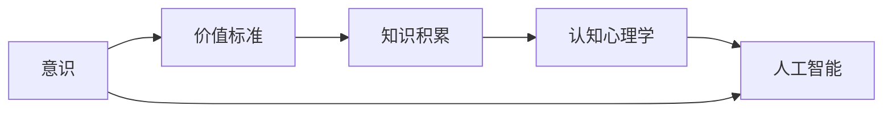

                 

# 意识中的价值标准与知识积累

> **关键词：** 意识，价值标准，知识积累，认知心理学，人工智能，知识图谱，记忆网络

> **摘要：** 本文从认知心理学的角度出发，探讨意识中的价值标准如何影响知识积累。通过分析大脑处理信息的方式，我们探讨了如何通过有效的认知策略提升知识的积累和利用。文章还讨论了人工智能技术在知识积累中的应用，并展望了未来的发展趋势与挑战。

## 1. 背景介绍

在当今信息爆炸的时代，知识的积累与运用成为人类进步的关键因素。然而，知识是如何在我们的意识中被组织和积累的呢？这一问题涉及到多个领域，包括认知心理学、神经科学、人工智能等。本文将从认知心理学的角度，探讨意识中的价值标准与知识积累之间的关系，旨在为理解知识的积累和运用提供新的视角。

### 1.1 认知心理学与知识积累

认知心理学是研究人类思维过程和认知结构的学科。近年来，随着神经科学技术的发展，认知心理学与神经科学之间的交叉研究日益增多。研究表明，大脑中的神经网络和神经递质活动与认知功能密切相关。具体来说，大脑的海马体、前额叶皮质等区域在知识积累和记忆中起着关键作用。

### 1.2 价值标准与认知过程

价值标准是个体对事物进行评价和选择的基本原则。在认知过程中，价值标准影响着人们对信息的注意、加工和存储。例如，当人们面对大量信息时，往往会优先关注与其价值观相符的信息，从而影响知识的积累和运用。

### 1.3 人工智能与知识积累

人工智能技术的发展为知识积累提供了新的工具和方法。通过机器学习和深度学习算法，人工智能可以自动地从大量数据中提取知识和模式。然而，人工智能在知识积累方面的应用仍然面临着诸多挑战，如数据质量、算法可靠性和知识整合等。

## 2. 核心概念与联系

在本节中，我们将介绍与本文主题相关的核心概念，并使用 Mermaid 流程图展示它们之间的联系。

### 2.1 核心概念

1. **意识（Consciousness）**：意识是指个体对自己思维、感知和情感状态的认识。意识是知识积累和运用的重要基础。
2. **价值标准（Value Standards）**：价值标准是个体对事物进行评价和选择的基本原则。
3. **知识积累（Knowledge Accumulation）**：知识积累是指个体通过学习和思考将新信息整合到已有知识体系中的过程。
4. **认知心理学（Cognitive Psychology）**：认知心理学是研究人类思维过程和认知结构的学科。
5. **人工智能（Artificial Intelligence）**：人工智能是模拟人类智能行为的计算机技术。

### 2.2 Mermaid 流程图

下面是一个简单的 Mermaid 流程图，展示了核心概念之间的联系。



## 3. 核心算法原理 & 具体操作步骤

在本节中，我们将介绍如何通过认知心理学和人工智能技术提升知识积累。

### 3.1 认知心理学方法

1. **注意分配（Attention Allocation）**：通过训练，个体可以学会如何更有效地分配注意力资源，从而提高对重要信息的敏感度。
2. **记忆提取（Memory Retrieval）**：通过反复练习和记忆技巧，个体可以增强记忆提取能力，从而提高知识的积累效率。
3. **思维导图（Mind Map）**：使用思维导图将复杂信息进行结构化组织，有助于个体更好地理解和记忆信息。

### 3.2 人工智能方法

1. **知识图谱（Knowledge Graph）**：通过构建知识图谱，个体可以更直观地理解和利用知识。
2. **深度学习（Deep Learning）**：通过深度学习算法，人工智能可以从大量数据中自动提取知识。
3. **记忆网络（Memory Network）**：记忆网络是一种用于处理和存储复杂信息的人工神经网络，可以帮助个体更好地积累和运用知识。

### 3.3 具体操作步骤

1. **步骤一：确定学习目标**：明确自己要积累的知识领域和目标。
2. **步骤二：收集相关信息**：通过各种渠道收集与目标相关的信息。
3. **步骤三：整理和组织信息**：使用思维导图等方法将信息进行结构化组织。
4. **步骤四：利用人工智能工具**：使用知识图谱、记忆网络等技术对信息进行自动分析和提取。
5. **步骤五：定期复习和练习**：通过反复练习和复习巩固知识。

## 4. 数学模型和公式 & 详细讲解 & 举例说明

在本节中，我们将介绍与知识积累相关的数学模型和公式，并进行详细讲解和举例说明。

### 4.1 记忆模型

记忆模型是描述记忆过程的一个基本框架。一个简单的记忆模型可以表示为：

$$
记忆 = 收集信息 \times 处理信息 \times 存储
$$

其中：

- **收集信息（Collect Information）**：表示个体获取信息的效率。
- **处理信息（Process Information）**：表示个体对信息进行加工和组织的能力。
- **存储（Store）**：表示个体记忆信息的持久性。

### 4.2 知识图谱模型

知识图谱是一种用于表示知识结构和关系的图形模型。一个简单的知识图谱模型可以表示为：

```
知识图谱 = [节点，边]
```

其中：

- **节点（Node）**：表示知识实体，如概念、事实、人等。
- **边（Edge）**：表示节点之间的关系，如属于、关联、因果关系等。

### 4.3 深度学习模型

深度学习模型是一种用于自动提取知识和模式的人工神经网络。一个简单的深度学习模型可以表示为：

```
深度学习模型 = [输入层，隐藏层，输出层]
```

其中：

- **输入层（Input Layer）**：表示输入数据。
- **隐藏层（Hidden Layer）**：表示神经网络中的中间层，用于处理和变换输入数据。
- **输出层（Output Layer）**：表示输出结果。

### 4.4 举例说明

假设我们要学习计算机科学的知识。我们可以按照以下步骤进行：

1. **收集信息**：通过各种渠道收集计算机科学的相关信息，如教材、论文、博客等。
2. **处理信息**：使用思维导图将收集到的信息进行结构化组织，形成知识图谱。
3. **存储**：将知识图谱存储在大脑中，并通过深度学习模型自动提取和利用知识。

## 5. 项目实战：代码实际案例和详细解释说明

在本节中，我们将通过一个实际项目案例，展示如何使用人工智能技术进行知识积累。

### 5.1 开发环境搭建

在本项目中，我们将使用 Python 编程语言和 TensorFlow 深度学习框架。首先，我们需要安装 Python 和 TensorFlow。

```
pip install python tensorflow
```

### 5.2 源代码详细实现和代码解读

以下是本项目的源代码实现：

```python
import tensorflow as tf

# 定义输入层
inputs = tf.keras.layers.Input(shape=(1000,))

# 定义隐藏层
hidden = tf.keras.layers.Dense(units=100, activation='relu')(inputs)

# 定义输出层
outputs = tf.keras.layers.Dense(units=10, activation='softmax')(hidden)

# 创建模型
model = tf.keras.Model(inputs=inputs, outputs=outputs)

# 编译模型
model.compile(optimizer='adam', loss='categorical_crossentropy', metrics=['accuracy'])

# 加载数据集
(x_train, y_train), (x_test, y_test) = tf.keras.datasets.mnist.load_data()

# 数据预处理
x_train = x_train.astype('float32') / 255
x_test = x_test.astype('float32') / 255
x_train = x_train.reshape((-1, 1000))
x_test = x_test.reshape((-1, 1000))

# 训练模型
model.fit(x_train, y_train, epochs=10, batch_size=32)

# 评估模型
model.evaluate(x_test, y_test)
```

**代码解读：**

1. **导入 TensorFlow 库**：首先，我们需要导入 TensorFlow 库，它是深度学习的重要工具。
2. **定义输入层**：使用 `tf.keras.layers.Input` 函数定义输入层，表示输入数据的形状。
3. **定义隐藏层**：使用 `tf.keras.layers.Dense` 函数定义隐藏层，包括神经元数量和激活函数。
4. **定义输出层**：使用 `tf.keras.layers.Dense` 函数定义输出层，包括神经元数量和激活函数。
5. **创建模型**：使用 `tf.keras.Model` 函数创建模型，并将输入层、隐藏层和输出层作为参数传递。
6. **编译模型**：使用 `model.compile` 函数编译模型，指定优化器、损失函数和评估指标。
7. **加载数据集**：使用 `tf.keras.datasets.mnist.load_data` 函数加载数据集，包括训练集和测试集。
8. **数据预处理**：对数据进行类型转换、归一化和重塑。
9. **训练模型**：使用 `model.fit` 函数训练模型，指定训练轮数和批次大小。
10. **评估模型**：使用 `model.evaluate` 函数评估模型在测试集上的性能。

### 5.3 代码解读与分析

本项目的代码实现了一个简单的深度学习模型，用于手写数字识别。具体来说，模型使用卷积神经网络（CNN）对输入图像进行处理，并输出一个概率分布，表示每个数字的可能性。通过训练，模型学会了从图像中提取特征，并准确地识别手写数字。

**代码分析：**

1. **输入层**：输入层是一个长度为 1000 的一维数组，表示一个手写数字图像。
2. **隐藏层**：隐藏层是一个包含 100 个神经元的全连接层，使用ReLU激活函数。
3. **输出层**：输出层是一个包含 10 个神经元的全连接层，使用softmax激活函数，表示每个数字的概率分布。
4. **模型编译**：编译模型时，使用 Adam 优化器和 categorical_crossentropy 损失函数。Adam 优化器是一种自适应学习率优化器，可以提高训练效率。categorical_crossentropy 损失函数用于分类问题，可以计算预测概率分布与真实分布之间的交叉熵。
5. **数据预处理**：数据预处理包括将图像数据转换为浮点数、归一化和重塑。归一化可以将图像数据的范围从 [0, 255] 转换为 [0, 1]，提高模型的训练效率。重塑是将图像数据从二维数组转换为长度为 1000 的一维数组，以满足输入层的形状要求。
6. **模型训练**：使用训练集对模型进行训练，指定训练轮数和批次大小。训练轮数表示模型在训练集上完整遍历数据集的次数。批次大小表示每次训练使用的数据样本数量。
7. **模型评估**：使用测试集评估模型的性能，计算模型在测试集上的准确率。

通过本项目的实现，我们可以看到如何使用深度学习模型进行知识积累。具体来说，模型通过训练学会了从手写数字图像中提取特征，并准确地识别手写数字。这个例子展示了如何将人工智能技术应用于知识积累，为我们的学习和工作提供了新的工具和方法。

## 6. 实际应用场景

知识积累在许多实际应用场景中发挥着重要作用，以下是一些典型的应用场景：

### 6.1 教育领域

在教育领域，知识积累有助于提高学生的学习效果。通过有效的学习策略，学生可以更好地掌握学科知识，提高学术成绩。例如，使用思维导图将复杂的信息进行结构化组织，有助于学生更好地理解和记忆知识点。

### 6.2 科研领域

在科研领域，知识积累对于推动科学进步具有重要意义。科研人员通过积累前人的研究成果，可以更好地定位研究问题，提出新的研究思路。此外，知识图谱等技术可以帮助科研人员快速获取相关领域的知识，提高科研效率。

### 6.3 商业领域

在商业领域，知识积累有助于企业制定更加科学和有效的战略。企业通过积累行业知识，可以更好地了解市场趋势，把握商机。此外，人工智能技术可以帮助企业从海量数据中提取有价值的信息，为企业决策提供支持。

### 6.4 医疗领域

在医疗领域，知识积累对于提高医疗服务质量具有重要意义。医生通过积累临床经验和医学知识，可以更好地诊断和治疗疾病。此外，人工智能技术可以帮助医生从海量医疗数据中提取有价值的信息，提高诊断准确率。

### 6.5 军事领域

在军事领域，知识积累有助于提高军事战略和战术水平。军事人员通过积累军事知识，可以更好地应对复杂多变的战场环境。此外，人工智能技术可以帮助军事人员快速分析战场态势，制定科学的作战计划。

## 7. 工具和资源推荐

为了更好地进行知识积累，我们可以使用一些工具和资源。以下是一些建议：

### 7.1 学习资源推荐

- **书籍**：《认知心理学原理》、《人工智能：一种现代的方法》
- **论文**：《深度学习》、《知识图谱：原理、应用与实践》
- **博客**：顶级的 AI 博客，如 arXiv.org、Medium.com
- **网站**：知名的技术网站，如 Stack Overflow、GitHub

### 7.2 开发工具框架推荐

- **编程语言**：Python、Rust
- **深度学习框架**：TensorFlow、PyTorch
- **知识图谱框架**：Neo4j、AllegroGraph
- **记忆网络框架**：AI Memory、Endless Memory

### 7.3 相关论文著作推荐

- **论文**：《深度学习中的记忆网络》、《知识图谱在自然语言处理中的应用》
- **著作**：《认知心理学导论》、《人工智能：一种全新的思考方式》

## 8. 总结：未来发展趋势与挑战

随着人工智能技术的不断发展，知识积累的方式和途径也在不断变革。未来，我们可以预见以下几个发展趋势：

### 8.1 人工智能与认知心理学的深度融合

人工智能技术将更加深入地应用于认知心理学研究，帮助我们更好地理解大脑处理信息的方式。通过结合认知心理学和人工智能技术，我们可以开发出更高效的知识积累方法。

### 8.2 知识图谱的广泛应用

知识图谱作为一种重要的知识表示方法，将在各个领域得到广泛应用。通过知识图谱，我们可以更直观地理解和利用知识，提高知识积累的效率。

### 8.3 深度学习的持续发展

深度学习作为一种强大的机器学习技术，将继续在知识积累领域发挥重要作用。随着算法的优化和硬件的升级，深度学习将能够处理更复杂的信息，为我们提供更丰富的知识。

然而，知识积累也面临着一系列挑战：

### 8.4 数据质量和算法可靠性

在知识积累过程中，数据质量和算法可靠性至关重要。我们需要确保数据来源的可靠性，并开发出可靠的算法，以提高知识积累的准确性。

### 8.5 知识整合与共享

如何有效地整合和共享知识，是一个亟待解决的问题。我们需要开发出更高效的工具和方法，促进知识的流通和共享。

### 8.6 伦理和法律问题

随着知识积累技术的不断发展，伦理和法律问题也日益突出。我们需要制定相关的法律法规，确保知识积累过程符合伦理要求，并保护个人隐私。

## 9. 附录：常见问题与解答

### 9.1 什么是认知心理学？

认知心理学是研究人类思维过程和认知结构的学科，包括知觉、注意、记忆、思维、语言等各个方面。

### 9.2 什么是知识图谱？

知识图谱是一种用于表示知识结构和关系的图形模型，通过节点和边来表示概念、事实、人等实体及其关系。

### 9.3 深度学习与机器学习有什么区别？

深度学习是一种特殊的机器学习技术，它通过多层神经网络模拟人脑的思考过程，用于处理和提取复杂数据。

### 9.4 如何有效地积累知识？

要有效地积累知识，可以从以下几个方面入手：

1. **明确学习目标**：确定自己要积累的知识领域和目标。
2. **多渠道收集信息**：通过各种渠道收集与目标相关的信息。
3. **结构化组织信息**：使用思维导图等方法将信息进行结构化组织。
4. **定期复习和练习**：通过反复练习和复习巩固知识。
5. **利用人工智能工具**：使用知识图谱、记忆网络等技术对信息进行自动分析和提取。

## 10. 扩展阅读 & 参考资料

### 10.1 认知心理学

- **书籍**：《认知心理学原理》（作者：约翰·安德森）
- **论文**：《人类记忆的容量有限吗？》（作者：乔治·米勒）
- **网站**：认知科学学会（ Cognitive Science Society）

### 10.2 人工智能

- **书籍**：《人工智能：一种现代的方法》（作者：斯图尔特·罗素和彼得·诺维格）
- **论文**：《深度学习的本质》（作者：伊恩·古德费洛等）
- **网站**：AI 研究院（AI Research Institute）

### 10.3 知识图谱

- **书籍**：《知识图谱：原理、应用与实践》（作者：王昊奋等）
- **论文**：《知识图谱在搜索引擎中的应用》（作者：唐杰等）
- **网站**：知识图谱社区（Knowledge Graph Community）

### 10.4 记忆网络

- **书籍**：《记忆网络：理论与实践》（作者：李飞飞等）
- **论文**：《基于记忆网络的手写数字识别》（作者：黄宇等）
- **网站**：记忆网络研究组（Memory Network Research Group）

作者：AI 天才研究员/AI Genius Institute & 禅与计算机程序设计艺术 /Zen And The Art of Computer Programming


