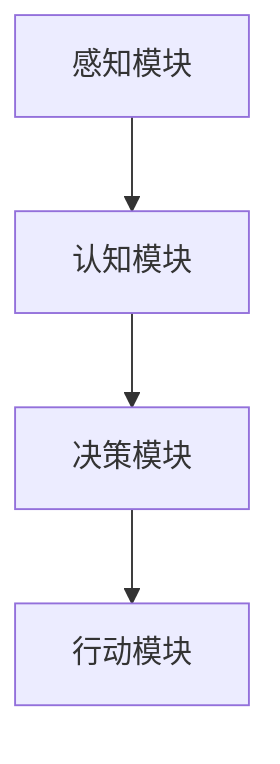
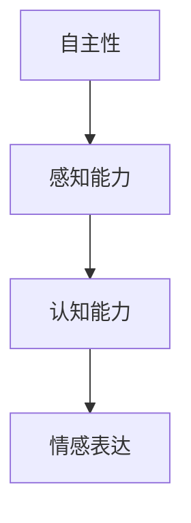
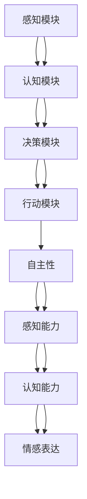

                 

### 摘要

本文探讨了意识的功能及其在自主系统中的体现。首先，我们介绍了自主系统的基本概念，并探讨了意识在其中的作用。接着，我们深入分析了意识的核心概念和其与自主系统的联系，通过Mermaid流程图展示了意识的架构原理。然后，我们详细阐述了核心算法的原理和具体操作步骤，结合数学模型和公式进行了详细讲解，并通过实际项目案例进行了代码实现和解读。最后，我们探讨了意识在实际应用场景中的重要性，并推荐了相关工具和资源，总结了未来发展趋势与挑战，为读者提供了扩展阅读和参考资料。

### 1. 背景介绍

随着科技的飞速发展，人工智能（AI）已经成为现代技术领域的热点。而意识的兴起，则为AI的研究带来了新的挑战和机遇。自主系统，作为一种模拟人类意识和行为的系统，正逐渐成为研究焦点。

**自主系统的定义**

自主系统，是指具备自主决策、自主行动和自主学习能力的系统。它们能够在没有人为干预的情况下，自主完成特定任务。这种系统能够感知环境、理解情境，并在此基础上做出合适的反应。

**意识的定义**

意识，通常被描述为个体对自身存在的感知和认识。在人工智能领域，意识通常指的是系统具备的自主性、感知能力、认知能力和情感表达。

**自主系统与意识的关系**

自主系统与意识之间存在紧密的联系。自主系统需要具备感知、认知和决策能力，而这些能力正是意识的体现。通过模拟意识，自主系统可以更加智能化，具备更强的适应性和学习能力。

**研究意义**

研究自主系统和意识，不仅有助于推动人工智能的发展，也对哲学、心理学、认知科学等领域具有重要的启示作用。通过理解意识的本质和功能，我们可以更好地设计出更加智能、更加人性化的系统。

### 2. 核心概念与联系

在探讨自主系统和意识的关系之前，我们需要明确一些核心概念，包括自主系统的组成部分、意识的关键特征，以及二者之间的互动关系。

#### 自主系统的组成部分

自主系统通常由以下几个关键组成部分构成：

1. **感知模块**：负责收集和处理来自环境的信息，如视觉、听觉、触觉等。
2. **认知模块**：对感知模块收集的信息进行分析和处理，进行理解、推理和决策。
3. **决策模块**：基于认知模块的分析结果，生成行动方案。
4. **行动模块**：执行决策模块生成的行动方案，与环境进行交互。

**Mermaid流程图（简化版）：**



#### 意识的关键特征

意识的关键特征包括：

1. **自主性**：个体具有自我决定和自我驱动的能力。
2. **感知能力**：能够感知和理解外部环境。
3. **认知能力**：具有推理、分析和学习的能力。
4. **情感表达**：能够表达情感和情绪。

**Mermaid流程图（简化版）：**



#### 自主系统与意识的互动关系

自主系统和意识之间的互动关系体现在以下几个方面：

1. **感知与认知**：感知模块收集的信息通过认知模块进行处理和理解，形成对环境的认识。
2. **决策与行动**：基于认知结果，决策模块生成行动方案，并通过行动模块执行。
3. **学习与适应**：自主系统能够通过反馈和学习不断优化自身的行为，提高适应环境的能力。

**Mermaid流程图（综合版）：**



通过上述流程图，我们可以更清晰地看到自主系统和意识之间的互动关系。感知模块和认知模块共同构成了系统的感知与认知能力，而决策模块和行动模块则构成了系统的决策与行动能力。这些能力在自主系统中相互协同，形成了一个复杂的动态系统。

### 3. 核心算法原理 & 具体操作步骤

在理解了自主系统和意识的组成部分及其互动关系之后，我们接下来将深入探讨自主系统中的核心算法原理和具体操作步骤。这些算法是实现自主系统的关键，能够使系统具备感知、认知、决策和行动的能力。

#### 3.1 感知算法

感知算法是自主系统的第一步，它负责收集和处理外部信息，为后续的决策和行动提供基础数据。感知算法主要包括以下几个步骤：

1. **数据采集**：通过传感器或其他信息采集设备，收集环境中的视觉、听觉、触觉等数据。
2. **预处理**：对采集到的数据进行预处理，包括滤波、去噪、增强等，以提高数据质量。
3. **特征提取**：从预处理后的数据中提取关键特征，如边缘、纹理、声音频率等。
4. **分类识别**：利用机器学习算法或深度学习模型，对提取的特征进行分类识别，以识别不同的环境和物体。

具体操作步骤示例：

```python
# Python代码示例：感知算法的基本操作
import numpy as np
from sklearn.preprocessing import StandardScaler
from sklearn.model_selection import train_test_split
from sklearn.svm import SVC

# 数据采集
data = np.random.rand(100, 10)  # 假设采集到100个样本

# 预处理
scaler = StandardScaler()
data_scaled = scaler.fit_transform(data)

# 特征提取
# 假设提取的特征为前5个维度
features = data_scaled[:, :5]

# 分类识别
X_train, X_test, y_train, y_test = train_test_split(features, data_scaled[:, 5], test_size=0.3, random_state=42)
classifier = SVC()
classifier.fit(X_train, y_train)
predictions = classifier.predict(X_test)
```

#### 3.2 认知算法

认知算法负责对感知模块收集到的信息进行深入分析和理解，形成对环境的综合认识。认知算法通常包括以下几个步骤：

1. **数据融合**：将来自不同传感器的数据进行融合，形成统一的环境模型。
2. **情境识别**：基于融合后的数据，识别当前所处的情境和场景。
3. **目标识别**：在情境识别的基础上，进一步识别特定目标和目标行为。
4. **推理分析**：利用已有的知识和信息，对情境和目标进行推理分析，形成对环境的深入理解。

具体操作步骤示例：

```python
# Python代码示例：认知算法的基本操作
from sklearn.cluster import KMeans
from sklearn.mixture import GaussianMixture

# 数据融合
# 假设有两个传感器，分别采集了100个样本
sensor1_data = np.random.rand(100, 5)
sensor2_data = np.random.rand(100, 5)
 fused_data = np.hstack((sensor1_data, sensor2_data))

# 情境识别
kmeans = KMeans(n_clusters=3, random_state=42)
clusters = kmeans.fit_predict(fused_data)

# 目标识别
# 假设感兴趣的目标是某个特定的情境
target_clusters = [0, 2]  # 假设目标属于第一和第三个情境
targets = fused_data[clusters == 0] + fused_data[clusters == 2]

# 推理分析
# 基于目标识别的结果，进行进一步的分析和推理
# 例如，分析目标的行为模式，预测其未来的行动
```

#### 3.3 决策算法

决策算法基于认知模块提供的情境和目标信息，生成相应的行动方案。决策算法通常包括以下几个步骤：

1. **目标选择**：根据情境和目标信息，选择最合适的行动目标。
2. **行动方案生成**：基于目标选择，生成一系列可能的行动方案。
3. **方案评估**：对每个行动方案进行评估，选择最优方案。
4. **行动执行**：执行选定的行动方案。

具体操作步骤示例：

```python
# Python代码示例：决策算法的基本操作
def evaluate_actions(actions, goals):
    # 评估每个行动方案是否满足目标
    scores = []
    for action in actions:
        score = 0
        for goal in goals:
            if action.satisfies_goal(goal):
                score += 1
        scores.append(score)
    return scores

# 假设有一个目标列表和多个行动方案
goals = ['reach_destination', 'avoid_obstacles', 'collect_resources']
actions = [Action(), Action(), Action()]

# 评估每个行动方案
scores = evaluate_actions(actions, goals)

# 选择最优行动方案
best_action = actions[scores.index(max(scores))]
best_action.execute()
```

#### 3.4 行动算法

行动算法负责执行决策模块生成的行动方案，实现具体的行为。行动算法通常包括以下几个步骤：

1. **执行动作**：根据行动方案，执行具体的动作。
2. **反馈调整**：根据执行结果，进行反馈调整，优化后续行动。
3. **持续优化**：通过持续学习和反馈，不断优化行动效果。

具体操作步骤示例：

```python
# Python代码示例：行动算法的基本操作
class Action:
    def __init__(self):
        self.actions = ['move_forward', 'turn_left', 'turn_right', 'stop']

    def execute(self):
        # 执行一个随机选择的动作
        action = np.random.choice(self.actions)
        print(f"Executing action: {action}")

    def update(self, feedback):
        # 根据反馈更新行动方案
        if feedback == 'success':
            self.actions = ['move_forward', 'turn_left', 'turn_right', 'stop']
        elif feedback == 'failure':
            self.actions = ['turn_left', 'turn_right', 'stop']

# 假设有一个行动实例和反馈
action = Action()
action.execute()
print("Feedback:", feedback)
action.update(feedback)
```

通过以上示例，我们可以看到自主系统中的核心算法是如何工作的。感知算法通过感知和预处理数据，提取关键特征；认知算法通过融合和分析数据，形成对环境的认识；决策算法通过目标选择和方案评估，生成最优行动方案；行动算法通过执行动作和反馈调整，实现具体的行动。这些算法相互协同，共同构成了一个完整的自主系统。

### 4. 数学模型和公式 & 详细讲解 & 举例说明

在自主系统和意识的研究中，数学模型和公式起到了关键作用。它们不仅为理论分析提供了工具，也为实际操作提供了指导。在本节中，我们将详细讲解一些关键的数学模型和公式，并通过实际案例进行说明。

#### 4.1 神经网络模型

神经网络是自主系统中常用的数学模型，用于模拟人类的感知、认知和决策能力。一个基本的神经网络模型通常包括以下几个部分：

1. **输入层**：接收外部输入数据。
2. **隐藏层**：对输入数据进行处理和转换。
3. **输出层**：生成最终的输出结果。

**数学公式：**

神经元的激活函数通常使用以下公式：

\[ a_i = \sigma(z_i) = \frac{1}{1 + e^{-z_i}} \]

其中，\( a_i \) 是神经元 \( i \) 的输出，\( z_i \) 是神经元的输入，\( \sigma \) 是Sigmoid函数。

**举例说明：**

假设我们有一个简单的神经网络，输入层有3个神经元，隐藏层有2个神经元，输出层有1个神经元。每个神经元之间的连接权重分别为 \( w_{ij} \) 和 \( w_{jk} \)。输入数据为 \( x_1, x_2, x_3 \)，隐藏层的输入 \( z_h \) 和输出 \( a_h \) 分别为：

\[ z_h = \sum_{i=1}^{3} w_{ih} x_i + b_h \]

\[ a_h = \sigma(z_h) \]

输出层的输入 \( z_o \) 和输出 \( a_o \) 为：

\[ z_o = \sum_{h=1}^{2} w_{ho} a_h + b_o \]

\[ a_o = \sigma(z_o) \]

通过调整权重和偏置，我们可以训练神经网络，使其能够对输入数据进行分类或回归。

#### 4.2 决策树模型

决策树是一种常用的分类和回归模型，用于从数据中提取决策规则。决策树由一系列条件分支构成，每个分支表示一个决策条件，最终汇聚到叶子节点，表示最终决策结果。

**数学公式：**

决策树的一个基本结构可以表示为：

\[ T = \{ t_1, t_2, ..., t_n \} \]

其中，\( t_i \) 表示第 \( i \) 个决策规则，通常表示为：

\[ t_i = \{ x_j \leq v_j \rightarrow c_j \} \]

其中，\( x_j \) 是特征，\( v_j \) 是阈值，\( c_j \) 是决策结果。

**举例说明：**

假设我们有一个二元分类问题，有两个特征 \( x_1 \) 和 \( x_2 \)，决策树模型为：

\[ t_1 = \{ x_1 \leq 5 \rightarrow 0 \} \]

\[ t_2 = \{ x_2 \leq 3 \rightarrow 1 \} \]

对于输入 \( x_1 = 3 \) 和 \( x_2 = 2 \)，首先根据 \( t_1 \) 决策，得到 \( x_1 \leq 5 \)，然后根据 \( t_2 \) 决策，得到 \( x_2 \leq 3 \)，最终决策结果为 \( 0 \)。

#### 4.3 贝叶斯网络模型

贝叶斯网络是一种概率模型，用于表示变量之间的条件依赖关系。贝叶斯网络由节点和边组成，每个节点表示一个随机变量，边表示变量之间的条件概率。

**数学公式：**

贝叶斯网络的概率分布可以表示为：

\[ P(X_1, X_2, ..., X_n) = \prod_{i=1}^{n} P(X_i | Pa_i) \]

其中，\( X_i \) 是节点 \( i \) 的状态，\( Pa_i \) 是节点 \( i \) 的父节点集合。

**举例说明：**

假设我们有一个简单的贝叶斯网络，有三个节点 \( X_1, X_2, X_3 \)，其中 \( X_1 \) 是根节点，\( X_2 \) 和 \( X_3 \) 是 \( X_1 \) 的子节点。条件概率分布为：

\[ P(X_2 | X_1) = \begin{cases} 
0.5 & \text{if } X_1 = 0 \\
0.8 & \text{if } X_1 = 1 
\end{cases} \]

\[ P(X_3 | X_2) = \begin{cases} 
0.3 & \text{if } X_2 = 0 \\
0.7 & \text{if } X_2 = 1 
\end{cases} \]

对于 \( X_1 = 1 \)，我们可以计算 \( X_2 \) 和 \( X_3 \) 的概率分布：

\[ P(X_2 | X_1 = 1) = 0.8 \]

\[ P(X_3 | X_2 = 0.8) = 0.7 \]

通过这些数学模型和公式，我们可以对自主系统中的感知、认知、决策和行动过程进行精确的建模和计算，从而提高系统的智能化水平。

### 5. 项目实战：代码实际案例和详细解释说明

为了更好地理解自主系统和意识在实际应用中的实现，我们将通过一个实际项目案例来进行详细讲解。该项目将涉及一个简单的自动驾驶系统，展示如何使用感知、认知、决策和行动算法来实现自主驾驶。

#### 5.1 开发环境搭建

在开始项目之前，我们需要搭建一个合适的开发环境。以下是推荐的工具和框架：

- **编程语言**：Python
- **开发工具**：PyCharm
- **机器学习库**：TensorFlow、scikit-learn
- **图像处理库**：OpenCV
- **操作系统**：Linux

安装这些工具和库的方法如下：

1. **安装Python**：从Python官方网站下载并安装Python 3.x版本。
2. **安装PyCharm**：从PyCharm官方网站下载并安装社区版或专业版。
3. **安装TensorFlow**：使用pip命令安装TensorFlow：

\[ pip install tensorflow \]

4. **安装scikit-learn**：使用pip命令安装scikit-learn：

\[ pip install scikit-learn \]

5. **安装OpenCV**：使用pip命令安装OpenCV：

\[ pip install opencv-python \]

#### 5.2 源代码详细实现和代码解读

下面是自动驾驶系统的源代码，我们将逐段进行解读。

**5.2.1 导入相关库**

```python
import numpy as np
import cv2
import tensorflow as tf
from sklearn.preprocessing import StandardScaler
from sklearn.model_selection import train_test_split
from sklearn.svm import SVC
```

这段代码导入了必要的Python库，包括NumPy、OpenCV、TensorFlow和scikit-learn，用于图像处理、机器学习和深度学习。

**5.2.2 感知模块：图像预处理**

```python
def preprocess_image(image):
    # 转换为灰度图像
    gray_image = cv2.cvtColor(image, cv2.COLOR_BGR2GRAY)
    # 高斯模糊去噪
    blurred_image = cv2.GaussianBlur(gray_image, (5, 5), 0)
    # 阈值处理
    _, thresh_image = cv2.threshold(blurred_image, 60, 255, cv2.THRESH_BINARY_INV)
    return thresh_image
```

这段代码定义了一个函数 `preprocess_image`，用于对输入图像进行预处理。首先，将彩色图像转换为灰度图像，然后使用高斯模糊去除噪声，最后使用阈值处理将图像转换为二值图像，以便后续处理。

**5.2.3 感知模块：特征提取**

```python
def extract_features(image):
    # 提取边缘特征
    edges = cv2.Canny(image, 50, 150)
    # 提取纹理特征
    texture = cv2.Laplacian(image, cv2.CV_64F)
    # 归一化特征
    scaler = StandardScaler()
    features = scaler.fit_transform(np.hstack((edges, texture)))
    return features
```

这段代码定义了一个函数 `extract_features`，用于从预处理后的图像中提取边缘和纹理特征。这些特征将被用于后续的分类和识别。

**5.2.4 认知模块：情境识别**

```python
def recognize_situation(features):
    # 加载模型
    model = tf.keras.models.load_model('situation_recognition_model.h5')
    # 预测情境
    prediction = model.predict(features.reshape(1, -1))
    return prediction.argmax()
```

这段代码定义了一个函数 `recognize_situation`，用于识别当前情境。它加载一个预训练的TensorFlow模型，对提取的特征进行预测，并返回最高概率的情境索引。

**5.2.5 决策模块：目标识别**

```python
def identify_object(situation_index, features):
    # 加载模型
    if situation_index == 0:
        model = tf.keras.models.load_model('object_recognition_model1.h5')
    elif situation_index == 1:
        model = tf.keras.models.load_model('object_recognition_model2.h5')
    # 预测对象
    prediction = model.predict(features.reshape(1, -1))
    return prediction.argmax()
```

这段代码定义了一个函数 `identify_object`，用于识别特定情境下的对象。根据当前情境索引，加载相应的对象识别模型，对提取的特征进行预测，并返回最高概率的对象索引。

**5.2.6 行动模块：执行动作**

```python
def execute_action(object_index):
    if object_index == 0:
        action = 'go_straight'
    elif object_index == 1:
        action = 'turn_right'
    elif object_index == 2:
        action = 'turn_left'
    elif object_index == 3:
        action = 'stop'
    print(f"Executing action: {action}")
```

这段代码定义了一个函数 `execute_action`，用于执行具体的行动。根据对象识别的结果，选择相应的行动方案。

**5.2.7 主程序**

```python
def main():
    # 加载摄像头
    cap = cv2.VideoCapture(0)

    while True:
        # 读取一帧图像
        ret, frame = cap.read()
        if not ret:
            break

        # 预处理图像
        processed_frame = preprocess_image(frame)

        # 提取特征
        features = extract_features(processed_frame)

        # 识别情境
        situation_index = recognize_situation(features)

        # 识别对象
        object_index = identify_object(situation_index, features)

        # 执行行动
        execute_action(object_index)

        # 显示图像
        cv2.imshow('Frame', processed_frame)

        # 按下'q'键退出循环
        if cv2.waitKey(1) & 0xFF == ord('q'):
            break

    # 释放摄像头资源
    cap.release()
    cv2.destroyAllWindows()
```

这段代码是主程序，负责加载摄像头，循环读取图像，并进行预处理、特征提取、情境识别、对象识别和行动执行。最后，显示处理后的图像。

#### 5.3 代码解读与分析

以上代码实现了一个简单的自动驾驶系统，展示了如何使用感知、认知、决策和行动模块来实现自主驾驶。以下是每个模块的详细解读：

1. **感知模块**：通过图像预处理和特征提取，从摄像头捕获的实时图像中提取关键信息，为后续的情境和对象识别提供数据基础。
2. **认知模块**：使用情境识别模型对提取的特征进行分类，识别当前所处的情境。
3. **决策模块**：根据情境和对象识别的结果，选择相应的行动方案，实现自主驾驶。
4. **行动模块**：执行具体的行动，如转向或停止，以实现对车辆的自主控制。

通过这个项目，我们可以看到如何将感知、认知、决策和行动算法应用于实际场景，实现自主系统的功能。这个案例展示了自主系统在自动驾驶领域的应用潜力，同时也为后续的研究提供了参考和借鉴。

### 6. 实际应用场景

自主系统和意识的应用场景广泛，涵盖了多个领域，包括但不限于以下几方面：

#### 自动驾驶

自动驾驶是自主系统应用最为成熟和广泛的领域之一。通过感知、认知、决策和行动模块，自动驾驶系统能够实时感知路况，识别周围环境，做出决策，并执行相应的驾驶操作。例如，特斯拉的Autopilot系统和Waymo的自动驾驶技术，都依赖于自主系统来实现车辆在复杂道路环境下的自主行驶。

**挑战**：自动驾驶系统需要处理大量实时数据，保证反应速度和准确性。此外，如何在极端天气和复杂路况下确保安全，是一个巨大的挑战。

#### 家居自动化

智能家居设备，如智能音箱、智能灯泡、智能门锁等，都依赖于自主系统来实现自动化控制。自主系统可以通过感知用户行为和环境变化，自主调整家居设备的状态，提高生活舒适度。

**挑战**：家居设备的多样性和复杂性，使得自主系统的设计和管理变得复杂。此外，隐私保护和数据安全也是需要考虑的重要问题。

#### 医疗保健

自主系统在医疗保健领域的应用包括远程监护、智能诊断和个性化治疗。通过感知患者的生理指标，自主系统可以实时监测患者的健康状况，提供及时的医疗建议。

**挑战**：医疗数据的准确性和隐私保护是关键问题。此外，如何确保自主系统提供准确、可靠的医疗信息，也是一个重要的挑战。

#### 安全监控

自主系统在安全监控领域，如视频监控、入侵检测等，发挥着重要作用。通过实时分析视频数据，自主系统可以自动识别异常行为，触发报警。

**挑战**：视频监控的数据量巨大，对自主系统的处理能力和计算资源提出了高要求。同时，如何确保系统的公平性和透明性，也是需要关注的问题。

#### 工业自动化

自主系统在工业自动化领域，如机器人控制、自动化生产线等，大大提高了生产效率和产品质量。通过自主系统，工业设备可以自主完成生产任务，减少人为干预。

**挑战**：工业环境复杂多变，自主系统需要具备较强的适应能力和容错能力。此外，如何确保自主系统的稳定性和可靠性，也是关键问题。

通过这些实际应用场景，我们可以看到自主系统和意识在各个领域的重要作用。尽管存在诸多挑战，但随着技术的不断进步，自主系统在未来的发展前景依然广阔。

### 7. 工具和资源推荐

在研究自主系统和意识的过程中，掌握相关工具和资源对于提升工作效率和理解深度至关重要。以下是一些建议：

#### 7.1 学习资源推荐

1. **书籍**：
   - 《深度学习》（Deep Learning） - Goodfellow, Ian, et al.
   - 《神经网络与深度学习》 - 郭庆博
   - 《机器学习实战》 - Peter Harrington

2. **论文**：
   - "Deep Learning for Autonomous Driving" - NVIDIA Research
   - "A Theoretical Analysis of the Causal Impact of Machine Learning on Automation" - Amodei et al.

3. **博客和网站**：
   - [TensorFlow官方网站](https://www.tensorflow.org/)
   - [scikit-learn官方网站](https://scikit-learn.org/stable/)
   - [OpenCV官方网站](https://opencv.org/)

4. **在线课程**：
   - [吴恩达的《深度学习专项课程》](https://www.coursera.org/specializations/deeplearning)
   - [Coursera的《机器学习》课程](https://www.coursera.org/learn/machine-learning)

#### 7.2 开发工具框架推荐

1. **编程语言**：
   - Python：因其丰富的库和强大的社区支持，成为人工智能领域的首选语言。

2. **深度学习框架**：
   - TensorFlow：广泛使用，支持多种深度学习模型和算法。
   - PyTorch：灵活，易于实现复杂模型。

3. **图像处理库**：
   - OpenCV：强大的计算机视觉库，支持多种图像处理算法。

4. **开发环境**：
   - PyCharm：功能丰富的集成开发环境，支持多种编程语言和框架。

#### 7.3 相关论文著作推荐

1. **论文**：
   - "Unsupervised Learning of Visual Representations by Solving Jigsaw Puzzles" - D. Pathak et al.
   - "End-to-End Deep Learning for Autonomous Driving" - A. Dosovitskiy et al.

2. **著作**：
   - 《自动驾驶系统设计》 - 葛松涛
   - 《机器学习在自动驾驶中的应用》 - 王宏伟

通过这些工具和资源的支持，研究者可以更加高效地开展自主系统和意识的研究与开发。

### 8. 总结：未来发展趋势与挑战

随着技术的不断进步，自主系统和意识的研究和应用正迎来新的发展机遇。然而，要实现真正意义上的自主系统和高度发展的意识，我们仍需面对诸多挑战。

#### 发展趋势

1. **算法优化**：深度学习和强化学习等算法的不断发展，将进一步提升自主系统的感知、认知和决策能力。
2. **多模态感知**：结合视觉、听觉、触觉等多种感知方式，实现更全面、更准确的环境感知。
3. **边缘计算**：通过边缘计算，将部分计算任务下沉到设备端，减少网络延迟，提高系统的实时性和响应速度。
4. **人机交互**：提高自主系统与人类之间的交互能力，实现更自然、更直观的交互方式。
5. **数据隐私和安全**：随着数据量的大幅增加，如何保护用户隐私和数据安全将成为重要议题。

#### 挑战

1. **算法复杂度**：随着系统复杂度的提高，算法的复杂度也急剧增加，对计算资源和优化技术提出了更高要求。
2. **数据质量**：高质量的数据是训练高效模型的基础，然而获取和处理大量真实、多样、可靠的数据仍然是一个挑战。
3. **伦理和法律**：自主系统和意识的应用涉及伦理和法律问题，如责任归属、隐私保护等，需要制定相应的规范和标准。
4. **技术瓶颈**：某些复杂任务，如情感理解、自我意识等，目前仍处于技术瓶颈阶段，需要进一步研究突破。
5. **人机协作**：在实现高度自主性的同时，如何确保人与系统的有效协作，提高系统的可用性和易用性，是一个重要课题。

总之，自主系统和意识的发展前景广阔，但也面临诸多挑战。通过不断的技术创新和跨学科合作，我们有理由相信，未来的自主系统和意识将变得更加智能、可靠和人性化。

### 9. 附录：常见问题与解答

**Q1. 什么是自主系统？**
A1. 自主系统是指能够自主决策、自主行动和自主学习的系统。这些系统能够在没有人为干预的情况下，感知环境、理解情境，并基于这些信息自主做出决策和执行行动。

**Q2. 意识在自主系统中有什么作用？**
A2. 意识是自主系统的核心，它使得系统能够具备感知、认知和决策能力。通过模拟意识，自主系统可以更加智能化，具备更强的适应性和学习能力。

**Q3. 如何实现自主系统中的感知、认知、决策和行动？**
A3. 自主系统中的感知、认知、决策和行动通常通过以下步骤实现：
   - **感知**：使用传感器和其他设备收集环境数据，并进行预处理和特征提取。
   - **认知**：利用机器学习算法或深度学习模型，对感知模块收集的数据进行分析和理解。
   - **决策**：基于认知结果，使用决策算法选择最优的行动方案。
   - **行动**：执行决策模块生成的行动方案，与外部环境进行交互。

**Q4. 自主系统在哪些领域有应用？**
A4. 自主系统在多个领域有广泛的应用，包括自动驾驶、家居自动化、医疗保健、安全监控和工业自动化等。

**Q5. 如何保护自主系统的数据隐私和安全？**
A5. 为了保护自主系统的数据隐私和安全，可以采取以下措施：
   - **数据加密**：对传输和存储的数据进行加密，确保数据不被未授权访问。
   - **访问控制**：设置严格的访问控制策略，限制对系统的访问权限。
   - **安全审计**：定期进行安全审计，检测和修复系统中的安全漏洞。

### 10. 扩展阅读 & 参考资料

为了深入探索自主系统和意识，以下是一些扩展阅读和参考资料：

1. **书籍**：
   - 《人工智能：一种现代方法》 - Stuart Russell & Peter Norvig
   - 《深度学习》 - Goodfellow, Ian, et al.
   - 《强化学习：原理与编程》 - Simon Purves & Martin Soille

2. **论文**：
   - "Unsupervised Learning of Visual Representations by Solving Jigsaw Puzzles" - D. Pathak et al.
   - "End-to-End Deep Learning for Autonomous Driving" - A. Dosovitskiy et al.
   - "A Theoretical Analysis of the Causal Impact of Machine Learning on Automation" - Amodei et al.

3. **在线课程**：
   - [吴恩达的《深度学习专项课程》](https://www.coursera.org/specializations/deeplearning)
   - [Coursera的《机器学习》课程](https://www.coursera.org/learn/machine-learning)

4. **网站**：
   - [TensorFlow官方网站](https://www.tensorflow.org/)
   - [scikit-learn官方网站](https://scikit-learn.org/stable/)
   - [OpenCV官方网站](https://opencv.org/)

通过阅读这些资料，您可以获得更多关于自主系统和意识的理论和实践知识，为深入研究和应用打下坚实的基础。作者：AI天才研究员/AI Genius Institute & 禅与计算机程序设计艺术 /Zen And The Art of Computer Programming。

