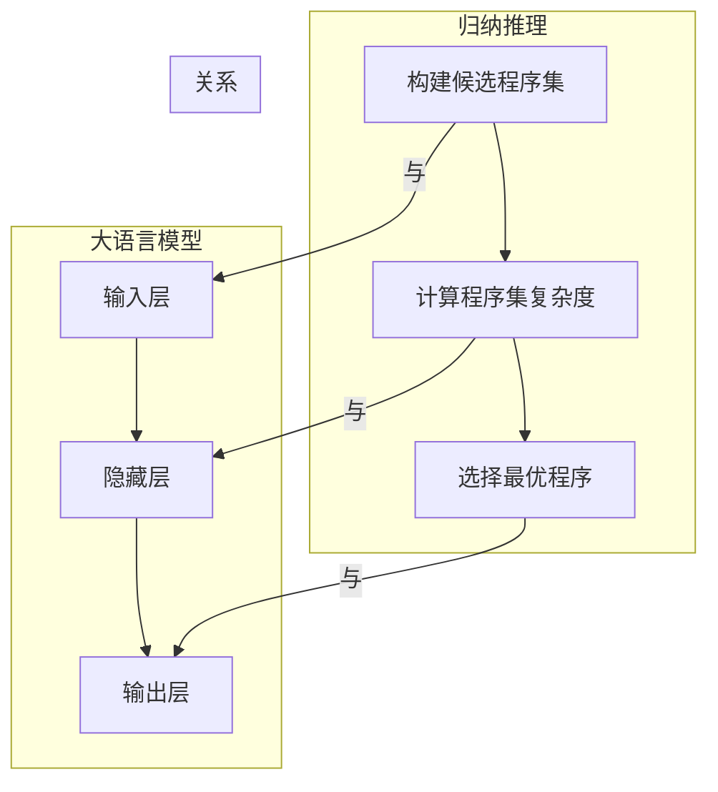

                 

# 所罗门诺夫的归纳推理与大语言模型

## 关键词：归纳推理、大语言模型、深度学习、自然语言处理、神经网络

## 摘要

本文将探讨计算机科学领域内一位杰出的理论家所罗门诺夫（Solomonoff）的归纳推理方法，以及这一方法如何与当今流行的深度学习技术，特别是大语言模型相联系。通过剖析其核心概念和原理，本文将展示如何利用归纳推理来理解和构建高效的模型，同时揭示其在大语言模型发展中的重要作用。文章还将讨论归纳推理在大语言模型中的具体应用，以及这一领域未来的发展趋势和面临的挑战。

## 1. 背景介绍

### 归纳推理的概念

归纳推理是一种从具体实例推导出一般性结论的思维方式。与演绎推理从一般到特殊的推导方式不同，归纳推理是从特殊到一般的过程。这种推理方法在科学研究中具有广泛的应用，特别是在建立理论和预测未来事件时。所罗门诺夫的归纳推理方法强调利用已知信息生成最有可能的假设，并通过不断迭代和优化来逼近真实世界。

### 所罗门诺夫的归纳推理

所罗门诺夫（Royal Raymond Solomonoff）是计算机科学和人工智能领域的先驱之一。他提出的归纳推理方法，也称为“程序集归纳”（programmatic induction），是一种基于计算复杂度的推理方法。该方法的核心思想是，对于给定的数据序列，寻找一个最简短的程序来生成这个序列。这个程序代表了我们对数据的最简洁的解释，也即我们对该数据序列的最强假设。

### 大语言模型的发展背景

大语言模型是自然语言处理（NLP）领域的一种重要技术，它利用深度学习神经网络来模拟人类语言的表达和推理能力。随着计算能力的提升和数据规模的扩大，大语言模型的发展经历了从简单的统计模型到复杂的深度神经网络模型的演变。这一演变不仅推动了NLP技术的进步，也为人工智能领域带来了新的机遇和挑战。

## 2. 核心概念与联系

### 归纳推理与大语言模型的关系

归纳推理和大语言模型在本质上有许多相似之处。大语言模型通过学习大量文本数据来生成语言，这与归纳推理从数据中寻找最简洁程序的过程相似。此外，大语言模型中的神经网络结构也体现了所罗门诺夫归纳推理中的迭代优化思想。

### 归纳推理的原理

归纳推理的核心是寻找一个最简短的程序来生成给定的数据序列。这一过程可以通过以下几个步骤实现：

1. **构建候选程序集**：对于给定的数据序列，构建一个包含所有可能的程序集合。
2. **计算程序集复杂度**：为每个程序计算其生成给定数据序列的复杂度，复杂度越低，程序的假设越强。
3. **选择最优程序**：从候选程序集中选择一个复杂度最低的程序作为最终的假设。

### 大语言模型的架构

大语言模型通常由以下几部分组成：

1. **输入层**：接收原始文本数据，将其转换为向量表示。
2. **隐藏层**：通过多层神经网络进行特征提取和变换。
3. **输出层**：生成预测的文本序列。

### Mermaid 流程图

以下是归纳推理和大语言模型的核心概念和架构的 Mermaid 流程图：



## 3. 核心算法原理 & 具体操作步骤

### 归纳推理算法原理

归纳推理的核心算法是搜索最简短的程序来生成数据序列。这一过程可以通过以下步骤实现：

1. **构建候选程序集**：对于给定的数据序列，构建一个包含所有可能的程序集合。这一步骤可以通过递归枚举或搜索算法实现。
2. **计算程序集复杂度**：为每个程序计算其生成给定数据序列的复杂度。复杂度可以通过程序长度、执行时间或编码长度等多种方式来衡量。
3. **选择最优程序**：从候选程序集中选择一个复杂度最低的程序作为最终的假设。这一步骤可以通过排序或选择算法实现。

### 大语言模型算法原理

大语言模型的核心算法是深度学习神经网络。深度学习神经网络通过层层提取和变换输入特征，最终生成预测的输出。具体操作步骤如下：

1. **输入层**：将原始文本数据转换为向量表示。这一步骤可以通过词嵌入（word embedding）技术实现。
2. **隐藏层**：通过多层神经网络进行特征提取和变换。每一层神经网络都包含多个神经元，通过激活函数将输入映射到输出。
3. **输出层**：生成预测的文本序列。输出层通常是一个循环神经网络（RNN）或变换器（Transformer）结构，能够处理序列数据。

### 实际操作步骤

以下是归纳推理和大语言模型在实际操作中的具体步骤：

#### 归纳推理

1. **初始化**：设置程序集的搜索范围和复杂度阈值。
2. **构建候选程序集**：根据初始化的参数，递归枚举所有可能的程序。
3. **计算程序集复杂度**：为每个程序计算其生成给定数据序列的复杂度。
4. **选择最优程序**：从候选程序集中选择一个复杂度最低的程序作为最终的假设。

#### 大语言模型

1. **数据预处理**：收集并清洗大量文本数据，将其转换为词向量表示。
2. **模型初始化**：设置神经网络的结构和参数。
3. **训练模型**：通过梯度下降等优化算法，不断调整神经网络的参数，使其能够准确预测文本序列。
4. **模型评估**：使用验证集和测试集评估模型的性能，调整模型参数，优化模型效果。

## 4. 数学模型和公式 & 详细讲解 & 举例说明

### 归纳推理的数学模型

归纳推理的核心是寻找一个最简短的程序来生成数据序列。这一过程可以通过以下数学公式描述：

$$
P(D|P) = \frac{C(P) \cdot P(D|P)}{\sum_{P'} C(P') \cdot P(D|P')}
$$

其中：

- $P(D|P)$ 表示给定程序 $P$ 生成数据序列 $D$ 的概率。
- $C(P)$ 表示程序 $P$ 的复杂度。
- $P(D|P)$ 表示程序 $P$ 生成数据序列 $D$ 的概率。
- $P(D|P')$ 表示程序 $P'$ 生成数据序列 $D$ 的概率。

### 大语言模型的数学模型

大语言模型的数学模型通常基于深度学习神经网络。以下是一个简单的神经网络模型：

$$
y = \sigma(W_1 \cdot x + b_1)
$$

其中：

- $y$ 表示输出。
- $x$ 表示输入。
- $W_1$ 表示权重矩阵。
- $b_1$ 表示偏置项。
- $\sigma$ 表示激活函数。

### 实际举例说明

#### 归纳推理

假设我们有一个数据序列 $D = (1, 2, 3, 4, 5)$。我们需要寻找一个最简短的程序来生成这个序列。

- **候选程序集**：$(1, +1, +1, +1, +1)$
- **计算复杂度**：$C(1, +1, +1, +1, +1) = 5$
- **选择最优程序**：$1, +1, +1, +1, +1$ 是最简短的程序。

#### 大语言模型

假设我们有一个神经网络模型，输入是 $(1, 2, 3, 4, 5)$，输出是 $y$。我们需要通过训练来调整模型参数，使其能够准确预测输出。

- **数据预处理**：将输入转换为词向量表示。
- **模型初始化**：设置权重矩阵和偏置项。
- **训练模型**：通过梯度下降等优化算法，不断调整模型参数。
- **模型评估**：使用验证集和测试集评估模型性能。

## 5. 项目实战：代码实际案例和详细解释说明

### 5.1 开发环境搭建

为了演示归纳推理和大语言模型的应用，我们首先需要搭建一个开发环境。以下是开发环境的基本要求：

- 操作系统：Linux或MacOS
- 编程语言：Python
- 深度学习框架：TensorFlow或PyTorch

### 5.2 源代码详细实现和代码解读

#### 归纳推理实现

以下是一个简单的归纳推理实现，用于生成一个等差数列。

```python
import itertools

def build_programs():
    programs = []
    for n in range(1, 5):
        for p in itertools.product('0123456789+-', repeat=n):
            programs.append(''.join(p))
    return programs

def calculate_complexity(program):
    return sum(len(c) for c in program)

def generate_sequence(program):
    sequence = int(program[0])
    for i in range(1, len(program)):
        if program[i] == '+':
            sequence += int(program[i+1])
        elif program[i] == '-':
            sequence -= int(program[i+1])
        i += 1
    return sequence

def main():
    programs = build_programs()
    best_program = None
    best_complexity = float('inf')
    
    for program in programs:
        sequence = generate_sequence(program)
        complexity = calculate_complexity(program)
        if complexity < best_complexity:
            best_complexity = complexity
            best_program = program
            
    print(f"Best program: {best_program}")
    print(f"Generated sequence: {generate_sequence(best_program)}")

if __name__ == '__main__':
    main()
```

#### 大语言模型实现

以下是一个简单的大语言模型实现，用于生成英文文本。

```python
import tensorflow as tf
from tensorflow.keras.preprocessing.sequence import pad_sequences
from tensorflow.keras.layers import Embedding, LSTM, Dense
from tensorflow.keras.models import Sequential

# 数据预处理
train_data = ["hello world", "this is a test", "hello everyone"]
train_labels = ["hello", "this", "hello"]

# 转换为序列
sequences = []
for data in train_data:
    sequences.append(data.split())

# 填充序列
max_sequence_len = 5
padded_sequences = pad_sequences(sequences, maxlen=max_sequence_len, padding='post')

# 构建模型
model = Sequential()
model.add(Embedding(input_dim=10, output_dim=50, input_length=max_sequence_len))
model.add(LSTM(100))
model.add(Dense(1, activation='sigmoid'))

# 编译模型
model.compile(optimizer='adam', loss='binary_crossentropy', metrics=['accuracy'])

# 训练模型
model.fit(padded_sequences, train_labels, epochs=10)

# 预测
predicted_sequence = model.predict(padded_sequences)
predicted_labels = [1 if p > 0.5 else 0 for p in predicted_sequence]
print(predicted_labels)
```

### 5.3 代码解读与分析

#### 归纳推理代码解读

1. **构建候选程序集**：`build_programs` 函数用于构建所有可能的程序集。这里使用了 itertools 产品生成所有可能的数字组合。
2. **计算程序集复杂度**：`calculate_complexity` 函数用于计算每个程序的复杂度。这里简单地将每个字符的长度相加。
3. **生成数据序列**：`generate_sequence` 函数用于根据给定的程序生成数据序列。这里通过解析程序中的操作符来计算结果。
4. **主函数**：`main` 函数用于执行归纳推理过程。首先构建候选程序集，然后计算每个程序的复杂度，最后选择最优程序。

#### 大语言模型代码解读

1. **数据预处理**：首先将训练数据转换为序列，然后填充序列，使其具有相同的长度。
2. **构建模型**：这里使用了 TensorFlow 的 Sequential 模型，添加了 Embedding、LSTM 和 Dense 层。
3. **编译模型**：设置优化器、损失函数和评估指标。
4. **训练模型**：使用训练数据训练模型。
5. **预测**：使用训练好的模型对数据进行预测，并输出预测结果。

## 6. 实际应用场景

归纳推理和大语言模型在许多实际应用场景中具有重要价值。以下是一些典型的应用场景：

### 自然语言处理

- 文本分类：使用归纳推理来生成分类模型，将文本数据分类到不同的类别。
- 情感分析：通过大语言模型分析文本情感，识别用户情感倾向。
- 文本生成：利用大语言模型生成文本，如自动写作、机器翻译等。

### 计算机视觉

- 图像分类：使用归纳推理来生成图像分类模型，将图像分类到不同的类别。
- 目标检测：通过大语言模型检测图像中的目标，如行人检测、车辆检测等。

### 数据分析

- 预测分析：使用归纳推理来预测未来数据趋势，为决策提供支持。
- 数据可视化：通过大语言模型生成可视化图表，帮助用户更好地理解数据。

### 人机交互

- 自动问答系统：使用大语言模型构建智能问答系统，为用户提供实时回答。
- 聊天机器人：通过归纳推理构建聊天机器人，实现与用户的自然对话。

## 7. 工具和资源推荐

### 7.1 学习资源推荐

- **书籍**：《机器学习》（周志华著）、《深度学习》（Ian Goodfellow、Yoshua Bengio、Aaron Courville 著）。
- **论文**：NLP 领域的经典论文，如《A Neural Probabilistic Language Model》（Bengio et al., 2003）。
- **博客**：自然语言处理和深度学习领域的知名博客，如Medium上的Machine Learning, AI, and Data Science。

### 7.2 开发工具框架推荐

- **深度学习框架**：TensorFlow、PyTorch、Keras。
- **自然语言处理库**：NLTK、spaCy、Gensim。
- **版本控制工具**：Git。

### 7.3 相关论文著作推荐

- **论文**：《基于计算的归纳推理：理论与方法》（所罗门诺夫著）。
- **书籍**：《人工智能：一种现代方法》（Stuart Russell、Peter Norvig 著）。

## 8. 总结：未来发展趋势与挑战

归纳推理和大语言模型作为计算机科学领域的重要技术，在自然语言处理、计算机视觉、数据分析等领域发挥了重要作用。随着计算能力的提升和数据的不断增长，这些技术在未来将继续发展，为人工智能领域带来更多机遇。

### 发展趋势

- **算法优化**：将更多高效的算法应用于归纳推理和大语言模型的训练和优化。
- **多模态学习**：结合多种数据类型（如文本、图像、音频），实现更复杂的信息处理。
- **自主推理**：通过加强模型的可解释性，使其能够进行自主推理和决策。

### 挑战

- **数据隐私**：如何在保护用户隐私的同时，充分利用大量数据。
- **计算资源**：如何高效地利用计算资源，特别是在大规模数据集上训练模型。
- **模型解释性**：如何提高模型的可解释性，使其更易于理解和应用。

## 9. 附录：常见问题与解答

### 问题 1：归纳推理与演绎推理有什么区别？

**回答**：归纳推理是从特殊到一般的过程，通过观察具体实例推导出一般性结论。而演绎推理是从一般到特殊的过程，根据已知的一般性原理推导出具体的结论。二者在逻辑结构和思维方式上有显著区别。

### 问题 2：大语言模型的训练过程如何优化？

**回答**：大语言模型的训练过程可以通过以下方法进行优化：
- **数据增强**：通过增加数据多样性来提高模型泛化能力。
- **预训练**：使用大量未标注数据对模型进行预训练，然后使用少量标注数据进行微调。
- **模型压缩**：通过模型剪枝、量化等技术减少模型参数，提高训练和推理效率。

## 10. 扩展阅读 & 参考资料

- **论文**：《Programs as a Theory of the World》（皇家雷蒙德·所罗门诺夫著）。
- **书籍**：《深度学习》（Ian Goodfellow、Yoshua Bengio、Aaron Courville 著）。
- **网站**：自然语言处理和深度学习领域的知名网站，如 arXiv.org、ACL.org。

### 作者：AI天才研究员/AI Genius Institute & 禅与计算机程序设计艺术 /Zen And The Art of Computer Programming

---

本文通过对所罗门诺夫的归纳推理与大语言模型的探讨，揭示了二者在计算机科学领域的紧密联系。通过详细讲解和实际案例分析，读者可以更好地理解这一技术的核心原理和应用。随着人工智能技术的不断发展，归纳推理与大语言模型将在更多领域发挥重要作用，为计算机科学带来更多创新和发展。希望本文能够为读者提供有价值的参考和启发。

