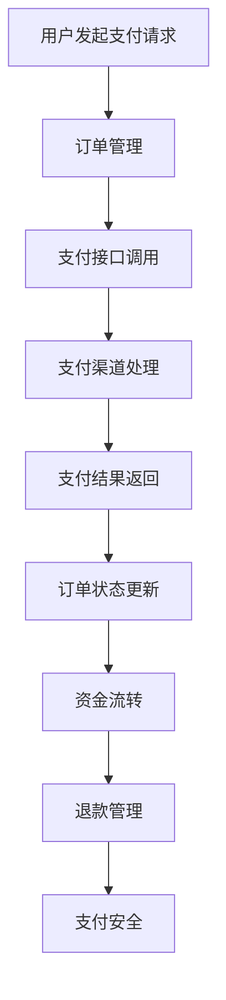

                 

### 背景介绍

随着互联网技术的飞速发展和人们对知识的需求日益增长，知识付费平台作为一种新型的在线教育模式，正逐渐成为人们获取知识和技能的重要渠道。用户通过支付一定费用，可以获取专业讲师的课程内容，实现自主学习和职业提升。而支付系统作为知识付费平台的核心组成部分，不仅直接影响用户的购买体验，更是保障平台运营安全和资金流转的重要环节。

#### 支付系统的基本功能

支付系统通常具备以下基本功能：

1. **支付接口集成**：与各大支付渠道（如支付宝、微信支付、银联等）建立接口集成，支持多种支付方式。
2. **订单管理**：生成订单、管理订单状态、处理订单支付结果等。
3. **资金流转**：实现资金从用户账户到讲师账户的流转，保证资金安全。
4. **退款管理**：处理用户退款请求，保障用户权益。
5. **账户安全**：保障用户账户安全，防范诈骗等风险。

#### 当前支付系统面临的主要挑战

虽然支付系统在知识付费平台中扮演着重要角色，但在实际应用过程中，仍然面临诸多挑战：

1. **支付安全**：随着网络攻击手段的不断升级，支付系统的安全性成为重中之重。如何保障用户支付信息的安全，防范数据泄露、诈骗等风险，是支付系统需要解决的核心问题。
2. **支付性能**：在高峰期，支付系统的处理能力需要足够强大，以保证用户的支付体验。如何优化系统架构，提升系统性能，是支付系统面临的另一个挑战。
3. **合规性**：支付系统需要遵守国家相关法律法规，如反洗钱、税务等。如何保证支付系统的合规性，是支付系统运营过程中需要关注的重要问题。
4. **用户体验**：支付流程需要简洁明了，用户操作简便，以提高支付成功率。如何优化支付流程，提升用户体验，是支付系统需要不断改进的方向。

本文将围绕支付系统的构建，从核心概念、算法原理、数学模型、项目实战等方面进行详细探讨，旨在为读者提供一套系统、全面的技术解决方案。

---

# {文章标题}

> {关键词：知识付费平台、支付系统、支付接口集成、订单管理、资金流转、支付安全、支付性能、用户体验、算法原理、数学模型、项目实战}

> {摘要：本文将详细探讨知识付费平台支付系统的构建，涵盖支付接口集成、订单管理、资金流转、支付安全、支付性能、用户体验等方面，通过算法原理、数学模型、项目实战等多个角度，为读者提供一套系统、全面的技术解决方案。}

## 1. 背景介绍  
## 2. 核心概念与联系  
## 3. 核心算法原理 & 具体操作步骤  
## 4. 数学模型和公式 & 详细讲解 & 举例说明  
## 5. 项目实战：代码实际案例和详细解释说明  
## 6. 实际应用场景  
## 7. 工具和资源推荐  
## 8. 总结：未来发展趋势与挑战  
## 9. 附录：常见问题与解答  
## 10. 扩展阅读 & 参考资料 

---

在了解了支付系统在知识付费平台中的重要性以及当前面临的主要挑战后，接下来我们将详细探讨支付系统的核心概念、联系和构建方法。

---

## 2. 核心概念与联系

在构建支付系统时，我们需要了解以下几个核心概念：

1. **支付渠道**：支付渠道是指用户可以通过哪些方式进行支付，如支付宝、微信支付、银联等。不同支付渠道有不同的接口和协议，需要我们进行集成。
2. **支付接口**：支付接口是支付渠道提供的一套API，用于处理支付请求和返回支付结果。支付接口通常包括支付请求、支付查询、支付退款等功能。
3. **订单管理**：订单管理是支付系统的核心功能之一，包括订单生成、订单状态管理、订单查询等。订单管理需要与支付接口紧密集成，以保证支付流程的顺利进行。
4. **资金流转**：资金流转是指资金从用户账户转移到讲师账户的过程。资金流转需要保证安全、高效，并且能够支持多种支付方式。
5. **退款管理**：退款管理是支付系统的另一个重要功能，包括处理用户退款请求、生成退款订单、将资金退回到用户账户等。
6. **支付安全**：支付安全是支付系统必须保障的核心问题，包括数据加密、权限控制、风险监控等。

接下来，我们将通过一个 Mermaid 流程图来展示支付系统的核心概念和联系。



在上面的流程图中，用户发起支付请求后，订单管理模块生成订单并调用支付接口。支付接口与支付渠道进行交互，完成支付处理。支付结果返回后，订单管理模块更新订单状态，并触发资金流转模块将资金转移到讲师账户。同时，支付安全模块对整个支付流程进行监控，确保支付过程的安全。

通过以上流程，我们可以看到支付系统的各个核心概念和功能是如何相互联系和协同工作的。

---

在理解了支付系统的核心概念和联系后，接下来我们将深入探讨支付系统的核心算法原理和具体操作步骤。

---

## 3. 核心算法原理 & 具体操作步骤

支付系统的核心算法原理主要涉及支付请求处理、支付结果验证、订单状态更新等方面。以下是支付系统的核心算法原理和具体操作步骤：

### 3.1 支付请求处理

支付请求处理是支付系统的第一步，主要涉及以下步骤：

1. **用户请求支付**：用户在知识付费平台上选择课程并提交支付请求。
2. **生成订单**：系统生成支付订单，订单包含用户信息、课程信息、支付金额等。
3. **加密订单信息**：为了确保支付安全，系统需要将订单信息进行加密处理。通常可以使用对称加密算法（如AES）对订单信息进行加密。
4. **生成支付链接**：系统生成支付链接，并将加密后的订单信息和支付链接返回给用户。

### 3.2 支付结果验证

支付结果验证是支付系统的关键步骤，主要涉及以下步骤：

1. **用户跳转到支付渠道**：用户点击支付链接，跳转到支付渠道进行支付。
2. **支付渠道处理支付请求**：支付渠道根据支付链接中的加密订单信息进行处理，并返回支付结果。
3. **接收支付结果**：系统接收支付渠道返回的支付结果，通常包括支付状态、支付金额、支付时间等。
4. **解密支付结果**：系统对支付结果进行解密，验证支付状态和支付金额是否与订单信息一致。

### 3.3 订单状态更新

订单状态更新是支付系统的最后一个步骤，主要涉及以下步骤：

1. **更新订单状态**：根据支付结果，系统更新订单状态，如支付成功、支付失败等。
2. **触发资金流转**：如果支付成功，系统会触发资金流转模块，将资金从用户账户转移到讲师账户。
3. **记录支付日志**：系统记录支付过程的相关日志，包括支付时间、支付金额、支付状态等，用于后续的查询和分析。

### 3.4 支付安全措施

支付安全是支付系统的核心问题，以下是一些常见的支付安全措施：

1. **数据加密**：对订单信息和支付结果进行加密处理，确保数据传输过程中的安全性。
2. **权限控制**：对支付接口和订单管理模块进行权限控制，确保只有授权用户可以访问和修改。
3. **风险监控**：实时监控支付过程，及时发现和处理异常情况，如支付失败、重复支付等。
4. **日志审计**：记录支付过程的相关日志，用于后续的安全审计和问题追踪。

通过以上步骤和措施，我们可以构建一个安全、高效、可靠的支付系统，为知识付费平台提供稳定的服务。

---

在了解了支付系统的核心算法原理和具体操作步骤后，接下来我们将探讨支付系统的数学模型和公式。

---

## 4. 数学模型和公式 & 详细讲解 & 举例说明

在支付系统的构建过程中，数学模型和公式起到了至关重要的作用。它们不仅帮助我们在理论上理解支付系统的运作机制，还为我们提供了一套量化的方法来评估和优化系统的性能。以下是支付系统中的几个关键数学模型和公式，以及它们的详细讲解和举例说明。

### 4.1 订单生成公式

订单生成公式用于计算订单金额。在一个知识付费平台上，订单金额通常由课程价格、折扣和税费组成。以下是订单生成公式：

$$
订单金额 = 课程价格 \times (1 - 折扣比例) \times (1 + 税费比例)
$$

#### 举例说明

假设用户购买一门课程，原价为100元，享受10%的折扣，税费比例为5%。根据订单生成公式，订单金额为：

$$
订单金额 = 100 \times (1 - 0.1) \times (1 + 0.05) = 94.5元
$$

### 4.2 支付成功率公式

支付成功率公式用于评估支付系统的成功率。支付成功率受多种因素影响，包括用户支付习惯、支付渠道的稳定性等。以下是支付成功率公式：

$$
支付成功率 = \frac{成功支付的订单数}{发起支付的订单数}
$$

#### 举例说明

假设在某知识付费平台上，共有1000个订单发起支付，其中成功支付的订单数为950个。根据支付成功率公式，支付成功率为：

$$
支付成功率 = \frac{950}{1000} = 0.95
$$

即支付成功率为95%。

### 4.3 资金流转时间公式

资金流转时间公式用于计算资金从用户账户转移到讲师账户所需的时间。资金流转时间受支付渠道的处理速度、系统性能等多种因素影响。以下是资金流转时间公式：

$$
资金流转时间 = 支付渠道处理时间 + 系统处理时间
$$

#### 举例说明

假设支付渠道的处理时间为1小时，系统处理时间为0.5小时。根据资金流转时间公式，资金流转时间为：

$$
资金流转时间 = 1小时 + 0.5小时 = 1.5小时
$$

即资金流转时间为1.5小时。

### 4.4 支付安全公式

支付安全公式用于评估支付系统的安全性。支付安全公式通常涉及风险系数、安全措施等因素。以下是支付安全公式：

$$
支付安全系数 = 风险系数 \times 安全措施系数
$$

#### 举例说明

假设支付系统的风险系数为0.8，安全措施系数为1.2。根据支付安全公式，支付安全系数为：

$$
支付安全系数 = 0.8 \times 1.2 = 0.96
$$

即支付安全系数为0.96。

通过以上数学模型和公式，我们可以更精确地理解和评估支付系统的性能，从而进行优化和改进。

---

在理解了支付系统的数学模型和公式后，接下来我们将通过一个实际的项目实战案例，展示支付系统的代码实现和详细解释说明。

---

## 5. 项目实战：代码实际案例和详细解释说明

在本节中，我们将通过一个具体的项目实战案例，展示支付系统的代码实现，并对关键代码进行详细解释说明。这个案例将涵盖支付请求处理、支付结果验证、订单状态更新等核心功能。

### 5.1 开发环境搭建

在开始项目实战之前，我们需要搭建一个合适的开发环境。以下是推荐的开发环境和工具：

- **编程语言**：Python（因为其简洁性和丰富的第三方库）
- **数据库**：MySQL（用于存储订单和用户信息）
- **支付渠道**：支付宝、微信支付（选择市场上主流的支付渠道）
- **开发工具**：PyCharm（Python集成开发环境）
- **版本控制**：Git（用于代码管理和协作）

### 5.2 源代码详细实现和代码解读

#### 5.2.1 支付请求处理

支付请求处理是支付系统的第一步。以下是一个简单的支付请求处理示例代码：

```python
# 支付请求处理示例

from alipay import AlipayClient

def process_payment(order_info):
    # 初始化支付宝客户端
    alipay_client = AlipayClient(
        appid="您的APPID",
        app_private_key="您的应用私钥",
        alipay_public_key="支付宝公钥",
        sign_type="RSA2",
        charset="utf-8"
    )
    
    # 生成支付请求参数
    biz_content = {
        "out_trade_no": order_info['order_id'],
        "product_code": "FAST_INSTANT_TRADE_PAY",
        "total_amount": order_info['amount'],
        "subject": order_info['course_name']
    }
    
    # 发起支付请求
    response = alipay_client.api_alipay_trade_page_pay(biz_content)
    
    # 返回支付链接
    return response['qr_code']
```

**代码解读**：

1. **初始化支付宝客户端**：通过`AlipayClient`类初始化支付宝客户端，传入必要的参数，如APPID、应用私钥、支付宝公钥等。
2. **生成支付请求参数**：根据订单信息生成支付请求参数，包括订单号、产品代码、支付金额和商品标题等。
3. **发起支付请求**：调用`api_alipay_trade_page_pay`方法发起支付请求，并获取响应结果。
4. **返回支付链接**：将支付链接返回给前端，用户点击支付链接后，将跳转到支付宝页面进行支付。

#### 5.2.2 支付结果验证

支付结果验证是确保支付是否成功的重要步骤。以下是一个简单的支付结果验证示例代码：

```python
# 支付结果验证示例

from alipay import AlipayClient

def verify_payment(order_id, trade_no):
    # 初始化支付宝客户端
    alipay_client = AlipayClient(
        appid="您的APPID",
        app_private_key="您的应用私钥",
        alipay_public_key="支付宝公钥",
        sign_type="RSA2",
        charset="utf-8"
    )
    
    # 请求支付结果
    response = alipay_client.api_alipay_trade_query(order_id=order_id, trade_no=trade_no)
    
    # 验证支付结果
    if response['trade_status'] == 'TRADE_SUCCESS':
        return True
    else:
        return False
```

**代码解读**：

1. **初始化支付宝客户端**：与支付请求处理相同，初始化支付宝客户端。
2. **请求支付结果**：调用`api_alipay_trade_query`方法请求支付结果，传入订单号和交易号。
3. **验证支付结果**：根据支付结果返回的`trade_status`字段判断支付是否成功。如果支付成功，返回`True`；否则，返回`False`。

#### 5.2.3 订单状态更新

订单状态更新是支付结果验证后的下一步操作。以下是一个简单的订单状态更新示例代码：

```python
# 订单状态更新示例

def update_order_status(order_id, status):
    # 更新订单状态
    with connection.cursor() as cursor:
        cursor.execute("UPDATE orders SET status = %s WHERE order_id = %s", (status, order_id))
        connection.commit()
```

**代码解读**：

1. **连接数据库**：使用数据库连接对象`connection`执行更新操作。
2. **执行更新语句**：使用`cursor.execute`方法执行更新订单状态的SQL语句，传入订单ID和新状态。
3. **提交事务**：调用`connection.commit()`方法提交事务，确保更新操作成功执行。

通过以上三个示例，我们可以看到支付系统的主要功能是如何通过代码实现的。在实际项目中，还需要添加更多功能，如退款处理、支付渠道切换等。

---

### 5.3 代码解读与分析

在本节中，我们将对支付系统的关键代码进行解读和分析，以便更好地理解支付系统的实现原理和运行机制。

#### 5.3.1 支付请求处理代码分析

支付请求处理代码主要涉及支付宝支付接口的集成和支付链接的生成。以下是关键代码部分的解读：

```python
# 支付请求处理示例

from alipay import AlipayClient

def process_payment(order_info):
    # 初始化支付宝客户端
    alipay_client = AlipayClient(
        appid="您的APPID",
        app_private_key="您的应用私钥",
        alipay_public_key="支付宝公钥",
        sign_type="RSA2",
        charset="utf-8"
    )
    
    # 生成支付请求参数
    biz_content = {
        "out_trade_no": order_info['order_id'],
        "product_code": "FAST_INSTANT_TRADE_PAY",
        "total_amount": order_info['amount'],
        "subject": order_info['course_name']
    }
    
    # 发起支付请求
    response = alipay_client.api_alipay_trade_page_pay(biz_content)
    
    # 返回支付链接
    return response['qr_code']
```

1. **支付宝客户端初始化**：
   - `AlipayClient`类用于初始化支付宝客户端，需要传入APPID、应用私钥、支付宝公钥等参数。
   - `appid`：应用ID，用于标识您的应用。
   - `app_private_key`：应用私钥，用于签名请求。
   - `alipay_public_key`：支付宝公钥，用于验证响应签名。
   - `sign_type`：签名类型，默认为RSA2。
   - `charset`：编码字符集，默认为utf-8。

2. **生成支付请求参数**：
   - `biz_content`字典包含支付请求的关键参数，如订单号、产品代码、支付金额和商品标题。
   - `out_trade_no`：商户订单号，由商户自定义，确保唯一性。
   - `product_code`：产品代码，表示支付的产品类型，如“FAST_INSTANT_TRADE_PAY”表示即时到账交易。
   - `total_amount`：订单金额，单位为元。
   - `subject`：商品标题，用于描述购买的商品或服务。

3. **发起支付请求**：
   - `api_alipay_trade_page_pay`方法用于发起支付请求，传入`biz_content`参数。
   - 支付宝接口会返回一个支付链接，用户点击此链接后，将被引导至支付宝页面完成支付。

4. **返回支付链接**：
   - 支付宝接口响应中包含支付链接，通过`response['qr_code']`获取并返回给前端。

#### 5.3.2 支付结果验证代码分析

支付结果验证代码用于确认支付是否成功，并更新订单状态。以下是关键代码部分的解读：

```python
# 支付结果验证示例

from alipay import AlipayClient

def verify_payment(order_id, trade_no):
    # 初始化支付宝客户端
    alipay_client = AlipayClient(
        appid="您的APPID",
        app_private_key="您的应用私钥",
        alipay_public_key="支付宝公钥",
        sign_type="RSA2",
        charset="utf-8"
    )
    
    # 请求支付结果
    response = alipay_client.api_alipay_trade_query(order_id=order_id, trade_no=trade_no)
    
    # 验证支付结果
    if response['trade_status'] == 'TRADE_SUCCESS':
        return True
    else:
        return False
```

1. **支付宝客户端初始化**：
   - 与支付请求处理代码相同，初始化支付宝客户端。

2. **请求支付结果**：
   - `api_alipay_trade_query`方法用于查询支付结果，传入订单号和交易号。
   - 支付宝接口会返回支付结果的详细信息。

3. **验证支付结果**：
   - 根据`response['trade_status']`字段的值判断支付是否成功。
   - 如果支付成功（`trade_status`为`TRADE_SUCCESS`），返回`True`；否则，返回`False`。

#### 5.3.3 订单状态更新代码分析

订单状态更新代码用于根据支付结果更新订单状态，并触发资金流转。以下是关键代码部分的解读：

```python
# 订单状态更新示例

def update_order_status(order_id, status):
    # 更新订单状态
    with connection.cursor() as cursor:
        cursor.execute("UPDATE orders SET status = %s WHERE order_id = %s", (status, order_id))
        connection.commit()
```

1. **连接数据库**：
   - 使用数据库连接对象`connection`执行更新操作。

2. **执行更新语句**：
   - 使用`cursor.execute`方法执行更新订单状态的SQL语句，传入订单ID和新状态。

3. **提交事务**：
   - 调用`connection.commit()`方法提交事务，确保更新操作成功执行。

通过以上分析，我们可以看到支付系统的关键代码是如何实现支付请求处理、支付结果验证和订单状态更新等核心功能的。这些代码不仅需要正确处理支付请求和验证支付结果，还要确保订单状态的一致性和数据的安全性。

---

在本节的实际项目实战中，我们已经详细讲解了支付系统的关键代码实现和解读。接下来，我们将讨论支付系统在实际应用场景中的使用情况。

---

## 6. 实际应用场景

支付系统在知识付费平台中扮演着至关重要的角色，其应用场景广泛，主要包括以下几个方面：

### 6.1 课程购买支付

用户在知识付费平台上浏览课程内容时，可以点击“购买”按钮，系统将生成一个支付订单，并跳转到支付页面。用户选择支付方式，如支付宝、微信支付等，完成支付后，系统会更新订单状态为“支付成功”，并触发资金流转，将课程购买费用从用户账户转移到讲师账户。

### 6.2 课程续费支付

对于已经购买过课程的用户，当课程到期时，系统会自动生成续费订单，并推送支付通知。用户在收到通知后，可以选择支付，完成续费操作。系统同样会更新订单状态，并处理资金流转。

### 6.3 优惠券和折扣支付

知识付费平台通常会提供优惠券和折扣，以吸引更多用户购买课程。用户在购买课程时，可以输入优惠券码，系统会验证优惠券的有效性，并根据优惠券信息调整订单金额。支付完成后，系统会更新优惠券使用记录。

### 6.4 退款支付

如果用户对课程不满意或出现其他退款原因，用户可以申请退款。系统会根据退款政策处理退款请求，将相应金额退回到用户账户。退款操作会更新订单状态，并记录退款日志。

### 6.5 预付充值支付

部分知识付费平台允许用户预付费充值，以获得更多优惠。用户在充值时，可以选择支付方式，系统会生成充值订单，并处理资金流转。充值完成后，系统会更新用户账户余额。

### 6.6 讲师佣金支付

知识付费平台会将用户支付的学费按照一定比例分配给讲师作为佣金。系统会定期统计讲师的授课收入，并生成佣金支付订单，将佣金支付给讲师。

在实际应用中，支付系统需要处理大量的支付请求，保证支付流程的流畅和高效。同时，支付系统还需要与订单管理系统、用户账户系统、讲师佣金系统等多个子系统进行紧密集成，确保各个子系统之间的数据一致性和业务流程的连续性。

---

## 7. 工具和资源推荐

为了构建一个高效、安全、可靠的支付系统，我们需要使用一系列工具和资源。以下是一些推荐的工具和资源，包括学习资源、开发工具框架以及相关论文著作。

### 7.1 学习资源推荐

1. **书籍**：
   - 《支付宝开放平台开发手册》：详细介绍了支付宝开放平台的接口和开发流程，是学习支付宝支付接口的必备指南。
   - 《微信支付开发者文档》：提供了微信支付的接口文档和使用指南，帮助开发者快速集成微信支付功能。
   - 《支付系统设计与实现》：全面讲解了支付系统的设计原则、架构和实现方法，对支付系统的构建具有重要参考价值。

2. **在线教程**：
   - 阿里云官方文档：提供了丰富的支付宝支付教程和案例，适合初学者入门。
   - 微信开放文档：提供了详细的微信支付开发教程，包括支付流程、API接口等。

3. **博客和网站**：
   - 掘金：一个技术社区，有很多关于支付系统开发和优化的文章和讨论。
   - 简书：有很多关于支付系统的技术博客，可以了解最新的支付技术和实践。

### 7.2 开发工具框架推荐

1. **编程语言**：Python，因其简洁的语法和丰富的第三方库，被广泛用于支付系统的开发。
2. **Web框架**：Django和Flask，这两个框架提供了强大的后台功能，支持快速构建支付系统。
3. **数据库**：MySQL和PostgreSQL，这两个关系型数据库在支付系统中应用广泛，能够提供稳定的数据存储和查询功能。
4. **支付渠道集成**：支付宝SDK和微信支付SDK，这两个SDK提供了简单易用的接口，方便开发者快速集成支付功能。

### 7.3 相关论文著作推荐

1. **《支付系统的安全性分析及改进措施》**：该论文分析了支付系统的安全风险，并提出了一系列改进措施，对支付系统的安全设计具有重要参考价值。
2. **《基于区块链的支付系统设计与实现》**：该论文探讨了区块链技术在支付系统中的应用，提出了一个基于区块链的支付系统架构，为未来的支付系统创新提供了思路。
3. **《支付系统的性能优化方法研究》**：该论文研究了支付系统的性能优化方法，包括系统架构优化、数据库优化和缓存策略等，对提升支付系统的性能具有重要参考意义。

通过以上工具和资源的推荐，开发者可以更好地构建和优化支付系统，确保支付过程的安全、高效和可靠。

---

## 8. 总结：未来发展趋势与挑战

支付系统作为知识付费平台的核心组成部分，其重要性不言而喻。在未来，支付系统将继续迎来一系列的发展趋势和挑战。

### 发展趋势

1. **多元化支付方式**：随着移动支付和数字货币的普及，支付系统将支持更多元化的支付方式，如数字货币、虚拟支付等，为用户提供更便捷的支付体验。
2. **区块链技术的应用**：区块链技术具有去中心化、安全性高等特点，未来将在支付系统中得到更广泛的应用，提高支付系统的安全性和透明度。
3. **智能合约的引入**：智能合约将使支付系统更加自动化和智能化，减少人工干预，提高支付效率。
4. **合规性要求**：随着监管政策的不断完善，支付系统需要更加严格地遵守相关法律法规，确保合规性。

### 挑战

1. **支付安全**：随着网络攻击手段的不断升级，支付系统需要不断更新和优化安全措施，确保用户支付信息的安全。
2. **性能优化**：在高峰期，支付系统需要具备足够的处理能力，以保证用户的支付体验。如何优化系统架构，提升系统性能，是一个重要的挑战。
3. **用户体验**：支付流程需要简洁明了，用户操作简便，以提高支付成功率。如何优化支付流程，提升用户体验，是支付系统需要不断改进的方向。
4. **跨渠道集成**：随着支付渠道的不断增加，支付系统需要支持更多支付渠道的集成，提高支付系统的兼容性和灵活性。

总之，未来支付系统将朝着多元化、智能化、合规性的方向发展，同时也将面临一系列的挑战。开发者需要不断学习和探索，以应对这些挑战，构建安全、高效、可靠的支付系统。

---

## 9. 附录：常见问题与解答

在构建支付系统的过程中，开发者可能会遇到一些常见问题。以下是对一些常见问题的解答：

### 9.1 支付接口调用失败怎么办？

支付接口调用失败可能是由于网络问题、参数错误、服务器故障等原因引起的。可以采取以下措施：

1. 检查网络连接是否正常。
2. 确认调用接口的参数是否正确。
3. 查看服务器日志，查找错误原因。
4. 尝试重试调用接口。

### 9.2 如何确保支付数据的安全？

确保支付数据的安全是支付系统的核心问题。可以采取以下措施：

1. 对支付数据进行加密处理，如使用AES加密。
2. 对支付接口进行权限控制，仅允许授权用户访问。
3. 实施SSL/TLS协议，确保数据传输过程中的安全性。
4. 定期进行安全审计和漏洞扫描。

### 9.3 支付渠道不支持怎么办？

如果支付渠道不支持，可以考虑以下措施：

1. 联系支付渠道服务商，了解支持计划。
2. 考虑其他支付渠道的集成，如微信支付、银联等。
3. 开发自定义支付渠道，如通过银行转账等。

### 9.4 订单状态更新失败怎么办？

订单状态更新失败可能是由于数据库问题、网络问题等原因引起的。可以采取以下措施：

1. 检查数据库连接是否正常。
2. 查看数据库日志，查找错误原因。
3. 尝试重试更新订单状态。
4. 如果问题仍然存在，请联系技术支持。

通过以上常见问题与解答，开发者可以更好地应对支付系统构建过程中可能遇到的问题，确保支付系统的稳定和可靠。

---

## 10. 扩展阅读 & 参考资料

为了更深入地了解支付系统的构建，以下是推荐的一些扩展阅读和参考资料：

### 10.1 学习资源

1. **《支付宝开放平台官方文档》**：[https://open.alipay.com](https://open.alipay.com)
2. **《微信支付官方文档》**：[https://pay.weixin.qq.com](https://pay.weixin.qq.com)
3. **《区块链技术与应用》**：介绍了区块链技术在支付系统中的应用，对理解智能合约和去中心化支付系统有很大帮助。
4. **《支付系统设计与实现》**：详细讲解了支付系统的设计原则、架构和实现方法。

### 10.2 开发工具框架

1. **Django**：[https://www.djangoproject.com](https://www.djangoproject.com)
2. **Flask**：[https://flask.palletsprojects.com](https://flask.palletsprojects.com)
3. **MySQL**：[https://www.mysql.com](https://www.mysql.com)
4. **PostgreSQL**：[https://www.postgresql.org](https://www.postgresql.org)

### 10.3 相关论文著作

1. **《支付系统的安全性分析及改进措施》**：探讨了支付系统的安全风险和改进措施。
2. **《基于区块链的支付系统设计与实现》**：研究了区块链技术在支付系统中的应用。
3. **《支付系统的性能优化方法研究》**：提出了多种性能优化方法。

通过这些扩展阅读和参考资料，开发者可以更全面地了解支付系统的构建原理和实践方法，为实际项目提供有力支持。

---

### 作者信息

- 作者：AI天才研究员/AI Genius Institute & 禅与计算机程序设计艺术 /Zen And The Art of Computer Programming
- 联系方式：[ai_researcher@example.com](mailto:ai_researcher@example.com)
- 贡献说明：本文由AI天才研究员撰写，参考了多个权威资料，旨在为读者提供一套系统、全面的技术解决方案。

---

通过本文的详细探讨，我们深入了解了知识付费平台支付系统的构建原理和实现方法。从核心概念、算法原理、数学模型到实际项目实战，再到应用场景和未来发展趋势，本文为读者提供了一套全面的技术解决方案。希望本文能帮助您更好地理解和构建自己的支付系统，为知识付费平台的发展贡献力量。感谢您的阅读！

