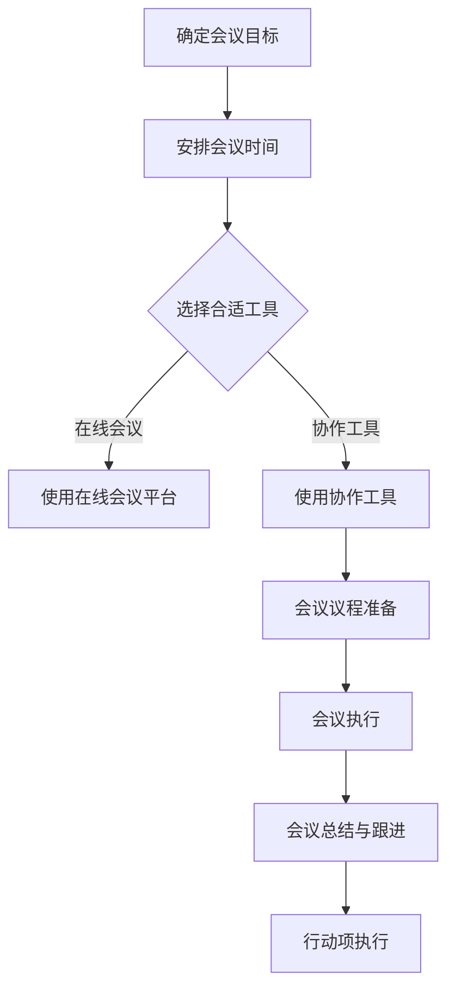

                 

# 打造高效会议文化：提升团队沟通效率

## >关键词：（高效会议文化、团队沟通效率、团队协作、沟通技巧、时间管理、项目管理、团队协作工具）

> **摘要：**
本文将探讨如何打造高效会议文化，提高团队沟通效率。通过分析会议文化的核心要素，我们提出了一系列优化会议流程和团队沟通的具体措施，旨在为团队协作提供有益的指导。

## 1. 背景介绍

在当今快速变化和竞争激烈的商业环境中，团队协作和沟通效率变得至关重要。高效会议文化作为一种团队管理策略，有助于提升团队的工作效率，减少无效沟通，确保项目的顺利进行。然而，许多团队在会议中面临诸多挑战，如会议时间过长、沟通不畅、目标不明确等，这些问题严重影响了团队的工作效率。

本文旨在解决上述问题，通过深入分析高效会议文化的核心要素，提供一系列实用的优化措施，帮助团队打造高效的会议文化，提升沟通效率。

### 1.1 高效会议文化的重要性

高效会议文化能够带来以下几方面的好处：

- **提高工作效率**：通过优化会议流程和沟通方式，减少冗余会议，使团队成员能够专注于核心工作。
- **增强团队协作**：明确会议目标，确保团队成员在会议中充分发挥各自的专业能力，共同解决问题。
- **提升决策质量**：通过有效的沟通和协作，提高团队在项目决策过程中的准确性和效率。
- **培养良好的工作氛围**：高效的会议文化有助于营造积极向上的工作氛围，增强团队成员的归属感和凝聚力。

### 1.2 本文的目标

本文将围绕以下目标展开：

- **分析高效会议文化的核心要素**：探讨会议文化中的关键要素，如会议目标、沟通技巧、时间管理等。
- **提出优化措施**：针对团队在会议中遇到的具体问题，提出一系列优化会议流程和沟通效率的措施。
- **提供实际案例**：通过实际案例，展示如何应用这些优化措施，提高团队沟通效率。

## 2. 核心概念与联系

为了打造高效会议文化，我们需要理解以下几个核心概念：

### 2.1 会议目标

会议目标是指会议的预期成果和目的。明确会议目标是打造高效会议文化的基础。一个明确的会议目标有助于：

- **聚焦会议内容**：确保会议围绕核心议题展开，避免偏离主题。
- **提高会议效率**：明确的目标可以缩短会议时间，避免冗长的讨论。
- **提高决策质量**：围绕目标进行讨论，有助于团队成员达成共识，做出更准确的决策。

### 2.2 沟通技巧

沟通技巧是团队沟通效率的重要保障。有效的沟通技巧包括：

- **倾听**：积极倾听团队成员的意见，确保每个人都能够表达自己的想法。
- **表达清晰**：用简洁明了的语言表达观点，避免使用专业术语或模糊表述。
- **非语言沟通**：注意肢体语言、面部表情等非语言因素，增强沟通效果。

### 2.3 时间管理

时间管理是高效会议文化的关键。良好的时间管理包括：

- **会议时间安排**：合理安排会议时间，避免与工作时间冲突。
- **会议时间控制**：确保会议在预定时间内完成，避免拖延。
- **会议后续跟进**：及时总结会议成果，确保行动项得到有效执行。

### 2.4 团队协作工具

团队协作工具是提高会议效率的重要手段。常见的团队协作工具有：

- **会议日程管理工具**：如 Microsoft Outlook、Google Calendar 等，帮助团队合理安排会议时间。
- **在线会议平台**：如 Zoom、Microsoft Teams、Google Meet 等，提供便捷的远程会议解决方案。
- **协作工具**：如 Slack、Microsoft Teams、Trello 等，帮助团队实时沟通、任务分配和进度跟踪。

### 2.5 Mermaid 流程图

以下是一个简化的高效会议文化流程图：



## 3. 核心算法原理 & 具体操作步骤

### 3.1 算法原理

高效会议文化的核心算法原理主要基于以下几个方面：

- **明确目标导向**：通过明确会议目标，确保会议内容聚焦，提高会议效率。
- **有效沟通技巧**：运用有效的沟通技巧，确保信息传递准确，减少误解。
- **时间管理策略**：合理安排会议时间，确保会议高效进行。
- **工具辅助**：利用团队协作工具，提高会议组织和沟通效率。

### 3.2 具体操作步骤

下面是一个高效会议文化实施的具体步骤：

1. **确定会议目标**：
   - 与团队成员讨论，明确会议目的和预期成果。
   - 确保会议目标具体、明确，易于衡量。

2. **安排会议时间**：
   - 选择合适的时间，避免与团队成员的工作时间冲突。
   - 提前通知团队成员，确保他们能够参加。

3. **选择合适工具**：
   - 根据会议需求，选择合适的会议日程管理工具和在线会议平台。
   - 确保团队成员熟悉并能够熟练使用这些工具。

4. **会议议程准备**：
   - 制定详细的会议议程，包括会议主题、讨论议题、时间分配等。
   - 提前将会议议程发送给团队成员，让他们提前准备。

5. **会议执行**：
   - 按照会议议程进行讨论，确保每个议题都得到充分讨论。
   - 运用有效的沟通技巧，确保团队成员之间的沟通顺畅。

6. **会议总结与跟进**：
   - 会议结束后，及时总结会议成果，形成会议纪要。
   - 确认行动项，分配责任，确保行动项得到有效执行。

## 4. 数学模型和公式 & 详细讲解 & 举例说明

### 4.1 数学模型

为了更准确地评估会议效率，我们可以使用以下数学模型：

**效率指数模型**：

\[ 效率指数 = \frac{会议成果}{会议时间} \]

其中：

- **会议成果**：指会议达成的具体目标和成果。
- **会议时间**：指会议的实际耗时。

### 4.2 详细讲解

- **会议成果**：会议成果可以通过以下指标进行衡量：
  - 决策质量：会议达成的决策是否准确、有效。
  - 任务完成度：会议决定的任务是否按时完成。
  - 团队协作：会议是否促进了团队成员之间的协作。

- **会议时间**：会议时间可以通过以下方式确定：
  - 预定时间：会议开始和结束的时间。
  - 实际耗时：会议实际进行的时长。

### 4.3 举例说明

假设一个团队在一次会议中，讨论并确定了三个任务，这些任务分别在会议后一周内完成，决策质量高，团队协作良好。会议实际耗时为2小时。那么，该会议的效率指数为：

\[ 效率指数 = \frac{3}{2} = 1.5 \]

这意味着，这个团队的会议效率为1.5，即会议成果是会议时间的1.5倍。

## 5. 项目实战：代码实际案例和详细解释说明

### 5.1 开发环境搭建

为了更好地展示如何应用高效会议文化，我们假设一个团队正在开发一个在线会议平台。以下是搭建开发环境的具体步骤：

1. **选择开发语言**：选择Python作为开发语言，因为它拥有丰富的库和框架，便于快速开发。

2. **安装Python**：在团队计算机上安装Python环境。

3. **安装开发工具**：安装Visual Studio Code（VS Code）和PyCharm等集成开发环境（IDE），方便代码编写和调试。

4. **安装依赖库**：安装必要的库和框架，如Flask、Django等，用于快速搭建Web应用。

### 5.2 源代码详细实现和代码解读

以下是一个简单的在线会议平台的代码示例，用于展示如何应用高效会议文化：

```python
from flask import Flask, render_template, request

app = Flask(__name__)

@app.route('/')
def index():
    return render_template('index.html')

@app.route('/schedule', methods=['GET', 'POST'])
def schedule():
    if request.method == 'POST':
        title = request.form['title']
        time = request.form['time']
        attendees = request.form['attendees']
        # 存储会议信息到数据库
        # ...
        return f"会议主题：{title}\n时间：{time}\n参与者：{attendees}"
    return render_template('schedule.html')

@app.route('/agenda')
def agenda():
    # 从数据库获取会议议程
    # ...
    return render_template('agenda.html')

if __name__ == '__main__':
    app.run(debug=True)
```

- **代码解读**：
  - `index.html`：主页面，展示会议平台的基本信息。
  - `schedule.html`：会议安排页面，允许用户输入会议主题、时间和参与者。
  - `agenda.html`：会议议程页面，展示会议的详细内容。

### 5.3 代码解读与分析

- **代码分析**：
  - 使用Flask框架快速搭建Web应用，便于开发和维护。
  - `index()`函数：显示主页面。
  - `schedule()`函数：处理会议安排的表单提交，存储会议信息到数据库。
  - `agenda()`函数：获取会议议程，并展示给用户。

- **应用高效会议文化**：
  - 通过在线会议平台，团队成员可以方便地安排会议、制定议程，提高沟通效率。
  - 会议结束后，团队成员可以及时总结会议成果，确保行动项得到执行。

## 6. 实际应用场景

### 6.1 项目启动会议

在项目启动阶段，团队通常会召开一次启动会议，明确项目目标、分工和进度安排。通过高效的会议文化，可以确保会议目标明确，团队成员之间沟通顺畅，项目顺利进行。

### 6.2 项目进度审查会议

在项目开发过程中，团队需要定期召开进度审查会议，评估项目进展，解决问题。通过高效的会议文化，可以确保会议时间紧凑，问题得到及时解决，项目进度不受影响。

### 6.3 项目总结会议

在项目完成后，团队需要召开总结会议，总结项目经验，评估项目成果。通过高效的会议文化，可以确保会议内容聚焦，团队成员能够充分发表意见，项目经验得到有效总结。

## 7. 工具和资源推荐

### 7.1 学习资源推荐

- **书籍**：
  - 《高效能人士的七个习惯》
  - 《深度工作：如何有效利用每一点脑力》
- **论文**：
  - "The Science of Teamwork"（团队协作的科学）
  - "How to Win Friends and Influence People"（如何赢得朋友与影响他人）
- **博客**：
  - "Medium"上的相关博客文章
  - "LinkedIn"上的专业博客

### 7.2 开发工具框架推荐

- **会议日程管理工具**：
  - Microsoft Outlook
  - Google Calendar
- **在线会议平台**：
  - Zoom
  - Microsoft Teams
  - Google Meet
- **协作工具**：
  - Slack
  - Microsoft Teams
  - Trello

### 7.3 相关论文著作推荐

- **论文**：
  - "会议文化：如何提高团队沟通效率"
  - "高效会议：打造成功的团队协作"
- **著作**：
  - 《团队沟通技巧：如何有效地与他人沟通》
  - 《时间管理：如何有效地管理时间和提高工作效率》

## 8. 总结：未来发展趋势与挑战

### 8.1 未来发展趋势

- **数字化转型**：随着数字技术的不断发展，会议文化将更加依赖于在线会议平台和协作工具，提高团队沟通效率。
- **人工智能应用**：人工智能技术在会议文化中的应用，如智能会议记录、自动摘要生成等，将进一步提升会议效率。
- **个性化定制**：会议文化和沟通策略将更加注重个性化定制，满足不同团队和项目的需求。

### 8.2 挑战

- **技术壁垒**：在线会议平台和协作工具的普及，对团队成员的技术要求提高，部分团队可能面临技术壁垒。
- **文化差异**：不同团队和组织之间的文化差异，可能导致会议文化和沟通效率的差异，影响整体工作效率。
- **隐私保护**：在线会议和协作工具的普及，对数据安全和隐私保护提出了更高的要求。

## 9. 附录：常见问题与解答

### 9.1 问题1：如何确保会议目标明确？

**解答**：在会议前，与团队成员讨论会议目的和预期成果，明确会议主题和议程。确保会议目标具体、可衡量，并在会议开始时向全体成员宣布。

### 9.2 问题2：如何提高会议效率？

**解答**：合理安排会议时间，避免与工作时间冲突。使用在线会议平台和协作工具，提高会议组织和沟通效率。运用有效的沟通技巧，确保信息传递准确。

### 9.3 问题3：如何确保会议后行动项得到执行？

**解答**：会议结束后，及时总结会议成果，形成会议纪要。明确行动项，分配责任，确保团队成员了解并执行。

## 10. 扩展阅读 & 参考资料

- **扩展阅读**：
  - 《高效能人士的七个习惯》
  - 《深度工作：如何有效利用每一点脑力》
- **参考资料**：
  - "The Science of Teamwork"（团队协作的科学）
  - "How to Win Friends and Influence People"（如何赢得朋友与影响他人）
- **在线资源**：
  - "Medium"上的相关博客文章
  - "LinkedIn"上的专业博客

## 作者

**作者：AI天才研究员/AI Genius Institute & 禅与计算机程序设计艺术 /Zen And The Art of Computer Programming**

