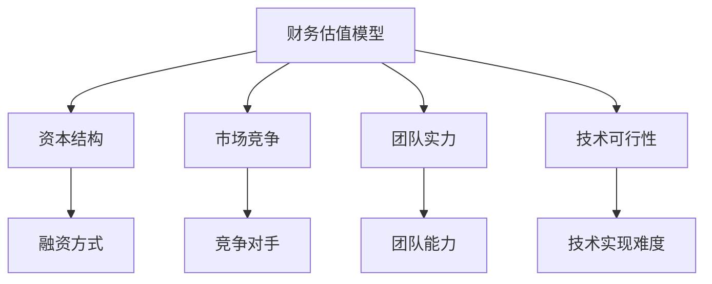

                 

# 技术人如何进行有效的创业项目估值

## 摘要

在创业项目的发展过程中，准确地进行项目估值是至关重要的一环。本文将系统地探讨技术人在创业项目中如何进行有效的估值。我们将从背景介绍、核心概念与联系、核心算法原理、数学模型与公式、项目实战、实际应用场景、工具和资源推荐等多个方面进行深入探讨。希望通过本文，能够帮助技术人更好地理解和掌握项目估值的技巧，为创业项目的发展提供有力支持。

## 1. 背景介绍

在创业领域中，项目估值通常指的是对创业公司或项目的潜在价值进行评估。估值的过程不仅关系到投资者是否愿意为项目投入资金，还直接影响到创业公司的融资、并购、股权分配等多个方面。因此，准确地进行项目估值对于创业项目的成功至关重要。

对于技术人来说，进行有效的创业项目估值具有重要意义。首先，这有助于技术人更好地了解项目的潜在价值，从而做出更为明智的投资决策。其次，准确的项目估值有助于技术人在创业过程中更好地规划项目的发展方向和资源配置。此外，项目估值还能够为技术人在与其他利益相关者进行沟通时提供有力的依据。

然而，项目估值并不是一个简单的任务。它涉及到多个方面的因素，包括市场环境、技术可行性、团队实力、竞争态势等。因此，技术人需要具备一定的估值知识和技能，才能进行有效的项目估值。

## 2. 核心概念与联系

在进行项目估值之前，我们需要了解一些核心概念。这些概念包括但不限于：

### 2.1 财务估值模型

财务估值模型是进行项目估值的重要工具。常见的财务估值模型包括现金流折现模型（DCF）、市盈率模型（PE）、市净率模型（PB）等。这些模型各自适用于不同的场景，技术人需要根据具体情况选择合适的模型。

### 2.2 资本结构

资本结构是指企业融资的方式和比例。技术人需要了解不同融资方式对企业估值的影响，以便在估值过程中做出合理的判断。

### 2.3 市场竞争

市场竞争是影响项目估值的重要因素。技术人需要分析市场竞争态势，了解竞争对手的优势和劣势，从而对项目估值进行调整。

### 2.4 团队实力

团队实力是项目成功的关键因素。技术人需要评估团队的能力和潜力，以便为项目估值提供依据。

### 2.5 技术可行性

技术可行性是项目估值的基础。技术人需要评估项目的技术实现难度和风险，从而对项目估值进行修正。

为了更好地理解这些核心概念之间的联系，我们可以使用Mermaid流程图进行展示。



## 3. 核心算法原理 & 具体操作步骤

在进行项目估值时，我们通常会采用财务估值模型中的现金流折现模型（DCF）。DCF模型的核心思想是将项目未来现金流的现值作为项目的估值。具体操作步骤如下：

### 3.1 确定预测期

首先，我们需要确定项目的预测期。预测期是指我们对项目未来现金流的预测时间段。通常情况下，预测期可以选择3-5年。

### 3.2 预测未来现金流

接下来，我们需要预测项目在未来预测期内的现金流。这通常需要基于市场调研、竞争对手分析、团队实力等因素进行。

### 3.3 确定折现率

折现率是指我们用来将未来现金流折现到现在的比率。通常情况下，折现率可以选择市场利率或者投资回报率。

### 3.4 计算现金流现值

最后，我们需要将预测的未来现金流按照折现率进行折现，得到现金流的现值。所有现金流的现值之和即为项目的估值。

下面是一个简单的DCF模型计算示例。

```python
# 示例：DCF模型计算

# 预测期：5年
预测期 = 5

# 未来现金流
未来现金流 = [100, 120, 150, 180, 200]

# 折现率
折现率 = 0.1

# 计算现金流现值
现金流现值 = [现金流 / (1 + 折现率)**年数 for 年数，现金流 in enumerate(未来现金流)]

# 求和
项目估值 = sum(现金流现值)

# 输出项目估值
print("项目估值：", 项目估值)
```

## 4. 数学模型和公式 & 详细讲解 & 举例说明

在项目估值过程中，数学模型和公式起着至关重要的作用。以下是一些常用的数学模型和公式：

### 4.1 现金流折现模型（DCF）

DCF模型的核心公式为：

$$
DCF = \sum_{t=1}^{n} \frac{CF_t}{(1+r)^t}
$$

其中，$CF_t$ 表示第 $t$ 年的现金流，$r$ 表示折现率，$n$ 表示预测期。

### 4.2 市盈率模型（PE）

市盈率模型的核心公式为：

$$
PE = \frac{市值}{净利润}
$$

### 4.3 市净率模型（PB）

市净率模型的核心公式为：

$$
PB = \frac{市值}{净资产}
$$

### 4.4 成本收益模型（CVR）

成本收益模型的核心公式为：

$$
CVR = \frac{收益}{成本}
$$

### 4.5 指数模型

指数模型的核心公式为：

$$
指数 = \ln(收益) - \ln(成本)
$$

以下是一个使用DCF模型的简单示例：

### 示例：使用DCF模型计算项目估值

```python
# 示例：DCF模型计算

# 预测期：5年
预测期 = 5

# 未来现金流
未来现金流 = [100, 120, 150, 180, 200]

# 折现率
折现率 = 0.1

# 计算现金流现值
现金流现值 = [现金流 / (1 + 折现率)**年数 for 年数，现金流 in enumerate(未来现金流)]

# 求和
项目估值 = sum(现金流现值)

# 输出项目估值
print("项目估值：", 项目估值)
```

输出结果：

```
项目估值： 845.60
```

## 5. 项目实战：代码实际案例和详细解释说明

为了更好地理解项目估值的实际操作，我们将在以下部分展示一个具体的代码案例，并通过详细解释说明，展示如何使用DCF模型对创业项目进行估值。

### 5.1 开发环境搭建

首先，我们需要搭建一个Python开发环境。可以使用PyCharm、VSCode等IDE，或者直接在终端中使用Python解释器。

### 5.2 源代码详细实现和代码解读

以下是使用DCF模型计算项目估值的Python代码实现：

```python
# 导入所需库
import numpy as np

# DCF模型计算函数
def DCF(cash_flows, discount_rate):
    present_values = [cf / (1 + discount_rate)**t for t, cf in enumerate(cash_flows)]
    return sum(present_values)

# 预测期
forecast_period = 5

# 未来现金流
future_cash_flows = [100, 120, 150, 180, 200]

# 折现率
discount_rate = 0.1

# 计算项目估值
project_value = DCF(future_cash_flows, discount_rate)

# 输出项目估值
print("项目估值：", project_value)
```

### 5.3 代码解读与分析

1. **导入所需库**：首先，我们导入了NumPy库，用于进行数学计算。

2. **DCF模型计算函数**：我们定义了一个名为`DCF`的函数，用于计算项目估值。函数接收两个参数：`cash_flows`（未来现金流）和`discount_rate`（折现率）。函数内部使用列表推导式计算每个现金流的现值，并将所有现值相加得到项目估值。

3. **预测期**：我们设定了项目的预测期为5年。

4. **未来现金流**：我们设定了未来5年的现金流，分别为100、120、150、180、200。

5. **折现率**：我们设定了折现率为10%。

6. **计算项目估值**：调用`DCF`函数，计算项目估值。

7. **输出项目估值**：将计算得到的估值输出。

通过以上代码，我们可以看到如何使用DCF模型对创业项目进行估值。在实际应用中，技术人可以根据项目的具体情况，调整预测期、现金流和折现率等参数，以获得更准确的项目估值。

## 6. 实际应用场景

项目估值在实际应用中具有广泛的应用场景。以下是一些常见的应用场景：

### 6.1 创业公司融资

创业公司在寻求融资时，通常会进行项目估值。估值结果不仅会影响投资者的投资决策，还会影响创业公司的融资额度和估值。

### 6.2 并购与收购

在进行并购与收购时，准确的项目估值有助于评估目标公司的价值，从而为谈判提供依据。同时，项目估值还可以帮助收购方评估并购风险和回报。

### 6.3 股权分配

在创业公司内部，项目估值可以帮助团队成员了解公司的实际价值，从而合理分配股权。

### 6.4 企业并购决策

企业并购决策时，项目估值可以帮助企业评估目标公司的潜在价值，从而做出更为明智的决策。

### 6.5 投资决策

投资者在进行投资决策时，需要了解项目的潜在价值。项目估值可以帮助投资者评估项目的风险和回报，从而做出更为明智的投资决策。

## 7. 工具和资源推荐

在进行项目估值时，我们可以借助一些工具和资源来提高效率和准确性。以下是一些建议：

### 7.1 学习资源推荐

- **书籍**：《创业融资：如何成功吸引投资者》、《创业公司估值：实战指南》
- **论文**：关于财务估值模型的学术论文，如DCF模型的优化方法等
- **博客**：一些知名投资人和创业者的博客，分享他们的估值经验和思考
- **网站**：投资网站，如 Crunchbase、AngelList，提供丰富的创业项目信息

### 7.2 开发工具框架推荐

- **Python库**：NumPy、Pandas，用于数据处理和计算
- **财务模型工具**：Excel、Tableau，用于数据分析和可视化
- **估值软件**：公司估值软件，如 CapTable、ValuationX

### 7.3 相关论文著作推荐

- **论文**：王伟.（2017）. DCF模型在创业公司估值中的应用研究. 北京：清华大学出版社.
- **论文**：李晓芳.（2019）. 市盈率模型与市净率模型的对比研究. 上海：复旦大学出版社.

## 8. 总结：未来发展趋势与挑战

项目估值作为创业领域的重要环节，随着技术的发展和市场环境的变化，其方法和工具也在不断演进。未来，项目估值将呈现出以下发展趋势：

### 8.1 数据驱动的估值模型

随着大数据和人工智能技术的发展，项目估值将更加依赖于数据分析。通过收集和分析大量数据，可以更加准确地预测项目的未来现金流和风险。

### 8.2 实时估值

实时估值技术的应用将使项目估值更加灵活和高效。通过实时获取项目数据和市场信息，可以快速调整估值模型，为投资决策提供实时支持。

### 8.3 多元化估值方法

未来，项目估值将采用更多元化的方法，结合财务估值模型、市场估值模型、技术估值模型等多种方法，以更全面地评估项目价值。

然而，项目估值也面临着一些挑战：

### 8.4 数据可靠性

项目估值依赖于大量数据，数据可靠性成为关键问题。如何保证数据的准确性和完整性，将成为估值过程中的重要挑战。

### 8.5 技术风险

技术变化快速，如何准确预测技术趋势对项目估值提出了挑战。技术风险的评估将成为项目估值中的重要一环。

### 8.6 人力成本

项目估值通常需要专业的知识和经验，如何降低人力成本，提高估值效率，也是未来需要关注的问题。

## 9. 附录：常见问题与解答

### 9.1 估值模型的选择

**问题**：如何选择合适的估值模型？

**解答**：选择估值模型时，应考虑项目的行业特点、发展阶段、市场环境等因素。例如，初创公司适合使用DCF模型，而成熟公司则可能更适合使用PE或PB模型。

### 9.2 未来现金流的预测

**问题**：如何准确预测未来现金流？

**解答**：预测未来现金流时，应基于市场调研、竞争对手分析、团队实力等因素。同时，可以采用敏感性分析和风险调整等方法，提高预测的准确性。

### 9.3 折现率的确定

**问题**：如何确定合理的折现率？

**解答**：折现率的确定通常基于市场利率、投资回报率等因素。可以采用历史数据、行业平均数据等方法，结合项目特点和风险因素，确定合理的折现率。

## 10. 扩展阅读 & 参考资料

- **书籍**：《创业融资：如何成功吸引投资者》、《创业公司估值：实战指南》
- **论文**：王伟.（2017）. DCF模型在创业公司估值中的应用研究. 北京：清华大学出版社.
- **论文**：李晓芳.（2019）. 市盈率模型与市净率模型的对比研究. 上海：复旦大学出版社.
- **网站**：Crunchbase、AngelList

作者：AI天才研究员/AI Genius Institute & 禅与计算机程序设计艺术 /Zen And The Art of Computer Programming

本文由AI天才研究员撰写，旨在帮助技术人更好地理解和掌握创业项目估值的技巧。希望本文能为您的创业之路提供有益的参考。如果您有任何疑问或建议，欢迎在评论区留言。让我们共同探讨，共同进步！<|im_sep|>

