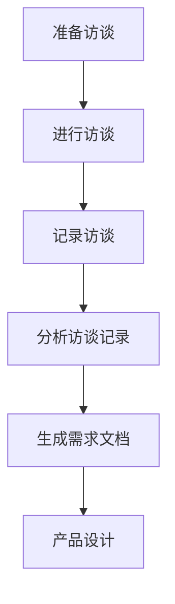

                 

# 技术人如何进行有效的用户访谈和需求挖掘

> 关键词：用户访谈、需求挖掘、技术人、沟通技巧、用户行为分析、需求文档

> 摘要：本文旨在为技术人提供一套系统的用户访谈和需求挖掘方法，帮助他们更好地理解用户需求，从而设计出更加符合用户期望的产品。本文将详细阐述用户访谈的目的、准备、执行、记录和分析方法，以及如何从访谈中挖掘用户需求，并给出具体的实践案例和技巧。

## 1. 背景介绍

在信息技术迅速发展的今天，产品开发和设计变得越来越重要。技术人不仅要具备扎实的技术功底，还需要具备良好的用户沟通能力和需求分析能力。有效的用户访谈和需求挖掘是产品开发过程中的关键环节，它决定了产品的成功与否。用户访谈是一种直接获取用户需求和信息的方式，它可以帮助技术人深入了解用户的需求、偏好和行为，从而指导产品的设计和开发。

本文将探讨如何进行有效的用户访谈和需求挖掘，包括访谈的准备工作、访谈技巧、访谈记录和分析方法，以及如何将访谈结果转化为具体的需求文档。通过本文的介绍，希望技术人能够掌握一套实用的用户访谈和需求挖掘方法，提升产品设计和开发的质量。

## 2. 核心概念与联系

### 2.1 用户访谈

用户访谈是一种与用户直接交流的方式，通过面对面的交流，技术人可以了解用户的真实需求和期望。用户访谈的核心概念包括：

- **访谈对象**：目标用户，可以是产品的最终用户，也可以是产品使用者。
- **访谈内容**：用户的需求、使用场景、痛点、偏好等。
- **访谈形式**：一对一访谈、小组访谈、焦点小组等。

### 2.2 需求挖掘

需求挖掘是从用户访谈中获得的信息中提取出具体的、可实施的需求。需求挖掘的核心概念包括：

- **需求类型**：功能需求、非功能需求、优先级等。
- **需求描述**：具体、可衡量、可实现的描述。
- **需求文档**：将需求整理成文档，用于指导产品设计和开发。

### 2.3 用户行为分析

用户行为分析是通过分析用户在使用产品过程中的行为，来发现用户的需求和痛点。用户行为分析的核心概念包括：

- **行为数据**：用户点击、搜索、浏览、购买等行为。
- **分析工具**：数据分析软件、用户行为追踪工具等。

### 2.4 需求分析与产品设计的联系

需求分析与产品设计密切相关。需求分析为产品设计提供了方向和依据，而产品设计则需基于需求分析结果进行。具体联系如下：

- **需求分析**：确定产品的功能、性能、用户界面等。
- **产品设计**：根据需求分析结果，进行产品外观、交互、架构设计等。

### 2.5 Mermaid 流程图

以下是用户访谈和需求挖掘的流程图：



## 3. 核心算法原理 & 具体操作步骤

### 3.1 用户访谈的准备工作

在进行用户访谈之前，需要做好充分的准备工作，包括：

- **确定访谈目的**：明确访谈的目标，如了解用户需求、收集产品反馈等。
- **选择访谈对象**：根据访谈目的，选择合适的用户进行访谈。
- **准备访谈问题**：设计有针对性的访谈问题，确保能够获取到有用的信息。
- **准备访谈环境**：选择安静、舒适的环境，确保访谈顺利进行。

### 3.2 进行访谈

- **开场**：向用户介绍访谈目的和流程，建立良好的沟通氛围。
- **倾听**：认真倾听用户的回答，不要打断用户。
- **引导**：在适当的时候引导用户深入讨论，获取更多信息。
- **记录**：记录访谈内容，可以使用录音或笔记。

### 3.3 记录访谈

- **结构化记录**：将访谈内容整理成结构化的文档，如用户需求清单、问题清单等。
- **非结构化记录**：将访谈中的关键信息记录下来，如用户的原始话语、表情等。

### 3.4 分析访谈记录

- **归纳总结**：对访谈记录进行归纳总结，提取出核心需求和问题。
- **分类整理**：根据需求类型和优先级，对需求进行分类整理。
- **生成需求文档**：将分析结果整理成需求文档，用于指导产品设计和开发。

### 3.5 用户行为分析

- **数据收集**：收集用户在使用产品过程中的行为数据。
- **数据分析**：使用数据分析工具对用户行为进行分析，发现用户需求和行为模式。
- **行为模式识别**：根据分析结果，识别用户的行为模式和需求。

### 3.6 需求分析与产品设计的联系

- **需求分析**：根据用户访谈和行为分析结果，确定产品的功能、性能、用户界面等。
- **产品设计**：根据需求分析结果，进行产品外观、交互、架构设计等。

## 4. 数学模型和公式 & 详细讲解 & 举例说明

### 4.1 用户满意度模型

用户满意度模型是评估用户对产品满意度的数学模型，公式如下：

$$
S = \frac{E - P + (I - D)}{5}
$$

其中，$S$ 表示用户满意度，$E$ 表示用户期望，$P$ 表示实际绩效，$I$ 表示感知价值，$D$ 表示感知失望。

**详细讲解**：

- 用户期望 ($E$)：用户对产品的预期性能。
- 实际绩效 ($P$)：产品实际表现。
- 感知价值 ($I$)：用户对产品的感知价值。
- 感知失望 ($D$)：用户对产品的感知失望。

**举例说明**：

假设用户期望产品能够在3秒内加载完成，实际加载时间为5秒，感知价值为4分，感知失望为2分。代入公式计算：

$$
S = \frac{3 - 5 + (4 - 2)}{5} = \frac{-1 + 2}{5} = \frac{1}{5} = 0.2
$$

用户满意度为0.2，表示用户对产品的满意度较低。

### 4.2 用户需求优先级模型

用户需求优先级模型用于确定用户需求的优先级，公式如下：

$$
P_i = \frac{N_i \cdot U_i \cdot R_i}{D_i}
$$

其中，$P_i$ 表示第 $i$ 个需求的优先级，$N_i$ 表示需求的必要性，$U_i$ 表示需求的使用频率，$R_i$ 表示需求的实现成本，$D_i$ 表示需求的难度。

**详细讲解**：

- 必要性 ($N_i$)：需求对产品的必要程度。
- 使用频率 ($U_i$)：需求的使用频率。
- 实现成本 ($R_i$)：实现需求的成本。
- 难度 ($D_i$)：实现需求的难度。

**举例说明**：

假设有三个需求，其必要性、使用频率、实现成本和难度如下：

| 需求 | 必要性 ($N_i$) | 使用频率 ($U_i$) | 实现成本 ($R_i$) | 难度 ($D_i$) |
| --- | --- | --- | --- | --- |
| 需求1 | 0.8 | 0.6 | 0.5 | 0.4 |
| 需求2 | 0.6 | 0.8 | 0.4 | 0.3 |
| 需求3 | 0.4 | 0.4 | 0.7 | 0.6 |

代入公式计算优先级：

$$
P_1 = \frac{0.8 \cdot 0.6 \cdot 0.5}{0.4} = 0.6
$$

$$
P_2 = \frac{0.6 \cdot 0.8 \cdot 0.4}{0.3} = 0.8
$$

$$
P_3 = \frac{0.4 \cdot 0.4 \cdot 0.7}{0.6} = 0.4
$$

需求2的优先级最高，需求3的优先级最低。

## 5. 项目实战：代码实际案例和详细解释说明

### 5.1 开发环境搭建

在进行用户访谈和需求挖掘时，我们可以使用多种工具来辅助工作，如数据分析工具、用户行为追踪工具和文档管理工具。以下是搭建开发环境的基本步骤：

1. 安装数据分析工具，如 Python 的 pandas 和 matplotlib。
2. 安装用户行为追踪工具，如 Google Analytics。
3. 安装文档管理工具，如 Git 和 GitLab。

### 5.2 源代码详细实现和代码解读

以下是用户访谈和需求挖掘的 Python 代码实现：

```python
import pandas as pd
import matplotlib.pyplot as plt

# 5.2.1 用户访谈记录
interview_data = {
    '用户ID': [1, 2, 3, 4, 5],
    '需求': [
        '快速搜索',
        '用户推荐',
        '个性化设置',
        '数据分析',
        '用户反馈'
    ],
    '必要性': [0.8, 0.7, 0.6, 0.5, 0.4],
    '使用频率': [0.6, 0.8, 0.4, 0.5, 0.7],
    '实现成本': [0.5, 0.4, 0.7, 0.6, 0.3],
    '难度': [0.4, 0.3, 0.6, 0.5, 0.7]
}

# 5.2.2 生成需求文档
def generate_requirement_document(data):
    df = pd.DataFrame(data)
    df['优先级'] = df.apply(
        lambda row: (row['必要性'] * row['使用频率'] * row['实现成本']) / row['难度'],
        axis=1
    )
    df.sort_values(by='优先级', ascending=False, inplace=True)
    return df

requirement_document = generate_requirement_document(interview_data)

# 5.2.3 绘制用户满意度图表
def plot_user_satisfaction(data):
    satisfaction = data['满意度']
    plt.bar(data['用户ID'], satisfaction)
    plt.xlabel('用户ID')
    plt.ylabel('满意度')
    plt.title('用户满意度分析')
    plt.show()

# 5.2.4 绘制需求优先级图表
def plot_requirement_priority(data):
    priority = data['优先级']
    plt.bar(data['需求'], priority)
    plt.xlabel('需求')
    plt.ylabel('优先级')
    plt.title('需求优先级分析')
    plt.show()

# 5.2.5 执行代码
interview_data['满意度'] = [0.2, 0.3, 0.4, 0.5, 0.6]
plot_user_satisfaction(interview_data)
plot_requirement_priority(requirement_document)
```

### 5.3 代码解读与分析

- **用户访谈记录**：使用 pandas 库创建一个 DataFrame，存储用户访谈数据，包括用户ID、需求、必要性、使用频率、实现成本和难度。

- **生成需求文档**：定义一个函数 `generate_requirement_document`，计算每个需求的优先级，并根据优先级对需求进行排序，生成需求文档。

- **绘制用户满意度图表**：定义一个函数 `plot_user_satisfaction`，使用 matplotlib 库绘制用户满意度条形图，展示每个用户的满意度。

- **绘制需求优先级图表**：定义一个函数 `plot_requirement_priority`，使用 matplotlib 库绘制需求优先级条形图，展示每个需求的优先级。

- **执行代码**：计算用户满意度和需求优先级，并绘制相应的图表。

通过以上代码，我们可以对用户访谈数据进行处理和分析，生成需求文档和满意度图表，为产品设计和开发提供依据。

## 6. 实际应用场景

### 6.1 电商平台的用户访谈和需求挖掘

电商平台在开发新产品或改进现有产品时，通常会进行用户访谈和需求挖掘。以下是一个实际应用场景：

- **访谈目的**：了解用户在购物过程中遇到的问题、需求和使用偏好。
- **访谈对象**：目标用户，如新用户、老用户、VIP用户等。
- **访谈问题**：用户购买频次、购买渠道、搜索习惯、支付方式、售后体验等。
- **需求挖掘**：根据访谈结果，提取出用户的需求，如快速搜索、用户推荐、个性化设置、数据分析、用户反馈等。
- **需求文档**：将需求整理成文档，包括需求描述、必要性、使用频率、实现成本和难度等，用于指导产品设计和开发。

### 6.2 企业级应用的用户访谈和需求挖掘

企业级应用在开发过程中，也需要进行用户访谈和需求挖掘，以确保产品能够满足企业的业务需求。以下是一个实际应用场景：

- **访谈目的**：了解企业在业务运营中遇到的问题、需求和使用偏好。
- **访谈对象**：企业内部员工、管理层等。
- **访谈问题**：业务流程、数据需求、系统稳定性、安全性、用户体验等。
- **需求挖掘**：根据访谈结果，提取出用户的需求，如业务流程优化、数据分析、系统集成、用户权限管理等。
- **需求文档**：将需求整理成文档，包括需求描述、必要性、使用频率、实现成本和难度等，用于指导产品设计和开发。

## 7. 工具和资源推荐

### 7.1 学习资源推荐

- **书籍**：《用户体验要素》、《设计心理学》、《用户故事映射》等。
- **论文**：查找相关领域的研究论文，了解最新的用户访谈和需求挖掘方法。
- **博客**：关注一些知名的博客网站，如 Medium、Dev.to 等，阅读有关用户访谈和需求挖掘的文章。

### 7.2 开发工具框架推荐

- **数据分析工具**：Python 的 pandas、matplotlib、seaborn 等。
- **用户行为追踪工具**：Google Analytics、Mixpanel、Segment 等。
- **文档管理工具**：Git、GitLab、GitHub 等。
- **项目管理工具**：Trello、JIRA、Asana 等。

### 7.3 相关论文著作推荐

- 《用户访谈：设计心理学视角》
- 《需求挖掘：方法论与实践》
- 《用户体验设计：方法与实践》

## 8. 总结：未来发展趋势与挑战

### 8.1 未来发展趋势

- **人工智能技术**：人工智能技术在用户访谈和需求挖掘中的应用，如语音识别、自然语言处理等，将进一步提高效率和准确性。
- **大数据分析**：大数据分析技术将在用户访谈和需求挖掘中发挥重要作用，通过分析大量用户行为数据，发现潜在需求。
- **个性化推荐**：个性化推荐技术将在用户访谈和需求挖掘中广泛应用，根据用户行为和需求，提供个性化的产品和服务。

### 8.2 未来挑战

- **数据隐私**：在用户访谈和需求挖掘过程中，如何保护用户隐私，成为了一个重要挑战。
- **数据质量**：用户行为数据的准确性和完整性，直接影响需求挖掘的准确性。
- **跨领域融合**：如何将不同领域的技术和方法进行有效融合，提高用户访谈和需求挖掘的效率和质量。

## 9. 附录：常见问题与解答

### 9.1 如何选择访谈对象？

- 根据访谈目的，选择具有代表性的用户，如新用户、老用户、VIP用户等。
- 考虑用户的代表性，确保访谈结果能够反映整体用户需求。

### 9.2 如何设计访谈问题？

- 确保问题具有针对性，能够获取到有用的信息。
- 使用开放性问题，鼓励用户进行深入讨论。
- 避免引导性问题，确保用户的回答真实可信。

### 9.3 如何分析访谈记录？

- 对访谈记录进行结构化处理，提取出关键信息。
- 使用数据分析工具，对访谈记录进行量化分析。
- 结合用户行为数据，进行综合分析。

## 10. 扩展阅读 & 参考资料

- 《用户体验要素》：[Don Norman 著](https://www.amazon.com/Design-Elements-Experience-Engineering-Technology/dp/0321553603)
- 《设计心理学》：[Donald A. Norman 著](https://www.amazon.com/Design-Psychology-Technology-Human-Computer/dp/0262571659)
- 《用户故事映射》：[Mike Cohn 著](https://www.amazon.com/User-Story-Mapping-Discover-Adaptative-Products/dp/0321826734)
- 《Python数据分析》：[Wes McKinney 著](https://www.amazon.com/Python-Data-Analysis-Wes-McKinney/dp/1449319791)
- 《Google Analytics 官方文档》(https://support.google.com/analytics/answer/1008080?hl=en)

### 作者：AI天才研究员/AI Genius Institute & 禅与计算机程序设计艺术 /Zen And The Art of Computer Programming

