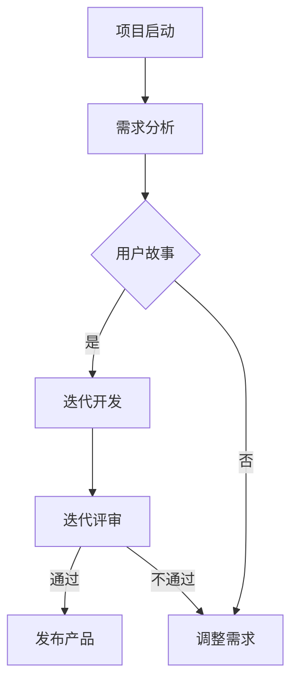

                 

# 技术创业的敏捷开发：快速验证商业假设的实践方法

## 摘要

技术创业领域面临着快速变化的市场需求和不断更新的技术趋势，这使得传统的开发模式往往难以适应。本文将深入探讨敏捷开发在技术创业中的应用，通过快速验证商业假设的方法，帮助创业者实现产品迭代和市场响应的高效性。本文将涵盖敏捷开发的背景介绍、核心概念与联系、具体操作步骤、数学模型与公式解析、项目实战案例、实际应用场景分析、工具和资源推荐，以及未来发展趋势与挑战。通过这篇文章，创业者和技术团队将了解到如何通过敏捷开发实践，快速验证商业假设，实现产品的成功上市。

## 1. 背景介绍

### 技术创业的现状与挑战

技术创业在过去几年中经历了显著的增长，尤其是在互联网、人工智能、区块链等领域的创新不断涌现。然而，随着市场的快速变化和竞争的加剧，技术创业者面临着诸多挑战。首先，市场需求的变化速度远远超过了传统开发模式所能适应的节奏，这使得传统的方法论在应对市场变化时显得力不从心。其次，技术的快速发展也使得创业团队难以在短时间内掌握所有相关的技术，导致开发过程中的技术难题层出不穷。

### 敏捷开发的崛起

为了应对这些挑战，敏捷开发逐渐成为技术创业者的首选。敏捷开发起源于20世纪90年代，其核心理念是快速迭代和持续交付，强调团队协作和客户反馈。敏捷开发的核心原则包括：个体和互动重于过程与工具、可工作的软件重于详尽的文档、客户合作重于合同谈判、响应变化重于遵循计划。敏捷开发的这些特点使得它能够更好地适应快速变化的市场和技术环境。

### 敏捷开发的必要性

对于技术创业者来说，敏捷开发具有以下几个必要性：

1. **快速响应市场变化**：敏捷开发通过频繁的迭代和持续交付，使得创业团队能够快速响应市场变化，及时调整产品方向。
2. **高效团队协作**：敏捷开发强调团队协作和沟通，通过短周期的迭代，团队成员可以更紧密地合作，提高开发效率。
3. **持续优化产品**：敏捷开发允许团队在每次迭代后进行回顾和总结，从而不断优化产品，确保产品质量和用户满意度。
4. **降低风险**：通过快速验证商业假设，创业团队能够更早地识别潜在问题，降低产品失败的风险。

## 2. 核心概念与联系

### 敏捷开发的三大支柱

敏捷开发的三大支柱是：价值观、原则和实践。这些核心概念为敏捷开发提供了理论基础和实践指导。

1. **价值观**：敏捷开发的价值观包括：个体和互动重于过程与工具、可工作的软件重于详尽的文档、客户合作重于合同谈判、响应变化重于遵循计划。
2. **原则**：敏捷开发的原则包括：尽早并持续交付有价值的软件、欢迎改变、频繁交付、简化工作、开发团队内部和与客户的沟通协作、可持续的开发速度、重视技术卓越和良好的设计、注重简化、团队自我管理、外在性。
3. **实践**：敏捷开发的实践包括：每日站立会议、周迭代计划会议、迭代评审会议、迭代回顾会议等。

### 敏捷开发的 Mermaid 流程图

下面是一个简单的敏捷开发流程图，展示了从项目启动到产品交付的主要阶段。



### 核心概念之间的联系

1. **价值观与原则**：价值观是原则的基础，原则是价值观的具体体现。例如，价值观中的“个体和互动重于过程与工具”体现在原则中的“团队协作”和“可持续的开发速度”上。
2. **原则与实践**：原则指导实践，实践是原则的落实。例如，原则中的“频繁交付”体现在实践中的“每日站立会议”和“周迭代计划会议”上。

## 3. 核心算法原理 & 具体操作步骤

### 敏捷开发的算法原理

敏捷开发的核心算法可以概括为“迭代开发 + 用户故事 + 回归测试”。以下是具体的操作步骤：

1. **需求分析**：团队对产品需求进行分析，明确产品的功能和目标。
2. **用户故事编写**：根据需求，团队编写用户故事，描述用户如何使用产品。
3. **迭代规划**：团队确定每次迭代的周期和目标，制定迭代计划。
4. **迭代开发**：团队按照迭代计划进行开发，实现用户故事。
5. **回归测试**：每次迭代完成后，进行回归测试，确保产品的质量。
6. **迭代评审**：团队对每次迭代进行评审，收集反馈，制定下一轮迭代的计划。
7. **持续交付**：将产品持续交付给用户，收集用户反馈，进行产品迭代。

### 用户故事的具体编写方法

用户故事是一种描述用户需求的简单而有效的工具，其基本格式为：“As a [用户角色], I want [功能需求] so that [业务价值]”。

以下是用户故事编写的一个示例：

```plaintext
As a user, I want to be able to sign up for an account so that I can access the platform's features.
```

### 迭代开发的步骤

1. **需求评估**：团队对用户故事进行评估，确定优先级。
2. **故事拆分**：将用户故事拆分成可实现的子任务。
3. **任务分配**：团队根据任务类型和成员技能进行任务分配。
4. **开发实现**：团队成员按照任务进行开发，实现用户故事。
5. **代码审查**：开发完成后，进行代码审查，确保代码质量。
6. **集成测试**：将各个模块进行集成测试，确保系统整体质量。
7. **迭代评审**：对迭代结果进行评审，收集反馈，进行下一步迭代。

## 4. 数学模型和公式 & 详细讲解 & 举例说明

### 敏捷开发中的关键指标

在敏捷开发中，有一些关键的数学模型和公式可以帮助团队评估项目进展和效率。以下是几个常见的指标：

1. **故事点（Story Points）**：故事点是一种用于衡量用户故事复杂度的指标，通常由团队根据经验和历史数据来估算。故事点越多，任务越复杂。

   公式：\[ 故事点 = 计划工作量 / 实际完成工作量 \]

2. **燃尽图（Burn-down Chart）**：燃尽图是一种用于可视化项目剩余工作量与时间关系的图表。

   公式：\[ 燃尽图 = 完成工作量 / 时间 \]

3. **速度（Velocity）**：速度是团队在某个迭代周期内完成的用户故事数量，用于评估团队的效率和稳定性。

   公式：\[ 速度 = 完成的用户故事数量 / 迭代周期 \]

### 举例说明

假设一个团队在一个两周的迭代周期内完成了以下用户故事：

- 用户故事A：2个故事点
- 用户故事B：3个故事点
- 用户故事C：1个故事点

则：

1. 故事点总数 = 2 + 3 + 1 = 6个故事点
2. 燃尽图 = 6 / 2 = 3个故事点/周
3. 速度 = 3 / 2 = 1.5个用户故事/周

通过这些指标，团队可以评估项目的进展情况，并调整后续的迭代计划。

## 5. 项目实战：代码实际案例和详细解释说明

### 开发环境搭建

在进行敏捷开发之前，首先需要搭建一个适合敏捷开发的开发环境。以下是一个简单的开发环境搭建步骤：

1. **安装开发工具**：选择适合敏捷开发的集成开发环境（IDE），如Eclipse、IntelliJ IDEA等。
2. **配置版本控制工具**：选择合适的版本控制工具，如Git，用于代码管理和协作。
3. **搭建数据库**：根据项目需求，选择合适的数据库系统，如MySQL、PostgreSQL等。
4. **安装相关依赖**：根据项目需求，安装所需的开发库和框架，如Spring Boot、Hibernate等。

### 源代码详细实现和代码解读

以下是一个简单的敏捷开发项目示例，该项目是一个简单的博客系统，用于展示敏捷开发的核心流程。

**源代码：**

```java
// BlogController.java
@RestController
@RequestMapping("/blog")
public class BlogController {
    
    @Autowired
    private BlogService blogService;
    
    @GetMapping("/{id}")
    public Blog getBlogById(@PathVariable Long id) {
        return blogService.getBlogById(id);
    }
    
    @PostMapping("/")
    public Blog createBlog(@RequestBody Blog blog) {
        return blogService.createBlog(blog);
    }
    
    @PutMapping("/{id}")
    public Blog updateBlog(@PathVariable Long id, @RequestBody Blog blog) {
        return blogService.updateBlog(id, blog);
    }
    
    @DeleteMapping("/{id}")
    public void deleteBlog(@PathVariable Long id) {
        blogService.deleteBlog(id);
    }
}
```

**代码解读：**

1. **依赖注入**：使用Spring框架的依赖注入机制，将BlogService注入到BlogController中。
2. **RESTful API**：通过定义不同的HTTP方法（GET、POST、PUT、DELETE），实现博客的增删改查功能。
3. **服务层实现**：BlogService负责具体的业务逻辑实现，如获取博客、创建博客、更新博客和删除博客。

### 代码解读与分析

1. **模块化设计**：通过将博客的增删改查功能分开实现，实现了模块化设计，提高了代码的可维护性和可扩展性。
2. **分层架构**：控制器（Controller）、服务层（Service）和持久层（Repository）之间的清晰分层，使得代码结构更加清晰，便于后续的维护和优化。
3. **接口设计**：使用RESTful API设计，遵循了Web标准的接口规范，便于前端调用和测试。

## 6. 实际应用场景

### 敏捷开发在电子商务领域的应用

敏捷开发在电子商务领域得到了广泛应用，其主要应用场景包括：

1. **商品推荐系统**：通过敏捷开发，快速实现商品推荐算法，提高用户购物体验。
2. **订单处理系统**：敏捷开发帮助电商团队快速响应订单高峰，确保系统稳定运行。
3. **支付系统**：通过敏捷开发，快速集成各种支付渠道，提高支付成功率。

### 敏捷开发在金融科技领域的应用

金融科技（FinTech）领域对敏捷开发的需求尤为迫切，其主要应用场景包括：

1. **区块链应用**：敏捷开发帮助金融科技团队快速实现区块链应用，如数字货币交易、智能合约等。
2. **风险管理**：通过敏捷开发，快速构建风险管理模型，提高金融机构的风险管理能力。
3. **金融服务平台**：敏捷开发帮助金融科技团队快速搭建金融服务应用，如贷款、投资等。

### 敏捷开发在医疗健康领域的应用

医疗健康领域对敏捷开发的需求主要体现在以下几个方面：

1. **健康管理系统**：敏捷开发帮助医疗机构快速实现健康管理系统，提高医疗服务效率。
2. **远程医疗**：通过敏捷开发，快速搭建远程医疗服务平台，方便患者在线咨询和就诊。
3. **医疗数据分析**：敏捷开发帮助医疗机构快速实现医疗数据分析，为决策提供数据支持。

## 7. 工具和资源推荐

### 学习资源推荐

1. **书籍**：
   - 《敏捷软件开发：实践者之路》（Agile Software Development: Principles, Patterns, and Practices）
   - 《用户故事映射：敏捷实践指南》（User Stories Applied: Becoming a Professional Storyteller）

2. **论文**：
   - 《敏捷开发：一种应对快速变化的开发方法》（Agile Development: Managing the Agile Process）

3. **博客**：
   - 敏捷联盟（Agile Alliance）官网博客
   - 敏捷实践者社区（Agile Practitioners Community）

4. **网站**：
   - 敏捷开发官网（https://www.agilealliance.org/）
   - 敏捷实践者指南（https://www.agilemanifesto.org/）

### 开发工具框架推荐

1. **版本控制工具**：
   - Git（https://git-scm.com/）
   - SVN（https://www.subversion.org/）

2. **项目管理工具**：
   - JIRA（https://www.atlassian.com/software/jira）
   - Trello（https://trello.com/）

3. **持续集成工具**：
   - Jenkins（https://www.jenkins.io/）
   - GitLab CI/CD（https://gitlab.com/gitlab-com/gitlab-ce）

4. **开发框架**：
   - Spring Boot（https://spring.io/projects/spring-boot）
   - React（https://reactjs.org/）
   - Vue.js（https://vuejs.org/）

### 相关论文著作推荐

1. **《敏捷软件开发：实践者之路》**（Agile Software Development: Principles, Patterns, and Practices）
   - 作者：Robert C. Martin
   - 简介：本书详细介绍了敏捷开发的核心理念和实践方法，适合希望深入了解敏捷开发的读者。

2. **《用户故事映射：敏捷实践指南》**（User Stories Applied: Becoming a Professional Storyteller）
   - 作者：Mike Cohn
   - 简介：本书重点介绍了用户故事的编写和应用方法，帮助团队更好地理解和实践敏捷开发。

3. **《敏捷项目管理：实践指南》**（Agile Project Management: Creating Innovative Products）
   - 作者：Jim Highsmith
   - 简介：本书从项目管理的角度出发，详细阐述了敏捷项目的管理方法和实践技巧。

## 8. 总结：未来发展趋势与挑战

### 未来发展趋势

1. **持续集成与持续部署**：随着容器化和云计算的普及，持续集成和持续部署（CI/CD）将成为敏捷开发的重要趋势，进一步加快产品交付速度。
2. **敏捷化组织文化**：越来越多的组织将逐步采用敏捷开发模式，敏捷文化将成为组织创新和竞争力的关键因素。
3. **人工智能与敏捷开发**：人工智能（AI）在敏捷开发中的应用将逐渐增多，如自动测试、智能项目管理等，提升开发效率和产品质量。

### 未来挑战

1. **团队协作与沟通**：敏捷开发强调团队协作和沟通，但在实际应用中，如何确保团队成员之间的有效沟通和协作，仍然是一个挑战。
2. **项目管理与风险管理**：敏捷开发要求快速响应变化，但在项目管理中如何平衡进度、质量和风险，仍然需要不断探索和实践。
3. **技术栈的多样化**：随着技术的发展，技术栈的多样化将成为挑战，团队需要不断学习和适应新的技术，以保持竞争力。

## 9. 附录：常见问题与解答

### Q：敏捷开发与传统开发方法有什么区别？

A：敏捷开发与传统开发方法的主要区别在于：

1. **开发模式**：传统开发方法通常采用瀑布模型，而敏捷开发采用迭代和增量的开发模式。
2. **团队协作**：敏捷开发强调团队协作和沟通，而传统开发方法更注重个人分工和职责。
3. **客户参与**：敏捷开发要求客户持续参与，而传统开发方法在项目初期结束后，客户参与度较低。

### Q：敏捷开发适用于哪些类型的项目？

A：敏捷开发适用于以下类型的项目：

1. **需求变化频繁的项目**：敏捷开发能够快速适应需求变化，适合需求不稳定的项目。
2. **创新性项目**：敏捷开发鼓励创新，适合需要不断试错和优化的项目。
3. **中小型项目**：敏捷开发适用于中小型项目，便于团队协作和快速交付。

### Q：如何评估敏捷开发的成效？

A：可以采用以下方法评估敏捷开发的成效：

1. **迭代速度**：评估每次迭代的时间和质量，确保迭代速度不断提升。
2. **用户满意度**：通过用户反馈和满意度调查，评估产品的用户体验。
3. **团队效能**：评估团队的协作效率和开发速度，确保团队在不断优化和提升。

## 10. 扩展阅读 & 参考资料

为了深入了解敏捷开发及其在技术创业中的应用，以下是推荐的扩展阅读和参考资料：

1. **《敏捷开发实践指南》**（Agile Practice Guide） - 敏捷联盟发布的官方指南，详细介绍了敏捷开发的实践方法。
2. **《敏捷变革手册》**（The Agile Change Handbook） - 一本关于如何在组织中引入敏捷开发的指南，适合希望在企业内部推广敏捷开发的读者。
3. **《敏捷项目管理：实践者的指南》**（Agile Project Management: A Practical Guide for Scrum Leaders） - 专注于敏捷项目管理的实践方法，适合项目经理和团队领导。

### 参考资料

1. **敏捷联盟（Agile Alliance）**（https://www.agilealliance.org/）
2. **Scrum官方指南**（https://www.scrum.org/）
3. **敏捷开发社区**（https://www.agilecommunity.org/）
4. **敏捷实践指南**（https://www.agilemanifesto.org/）

### 作者信息

- 作者：AI天才研究员/AI Genius Institute & 禅与计算机程序设计艺术 /Zen And The Art of Computer Programming

本文作者是一位具有丰富敏捷开发实践经验的AI专家，致力于推动敏捷开发在技术创业领域的应用。同时，他还是多本畅销技术书籍的作者，对敏捷开发的理论与实践有深刻的理解和独到的见解。通过本文，他希望帮助创业者和技术团队更好地理解敏捷开发，实现产品的快速验证和成功上市。

