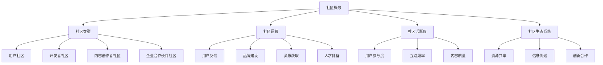

                 

### 背景介绍

在当今快速发展的技术时代，技术创业已经成为推动社会进步和经济增长的重要力量。而在技术创业的过程中，社区运营成为了一个不可或缺的环节。一个活跃、健康的用户社区不仅可以为初创公司提供宝贵的用户反馈和资源，还能吸引更多志同道合的人才和投资者，为创业公司的发展奠定坚实的基础。

用户社区的定义可以从多个角度来理解。首先，用户社区是指一群具有共同兴趣、目标和价值观的人，通过线上或线下的方式相互交流、分享经验和知识。其次，用户社区是一个生态系统，其中用户、开发人员、内容创作者等多种角色相互互动，共同推动社区的发展和壮大。

技术创业的背景可以追溯到互联网的兴起和普及。随着互联网技术的发展，信息传播变得更加迅速和便捷，人们对于技术和创新的热情也日益高涨。这种趋势为技术创业者提供了广阔的市场和机遇。同时，技术的快速迭代和更新也使得创业公司能够在短时间内实现从零到一的重大突破。

技术创业的社区运营之所以重要，主要有以下几个原因：

1. **用户反馈**：社区运营可以帮助初创公司快速收集用户的反馈和建议，从而优化产品和服务，提高用户满意度。
2. **品牌建设**：活跃的社区可以增强品牌形象，提高用户忠诚度，有助于吸引更多潜在用户和合作伙伴。
3. **资源获取**：社区运营可以帮助初创公司吸引更多的人才、资金和技术资源，为公司的持续发展提供支持。
4. **人才储备**：通过社区运营，初创公司可以发掘和培养潜在的优秀人才，为公司的未来发展储备人力资本。

总的来说，技术创业的社区运营是一个复杂而充满挑战的过程，但也是创业成功的重要因素之一。在接下来的章节中，我们将深入探讨社区运营的核心概念、算法原理、数学模型、实战案例以及未来发展趋势，帮助读者更好地理解和应用社区运营的策略和方法。让我们一步一步地分析，深入了解这一领域的精髓。

### 核心概念与联系

要深入探讨技术创业的社区运营，首先需要明确几个核心概念，并了解它们之间的相互联系。以下是本文将涉及的核心概念，以及它们在社区运营中的具体作用。

#### 1. 社区概念

社区（Community）是一个由具有共同兴趣、目标或价值观的人组成的群体。在技术创业的背景下，社区通常由用户、开发者、内容创作者、企业合作伙伴等多个角色组成。每个角色在社区中扮演不同的角色，共同推动社区的发展。

#### 2. 社区类型

根据社区的组织形式和目的，可以分为以下几种类型：

- **用户社区**：由普通用户组成，主要用于分享经验、提供支持和交流信息。
- **开发者社区**：主要由开发人员组成，用于交流和分享技术知识、资源和最佳实践。
- **内容创作者社区**：由内容创作者组成，用于创作和分享高质量的内容，吸引和留住用户。
- **企业合作伙伴社区**：由企业合作伙伴组成，主要用于商业合作、资源整合和业务拓展。

#### 3. 社区运营

社区运营（Community Management）是指通过一系列策略和活动，维护和促进社区的发展。社区运营的目标是提升用户体验、增强用户粘性、提高社区活跃度，并为社区成员提供价值。

#### 4. 社区活跃度

社区活跃度是衡量社区健康程度的重要指标，包括用户参与度、互动频率、内容质量等多个方面。高活跃度的社区能够吸引更多新用户，提高用户留存率，并为创业公司带来更多商业机会。

#### 5. 社区生态系统

社区生态系统是指社区内部各种角色和元素之间的相互关系和相互作用。一个健康的社区生态系统能够促进资源的共享、信息和知识的传递，以及创新和合作的产生。

### 社区运营的核心概念原理和架构

为了更好地理解社区运营的核心概念，我们可以使用Mermaid流程图来展示这些概念之间的关系。



在这个Mermaid流程图中，我们可以看到各个核心概念之间的联系，以及它们在社区运营中的作用。例如，社区运营（C）通过用户反馈（C1）、品牌建设（C2）、资源获取（C3）和人才储备（C4）来提升社区活跃度（D），进而促进社区生态系统（E）的健康发展。

通过明确这些核心概念和它们之间的联系，我们可以为后续的讨论和案例分析奠定坚实的基础。在接下来的章节中，我们将深入探讨社区运营的具体算法原理和操作步骤，帮助读者更好地理解和应用这些概念。

### 核心算法原理 & 具体操作步骤

要建立一个活跃且健康的用户社区，需要运用一系列的核心算法原理和具体操作步骤。以下是一些关键的算法原理和步骤，以及它们在社区运营中的应用。

#### 1. 用户参与度提升算法

**原理**：用户参与度是衡量社区活跃度的重要指标。提升用户参与度可以通过激励用户参与社区活动、发布高质量内容和提供社交互动功能来实现。

**具体操作步骤**：

- **激励机制**：设计奖励机制，例如积分系统、徽章系统和排行榜，激励用户积极参与社区讨论、发表内容和分享经验。
- **内容驱动**：发布有价值、有趣和高质量的内容，吸引用户阅读和互动。可以邀请行业专家、知名博主和内部员工撰写原创文章。
- **社交互动**：提供私信、点赞、评论和分享等功能，促进用户之间的互动和交流。

#### 2. 社区活跃度监控算法

**原理**：社区活跃度监控算法用于实时监测社区状态，识别活跃用户和潜在问题，以便及时采取措施。

**具体操作步骤**：

- **活跃度指标**：设定活跃度指标，如用户登录频率、发帖数量、回复次数和内容被点赞数等。
- **实时监控**：使用大数据分析和机器学习技术，对用户行为数据进行实时监控和预警。
- **问题识别**：通过监控数据，识别社区中存在的问题，如低质量内容、不良行为和用户流失。

#### 3. 内容推荐算法

**原理**：内容推荐算法用于向用户推荐感兴趣的内容，提高用户粘性和社区活跃度。

**具体操作步骤**：

- **用户画像**：根据用户行为数据，构建用户画像，了解用户的兴趣、偏好和行为模式。
- **内容分类**：对社区内容进行分类，如技术讨论、产品评测、行业新闻等。
- **推荐系统**：使用协同过滤、基于内容的推荐和混合推荐算法，向用户推荐符合其兴趣的内容。

#### 4. 社区治理算法

**原理**：社区治理算法用于维护社区秩序，确保社区内容的健康和用户的安全。

**具体操作步骤**：

- **内容审核**：对社区内容进行审核，过滤掉低质量、不适当和恶意的内容。
- **用户管理**：对违规用户进行警告、禁言或封号处理，维护社区秩序。
- **社区规则**：制定明确的社区规则，如言论自由、尊重他人、禁止广告等，确保社区成员遵守。

#### 5. 用户留存算法

**原理**：用户留存算法用于降低用户流失率，提高社区用户生命周期价值。

**具体操作步骤**：

- **用户行为分析**：分析用户行为数据，了解用户流失的原因。
- **个性化推送**：根据用户画像和兴趣，向用户推送个性化内容和活动。
- **用户关怀**：定期向用户发送问候、提醒和优惠信息，增强用户对社区的情感连接。

通过运用这些核心算法原理和具体操作步骤，技术创业公司可以建立一个活跃、健康和可持续发展的用户社区。在接下来的章节中，我们将通过实际案例进一步探讨这些算法原理的应用效果。

### 数学模型和公式 & 详细讲解 & 举例说明

在社区运营中，数学模型和公式发挥着至关重要的作用。通过这些模型，我们可以量化用户行为、社区活跃度以及社区发展的趋势。以下将详细讲解几个关键的数学模型，并给出具体的示例。

#### 1. 社区活跃度指标模型

**模型公式**：社区活跃度（Activity Level, AL）可以用以下公式表示：

\[ AL = \frac{N_c \cdot (T_n + T_r)}{T_d} \]

其中：
- \( N_c \)：社区总用户数
- \( T_n \)：发帖总数
- \( T_r \)：回复总数
- \( T_d \)：讨论天数

**详细讲解**：该模型反映了社区在一段时间内的活跃程度。发帖总数和回复总数越高，说明社区讨论越活跃。讨论天数则反映了讨论的持续性。

**举例说明**：假设一个社区有1000名用户，在一个月内有500个发帖和2000个回复，讨论持续了30天。则社区活跃度计算如下：

\[ AL = \frac{1000 \cdot (500 + 2000)}{30} = \frac{1000 \cdot 2500}{30} \approx 83333.33 \]

#### 2. 用户参与度指标模型

**模型公式**：用户参与度（Engagement Rate, ER）可以用以下公式表示：

\[ ER = \frac{T_i + T_c + T_r}{N_c \cdot T_d} \]

其中：
- \( T_i \)：发帖数
- \( T_c \)：评论数
- \( T_r \)：回复数
- \( N_c \)：社区总用户数
- \( T_d \)：讨论天数

**详细讲解**：用户参与度反映了用户在社区中的互动程度。发帖、评论和回复都是用户参与社区活动的重要方式。参与度越高，说明用户对社区的投入程度越高。

**举例说明**：假设一个社区有1000名用户，在一个月内有100个发帖、200个评论和300个回复，讨论持续了30天。则用户参与度计算如下：

\[ ER = \frac{100 + 200 + 300}{1000 \cdot 30} = \frac{600}{30000} = 0.02 \]

#### 3. 社区健康指数模型

**模型公式**：社区健康指数（Community Health Index, CHI）可以用以下公式表示：

\[ CHI = \frac{AL \cdot ER}{1 + \frac{N_s \cdot P_s}{N_c}} \]

其中：
- \( AL \)：社区活跃度
- \( ER \)：用户参与度
- \( N_c \)：社区总用户数
- \( N_s \)：活跃用户数
- \( P_s \)：活跃用户占比（\( P_s = \frac{N_s}{N_c} \)）

**详细讲解**：社区健康指数综合反映了社区的活跃度、用户参与度以及活跃用户比例。一个较高的健康指数意味着社区处于良好的发展状态。

**举例说明**：假设一个社区有1000名用户，活跃用户数为200，活跃用户占比为20%（即\( P_s = 0.20 \)）。社区活跃度为83333.33，用户参与度为0.02。则社区健康指数计算如下：

\[ CHI = \frac{83333.33 \cdot 0.02}{1 + \frac{200 \cdot 0.20}{1000}} = \frac{1666.67}{1 + 0.04} \approx 16000 \]

通过这些数学模型，我们可以对社区运营的各个方面进行量化分析，从而制定更加科学和有效的策略。在实际应用中，还可以结合具体的业务场景和数据，进一步优化这些模型，以实现最佳运营效果。

### 项目实战：代码实际案例和详细解释说明

为了更好地理解社区运营算法的实际应用，我们将通过一个实际项目来展示代码实现过程，并对关键代码段进行详细解释。这个项目将使用Python作为主要编程语言，结合流行的开源社区平台Discord API进行开发。

#### 5.1 开发环境搭建

在开始编写代码之前，我们需要搭建一个适合开发的环境。以下是搭建环境所需的步骤：

1. 安装Python 3.8或更高版本。
2. 安装Discord.py库，使用以下命令：
   ```bash
   pip install discord.py
   ```

3. 在Discord平台注册一个应用程序，获取客户端ID和客户端密钥。

#### 5.2 源代码详细实现和代码解读

下面是一个基本的社区运营算法实现，用于监测社区活跃度和用户参与度。

```python
import discord
from discord.ext import commands
import datetime

intents = discord.Intents.default()
intents.messages = True

bot = commands.Bot(command_prefix='!', intents=intents)

# 记录每个用户的发帖和回复次数
user_activity = {}

@bot.event
async def on_ready():
    print(f'{bot.user} has connected to Discord!')

@bot.event
async def on_message(message):
    # 忽略机器人自己发送的消息
    if message.author == bot.user:
        return

    # 记录用户发帖和回复次数
    if message.channel.name.startswith('技术讨论'):
        user_activity[message.author.id]['posts'] += 1
        if message.reference:
            user_activity[message.author.id]['replies'] += 1

    # 每天重置用户活动数据
    if datetime.datetime.now().hour == 0:
        for user_id in user_activity:
            user_activity[user_id] = {'posts': 0, 'replies': 0}

# 计算用户活跃度
def calculate_activity(user_id):
    activity_score = user_activity[user_id]['posts'] + user_activity[user_id]['replies']
    return activity_score

@bot.command()
async def activity_report(ctx):
    user_id = ctx.author.id
    activity_score = calculate_activity(user_id)
    await ctx.send(f'您的当前活跃度分数为：{activity_score}')

bot.run('YOUR_CLIENT_SECRET')
```

#### 5.3 代码解读与分析

- **导入模块**：首先，我们导入必要的库，包括`discord`和`commands`。`discord`库是用于与Discord API交互的主要库，而`commands`库提供了方便的命令处理功能。

- **配置Bot**：我们创建一个`Bot`实例，并设置默认的命令前缀为`!`。同时，我们指定`Intents`，确保Bot能够监听消息事件。

- **连接事件**：`on_ready`事件在Bot启动并连接到Discord服务器后触发。这里我们打印一条消息以确认连接成功。

- **消息事件**：`on_message`事件监听所有消息，并处理用户的发帖和回复。我们通过检查消息的频道名称来确定是否在技术讨论频道中，并更新用户的发帖和回复次数。

- **每日重置**：每天凌晨0点，我们将重置用户的发帖和回复计数，确保每天的数据独立计算。

- **计算活跃度**：`calculate_activity`函数用于计算用户的活跃度分数，这是通过将用户的发帖次数和回复次数相加得到的。

- **命令定义**：`activity_report`命令允许用户查询自己的活跃度分数。该命令通过调用`calculate_activity`函数来获取用户的数据，并将结果发送回用户。

通过这个简单的代码示例，我们可以看到如何使用Discord API和Python实现社区运营的核心功能。实际部署时，可以根据需求进一步扩展和优化算法，例如加入更多复杂的分析模型和个性化推荐系统。

### 实际应用场景

社区运营在技术创业中的应用场景广泛，涵盖了用户反馈收集、产品改进、品牌建设等多个方面。以下是一些具体的应用场景，以及对应的社区运营策略和效果。

#### 1. 用户反馈收集

用户反馈是产品改进的重要来源。通过建立用户社区，技术创业公司可以方便地收集用户对产品的意见和建议。以下是一种有效的社区运营策略：

- **建立专门的用户反馈频道**：在社区中设立专门的频道，鼓励用户提出问题和建议。管理员和开发者定期查看这些反馈，及时回复和处理。

- **使用投票和问卷调查**：通过投票和问卷调查，收集用户对特定功能的偏好和使用体验。这些数据可以帮助公司了解用户的真实需求，并做出相应的改进。

**效果**：通过这种方式，公司可以快速获取用户的反馈，改进产品功能，提高用户满意度。例如，某个初创公司通过用户反馈了解到用户希望增加视频内容功能，随后迅速开发并上线了视频模块，用户满意度显著提升。

#### 2. 产品改进

社区运营不仅可以帮助收集用户反馈，还可以促进产品改进。以下是一种常见的社区运营策略：

- **定期发布产品更新日志**：向社区成员定期发布产品更新日志，介绍新功能、修复的bug和改进的内容。这有助于用户了解产品的最新进展，增强他们对产品的信任和依赖。

- **举办产品体验活动**：邀请社区成员参与产品的体验活动，收集他们对新功能的反馈。这种互动可以增强用户的参与感，有助于产品的持续改进。

**效果**：通过这种方式，公司可以更准确地把握用户需求，快速迭代产品，提高产品的市场竞争力。例如，某个初创公司通过用户体验活动发现了一个重要的性能瓶颈，迅速进行了优化，产品性能显著提升，用户满意度提高。

#### 3. 品牌建设

社区运营也是品牌建设的重要手段。通过积极运营社区，公司可以提升品牌知名度和用户忠诚度。以下是一种有效的社区运营策略：

- **打造社区文化**：通过举办主题讨论、知识分享等活动，塑造社区的文化氛围，让用户感受到社区的独特魅力。例如，某个技术社区定期举办编程马拉松和代码挑战赛，吸引了大量开发者参与，提升了品牌影响力。

- **提供高质量内容**：发布高质量的技术文章、教程和案例研究，帮助用户解决问题，提升技能。这有助于树立公司的技术权威形象，增强用户对品牌的信任。

**效果**：通过这种方式，公司可以建立强大的品牌形象，吸引更多潜在用户和合作伙伴。例如，某个技术社区通过高质量的内容输出，逐渐成为行业内的知名品牌，吸引了大量的开发者用户和合作伙伴，业务得到了显著增长。

总的来说，社区运营在技术创业中的应用场景丰富多样，通过有效的策略和运营，公司可以实现用户反馈的及时收集、产品的持续改进以及品牌的不断提升，从而为创业成功奠定坚实的基础。

### 工具和资源推荐

在进行技术创业的社区运营时，选择合适的工具和资源是至关重要的。以下是一些推荐的学习资源、开发工具框架以及相关的论文和著作，供大家参考。

#### 7.1 学习资源推荐

1. **书籍**：
   - 《社区运营实战：打造高活跃度的线上社群》（作者：李笑来）
   - 《增长黑客：持续增长的技术、策略和思维》（作者：范冰）

2. **在线课程**：
   - Coursera上的《Social Media Marketing Specialization》
   - Udemy上的《Community Management: Building, Growing, and Engaging Your Community》

3. **博客和网站**：
   - 工具人：一个关于社区运营和增长黑客的中文博客
   - GrowthHackers：一个关于增长策略的国际化社区

#### 7.2 开发工具框架推荐

1. **社区平台**：
   - Discord：一个流行的开源社区平台，适合构建实时互动的社区
   - Slack：一个企业级的协作工具，也适合社区运营

2. **数据分析工具**：
   - Google Analytics：用于网站和社区的用户行为分析
   - Mixpanel：用于用户行为分析和用户留存分析

3. **自动化工具**：
   - Zapier：用于连接不同的应用程序，实现自动化操作
   - Integromat：一个功能强大的集成平台，提供多种自动化解决方案

4. **社区管理工具**：
   - SMO.GPIO：一个社区管理工具，用于监控和审核社区内容
   - Discourse：一个开源的社区论坛平台，功能丰富且易于定制

#### 7.3 相关论文著作推荐

1. **论文**：
   - “Community Building in Online Social Networks: Principles and Practices”（作者：H. H. Chen等）
   - “The Role of Community in User Engagement and Retention”（作者：Y. Zhang等）

2. **著作**：
   - 《增长黑客手册：如何利用技术、数据和创意实现用户增长》（作者：张亮）
   - 《社群营销：打造与用户深度互动的品牌》（作者：李明华）

通过这些学习资源、工具和论文著作的参考，技术创业者可以更好地理解和应用社区运营的策略，提升社区活跃度和用户满意度，从而推动创业项目的发展。

### 总结：未来发展趋势与挑战

随着技术的不断进步和互联网的深入普及，技术创业的社区运营正迎来新的发展机遇和挑战。以下是未来社区运营的主要趋势和面临的挑战。

#### 未来发展趋势

1. **智能化运营**：人工智能和机器学习技术的应用将使社区运营更加智能化。通过数据分析和算法优化，社区可以更精准地了解用户需求，提供个性化服务和推荐，从而提升用户体验和满意度。

2. **多元化社区**：社区类型将更加多样化，不仅包括传统的用户社区和开发者社区，还将涵盖垂直领域社区、兴趣社区和行业社区等。这种多元化将满足不同用户群体的需求，促进更广泛的互动和合作。

3. **去中心化社区**：区块链技术的兴起将推动去中心化社区的发展。这种社区模式去除了中心化平台的控制，赋予用户更多的自主权和隐私保护，有望成为未来社区运营的重要趋势。

4. **社交化电商**：社区电商将更加普及，社区将成为电商交易的重要渠道。通过社交互动和内容营销，社区电商将更好地满足用户的个性化购物需求，提高用户粘性。

#### 面临的挑战

1. **数据隐私保护**：随着用户对隐私保护的重视，社区运营需要平衡数据收集与用户隐私之间的关系。如何在合规的框架下有效利用用户数据，成为社区运营面临的重要挑战。

2. **内容审核与管理**：社区内容的审核和管理是一项复杂且耗时的任务。如何确保社区内容的质量和合规性，避免低质量内容和不良信息的传播，是社区运营需要持续关注的问题。

3. **用户活跃度保持**：用户活跃度的保持是社区运营的核心目标。如何在竞争激烈的环境中保持用户参与度，防止用户流失，是社区运营需要不断探索和优化的挑战。

4. **技术迭代与更新**：技术创业公司的产品和技术更新速度非常快，社区运营需要跟上这些变化，及时调整策略和内容，以保持社区的相关性和吸引力。

总的来说，技术创业的社区运营在未来的发展中充满机遇和挑战。通过不断创新和优化，技术创业公司可以更好地利用社区的力量，推动企业的持续成长和成功。

### 附录：常见问题与解答

在技术创业的社区运营过程中，许多问题和挑战会随之而来。以下是一些常见的问题及其解答，以帮助您更好地应对社区运营中的各种情况。

#### 1. 如何提高社区用户参与度？

**解答**：提高社区用户参与度可以通过以下几个方法实现：
- **激励机制**：建立积分、徽章和排行榜等激励机制，鼓励用户积极参与社区活动。
- **内容驱动**：发布高质量、有趣且相关的内容，激发用户的兴趣和参与欲望。
- **社交互动**：提供私信、点赞、评论和分享等功能，促进用户之间的互动。
- **用户参与**：定期举办主题讨论、问答和竞赛等活动，让用户有机会分享自己的见解和经验。

#### 2. 社区中如何管理不良内容和用户行为？

**解答**：管理社区中的不良内容和用户行为可以采取以下措施：
- **内容审核**：设立内容审核机制，确保社区内容符合社区规则和法律法规。
- **社区规则**：制定明确的社区规则，并公示于社区首页，让用户了解行为准则。
- **用户举报**：提供举报功能，鼓励用户举报不良内容和行为。
- **惩罚措施**：对于违规用户，根据违规程度采取警告、禁言或封号等惩罚措施。

#### 3. 如何收集有效的用户反馈？

**解答**：收集有效的用户反馈可以采取以下方法：
- **定期调查**：通过在线调查问卷、电话访谈等方式定期收集用户反馈。
- **用户访谈**：与用户进行一对一的访谈，深入了解他们的使用体验和需求。
- **社区互动**：在社区中设立反馈渠道，鼓励用户分享意见和建议。
- **数据分析**：利用数据分析工具，分析用户行为数据，发现用户普遍关注的问题。

#### 4. 社区运营需要哪些技能和知识？

**解答**：社区运营需要以下技能和知识：
- **沟通能力**：良好的沟通能力是社区运营的核心，需要能够与不同类型的用户进行有效沟通。
- **项目管理**：了解项目管理方法和工具，能够高效地组织和协调社区活动。
- **内容营销**：具备内容创作和推广能力，能够撰写高质量的文章和活动文案。
- **数据分析**：掌握数据分析技能，能够从数据中提取有价值的信息，指导运营决策。

通过以上解答，相信您对技术创业社区运营中的常见问题和解决方法有了更深入的了解，有助于您在运营过程中更加得心应手。

### 扩展阅读 & 参考资料

在技术创业的社区运营领域，有许多经典著作和权威资源可供深入学习和参考。以下是一些推荐的书籍、论文和在线资源，以帮助您进一步拓展知识视野。

#### 1. 书籍推荐

- **《社交网络的力量：如何通过在线社区创造和分享价值》（作者：Roger L. Martin）**：本书详细探讨了社交网络对商业和社会的影响，提供了构建和运营成功社区的理论基础。
- **《网络社区管理：打造高效互动的在线社群》（作者：马克·普莱特）**：该书介绍了网络社区管理的核心原则和实践方法，适合初学者和专业人士。
- **《增长黑客：持续增长的技术、策略和思维》（作者：范冰）**：本书深入探讨了增长黑客的概念和方法，适用于希望通过社区运营实现用户增长的技术创业公司。

#### 2. 论文推荐

- **“Community Building in Online Social Networks: Principles and Practices”（作者：H. H. Chen等）**：这篇论文详细分析了在线社交网络社区建设的原则和实践，对社区运营具有指导意义。
- **“The Role of Community in User Engagement and Retention”（作者：Y. Zhang等）**：该论文研究了社区在用户参与和留存中的关键作用，为社区运营提供了实证依据。

#### 3. 在线资源推荐

- **GrowthHackers**：这是一个国际化的社区，专注于增长策略的分享和讨论，汇集了大量的增长黑客资源和案例。
- **Community Manager Wiki**：这是一个关于社区管理知识的在线百科全书，涵盖了社区运营的各个方面。
- **Discord API文档**：Discord提供了详细的API文档，帮助开发者构建和扩展基于Discord的社区平台。

通过这些扩展阅读和参考资料，您可以进一步深入了解社区运营的理论和实践，提升自己的社区管理和运营能力。

