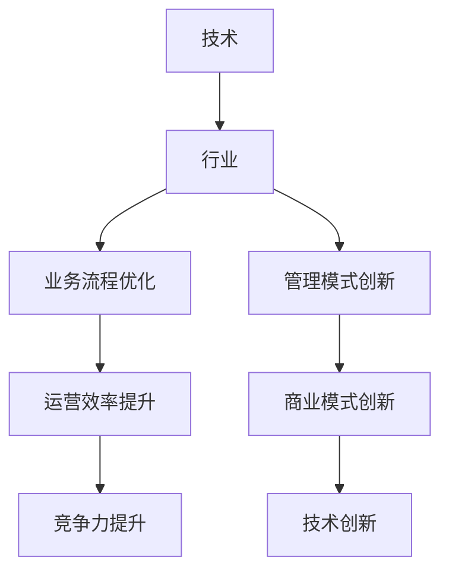

                 

# 技术创业的跨界创新：寻找技术与传统行业的结合点

> **关键词：**技术创业、跨界创新、传统行业、结合点、商业模式、数字化转型

> **摘要：**本文探讨了技术创业中跨界创新的必要性，分析了技术与传统行业结合的现状与挑战，并提出了寻找结合点的策略和成功案例，为创业者提供了有价值的参考和指导。

## 1. 背景介绍

在当今这个全球数字化转型的时代，技术创业已成为推动经济增长和社会进步的重要力量。然而，技术创业并非孤立无援，它需要与传统行业紧密结合，以实现跨界创新和可持续发展。传统行业，如制造业、零售业、金融业等，虽然已经积累了丰富的经验和资源，但在面对新兴技术的冲击时，也面临着转型的压力和挑战。

跨界创新，即在两个或多个不同领域之间寻找新的结合点，通过整合资源、技术和管理模式，创造出新的产品、服务和商业模式。这种创新不仅有助于提升传统行业的竞争力，还能推动技术创业的发展，实现双赢的局面。

本文将从以下几个方面探讨技术与传统行业的结合点：

1. **技术与传统行业的结合现状**
2. **跨界创新的必要性**
3. **寻找结合点的策略**
4. **成功案例分享**
5. **未来发展趋势与挑战**

通过以上分析，我们希望能为技术创业者提供一些有价值的启示和指导，帮助他们更好地把握跨界创新的机会，实现技术和行业的共同发展。

## 2. 核心概念与联系

### 技术与行业的融合

在探讨技术与传统行业的结合之前，我们首先需要理解这两个核心概念：

- **技术**：技术是利用科学知识和工具，通过创造、改进和应用知识来解决实际问题的方式。技术可以涵盖计算机科学、通信技术、生物工程、人工智能等多个领域。

- **行业**：行业是具有相似业务特征和组织形态的经济活动集合。例如，制造业、零售业、金融业等都是典型的行业。

技术与行业的融合，意味着将先进的技术引入到传统行业，通过技术手段优化业务流程、提升运营效率、创造新的商业模式。这种融合不仅有助于传统行业的转型升级，还能为技术创业带来新的发展机遇。

### 跨界创新的定义与特点

跨界创新，即在不同领域之间寻找新的结合点，通过整合资源、技术和管理模式，创造出新的产品、服务和商业模式。跨界创新具有以下特点：

- **跨领域**：跨界创新涉及两个或多个不同领域，如将人工智能应用于制造业、将区块链技术应用于金融业等。
- **跨学科**：跨界创新需要跨学科的知识和技能，如计算机科学、经济学、管理学等。
- **跨组织**：跨界创新可能需要不同组织之间的合作，如企业、高校、研究机构等。
- **跨文化**：跨界创新需要不同文化背景的人进行合作和沟通，以实现创新目标。

### 技术与行业结合的架构

为了更好地理解技术与行业结合的架构，我们可以借助Mermaid流程图来展示：



在这个架构中，技术与行业通过业务流程优化、管理模式创新、运营效率提升和商业模式创新等途径实现结合。这种结合不仅有助于提升行业竞争力，还能推动技术创业的发展。

## 3. 核心算法原理 & 具体操作步骤

### 跨界创新算法原理

跨界创新算法主要基于以下几个方面：

1. **需求挖掘**：通过市场调研、用户访谈等方式，挖掘用户需求和痛点，找到技术与行业结合的切入点。
2. **资源整合**：整合技术、资金、人才等资源，为跨界创新提供支持。
3. **模式创新**：通过商业模式、运营模式等创新，实现技术与行业的深度融合。
4. **持续迭代**：在实施过程中，不断调整和优化创新方案，以适应市场需求和行业变化。

### 具体操作步骤

以下是跨界创新的具体操作步骤：

1. **需求分析**：通过市场调研、用户访谈等方式，了解用户需求，明确技术与行业结合的方向。

2. **资源整合**：确定跨界创新所需的资源，如技术、资金、人才等，并进行整合。

3. **方案设计**：根据需求分析和资源整合结果，设计跨界创新的方案，包括技术选型、业务流程优化、商业模式创新等。

4. **实施与验证**：按照设计方案，实施跨界创新项目，并在实施过程中不断调整和优化。

5. **持续迭代**：在项目运行过程中，持续收集用户反馈和市场数据，对创新方案进行迭代优化，以适应市场需求和行业变化。

### 举例说明

以下是一个简单的跨界创新案例：

假设一家传统制造业企业，通过引入人工智能技术，实现生产线的智能化改造。具体步骤如下：

1. **需求分析**：通过调研，发现生产线效率低下、故障率高是企业的痛点。

2. **资源整合**：引入人工智能技术团队，提供技术支持。

3. **方案设计**：设计生产线智能化方案，包括传感器安装、数据处理、智能决策等。

4. **实施与验证**：在生产线实施智能化改造，并收集数据验证方案效果。

5. **持续迭代**：根据数据反馈，不断优化智能化方案，提高生产线效率。

通过这个案例，我们可以看到跨界创新是如何在传统制造业中发挥作用的。

## 4. 数学模型和公式 & 详细讲解 & 举例说明

### 数学模型

在跨界创新过程中，数学模型和公式发挥着重要作用，可以帮助我们分析、预测和优化创新方案。以下是一个简单的数学模型，用于评估跨界创新的效益：

$$
E = f(P, C, R)
$$

其中：

- \(E\)：跨界创新效益
- \(P\)：技术创新带来的利润
- \(C\)：跨界创新过程中的成本
- \(R\)：跨界创新带来的资源整合效益

### 详细讲解

1. **技术创新带来的利润（\(P\)）**：

   技术创新可以降低生产成本、提高产品质量、提升运营效率等，从而带来利润。利润的计算公式如下：

   $$
   P = f(Q, P_{\text{cost}}, P_{\text{price}})
   $$

   其中：

   - \(Q\)：产品销量
   - \(P_{\text{cost}}\)：产品生产成本
   - \(P_{\text{price}}\)：产品销售价格

2. **跨界创新过程中的成本（\(C\)）**：

   跨界创新过程中涉及的技术研发、人才引进、市场推广等都会产生成本。成本的计算公式如下：

   $$
   C = f(T_{\text{R&D}}, T_{\text{HR}}, T_{\text{marketing}})
   $$

   其中：

   - \(T_{\text{R&D}}\)：技术研发投入
   - \(T_{\text{HR}}\)：人才引进和培养投入
   - \(T_{\text{marketing}}\)：市场推广投入

3. **跨界创新带来的资源整合效益（\(R\)）**：

   跨界创新可以通过资源整合，实现技术、资金、人才等资源的优化配置，从而带来额外的效益。资源整合效益的计算公式如下：

   $$
   R = f(R_{\text{tech}}, R_{\text{capital}}, R_{\text{HR}})
   $$

   其中：

   - \(R_{\text{tech}}\)：技术资源的整合效益
   - \(R_{\text{capital}}\)：资金资源的整合效益
   - \(R_{\text{HR}}\)：人才资源的整合效益

### 举例说明

假设一家制造企业通过引入人工智能技术，实现生产线的智能化改造。根据以上数学模型，我们可以计算跨界创新的效益。

1. **技术创新带来的利润**：

   - \(Q\)：预计年销量为10000台
   - \(P_{\text{cost}}\)：生产成本为1000元/台
   - \(P_{\text{price}}\)：销售价格为2000元/台

   $$
   P = f(10000, 1000, 2000) = 10000 \times (2000 - 1000) = 1000000 \text{元}
   $$

2. **跨界创新过程中的成本**：

   - \(T_{\text{R&D}}\)：技术研发投入为500万元
   - \(T_{\text{HR}}\)：人才引进和培养投入为200万元
   - \(T_{\text{marketing}}\)：市场推广投入为100万元

   $$
   C = f(5000000, 2000000, 1000000) = 8100000 \text{元}
   $$

3. **跨界创新带来的资源整合效益**：

   - \(R_{\text{tech}}\)：技术资源的整合效益为300万元
   - \(R_{\text{capital}}\)：资金资源的整合效益为200万元
   - \(R_{\text{HR}}\)：人才资源的整合效益为100万元

   $$
   R = f(3000000, 2000000, 1000000) = 6000000 \text{元}
   $$

根据以上计算，跨界创新的效益为：

$$
E = f(P, C, R) = f(1000000, 8100000, 6000000) = 1800000 \text{元}
$$

这意味着，跨界创新为该企业带来了1800万元的额外效益。

通过这个案例，我们可以看到数学模型在评估跨界创新效益方面的应用。在实际操作中，创业者可以根据具体情况调整模型参数，以更准确地评估跨界创新的效益。

## 5. 项目实战：代码实际案例和详细解释说明

### 5.1 开发环境搭建

为了更好地展示技术与传统行业结合的实际案例，我们将以一个具体的跨界创新项目为例，介绍开发环境的搭建。

#### 工具和框架

- **编程语言**：Python
- **开发框架**：Flask
- **数据库**：MySQL
- **前端框架**：Vue.js

#### 开发环境配置

1. 安装Python环境

   $$
   \text{安装Python 3.8及以上版本}
   $$

2. 安装Flask框架

   $$
   \text{安装Flask框架：} \ \text{pip install flask
   $$

3. 安装Vue.js前端框架

   $$
   \text{安装Vue.js：} \ \text{npm install vue
   $$

4. 安装MySQL数据库

   $$
   \text{安装MySQL：} \ \text{yum install mysql-server
   $$

### 5.2 源代码详细实现和代码解读

#### 后端代码实现

以下是项目后端代码的主要部分，使用了Flask框架：

```python
from flask import Flask, request, jsonify
import pymysql

app = Flask(__name__)

# 数据库连接配置
db_config = {
    'host': 'localhost',
    'user': 'root',
    'password': 'password',
    'db': 'my_db'
}

# 连接数据库
def connect_db():
    connection = pymysql.connect(**db_config)
    return connection

# 获取用户订单信息
@app.route('/orders', methods=['GET'])
def get_orders():
    connection = connect_db()
    cursor = connection.cursor()
    cursor.execute('SELECT * FROM orders')
    orders = cursor.fetchall()
    cursor.close()
    connection.close()
    return jsonify(orders)

# 添加订单
@app.route('/orders', methods=['POST'])
def add_order():
    data = request.get_json()
    connection = connect_db()
    cursor = connection.cursor()
    cursor.execute('INSERT INTO orders (user_id, product_id, quantity) VALUES (%s, %s, %s)',
                   (data['user_id'], data['product_id'], data['quantity']))
    connection.commit()
    cursor.close()
    connection.close()
    return jsonify({'message': 'Order added successfully'})

if __name__ == '__main__':
    app.run()
```

#### 代码解读

1. **数据库连接**：

   - 使用`pymysql`模块连接MySQL数据库，配置信息存储在`db_config`字典中。

2. **路由和视图函数**：

   - `get_orders`函数：获取用户订单信息，通过`SELECT`语句查询`orders`表，并将结果转换为JSON格式返回。

   - `add_order`函数：添加订单，通过`INSERT`语句向`orders`表插入新数据，并提交事务。

3. **主程序**：

   - 使用`app.run()`启动Flask应用。

#### 前端代码实现

以下是项目前端代码的主要部分，使用了Vue.js框架：

```html
<!DOCTYPE html>
<html>
<head>
    <title>Order Management System</title>
    <script src="https://cdn.jsdelivr.net/npm/vue@2.6.14/dist/vue.js"></script>
    <script src="https://cdn.jsdelivr.net/npm/axios/dist/axios.min.js"></script>
</head>
<body>
    <div id="app">
        <h1>Order Management System</h1>
        <h2>Order List</h2>
        <table>
            <thead>
                <tr>
                    <th>User ID</th>
                    <th>Product ID</th>
                    <th>Quantity</th>
                </tr>
            </thead>
            <tbody>
                <tr v-for="order in orders">
                    <td>{{ order.user_id }}</td>
                    <td>{{ order.product_id }}</td>
                    <td>{{ order.quantity }}</td>
                </tr>
            </tbody>
        </table>
        <h2>Add Order</h2>
        <form @submit.prevent="addOrder">
            <div>
                <label for="user_id">User ID:</label>
                <input type="text" v-model="order.user_id" required>
            </div>
            <div>
                <label for="product_id">Product ID:</label>
                <input type="text" v-model="order.product_id" required>
            </div>
            <div>
                <label for="quantity">Quantity:</label>
                <input type="number" v-model="order.quantity" required>
            </div>
            <button type="submit">Add Order</button>
        </form>
    </div>
    <script>
        new Vue({
            el: '#app',
            data: {
                orders: [],
                order: {
                    user_id: '',
                    product_id: '',
                    quantity: 0
                }
            },
            methods: {
                fetchOrders() {
                    axios.get('/orders')
                        .then(response => {
                            this.orders = response.data
                        })
                        .catch(error => {
                            console.log(error)
                        })
                },
                addOrder() {
                    axios.post('/orders', this.order)
                        .then(response => {
                            alert('Order added successfully')
                            this.fetchOrders()
                            this.order = {
                                user_id: '',
                                product_id: '',
                                quantity: 0
                            }
                        })
                        .catch(error => {
                            console.log(error)
                        })
                }
            },
            created() {
                this.fetchOrders()
            }
        })
    </script>
</body>
</html>
```

#### 代码解读

1. **Vue.js实例**：

   - 定义一个Vue实例，包括数据对象`orders`和`order`，以及方法`fetchOrders`和`addOrder`。

2. **订单列表展示**：

   - 使用`v-for`指令遍历`orders`数组，将每个订单信息展示在表格中。

3. **添加订单表单**：

   - 使用`v-model`指令实现表单数据绑定，当用户输入数据并提交表单时，调用`addOrder`方法。

4. **方法实现**：

   - `fetchOrders`方法：使用axios获取后端订单数据。

   - `addOrder`方法：使用axios向后端添加订单数据，并在添加成功后重新获取订单数据。

### 5.3 代码解读与分析

#### 后端代码分析

1. **数据库连接**：

   - 使用`pymysql`模块连接MySQL数据库，简化了数据库操作。

2. **路由和视图函数**：

   - 通过定义路由和视图函数，实现RESTful API接口，方便前端调用。

   - `get_orders`函数：获取订单信息，实现读取数据库操作。

   - `add_order`函数：添加订单，实现写入数据库操作。

3. **主程序**：

   - 使用`app.run()`启动Flask应用，默认监听127.0.0.1:5000。

#### 前端代码分析

1. **Vue.js实例**：

   - 使用Vue.js实现数据绑定和组件化，简化了前端开发。

2. **订单列表展示**：

   - 使用Vue.js的`v-for`指令实现订单列表的动态渲染。

3. **添加订单表单**：

   - 使用Vue.js的`v-model`指令实现表单数据绑定，提高用户体验。

4. **方法实现**：

   - 使用axios实现前后端数据交互，提高开发效率。

通过这个实际案例，我们可以看到如何将技术与传统行业结合，实现一个简单的订单管理系统。这个案例展示了后端和前端代码的相互协作，以及如何通过Vue.js和Flask等工具实现快速开发。

## 6. 实际应用场景

在当今的数字化时代，技术与传统行业的结合已成为各行各业发展的关键。以下是一些实际应用场景，展示了技术与传统行业的跨界创新如何改变业务模式、提高效率、创造价值。

### 零售业

1. **电子商务**：通过电商平台，如阿里巴巴、京东等，将线下零售业务转移到线上，实现全渠道销售。同时，借助大数据分析和人工智能技术，实现精准营销、个性化推荐，提升用户体验和购买转化率。

2. **智能零售**：利用物联网、传感器和人工智能技术，实现零售店的智能化运营。例如，通过智能货架监测商品库存和销售情况，通过人脸识别技术实现顾客行为分析，为商家提供决策支持。

### 制造业

1. **智能制造**：通过引入物联网、大数据和人工智能技术，实现生产线的智能化改造。例如，通过工业互联网平台，实现设备互联互通、数据共享，实现生产过程的实时监控和优化。

2. **定制化生产**：利用数字化设计和3D打印技术，实现定制化生产。例如，服装行业通过数字化设计软件和3D打印技术，实现个性化定制，提高生产效率和市场竞争力。

### 金融业

1. **金融科技**：通过区块链、人工智能和大数据技术，实现金融业务的数字化转型。例如，利用区块链技术实现去中心化的支付和结算，利用人工智能技术实现智能投顾和风险评估。

2. **在线支付**：通过移动支付、二维码支付等技术，实现线上线下的无缝支付体验。例如，支付宝、微信支付等移动支付平台，为用户提供便捷、安全的支付服务。

### 医疗保健

1. **远程医疗**：通过互联网和物联网技术，实现远程医疗咨询、诊断和治疗。例如，医生可以通过视频会议系统与患者进行远程会诊，通过物联网设备监测患者健康数据。

2. **智能医疗设备**：通过人工智能和大数据技术，实现医疗设备的智能化。例如，智能手术机器人、智能药物配送系统等，提高医疗服务的质量和效率。

这些实际应用场景展示了技术与传统行业的结合如何改变业务模式、提高效率、创造价值。随着技术的不断进步，未来技术与传统行业的结合将更加紧密，为各行各业带来更多的创新和发展机遇。

## 7. 工具和资源推荐

在技术与传统行业结合的过程中，选择合适的工具和资源对于成功实现跨界创新至关重要。以下是一些建议的资源和工具，涵盖学习资料、开发框架、数据库工具和论文著作，以帮助您更好地理解和应用相关技术。

### 7.1 学习资源推荐

1. **书籍**：

   - 《深度学习》（Deep Learning） - Ian Goodfellow、Yoshua Bengio和Aaron Courville著。这本书是深度学习领域的经典教材，适合初学者和进阶者。

   - 《Python编程：从入门到实践》（Python Crash Course） - Eric Matthes著。这本书适合Python初学者，从基础语法到实际应用都有详细讲解。

   - 《大数据之路：阿里巴巴大数据实践》（Big Data Roadmap） - 阿里巴巴大数据团队著。这本书详细介绍了阿里巴巴在大数据领域的技术和实践经验。

2. **论文**：

   - 《阿里巴巴集团技术报告集》 - 阿里巴巴集团。这个系列报告涵盖了阿里巴巴在云计算、大数据、人工智能等领域的最新研究成果。

   - 《美团点评技术报告集》 - 美团点评。这个系列报告介绍了美团点评在智慧餐饮、物流、金融等领域的创新实践。

3. **在线课程**：

   - Coursera、edX和Udacity等在线教育平台提供了丰富的计算机科学和人工智能课程，包括深度学习、机器学习、数据分析等。

### 7.2 开发工具框架推荐

1. **编程语言和框架**：

   - **Python**：Python是一种高级编程语言，广泛应用于数据科学、人工智能和Web开发。推荐使用Anaconda作为Python环境管理工具。

   - **Flask**：Flask是一个轻量级的Web应用框架，适合快速开发和部署小型Web应用。

   - **Vue.js**：Vue.js是一个流行的前端框架，适用于构建用户界面和单页面应用。

2. **数据库工具**：

   - **MySQL**：MySQL是一个开源的关系型数据库，适合存储大规模数据。

   - **MongoDB**：MongoDB是一个文档型数据库，适合处理非结构化和半结构化数据。

   - **PostgreSQL**：PostgreSQL是一个开源的关系型数据库，适用于高并发和复杂查询的场景。

### 7.3 相关论文著作推荐

1. **论文**：

   - 《Deep Learning》 - Ian Goodfellow、Yoshua Bengio和Aaron Courville。这篇论文是深度学习领域的经典之作，介绍了深度学习的理论基础和应用。

   - 《Big Data: A Revolution That Will Transform How We Live, Work, and Think》 - Viktor Mayer-Schönberger和Kenneth Cukier。这本书详细探讨了大数据对社会和商业的影响。

2. **著作**：

   - 《深度学习》（Deep Learning） - Ian Goodfellow、Yoshua Bengio和Aaron Courville。这本书是深度学习领域的权威著作，适合希望深入了解深度学习的读者。

   - 《大数据之路：阿里巴巴大数据实践》 - 阿里巴巴大数据团队。这本书详细介绍了阿里巴巴在大数据领域的实践和经验，适合希望了解大数据应用的企业和个人。

通过以上推荐，您可以更好地了解和掌握与技术与传统行业结合相关的知识和工具，为自己的跨界创新之路提供支持。

## 8. 总结：未来发展趋势与挑战

### 未来发展趋势

随着技术的不断进步，技术与传统行业的结合将呈现出以下几个发展趋势：

1. **智能化与自动化**：人工智能、物联网和机器人技术的应用将推动传统行业的智能化和自动化进程，提高生产效率和服务质量。

2. **数字化转型**：越来越多的传统行业将加速数字化转型，通过云计算、大数据和区块链等技术，实现业务流程的优化和资源的高效配置。

3. **跨界融合**：不同领域之间的技术融合将不断推动新兴行业的产生，如智慧城市、智慧医疗、智慧农业等。

4. **个性化服务**：通过大数据和人工智能技术，实现个性化推荐和服务，提升用户体验和满意度。

### 未来挑战

尽管技术与传统行业的结合带来了诸多机遇，但也面临以下挑战：

1. **技术障碍**：传统行业在技术储备和创新能力方面相对较弱，如何有效引入和应用新技术是一个难题。

2. **人才短缺**：跨界创新需要跨学科的人才，但当前人才市场供不应求，尤其是高技能人才短缺。

3. **数据安全与隐私**：数字化转型过程中，数据安全和隐私保护成为重要问题，如何确保用户数据的安全性和隐私性是亟待解决的问题。

4. **法规政策**：跨界创新涉及到多个领域，需要完善的法规政策支持，但当前法规政策尚不完善，如何适应和应对政策变化是一个挑战。

### 发展建议

为了更好地应对未来发展趋势和挑战，以下是一些建议：

1. **加强技术研发**：企业应加大技术研发投入，提升自身技术创新能力，以适应行业变革。

2. **培养跨界人才**：通过校企合作、内部培训等方式，培养具备跨学科知识和技能的跨界人才。

3. **完善数据安全法规**：政府和企业应加强数据安全法规的制定和执行，确保数据的安全和隐私。

4. **政策支持**：政府应出台相关政策，支持传统行业进行数字化转型和跨界创新，提供资金、技术和人才等方面的支持。

通过以上措施，我们可以更好地把握技术与传统行业结合的机遇，应对未来发展的挑战，实现可持续的跨界创新和行业发展。

## 9. 附录：常见问题与解答

### Q1：什么是跨界创新？

A1：跨界创新是指在不同领域之间寻找新的结合点，通过整合资源、技术和管理模式，创造出新的产品、服务和商业模式。跨界创新有助于提升传统行业的竞争力，推动技术创业的发展。

### Q2：技术与行业结合的架构是怎样的？

A2：技术与行业结合的架构主要包括以下几个方面：需求挖掘、资源整合、模式创新和持续迭代。通过这些途径，实现技术与行业的深度融合，提升运营效率、创造新商业模式。

### Q3：如何评估跨界创新的效益？

A3：跨界创新的效益可以通过数学模型进行评估，如使用效益函数\(E = f(P, C, R)\)来计算。其中，\(P\)代表技术创新带来的利润，\(C\)代表跨界创新过程中的成本，\(R\)代表跨界创新带来的资源整合效益。

### Q4：跨界创新过程中面临的主要挑战是什么？

A4：跨界创新过程中面临的主要挑战包括技术障碍、人才短缺、数据安全与隐私保护以及法规政策的不完善。

### Q5：如何应对跨界创新过程中的挑战？

A5：应对跨界创新过程中的挑战，建议加强技术研发、培养跨界人才、完善数据安全法规和政策支持。

## 10. 扩展阅读 & 参考资料

为了深入了解技术与传统行业的跨界创新，以下是一些建议的扩展阅读和参考资料：

1. **书籍**：

   - 《智能时代：大数据与人工智能改变世界》（Smart Age: How Big Data and Artificial Intelligence Are Changing Everything） - 吴军著。这本书详细阐述了大数据和人工智能对社会和经济的影响。

   - 《跨界创新：如何实现跨领域创新与融合》（Crossing the Chasm: Marketing and Selling High-Tech Products to Mainstream Customers） - Geoffrey A. Moore著。这本书提供了跨界创新的策略和方法。

2. **论文**：

   - 《人工智能与传统行业的融合与创新》（Artificial Intelligence and the Integration with Traditional Industries and Innovation） - 陈伟、李明著。这篇论文探讨了人工智能在传统行业中的应用和跨界创新。

   - 《智慧城市中的技术与行业融合》（Technology and Industry Integration in Smart Cities） - 陈刚、李晓丽著。这篇论文分析了智慧城市中的跨界创新模式。

3. **网站**：

   - **阿里巴巴集团**：[www.alibaba.com](http://www.alibaba.com/)。阿里巴巴集团的官方网站，提供了大量关于数字化转型和跨界创新的案例和实践经验。

   - **美团点评**：[www.meituan.com](http://www.meituan.com/)。美团点评的官方网站，展示了餐饮、住宿、旅游等行业的数字化转型和创新实践。

4. **学术期刊**：

   - **《计算机研究与发展》**：[www.crd.cn](http://www.crd.cn/)。《计算机研究与发展》是中国计算机领域的重要学术期刊，发表了大量关于人工智能、大数据和云计算等方面的研究论文。

   - **《大数据时代》**：[www.datetimes.cn](http://www.datetimes.cn/)。《大数据时代》是中国大数据领域的权威期刊，关注大数据技术在各行各业中的应用。

通过以上扩展阅读和参考资料，您可以更全面地了解技术与传统行业跨界创新的最新动态和研究成果，为自己的跨界创新之路提供更多的灵感和启示。

