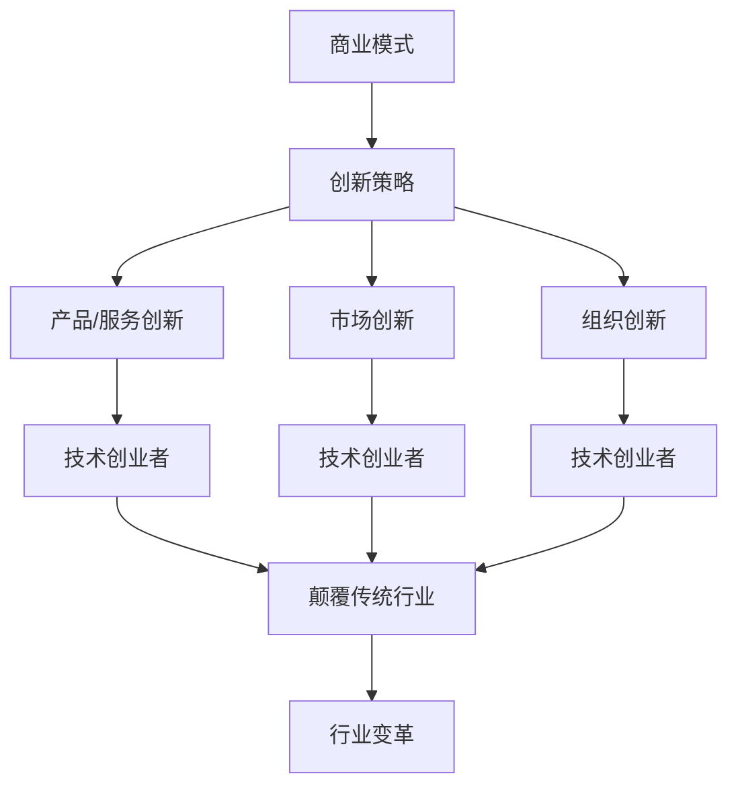

                 

# 技术创业者的商业模式创新：颠覆传统行业的方法

## 关键词：技术创业，商业模式，创新，传统行业，颠覆

## 摘要：

本文旨在探讨技术创业者在商业模式创新中的关键作用，以及如何通过创新策略颠覆传统行业。文章首先介绍了当前商业环境中的主要挑战，然后深入探讨了商业模式创新的核心概念和策略。接着，文章分析了技术创业者在商业模式创新中的优势和具体方法，并提供了一系列实用工具和资源推荐。最后，文章总结了商业模式创新的前景与挑战，为技术创业者提供了一份实用的指导手册。

## 1. 背景介绍

随着科技的迅猛发展，传统行业正面临着前所未有的挑战。新兴技术的崛起，如人工智能、大数据、区块链等，正在改变各行各业的运作方式。然而，许多传统行业的商业模式仍然停留在过去，无法适应快速变化的市场环境。这种商业模式的滞后性使得许多企业难以在竞争中脱颖而出，甚至面临倒闭的风险。

在这种背景下，技术创业者成为了推动商业模式创新的重要力量。他们拥有创新思维和专业知识，能够洞察市场变化，发现潜在的商业机会。通过商业模式创新，技术创业者不仅能够颠覆传统行业，还能为消费者带来更多价值，推动整个行业向更高效、更智能的方向发展。

## 2. 核心概念与联系

### 商业模式

商业模式是指企业创造、传递和捕获价值的系统。它包括产品或服务的设计、目标客户群体、盈利模式、关键资源、关键合作伙伴和业务流程等要素。一个成功的商业模式能够为企业带来持续的竞争优势，实现可持续发展。

### 创新策略

创新策略是指企业在商业模式中引入新的想法、方法或技术，以创造更多价值的过程。创新策略可以包括产品创新、服务创新、市场创新、组织创新等不同方面。通过创新策略，企业能够打破传统模式的限制，实现商业模式的颠覆。

### 技术创业者的角色

技术创业者是商业模式创新的重要推动者。他们通常具备技术背景和创业精神，能够敏锐地捕捉市场变化，快速响应客户需求。技术创业者通过技术创新，优化业务流程，提升用户体验，从而实现商业模式的颠覆。

### Mermaid 流程图



## 3. 核心算法原理 & 具体操作步骤

### 商业模式创新的核心算法原理

商业模式创新的核心算法原理可以概括为以下几个步骤：

1. **市场调研与需求分析**：通过市场调研，了解目标客户的需求和痛点，发现潜在的商业机会。

2. **创新思维与方法**：运用创新思维和方法，如头脑风暴、设计思考、精益创业等，提出创新性的商业想法。

3. **商业模式设计**：根据市场调研和商业想法，设计一个能够创造、传递和捕获价值的商业模式。

4. **验证与迭代**：通过实际操作，验证商业模式的可行性和效果，并根据反馈进行迭代优化。

### 具体操作步骤

1. **市场调研与需求分析**

   - 收集市场数据：通过市场调研、行业报告、竞品分析等手段，了解市场趋势、竞争对手、消费者需求等。

   - 分析消费者需求：通过用户访谈、问卷调查、数据分析等手段，深入了解消费者的需求、痛点和期望。

2. **创新思维与方法**

   - 头脑风暴：组织团队进行头脑风暴，提出创新性的商业想法。

   - 设计思考：通过用户画像、用户体验设计等手段，构建一个以用户为中心的创新方案。

   - 精益创业：运用精益创业的方法，快速构建最小可行产品（MVP），验证商业想法的可行性。

3. **商业模式设计**

   - 确定产品或服务：根据市场需求，设计出能够满足消费者需求的产品或服务。

   - 确定目标客户群体：明确目标客户群体的特征、需求和购买力。

   - 确定盈利模式：根据产品或服务，设计出可持续的盈利模式。

   - 确定关键资源：明确实现商业模式所需的关键资源，如技术、资金、人才等。

   - 确定关键合作伙伴：寻找能够共同实现商业模式的合作伙伴，如供应商、分销商、投资者等。

   - 设计业务流程：根据商业模式，设计出高效的业务流程，确保价值创造和传递。

4. **验证与迭代**

   - 实际操作：将商业模式付诸实践，开展业务。

   - 数据分析：通过数据监测和分析，了解业务运营情况，发现潜在问题。

   - 反馈与优化：根据用户反馈和市场变化，不断优化商业模式，提高其可行性和效果。

## 4. 数学模型和公式 & 详细讲解 & 举例说明

### 数学模型和公式

在商业模式创新中，数学模型和公式可以用于分析市场趋势、消费者行为、商业绩效等关键因素。以下是一些常见的数学模型和公式：

1. **回归分析**：用于分析市场趋势和消费者行为。

   - 线性回归模型：\( y = a + bx \)

   - 多元回归模型：\( y = a + bx_1 + cx_2 + ... + nx_n \)

2. **概率模型**：用于分析市场竞争和风险。

   - 概率分布函数：\( f(x) = P(X \le x) \)

   - 贝叶斯定理：\( P(A|B) = \frac{P(B|A) \cdot P(A)}{P(B)} \)

3. **财务分析模型**：用于评估商业模式的财务可行性。

   - 净现值（NPV）：\( NPV = \sum_{t=0}^{n} \frac{CF_t}{(1+r)^t} \)

   - 内部收益率（IRR）：\( IRR = r \)，使得 \( NPV = 0 \)

### 详细讲解和举例说明

1. **回归分析**

   假设我们想要分析消费者收入与其购买意愿之间的关系。我们可以使用线性回归模型进行数据分析：

   - 数据集：包含消费者的收入（\( x \)）和购买意愿（\( y \)）的数据。

   - 回归模型：\( y = a + bx \)

   - 计算回归系数：通过最小二乘法计算回归系数 \( a \) 和 \( b \)。

   - 分析结果：通过回归系数，我们可以得出消费者收入与其购买意愿之间的线性关系。例如，当收入增加1单位时，购买意愿将增加 \( b \) 单位。

2. **概率模型**

   假设我们想要分析市场竞争的概率。我们可以使用概率分布函数和贝叶斯定理进行数据分析：

   - 数据集：包含市场竞争的数据，如市场份额、销售额等。

   - 概率分布函数：\( f(x) = P(X \le x) \)

   - 贝叶斯定理：\( P(A|B) = \frac{P(B|A) \cdot P(A)}{P(B)} \)

   - 分析结果：通过概率分布函数和贝叶斯定理，我们可以得出市场竞争的概率分布，并计算出特定事件（如市场份额超过50%）的概率。

3. **财务分析模型**

   假设我们想要评估一个商业模式的财务可行性。我们可以使用净现值（NPV）和内部收益率（IRR）进行财务分析：

   - 数据集：包含商业模式的现金流数据。

   - 净现值（NPV）：\( NPV = \sum_{t=0}^{n} \frac{CF_t}{(1+r)^t} \)

   - 内部收益率（IRR）：\( IRR = r \)，使得 \( NPV = 0 \)

   - 分析结果：通过净现值和内部收益率，我们可以判断商业模式的财务可行性。例如，如果NPV大于0，且IRR高于预期的收益率，则认为商业模式具有财务可行性。

## 5. 项目实战：代码实际案例和详细解释说明

### 5.1 开发环境搭建

为了更好地理解商业模式创新的过程，我们将使用一个实际项目来演示。以下是一个基于人工智能的推荐系统项目的开发环境搭建步骤：

1. **安装Python环境**：在本地计算机上安装Python环境，版本要求为3.8及以上。

2. **安装依赖库**：使用pip命令安装项目所需的依赖库，如TensorFlow、Scikit-learn、Pandas等。

3. **配置数据集**：下载并配置推荐系统所需的数据集，如电影评分数据、商品销售数据等。

### 5.2 源代码详细实现和代码解读

以下是一个简单的基于协同过滤算法的推荐系统项目的源代码实现：

```python
import pandas as pd
from sklearn.model_selection import train_test_split
from sklearn.metrics.pairwise import cosine_similarity

# 读取数据集
data = pd.read_csv('ratings.csv')
users, movies, ratings = data['user_id'], data['movie_id'], data['rating']

# 划分训练集和测试集
train_data, test_data = train_test_split(data, test_size=0.2, random_state=42)

# 计算电影之间的相似度
similarity_matrix = cosine_similarity(train_data[['user_id', 'rating']].values, train_data[['user_id', 'rating']].values)

# 预测用户对未评分的电影的评分
def predict_rating(user_id, movie_id):
    user_similarity = similarity_matrix[user_id]
    movie_similarity = similarity_matrix[movie_id]
    similarity_score = user_similarity.dot(movie_similarity) / np.linalg.norm(user_similarity) * np.linalg.norm(movie_similarity)
    return ratings[user_id] * similarity_score

# 预测测试集的评分
predictions = [predict_rating(user_id, movie_id) for user_id, movie_id in test_data[['user_id', 'movie_id']].values]

# 计算预测误差
error = np.mean(np.abs(predictions - test_data['rating']))
print(f'Prediction Error: {error}')
```

### 5.3 代码解读与分析

上述代码实现了一个基于协同过滤算法的推荐系统。以下是代码的详细解读与分析：

1. **数据读取与处理**：首先，从CSV文件中读取用户、电影和评分数据。然后，将数据集划分为训练集和测试集。

2. **计算电影相似度**：使用余弦相似度计算电影之间的相似度，得到相似度矩阵。

3. **预测用户评分**：定义一个函数，用于预测用户对未评分的电影的评分。该函数利用相似度矩阵计算用户与电影之间的相似度，并计算预测评分。

4. **预测测试集评分**：使用预测函数计算测试集中每对用户和电影的预测评分。

5. **计算预测误差**：计算预测评分与实际评分之间的误差，评估推荐系统的性能。

通过上述代码实现，我们可以构建一个简单的推荐系统，并根据预测误差评估其性能。在实际应用中，我们可以进一步优化算法，如使用基于内容的推荐、矩阵分解等方法，提高推荐系统的准确性和效果。

## 6. 实际应用场景

商业模式创新在各个行业都有广泛的应用场景。以下是一些具体的应用案例：

### 零售行业

亚马逊（Amazon）通过电子商务平台颠覆了传统零售行业。通过大数据分析和人工智能技术，亚马逊实现了个性化推荐、智能搜索和精准营销等功能，极大地提升了用户体验和购物效率。此外，亚马逊的物流体系也实现了高效配送，进一步降低了消费者的购买成本。

### 金融行业

支付宝（Alipay）通过移动支付技术颠覆了传统金融行业。支付宝提供了一站式金融解决方案，包括支付、转账、理财、保险等，使得用户可以随时随地完成金融交易。此外，支付宝还通过大数据分析和人工智能技术，为用户提供个性化的金融产品和服务。

### 教育行业

网易云课堂（NetEase Cloud Classroom）通过在线教育平台颠覆了传统教育行业。网易云课堂提供了丰富的在线课程资源，用户可以根据自己的需求和兴趣进行学习。此外，网易云课堂还通过大数据分析和人工智能技术，为用户提供个性化的学习建议和课程推荐，提高了学习效果。

### 医疗行业

平安好医生（PingAn Good Doctor）通过在线医疗服务平台颠覆了传统医疗行业。平安好医生提供了一站式医疗解决方案，包括在线咨询、在线问诊、药品配送等，使得患者可以随时随地获得专业的医疗服务。此外，平安好医生还通过大数据分析和人工智能技术，为用户提供个性化的健康管理建议和疾病预防方案。

## 7. 工具和资源推荐

为了帮助技术创业者更好地进行商业模式创新，我们推荐以下工具和资源：

### 7.1 学习资源推荐

- **《商业模式新生代》**：作者：亚历山大·奥斯特沃尔德、伊万·威尔士
- **《创新者的思考方式》**：作者：克莱顿·克里斯坦森
- **《精益创业》**：作者：埃里克·莱斯

### 7.2 开发工具框架推荐

- **Python**：一款功能强大的编程语言，适用于数据分析和人工智能开发。
- **TensorFlow**：一款流行的开源深度学习框架，适用于构建和训练神经网络模型。
- **Scikit-learn**：一款开源机器学习库，提供了丰富的算法和工具，适用于数据分析与建模。

### 7.3 相关论文著作推荐

- **《深度学习》**：作者：伊恩·古德费洛、约书亚·本吉奥、亚伦·库维尔
- **《大数据技术基础》**：作者：唐杰、唐悦、李明杰
- **《区块链技术指南》**：作者：李笑来

## 8. 总结：未来发展趋势与挑战

商业模式创新是技术创业者推动行业变革的重要手段。随着科技的不断进步，商业模式创新将呈现出以下发展趋势：

1. **数据驱动的创新**：随着大数据和人工智能技术的发展，数据将成为商业模式创新的核心驱动力。企业将更加依赖数据分析和挖掘，实现精准营销、个性化服务和智能决策。

2. **跨界融合的创新**：不同行业之间的界限将逐渐模糊，跨界融合将成为商业模式创新的重要趋势。企业将通过跨界合作，整合多方资源，实现业务模式的创新和价值的最大化。

3. **绿色可持续的创新**：环保和可持续发展将成为商业模式创新的重要方向。企业将更加注重环保责任和社会责任，通过绿色技术和环保产品，实现商业价值与社会价值的双重提升。

然而，商业模式创新也面临着一系列挑战：

1. **技术风险**：新兴技术的快速发展带来了技术风险，如数据安全、隐私保护等。技术创业者需要具备足够的技术能力，确保商业模式的可行性和安全性。

2. **市场风险**：新兴市场的竞争激烈，商业模式创新的成功率较低。技术创业者需要具备敏锐的市场洞察力和快速响应能力，以应对市场变化和竞争压力。

3. **人才风险**：商业模式创新需要具备多方面专业知识和技能的人才。技术创业者需要吸引和留住优秀人才，确保团队的整体竞争力。

总之，商业模式创新是技术创业者的重要任务。通过不断探索和实践，技术创业者将能够颠覆传统行业，为消费者带来更多价值，推动行业向更高效、更智能的方向发展。

## 9. 附录：常见问题与解答

### 9.1 商业模式创新的基本原则是什么？

商业模式创新的基本原则包括：1）价值创造，确保商业模式能够为消费者带来实质性价值；2）可持续性，商业模式需要具备长期发展的潜力；3）差异化，通过创新实现与竞争对手的差异化；4）可执行性，商业模式需要具备实际操作的可执行性。

### 9.2 商业模式创新的方法有哪些？

商业模式创新的方法包括：1）市场调研与需求分析，了解市场需求和消费者痛点；2）创新思维与方法，如头脑风暴、设计思考、精益创业等；3）商业模式设计，根据市场调研和商业想法，设计出能够创造、传递和捕获价值的商业模式；4）验证与迭代，通过实际操作验证商业模式的可行性，并根据反馈进行迭代优化。

### 9.3 技术创业者在商业模式创新中的作用是什么？

技术创业者在商业模式创新中的作用包括：1）技术洞察，通过技术背景和专业知识，发现潜在的技术创新机会；2）业务创新，通过技术驱动，优化业务流程，提升用户体验；3）资源整合，通过技术创新，吸引和整合多方资源，实现商业模式的落地。

## 10. 扩展阅读 & 参考资料

- **《商业模式创新手册》**：作者：史蒂夫·布兰克
- **《技术创新与商业模式》**：作者：刘锋
- **《商业的本质》**：作者：张瑞敏
- **《互联网思维》**：作者：李治国

-----------------------

**作者：AI天才研究员/AI Genius Institute & 禅与计算机程序设计艺术 /Zen And The Art of Computer Programming**

