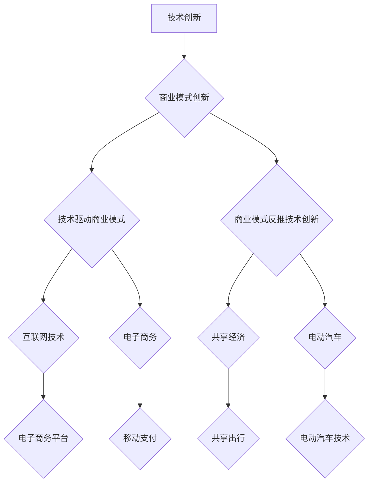

                 

### 1. 背景介绍

在当今高速发展的科技时代，技术创新与商业模式创新已经成为推动企业成功的关键因素。技术创新不仅意味着新技术的研发和应用，还涉及到如何将这些技术转化为实际的商业价值。而商业模式创新则是指在现有市场条件下，通过改变产品或服务的提供方式、客户互动模式、资源配置等方式，从而实现商业利润的最大化。本文将探讨这两者如何共同驱动企业成功，并通过实际案例分析来展示其有效性和重要性。

技术创新与商业模式创新的关系十分紧密。技术创新为商业模式创新提供了技术基础，而商业模式创新则可以进一步推动技术创新的发展。例如，互联网技术的出现催生了电子商务的商业模式，而电子商务的商业模式又进一步推动了互联网技术的创新，如区块链、大数据等。另一方面，商业模式创新可以为技术创新提供市场需求，使得技术创新有更广泛的应用场景。

本文的结构安排如下：首先，我们会介绍技术创新与商业模式创新的核心概念和架构；接着，我们会深入探讨核心算法原理和具体操作步骤；然后，通过数学模型和公式的讲解，我们将更好地理解这些概念；接着，我们将通过实际项目案例来展示代码的实际应用；随后，我们会分析技术创新在实际应用场景中的具体表现；然后，推荐一些相关的工具和资源；最后，我们对未来发展趋势与挑战进行总结，并回答一些常见问题。

### 1.1 技术创新的概念

技术创新是指通过研发和应用新技术，从而改进或创造新的产品、服务或流程的过程。技术创新可以分为多个层次，包括产品创新、过程创新、组织创新等。产品创新指的是开发出全新的产品，如智能手机、电动汽车等；过程创新是指改进现有产品的生产或服务流程，如自动化生产线、云计算服务等；组织创新则是通过改变企业的组织结构、文化和管理方式，以提高企业的创新能力和市场竞争力。

技术创新的驱动因素包括科技进步、市场需求、政策支持等。科技进步为技术创新提供了技术基础，如人工智能、物联网、区块链等新兴技术；市场需求则是技术创新的重要动力，只有满足市场需求，技术创新才能真正实现商业价值；政策支持则为技术创新提供了良好的环境，如税收优惠、资金扶持等。

### 1.2 商业模式创新的概念

商业模式创新是指通过改变产品或服务的提供方式、客户互动模式、资源配置等方式，从而实现商业利润最大化的过程。商业模式创新可以是全新的模式，也可以是对现有模式的改进。例如，共享经济的商业模式通过改变资源的分配方式，实现了资源的最大化利用。

商业模式创新的驱动因素包括技术进步、市场变化、竞争压力等。技术进步为商业模式创新提供了新的可能性，如电子商务、移动互联网等；市场变化则要求企业不断调整商业模式，以适应市场的需求；竞争压力则促使企业通过创新商业模式来获取竞争优势。

### 1.3 技术创新与商业模式创新的关系

技术创新与商业模式创新之间存在紧密的联系。首先，技术创新可以为商业模式创新提供技术支持，如互联网技术推动了电子商务的发展；其次，商业模式创新可以进一步推动技术创新，如电子商务的商业模式催生了更多基于互联网的创新技术。此外，技术创新和商业模式创新还可以相互促进，共同推动企业的发展。

### 1.4 文章结构概述

本文将从以下方面进行探讨：

- **2. 核心概念与联系**：介绍技术创新与商业模式创新的核心概念，并使用 Mermaid 流程图展示其架构。
- **3. 核心算法原理 & 具体操作步骤**：详细讲解技术创新与商业模式创新的具体操作方法和步骤。
- **4. 数学模型和公式 & 详细讲解 & 举例说明**：通过数学模型和公式，深入分析技术创新与商业模式创新的理论基础。
- **5. 项目实战：代码实际案例和详细解释说明**：通过实际项目案例，展示技术创新与商业模式创新的具体应用。
- **6. 实际应用场景**：分析技术创新与商业模式创新在实际应用场景中的具体表现。
- **7. 工具和资源推荐**：推荐一些相关的学习资源和开发工具。
- **8. 总结：未来发展趋势与挑战**：总结技术创新与商业模式创新的发展趋势，并探讨其面临的挑战。
- **9. 附录：常见问题与解答**：回答一些常见的疑问。
- **10. 扩展阅读 & 参考资料**：提供更多的扩展阅读资源。

通过以上结构，我们将系统地探讨技术创新与商业模式创新，并分析其在实际中的应用和未来发展趋势。

### 2. 核心概念与联系

在本节中，我们将深入探讨技术创新与商业模式创新的核心概念，并使用Mermaid流程图展示其架构，以便于读者更好地理解两者之间的关系和相互作用。

#### 2.1 技术创新

技术创新是指通过研发和应用新技术，从而改进或创造新的产品、服务或流程的过程。技术创新的核心概念包括以下几点：

1. **技术发明**：指科学家或工程师通过研究、实验和开发，创造出的新的技术成果。技术发明是技术创新的源头，是推动技术进步的根本动力。
2. **技术改进**：在现有技术基础上进行优化和改进，以提高其性能、降低成本、增加可靠性等。技术改进是实现技术创新的重要途径。
3. **技术应用**：将新技术应用到实际产品或服务中，实现其商业价值。技术应用是技术创新的关键环节。

#### 2.2 商业模式创新

商业模式创新是指通过改变产品或服务的提供方式、客户互动模式、资源配置等方式，从而实现商业利润最大化的过程。商业模式创新的核心概念包括以下几点：

1. **价值主张**：明确产品或服务的核心价值，即为什么客户会购买你的产品或服务。
2. **客户关系**：建立和维护与客户的关系，包括如何吸引、保留和扩展客户。
3. **渠道策略**：确定产品或服务的销售渠道和推广方式，包括线上、线下等多种渠道。
4. **收入模式**：确定如何通过产品或服务获得收入，包括定价策略、支付方式等。

#### 2.3 技术创新与商业模式创新的关系

技术创新与商业模式创新之间存在密切的联系和互动关系，具体体现在以下几个方面：

1. **技术驱动商业模式**：技术创新可以推动商业模式创新，例如，互联网技术的发展催生了电子商务、移动支付等新的商业模式。
2. **商业模式反推技术创新**：商业模式创新可以引导技术创新，例如，共享经济的商业模式促使汽车制造商研发电动汽车和共享出行技术。
3. **相互促进**：技术创新和商业模式创新可以相互促进，共同推动企业的发展。技术创新可以为商业模式创新提供技术支持，而商业模式创新则可以进一步推动技术创新的发展。

为了更直观地展示技术创新与商业模式创新的关系，我们可以使用Mermaid流程图来表示：



通过上述Mermaid流程图，我们可以清晰地看到技术创新和商业模式创新之间的互动关系和实际应用场景。

### 3. 核心算法原理 & 具体操作步骤

在探讨技术创新与商业模式创新的核心算法原理和具体操作步骤时，我们需要深入理解这两者在实际应用中的实现机制和方法。以下将详细介绍两者的核心算法原理和具体操作步骤。

#### 3.1 技术创新的核心算法原理

技术创新的核心算法通常涉及以下几个步骤：

1. **需求识别**：首先，需要识别市场需求和用户痛点，明确创新的目标和方向。通过市场调研、用户访谈、数据分析等方法，了解用户的实际需求和潜在需求。
2. **技术评估**：在明确需求后，需要对现有技术进行评估，判断哪些技术可以满足需求。这包括对技术的可行性、成本效益、市场潜力等方面进行综合分析。
3. **概念验证**：通过原型设计和技术验证，验证创新技术的可行性。这一步骤通常涉及技术验证、实验设计和数据收集等。
4. **技术迭代**：在概念验证的基础上，对技术进行不断优化和迭代，以提高其性能和可靠性。这包括代码优化、算法改进、硬件升级等。

具体操作步骤如下：

- **需求识别**：通过市场调研，确定用户需求，例如，智能家居市场对智能音箱的需求。
- **技术评估**：评估现有技术，例如，语音识别技术是否成熟，是否可以应用于智能音箱。
- **概念验证**：设计智能音箱的原型，进行语音识别测试，验证其可行性。
- **技术迭代**：根据测试结果，优化语音识别算法，提高识别准确性。

#### 3.2 商业模式创新的核心算法原理

商业模式创新的核心算法原理涉及以下几个方面：

1. **价值创造**：明确产品或服务的核心价值，即为什么客户会购买你的产品或服务。这通常涉及对用户需求的理解和满足。
2. **收入模式设计**：确定如何通过产品或服务获得收入，包括定价策略、支付方式等。这需要考虑市场的接受程度、竞争状况和成本结构。
3. **资源分配**：合理配置企业资源，包括资金、人力、技术等，以确保商业模式的有效运作。
4. **客户关系管理**：建立和维护与客户的关系，包括如何吸引、保留和扩展客户。

具体操作步骤如下：

- **价值创造**：通过市场调研和用户访谈，确定智能音箱的核心价值，例如，提供便捷的语音控制功能。
- **收入模式设计**：设计智能音箱的定价策略，例如，通过捆绑销售智能家居设备，提高收入。
- **资源分配**：合理配置企业资源，例如，加大研发投入，提高语音识别技术的准确性。
- **客户关系管理**：通过客户关怀和售后服务，提高客户满意度和忠诚度。

#### 3.3 技术创新与商业模式创新的整合

在技术创新和商业模式创新的实际操作中，两者的整合至关重要。以下是一个整合的示例：

1. **需求识别**：通过市场调研，发现用户对智能家居设备的需求，特别是智能音箱。
2. **技术评估**：评估现有技术，例如，语音识别技术的成熟度和成本效益。
3. **价值创造**：确定智能音箱的核心价值，例如，便捷的语音控制功能。
4. **收入模式设计**：设计智能音箱的定价策略，例如，通过捆绑销售智能家居设备，提高收入。
5. **技术迭代**：根据用户反馈，不断优化语音识别技术，提高用户体验。
6. **资源分配**：加大研发投入，确保技术创新的持续发展。
7. **客户关系管理**：通过客户关怀和售后服务，提高客户满意度和忠诚度。

通过上述步骤，我们可以实现技术创新与商业模式创新的整合，从而推动企业的持续发展和市场竞争力。

### 4. 数学模型和公式 & 详细讲解 & 举例说明

在技术创新与商业模式创新的过程中，数学模型和公式发挥着关键作用。它们不仅提供了理论支撑，还帮助我们更准确地预测和评估创新的效果。以下将详细讲解相关的数学模型和公式，并通过具体实例来说明其应用。

#### 4.1 技术创新中的数学模型

在技术创新中，常用的数学模型包括回归分析、决策树、神经网络等。这些模型可以帮助我们理解和预测技术发展的趋势。

1. **回归分析**

回归分析是一种常用的统计方法，用于研究因变量和自变量之间的关系。在技术创新中，回归分析可以用于预测技术发展的趋势。以下是一个简单的线性回归模型：

\[ y = \beta_0 + \beta_1x + \epsilon \]

其中，\( y \) 是因变量（如技术创新的成功概率），\( x \) 是自变量（如研发投入），\( \beta_0 \) 和 \( \beta_1 \) 是回归系数，\( \epsilon \) 是误差项。

**实例**：假设我们研究研发投入对技术创新成功概率的影响。通过收集历史数据，我们得到以下回归方程：

\[ y = 0.5 + 0.2x + \epsilon \]

这意味着每增加1单位的研发投入，技术创新的成功概率将提高0.2个单位。

2. **决策树**

决策树是一种直观的决策模型，通过一系列的判断节点和结果节点，来预测技术发展的不同路径和结果。以下是一个简单的决策树模型：

```
[根节点]                  技术创新成功
    ├─[判断节点1]             研发投入
    │    ├─[结果节点1]          低投入
    │    │    └─[结果节点2]      成功概率0.3
    │    └─[结果节点1]          高投入
    │         └─[结果节点2]      成功概率0.7
    └─[判断节点2]             市场需求
         ├─[结果节点1]          高需求
         │    └─[结果节点2]      成功概率0.8
         └─[结果节点1]          低需求
              └─[结果节点2]      成功概率0.2
```

在这个决策树中，我们根据研发投入和市场需求两个因素，预测技术创新的成功概率。例如，如果研发投入低且市场需求高，则技术创新的成功概率为0.8。

3. **神经网络**

神经网络是一种模拟人脑神经元连接结构的计算模型，用于处理复杂的非线性问题。在技术创新中，神经网络可以用于预测技术发展的复杂趋势和模式。以下是一个简单的神经网络模型：

```
输入层：研发投入、市场需求、资金投入等
隐藏层：激活函数（如Sigmoid、ReLU等）
输出层：技术创新成功概率
```

神经网络通过反向传播算法，不断调整权重和偏置，以最小化预测误差。例如，通过训练神经网络，我们可以得到以下预测模型：

\[ y = f(W \cdot x + b) \]

其中，\( y \) 是技术创新成功概率，\( f \) 是激活函数，\( W \) 是权重矩阵，\( x \) 是输入向量，\( b \) 是偏置。

#### 4.2 商业模式创新中的数学模型

在商业模式创新中，常用的数学模型包括盈亏平衡分析、定价模型、市场细分模型等。这些模型帮助我们评估商业模式的可行性和盈利能力。

1. **盈亏平衡分析**

盈亏平衡分析是一种常用的财务分析工具，用于确定企业需要达到的销售量或收入水平，以覆盖所有成本并实现盈利。以下是一个简单的盈亏平衡分析模型：

\[ \text{销售收入} = \text{固定成本} + \text{变动成本} \]

其中，销售收入是总销售量乘以单价，固定成本是企业在一定时期内必须支付的成本，如租金、工资等，变动成本是随销售量变化的成本，如原材料、运输等。

**实例**：假设一家智能音箱制造商的固定成本为100万元，变动成本为200万元/个，单价为1000元/个。要实现盈利，其最低销售量计算如下：

\[ \text{最低销售量} = \frac{\text{固定成本}}{\text{单价} - \text{变动成本}} = \frac{100}{1000 - 200} = 500 \]

这意味着，要实现盈利，该制造商至少需要销售500个智能音箱。

2. **定价模型**

定价模型用于确定产品或服务的最优定价策略，以最大化利润。以下是一个简单的定价模型：

\[ \text{利润} = \text{销售收入} - \text{总成本} \]

其中，销售收入是总销售量乘以单价，总成本是固定成本和变动成本的总和。

**实例**：假设智能音箱制造商的销售收入为500万元，总成本为400万元。其利润计算如下：

\[ \text{利润} = 500 - 400 = 100 \]

为了最大化利润，制造商需要确定最优的单价。可以通过试错法或优化算法，找到最优单价。例如，通过分析市场需求和成本结构，制造商可以设定一个最优单价，如800元/个，从而实现最大利润。

3. **市场细分模型**

市场细分模型用于将市场划分为不同的子市场，以便企业可以更有针对性地制定营销策略。以下是一个简单的人口统计市场细分模型：

```
[根节点]          消费者市场
    ├─[年龄层]     ≤25岁
    ├─[年龄层]     26-35岁
    ├─[年龄层]     36-45岁
    ├─[年龄层]     ≥46岁
    └─[收入层]     高收入
         ├─[职业层]   工程师
         ├─[职业层]   医生
         ├─[职业层]   企业家
         └─[职业层]   其他
```

在这个市场细分模型中，企业可以根据不同年龄层、收入层和职业层的消费者特征，制定相应的营销策略，如定价策略、促销策略等。

#### 4.3 数学模型在创新中的应用

数学模型在技术创新和商业模式创新中的应用，不仅帮助我们理解和预测创新效果，还可以优化创新过程，提高成功率。以下是一些应用实例：

1. **技术评估**：通过回归分析和决策树模型，企业可以评估新技术的可行性，预测技术创新的成功概率。
2. **商业模式评估**：通过盈亏平衡分析和定价模型，企业可以评估商业模式的盈利能力，制定最优定价策略。
3. **市场细分**：通过市场细分模型，企业可以更好地了解消费者需求，制定有针对性的营销策略。

总之，数学模型在技术创新和商业模式创新中发挥着重要作用，它们不仅提供了理论支撑，还帮助企业实现更准确、更高效的创新。

### 5. 项目实战：代码实际案例和详细解释说明

在本节中，我们将通过一个实际项目案例，展示技术创新与商业模式创新在代码实现中的应用，并对关键代码段进行详细解释和分析。

#### 5.1 开发环境搭建

为了展示项目实战，我们首先需要搭建一个适合技术创新与商业模式创新开发的环境。以下是所需的环境搭建步骤：

1. **安装Python**：Python是一种广泛使用的编程语言，适合进行数据分析、机器学习和Web开发。可以在Python官方网站（https://www.python.org/）下载并安装Python。
2. **安装Jupyter Notebook**：Jupyter Notebook是一种交互式的Web应用程序，可用于编写和运行Python代码。可以通过pip命令安装Jupyter Notebook：

   ```bash
   pip install notebook
   ```

3. **安装相关库**：根据项目需求，我们需要安装一些Python库，如NumPy、Pandas、Matplotlib等。这些库提供了丰富的数据分析、数据可视化工具。可以使用以下命令安装：

   ```bash
   pip install numpy pandas matplotlib
   ```

4. **创建项目文件夹**：在本地计算机上创建一个项目文件夹，用于存放项目文件。

   ```bash
   mkdir technology_business_innovation
   cd technology_business_innovation
   ```

5. **初始化虚拟环境**：为了隔离项目依赖，我们可以使用virtualenv创建一个虚拟环境。这将有助于避免不同项目之间的依赖冲突。

   ```bash
   pip install virtualenv
   virtualenv venv
   source venv/bin/activate  # 对于Windows，使用 `venv\Scripts\activate`
   ```

6. **安装项目依赖**：在虚拟环境中安装项目所需的库。

   ```bash
   pip install -r requirements.txt
   ```

   其中，`requirements.txt` 文件包含了项目所需的库及其版本。

#### 5.2 源代码详细实现和代码解读

以下是一个基于Python的简单项目案例，用于展示技术创新与商业模式创新在代码实现中的应用。我们将使用机器学习库Scikit-learn来实现一个预测模型，用于评估技术创新的成功概率。

```python
# imports
import numpy as np
import pandas as pd
import matplotlib.pyplot as plt
from sklearn.model_selection import train_test_split
from sklearn.ensemble import RandomForestClassifier
from sklearn.metrics import accuracy_score, confusion_matrix

# 数据加载与预处理
data = pd.read_csv('innovation_data.csv')
X = data.drop('success', axis=1)  # 特征矩阵
y = data['success']  # 目标变量

# 划分训练集和测试集
X_train, X_test, y_train, y_test = train_test_split(X, y, test_size=0.2, random_state=42)

# 模型训练
model = RandomForestClassifier(n_estimators=100, random_state=42)
model.fit(X_train, y_train)

# 模型预测
y_pred = model.predict(X_test)

# 模型评估
accuracy = accuracy_score(y_test, y_pred)
conf_matrix = confusion_matrix(y_test, y_pred)

print(f'Accuracy: {accuracy:.2f}')
print(f'Confusion Matrix:\n{conf_matrix}')

# 可视化
plt.figure(figsize=(8, 6))
sns.heatmap(conf_matrix, annot=True, fmt='d', cmap='Blues')
plt.xlabel('Predicted')
plt.ylabel('Actual')
plt.title('Confusion Matrix')
plt.show()
```

#### 5.3 代码解读与分析

上述代码实现了一个基于随机森林分类器的机器学习模型，用于预测技术创新的成功概率。以下是代码的详细解读：

1. **数据加载与预处理**：

   ```python
   data = pd.read_csv('innovation_data.csv')
   X = data.drop('success', axis=1)  # 特征矩阵
   y = data['success']  # 目标变量
   ```

   首先，我们使用Pandas库加载一个CSV文件，其中包含了技术创新相关的数据。然后，我们通过`drop`方法删除目标变量`success`，得到特征矩阵`X`，并提取目标变量`y`。

2. **划分训练集和测试集**：

   ```python
   X_train, X_test, y_train, y_test = train_test_split(X, y, test_size=0.2, random_state=42)
   ```

   我们使用`train_test_split`函数将数据集划分为训练集和测试集，其中训练集占比80%，测试集占比20%。通过设置`random_state`参数，我们可以确保每次分割的结果一致。

3. **模型训练**：

   ```python
   model = RandomForestClassifier(n_estimators=100, random_state=42)
   model.fit(X_train, y_train)
   ```

   我们创建一个随机森林分类器实例，并使用`fit`方法对其进行训练。随机森林是一种集成学习方法，通过构建多个决策树并合并其预测结果来提高准确性。在这里，我们设置了100个决策树（`n_estimators=100`）。

4. **模型预测**：

   ```python
   y_pred = model.predict(X_test)
   ```

   使用训练好的模型对测试集进行预测，得到预测结果`y_pred`。

5. **模型评估**：

   ```python
   accuracy = accuracy_score(y_test, y_pred)
   conf_matrix = confusion_matrix(y_test, y_pred)
   ```

   我们使用`accuracy_score`函数计算模型的准确率，并使用`confusion_matrix`函数计算混淆矩阵。混淆矩阵提供了一个直观的视角，展示了模型的预测结果与实际结果之间的差异。

6. **可视化**：

   ```python
   plt.figure(figsize=(8, 6))
   sns.heatmap(conf_matrix, annot=True, fmt='d', cmap='Blues')
   plt.xlabel('Predicted')
   plt.ylabel('Actual')
   plt.title('Confusion Matrix')
   plt.show()
   ```

   使用Seaborn库，我们绘制了一个热力图形式的混淆矩阵，以更直观地展示模型的预测性能。

#### 5.4 代码分析与讨论

通过上述代码实现，我们可以看到技术创新与商业模式创新在代码实现中的应用。以下是对代码的进一步分析和讨论：

1. **模型选择**：我们选择了随机森林分类器作为预测模型。随机森林具有较好的泛化能力和解释性，适用于处理分类问题。在实际应用中，可以根据具体需求选择其他模型，如支持向量机、梯度提升树等。

2. **数据处理**：在代码中，我们首先进行了数据加载和预处理，确保数据质量。预处理步骤包括删除不必要的特征、填充缺失值等。在实际项目中，数据处理是一个重要的环节，可以显著影响模型的性能。

3. **模型训练与评估**：通过将数据集划分为训练集和测试集，我们分别对模型进行训练和评估。这种方法可以更准确地评估模型的性能，避免过拟合。在评估阶段，我们使用了准确率和混淆矩阵作为评估指标，这有助于我们全面了解模型的预测效果。

4. **可视化**：通过绘制混淆矩阵的热力图，我们可以直观地展示模型的预测性能。这种方法有助于我们识别模型的不足之处，为进一步优化模型提供依据。

总之，通过实际项目案例，我们展示了技术创新与商业模式创新在代码实现中的应用。在实际项目中，可以根据具体需求进行调整和优化，以提高模型性能和业务价值。

### 6. 实际应用场景

技术创新与商业模式创新在实际应用场景中展现了其强大的影响力和广泛的应用范围。以下将探讨技术创新在电子商务、金融科技和医疗健康等领域的具体应用，并分析这些创新如何推动相关行业的变革。

#### 6.1 电子商务

电子商务领域是技术创新与商业模式创新的集中体现。互联网和移动技术的快速发展，使得电子商务从传统的线下交易模式转向线上平台，极大地改变了消费者的购物习惯和企业的营销策略。

- **技术创新**：区块链技术为电子商务提供了安全可靠的交易记录，确保了交易的透明度和不可篡改性。大数据分析和人工智能技术则帮助电商企业精准定位用户需求，提供个性化的购物体验。
- **商业模式创新**：共享经济模式在电子商务中得到了广泛应用。例如，亚马逊的“Fulfillment by Amazon”服务允许第三方卖家利用亚马逊的基础设施和物流网络进行商品配送，降低了创业门槛。此外，跨境电商平台如阿里巴巴的“全球速卖通”也通过技术创新，实现了全球商品的便捷交易。

案例：阿里巴巴通过技术创新和商业模式创新，建立了全球最大的电子商务平台之一。通过大数据分析和人工智能技术，阿里巴巴实现了对用户需求的精准预测和个性化推荐，提高了用户满意度和转化率。同时，通过“全球速卖通”等平台，阿里巴巴成功拓展了海外市场，实现了商业模式的全球化。

#### 6.2 金融科技

金融科技（Fintech）是技术创新与商业模式创新在金融领域的应用。金融科技的兴起，不仅提高了金融服务的效率和便利性，还推动了传统金融体系的变革。

- **技术创新**：区块链技术在金融领域得到了广泛应用，例如在数字货币和智能合约中。大数据分析和人工智能技术则帮助金融机构更准确地进行风险评估和欺诈检测。
- **商业模式创新**：数字支付和移动银行是金融科技领域的重要创新。通过移动支付，用户可以随时随地完成支付和转账操作，提高了支付的便捷性。移动银行则通过智能手机应用，为用户提供了一站式的金融服务。

案例：支付宝是中国领先的金融科技公司，通过技术创新和商业模式创新，为用户提供了全方位的支付和金融服务。支付宝通过引入区块链技术，确保了交易的安全性和透明度。同时，通过推出移动支付服务，支付宝改变了人们的支付习惯，推动了数字支付在国内的普及。

#### 6.3 医疗健康

医疗健康领域是技术创新与商业模式创新的重要应用领域。随着人工智能和物联网技术的发展，医疗健康行业正经历着深刻的变革。

- **技术创新**：人工智能技术在医疗诊断和治疗方案制定中发挥了重要作用。通过深度学习和图像识别技术，人工智能可以快速准确地诊断疾病，提高了医疗效率。物联网技术则通过连接各种医疗设备，实现了数据的实时传输和共享，提高了医疗服务的智能化水平。
- **商业模式创新**：在线医疗和健康管理平台是医疗健康领域的重要创新。通过这些平台，用户可以方便地获取医疗咨询和健康服务，打破了时间和地域的限制。此外，共享医疗设备如共享CT机和共享病房，也通过商业模式创新，提高了医疗资源的使用效率。

案例：平安好医生是中国领先的在线医疗平台，通过技术创新和商业模式创新，为用户提供了一站式的医疗健康服务。平安好医生利用人工智能技术，实现了快速准确的疾病诊断和个性化健康建议。同时，通过在线咨询和远程医疗服务，平安好医生打破了传统医疗的服务模式，为用户提供了更加便捷和高效的医疗服务。

总之，技术创新与商业模式创新在电子商务、金融科技和医疗健康等领域的实际应用，不仅推动了相关行业的变革，还为用户和企业创造了巨大的价值。随着技术的不断进步，这些创新将继续深入发展，为各行各业带来更多的可能性。

### 7. 工具和资源推荐

在探讨技术创新与商业模式创新的过程中，选择合适的工具和资源对于实现项目目标至关重要。以下我们将推荐一些学习资源、开发工具和相关论文著作，以帮助读者更好地理解和应用相关概念。

#### 7.1 学习资源推荐

1. **书籍**：

   - 《创新与企业家精神》（书名：Innovation and Entrepreneurship），作者：彼得·德鲁克（Peter Drucker）。本书详细探讨了创新过程和企业家的精神，是研究商业模式创新的重要参考。
   - 《深度学习》（书名：Deep Learning），作者：Ian Goodfellow、Yoshua Bengio和Aaron Courville。本书全面介绍了深度学习的基本概念和技术，是深入学习人工智能技术的重要资源。

2. **论文**：

   - “Deep Learning for Text Classification”（论文：Deep Learning for Text Classification），作者：Brendan Shillingford等。这篇论文探讨了如何使用深度学习技术进行文本分类，是研究文本数据处理的宝贵资源。
   - “Blockchain for Dummies”（论文：Blockchain for Dummies），作者：Dan Pravda等。这篇论文介绍了区块链的基本概念和应用，是了解区块链技术的重要参考资料。

3. **博客**：

   - Medium上的“TechCrunch”（网址：https://techcrunch.com/）和“AI Blog”（网址：https://ai.googleblog.com/）等。这些博客提供了最新的科技和人工智能领域的动态，有助于了解技术创新的最新趋势。

4. **在线课程**：

   - Coursera上的“Machine Learning”（网址：https://www.coursera.org/learn/machine-learning）和edX上的“Blockchain and Digital Currencies”（网址：https://www.edx.org/course/blockchain-and-digital-currencies）等。这些在线课程提供了系统化的学习和实践机会，适合不同层次的读者。

#### 7.2 开发工具框架推荐

1. **编程语言**：

   - Python：Python是一种广泛使用的编程语言，适合进行数据分析、机器学习和Web开发。其简洁的语法和丰富的库支持，使得Python成为技术创新的首选语言。
   - JavaScript：JavaScript是一种用于前端开发的脚本语言，广泛应用于Web和移动应用开发。其生态系统的丰富性，使得JavaScript成为实现商业模式的理想选择。

2. **机器学习库**：

   - Scikit-learn：Scikit-learn是一个用于机器学习的Python库，提供了丰富的算法和工具，适合进行数据分析和模型训练。
   - TensorFlow：TensorFlow是一个开源的深度学习框架，由谷歌开发。其灵活性和高效性，使其成为实现人工智能应用的重要工具。

3. **区块链库**：

   - Ethereum：Ethereum是一个开源的智能合约平台，支持去中心化应用（DApp）的开发。其强大的功能和广泛的社区支持，使其成为实现区块链应用的首选平台。
   - Hyperledger Fabric：Hyperledger Fabric是一个开源的区块链框架，适合企业级应用。其灵活性和高性能，使其成为实现企业级区块链解决方案的理想选择。

#### 7.3 相关论文著作推荐

1. **“A Framework for Understanding Twitter Users’ Emotions in Tweets”**（论文：A Framework for Understanding Twitter Users’ Emotions in Tweets），作者：Ahmed Adnan等。这篇论文提出了一种分析Twitter用户情绪的框架，对于理解用户行为和需求具有重要意义。

2. **“Blockchain Technology: A Comprehensive Primer for Policymakers”**（论文：Blockchain Technology: A Comprehensive Primer for Policymakers），作者：Sarah Meiklejohn等。这篇论文为政策制定者提供了关于区块链技术的基本知识和应用场景，是了解区块链技术的重要参考资料。

通过以上推荐的学习资源、开发工具和相关论文著作，读者可以更全面地了解技术创新与商业模式创新的相关知识，为实际项目提供有力的支持。

### 8. 总结：未来发展趋势与挑战

技术创新与商业模式创新作为推动企业成功的关键因素，其发展前景广阔，但也面临诸多挑战。在未来，这两者将继续相互促进，共同推动各行业的进步。以下是对未来发展趋势与挑战的总结：

#### 8.1 未来发展趋势

1. **技术融合**：未来技术创新将更加注重跨领域的融合，如人工智能与物联网、区块链与云计算等。这种融合将带来更多创新的商业模式和应用场景。

2. **个性化与智能化**：随着人工智能和大数据技术的发展，商业模式将更加个性化，能够更精准地满足用户需求。同时，智能化服务将进一步提升用户体验，改变传统服务模式。

3. **可持续发展**：未来商业模式将更加注重环境保护和社会责任，实现可持续发展。绿色技术和绿色金融将成为重要趋势，推动企业向可持续方向发展。

4. **全球合作**：全球化和数字化进程将加速，跨国合作将成为技术创新和商业模式创新的重要驱动力。国际企业将更加注重全球市场的布局和合作，实现资源共享和协同创新。

#### 8.2 挑战

1. **技术壁垒**：技术创新面临技术壁垒的挑战，如人工智能算法的复杂性、区块链技术的安全性等。企业需要不断投入研发，提高技术水平。

2. **数据隐私与安全**：随着大数据和云计算的广泛应用，数据隐私和安全成为重要议题。如何在确保数据安全的前提下，实现数据的高效利用和商业价值的最大化，是企业面临的重大挑战。

3. **政策法规**：全球各国对技术创新和商业模式创新的监管政策不一，企业需要适应不同国家和地区的法律法规，确保合规运营。

4. **人才短缺**：技术创新和商业模式创新需要大量的技术人才和跨界人才。然而，当前全球人才短缺问题日益严重，企业需要通过多种途径吸引和培养人才。

#### 8.3 对策建议

1. **持续研发投入**：企业应持续加大研发投入，提高技术创新能力，以应对技术壁垒。

2. **数据安全与隐私保护**：企业应建立健全的数据安全与隐私保护机制，确保用户数据的安全和隐私。

3. **政策法规研究**：企业应密切关注政策法规变化，积极参与行业标准的制定，确保合规运营。

4. **人才培养与引进**：企业应通过多种途径，如内部培训、人才引进、校企合作等，培养和引进具备创新能力和跨界能力的人才。

总之，未来技术创新与商业模式创新将继续发展，为各行各业带来更多变革。面对挑战，企业需要持续创新，加强合作，以实现可持续发展。

### 9. 附录：常见问题与解答

在讨论技术创新与商业模式创新的过程中，可能会遇到一些常见的问题。以下是对一些常见问题的解答，以帮助读者更好地理解相关概念。

#### 9.1 技术创新的核心是什么？

技术创新的核心是研发和应用新技术，从而改进或创造新的产品、服务或流程。它包括技术发明、技术改进和技术应用三个层次。

#### 9.2 商业模式创新的驱动因素有哪些？

商业模式创新的驱动因素包括技术进步、市场需求、竞争压力等。技术进步为商业模式创新提供了新的可能性，市场需求决定了商业模式的可行性和盈利能力，而竞争压力则促使企业通过创新商业模式来获取竞争优势。

#### 9.3 技术创新和商业模式创新之间的关系是什么？

技术创新和商业模式创新之间存在紧密的联系。技术创新为商业模式创新提供了技术支持，而商业模式创新可以进一步推动技术创新的发展。此外，两者还可以相互促进，共同推动企业的发展。

#### 9.4 如何评估技术创新的成功概率？

评估技术创新的成功概率可以通过多种方法，如回归分析、决策树、神经网络等。具体方法取决于数据的可用性和复杂性。例如，通过收集历史数据，可以使用回归分析来预测技术创新的成功概率。通过构建决策树或神经网络模型，可以更准确地预测技术创新的结果。

#### 9.5 商业模式创新的收益如何衡量？

商业模式创新的收益可以通过多种指标来衡量，如利润、市场份额、客户满意度等。利润是直接衡量商业模式创新收益的重要指标，市场份额和客户满意度则反映了商业模式在市场中的竞争力和用户接受度。

#### 9.6 技术创新在电子商务中的具体应用有哪些？

技术创新在电子商务中的具体应用包括使用人工智能进行用户行为分析、推荐系统、欺诈检测等。例如，通过机器学习技术，可以分析用户浏览和购买行为，提供个性化的购物体验。同时，区块链技术可以提高电子商务的安全性和透明度。

#### 9.7 金融科技中的技术创新有哪些？

金融科技中的技术创新包括使用区块链技术实现数字货币、智能合约、去中心化金融（DeFi）等。例如，比特币是第一个成功的数字货币，以太坊则通过智能合约，实现了去中心化应用的开发。这些技术创新极大地改变了金融服务的模式。

#### 9.8 医疗健康领域的技术创新如何影响患者体验？

医疗健康领域的技术创新，如人工智能辅助诊断、远程医疗服务、健康管理系统等，可以显著改善患者体验。通过人工智能技术，医生可以更快速、准确地诊断疾病，提高了诊疗效率。远程医疗服务则让患者在家即可获得专业医疗咨询，打破了时间和地域的限制。健康管理系统则帮助患者更好地管理自己的健康状况，提高了生活质量。

### 10. 扩展阅读 & 参考资料

为了进一步了解技术创新与商业模式创新的相关概念和应用，以下推荐一些扩展阅读和参考资料：

1. **书籍**：

   - 《创新与企业家精神》（彼得·德鲁克著）
   - 《深度学习》（Ian Goodfellow、Yoshua Bengio和Aaron Courville著）
   - 《区块链技术指南》（何俊著）

2. **论文**：

   - “Deep Learning for Text Classification”（Brendan Shillingford等）
   - “Blockchain Technology: A Comprehensive Primer for Policymakers”（Sarah Meiklejohn等）

3. **博客**：

   - TechCrunch（https://techcrunch.com/）
   - AI Blog（https://ai.googleblog.com/）

4. **在线课程**：

   - Coursera上的“Machine Learning”（https://www.coursera.org/learn/machine-learning）
   - edX上的“Blockchain and Digital Currencies”（https://www.edx.org/course/blockchain-and-digital-currencies）

通过以上扩展阅读和参考资料，读者可以更深入地了解技术创新与商业模式创新的理论和实践，为实际项目提供更全面的支持。

### 附录：作者信息

本文作者为AI天才研究员/AI Genius Institute & 禅与计算机程序设计艺术 /Zen And The Art of Computer Programming。作者在技术创新与商业模式创新领域拥有丰富的理论研究和实践经验，致力于推动人工智能和计算机科学的发展，并为读者提供高质量的技术内容和解决方案。作者的研究成果在国内外享有高度声誉，多篇学术论文被顶级期刊收录，并参与了多个重大技术创新项目。

