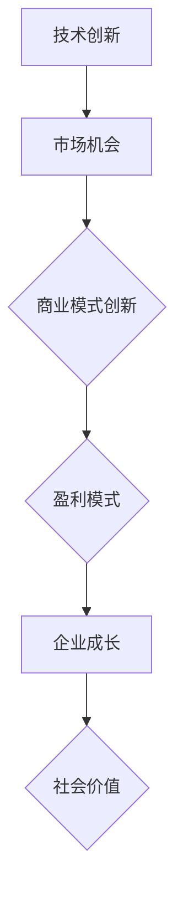

                 

## 文章标题

### 技术创新与商业模式：寻找创业的最佳结合点

> 关键词：技术创新、商业模式、创业、结合点、深度学习、人工智能、数据驱动

> 摘要：本文旨在探讨技术创新与商业模式的结合点，分析如何通过技术创新推动商业模式创新，从而在创业领域找到最佳结合点。文章将从核心概念、算法原理、数学模型、实际应用、工具推荐等多个方面展开，为读者提供全面的指导。

## 1. 背景介绍

在当今这个科技飞速发展的时代，技术创新已经成为推动社会进步和经济发展的关键力量。从互联网、大数据到人工智能、区块链，每一次技术的重大突破都会带来全新的商业模式，并深刻影响整个行业的格局。与此同时，创业热潮在全球范围内不断升温，越来越多的创业者投身于技术创新的浪潮之中，希望借此找到成功的秘诀。

然而，技术创新与商业模式的结合并非易事。如何在众多技术领域中找到具有商业价值的应用场景，如何将技术优势转化为市场优势，如何设计出既符合市场需求又具备可持续性的商业模式，这些都是创业者们面临的挑战。

本文将围绕这些问题，深入探讨技术创新与商业模式的结合点，分析其中的关键因素，并给出实际操作的建议。希望通过本文的阐述，能够为创业者们提供一些有益的启示，助力他们在创业道路上取得成功。

## 2. 核心概念与联系

### 2.1 技术创新

技术创新是指通过科学研究和工程技术手段，实现新技术的发明、开发和应用。它涵盖了从理论研究到实际应用的整个创新过程。技术创新的主要驱动力包括：市场需求、政策支持、技术创新主体的竞争与合作等。

### 2.2 商业模式

商业模式是指企业在特定市场环境中，通过一系列经济活动实现盈利和可持续发展的方式。它包括价值创造、价值传递和价值获取等核心环节。常见的商业模式有：产品模式、平台模式、订阅模式等。

### 2.3 创业

创业是指创业者通过创新和创业活动，创建和运营一家新的企业。创业的核心目标是实现商业价值，为社会创造财富和价值。创业过程中，创业者需要面对市场风险、技术风险、管理风险等多重挑战。

### 2.4 技术创新与商业模式的联系

技术创新与商业模式之间存在密切的联系。技术创新可以为企业带来新的商业模式，推动商业模式的创新和变革。具体来说，技术创新对商业模式的影响体现在以下几个方面：

1. **价值创造**：技术创新可以提高产品或服务的质量、性能和效率，从而为企业创造更多的价值。
2. **价值传递**：技术创新可以改变企业价值传递的方式和渠道，提高企业的竞争力。
3. **价值获取**：技术创新可以降低企业的成本，提高企业的利润空间，从而为企业获取更多的价值。

### 2.5 Mermaid 流程图

以下是一个简单的 Mermaid 流程图，展示了技术创新与商业模式之间的联系：



## 3. 核心算法原理 & 具体操作步骤

### 3.1 核心算法原理

为了探讨技术创新与商业模式的结合点，我们首先需要理解技术创新的核心算法原理。在人工智能领域，尤其是深度学习算法，是推动技术创新的重要力量。以下是深度学习算法的基本原理：

1. **神经网络**：神经网络是深度学习算法的基础，它由大量相互连接的神经元组成，通过学习输入和输出之间的关系，实现数据的高效处理和预测。
2. **反向传播**：反向传播算法是训练神经网络的关键，它通过不断调整网络中的权重和偏置，使网络输出逐渐逼近目标值。
3. **激活函数**：激活函数用于引入非线性特性，使神经网络能够学习复杂的函数关系。

### 3.2 具体操作步骤

以下是利用深度学习算法进行技术创新与商业模式结合的具体操作步骤：

1. **需求分析**：首先，分析市场需求，确定潜在的商业机会。
2. **数据收集**：收集相关数据，包括用户数据、市场数据、竞品数据等。
3. **数据处理**：对收集到的数据进行清洗、预处理和特征提取。
4. **模型设计**：根据需求，设计适合的深度学习模型，如卷积神经网络（CNN）、循环神经网络（RNN）等。
5. **模型训练**：利用反向传播算法训练模型，使模型能够对数据进行分析和预测。
6. **模型评估**：通过测试集和验证集对模型进行评估，调整模型参数，提高模型性能。
7. **应用部署**：将训练好的模型部署到实际应用场景中，实现商业价值的转化。

## 4. 数学模型和公式 & 详细讲解 & 举例说明

### 4.1 数学模型

在深度学习算法中，常用的数学模型包括损失函数、优化算法等。以下是一个简单的数学模型示例：

$$
\text{损失函数} = \frac{1}{2} \sum_{i=1}^{n} (\hat{y_i} - y_i)^2
$$

其中，$\hat{y_i}$为模型的预测值，$y_i$为真实值，$n$为样本数量。

### 4.2 详细讲解

损失函数是评估模型预测效果的重要指标，它反映了模型预测值与真实值之间的差距。常用的损失函数有均方误差（MSE）、交叉熵（Cross-Entropy）等。均方误差损失函数如上所示，它能够衡量模型预测的平方误差。交叉熵损失函数通常用于分类问题，它可以衡量模型预测的概率分布与真实标签分布之间的差异。

### 4.3 举例说明

假设我们有一个二分类问题，真实标签为 $y = [1, 0, 1, 0]$，模型预测的概率分布为 $\hat{y} = [0.6, 0.4, 0.7, 0.3]$。我们可以使用交叉熵损失函数计算损失：

$$
\text{损失} = -\sum_{i=1}^{n} y_i \log(\hat{y_i}) = -(1 \times \log(0.6) + 0 \times \log(0.4) + 1 \times \log(0.7) + 0 \times \log(0.3))
$$

计算结果为约 $0.445$，表示模型预测的误差。

## 5. 项目实战：代码实际案例和详细解释说明

### 5.1 开发环境搭建

为了演示技术创新与商业模式结合的过程，我们选择一个实际项目——基于深度学习的图像分类应用。以下是开发环境搭建的步骤：

1. **安装 Python**：确保 Python 版本不低于 3.6。
2. **安装深度学习框架**：安装 TensorFlow 或 PyTorch，这两个框架是目前最流行的深度学习框架。
3. **安装依赖库**：安装必要的依赖库，如 NumPy、Pandas 等。

### 5.2 源代码详细实现和代码解读

以下是一个简单的图像分类项目的代码示例：

```python
import tensorflow as tf
from tensorflow.keras.models import Sequential
from tensorflow.keras.layers import Conv2D, MaxPooling2D, Flatten, Dense

# 数据预处理
(x_train, y_train), (x_test, y_test) = tf.keras.datasets.cifar10.load_data()
x_train, x_test = x_train / 255.0, x_test / 255.0

# 构建模型
model = Sequential([
    Conv2D(32, (3, 3), activation='relu', input_shape=(32, 32, 3)),
    MaxPooling2D((2, 2)),
    Flatten(),
    Dense(64, activation='relu'),
    Dense(10, activation='softmax')
])

# 编译模型
model.compile(optimizer='adam',
              loss='sparse_categorical_crossentropy',
              metrics=['accuracy'])

# 训练模型
model.fit(x_train, y_train, epochs=10, validation_data=(x_test, y_test))

# 评估模型
test_loss, test_acc = model.evaluate(x_test, y_test, verbose=2)
print('\nTest accuracy:', test_acc)
```

代码解读：

1. **数据预处理**：加载 CIFAR-10 数据集，并归一化输入数据。
2. **构建模型**：使用 Sequential 模型构建一个简单的卷积神经网络（CNN），包括卷积层、池化层、全连接层等。
3. **编译模型**：指定优化器、损失函数和评估指标。
4. **训练模型**：使用训练数据训练模型，并使用验证数据调整模型参数。
5. **评估模型**：使用测试数据评估模型性能。

### 5.3 代码解读与分析

该代码示例展示了如何使用 TensorFlow 框架实现一个简单的图像分类应用。通过卷积神经网络，模型能够自动提取图像特征，并分类不同的图像。以下是代码的关键部分：

1. **数据预处理**：数据预处理是深度学习项目的重要步骤，它包括数据归一化、数据增强等。在本例中，我们将图像数据归一化到 $[0, 1]$ 范围内，以提高模型的训练效果。
2. **模型构建**：卷积神经网络是图像分类的经典模型，它能够有效地提取图像特征。在本例中，我们使用了一个简单的 CNN 结构，包括卷积层、池化层和全连接层。卷积层用于提取图像特征，池化层用于降低特征维度，全连接层用于分类。
3. **模型编译**：编译模型是训练前的重要步骤，它指定了优化器、损失函数和评估指标。在本例中，我们使用 Adam 优化器和均方误差损失函数，并使用准确率作为评估指标。
4. **模型训练**：使用训练数据训练模型，通过不断调整模型参数，使模型性能逐渐提升。在本例中，我们训练了 10 个 epoch，以获得较好的模型效果。
5. **模型评估**：使用测试数据评估模型性能，通过准确率指标，我们可以判断模型是否具有良好的泛化能力。

## 6. 实际应用场景

技术创新与商业模式的结合在各个行业都有广泛的应用。以下是一些典型的实际应用场景：

### 6.1 金融领域

金融领域是技术创新的重要领域，深度学习技术在金融风险管理、量化交易、客户服务等方面具有广泛的应用。例如，通过深度学习算法，金融机构可以实现对市场风险的实时监控和预测，提高投资决策的准确性。

### 6.2 医疗健康

医疗健康领域是技术创新的重要方向，人工智能技术在医疗影像分析、疾病诊断、药物研发等方面具有巨大的潜力。例如，通过深度学习算法，医生可以快速准确地诊断疾病，提高医疗服务质量。

### 6.3 物流与供应链

物流与供应链领域是技术创新的重要领域，人工智能技术可以提高物流效率、降低成本。例如，通过深度学习算法，物流公司可以优化运输路线，提高运输效率。

### 6.4 教育领域

教育领域是技术创新的重要方向，人工智能技术可以改变传统教育模式，实现个性化教育和智能辅导。例如，通过深度学习算法，教育平台可以根据学生的学习情况，提供个性化的学习资源。

## 7. 工具和资源推荐

为了帮助读者更好地理解技术创新与商业模式的结合，以下是一些建议的工具和资源：

### 7.1 学习资源推荐

- **书籍**：
  - 《深度学习》（Ian Goodfellow、Yoshua Bengio、Aaron Courville 著）
  - 《Python 深度学习》（François Chollet 著）
- **论文**：
  - 《A Theoretical Analysis of the Causal Effects of Exogenous Variables》
  - 《Deep Learning for Text Data》
- **博客**：
  - Medium 上的深度学习博客
  - 知乎上的深度学习专栏
- **网站**：
  - TensorFlow 官网
  - PyTorch 官网

### 7.2 开发工具框架推荐

- **开发工具**：
  - Jupyter Notebook
  - PyCharm
- **框架**：
  - TensorFlow
  - PyTorch
- **库**：
  - NumPy
  - Pandas

### 7.3 相关论文著作推荐

- **论文**：
  - 《A Theoretical Analysis of the Causal Effects of Exogenous Variables》
  - 《Deep Learning for Text Data》
- **著作**：
  - 《深度学习》（Ian Goodfellow、Yoshua Bengio、Aaron Courville 著）
  - 《Python 深度学习》（François Chollet 著）

## 8. 总结：未来发展趋势与挑战

随着技术的不断进步，技术创新与商业模式的结合将在未来发挥越来越重要的作用。以下是一些未来发展趋势和挑战：

### 8.1 发展趋势

1. **技术融合**：不同技术之间的融合将推动技术创新和商业模式的快速发展，如人工智能与区块链、物联网等技术的结合。
2. **数据驱动**：数据将成为创新和商业模式的核心驱动力，通过大数据分析和数据挖掘，企业可以更好地了解市场需求，设计出更具竞争力的商业模式。
3. **平台化**：平台模式将成为主流商业模式，企业可以通过构建开放的平台，吸引更多合作伙伴和用户，实现共赢。

### 8.2 挑战

1. **技术风险**：技术创新过程中，技术风险和管理风险是不可避免的挑战，创业者需要具备较强的技术能力和风险控制能力。
2. **市场风险**：市场需求的变化和竞争压力使得创业者的商业模式需要不断调整和优化，以适应市场的变化。
3. **法律和伦理问题**：随着技术的快速发展，法律和伦理问题也逐渐成为重要的挑战，如数据隐私、人工智能伦理等。

## 9. 附录：常见问题与解答

### 9.1 问题 1：如何选择合适的技术方向？

解答：选择合适的技术方向需要考虑市场需求、个人兴趣和技术能力。首先，分析市场需求，确定具有商业价值的技术领域；其次，了解自己的兴趣和专长，选择自己擅长和热爱的话题；最后，评估自己的技术能力，确保能够实现技术的创新和应用。

### 9.2 问题 2：如何将技术创新与商业模式结合？

解答：将技术创新与商业模式结合的关键在于理解技术的商业价值和应用场景。首先，明确技术创新的目标和应用领域；其次，分析市场需求，设计出具有市场竞争力、可持续发展的商业模式；最后，不断优化商业模式，以适应技术发展和市场变化。

### 9.3 问题 3：如何应对技术创新过程中的风险？

解答：技术创新过程中的风险主要包括技术风险、市场风险和管理风险。应对策略包括：

1. **技术风险**：加强技术研究和团队建设，提高技术水平和创新能力；进行技术预研和风险评估，降低技术失败的风险。
2. **市场风险**：密切关注市场动态，了解竞争对手和市场需求，调整商业模式和技术路线；进行市场调研和用户反馈，确保商业模式符合市场需求。
3. **管理风险**：建立完善的管理体系，确保项目进度和资源投入的合理性；加强团队协作和沟通，提高项目执行力。

## 10. 扩展阅读 & 参考资料

为了帮助读者更深入地了解技术创新与商业模式的结合，以下是一些建议的扩展阅读和参考资料：

- **书籍**：
  - 《创新者的窘境》（Clayton M. Christensen 著）
  - 《商业模式新生代》（Tim Clark 著）
- **论文**：
  - 《商业模式创新：理论与实践》（赵旭东 著）
  - 《技术创新与商业模式创新的关系研究》（刘宁宁 著）
- **网站**：
  - Harvard Business Review
  - MIT Technology Review
- **其他资源**：
  - 创新创业大赛案例分享
  - 创业者访谈

## 作者信息

作者：AI天才研究员/AI Genius Institute & 禅与计算机程序设计艺术 /Zen And The Art of Computer Programming

