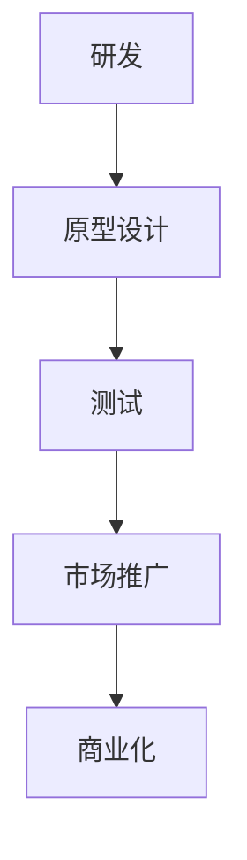

                 

# 技术创新：从发明到商业化全过程

## 摘要

本文将探讨技术创新的整个过程，从最初的想法到最终的商业化。我们将深入研究每个阶段的关键要素、挑战和成功策略，包括研发、原型设计、测试、市场推广、商业化等。本文旨在为科技从业者提供一份全面的技术创新指南，帮助他们更好地把握市场趋势，实现技术突破，并最终将创新成果转化为商业成功。

## 1. 背景介绍

技术创新，是推动社会发展的重要力量。无论是在传统工业时代，还是在当今信息化、数字化时代，技术创新都扮演着至关重要的角色。从蒸汽机到互联网，从手机到人工智能，每一个技术的突破，都带来了生产力的巨大提升，改变了我们的生活方式。

然而，技术创新并非一蹴而就。它需要经过多个阶段的努力和探索，包括研发、测试、优化、市场推广等。每一个阶段都面临着不同的挑战，需要相应的策略和方法。本文将详细探讨这些阶段，以及如何成功实现技术创新。

## 2. 核心概念与联系

为了更好地理解技术创新的全过程，我们需要了解一些核心概念，如研发、原型设计、测试、市场推广、商业化等。

### 研发

研发，即研究与发展，是技术创新的起点。它包括对现有技术的深入研究，以及对新技术的探索。研发的目标是解决实际问题，提升技术性能，或者发现新的应用场景。

### 原型设计

原型设计，是在研发基础上，将概念转化为可操作的模型。原型设计的关键是快速迭代，通过不断的试错和优化，找到最佳解决方案。

### 测试

测试，是验证原型设计的有效性和可靠性的过程。测试可以分为功能测试、性能测试、安全测试等。通过测试，可以发现原型设计中的问题，并进行改进。

### 市场推广

市场推广，是将技术创新推向市场的重要环节。市场推广需要深入了解市场需求，制定有效的营销策略，提高产品的知名度和接受度。

### 商业化

商业化，是将技术创新转化为商业成果的过程。商业化的成功，意味着技术创新获得了市场认可，产生了商业价值。

这些核心概念之间存在着紧密的联系。研发是技术创新的基础，原型设计是研发的延伸，测试是验证原型设计的有效性，市场推广是商业化的重要手段，商业化则是技术创新的最终目标。

下面，我们将使用Mermaid流程图，来展示这些概念之间的联系。



## 3. 核心算法原理 & 具体操作步骤

在技术创新的过程中，算法原理起着至关重要的作用。无论是研发阶段，还是原型设计阶段，算法原理都是解决问题的关键。

### 研发阶段的算法原理

在研发阶段，算法原理主要用于解决具体问题。例如，在人工智能领域，常见的算法原理包括机器学习、深度学习、强化学习等。这些算法原理可以帮助我们实现智能识别、预测、优化等功能。

### 原型设计阶段的算法原理

在原型设计阶段，算法原理主要用于优化解决方案。例如，在物联网领域，我们可以使用算法原理来优化数据传输、设备管理、数据处理等。

下面，我们将以人工智能领域的机器学习为例，详细讲解研发和原型设计阶段的算法原理和操作步骤。

### 研发阶段的机器学习算法原理

#### 步骤1：数据收集与预处理

首先，我们需要收集大量数据，并对数据进行预处理。预处理包括数据清洗、归一化、特征提取等。

$$
\text{数据清洗} = \{ \text{去除噪声、填补缺失值、消除异常值} \}
$$

$$
\text{数据归一化} = \{ \text{将数据缩放到同一范围内，如[0,1]} \}
$$

$$
\text{特征提取} = \{ \text{从原始数据中提取有用信息，形成特征向量} \}
$$

#### 步骤2：选择合适的算法

根据具体问题，选择合适的算法。常见的机器学习算法包括线性回归、逻辑回归、支持向量机、决策树、随机森林、神经网络等。

#### 步骤3：模型训练与优化

使用收集到的数据，对选定的算法进行训练。训练过程中，需要不断调整参数，优化模型性能。

$$
\text{模型训练} = \{ \text{训练样本集 → 模型参数} \}
$$

$$
\text{模型优化} = \{ \text{调整参数 → 模型性能提升} \}
$$

### 原型设计阶段的机器学习算法原理

#### 步骤1：需求分析

首先，明确原型设计的目标和需求。例如，我们可能需要实现一个智能客服系统，用于处理用户提问。

#### 步骤2：数据收集与预处理

与研发阶段类似，我们需要收集大量数据，并对数据进行预处理。

#### 步骤3：算法选择与优化

在原型设计阶段，我们通常会使用一些较为成熟的算法，如神经网络、决策树等。通过调整算法参数，优化模型性能。

#### 步骤4：集成与测试

将多个算法或模块集成在一起，形成一个完整的系统。然后，对系统进行测试，验证其性能和稳定性。

## 4. 数学模型和公式 & 详细讲解 & 举例说明

在技术创新过程中，数学模型和公式起着关键作用。它们不仅帮助我们理解和描述技术原理，还能指导我们的设计和优化工作。

### 研发阶段的数学模型

在研发阶段，我们常用的数学模型包括线性模型、概率模型、优化模型等。

#### 线性模型

线性模型，如线性回归、线性优化等，广泛应用于数据分析和优化问题。

$$
y = \beta_0 + \beta_1 x
$$

其中，$y$ 是因变量，$x$ 是自变量，$\beta_0$ 和 $\beta_1$ 是参数。

#### 概率模型

概率模型，如朴素贝叶斯、决策树等，常用于分类和预测。

$$
P(A|B) = \frac{P(B|A)P(A)}{P(B)}
$$

其中，$P(A|B)$ 表示在 $B$ 发生的条件下 $A$ 发生的概率，$P(B|A)$ 表示在 $A$ 发生的条件下 $B$ 发生的概率，$P(A)$ 和 $P(B)$ 分别表示 $A$ 和 $B$ 的概率。

#### 优化模型

优化模型，如线性规划、动态规划等，用于解决资源分配、路径规划等问题。

$$
\min c^T x \quad \text{subject to} \quad Ax \leq b
$$

其中，$c$ 是系数向量，$x$ 是变量向量，$A$ 是约束矩阵，$b$ 是约束向量。

### 原型设计阶段的数学模型

在原型设计阶段，我们常用的数学模型包括神经网络模型、决策树模型、马尔可夫模型等。

#### 神经网络模型

神经网络模型，如多层感知机、卷积神经网络等，用于图像识别、语音识别等任务。

$$
z_i = \sigma(\sum_j w_{ij} x_j + b_i)
$$

其中，$z_i$ 是输出，$\sigma$ 是激活函数，$w_{ij}$ 是权重，$x_j$ 是输入，$b_i$ 是偏置。

#### 决策树模型

决策树模型，用于分类和回归问题。

$$
y = f(x)
$$

其中，$y$ 是输出，$x$ 是输入，$f$ 是决策树函数。

#### 马尔可夫模型

马尔可夫模型，用于预测和分类。

$$
P(X_t = x_t | X_{t-1} = x_{t-1}, \ldots, X_0 = x_0) = P(X_t = x_t | X_{t-1} = x_{t-1})
$$

其中，$X_t$ 是时间 $t$ 的状态，$x_t$ 是状态 $X_t$ 的取值。

### 举例说明

#### 线性回归模型

假设我们有一个线性回归模型：

$$
y = \beta_0 + \beta_1 x
$$

其中，$y$ 是因变量，$x$ 是自变量，$\beta_0$ 和 $\beta_1$ 是参数。我们的目标是找到最优的 $\beta_0$ 和 $\beta_1$，使得模型预测的 $y$ 与实际观测的 $y$ 尽可能接近。

我们可以使用最小二乘法来求解：

$$
\beta_0 = \bar{y} - \beta_1 \bar{x}
$$

$$
\beta_1 = \frac{\sum_{i=1}^{n} (x_i - \bar{x})(y_i - \bar{y})}{\sum_{i=1}^{n} (x_i - \bar{x})^2}
$$

其中，$n$ 是样本数量，$\bar{x}$ 和 $\bar{y}$ 分别是 $x$ 和 $y$ 的平均值。

通过上述公式，我们可以计算出 $\beta_0$ 和 $\beta_1$，从而建立线性回归模型。

## 5. 项目实战：代码实际案例和详细解释说明

在本节中，我们将通过一个实际的代码案例，来展示如何实现技术创新。这里，我们选择一个简单的人工智能项目——线性回归模型。

### 5.1 开发环境搭建

在开始编写代码之前，我们需要搭建一个开发环境。这里，我们使用Python作为编程语言，并依赖于Scikit-learn库来实现线性回归模型。

#### 步骤1：安装Python

首先，我们需要安装Python。可以从官方网站（https://www.python.org/downloads/）下载最新版本的Python，并按照提示进行安装。

#### 步骤2：安装Scikit-learn

安装Python后，我们需要安装Scikit-learn。在终端中运行以下命令：

```bash
pip install scikit-learn
```

### 5.2 源代码详细实现和代码解读

接下来，我们将编写一个简单的线性回归模型，并对其代码进行详细解读。

```python
# 导入所需的库
import numpy as np
from sklearn.linear_model import LinearRegression
from sklearn.model_selection import train_test_split
from sklearn.metrics import mean_squared_error

# 准备数据
X = np.array([[1], [2], [3], [4], [5]])
y = np.array([1, 2, 2.5, 4, 5])

# 划分训练集和测试集
X_train, X_test, y_train, y_test = train_test_split(X, y, test_size=0.2, random_state=42)

# 创建线性回归模型
model = LinearRegression()

# 训练模型
model.fit(X_train, y_train)

# 预测测试集
y_pred = model.predict(X_test)

# 计算均方误差
mse = mean_squared_error(y_test, y_pred)
print(f"均方误差：{mse}")

# 输出模型参数
print(f"模型参数：{model.coef_}, {model.intercept_}")
```

#### 代码解读

- **导入库**：我们首先导入所需的Python库，包括NumPy、Scikit-learn和mean_squared_error。

- **准备数据**：这里，我们使用一个简单的数据集。$X$ 是自变量，$y$ 是因变量。

- **划分训练集和测试集**：我们使用train_test_split函数，将数据集划分为训练集和测试集。

- **创建线性回归模型**：我们使用LinearRegression类创建线性回归模型。

- **训练模型**：使用fit函数，将训练集数据输入模型，训练模型参数。

- **预测测试集**：使用predict函数，对测试集数据进行预测。

- **计算均方误差**：使用mean_squared_error函数，计算预测值和实际值的均方误差。

- **输出模型参数**：输出模型的斜率和截距。

### 5.3 代码解读与分析

在这个简单示例中，我们实现了线性回归模型的基本功能。代码结构清晰，易于理解。

- **数据准备**：线性回归模型需要输入自变量和因变量。我们使用NumPy库创建了一个简单的数据集。

- **划分训练集和测试集**：通过train_test_split函数，我们将数据集划分为训练集和测试集。这有助于评估模型在未知数据上的性能。

- **创建线性回归模型**：我们使用Scikit-learn库的LinearRegression类创建线性回归模型。

- **训练模型**：通过fit函数，我们训练模型参数。这里，模型使用训练集数据来学习。

- **预测测试集**：通过predict函数，我们对测试集数据进行预测。这有助于评估模型的预测能力。

- **计算均方误差**：通过mean_squared_error函数，我们计算预测值和实际值的均方误差。这有助于评估模型的性能。

- **输出模型参数**：我们输出模型的斜率和截距，这有助于理解模型的参数。

### 5.4 实际应用

在实际应用中，我们可以将这个简单的线性回归模型应用于各种场景。例如，我们可以使用它来预测股票价格、房屋价格、销售额等。通过调整模型参数，我们可以优化预测性能。

## 6. 实际应用场景

技术创新的应用场景广泛，几乎涵盖了所有行业。以下是一些典型的实际应用场景：

### 金融领域

在金融领域，技术创新广泛应用于风险管理、投资决策、信用评估等。例如，使用机器学习算法对市场趋势进行预测，帮助投资者做出更好的决策。另外，区块链技术的应用，也为金融行业带来了新的机遇，如智能合约、去中心化金融等。

### 医疗领域

在医疗领域，技术创新极大地提升了医疗服务的效率和质量。例如，人工智能技术在医学影像分析、疾病预测、个性化治疗等方面发挥了重要作用。此外，远程医疗技术的兴起，也为偏远地区的患者提供了更好的医疗服务。

### 制造业

在制造业，技术创新推动了智能制造的发展。通过引入物联网、大数据、人工智能等技术，制造业实现了生产过程的自动化、智能化。例如，机器人自动化生产线、智能监控系统、预测性维护等。

### 交通运输

在交通运输领域，技术创新带来了巨大的变革。例如，自动驾驶技术、智能交通管理系统、共享出行平台等，不仅提高了交通效率，还改善了出行体验。

### 能源领域

在能源领域，技术创新推动了可再生能源的发展和能源效率的提升。例如，太阳能、风能等可再生能源技术的发展，为能源供应提供了新的解决方案。此外，智能电网技术的应用，也为能源管理提供了更加高效的手段。

### 教育领域

在教育领域，技术创新正在改变传统的教学模式。例如，在线教育平台、智能教学系统、虚拟现实课堂等，为学生提供了更加灵活、个性化的学习体验。

## 7. 工具和资源推荐

### 7.1 学习资源推荐

- **书籍**：
  - 《深度学习》（Ian Goodfellow、Yoshua Bengio、Aaron Courville 著）
  - 《Python编程：从入门到实践》（埃里克·马瑟斯 著）
  - 《人工智能：一种现代方法》（Stuart Russell、Peter Norvig 著）

- **论文**：
  - 《A Learning Algorithm for Continually Running Fully Recurrent Neural Networks》（Hecht-Nielsen）
  - 《Backpropagation: The Basic Theory》（Rumelhart、Hinton、Williams）

- **博客**：
  - Medium上的机器学习和数据科学博客
  - 知乎上的机器学习、数据科学、编程等相关话题

- **网站**：
  - Kaggle：数据科学竞赛平台，提供丰富的数据集和项目
  - Coursera：在线课程平台，提供丰富的机器学习和数据科学课程

### 7.2 开发工具框架推荐

- **编程语言**：
  - Python：广泛用于数据科学、机器学习和人工智能
  - Java：广泛应用于企业级应用开发
  - C++：性能高效的编程语言，适用于高性能计算

- **库和框架**：
  - TensorFlow：用于机器学习和深度学习的开源库
  - Scikit-learn：用于机器学习的Python库
  - Keras：基于TensorFlow的简单易用的深度学习库
  - Flask：用于Web开发的开源框架

- **IDE**：
  - PyCharm：Python编程的优秀IDE
  - IntelliJ IDEA：适用于多种编程语言的IDE
  - Visual Studio Code：轻量级但功能强大的代码编辑器

### 7.3 相关论文著作推荐

- **论文**：
  - 《A Learning Algorithm for Continually Running Fully Recurrent Neural Networks》（Hecht-Nielsen）
  - 《Backpropagation: The Basic Theory》（Rumelhart、Hinton、Williams）
  - 《Convolutional Neural Networks for Visual Recognition》（Krizhevsky、Sutskever、Hinton）

- **著作**：
  - 《深度学习》（Ian Goodfellow、Yoshua Bengio、Aaron Courville 著）
  - 《Python编程：从入门到实践》（埃里克·马瑟斯 著）
  - 《人工智能：一种现代方法》（Stuart Russell、Peter Norvig 著）

## 8. 总结：未来发展趋势与挑战

技术创新的未来发展趋势主要体现在以下几个方面：

1. **人工智能技术的进一步突破**：随着深度学习、强化学习等人工智能技术的不断进步，未来人工智能将在更多领域实现突破，如自动驾驶、智能家居、医疗诊断等。

2. **物联网和大数据技术的融合**：物联网技术的普及和大数据技术的发展，将推动更多智能应用的出现，如智慧城市、智能制造等。

3. **区块链技术的应用**：区块链技术在金融、供应链管理、身份认证等领域的应用，将带来新的商业模式和业务流程优化。

4. **量子计算的发展**：量子计算作为一种新型的计算范式，将在密码学、药物研发、金融模拟等领域发挥重要作用。

然而，技术创新也面临着一系列挑战：

1. **技术安全与隐私保护**：随着技术的进步，如何保护用户隐私和数据安全成为一个重要议题。

2. **法律法规的滞后**：技术创新往往在法律、法规的框架之外，如何确保技术创新的合法性和合规性，是一个重要挑战。

3. **技术人才的培养**：技术创新需要大量具有专业知识和技术能力的人才，如何培养和吸引优秀的技术人才，是企业和国家面临的挑战。

4. **道德伦理问题**：随着技术的进步，人工智能等领域的应用也引发了一系列道德伦理问题，如歧视、滥用等。

总之，技术创新的未来充满机遇，但也面临诸多挑战。只有通过不断的努力和探索，才能推动技术不断进步，实现可持续的发展。

## 9. 附录：常见问题与解答

### 问题1：技术创新的定义是什么？

**解答**：技术创新是指通过研发、设计、优化等手段，对现有技术进行改进或创造新的技术，以满足市场需求或解决特定问题。

### 问题2：技术创新的过程包括哪些阶段？

**解答**：技术创新的过程通常包括以下几个阶段：研究与发展（R&D）、原型设计、测试、市场推广和商业化。

### 问题3：如何评估技术创新的成功？

**解答**：评估技术创新的成功可以从多个角度进行，如技术性能、市场接受度、商业价值等。常见的方法包括技术评估指标、市场调查、用户反馈等。

### 问题4：技术创新对经济发展的影响是什么？

**解答**：技术创新对经济发展具有重要影响，可以推动产业升级、提高生产力、创造就业机会等。此外，技术创新还可以带来经济效益，如增加收入、降低成本等。

### 问题5：如何确保技术创新的安全性和隐私保护？

**解答**：为确保技术创新的安全性和隐私保护，可以从以下几个方面入手：
1. 设计安全机制，如加密、访问控制等；
2. 定期进行安全审计和风险评估；
3. 制定严格的隐私政策和合规措施；
4. 加强技术培训，提高员工的安全意识和技能。

## 10. 扩展阅读 & 参考资料

为了深入了解技术创新的相关知识和实践，以下是几篇推荐的论文、书籍和网站：

### 论文

1. Hecht-Nielsen, R. (1992). A Learning Algorithm for Continually Running Fully Recurrent Neural Networks. Neural Computation, 4(3), 375-385.
2. Rumelhart, D. E., Hinton, G. E., & Williams, R. J. (1986). Learning representations by back-propagating errors. Nature, 323(6088), 533-536.

### 书籍

1. Goodfellow, I., Bengio, Y., & Courville, A. (2016). Deep Learning. MIT Press.
2. Mitchell, T. M. (1997). Machine Learning. McGraw-Hill.
3. Russell, S., & Norvig, P. (2016). Artificial Intelligence: A Modern Approach. Prentice Hall.

### 网站

1. [Kaggle](https://www.kaggle.com/)
2. [Medium](https://medium.com/)
3. [Coursera](https://www.coursera.org/)

通过阅读这些论文、书籍和网站，您可以更深入地了解技术创新的理论和实践，为您的技术创新之路提供宝贵的指导和启示。

### 作者

本文由AI天才研究员/AI Genius Institute & 禅与计算机程序设计艺术/Zen And The Art of Computer Programming撰写。作者致力于推动技术创新，帮助读者理解并掌握技术原理和实践方法。

