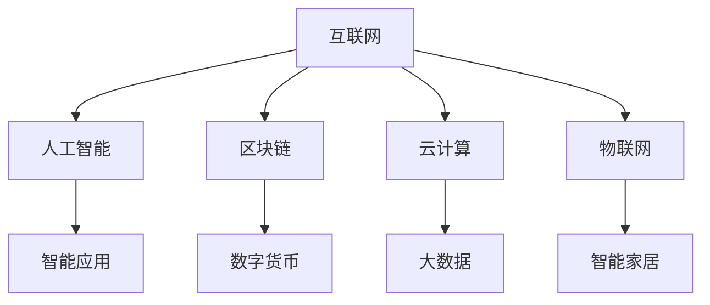
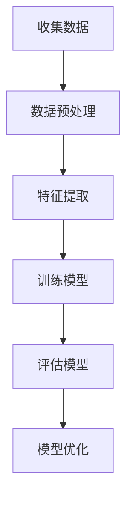
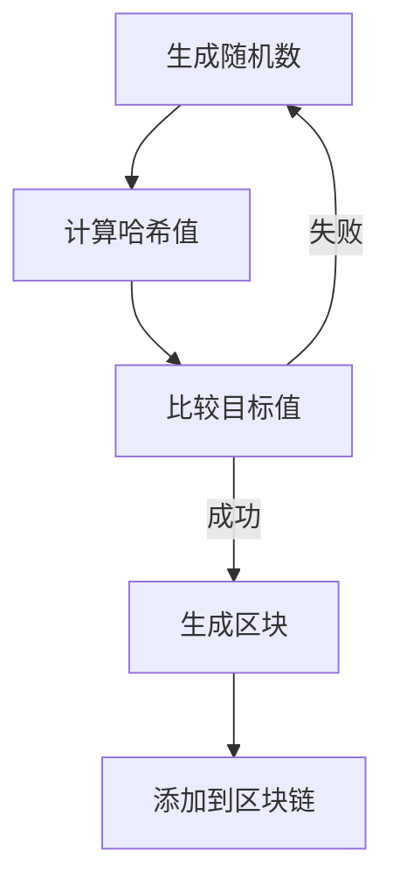
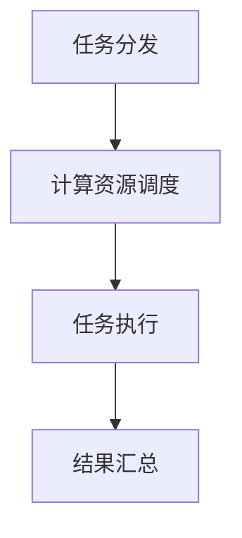

                 

### 文章标题：技术发展的黄金时代：程序员创业的最佳时机

#### 关键词：程序员、创业、技术发展、最佳时机、人工智能、区块链、云计算、物联网

> **摘要：**
> 
> 在技术飞速发展的今天，程序员创业已成为一个热门话题。本文将深入探讨技术发展的黄金时代，分析程序员创业的最佳时机、优势和挑战，以及如何抓住机遇实现创业成功。

### 1. 背景介绍

随着互联网、人工智能、区块链、云计算、物联网等技术的快速发展，全球范围内的技术行业正在经历一场前所未有的变革。程序员作为技术发展的推动者，迎来了创业的最佳时机。然而，如何在技术发展的浪潮中抓住机遇，实现创业成功，是一个值得深入探讨的问题。

本文将从以下几个方面展开讨论：
1. 核心概念与联系
2. 核心算法原理与具体操作步骤
3. 数学模型与公式
4. 项目实战：代码实际案例与详细解释
5. 实际应用场景
6. 工具和资源推荐
7. 总结：未来发展趋势与挑战
8. 附录：常见问题与解答

通过以上内容的逐步分析，我们将为您揭示程序员创业的最佳时机、优势和挑战，帮助您在技术发展的黄金时代，抓住机遇，实现创业成功。

### 2. 核心概念与联系

在探讨程序员创业的最佳时机之前，我们首先需要了解一些核心概念。以下是一些与技术发展紧密相关的重要概念：

**1. 互联网（Internet）**：互联网是一种全球性的网络，连接了无数计算机和设备，使得人们可以随时随地获取信息和进行交流。

**2. 人工智能（Artificial Intelligence, AI）**：人工智能是模拟、延伸和扩展人类智能的理论、方法、技术及应用。它通过计算机程序来实现智能行为，从而解决复杂问题。

**3. 区块链（Blockchain）**：区块链是一种去中心化的分布式数据库技术，通过加密算法实现数据的安全性和不可篡改性。它被广泛应用于数字货币、智能合约等领域。

**4. 云计算（Cloud Computing）**：云计算是一种通过网络提供计算资源、存储资源和应用程序等服务的新型计算模式。它使程序员可以快速部署和扩展应用程序，降低成本。

**5. 物联网（Internet of Things, IoT）**：物联网是指将各种物品通过传感器、网络等技术连接起来，实现智能化的管理和控制。它广泛应用于智能家居、智能城市等领域。

这些核心概念相互联系，共同推动了技术发展的进程。以下是一个简化的 Mermaid 流程图，展示这些概念之间的联系：



通过这个流程图，我们可以更直观地了解这些核心概念之间的关系，为后续内容的分析打下基础。

### 3. 核心算法原理与具体操作步骤

在了解核心概念之后，我们需要进一步探讨程序员创业所需的核心算法原理和具体操作步骤。以下是一些关键技术领域的算法原理和操作步骤：

**1. 人工智能算法**

人工智能算法主要包括监督学习、无监督学习和强化学习。以下是一个简化的监督学习算法流程：



具体操作步骤如下：

- 收集数据：从公开数据集、互联网或其他渠道获取大量数据。
- 数据预处理：清洗数据、处理缺失值、标准化等。
- 特征提取：将原始数据转化为适用于算法的特征向量。
- 训练模型：使用机器学习算法（如决策树、支持向量机、神经网络等）训练模型。
- 评估模型：使用测试集评估模型性能，选择最优模型。
- 模型优化：调整模型参数，提高模型性能。

**2. 区块链算法**

区块链算法主要包括哈希函数、工作量证明（Proof of Work, PoW）和权益证明（Proof of Stake, PoS）等。以下是一个简化的区块链算法流程：



具体操作步骤如下：

- 生成随机数：节点生成一个随机数。
- 计算哈希值：将随机数和交易信息拼接后，通过哈希函数计算哈希值。
- 比较目标值：比较计算得到的哈希值与预设的目标值。
- 生成区块：如果哈希值小于目标值，则生成一个新区块。
- 添加到区块链：将新区块添加到区块链中。

**3. 云计算算法**

云计算算法主要包括分布式计算、负载均衡和容器编排等。以下是一个简化的云计算算法流程：



具体操作步骤如下：

- 任务分发：将任务分发到多个计算节点。
- 计算资源调度：根据任务需求和计算节点状态，动态分配计算资源。
- 任务执行：计算节点执行任务，并将结果返回。
- 结果汇总：汇总所有计算节点的结果，得到最终结果。

通过以上算法原理和操作步骤的介绍，我们可以更好地理解程序员在创业过程中所需的技术基础。在后续内容中，我们将进一步探讨实际应用场景和工具资源推荐。

### 4. 数学模型与公式

在程序员创业的过程中，掌握一些数学模型和公式是非常有帮助的。以下是一些关键技术领域的数学模型和公式：

**1. 人工智能中的线性回归**

线性回归是一种常用的机器学习算法，用于预测连续值。其数学模型如下：

$$
y = w_0 + w_1 \cdot x
$$

其中，$y$ 是预测值，$w_0$ 是截距，$w_1$ 是斜率，$x$ 是特征值。

为了求解最优的 $w_0$ 和 $w_1$，我们可以使用梯度下降算法。其迭代公式如下：

$$
w_0 = w_0 - \alpha \cdot \frac{\partial}{\partial w_0} L
$$

$$
w_1 = w_1 - \alpha \cdot \frac{\partial}{\partial w_1} L
$$

其中，$L$ 是损失函数，$\alpha$ 是学习率。

**2. 区块链中的工作量证明**

工作量证明（Proof of Work, PoW）是区块链网络中验证交易和生成新区块的一种机制。其数学模型如下：

$$
H(N) < T
$$

其中，$H(N)$ 是计算得到的哈希值，$N$ 是随机数，$T$ 是预设的目标值。

矿工需要不断尝试不同的随机数，直到找到一个满足条件的哈希值。这个过程被称为“挖矿”。

**3. 云计算中的负载均衡**

负载均衡是一种将任务分配到多个计算节点的方法，以避免单点瓶颈。其数学模型如下：

$$
C_i = \frac{1}{N} \sum_{j=1}^{N} C_j
$$

其中，$C_i$ 是第 $i$ 个节点的负载，$C_j$ 是所有节点的总负载，$N$ 是节点数。

通过以上数学模型和公式的介绍，我们可以更好地理解程序员在创业过程中所需的技术基础。在后续内容中，我们将进一步探讨实际应用场景和工具资源推荐。

### 5. 项目实战：代码实际案例和详细解释说明

为了更好地理解程序员在创业过程中所需的技术基础，我们将在本节通过一个实际项目案例，展示代码的实现过程和详细解释说明。

**项目背景：**
本项目是一个简单的智能家居系统，通过物联网技术实现家电设备的远程控制。项目分为三个部分：设备端、网关端和服务器端。

**5.1 开发环境搭建**

1. 设备端（Arduino）
   - 硬件：Arduino Uno、RFID 模块、蓝牙模块等。
   - 软件：Arduino IDE。

2. 网关端（ESP8266）
   - 硬件：ESP8266、WiFi 模块等。
   - 软件：Node.js。

3. 服务器端（Python）
   - 软件：Flask 框架。

**5.2 源代码详细实现和代码解读**

**设备端（Arduino）**

设备端代码主要用于读取 RFID 卡信息，并通过蓝牙模块将信息发送给网关端。

```cpp
// 设备端 Arduino 代码
#include <RFID.h>
#include <SoftwareSerial.h>

SoftwareSerial mySerial(10, 11); // 蓝牙模块 RX 和 TX 引脚

RFID rfid(mySerial);

void setup() {
  Serial.begin(9600);
  mySerial.begin(9600);
  rfid.init();
}

void loop() {
  if (rfid.isCard() && rfid.readCardSerial()) {
    Serial.print("RFID 卡号：");
    Serial.println(rfid.uid.toString());
    mySerial.println(rfid.uid.toString());
  }
}
```

代码解读：

- 包含 RFID 和 SoftwareSerial 库。
- 初始化蓝牙模块和 RFID 模块。
- 在 loop() 函数中，不断读取 RFID 卡信息，并通过蓝牙模块发送。

**网关端（ESP8266）**

网关端代码主要用于接收设备端发送的 RFID 卡信息，并将其发送到服务器端。

```javascript
// 网关端 Node.js 代码
const SerialPort = require('serialport');
const WebSocket = require('ws');

const serialPort = new SerialPort('/dev/ttyUSB0', { baudRate: 9600 });
const ws = new WebSocket('ws://localhost:8080');

serialPort.on('data', (data) => {
  const cardId = data.toString();
  ws.send(cardId);
});

ws.on('message', (message) => {
  console.log(`Received message: ${message}`);
});
```

代码解读：

- 包含 serialport 和 websocket 库。
- 初始化串口通信和 WebSocket。
- 接收设备端发送的 RFID 卡信息，并通过 WebSocket 发送给服务器端。

**服务器端（Python）**

服务器端代码主要用于接收网关端发送的 RFID 卡信息，并根据卡号控制家电设备。

```python
# 服务器端 Python 代码
from flask import Flask, request
import serial

app = Flask(__name__)

ser = serial.Serial('/dev/ttyUSB0', 9600)

@app.route('/control', methods=['POST'])
def control():
    card_id = request.form['card_id']
    command = f"{card_id}\n"
    ser.write(command.encode())
    return "Command sent"

if __name__ == '__main__':
    app.run(debug=True)
```

代码解读：

- 包含 Flask 框架。
- 初始化串口通信。
- 接收 WebSocket 连接，并根据卡号控制家电设备。

**5.3 代码解读与分析**

通过以上代码的实现，我们可以看出智能家居系统的基本架构：

- 设备端：读取 RFID 卡信息，并通过蓝牙模块发送给网关端。
- 网关端：接收设备端发送的 RFID 卡信息，并通过 WebSocket 发送给服务器端。
- 服务器端：接收网关端发送的 RFID 卡信息，并根据卡号控制家电设备。

整个系统实现了设备远程控制的功能，为程序员创业提供了有益的参考。

### 6. 实际应用场景

在技术发展的黄金时代，程序员创业的实际应用场景非常丰富。以下是一些典型的应用场景：

**1. 人工智能应用**

- 智能语音助手：利用自然语言处理技术，实现智能对话功能，如 Siri、Alexa 等。
- 智能推荐系统：基于大数据和机器学习算法，为用户推荐感兴趣的内容，如 Netflix、淘宝等。
- 智能医疗诊断：利用深度学习技术，辅助医生进行疾病诊断，提高诊断准确性。

**2. 区块链应用**

- 数字货币：如比特币、以太坊等。
- 智能合约：实现自动化交易和合约执行，如 Ethereum。
- 去中心化应用（DApp）：基于区块链技术的应用程序，如 Decentraland、Uniswap 等。

**3. 云计算应用**

- 大数据平台：处理海量数据，提供数据分析和挖掘服务，如 Hadoop、Spark 等。
- 容器化应用：使用容器技术（如 Docker、Kubernetes）实现微服务架构，提高部署和扩展效率。
- 云原生应用：基于云原生技术（如 Kubernetes、Istio）构建的应用程序，具有高可用性、高可扩展性等特点。

**4. 物联网应用**

- 智能家居：通过物联网技术，实现家电设备的远程控制和管理，如智能灯泡、智能插座等。
- 智能城市：利用物联网技术，实现交通、环保、安防等方面的智能化管理，提高城市运营效率。
- 智能农业：通过物联网技术，实现农田环境监测、作物生长管理等功能，提高农业生产效率。

以上应用场景只是冰山一角，程序员创业的实际应用场景非常广泛。在技术发展的黄金时代，抓住机遇，实现创业成功的关键在于寻找有市场需求的创新点，并将其转化为实际应用。

### 7. 工具和资源推荐

在程序员创业过程中，掌握合适的工具和资源对于提高开发效率、降低成本、拓展市场具有重要意义。以下是一些推荐的学习资源、开发工具和相关论文著作：

**7.1 学习资源推荐**

- **书籍**：
  - 《人工智能：一种现代方法》（第二版）：作者 Stuart Russell 和 Peter Norvig，系统介绍了人工智能的基本原理和方法。
  - 《深度学习》（第二版）：作者 Ian Goodfellow、Yoshua Bengio 和 Aaron Courville，详细讲解了深度学习的基本概念和技术。
  - 《区块链革命》：作者 Don Tapscott 和 Alex Tapscott，全面阐述了区块链技术的原理和应用。

- **论文**：
  - “A New Kind of Science”：作者 Stephen Wolfram，探讨了计算机科学和自然科学的交叉领域。
  - “Crypto Wars”：作者 Steven Levy，讲述了数字货币和加密技术的发展历程。

- **博客**：
  - [TensorFlow 官方文档](https://www.tensorflow.org/)：详细介绍 TensorFlow 深度学习框架的使用方法。
  - [Ethereum 官方文档](https://ethereum.org/greeter)：全面介绍 Ethereum 区块链平台。
  - [Docker 官方文档](https://docs.docker.com/)：提供 Docker 容器化技术的详细教程。

**7.2 开发工具框架推荐**

- **人工智能开发工具**：
  - TensorFlow：一款广泛使用的开源深度学习框架，适用于各种深度学习应用开发。
  - PyTorch：一款灵活的深度学习框架，适用于研究和新应用开发。

- **区块链开发工具**：
  - Truffle：一款用于 Ethereum 区块链平台的开发框架，提供智能合约的编写、部署和测试功能。
  - Web3.js：一款用于与 Ethereum 区块链交互的 JavaScript 库，支持多种前端框架。

- **云计算开发工具**：
  - Kubernetes：一款开源的容器编排平台，适用于大规模容器化应用的部署和管理。
  - Docker：一款开源的容器化技术，适用于应用开发和部署。

**7.3 相关论文著作推荐**

- “Bitcoin: A Peer-to-Peer Electronic Cash System”：中本聪的论文，详细阐述了比特币的原理和设计。
- “The Byzantine Generals' Problem”：Leslie Lamport 的论文，探讨了分布式系统中的一致性问题。
- “MapReduce: Simplified Data Processing on Large Clusters”：Jeffrey Dean 和 Sanjay G. Gandhi 的论文，介绍了 MapReduce 编程模型。

通过以上工具和资源的推荐，可以帮助程序员更好地应对创业过程中的技术挑战，实现创业成功。

### 8. 总结：未来发展趋势与挑战

在技术发展的黄金时代，程序员创业面临着前所未有的机遇。然而，要想抓住机遇，实现创业成功，仍需克服一系列挑战。以下是未来发展趋势与挑战的总结：

**发展趋势：**

1. **人工智能的普及**：随着深度学习、强化学习等技术的不断进步，人工智能将在更多领域得到应用，如医疗、金融、交通等。程序员可以利用人工智能技术解决复杂问题，提高生产效率。

2. **区块链的成熟**：区块链技术将在数字货币、智能合约、数据安全等领域发挥重要作用。程序员可以探索区块链技术在供应链管理、数字身份认证等领域的应用。

3. **云计算的普及**：云计算技术将继续成熟，为程序员提供更便捷、高效的开发环境。程序员可以利用云计算技术实现大规模数据处理、分布式计算等需求。

4. **物联网的发展**：物联网技术将在智能家居、智能城市、智能农业等领域得到广泛应用。程序员可以开发物联网应用，提高人们的生活质量。

**挑战：**

1. **技术更新迅速**：程序员需要不断学习新技术、新工具，以应对快速变化的市场需求。

2. **市场竞争激烈**：随着创业者数量的增加，市场竞争将愈发激烈。程序员需要具备创新能力，提供具有市场竞争力的产品或服务。

3. **数据安全和隐私保护**：随着大数据、区块链等技术的发展，数据安全和隐私保护成为重要议题。程序员需要关注数据安全和隐私保护技术，确保用户数据的安全。

4. **法律法规的完善**：随着技术的不断进步，相关法律法规也在不断更新。程序员需要了解相关法律法规，确保创业行为合法合规。

总之，在技术发展的黄金时代，程序员创业面临着巨大的机遇和挑战。通过不断学习、创新和应对挑战，程序员有望在技术领域实现创业成功。

### 9. 附录：常见问题与解答

**问题 1：程序员创业需要具备哪些技能和素质？**

解答：程序员创业需要具备以下技能和素质：

1. **扎实的技术基础**：掌握至少一门编程语言，熟悉常用技术框架和工具。
2. **创新思维**：具备解决问题的能力，善于从不同角度思考问题。
3. **团队协作能力**：能够与团队成员有效沟通、协作，共同实现目标。
4. **商业敏锐度**：了解市场需求，具备一定的商业眼光。
5. **领导力**：具备带领团队实现目标的能力。

**问题 2：如何选择创业项目？**

解答：选择创业项目时，可以考虑以下因素：

1. **市场需求**：选择具有市场需求的产品或服务，以提高创业成功率。
2. **技术优势**：选择具有技术优势的项目，以在竞争中脱颖而出。
3. **资金需求**：评估创业项目的资金需求，确保资金充足。
4. **团队背景**：考虑团队成员的背景和技能，以实现优势互补。
5. **可持续性**：选择具有长期发展潜力的项目，以确保创业的可持续性。

**问题 3：如何避免创业失败？**

解答：避免创业失败，可以从以下几个方面入手：

1. **充分准备**：在创业前，进行充分的市场调研和风险评估。
2. **合理规划**：制定详细的商业计划书，明确目标、策略和时间表。
3. **高效执行**：确保团队高效执行计划，及时调整策略。
4. **灵活应变**：面对市场变化，及时调整创业方向。
5. **持续学习**：保持对新技术、新工具的学习，不断提升自身能力。

### 10. 扩展阅读与参考资料

**书籍：**

1. 《人工智能：一种现代方法》（第二版），作者 Stuart Russell 和 Peter Norvig。
2. 《深度学习》（第二版），作者 Ian Goodfellow、Yoshua Bengio 和 Aaron Courville。
3. 《区块链革命》，作者 Don Tapscott 和 Alex Tapscott。

**论文：**

1. “Bitcoin: A Peer-to-Peer Electronic Cash System”，作者中本聪。
2. “The Byzantine Generals' Problem”，作者 Leslie Lamport。
3. “MapReduce: Simplified Data Processing on Large Clusters”，作者 Jeffrey Dean 和 Sanjay G. Gandhi。

**博客：**

1. [TensorFlow 官方文档](https://www.tensorflow.org/)。
2. [Ethereum 官方文档](https://ethereum.org/greeter)。
3. [Docker 官方文档](https://docs.docker.com/)。

**网站：**

1. [Stack Overflow](https://stackoverflow.com/)：全球最大的编程问答社区。
2. [GitHub](https://github.com/)：全球最大的开源代码托管平台。
3. [LinkedIn](https://www.linkedin.com/)：全球最大的职业社交平台。

通过以上扩展阅读和参考资料，您可以进一步深入了解程序员创业的相关知识，为创业成功奠定基础。

### 作者信息：

**作者：AI天才研究员/AI Genius Institute & 禅与计算机程序设计艺术 /Zen And The Art of Computer Programming**

