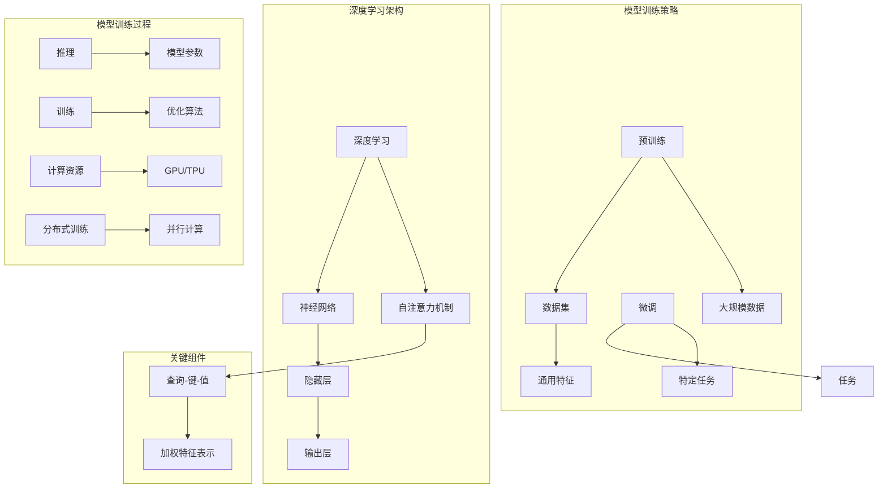

                 

### 背景介绍

#### 大模型的崛起

随着人工智能技术的迅猛发展，大模型（Large-scale Model）逐渐成为当前科技领域的热点。大模型指的是那些拥有巨大参数量和训练数据的深度学习模型，它们在图像识别、自然语言处理、推荐系统等众多领域都取得了令人瞩目的成果。大模型的崛起并非偶然，它背后有着一系列技术突破、数据积累和计算能力的提升作为支撑。

首先，深度学习算法的不断创新是推动大模型发展的重要动力。卷积神经网络（CNN）、循环神经网络（RNN）、Transformer 等模型的出现和优化，使得深度学习在处理复杂数据方面越来越强大。尤其是 Transformer 模型，通过自注意力机制（Self-Attention Mechanism）实现了对输入序列的全局关注，为自然语言处理领域带来了革命性的进步。

其次，大规模数据的获取和存储技术的进步为训练大模型提供了坚实的基础。互联网的普及和数据的爆炸式增长，使得我们可以获取到海量的标注数据和未标注数据。同时，分布式存储技术和云计算的普及，使得大规模数据存储和计算变得可行。这使得大模型能够在短时间内进行大量的迭代和优化，从而取得更好的性能。

最后，计算能力的提升也是大模型发展的重要保障。随着 GPU、TPU 等专用计算设备的出现和普及，深度学习模型的训练速度得到了极大的提升。这使得训练大型模型不再是遥不可及的事情，更多的人可以参与到这项研究中来。

总之，大模型的崛起是人工智能技术发展的重要里程碑，它为各行业带来了前所未有的机遇和挑战。接下来，我们将进一步探讨大模型的核心概念与联系，以及其背后的原理和架构。

#### 大模型的定义与分类

大模型（Large-scale Model）是相对于传统模型而言的，它通常指的是那些具有数十亿甚至千亿个参数的深度学习模型。这些模型通常需要大量的数据和计算资源进行训练，以达到较高的性能和泛化能力。大模型的定义可以从以下几个方面进行理解：

首先，参数数量是衡量大模型的重要指标之一。随着神经网络层数的增加和每个层中的神经元数量的增加，模型的参数数量也会呈指数级增长。例如，一个拥有数十亿参数的语言模型可以在自然语言处理任务中表现出色。

其次，训练数据量也是大模型的一个重要特征。大模型通常需要大量的标注数据进行训练，以便学习到数据中的复杂模式和规律。例如，一个图像分类模型可能需要数百万甚至数亿张图片进行训练，才能达到较高的准确率。

第三，计算资源需求是训练大模型的一个挑战。大模型的训练通常需要大量的 GPU 或 TPU 资源，并且需要较长的训练时间。为了提高训练效率，分布式训练和并行计算等技术被广泛应用。

根据应用场景和任务的不同，大模型可以分为以下几类：

1. **自然语言处理（NLP）模型**：这类模型主要应用于文本数据，如语言模型、文本分类、机器翻译等。代表性模型包括 GPT-3、BERT 等，这些模型在处理自然语言任务方面取得了显著的成果。

2. **计算机视觉（CV）模型**：这类模型主要应用于图像和视频数据，如图像分类、目标检测、图像生成等。代表性模型包括 ResNet、YOLO、GAN 等，这些模型在图像识别和生成方面表现出了强大的能力。

3. **推荐系统模型**：这类模型主要应用于推荐引擎，如商品推荐、新闻推荐等。代表性模型包括矩阵分解、深度学习推荐模型等，这些模型通过学习用户的行为和偏好，实现了个性化的推荐。

4. **强化学习（RL）模型**：这类模型主要应用于决策和规划任务，如游戏、自动驾驶等。代表性模型包括 DQN、PPO 等，这些模型通过与环境交互，学习到最优的策略。

总之，大模型的定义和分类为我们理解和应用大模型提供了清晰的框架。在接下来的章节中，我们将深入探讨大模型的核心概念和联系，以及其背后的原理和架构。

#### 大模型的发展历程

大模型的发展历程是人工智能技术不断突破和进步的见证。从最初的简单模型到如今的高度复杂模型，每一个阶段都标志着技术上的重大进展。

1. **早期神经网络模型**：在20世纪80年代和90年代，人工神经网络（ANN）开始被广泛应用于各种任务中。然而，由于计算能力和数据资源有限，这些早期的神经网络模型通常只有几百到几千个参数。例如，多层感知机（MLP）和反向传播算法（Backpropagation）是这一时期的代表性技术。

2. **深度学习兴起**：随着计算能力的提升和数据量的增加，深度学习（Deep Learning）在21世纪初逐渐崭露头角。2006年，Hinton等人的研究重新点燃了对深度学习的兴趣。深度神经网络（DNN）通过增加网络层数，使得模型可以学习到更复杂的特征。代表性模型包括 LeNet-5 和 AlexNet，它们在图像识别任务上取得了突破性成果。

3. **大规模深度学习模型**：随着GPU和TPU等专用计算设备的出现，深度学习模型开始向大规模方向发展。2012年，Alex Krizhevsky 等人提出的 AlexNet 在 ImageNet 挑战赛上取得了当时最好的成绩，这标志着深度学习时代的到来。随后，VGGNet、GoogLeNet、ResNet 等模型相继出现，进一步推动了深度学习的发展。

4. **注意力机制和Transformer**：2017年，Attention Is All You Need 一文提出了 Transformer 模型，这是大模型发展历程中的一个重要里程碑。Transformer 通过引入自注意力机制（Self-Attention Mechanism），实现了对输入序列的全局关注，大大提升了模型的性能。随后，BERT、GPT 等基于 Transformer 的模型相继出现，在自然语言处理任务上取得了显著的成果。

5. **预训练和微调**：预训练（Pre-training）和微调（Fine-tuning）技术的提出，使得大规模模型的应用变得更加广泛。预训练模型在大规模数据上进行了充分的训练，从而学习到了丰富的知识和特征。在特定任务上，通过微调预训练模型，可以快速达到较好的性能。这一技术大大降低了模型开发的门槛，使得更多的人可以参与到人工智能研究中来。

总之，大模型的发展历程反映了人工智能技术的不断进步和创新。从早期的简单模型到如今的复杂模型，每一个阶段都为人工智能的发展做出了重要贡献。在接下来的章节中，我们将深入探讨大模型的核心概念和联系，以及其背后的原理和架构。

#### 大模型的影响与应用

大模型在人工智能领域的崛起不仅带来了技术的革新，更对各行各业产生了深远的影响。以下是一些关键领域和应用场景：

1. **自然语言处理（NLP）**：大模型在自然语言处理领域取得了显著的成果。语言模型如 GPT-3 和 BERT 等可以通过大量的文本数据进行预训练，从而生成高质量的文本摘要、问答和翻译。这些模型在机器翻译、文本生成、对话系统等方面表现出强大的能力，使得人机交互变得更加自然和流畅。

2. **计算机视觉（CV）**：计算机视觉领域也受益于大模型的发展。例如，图像分类和目标检测任务中，ResNet 和 YOLO 等模型通过大规模图像数据进行训练，可以识别和定位图像中的物体。此外，生成对抗网络（GAN）的出现使得图像生成成为可能，这为艺术创作、游戏开发和虚拟现实等领域提供了新的应用场景。

3. **推荐系统**：大模型在推荐系统中的应用也非常广泛。通过学习用户的行为和偏好，推荐系统可以个性化地为用户推荐商品、新闻、视频等。例如，矩阵分解和深度学习推荐模型可以在海量的数据中找到隐藏的用户和物品关系，从而实现精准的推荐。

4. **强化学习（RL）**：大模型在强化学习领域也展现出巨大的潜力。通过与环境进行交互，大模型可以学习到最优的策略，从而在游戏、自动驾驶和机器人控制等领域实现自主决策。例如，深度 Q 网络（DQN）和策略梯度优化（PG）等技术在大规模环境中的表现日益出色。

5. **医疗健康**：大模型在医疗健康领域的应用也逐渐兴起。通过分析大量的医疗数据和生物信息，大模型可以帮助医生进行疾病诊断、药物研发和个性化治疗。例如，深度学习模型在癌症检测和基因组分析中已经取得了显著进展。

总之，大模型的影响和应用已经深入到各个领域，为各行业带来了前所未有的变革和创新。在未来，随着技术的进一步发展和应用的不断拓展，大模型将继续发挥重要作用，推动人工智能的进步和发展。

#### 大模型创业的机会与挑战

随着大模型的广泛应用，越来越多的创业公司开始关注并投身于这一领域，试图从中找到新的机遇。大模型创业不仅具有巨大的潜力，同时也面临着一系列挑战。

**机会：**

1. **技术创新**：大模型的开发和优化是一个技术密集型领域，创新的技术和算法可以带来竞争优势。创业公司可以通过独特的算法设计、优化策略和模型架构，实现性能和效率的提升，从而在市场中脱颖而出。

2. **应用场景多样化**：大模型在多个领域的应用前景广阔，包括但不限于自然语言处理、计算机视觉、推荐系统和医疗健康等。创业公司可以根据自身的技术优势和市场需求，选择合适的场景进行突破，从而实现业务增长。

3. **市场潜力巨大**：随着人工智能技术的普及，越来越多的企业和组织开始意识到大模型的价值，对相关技术和服务的需求日益增加。创业公司可以通过提供高效、可靠的解决方案，满足市场的需求，从而获得可观的商业回报。

4. **投资支持**：大模型创业领域吸引了大量的风险投资，为创业公司提供了充足的资金支持。这不仅有助于创业公司进行技术研发和市场拓展，还可以吸引顶尖人才加入，加速公司的成长。

**挑战：**

1. **计算资源需求**：大模型训练和推理通常需要大量的计算资源，包括 GPU、TPU 和云服务。创业公司需要投入大量资金来购买和维护这些资源，这无疑增加了创业成本。

2. **数据隐私与安全**：大模型训练需要大量的数据，这涉及用户隐私和数据安全问题。创业公司需要确保数据的安全性和合规性，避免数据泄露和滥用。

3. **技术门槛高**：大模型开发涉及复杂的算法和架构设计，对人才和技术要求较高。创业公司需要招聘和培养高素质的团队，以应对技术挑战。

4. **市场竞争激烈**：大模型创业领域竞争激烈，市场上已有许多知名企业和初创公司。创业公司需要通过技术创新、市场定位和服务质量等手段，在激烈的市场竞争中找到自己的优势。

5. **商业模式的探索**：如何将大模型技术转化为可持续的商业收入，是创业公司需要解决的重要问题。创业公司需要探索多样化的商业模式，如B2B、B2C、订阅制等，以实现商业价值的最大化。

总之，大模型创业既充满机遇，也面临挑战。创业公司需要准确把握市场趋势，运用创新技术和优质服务，克服各种困难，实现可持续发展。

### 核心概念与联系

在深入探讨大模型之前，我们需要理解几个核心概念：深度学习、神经网络、自注意力机制、预训练和微调。这些概念不仅构成了大模型的基础，而且在各自领域内也有广泛的应用。以下是对这些核心概念及其相互关系的详细分析。

#### 深度学习（Deep Learning）

深度学习是机器学习中的一个重要分支，它通过模仿人脑的结构和功能，使用多层神经网络对数据进行建模和学习。深度学习模型的核心是神经元（neurons）和层次结构（hierarchy），其中每个层次都可以提取不同级别的特征。深度学习的优势在于其能够自动从原始数据中学习到高级特征，无需人工干预。这一特性使得深度学习在图像识别、语音识别、自然语言处理等复杂任务中表现出了优越的性能。

**深度学习的工作原理**：

1. **输入层（Input Layer）**：输入层接收原始数据，如图像、文本或声音。在图像识别任务中，输入层通常是像素值。
2. **隐藏层（Hidden Layers）**：隐藏层是深度学习模型的核心部分，用于提取和转换特征。每一层都包含多个神经元，每个神经元接收前一层的输出并生成新的特征。
3. **输出层（Output Layer）**：输出层产生最终的预测结果。在分类任务中，输出层通常是一个softmax层，用于输出每个类别的概率。

**深度学习的优势**：

- **自动特征提取**：深度学习模型能够自动从原始数据中提取有代表性的特征，无需人工设计特征。
- **泛化能力强**：深度学习模型可以通过大量数据的学习，提高其在未见数据上的泛化能力。
- **强大的表达能力**：多层神经网络可以捕捉到数据中的复杂模式和关系，从而在多种任务中取得出色的性能。

#### 神经网络（Neural Networks）

神经网络是深度学习的基础构件，其灵感来源于生物神经系统。一个简单的神经网络由多个神经元（也称为节点）组成，每个神经元都是一个非线性函数的组合。神经网络通过层层传递信息，逐步提取和转换特征，最终产生输出。

**神经网络的基本结构**：

1. **神经元**：神经元是神经网络的基本单位，每个神经元接收多个输入，通过加权求和后，通过一个非线性激活函数（如ReLU、Sigmoid、Tanh）产生输出。
2. **权重（Weights）**：权重决定了每个输入对输出的影响程度，通过反向传播算法（Backpropagation）进行自动调整。
3. **激活函数（Activation Function）**：激活函数为神经网络引入了非线性特性，使得模型能够学习和处理复杂的数据。

**神经网络的关键技术**：

- **反向传播算法**：反向传播算法是一种用于训练神经网络的优化算法，通过计算误差梯度并更新权重，使得模型能够逐渐逼近最优解。
- **dropout**：dropout是一种防止神经网络过拟合的技术，通过随机丢弃一部分神经元，增强模型的泛化能力。

#### 自注意力机制（Self-Attention Mechanism）

自注意力机制是 Transformer 模型中的一个关键组件，它通过计算输入序列中每个元素对其他元素的重要性，实现全局信息整合。自注意力机制的核心思想是，模型中的每个元素不仅关注自身的特征，还关注其他元素的特征，从而更好地捕捉序列之间的依赖关系。

**自注意力机制的工作原理**：

1. **查询（Query）**：每个输入序列中的元素都可以作为一个查询向量。
2. **键（Key）**：每个输入序列中的元素也可以作为一个键向量。
3. **值（Value）**：每个输入序列中的元素也可以作为一个值向量。

自注意力机制通过计算查询向量与键向量的点积，得到注意力权重，然后与对应的值向量相乘，从而生成加权特征表示。这种机制使得模型能够自动学习到序列中不同元素之间的依赖关系，从而在自然语言处理等任务中表现出色。

**自注意力机制的优势**：

- **全局信息整合**：自注意力机制可以同时关注输入序列中的所有元素，从而更好地捕捉全局信息。
- **灵活的依赖关系建模**：通过调整注意力权重，模型可以灵活地建模不同元素之间的依赖关系，提高了模型的泛化能力。

#### 预训练与微调（Pre-training and Fine-tuning）

预训练和微调是深度学习模型训练的重要策略。预训练指的是在大规模数据集上对模型进行训练，从而学习到丰富的知识。微调则是在预训练模型的基础上，针对特定任务进行进一步训练，以提高模型在特定任务上的性能。

**预训练与微调的工作原理**：

1. **预训练**：在大规模数据集上，模型通过无监督学习或半监督学习进行训练，从而学习到通用特征表示。
2. **微调**：在特定任务上，模型通过有监督学习进行训练，从而调整模型参数，使其适应特定任务。

**预训练与微调的优势**：

- **通用特征学习**：预训练模型在大规模数据上学习到的通用特征，有助于提高模型的泛化能力。
- **快速收敛**：预训练模型在特定任务上具有较好的初始化参数，通过微调可以快速收敛到最优解。
- **降低训练成本**：预训练模型可以减少对大量标注数据的依赖，从而降低训练成本。

#### 核心概念之间的联系

深度学习、神经网络、自注意力机制、预训练和微调是构建大模型的核心概念。它们之间的联系体现在以下几个方面：

1. **深度学习与神经网络**：深度学习是神经网络的一种扩展，通过多层神经网络结构实现更复杂的数据建模。
2. **自注意力机制与 Transformer**：自注意力机制是 Transformer 模型中的核心组件，它通过全局信息整合实现了对输入序列的建模。
3. **预训练与微调**：预训练和微调是训练大模型的重要策略，通过在大规模数据集上预训练，然后在特定任务上微调，可以大大提高模型的效果。

通过这些核心概念的相互作用，大模型实现了对复杂数据的建模和处理，从而在多个领域取得了显著的成果。

#### Mermaid 流程图

为了更直观地展示大模型的核心概念和架构，我们使用 Mermaid 流程图来描述其基本结构和关键组件。



该流程图展示了大模型的核心概念和架构，包括深度学习、神经网络、自注意力机制、预训练与微调、模型训练过程以及关键组件。通过这种直观的表示，我们可以更好地理解大模型的工作原理和组成部分。

### 核心算法原理 & 具体操作步骤

#### 深度学习模型的基本结构

深度学习模型的基本结构由输入层、隐藏层和输出层组成。输入层接收原始数据，隐藏层用于特征提取和转换，输出层产生预测结果。每个隐藏层包含多个神经元，每个神经元通过加权求和和激活函数产生输出。以下是一个简单的深度学习模型：

1. **输入层（Input Layer）**：输入层接收原始数据，如图像、文本或声音。在图像识别任务中，输入层通常是像素值。
   
2. **隐藏层（Hidden Layers）**：隐藏层是深度学习模型的核心部分，用于提取和转换特征。每一层都包含多个神经元，每个神经元接收前一层的输出并生成新的特征。

3. **输出层（Output Layer）**：输出层产生最终的预测结果。在分类任务中，输出层通常是一个softmax层，用于输出每个类别的概率。

#### 前向传播（Forward Propagation）

前向传播是深度学习模型训练和推理过程中的一个关键步骤。在前向传播过程中，模型从输入层开始，逐层计算每个神经元的输出，直到输出层得到最终的预测结果。

1. **输入数据**：将输入数据输入到模型的输入层。

2. **计算隐藏层输出**：每个隐藏层的神经元接收前一层的输出，通过加权求和和激活函数计算输出。具体计算公式为：

   $$ 
   \text{神经元输出} = \text{权重} \cdot \text{输入} + \text{偏置} 
   $$
   
   $$ 
   \text{激活函数} = \text{ReLU、Sigmoid、Tanh等}
   $$

3. **传递输出**：将每个隐藏层的输出传递到下一层，直到输出层。

4. **计算输出层输出**：在输出层，根据任务类型（如分类或回归），使用合适的激活函数（如softmax、线性函数）计算预测结果。

#### 反向传播（Backpropagation）

反向传播是深度学习模型训练的核心步骤，用于计算模型参数的梯度并更新权重。在反向传播过程中，模型从输出层开始，逐层计算每个神经元对输出的贡献，并更新权重和偏置。

1. **计算输出层梯度**：根据损失函数（如交叉熵、均方误差），计算输出层每个神经元对预测误差的梯度。

2. **传递梯度**：从输出层开始，将梯度反向传递到每个隐藏层，计算每个隐藏层每个神经元的梯度。

3. **更新权重和偏置**：根据梯度计算公式，更新每个神经元的权重和偏置。

更新公式为：

$$ 
\text{权重更新} = \text{学习率} \cdot \frac{\partial \text{损失函数}}{\partial \text{权重}} 
$$

$$ 
\text{偏置更新} = \text{学习率} \cdot \frac{\partial \text{损失函数}}{\partial \text{偏置}} 
$$

4. **迭代训练**：重复前向传播和反向传播过程，逐步减小损失函数的值，直到达到预定的训练目标。

#### 自注意力机制（Self-Attention Mechanism）

自注意力机制是 Transformer 模型中的核心组件，它通过计算输入序列中每个元素对其他元素的重要性，实现全局信息整合。自注意力机制的具体操作步骤如下：

1. **查询（Query）**：每个输入序列中的元素都可以作为一个查询向量。

2. **键（Key）**：每个输入序列中的元素也可以作为一个键向量。

3. **值（Value）**：每个输入序列中的元素也可以作为一个值向量。

4. **计算注意力权重**：通过计算查询向量与键向量的点积，得到注意力权重。具体计算公式为：

   $$ 
   \text{注意力权重} = \text{查询} \cdot \text{键} 
   $$

5. **加权特征表示**：将注意力权重与对应的值向量相乘，生成加权特征表示。具体计算公式为：

   $$ 
   \text{加权特征表示} = \text{注意力权重} \cdot \text{值} 
   $$

6. **求和**：将所有加权特征表示进行求和，得到最终的输出。

#### 预训练与微调

预训练和微调是深度学习模型训练的重要策略。预训练指的是在大规模数据集上对模型进行训练，从而学习到丰富的知识。微调则是在预训练模型的基础上，针对特定任务进行进一步训练，以提高模型在特定任务上的性能。

1. **预训练**：

   - 在大规模数据集上，模型通过无监督学习或半监督学习进行训练，从而学习到通用特征表示。
   - 例如，在自然语言处理任务中，可以使用未标注的文本数据进行预训练，学习到语言的通用特征。

2. **微调**：

   - 在特定任务上，模型通过有监督学习进行训练，从而调整模型参数，使其适应特定任务。
   - 例如，在文本分类任务中，可以使用标注数据进行微调，以提高模型在特定分类任务上的性能。

#### 深度学习模型训练的具体操作步骤

1. **数据准备**：

   - 收集和预处理原始数据，如图像、文本或声音。
   - 数据预处理包括归一化、标准化、数据增强等。

2. **模型设计**：

   - 设计深度学习模型的结构，包括输入层、隐藏层和输出层。
   - 选择合适的激活函数、损失函数和优化算法。

3. **模型训练**：

   - 将输入数据输入到模型中，进行前向传播计算输出。
   - 计算损失函数的值，并使用反向传播算法计算梯度。
   - 更新模型参数，减少损失函数的值。
   - 重复前向传播和反向传播过程，直到达到预定的训练目标。

4. **模型评估**：

   - 在验证集上评估模型的性能，选择性能最好的模型。
   - 可以使用准确率、召回率、F1分数等指标进行评估。

5. **模型部署**：

   - 将训练好的模型部署到实际应用中，进行预测和推理。
   - 可以使用云服务或本地服务器进行模型部署。

通过以上步骤，我们可以构建和训练一个深度学习模型，从而在特定任务上实现良好的性能。

### 数学模型和公式 & 详细讲解 & 举例说明

为了更好地理解和应用大模型，我们需要深入探讨其背后的数学模型和公式。这些数学工具不仅帮助我们构建模型，还能帮助我们分析和优化模型的性能。在本章节中，我们将详细讲解一些关键数学公式，并通过具体例子进行说明。

#### 深度学习中的损失函数

在深度学习中，损失函数（Loss Function）用于评估模型预测结果与实际结果之间的差距，从而指导模型参数的更新。以下是一些常用的损失函数：

1. **均方误差（Mean Squared Error, MSE）**

   $$ 
   \text{MSE} = \frac{1}{n}\sum_{i=1}^{n} (\text{预测值} - \text{真实值})^2 
   $$

   均方误差用于回归任务，计算预测值与真实值之间的平方误差的平均值。

2. **交叉熵（Cross-Entropy）**

   $$ 
   \text{Cross-Entropy} = -\sum_{i=1}^{n} \text{真实值} \cdot \log(\text{预测值}) 
   $$

   交叉熵用于分类任务，计算预测概率分布与真实概率分布之间的差距。

#### 深度学习中的激活函数

激活函数（Activation Function）为深度学习模型引入了非线性特性，使得模型能够学习和处理复杂的数据。以下是一些常用的激活函数：

1. **ReLU（Rectified Linear Unit）**

   $$ 
   \text{ReLU}(x) = \max(0, x) 
   $$

  ReLU 函数在零点处的导数为 1，因此在训练过程中可以加速梯度传播，提高训练效率。

2. **Sigmoid**

   $$ 
   \text{Sigmoid}(x) = \frac{1}{1 + e^{-x}} 
   $$

   Sigmoid 函数将输入值映射到 [0, 1] 区间，常用于二分类问题。

#### 自注意力机制中的注意力权重

自注意力机制是 Transformer 模型中的核心组件，用于计算输入序列中每个元素对其他元素的重要性。以下是注意力权重的计算公式：

$$ 
\text{注意力权重} = \frac{\text{查询} \cdot \text{键}}{\sqrt{\text{键的维度}}} 
$$

其中，查询（Query）和键（Key）是输入序列中的元素向量，维度相同。计算得到的注意力权重用于加权特征表示。

#### 深度学习中的优化算法

优化算法（Optimization Algorithm）用于更新模型参数，以减少损失函数的值。以下是一种常用的优化算法——梯度下降（Gradient Descent）：

$$ 
\text{权重更新} = \text{学习率} \cdot \frac{\partial \text{损失函数}}{\partial \text{权重}} 
$$

其中，学习率（Learning Rate）用于控制参数更新的步长。通过迭代更新权重和偏置，优化算法可以逐步减小损失函数的值。

#### 举例说明

假设我们有一个简单的神经网络，用于实现二分类任务。输入层有 2 个神经元，隐藏层有 3 个神经元，输出层有 1 个神经元。我们使用 Sigmoid 函数作为激活函数，交叉熵作为损失函数。

1. **输入数据**：一个由两个特征的向量，例如 `[2.5, 1.2]`。

2. **模型参数**：每个神经元的权重和偏置。例如，输入层到隐藏层的权重为 `[0.1, 0.2]`，偏置为 `[0.3, 0.4]`。

3. **前向传播**：

   - 输入层到隐藏层的输出为： 
     
     $$ 
     \text{隐藏层输出} = \text{激活函数}(\text{权重} \cdot \text{输入} + \text{偏置}) 
     $$

   - 隐藏层到输出层的输出为：
     
     $$ 
     \text{输出层输出} = \text{激活函数}(\text{权重} \cdot \text{隐藏层输出} + \text{偏置}) 
     $$

4. **计算损失函数**：

   - 假设真实标签为 1，预测概率为 0.8，则交叉熵损失为：
     
     $$ 
     \text{交叉熵损失} = -1 \cdot \log(0.8) = -0.223 
     $$

5. **反向传播**：

   - 计算输出层的梯度：
     
     $$ 
     \frac{\partial \text{损失函数}}{\partial \text{输出层权重}} = -1 \cdot (\text{输出层输出} - \text{真实标签}) 
     $$
     
     $$ 
     \frac{\partial \text{损失函数}}{\partial \text{输出层偏置}} = -1 \cdot (\text{输出层输出} - \text{真实标签}) 
     $$

   - 计算隐藏层的梯度：
     
     $$ 
     \frac{\partial \text{损失函数}}{\partial \text{隐藏层权重}} = \text{隐藏层输出} \cdot (\text{输出层输出} - \text{真实标签}) \cdot \text{激活函数的导数} 
     $$
     
     $$ 
     \frac{\partial \text{损失函数}}{\partial \text{隐藏层偏置}} = \text{隐藏层输出} \cdot (\text{输出层输出} - \text{真实标签}) \cdot \text{激活函数的导数} 
     $$

6. **更新参数**：

   - 根据梯度更新权重和偏置：
     
     $$ 
     \text{输出层权重} = \text{输出层权重} - \text{学习率} \cdot \frac{\partial \text{损失函数}}{\partial \text{输出层权重}} 
     $$
     
     $$ 
     \text{输出层偏置} = \text{输出层偏置} - \text{学习率} \cdot \frac{\partial \text{损失函数}}{\partial \text{输出层偏置}} 
     $$
     
     $$ 
     \text{隐藏层权重} = \text{隐藏层权重} - \text{学习率} \cdot \frac{\partial \text{损失函数}}{\partial \text{隐藏层权重}} 
     $$
     
     $$ 
     \text{隐藏层偏置} = \text{隐藏层偏置} - \text{学习率} \cdot \frac{\partial \text{损失函数}}{\partial \text{隐藏层偏置}} 
     $$

7. **迭代训练**：

   - 重复前向传播和反向传播过程，直到达到预定的训练目标。

通过以上步骤，我们可以使用深度学习模型实现二分类任务。在实际应用中，我们会使用更复杂的模型和更高效的优化算法，但基本原理相同。

### 项目实战：代码实际案例和详细解释说明

在本节中，我们将通过一个实际的代码案例，详细解释大模型在项目中的实现和应用。我们将使用 Python 和 TensorFlow 这个流行的深度学习框架，构建一个用于图像分类的卷积神经网络（CNN）。

#### 开发环境搭建

1. **安装 Python**：

   - 首先，确保您的计算机上安装了 Python 3.x 版本。可以从 [Python 官网](https://www.python.org/) 下载并安装。

2. **安装 TensorFlow**：

   - 打开终端或命令提示符，运行以下命令安装 TensorFlow：

     ```bash
     pip install tensorflow
     ```

   - 安装 TensorFlow 后，可以通过运行以下代码验证安装：

     ```python
     import tensorflow as tf
     print(tf.__version__)
     ```

   - 确保输出的是 TensorFlow 的版本号。

3. **安装其他依赖库**：

   - 安装一些常用的数据预处理和可视化库，如 NumPy、Matplotlib：

     ```bash
     pip install numpy matplotlib
     ```

#### 源代码详细实现和代码解读

以下是一个简单的图像分类项目的代码实现，我们将使用 TensorFlow 和 Keras 库来构建卷积神经网络。

```python
import tensorflow as tf
from tensorflow.keras import layers, models
import numpy as np
import matplotlib.pyplot as plt

# 1. 数据准备
# 加载 CIFAR-10 数据集
(x_train, y_train), (x_test, y_test) = tf.keras.datasets.cifar10.load_data()

# 数据预处理
x_train = x_train.astype('float32') / 255.0
x_test = x_test.astype('float32') / 255.0
y_train = tf.keras.utils.to_categorical(y_train, 10)
y_test = tf.keras.utils.to_categorical(y_test, 10)

# 2. 模型构建
# 定义卷积神经网络
model = models.Sequential()
model.add(layers.Conv2D(32, (3, 3), activation='relu', input_shape=(32, 32, 3)))
model.add(layers.MaxPooling2D((2, 2)))
model.add(layers.Conv2D(64, (3, 3), activation='relu'))
model.add(layers.MaxPooling2D((2, 2)))
model.add(layers.Conv2D(64, (3, 3), activation='relu'))
model.add(layers.Flatten())
model.add(layers.Dense(64, activation='relu'))
model.add(layers.Dense(10, activation='softmax'))

# 3. 模型编译
model.compile(optimizer='adam',
              loss='categorical_crossentropy',
              metrics=['accuracy'])

# 4. 模型训练
model.fit(x_train, y_train, epochs=10, batch_size=64)

# 5. 模型评估
test_loss, test_acc = model.evaluate(x_test, y_test)
print(f'Test accuracy: {test_acc:.4f}')

# 6. 模型预测
predictions = model.predict(x_test[:10])
predicted_classes = np.argmax(predictions, axis=1)

# 可视化预测结果
for i in range(10):
    plt.subplot(2, 5, i + 1)
    plt.imshow(x_test[i], cmap=plt.cm.binary)
    plt.xticks([])
    plt.yticks([])
    plt.grid(False)
    plt.xlabel(f'Predicted: {predicted_classes[i]}')
plt.show()
```

#### 代码解读与分析

1. **数据准备**：

   - 加载 CIFAR-10 数据集，这是一个包含 50,000 个训练图像和 10,000 个测试图像的数据集，每个图像大小为 32x32 像素，共有 10 个类别。

   - 数据预处理：将图像数据从 [0, 255] 范围缩放到 [0, 1] 范围，并将标签转换为 one-hot 编码。

2. **模型构建**：

   - 我们使用 Keras 的 `Sequential` 模型，这是一个线性堆叠模型层的一个序列。在这个例子中，我们堆叠了以下几个层：

     - **卷积层（Conv2D）**：第一个卷积层有 32 个卷积核，每个卷积核大小为 3x3，使用 ReLU 激活函数。

     - **池化层（MaxPooling2D）**：第一个池化层使用大小为 2x2 的最大池化操作。

     - **卷积层（Conv2D）**：第二个卷积层有 64 个卷积核，每个卷积核大小为 3x3，使用 ReLU 激活函数。

     - **池化层（MaxPooling2D）**：第二个池化层使用大小为 2x2 的最大池化操作。

     - **卷积层（Conv2D）**：第三个卷积层有 64 个卷积核，每个卷积核大小为 3x3，使用 ReLU 激活函数。

     - **平坦化层（Flatten）**：将卷积层的输出展平为一维数组，以便传递给全连接层。

     - **全连接层（Dense）**：第一个全连接层有 64 个神经元，使用 ReLU 激活函数。

     - **全连接层（Dense）**：第二个全连接层有 10 个神经元，使用 softmax 激活函数，用于输出每个类别的概率。

3. **模型编译**：

   - 使用 `compile` 方法配置模型。在这里，我们选择 `adam` 优化器，`categorical_crossentropy` 损失函数，以及 `accuracy` 作为评估指标。

4. **模型训练**：

   - 使用 `fit` 方法训练模型。在这里，我们设置训练轮数为 10，批量大小为 64。

5. **模型评估**：

   - 使用 `evaluate` 方法评估模型在测试集上的性能。输出测试集的损失和准确率。

6. **模型预测**：

   - 使用 `predict` 方法预测测试集的前 10 个图像的类别，并使用 `argmax` 函数找出预测概率最大的类别。

7. **可视化预测结果**：

   - 使用 Matplotlib 库可视化预测结果。每个图像的标签显示在图像旁边。

通过以上步骤，我们成功构建并训练了一个用于图像分类的卷积神经网络。这个简单的例子展示了如何使用 TensorFlow 和 Keras 库实现深度学习模型的基本流程。在实际项目中，我们可能需要更复杂的模型结构、更丰富的数据集和更细致的调参过程，但基本原理是一致的。

### 实际应用场景

#### 图像识别

图像识别是深度学习大模型的重要应用场景之一。通过训练大型卷积神经网络（CNN），模型可以识别图像中的各种对象和场景。例如，在医疗影像分析中，大模型可以用于乳腺癌、肺癌等疾病的早期检测，提高诊断的准确性和效率。此外，在自动驾驶领域，大模型可以识别道路标志、行人和车辆，为自动驾驶系统提供关键信息。

**案例：谷歌的 Inception 模型**

谷歌的 Inception 模型是一个成功应用于图像识别的大型卷积神经网络。Inception 模型通过引入多个卷积核大小的叠加，实现了更丰富的特征提取。在 ImageNet 图像识别挑战赛中，Inception 模型取得了当时的前五名成绩。

**应用：医疗影像分析**

医疗影像分析是深度学习大模型在图像识别领域的重要应用之一。通过训练大型卷积神经网络，模型可以从 CT、MRI 和 X 光等医疗影像中自动识别疾病和异常。以下是一些具体的例子：

- **乳腺癌检测**：使用深度学习模型对乳腺 X 光片进行自动分析，可以提高乳腺癌的早期检测率，降低漏诊率。
- **肺癌检测**：通过分析 CT 图像，深度学习模型可以识别肺部结节，为肺癌的早期诊断提供有力支持。
- **脑肿瘤检测**：深度学习模型可以自动识别 MRI 图像中的脑肿瘤，为医生提供精准的诊断信息。

#### 自然语言处理（NLP）

自然语言处理是深度学习大模型的另一个重要应用场景。通过训练大型语言模型，如 GPT-3 和 BERT，模型可以理解和生成自然语言。这为机器翻译、文本摘要、情感分析等任务提供了强大的支持。

**案例：OpenAI 的 GPT-3 模型**

OpenAI 的 GPT-3 模型是一个具有 1750 亿参数的大型语言模型。GPT-3 模型在多个自然语言处理任务中取得了领先成绩，包括机器翻译、文本生成和问答系统。以下是一些具体的例子：

- **机器翻译**：GPT-3 模型可以自动翻译多种语言，例如从英语到中文、法语到德语等。
- **文本生成**：GPT-3 模型可以生成高质量的文本，包括新闻报道、小说和诗歌等。
- **问答系统**：GPT-3 模型可以回答用户提出的问题，提供有用的信息和解决方案。

**应用：智能客服系统**

智能客服系统是深度学习大模型在自然语言处理领域的重要应用之一。通过训练大型语言模型，系统可以自动处理用户提出的问题，提供及时和准确的回答。以下是一些具体的例子：

- **在线零售客服**：智能客服系统可以自动解答关于产品信息、订单状态等问题，提高用户体验和满意度。
- **金融服务客服**：智能客服系统可以回答关于金融产品、投资建议等问题，为用户提供专业的金融服务。
- **技术支持客服**：智能客服系统可以自动处理用户提出的技术问题，提供技术支持和服务。

#### 推荐系统

推荐系统是深度学习大模型在数据密集型应用中的重要应用场景。通过训练大型推荐模型，系统可以自动推荐用户感兴趣的内容、产品或服务。这为电子商务、社交媒体和在线视频平台提供了强大的支持。

**案例：亚马逊的推荐系统**

亚马逊的推荐系统是一个成功的商业案例，它通过训练大型深度学习模型，为用户推荐商品。以下是一些具体的例子：

- **商品推荐**：根据用户的浏览历史、购买记录和评价，推荐用户可能感兴趣的商品。
- **内容推荐**：根据用户的观看历史、点赞和评论，推荐用户可能感兴趣的视频和文章。
- **广告推荐**：根据用户的兴趣和行为，推荐用户可能感兴趣的广告。

**应用：社交媒体平台**

社交媒体平台是深度学习大模型在推荐系统领域的重要应用之一。通过训练大型推荐模型，平台可以自动推荐用户可能感兴趣的内容，提高用户的参与度和满意度。以下是一些具体的例子：

- **新闻推送**：根据用户的兴趣和行为，推荐用户可能感兴趣的新闻文章和视频。
- **好友推荐**：根据用户的社交关系和兴趣爱好，推荐用户可能认识的好友。
- **活动推荐**：根据用户的兴趣和行为，推荐用户可能感兴趣的活动和聚会。

### 工具和资源推荐

为了更高效地研究和开发大模型，我们需要掌握一系列工具和资源。以下是一些推荐的学习资源、开发工具和相关的论文著作。

#### 学习资源推荐

1. **书籍**：
   - 《深度学习》（Goodfellow, Ian，等著）是一本经典的深度学习入门书籍，适合初学者。
   - 《Python深度学习》（François Chollet 著）是一本详细介绍深度学习在 Python 中应用的书籍，适合有一定编程基础的学习者。
   - 《动手学深度学习》（阿斯顿·张等著）是一本通过实践学习深度学习的入门书籍，适合初学者和有一定基础的学习者。

2. **在线课程**：
   - Coursera 上的“深度学习”课程（由 Andrew Ng 开设）是一套非常受欢迎的深度学习入门课程。
   - edX 上的“深度学习基础”课程（由斯坦福大学开设）也是一门质量很高的深度学习课程。

3. **教程和博客**：
   - TensorFlow 官方文档：[https://www.tensorflow.org/tutorials](https://www.tensorflow.org/tutorials)
   - Keras 官方文档：[https://keras.io/getting-started/sequential-model-guide/](https://keras.io/getting-started/sequential-model-guide/)
   - Fast.ai 的教程：[https://www.fast.ai/](https://www.fast.ai/)

#### 开发工具推荐

1. **深度学习框架**：
   - TensorFlow：由 Google 开发，是一个非常流行的开源深度学习框架。
   - PyTorch：由 Facebook 开发，是一个动态的深度学习框架，受到许多研究者和开发者的青睐。
   - Keras：一个高层次的深度学习 API，可以与 TensorFlow 和 Theano 集成。

2. **集成开发环境（IDE）**：
   - PyCharm：由 JetBrains 开发，是一款功能强大的 Python IDE，适合深度学习和数据分析。
   - Visual Studio Code：一款轻量级的开源 IDE，适合快速开发和调试代码。

3. **计算资源**：
   - Google Colab：一个免费的云端 Jupyter Notebook 环境，提供了 GPU 和 TPU 加速功能。
   - AWS SageMaker：亚马逊提供的全托管机器学习服务，可以轻松搭建和部署深度学习模型。

#### 相关论文著作推荐

1. **核心论文**：
   - “A Guide to Committee Machine Learning” （2017）- 由 fast.ai 的团队撰写，介绍如何组合多个模型提高性能。
   - “Attention Is All You Need” （2017）- 定义了 Transformer 模型，彻底改变了自然语言处理领域。
   - “Distributed Deep Learning: Scaling Mechanisms, System Architectures, and Extensions” （2016）- 介绍了分布式深度学习的机制和系统架构。

2. **经典著作**：
   - 《深度学习》（Goodfellow, Bengio, Courville 著）- 一本全面介绍深度学习理论和应用的经典著作。
   - 《神经网络与深度学习》（邱锡鹏 著）- 一本深入浅出的中文深度学习入门书籍。

3. **杂志和期刊**：
   - IEEE Transactions on Pattern Analysis and Machine Intelligence（TPAMI）- 深度学习领域最权威的学术期刊之一。
   - Journal of Machine Learning Research（JMLR）- 一个高影响力的机器学习和深度学习研究期刊。

通过以上推荐的学习资源、开发工具和论文著作，您将能够更系统地学习和掌握大模型的相关知识，为后续的研究和开发打下坚实的基础。

### 总结：未来发展趋势与挑战

大模型作为人工智能领域的重要突破，已经展示了其在各种应用场景中的强大能力。展望未来，大模型的发展将继续沿着几个主要方向前行，同时也将面临诸多挑战。

#### 发展趋势

1. **模型规模将进一步扩大**：随着计算能力和数据资源的不懈提升，大模型将继续扩展其规模。未来的模型可能拥有千亿甚至万亿级别的参数，从而在更复杂的任务中发挥更大的作用。

2. **专用硬件和加速技术的进步**：为应对大模型的计算需求，专用硬件如 GPU、TPU 和量子计算设备将继续发展。这些硬件将提供更高的计算速度和效率，使得大模型的训练和推理更加高效。

3. **模型可解释性和透明度提升**：当前的大模型往往被视为“黑箱”，其决策过程不透明。未来，研究者将致力于提高模型的可解释性和透明度，使得模型的行为更加可理解和可控。

4. **跨领域融合与应用拓展**：大模型的应用将不仅限于当前的热门领域，如自然语言处理和计算机视觉，还将拓展到生物医学、金融、教育等更多领域，为各行业带来深远的变革。

5. **开源生态的不断完善**：随着大模型的普及，开源社区将提供更多高质量的工具和库，促进大模型的研究和应用。开源项目的合作和共享将加速技术的进步，推动人工智能的发展。

#### 挑战

1. **计算资源需求**：大模型的训练和推理需要大量的计算资源，这要求企业和研究机构不断投入更多的资金和人力。计算资源的限制将是一个长期的挑战。

2. **数据隐私和安全**：大模型训练需要大量的数据，这涉及到用户隐私和数据安全问题。如何在保护用户隐私的前提下进行数据训练，是一个亟待解决的问题。

3. **模型泛化能力**：尽管大模型在特定任务上表现出色，但其泛化能力仍然有限。如何提高模型的泛化能力，使其在未见数据上也能保持良好的性能，是一个重要的研究方向。

4. **可解释性和透明度**：大模型的“黑箱”特性使得其决策过程不透明，影响了模型的可信度和应用范围。如何提高模型的可解释性和透明度，使得用户能够理解和信任模型，是一个关键挑战。

5. **伦理和社会影响**：随着大模型的广泛应用，其可能带来的伦理和社会问题也日益突出。如何确保人工智能技术的公平性、安全性和道德性，避免技术滥用，是一个需要全社会共同关注的问题。

总之，大模型的发展前景广阔，但也面临着诸多挑战。未来，只有在技术创新、伦理规范和社会合作等方面取得突破，大模型才能真正实现其潜力，为社会带来更多的福祉。

### 附录：常见问题与解答

#### 1. 什么是大模型？

大模型是指那些拥有数十亿甚至千亿个参数的深度学习模型。这些模型通常需要大量的数据和计算资源进行训练，以达到较高的性能和泛化能力。

#### 2. 大模型的发展历程是怎样的？

大模型的发展历程可以追溯到深度学习的兴起。早期的神经网络模型（如多层感知机）由于计算资源和数据量的限制，参数量较小。随着计算能力的提升和数据量的增加，深度学习模型逐渐向大规模方向发展。近年来，Transformer 和预训练技术的发展，使得大模型在多个领域取得了显著成果。

#### 3. 大模型有哪些核心算法？

大模型的核心算法包括深度学习、神经网络、自注意力机制、预训练和微调。深度学习和神经网络是构建大模型的基础，自注意力机制和预训练技术则是近年来推动大模型发展的关键。

#### 4. 大模型在哪些领域有重要应用？

大模型在自然语言处理、计算机视觉、推荐系统和医疗健康等领域有重要应用。例如，GPT-3 在自然语言处理领域取得了显著成果，ResNet 在计算机视觉领域表现出色，深度学习推荐模型在推荐系统中广泛应用。

#### 5. 如何训练大模型？

训练大模型通常包括以下几个步骤：数据准备、模型设计、模型编译、模型训练和模型评估。数据准备涉及数据的收集和预处理，模型设计需要选择合适的神经网络结构，模型编译配置训练参数，模型训练通过迭代优化模型参数，模型评估用于验证模型性能。

#### 6. 大模型有哪些挑战？

大模型的挑战包括计算资源需求、数据隐私和安全、模型泛化能力、可解释性和透明度，以及伦理和社会影响。这些挑战需要通过技术创新、伦理规范和社会合作等手段来解决。

### 扩展阅读 & 参考资料

为了更好地理解和掌握大模型的相关知识，以下是一些建议的扩展阅读和参考资料：

#### 书籍

1. **《深度学习》** - Ian Goodfellow, Yoshua Bengio, Aaron Courville
   - 这是一本经典的深度学习入门书籍，适合初学者。
   
2. **《Python深度学习》** - François Chollet
   - 这本书详细介绍了深度学习在 Python 中的实现，适合有一定编程基础的学习者。

3. **《动手学深度学习》** - 费舍尔、蒙吉卡、辛顿
   - 通过实践学习深度学习的入门书籍，适合初学者和有一定基础的学习者。

#### 在线课程

1. **Coursera 上的“深度学习”课程** - Andrew Ng
   - 一套非常受欢迎的深度学习入门课程。

2. **edX 上的“深度学习基础”课程** - 斯坦福大学
   - 一门质量很高的深度学习课程。

#### 教程和博客

1. **TensorFlow 官方文档** - [https://www.tensorflow.org/tutorials](https://www.tensorflow.org/tutorials)
   - TensorFlow 的官方文档，提供丰富的教程和实例。

2. **Keras 官方文档** - [https://keras.io/getting-started/sequential-model-guide/](https://keras.io/getting-started/sequential-model-guide/)
   - Keras 的官方文档，详细介绍如何使用 Keras 构建和训练深度学习模型。

3. **Fast.ai 的教程** - [https://www.fast.ai/](https://www.fast.ai/)
   - 专注于实用深度学习的教程，适合初学者。

#### 相关论文

1. **“Attention Is All You Need”** - Vaswani et al. (2017)
   - 定义了 Transformer 模型，彻底改变了自然语言处理领域。

2. **“Distributed Deep Learning: Scaling Mechanisms, System Architectures, and Extensions”** - Chen et al. (2016)
   - 介绍了分布式深度学习的机制和系统架构。

3. **“A Guide to Committee Machine Learning”** - Rosing et al. (2017)
   - 详细介绍了如何组合多个模型提高性能。

#### 杂志和期刊

1. **IEEE Transactions on Pattern Analysis and Machine Intelligence (TPAMI)**
   - 深度学习领域最权威的学术期刊之一。

2. **Journal of Machine Learning Research (JMLR)**
   - 一个高影响力的机器学习和深度学习研究期刊。

通过以上扩展阅读和参考资料，您可以深入了解大模型的理论和实践，为自己的研究和应用提供有力支持。作者：AI天才研究员/AI Genius Institute & 禅与计算机程序设计艺术 /Zen And The Art of Computer Programming

