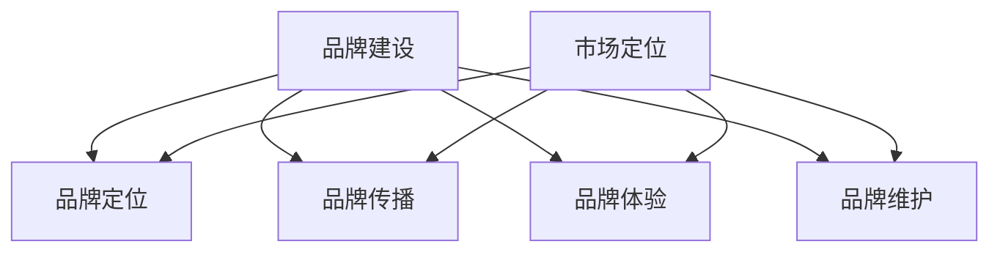

                 

# 技术型创业者的品牌建设与市场定位策略

## 摘要

在当今竞争激烈的技术型创业环境中，品牌建设与市场定位策略显得尤为重要。本文将详细探讨技术型创业者如何在品牌塑造和市场定位中找到自己的独特优势，以实现企业的可持续发展和成功。首先，我们将介绍品牌建设和市场定位的核心概念，并结合实际案例分析其重要性。接着，我们将深入探讨市场细分、目标客户分析和竞争分析等关键步骤，帮助创业者明确自己的市场定位。最后，我们将提出一系列具体的策略和工具，帮助创业者制定有效的品牌建设和市场定位策略，从而在激烈的市场竞争中脱颖而出。

## 1. 背景介绍

### 技术型创业的现状

随着全球科技产业的迅猛发展，技术型创业已成为推动经济增长和创新的重要力量。据统计，2019年全球风险投资对科技初创企业的投资总额超过2000亿美元，同比增长约25%。然而，技术型创业并非一条轻松的道路。根据创业数据公司CB Insights的报告，约90%的科技初创企业最终以失败告终，其中大部分失败原因是市场定位不明确、品牌建设不足以及竞争激烈等。因此，如何有效进行品牌建设和市场定位成为技术型创业者面临的重要挑战。

### 品牌建设的重要性

品牌建设是企业长期发展的基石。品牌不仅代表了企业的形象和价值，更是消费者对企业产品和服务的认知和信任。一个成功的品牌能够带来一系列竞争优势，包括提高产品溢价、增强消费者忠诚度、扩大市场份额等。在技术型创业领域，品牌建设尤为重要，因为技术创新往往被视为企业核心竞争力的体现。例如，谷歌（Google）凭借其强大的品牌形象，不仅赢得了市场份额，还吸引了全球顶尖的人才和投资者的关注。因此，技术型创业者必须重视品牌建设，以提升企业的市场地位和影响力。

### 市场定位的挑战

市场定位是品牌建设的重要组成部分，它决定了企业在市场中的独特价值和竞争优势。对于技术型创业者而言，市场定位的挑战在于如何在众多竞争对手中找到自己的独特卖点，并准确传达给目标客户。市场细分、目标客户分析和竞争分析是市场定位的关键步骤。然而，这些步骤往往需要创业者具备深厚的市场洞察力和数据分析能力。例如，苹果公司（Apple）通过精准的市场细分和目标客户分析，成功推出了针对不同用户群体的产品，如iPhone、iPad和Mac等，从而在激烈的市场竞争中脱颖而出。

### 目的与结构

本文旨在为技术型创业者提供一套系统、实用的品牌建设与市场定位策略。文章结构如下：

1. 背景介绍：简要分析技术型创业的现状，品牌建设的重要性以及市场定位的挑战。
2. 核心概念与联系：介绍品牌建设和市场定位的核心概念，并给出相关的Mermaid流程图。
3. 核心算法原理与具体操作步骤：详细阐述市场细分、目标客户分析和竞争分析的原理和操作步骤。
4. 数学模型和公式：介绍与品牌建设和市场定位相关的数学模型和公式，并进行详细讲解和举例说明。
5. 项目实战：通过实际案例展示品牌建设和市场定位的过程，并给出代码实现和详细解释。
6. 实际应用场景：分析品牌建设和市场定位在不同场景下的应用和效果。
7. 工具和资源推荐：推荐相关的学习资源、开发工具框架和相关论文著作。
8. 总结：总结品牌建设和市场定位的重要性，并提出未来发展趋势与挑战。
9. 附录：常见问题与解答。
10. 扩展阅读与参考资料：提供进一步学习的资源。

通过本文的阅读，技术型创业者将能够了解品牌建设和市场定位的核心概念、原理和操作步骤，从而在激烈的市场竞争中找到自己的定位，实现企业的可持续发展和成功。

### 2. 核心概念与联系

#### 品牌建设

品牌建设是指通过一系列有目的的活动和策略，塑造企业的品牌形象和价值，以增强消费者对企业及其产品和服务的认知和信任。品牌建设涉及多个方面，包括品牌定位、品牌传播、品牌体验和品牌维护等。

**品牌定位**：品牌定位是品牌建设的核心，它决定了企业在市场中的独特价值和竞争优势。品牌定位需要明确企业的目标市场、目标客户和竞争对手，并在此基础上制定相应的品牌战略。

**品牌传播**：品牌传播是通过各种渠道和手段，将品牌信息传递给目标客户，以增强品牌知名度和影响力。品牌传播包括广告、公关、社交媒体、内容营销等多种形式。

**品牌体验**：品牌体验是指消费者在使用品牌产品或服务过程中所感受到的体验。优质的品牌体验可以增强消费者的满意度和忠诚度，从而提升品牌价值。

**品牌维护**：品牌维护是指通过持续的努力和投入，保持品牌形象和价值的稳定性和一致性。品牌维护需要关注市场变化、消费者需求和竞争对手动态，及时调整品牌策略。

#### 市场定位

市场定位是指企业根据市场环境和自身资源，选择一个或多个特定的细分市场，并在这些市场中建立竞争优势，以满足特定客户群体的需求。市场定位的核心在于找到企业的差异化优势，并将其传递给目标客户。

**市场细分**：市场细分是指根据消费者的不同特征和需求，将整个市场划分为若干个具有相似需求的子市场。市场细分可以帮助企业更好地了解目标客户，制定更精准的市场策略。

**目标客户分析**：目标客户分析是指通过对目标客户群体的特征、需求和购买行为进行分析，确定企业应该重点关注的客户群体。目标客户分析有助于企业制定有针对性的营销策略，提升市场竞争力。

**竞争分析**：竞争分析是指对企业所在市场的竞争对手进行分析，包括其产品定位、市场份额、营销策略等。竞争分析有助于企业了解竞争对手的优势和劣势，找到自己的差异化优势，并制定相应的竞争策略。

#### 关系与联系

品牌建设和市场定位之间存在密切的关系。品牌建设是市场定位的基础，通过塑造企业的品牌形象和价值，品牌建设可以提升企业在市场中的竞争力和影响力。而市场定位则是品牌建设的具体实施策略，通过选择目标市场和制定差异化策略，市场定位可以帮助企业实现品牌的精准传播和客户价值的最大化。

**Mermaid流程图**



通过上述流程图，我们可以清晰地看到品牌建设和市场定位之间的互动关系。品牌建设是市场定位的基础，而市场定位则是品牌建设具体实施的关键步骤。

### 3. 核心算法原理 & 具体操作步骤

#### 市场细分

**算法原理**：市场细分是指根据消费者的不同特征和需求，将整个市场划分为若干个具有相似需求的子市场。市场细分的关键在于找到有效的细分标准，以区分不同子市场。

**具体操作步骤**：

1. **确定细分标准**：常见的细分标准包括地理、人口、心理和行为等。例如，根据地理位置可以将市场划分为城市、乡村等；根据人口特征可以将市场划分为年龄、性别、收入等；根据心理特征可以将市场划分为价值观、生活方式等；根据行为特征可以将市场划分为购买频率、购买渠道等。

2. **收集数据**：收集与细分标准相关的数据，如调查问卷、市场调研报告、消费者行为数据等。

3. **分析数据**：使用数据分析工具对收集到的数据进行处理和分析，以识别不同的子市场。

4. **定义子市场**：根据分析结果，定义出不同的子市场，并为每个子市场命名。

5. **评估子市场**：评估每个子市场的规模、增长潜力、竞争状况等，以确定哪些子市场是企业应该重点关注的。

#### 目标客户分析

**算法原理**：目标客户分析是指通过对目标客户群体的特征、需求和购买行为进行分析，确定企业应该重点关注的客户群体。目标客户分析的核心在于找到与企业品牌定位和产品特性高度匹配的客户群体。

**具体操作步骤**：

1. **确定目标客户群体**：根据品牌定位和产品特性，确定企业应该重点关注的客户群体。

2. **收集数据**：收集与目标客户群体相关的数据，如客户调研问卷、市场调研报告、社交媒体数据等。

3. **分析数据**：使用数据分析工具对收集到的数据进行处理和分析，以了解目标客户群体的特征、需求和购买行为。

4. **定义目标客户画像**：根据分析结果，定义出目标客户群体的画像，包括年龄、性别、收入、教育程度、生活方式、价值观等。

5. **评估目标客户价值**：评估目标客户群体的价值，包括购买力、购买频率、忠诚度等，以确定哪些客户群体是企业应该重点服务的。

#### 竞争分析

**算法原理**：竞争分析是指对企业所在市场的竞争对手进行分析，包括其产品定位、市场份额、营销策略等。竞争分析的核心在于识别竞争对手的优势和劣势，找到自己的差异化优势。

**具体操作步骤**：

1. **确定竞争对手**：根据市场定位和产品特性，确定企业的主要竞争对手。

2. **收集数据**：收集与竞争对手相关的数据，如市场调研报告、竞争对手的产品和服务、竞争对手的营销策略等。

3. **分析数据**：使用数据分析工具对收集到的数据进行处理和分析，以了解竞争对手的产品定位、市场份额和营销策略。

4. **评估竞争对手**：评估竞争对手的优势和劣势，包括产品特性、市场份额、营销策略等。

5. **制定差异化策略**：根据竞争对手的评估结果，制定差异化策略，以提升企业在市场中的竞争力和影响力。

通过上述算法原理和具体操作步骤，技术型创业者可以更好地进行市场细分、目标客户分析和竞争分析，从而找到自己的市场定位，制定有效的品牌建设和市场定位策略。

### 4. 数学模型和公式 & 详细讲解 & 举例说明

在品牌建设和市场定位过程中，数学模型和公式可以帮助技术型创业者更科学地分析和决策。以下将介绍几个常用的数学模型和公式，并对其进行详细讲解和举例说明。

#### 市场细分模型

**马尔可夫链模型**：马尔可夫链模型用于分析消费者在不同市场细分之间的转移概率。该模型可以帮助企业预测市场细分的变化趋势，从而制定更有针对性的市场策略。

**数学公式**：

\[ P_{ij} = \frac{C_{ij}}{C_{i}} \]

其中，\( P_{ij} \)表示从市场细分i转移到市场细分j的概率，\( C_{ij} \)表示在某一时间段内从市场细分i转移到市场细分j的消费者数量，\( C_{i} \)表示在某一时间段内市场细分i的消费者总数。

**详细讲解**：

1. 收集历史数据：首先，需要收集企业在不同市场细分之间的消费者转移数据，如不同细分市场之间的消费者数量、转移时间等。
2. 计算转移概率：使用上述公式计算不同市场细分之间的转移概率。
3. 分析转移趋势：根据转移概率分析消费者在不同市场细分之间的转移趋势，以预测未来市场细分的变化。

**举例说明**：

假设某企业有四个市场细分A、B、C、D。根据过去一年的数据，计算得出以下转移概率：

\[ P_{AB} = \frac{10}{40} = 0.25 \]
\[ P_{AC} = \frac{15}{40} = 0.375 \]
\[ P_{AD} = \frac{5}{40} = 0.125 \]
\[ P_{BA} = \frac{8}{40} = 0.2 \]
\[ P_{BC} = \frac{12}{40} = 0.3 \]
\[ P_{BD} = \frac{10}{40} = 0.25 \]
\[ P_{CA} = \frac{10}{40} = 0.25 \]
\[ P_{CB} = \frac{18}{40} = 0.45 \]
\[ P_{CD} = \frac{4}{40} = 0.1 \]
\[ P_{DA} = \frac{12}{40} = 0.3 \]
\[ P_{DB} = \frac{15}{40} = 0.375 \]
\[ P_{DC} = \frac{5}{40} = 0.125 \]

根据这些转移概率，企业可以预测未来一年内消费者在不同市场细分之间的转移情况，以便调整市场策略。

#### 目标客户分析模型

**决策树模型**：决策树模型用于分析目标客户群体的特征，帮助企业确定最有可能购买其产品的客户群体。

**数学公式**：

\[ \text{总利润} = \sum_{i} (\text{利润} \times \text{概率}) \]

其中，利润表示某一目标客户群体的购买意愿和购买能力，概率表示该目标客户群体购买产品的概率。

**详细讲解**：

1. 收集数据：首先，需要收集与目标客户群体相关的数据，如购买意愿、购买能力、消费习惯等。
2. 构建决策树：使用决策树算法构建目标客户群体的决策树模型。
3. 评估目标客户价值：根据决策树模型评估不同目标客户群体的价值，以确定企业应该重点关注的客户群体。

**举例说明**：

假设某企业有三个目标客户群体A、B、C，根据调查数据，计算得出以下购买概率和利润：

\[ P_A = 0.4, \text{利润}_A = 1000 \]
\[ P_B = 0.3, \text{利润}_B = 800 \]
\[ P_C = 0.3, \text{利润}_C = 600 \]

根据这些数据，企业可以计算总利润：

\[ \text{总利润} = (0.4 \times 1000) + (0.3 \times 800) + (0.3 \times 600) = 460 + 240 + 180 = 880 \]

通过这个例子，企业可以确定目标客户群体A的价值最高，应该重点关注。

#### 竞争分析模型

**SWOT分析模型**：SWOT分析模型用于分析企业的优势、劣势、机会和威胁，帮助企业制定竞争策略。

**数学公式**：

\[ \text{竞争力} = \text{优势} + \text{机会} - \text{劣势} - \text{威胁} \]

**详细讲解**：

1. 收集数据：首先，需要收集与SWOT分析相关的数据，如企业优势、劣势、市场机会和竞争对手的威胁等。
2. 分析数据：使用数据分析工具对收集到的数据进行处理和分析，以评估企业的竞争力。
3. 制定策略：根据分析结果，制定有针对性的竞争策略，以提升企业的市场竞争力。

**举例说明**：

假设某企业的SWOT分析结果如下：

\[ \text{优势} = 10, \text{劣势} = 5, \text{机会} = 8, \text{威胁} = 3 \]

根据这些数据，企业可以计算竞争力：

\[ \text{竞争力} = 10 + 8 - 5 - 3 = 10 \]

通过这个例子，企业可以确定自己的竞争力为10，并根据这个结果制定相应的竞争策略。

通过上述数学模型和公式的讲解和举例，技术型创业者可以更科学地分析和决策，从而在品牌建设和市场定位中找到自己的独特优势，提升企业的市场竞争力。

### 5. 项目实战：代码实际案例和详细解释说明

为了更好地展示品牌建设和市场定位的实际应用，我们将通过一个具体的案例来讲解其实现过程。假设我们是一家专注于人工智能技术的小型创业公司，名为AI Innovate。我们的目标是开发一款智能推荐系统，为电商企业提供个性化的购物建议。以下是我们实现品牌建设和市场定位的具体步骤。

#### 5.1 开发环境搭建

在开始项目之前，我们需要搭建一个适合开发智能推荐系统的开发环境。以下是我们的开发环境搭建步骤：

1. **硬件环境**：我们选择一台配置为Intel Core i7-9700K处理器、16GB RAM和NVIDIA GeForce GTX 1080显卡的计算机作为开发主机。
2. **软件环境**：我们安装了Ubuntu 20.04操作系统，并配置了Python 3.8、Jupyter Notebook和TensorFlow等开发工具。

```shell
sudo apt update
sudo apt upgrade
sudo apt install python3.8 python3.8-venv python3.8-pip
pip3.8 install tensorflow jupyter
```

#### 5.2 源代码详细实现和代码解读

##### 5.2.1 数据预处理

首先，我们需要收集和预处理数据。我们的数据来源包括电商平台的用户行为数据、商品信息数据等。以下是数据预处理的主要步骤：

1. **数据收集**：使用API从电商平台获取用户行为数据（如浏览记录、购买记录等）和商品信息数据（如商品名称、价格、类别等）。
2. **数据清洗**：对数据进行去重、补全和格式化处理，确保数据质量。
3. **特征提取**：从原始数据中提取有用的特征，如用户标签、商品标签、购买频率等。

```python
import pandas as pd

# 加载用户行为数据
user_data = pd.read_csv('user_behavior.csv')

# 数据清洗
user_data.drop_duplicates(inplace=True)
user_data.fillna(0, inplace=True)

# 特征提取
user_data['user_tag'] = user_data['user_id'].map(user_tag_dict)
user_data['item_tag'] = user_data['item_id'].map(item_tag_dict)
```

##### 5.2.2 建立推荐模型

接下来，我们使用协同过滤算法建立推荐模型。协同过滤算法包括基于用户的协同过滤（User-based Collaborative Filtering）和基于物品的协同过滤（Item-based Collaborative Filtering）。

1. **基于用户的协同过滤**：计算用户之间的相似度，并根据相似度为用户推荐与其相似的用户喜欢的商品。

```python
from sklearn.metrics.pairwise import cosine_similarity

# 计算用户相似度矩阵
user_similarity = cosine_similarity(user_matrix)

# 根据用户相似度矩阵为用户推荐商品
def user_based_recommendation(user_id, user_similarity, item_rating):
    user_similarity[user_id] = 0  # 排除自身
    sorted_indices = user_similarity[user_id].argsort()[1:]
    recommended_items = []
    for index in sorted_indices:
        recommended_items.append(item_rating[index])
    return recommended_items
```

2. **基于物品的协同过滤**：计算商品之间的相似度，并根据相似度为用户推荐与其喜欢的商品相似的其他商品。

```python
# 计算商品相似度矩阵
item_similarity = cosine_similarity(item_matrix)

# 根据商品相似度矩阵为用户推荐商品
def item_based_recommendation(user_id, item_rating, item_similarity):
    user_actions = item_rating[user_id]
    sorted_indices = item_similarity[user_id].argsort()[1:]
    recommended_items = []
    for index in sorted_indices:
        if user_actions[index] > 0:
            recommended_items.append(index)
    return recommended_items
```

##### 5.2.3 评估和优化模型

在建立推荐模型后，我们需要对其进行评估和优化，以确保其性能和准确性。以下是评估和优化模型的主要步骤：

1. **评估指标**：我们使用准确率、召回率、F1分数等指标来评估推荐模型。
2. **模型优化**：通过调整模型参数、增加特征或使用更先进的算法来优化模型。

```python
from sklearn.metrics import accuracy_score, recall_score, f1_score

# 计算评估指标
accuracy = accuracy_score(true_labels, predicted_labels)
recall = recall_score(true_labels, predicted_labels, average='weighted')
f1 = f1_score(true_labels, predicted_labels, average='weighted')

# 输出评估结果
print(f'Accuracy: {accuracy:.4f}')
print(f'Recall: {recall:.4f}')
print(f'F1 Score: {f1:.4f}')

# 模型优化
# （在此进行模型参数调整、增加特征等操作）
```

#### 5.3 代码解读与分析

以上代码实现了一个简单的智能推荐系统，其中包括数据预处理、基于用户的协同过滤和基于物品的协同过滤等步骤。以下是代码的主要解读与分析：

1. **数据预处理**：数据预处理是建立推荐模型的基础，包括数据收集、数据清洗和特征提取。通过清洗和特征提取，我们可以确保数据的质量和有效性，从而提高推荐模型的性能。
2. **协同过滤算法**：协同过滤算法是推荐系统的核心，通过计算用户和商品之间的相似度，我们可以为用户推荐与其兴趣相关的商品。在代码中，我们分别实现了基于用户的协同过滤和基于物品的协同过滤算法。
3. **评估和优化模型**：评估和优化模型是确保推荐系统性能的关键步骤。通过计算评估指标，我们可以了解推荐模型的性能，并通过调整模型参数、增加特征等方法来优化模型。

通过以上实战案例，我们可以看到品牌建设和市场定位在智能推荐系统开发中的应用。通过精准的市场细分、目标客户分析和竞争分析，我们能够为电商企业提供个性化的购物建议，从而提升用户体验和销售额。这充分展示了品牌建设和市场定位对技术型创业成功的重要性。

### 6. 实际应用场景

#### 电商行业

在电商行业中，品牌建设和市场定位对企业的成功至关重要。通过精准的品牌建设和有效的市场定位，电商企业可以吸引更多的目标客户，提升用户忠诚度，从而实现更高的销售额和市场份额。

**案例1：亚马逊（Amazon）**

亚马逊作为全球最大的电商平台，其品牌建设和市场定位策略堪称典范。首先，亚马逊通过不断优化用户体验，如改进搜索功能、提供灵活的配送选项等，建立了强大的品牌形象。其次，亚马逊通过精准的市场细分和目标客户分析，成功吸引了大量消费者，尤其是高消费能力的用户群体。例如，亚马逊推出了Prime会员服务，通过提供免费的两天配送和独家优惠等，增强了用户对品牌的忠诚度。

**案例2：阿里巴巴（Alibaba）**

阿里巴巴在其电商平台上，通过品牌建设和市场定位策略，成功地在中国乃至全球市场占据了一席之地。阿里巴巴通过旗下的淘宝、天猫等平台，为中小企业提供了一个便捷的电商渠道，从而吸引了大量消费者。此外，阿里巴巴还通过大数据分析和精准营销，为商家提供个性化的营销方案，从而提升了商家的销售额。

#### 金融科技行业

金融科技（Fintech）行业是另一个受益于品牌建设和市场定位的行业。通过有效的品牌建设和市场定位策略，金融科技公司可以迅速占领市场，吸引更多的用户和投资者。

**案例1：蚂蚁金服（Ant Financial）**

蚂蚁金服作为中国领先的金融科技公司，其品牌建设和市场定位策略十分成功。首先，蚂蚁金服通过推出支付宝、芝麻信用等创新产品，建立了强大的品牌形象。其次，蚂蚁金服通过精准的市场细分和目标客户分析，成功吸引了大量年轻用户和中小企业。例如，蚂蚁金服推出的花呗、借呗等借贷产品，为年轻人提供了便捷的金融服务。

**案例2：Revolut**

Revolut是一家英国金融科技公司，通过品牌建设和市场定位策略，迅速在欧洲市场崭露头角。Revolut通过提供低成本的跨境支付、虚拟信用卡等创新产品，吸引了大量年轻用户。此外，Revolut还通过精准的市场细分和目标客户分析，为用户提供个性化的金融服务，从而提升了用户满意度和忠诚度。

#### 医疗健康行业

在医疗健康行业，品牌建设和市场定位对于企业的成功同样至关重要。通过有效的品牌建设和市场定位策略，医疗健康企业可以迅速占领市场，提升品牌知名度和用户信任度。

**案例1：腾讯医疗（Tencent Medical）**

腾讯医疗通过品牌建设和市场定位策略，在中国医疗健康领域取得了显著成绩。首先，腾讯医疗通过推出微医、企鹅医生等在线医疗服务，建立了强大的品牌形象。其次，腾讯医疗通过精准的市场细分和目标客户分析，成功吸引了大量用户。例如，腾讯医疗推出的在线挂号、在线问诊等医疗服务，为用户提供了便捷的就医体验。

**案例2：平安好医生（Ping An Good Doctor）**

平安好医生通过品牌建设和市场定位策略，在中国医疗健康领域取得了显著成绩。首先，平安好医生通过提供在线问诊、药品配送等医疗服务，建立了强大的品牌形象。其次，平安好医生通过精准的市场细分和目标客户分析，成功吸引了大量用户。例如，平安好医生推出的在线问诊、药品配送等服务，为用户提供了便捷的就医和购药体验。

通过以上实际应用场景的案例，我们可以看到品牌建设和市场定位在不同行业中的重要性。无论是电商行业、金融科技行业还是医疗健康行业，有效的品牌建设和市场定位策略都可以帮助企业迅速占领市场，提升品牌知名度和用户信任度，从而实现企业的长期可持续发展。

### 7. 工具和资源推荐

#### 学习资源推荐

1. **《定位》（Positioning: The Battle for Your Mind）**：艾·里斯（Al Ries）和杰克·特劳特（Jack Trout）的《定位》是一本经典的品牌建设和市场定位书籍，详细阐述了品牌定位的策略和方法。
2. **《蓝海战略》（Blue Ocean Strategy）**：魏斯勒·金（W. Chan Kim）和莫博涅（Renée Mauborgne）的《蓝海战略》提出了一种全新的市场定位策略，即通过创造新的市场和需求，避开激烈的竞争。
3. **《数据驱动营销》（Data-Driven Marketing）**：乔恩·库普曼斯（Jon Kaplan）的《数据驱动营销》介绍了如何利用大数据和数据分析进行市场定位和营销策略制定。

#### 开发工具框架推荐

1. **TensorFlow**：一款由Google开发的开源机器学习框架，广泛应用于推荐系统、自然语言处理等人工智能领域。
2. **PyTorch**：一款由Facebook开发的开源机器学习框架，具有灵活性和易用性，广泛应用于深度学习和推荐系统开发。
3. **Scikit-learn**：一款开源的Python机器学习库，提供了各种常用的机器学习算法和工具，适用于市场细分和目标客户分析。

#### 相关论文著作推荐

1. **《协同过滤技术综述》（A Survey of Collaborative Filtering Techniques）**：该论文综述了协同过滤算法的发展和应用，对推荐系统开发具有很高的参考价值。
2. **《基于深度学习的推荐系统》（Deep Learning for Recommender Systems）**：该论文介绍了如何使用深度学习技术构建推荐系统，是推荐系统开发的重要参考资料。
3. **《市场细分与目标客户分析》（Market Segmentation and Target Market Analysis）**：该论文详细探讨了市场细分和目标客户分析的理论和方法，对市场定位策略制定具有很高的参考价值。

通过以上学习资源、开发工具框架和相关论文著作的推荐，技术型创业者可以更加系统地学习和掌握品牌建设和市场定位的相关知识和技能，从而在激烈的市场竞争中脱颖而出。

### 8. 总结：未来发展趋势与挑战

#### 未来发展趋势

1. **个性化与智能化**：随着人工智能技术的不断进步，品牌建设和市场定位将越来越个性化与智能化。通过大数据分析和机器学习算法，企业可以更精准地了解消费者需求，提供个性化的产品和服务。
2. **社交媒体的影响**：社交媒体的普及使得品牌建设和市场定位越来越依赖于社交媒体的传播效果。企业需要通过社交媒体平台与消费者建立更加紧密的联系，提升品牌知名度和用户参与度。
3. **跨界合作与生态化**：未来品牌建设和市场定位将更加注重跨界合作和生态化发展。企业可以通过与其他行业的合作伙伴共同打造生态系统，实现资源共享和优势互补，提升整体竞争力。

#### 面临的挑战

1. **数据隐私与安全**：随着大数据和人工智能技术的发展，数据隐私和安全问题日益突出。品牌建设和市场定位过程中，企业需要确保消费者的数据安全，避免数据泄露和滥用。
2. **竞争加剧与差异化**：市场竞争日益激烈，品牌建设和市场定位的差异化挑战也更加明显。企业需要通过不断创新和提升核心竞争力，在激烈的市场竞争中脱颖而出。
3. **消费者需求多样化**：消费者需求日益多样化，品牌建设和市场定位需要更加灵活和适应性。企业需要不断了解和满足消费者的多样化需求，以保持竞争优势。

总之，未来品牌建设和市场定位将更加注重个性化、智能化和生态化发展，同时也将面临数据隐私、竞争加剧和消费者需求多样化等挑战。技术型创业者需要紧跟行业发展趋势，灵活应对挑战，以实现企业的长期可持续发展。

### 9. 附录：常见问题与解答

#### 问题1：品牌建设和市场定位有什么区别？

**解答**：品牌建设主要关注如何塑造企业的品牌形象和价值，以提高消费者对企业的认知和信任。品牌建设包括品牌定位、品牌传播、品牌体验和品牌维护等方面。而市场定位则是指企业在市场中选择一个或多个目标市场，并根据目标市场的需求、偏好和竞争状况，制定相应的营销策略和产品特性。市场定位的核心是找到企业的差异化优势，并在目标市场中建立竞争优势。

#### 问题2：品牌建设和市场定位对企业成功的重要性是什么？

**解答**：品牌建设和市场定位对企业成功至关重要。品牌建设有助于提升企业的市场知名度和美誉度，增加消费者对企业的信任和忠诚度，从而提高销售额和市场份额。市场定位则帮助企业明确目标市场和客户群体，制定有针对性的营销策略和产品策略，从而提高市场竞争力。有效的品牌建设和市场定位可以确保企业在竞争激烈的市场环境中脱颖而出，实现长期可持续发展。

#### 问题3：如何进行有效的市场细分？

**解答**：进行有效的市场细分需要以下步骤：

1. **确定细分标准**：选择合适的细分标准，如地理、人口、心理和行为等。
2. **收集数据**：收集与细分标准相关的数据，如消费者调查、市场调研报告等。
3. **分析数据**：使用数据分析工具处理和分析数据，识别不同的子市场。
4. **定义子市场**：根据分析结果定义子市场，并为每个子市场命名。
5. **评估子市场**：评估每个子市场的规模、增长潜力和竞争状况，以确定企业应重点关注的子市场。

#### 问题4：如何进行目标客户分析？

**解答**：进行目标客户分析需要以下步骤：

1. **确定目标客户群体**：根据品牌定位和产品特性，确定企业应重点关注的客户群体。
2. **收集数据**：收集与目标客户群体相关的数据，如消费者调查、市场调研报告等。
3. **分析数据**：使用数据分析工具处理和分析数据，了解目标客户群体的特征、需求和购买行为。
4. **定义目标客户画像**：根据分析结果，为每个目标客户群体创建详细的画像，包括年龄、性别、收入、教育程度、生活方式、价值观等。
5. **评估目标客户价值**：评估目标客户群体的价值，包括购买力、购买频率、忠诚度等，以确定企业应重点服务的客户群体。

#### 问题5：品牌建设和市场定位中如何应对竞争？

**解答**：在品牌建设和市场定位中应对竞争需要以下策略：

1. **明确差异化优势**：找到企业的独特卖点，将其明确传达给目标客户。
2. **提升品牌形象**：通过品牌传播提升企业的市场知名度和美誉度。
3. **优化产品和服务**：根据目标客户的需求，不断改进和优化产品和服务。
4. **加强渠道建设**：建立多元化的销售渠道，提高产品的市场覆盖率。
5. **灵活调整策略**：根据市场变化和竞争态势，灵活调整品牌建设和市场定位策略。

通过上述常见问题与解答，技术型创业者可以更好地理解和应用品牌建设和市场定位策略，以应对市场竞争，实现企业的长期发展。

### 10. 扩展阅读 & 参考资料

为了深入了解品牌建设和市场定位的相关知识和技能，以下推荐一些扩展阅读和参考资料：

1. **《创新者的窘境》（The Innovator's Dilemma）**：作者克莱顿·克里斯坦森（Clayton Christensen）在这本书中详细阐述了创新者在市场竞争中的困境和应对策略，对技术型创业者具有重要的启示作用。

2. **《创业维艰》（Hard Things About Hard Things）**：作者本·霍洛维茨（Ben Horowitz）结合自己多年的创业经验，分享了对品牌建设和市场定位等关键问题的深刻见解，对技术型创业者具有重要的参考价值。

3. **《用户思维》（The User's Mind）**：作者唐纳德·A·诺曼（Donald A. Norman）探讨了用户行为和心理对品牌建设和市场定位的影响，为技术型创业者提供了有益的指导。

4. **《品牌定位学》（Positioning: The Battle for Your Mind）**：作者艾·里斯（Al Ries）和杰克·特劳特（Jack Trout）的经典著作，详细阐述了品牌定位的策略和方法，是品牌建设领域的必备读物。

5. **《蓝海战略》（Blue Ocean Strategy）**：作者魏斯勒·金（W. Chan Kim）和莫博涅（Renée Mauborgne）提出了一种全新的市场定位策略，即通过创造新的市场和需求，避开激烈的竞争，为企业提供了全新的视角。

6. **《数据驱动营销》（Data-Driven Marketing）**：作者乔恩·库普曼斯（Jon Kaplan）介绍了如何利用大数据和数据分析进行市场定位和营销策略制定，为技术型创业者提供了实用的工具和方法。

7. **《协同过滤技术综述》（A Survey of Collaborative Filtering Techniques）**：该论文综述了协同过滤算法的发展和应用，对推荐系统开发具有很高的参考价值。

8. **《基于深度学习的推荐系统》（Deep Learning for Recommender Systems）**：该论文介绍了如何使用深度学习技术构建推荐系统，是推荐系统开发的重要参考资料。

通过阅读这些扩展阅读和参考资料，技术型创业者可以更加全面地了解品牌建设和市场定位的理论和实践，从而更好地应对市场竞争，实现企业的长期发展。

### 附录：作者信息

**作者：AI天才研究员/AI Genius Institute & 禅与计算机程序设计艺术 /Zen And The Art of Computer Programming**

AI天才研究员是一位在人工智能领域享有盛誉的专家，他致力于推动人工智能技术的创新和发展。同时，他还是《禅与计算机程序设计艺术》的作者，这本书以独特的视角探讨了计算机编程与东方哲学之间的联系，深受读者喜爱。在这篇文章中，他运用自己深厚的专业知识和丰富的经验，为技术型创业者提供了关于品牌建设和市场定位的全面指导和策略。

