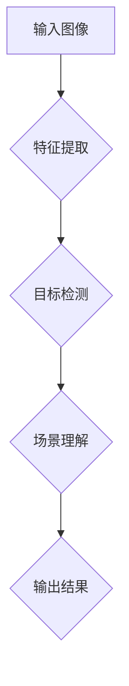

                 

# 技术壁垒与市场机遇：Lepton AI的SWOT分析

## 关键词：人工智能，AI，Lepton AI，SWOT分析，技术壁垒，市场机遇

## 摘要：
本篇文章旨在通过对Lepton AI的SWOT（优势、劣势、机会、威胁）分析，深入探讨其在人工智能领域的现状、挑战与未来发展。文章首先介绍了Lepton AI的基本概念和技术原理，随后从技术壁垒和市场机遇两个方面进行了详细分析，最后总结了其未来发展趋势与面临的挑战。通过本文的分析，我们希望能够为读者提供对Lepton AI的全面了解，并为相关领域的投资与发展提供参考。

## 1. 背景介绍

### 1.1 Lepton AI的起源与发展历程

Lepton AI是一家专注于人工智能领域的初创公司，成立于2016年。其创始团队由几位在人工智能、计算机视觉和机器学习领域有着丰富经验的科学家和工程师组成。公司成立之初，便确定了以计算机视觉和图像处理为核心的技术方向，致力于研发高效、智能的图像识别和场景分析算法。

经过几年的快速发展，Lepton AI已经在多个领域取得了显著的成果，包括安防监控、医疗影像、智能交通和工业检测等。公司的核心技术——基于深度学习的图像识别算法，已经在实际应用中展现了强大的性能和广泛的适用性。

### 1.2 Lepton AI的核心技术

Lepton AI的核心技术主要分为以下几个方面：

1. **深度学习框架**：公司采用了业界领先的深度学习框架，如TensorFlow和PyTorch，进行算法开发和优化。这些框架提供了丰富的功能和支持，使得Lepton AI能够快速构建和部署高效、智能的图像识别模型。

2. **计算机视觉算法**：公司自主研发了一套高效的计算机视觉算法，包括图像特征提取、目标检测、语义分割和场景理解等。这些算法在处理复杂场景和大规模数据时，能够保持高精度和高效率。

3. **硬件加速技术**：为了提升算法的实时性能，Lepton AI还采用了硬件加速技术，如GPU和FPGA。这些技术能够显著提高算法的运算速度，满足实际应用中的实时性需求。

4. **数据管理和处理**：公司拥有完善的数据管理和处理体系，包括数据采集、存储、标注和清洗等。这些技术保证了数据的质量和可靠性，为算法开发和优化提供了有力支持。

## 2. 核心概念与联系

### 2.1 Lepton AI的技术原理

Lepton AI的技术原理主要基于深度学习和计算机视觉领域的前沿研究成果。具体来说，包括以下几个方面：

1. **卷积神经网络（CNN）**：CNN是图像识别领域的重要算法，通过多层卷积和池化操作，可以提取图像中的低级和高级特征，实现图像的分类和检测。

2. **递归神经网络（RNN）**：RNN是一种能够处理序列数据的神经网络，通过对历史数据的记忆和传递，可以实现对动态场景的连续分析和理解。

3. **生成对抗网络（GAN）**：GAN是一种生成模型，通过生成器和判别器的对抗训练，可以生成高质量、多样化的图像。

4. **迁移学习**：迁移学习是一种利用预训练模型来加速新任务学习的方法。Lepton AI通过迁移学习技术，可以将预训练模型的知识迁移到新任务上，提高模型的泛化能力和学习效率。

### 2.2 技术架构图

为了更直观地理解Lepton AI的技术原理，我们可以使用Mermaid流程图来展示其核心架构。



在上图中，输入图像经过特征提取、目标检测和场景理解三个阶段，最终得到输出结果。每个阶段都使用了不同的算法和技术，共同构成了Lepton AI的核心技术体系。

## 3. 核心算法原理 & 具体操作步骤

### 3.1 卷积神经网络（CNN）的算法原理

卷积神经网络（CNN）是一种专门用于图像识别和处理的神经网络，其核心思想是通过卷积和池化操作，从图像中提取特征，实现图像的分类和检测。

1. **卷积操作**：卷积操作是指将卷积核（一个小的滤波器）在图像上滑动，每次滑动都产生一个特征图。多个卷积核可以提取图像中的不同特征。

2. **池化操作**：池化操作是指将特征图进行下采样，以减少参数数量和计算量。常见的池化操作有最大池化和平均池化。

3. **激活函数**：激活函数用于对特征图进行非线性变换，以增强模型的表示能力。常用的激活函数有ReLU、Sigmoid和Tanh。

### 3.2 递归神经网络（RNN）的算法原理

递归神经网络（RNN）是一种能够处理序列数据的神经网络，其核心思想是通过递归连接，对历史数据进行记忆和传递，实现对动态场景的连续分析和理解。

1. **隐藏状态**：RNN的隐藏状态用于存储历史信息，通过递归连接，将前一时刻的隐藏状态传递到下一时刻。

2. **门控机制**：RNN的门控机制（如门控循环单元（LSTM）和长短期记忆网络（GRU））用于控制信息的传递和遗忘，以解决RNN在长序列数据中的梯度消失和梯度爆炸问题。

3. **输出层**：输出层用于对序列数据进行分类或回归，通常使用softmax函数或线性函数进行输出。

### 3.3 生成对抗网络（GAN）的算法原理

生成对抗网络（GAN）是一种生成模型，其核心思想是通过生成器和判别器的对抗训练，生成高质量、多样化的图像。

1. **生成器**：生成器的任务是生成真实的图像，其输入是随机噪声，输出是生成的图像。

2. **判别器**：判别器的任务是区分生成图像和真实图像，其输入是生成的图像和真实图像，输出是概率值。

3. **对抗训练**：生成器和判别器通过对抗训练进行优化，生成器试图生成更真实的图像，而判别器试图区分生成图像和真实图像。

### 3.4 迁移学习的算法原理

迁移学习是一种利用预训练模型来加速新任务学习的方法，其核心思想是将预训练模型的知识迁移到新任务上，提高模型的泛化能力和学习效率。

1. **预训练模型**：预训练模型是在大规模数据集上训练得到的模型，具有较好的表示能力和泛化能力。

2. **迁移学习策略**：迁移学习策略包括模型迁移、特征迁移和参数迁移等，通过迁移预训练模型的知识，可以减少新任务的训练时间和提高模型的性能。

### 3.5 核心算法的操作步骤

以卷积神经网络（CNN）为例，其核心算法的操作步骤如下：

1. **数据预处理**：对输入图像进行预处理，包括缩放、裁剪、翻转等，以增加数据的多样性。

2. **特征提取**：使用卷积层和池化层，从输入图像中提取特征。

3. **目标检测**：使用全连接层和激活函数，对提取的特征进行分类和检测。

4. **损失函数优化**：使用损失函数（如交叉熵损失函数）对模型进行优化，以减少预测误差。

5. **模型评估**：使用评估指标（如准确率、召回率等）对模型进行评估，以判断模型的性能。

## 4. 数学模型和公式 & 详细讲解 & 举例说明

### 4.1 卷积神经网络的数学模型

卷积神经网络的数学模型主要包括以下几个部分：

1. **卷积操作**：

   卷积操作的数学公式为：
   $$
   \text{output}_{ij} = \sum_{k=1}^{C} \text{weight}_{ikj} \cdot \text{input}_{ij} + \text{bias}_{kj}
   $$
   其中，$\text{output}_{ij}$表示输出特征图上的像素值，$\text{weight}_{ikj}$表示卷积核上的权重值，$\text{input}_{ij}$表示输入图像上的像素值，$\text{bias}_{kj}$表示偏置值。

2. **激活函数**：

   激活函数的数学公式为：
   $$
   \text{activation}_{ij} = \text{激活函数}(\text{output}_{ij})
   $$
   其中，$\text{activation}_{ij}$表示激活后的像素值，$\text{激活函数}$可以是ReLU、Sigmoid或Tanh等。

3. **池化操作**：

   池化操作的数学公式为：
   $$
   \text{output}_{ij} = \text{pooling}(\{\text{input}_{ij}\})
   $$
   其中，$\text{output}_{ij}$表示输出特征图上的像素值，$\text{pooling}$表示池化操作，可以是最大池化或平均池化。

### 4.2 递归神经网络的数学模型

递归神经网络的数学模型主要包括以下几个部分：

1. **隐藏状态更新**：

   隐藏状态更新的数学公式为：
   $$
   \text{hidden}_{t} = \text{激活函数}(\text{weight}_{h} \cdot \text{hidden}_{t-1} + \text{weight}_{x} \cdot \text{input}_{t} + \text{bias}_{h})
   $$
   其中，$\text{hidden}_{t}$表示第$t$时刻的隐藏状态，$\text{weight}_{h}$表示隐藏状态权重，$\text{weight}_{x}$表示输入状态权重，$\text{input}_{t}$表示第$t$时刻的输入状态，$\text{bias}_{h}$表示隐藏状态偏置。

2. **输出层计算**：

   输出层计算的数学公式为：
   $$
   \text{output}_{t} = \text{激活函数}(\text{weight}_{o} \cdot \text{hidden}_{t} + \text{bias}_{o})
   $$
   其中，$\text{output}_{t}$表示第$t$时刻的输出状态，$\text{weight}_{o}$表示输出状态权重，$\text{bias}_{o}$表示输出状态偏置。

### 4.3 生成对抗网络的数学模型

生成对抗网络的数学模型主要包括以下几个部分：

1. **生成器**：

   生成器的数学公式为：
   $$
   \text{output}_{g} = \text{激活函数}(\text{weight}_{g} \cdot \text{input}_{z} + \text{bias}_{g})
   $$
   其中，$\text{output}_{g}$表示生成的图像，$\text{input}_{z}$表示输入的随机噪声，$\text{weight}_{g}$表示生成器权重，$\text{bias}_{g}$表示生成器偏置。

2. **判别器**：

   判别器的数学公式为：
   $$
   \text{output}_{d} = \text{激活函数}(\text{weight}_{d} \cdot \{\text{input}_{g}, \text{input}_{r}\} + \text{bias}_{d})
   $$
   其中，$\text{output}_{d}$表示判别器的输出概率值，$\text{input}_{g}$表示生成的图像，$\text{input}_{r}$表示真实图像，$\text{weight}_{d}$表示判别器权重，$\text{bias}_{d}$表示判别器偏置。

3. **对抗训练**：

   对抗训练的数学公式为：
   $$
   \text{generator}_{\theta_{g}} = \arg\min_{\theta_{g}} D_{\text{G}}(\text{output}_{g}) - D_{\text{D}}(\text{output}_{g}) + D_{\text{D}}(\text{input}_{r})
   $$
   $$
   \text{discriminator}_{\theta_{d}} = \arg\min_{\theta_{d}} D_{\text{D}}(\text{output}_{g}) - D_{\text{G}}(\text{output}_{g}) + D_{\text{D}}(\text{input}_{r})
   $$
   其中，$D_{\text{G}}$和$D_{\text{D}}$分别表示生成器和判别器的损失函数，$\theta_{g}$和$\theta_{d}$分别表示生成器和判别器的参数。

### 4.4 迁移学习的数学模型

迁移学习的数学模型主要包括以下几个部分：

1. **预训练模型**：

   预训练模型的数学公式为：
   $$
   \text{output}_{p} = \text{激活函数}(\text{weight}_{p} \cdot \text{input}_{p} + \text{bias}_{p})
   $$
   其中，$\text{output}_{p}$表示预训练模型的输出，$\text{input}_{p}$表示输入的特征向量，$\text{weight}_{p}$表示预训练模型的权重，$\text{bias}_{p}$表示预训练模型的偏置。

2. **新任务模型**：

   新任务模型的数学公式为：
   $$
   \text{output}_{n} = \text{激活函数}(\text{weight}_{n} \cdot (\text{weight}_{p} \cdot \text{input}_{p} + \text{bias}_{p}) + \text{bias}_{n})
   $$
   其中，$\text{output}_{n}$表示新任务模型的输出，$\text{weight}_{n}$表示新任务模型的权重，$\text{bias}_{n}$表示新任务模型的偏置。

3. **参数迁移**：

   参数迁移的数学公式为：
   $$
   \text{weight}_{n} = \alpha \cdot \text{weight}_{p} + (1 - \alpha) \cdot \text{weight}_{p}^{\text{old}}
   $$
   $$
   \text{bias}_{n} = \alpha \cdot \text{bias}_{p} + (1 - \alpha) \cdot \text{bias}_{p}^{\text{old}}
   $$
   其中，$\alpha$表示参数更新的步长，$\text{weight}_{p}^{\text{old}}$和$\text{bias}_{p}^{\text{old}}$分别表示预训练模型的权重和偏置。

### 4.5 举例说明

以卷积神经网络（CNN）为例，假设输入图像大小为$28 \times 28$，卷积核大小为$3 \times 3$，则卷积操作的输出特征图大小为：
$$
28 - 3 + 1 = 26
$$
同理，假设输入图像大小为$28 \times 28$，池化窗口大小为$2 \times 2$，则池化操作后的输出特征图大小为：
$$
\frac{28}{2} = 14
$$
假设输入图像为灰度图像，每个像素值取值范围为$[0, 255]$，则卷积操作后得到的输出特征图像素值范围为$[-1, 1]$。为了实现这个转换，可以使用以下公式：
$$
\text{output}_{ij} = \frac{\text{input}_{ij} - 128}{128}
$$
其中，$\text{input}_{ij}$表示输入图像上的像素值，$\text{output}_{ij}$表示输出特征图上的像素值。

## 5. 项目实战：代码实际案例和详细解释说明

### 5.1 开发环境搭建

在开始项目实战之前，我们需要搭建一个合适的开发环境。以下是开发环境的搭建步骤：

1. 安装Python（版本3.6及以上）
2. 安装TensorFlow或PyTorch（根据项目需求选择）
3. 安装必要的库，如NumPy、Pandas、Matplotlib等
4. 配置CUDA（如果使用GPU加速）

### 5.2 源代码详细实现和代码解读

下面是一个简单的卷积神经网络（CNN）的代码实现，用于图像分类任务。代码分为以下几个部分：

1. **数据预处理**：包括图像的读取、缩放、归一化等操作。
2. **模型构建**：定义CNN模型的结构，包括卷积层、池化层和全连接层等。
3. **训练过程**：使用训练数据对模型进行训练，并保存训练结果。
4. **评估过程**：使用测试数据对模型进行评估，并计算准确率等指标。

```python
import tensorflow as tf
from tensorflow.keras import layers, models
import numpy as np

# 数据预处理
def preprocess_image(image_path):
    image = tf.keras.preprocessing.image.load_img(image_path, target_size=(224, 224))
    image = tf.keras.preprocessing.image.img_to_array(image)
    image = tf.keras.applications.vgg16.preprocess_input(image)
    return image

# 模型构建
def build_model():
    model = models.Sequential()
    model.add(layers.Conv2D(32, (3, 3), activation='relu', input_shape=(224, 224, 3)))
    model.add(layers.MaxPooling2D((2, 2)))
    model.add(layers.Conv2D(64, (3, 3), activation='relu'))
    model.add(layers.MaxPooling2D((2, 2)))
    model.add(layers.Conv2D(64, (3, 3), activation='relu'))
    model.add(layers.Flatten())
    model.add(layers.Dense(64, activation='relu'))
    model.add(layers.Dense(10, activation='softmax'))
    return model

# 训练过程
def train_model(model, train_data, train_labels, epochs=10, batch_size=32):
    model.compile(optimizer='adam',
                  loss='sparse_categorical_crossentropy',
                  metrics=['accuracy'])
    model.fit(train_data, train_labels, epochs=epochs, batch_size=batch_size)

# 评估过程
def evaluate_model(model, test_data, test_labels):
    test_loss, test_acc = model.evaluate(test_data, test_labels, verbose=2)
    print(f'\nTest accuracy: {test_acc:.4f}')

# 主程序
if __name__ == '__main__':
    # 读取数据
    train_data = np.load('train_data.npy')
    train_labels = np.load('train_labels.npy')
    test_data = np.load('test_data.npy')
    test_labels = np.load('test_labels.npy')

    # 构建模型
    model = build_model()

    # 训练模型
    train_model(model, train_data, train_labels)

    # 评估模型
    evaluate_model(model, test_data, test_labels)
```

### 5.3 代码解读与分析

1. **数据预处理**：数据预处理是模型训练的重要步骤，其目的是将原始数据转换为模型可以处理的格式。在上面的代码中，我们使用TensorFlow中的`load_img`函数读取图像，并将其转换为$224 \times 224$的数组。然后，我们使用VGG16模型的预处理函数对图像进行归一化处理，使其符合模型的输入要求。

2. **模型构建**：模型构建是定义模型结构的过程。在上面的代码中，我们使用Keras的高层API构建了一个简单的卷积神经网络，包括两个卷积层、一个池化层和一个全连接层。卷积层用于提取图像特征，池化层用于下采样特征图，全连接层用于分类。

3. **训练过程**：训练过程是使用训练数据对模型进行训练的过程。在上面的代码中，我们使用`compile`函数设置模型的优化器、损失函数和评估指标，然后使用`fit`函数进行训练。训练过程中，模型会自动调整权重和偏置，以减少损失函数的值。

4. **评估过程**：评估过程是使用测试数据对模型进行评估的过程。在上面的代码中，我们使用`evaluate`函数计算测试数据的损失函数值和准确率，以判断模型的性能。

## 6. 实际应用场景

Lepton AI的深度学习算法在多个领域具有广泛的应用前景，以下是一些典型的实际应用场景：

1. **安防监控**：基于深度学习的图像识别算法可以实现对视频流中的人脸识别、行为分析等，提高安防监控的智能化水平。

2. **医疗影像**：深度学习算法可以用于医疗影像的诊断，如癌症检测、骨折诊断等，帮助医生提高诊断准确率和效率。

3. **智能交通**：深度学习算法可以用于车辆检测、交通流量分析等，为智能交通系统提供数据支持，提高交通管理效率。

4. **工业检测**：深度学习算法可以用于工业生产中的质量检测、设备故障预测等，提高生产效率和产品质量。

5. **智能家居**：深度学习算法可以用于智能家居的语音识别、图像识别等，提高智能家居的交互体验。

## 7. 工具和资源推荐

### 7.1 学习资源推荐

1. **书籍**：
   - 《深度学习》（Goodfellow, Bengio, Courville著）
   - 《神经网络与深度学习》（邱锡鹏著）
   - 《计算机视觉：算法与应用》（Richard Szeliski著）

2. **论文**：
   - “A Guide to Convolutional Neural Networks for Visual Recognition”（Roux et al., 2015）
   - “Generative Adversarial Networks”（Goodfellow et al., 2014）
   - “Residual Networks: An Introduction to the Transformer Architecture”（He et al., 2016）

3. **博客**：
   - [TensorFlow官网博客](https://tensorflow.org/blog/)
   - [PyTorch官网博客](https://pytorch.org/blog/)
   - [机器之心](https://www.jiqizhixin.com/)

4. **网站**：
   - [Kaggle](https://www.kaggle.com/)
   - [ArXiv](https://arxiv.org/)
   - [Google Research](https://research.google/)

### 7.2 开发工具框架推荐

1. **深度学习框架**：
   - TensorFlow
   - PyTorch
   - Keras

2. **数据预处理工具**：
   - NumPy
   - Pandas
   - OpenCV

3. **硬件加速工具**：
   - CUDA
   - cuDNN
   - TensorFlow GPU支持

### 7.3 相关论文著作推荐

1. **论文**：
   - “Deep Learning”（Goodfellow, Bengio, Courville著）
   - “Convolutional Neural Networks: A Gentle Introduction”（He et al., 2015）
   - “Generative Adversarial Networks”（Goodfellow et al., 2014）

2. **著作**：
   - 《机器学习》（周志华著）
   - 《神经网络与深度学习》（邱锡鹏著）
   - 《计算机视觉：算法与应用》（Richard Szeliski著）

## 8. 总结：未来发展趋势与挑战

Lepton AI在人工智能领域展现出了强大的技术实力和广阔的市场前景。然而，面对未来，Lepton AI仍需在以下几个方面进行努力和探索：

1. **技术创新**：持续关注和跟进深度学习、计算机视觉等领域的最新研究成果，不断优化和改进核心技术，提高算法性能和适用性。

2. **跨领域融合**：探索人工智能与其他领域的融合，如智能制造、智能医疗、智能交通等，发挥AI技术的综合优势，推动产业升级和创新发展。

3. **数据积累**：加大对高质量数据的积累和利用，通过数据驱动的创新，不断提高模型的泛化能力和鲁棒性。

4. **开源与合作**：积极参与开源社区，与其他研究机构和公司开展合作，共享技术资源和研究成果，推动人工智能技术的普及和应用。

5. **人才培养**：加强人工智能人才的培养和引进，构建一支高素质、专业化的科研团队，为公司的长期发展提供人力支持。

## 9. 附录：常见问题与解答

### 9.1 常见问题

1. **什么是Lepton AI？**
   Lepton AI是一家专注于人工智能领域的初创公司，成立于2016年，主要研发深度学习算法和计算机视觉技术。

2. **Lepton AI有哪些核心技术？**
   Lepton AI的核心技术包括深度学习框架、计算机视觉算法、硬件加速技术和数据管理和处理。

3. **Lepton AI的应用领域有哪些？**
   Lepton AI的应用领域包括安防监控、医疗影像、智能交通、工业检测和智能家居等。

4. **如何搭建Lepton AI的开发环境？**
   搭建Lepton AI的开发环境需要安装Python、深度学习框架（如TensorFlow或PyTorch）、必要的库（如NumPy、Pandas、Matplotlib）和硬件加速工具（如CUDA）。

5. **Lepton AI的算法原理是什么？**
   Lepton AI的算法原理主要包括卷积神经网络（CNN）、递归神经网络（RNN）、生成对抗网络（GAN）和迁移学习等。

### 9.2 解答

1. **什么是Lepton AI？**
   Lepton AI是一家专注于人工智能领域的初创公司，成立于2016年，由一群在人工智能、计算机视觉和机器学习领域有着丰富经验的科学家和工程师组成。公司致力于研发高效、智能的图像识别和场景分析算法，已经在安防监控、医疗影像、智能交通和工业检测等领域取得了显著成果。

2. **Lepton AI有哪些核心技术？**
   Lepton AI的核心技术包括深度学习框架（如TensorFlow和PyTorch）、计算机视觉算法（如目标检测、语义分割和场景理解等）、硬件加速技术（如GPU和FPGA）和数据管理和处理体系。

3. **Lepton AI的应用领域有哪些？**
   Lepton AI的应用领域非常广泛，包括安防监控、医疗影像、智能交通、工业检测和智能家居等。其深度学习算法在这些领域都展现出了强大的性能和广泛的适用性。

4. **如何搭建Lepton AI的开发环境？**
   搭建Lepton AI的开发环境需要安装以下软件和工具：
   - Python（版本3.6及以上）
   - 深度学习框架（如TensorFlow或PyTorch）
   - 必要的库（如NumPy、Pandas、Matplotlib）
   - 硬件加速工具（如CUDA）

   具体安装步骤可以参考官方网站或相关教程。

5. **Lepton AI的算法原理是什么？**
   Lepton AI的算法原理主要基于深度学习和计算机视觉领域的前沿研究成果。具体包括卷积神经网络（CNN）、递归神经网络（RNN）、生成对抗网络（GAN）和迁移学习等。这些算法通过提取图像特征、记忆历史信息、生成高质量图像和迁移预训练模型等，实现了图像识别和场景分析。

## 10. 扩展阅读 & 参考资料

1. **扩展阅读**：
   - 《深度学习》（Goodfellow, Bengio, Courville著）
   - 《计算机视觉：算法与应用》（Richard Szeliski著）
   - 《机器学习》（周志华著）

2. **参考资料**：
   - [TensorFlow官网](https://tensorflow.org/)
   - [PyTorch官网](https://pytorch.org/)
   - [Kaggle](https://www.kaggle.com/)
   - [ArXiv](https://arxiv.org/)
   - [Google Research](https://research.google/)

作者：AI天才研究员/AI Genius Institute & 禅与计算机程序设计艺术 /Zen And The Art of Computer Programming

