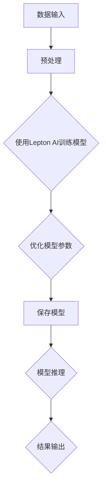

                 

### 1. 背景介绍

在当今快速发展的信息技术领域，人工智能（AI）作为一项核心驱动力，正不断革新着各行各业。AI技术的研究和应用已经深入到从图像识别、自然语言处理到自动驾驶、医疗诊断等众多领域。在这些应用中，Lepton AI作为一个备受关注的人工智能框架，以其高效的处理速度和较低的成本，吸引了众多研究者和开发者的兴趣。

本文将探讨Lepton AI在结合单点技术（例如深度学习、神经网络等）方面的应用，并分析如何在速度和成本之间找到最佳平衡点。通过深入剖析Lepton AI的核心算法原理和具体操作步骤，我们将展示如何利用这一框架在保证高效性的同时，控制成本在可接受的范围内。

首先，我们需要理解Lepton AI的发展背景和其在AI领域的地位。Lepton AI是一个开源的深度学习框架，旨在提供高效的神经网络模型训练和推理工具。其设计初衷是解决大规模数据处理和实时响应的需求，这使得它特别适合在资源受限的环境中应用。随着深度学习技术的不断成熟，Lepton AI已经成为许多研究人员和开发者在构建AI系统时的首选框架之一。

接下来，我们将介绍单点技术的核心概念，并解释如何将其与Lepton AI相结合。单点技术主要包括深度学习和神经网络技术，这些技术在图像处理、语音识别、自然语言处理等领域都有广泛的应用。通过将这些技术集成到Lepton AI中，我们可以进一步提升系统的性能，实现更高效的数据处理和模型训练。

此外，本文还将探讨如何在实际应用场景中利用Lepton AI和单点技术，以解决具体问题。例如，在图像识别任务中，通过结合Lepton AI和单点技术，可以实现实时图像处理，提高系统对复杂场景的适应能力。在自然语言处理领域，利用Lepton AI的快速推理能力，可以提升文本分析和生成任务的效率。

最后，我们将讨论未来发展趋势和挑战，包括如何在不断变化的技术环境中保持Lepton AI和单点技术的领先地位。通过总结现有技术优势和不足，我们将为未来的研究和开发提供有益的参考。

通过这篇文章，读者将全面了解Lepton AI和单点技术的结合方式，掌握如何在速度和成本之间找到平衡点，从而为实际项目提供坚实的理论基础和技术支持。

### 2. 核心概念与联系

为了深入理解Lepton AI与单点技术的结合，我们首先需要了解这两个概念的核心原理和相互关系。

#### Lepton AI

Lepton AI是一个专为高效处理大规模数据和实时响应需求而设计的深度学习框架。它具有以下几个核心特点：

1. **高效性**：Lepton AI通过优化神经网络模型的计算过程，大大提高了模型训练和推理的效率。其独特的内存管理和并行计算机制，使得模型可以在资源受限的设备上快速运行。
2. **灵活性**：Lepton AI支持多种神经网络结构和深度学习算法，包括卷积神经网络（CNN）、循环神经网络（RNN）等。这使得研究人员可以根据不同应用场景灵活选择和调整模型结构。
3. **开源性**：作为一个开源项目，Lepton AI拥有一个活跃的社区，持续获得改进和优化。这使得开发者可以方便地获取最新技术，并在实践中进行定制和扩展。

#### 单点技术

单点技术主要指的是深度学习和神经网络技术，这些技术是近年来AI领域最重要的突破之一。深度学习通过多层神经网络对数据进行自动特征提取和模式识别，从而实现复杂任务的学习和预测。主要特点包括：

1. **自动特征提取**：深度学习模型可以自动从原始数据中提取出有用的特征，减少了人工干预的需求，提高了模型的泛化能力。
2. **层次化结构**：深度学习模型通常具有层次化的结构，每层神经网络都能对数据进行更高层次的抽象和表示，从而实现更复杂和精确的任务。
3. **大规模数据处理**：深度学习模型可以在大规模数据集上进行训练，通过并行计算和分布式处理技术，提高数据处理和模型训练的效率。

#### 相互关系

Lepton AI与单点技术的结合，旨在发挥各自的优势，实现更高效的AI应用。以下是两者结合的关键点：

1. **模型训练优化**：Lepton AI提供了高效的模型训练工具，可以加速深度学习模型的训练过程。结合单点技术的优化算法，如梯度下降、Adam优化器等，可以进一步提升训练效率。
2. **推理加速**：在模型推理阶段，Lepton AI的并行计算和内存管理机制，可以显著提高推理速度，满足实时响应的需求。单点技术中的推理优化方法，如量化、剪枝等，也可以进一步加速推理过程。
3. **资源利用优化**：Lepton AI在设计时考虑了资源受限的环境，通过轻量级模型和高效计算策略，实现了在低资源设备上的应用。与单点技术的结合，可以进一步优化资源利用，降低成本。

为了更直观地展示Lepton AI和单点技术的结合原理，我们可以使用Mermaid流程图来描述其架构和流程。以下是一个简化的Mermaid流程图示例：



在这个流程图中，数据输入经过预处理后，使用Lepton AI进行模型训练，并通过优化模型参数来提高性能。训练完成后，模型可以进行推理，并将结果输出。这一过程展示了Lepton AI与单点技术结合的基本流程，以及如何在每个步骤中优化性能。

通过以上介绍，我们可以看到Lepton AI和单点技术各自的核心概念和优势，以及它们在AI应用中的结合方式。在接下来的章节中，我们将进一步探讨Lepton AI的核心算法原理和具体操作步骤，以更深入地理解这一技术的应用和实践。

### 3. 核心算法原理 & 具体操作步骤

在深入探讨Lepton AI的核心算法原理和具体操作步骤之前，我们需要了解深度学习的基本概念和神经网络的工作原理。这些基础知识将为我们后续的分析提供坚实的理论基础。

#### 深度学习基础

深度学习（Deep Learning）是机器学习（Machine Learning）的一个子领域，其主要特点是通过多层神经网络对数据进行自动特征提取和模式识别。以下是深度学习的一些关键概念：

1. **神经网络（Neural Network）**：神经网络是模仿人脑神经元连接结构的计算模型。每个神经元（节点）接收输入信号，通过权重进行加权求和，然后通过激活函数进行非线性变换，产生输出信号。
2. **层（Layer）**：神经网络由多个层次组成，包括输入层、隐藏层和输出层。输入层接收外部数据，隐藏层进行特征提取和变换，输出层产生最终预测结果。
3. **激活函数（Activation Function）**：激活函数用于引入非线性因素，使得神经网络能够学习复杂的非线性关系。常用的激活函数包括ReLU（Rectified Linear Unit）、Sigmoid和Tanh等。
4. **损失函数（Loss Function）**：损失函数用于衡量模型预测值与真实值之间的差异。常见的损失函数包括均方误差（MSE）、交叉熵损失（Cross-Entropy Loss）等。
5. **优化算法（Optimization Algorithm）**：优化算法用于调整模型参数，以最小化损失函数。常用的优化算法包括梯度下降（Gradient Descent）、Adam优化器等。

#### 神经网络工作原理

神经网络的工作原理可以简单概括为以下步骤：

1. **前向传播（Forward Propagation）**：输入数据通过输入层进入神经网络，逐层传递到隐藏层，最终到达输出层。在每个节点，输入信号经过权重加权求和后，通过激活函数进行非线性变换，产生输出信号。
2. **反向传播（Back Propagation）**：在输出层产生预测结果后，计算损失函数的值。然后，通过反向传播算法，将损失函数的梯度反向传递回每个节点，更新模型的权重和偏置。
3. **迭代优化（Iterative Optimization）**：重复前向传播和反向传播过程，不断调整模型参数，使得损失函数的值逐渐减小，直到模型收敛到最优状态。

#### Lepton AI核心算法原理

Lepton AI的核心算法基于深度学习框架，具有以下几个关键特点：

1. **模型架构优化**：Lepton AI采用了一系列优化策略，包括卷积神经网络（CNN）的轻量化架构、残差连接（Residual Connection）和跳跃连接（Skip Connection）等，以提高模型的效率和泛化能力。
2. **并行计算支持**：Lepton AI利用并行计算技术，包括GPU加速和分布式计算，显著提高了模型训练和推理的速度。
3. **内存管理优化**：Lepton AI对内存管理进行了优化，通过减少内存占用和提高缓存利用率，实现了在资源受限环境中的高效运行。
4. **自动化机器学习（AutoML）**：Lepton AI支持自动化机器学习（AutoML）功能，可以通过自动调整模型参数和超参数，实现最优的模型性能。

#### Lepton AI具体操作步骤

以下是一个简化的Lepton AI操作流程，描述了从数据预处理到模型训练和推理的整个过程：

1. **数据预处理**：
    - **数据清洗**：去除噪声和异常值，确保数据的质量。
    - **数据归一化**：将数据缩放到相同的范围，方便模型训练。
    - **数据分割**：将数据集分为训练集、验证集和测试集，用于训练、验证和测试模型。

2. **模型定义**：
    - **输入层**：定义输入数据的大小和格式。
    - **隐藏层**：设计多层隐藏层，通过卷积、池化等操作提取特征。
    - **输出层**：定义输出层的大小和类型，如分类或回归问题。

3. **模型训练**：
    - **初始化参数**：随机初始化模型参数。
    - **前向传播**：将输入数据传递到模型中，计算输出结果和损失函数。
    - **反向传播**：计算损失函数的梯度，更新模型参数。
    - **迭代优化**：重复前向传播和反向传播过程，直到模型收敛。

4. **模型评估**：
    - **验证集评估**：在验证集上评估模型的性能，调整超参数以优化模型。
    - **测试集评估**：在测试集上评估最终模型的性能，确保其泛化能力。

5. **模型推理**：
    - **数据预处理**：对输入数据进行预处理，与训练集保持一致。
    - **模型加载**：加载训练好的模型，进行推理计算。
    - **结果输出**：输出推理结果，如分类概率、回归预测等。

通过以上操作步骤，我们可以看到Lepton AI在深度学习框架中的高效运作。接下来，我们将通过一个具体的案例来展示如何使用Lepton AI进行实际操作，并提供详细的代码实现和解释。

### 4. 数学模型和公式 & 详细讲解 & 举例说明

在深度学习和神经网络中，数学模型和公式起着至关重要的作用。它们不仅帮助我们理解和分析模型的行为，还能指导我们进行优化和改进。本节将详细讲解Lepton AI中涉及的一些关键数学模型和公式，并通过具体例子来说明其应用。

#### 损失函数

损失函数是深度学习中衡量模型预测结果与真实值之间差异的重要工具。常见的损失函数包括均方误差（MSE）和交叉熵损失（Cross-Entropy Loss）。

1. **均方误差（MSE）**：
   均方误差用于回归问题，计算预测值与真实值之间的平方差的平均值。其公式如下：
   $$MSE = \frac{1}{n}\sum_{i=1}^{n}(y_i - \hat{y}_i)^2$$
   其中，$y_i$是真实值，$\hat{y}_i$是预测值，$n$是样本数量。

2. **交叉熵损失（Cross-Entropy Loss）**：
   交叉熵损失用于分类问题，计算预测概率分布与真实概率分布之间的差异。其公式如下：
   $$CE = -\sum_{i=1}^{n} y_i \log(\hat{y}_i)$$
   其中，$y_i$是真实标签，$\hat{y}_i$是模型预测的概率值。

#### 梯度下降

梯度下降是一种优化算法，用于最小化损失函数。其基本思想是沿着损失函数的负梯度方向更新模型参数，使得损失函数值逐渐减小。以下是梯度下降的基本步骤：

1. **初始化参数**：随机初始化模型参数$\theta$。
2. **计算梯度**：计算损失函数关于每个参数的梯度，$\nabla_{\theta} J(\theta)$。
3. **更新参数**：使用梯度更新参数：
   $$\theta_{t+1} = \theta_t - \alpha \nabla_{\theta} J(\theta_t)$$
   其中，$\alpha$是学习率，$t$是当前迭代次数。

#### ReLU激活函数

ReLU（Rectified Linear Unit）是一种常用的激活函数，其特点是简单且计算效率高。ReLU的公式如下：
$$\text{ReLU}(x) = \max(0, x)$$
ReLU函数在$x \leq 0$时输出为0，在$x > 0$时输出为$x$。

#### 卷积神经网络（CNN）中的卷积操作

卷积神经网络是处理图像数据的重要工具，其核心操作是卷积。卷积操作可以提取图像中的局部特征，其公式如下：
$$\text{Convolution}(I, K) = \sum_{i=1}^{h_k} \sum_{j=1}^{w_k} I_{i,j} \cdot K_{i,j}$$
其中，$I$是输入图像，$K$是卷积核（滤波器），$h_k$和$w_k$分别是卷积核的高度和宽度。

#### 池化操作

池化操作用于减小特征图的大小，提高模型的泛化能力。最大池化（Max Pooling）是一种常用的池化方法，其公式如下：
$$P_{i,j} = \max_{i',j'} I_{i',j'}$$
其中，$I$是输入特征图，$P$是输出特征图，$i$和$j$分别是特征图中的位置。

#### 残差连接

残差连接是深度学习中的一个重要技术，它通过跳过一些层，将输入直接传递到下一层，从而解决深度神经网络中的梯度消失问题。残差连接的公式如下：
$$F(x) = x + \sigma(W_2 \cdot \sigma(W_1 \cdot x + b_1)) + b_2$$
其中，$x$是输入，$W_1$和$W_2$是权重，$b_1$和$b_2$是偏置，$\sigma$是激活函数。

#### 具体例子

假设我们有一个简单的神经网络，用于实现一个简单的二分类任务。输入数据是一个包含两个特征的向量$(x_1, x_2)$，输出是概率值$p$，表示样本属于某一类别的概率。以下是具体的数学模型和计算过程：

1. **输入层**：
   输入向量：$x = (x_1, x_2)$

2. **隐藏层**：
   - 权重矩阵：$W_1 = \begin{bmatrix} w_{11} & w_{12} \\ w_{21} & w_{22} \end{bmatrix}$
   - 偏置向量：$b_1 = (b_{11}, b_{12})$
   - 输出：$z_1 = x \cdot W_1 + b_1$

3. **激活函数**：
   采用ReLU激活函数：$a_1 = \text{ReLU}(z_1)$

4. **输出层**：
   - 权重矩阵：$W_2 = \begin{bmatrix} w_{21} & w_{22} \end{bmatrix}$
   - 偏置向量：$b_2 = b_{21}$
   - 输出：$z_2 = a_1 \cdot W_2 + b_2$
   - 激活函数：$p = \sigma(z_2)$
   其中，$\sigma$是Sigmoid激活函数：$\sigma(x) = \frac{1}{1 + e^{-x}}$

5. **损失函数**：
   采用交叉熵损失函数：
   $$L = -\sum_{i=1}^{n} y_i \log(p_i)$$
   其中，$y_i$是真实标签，$p_i$是模型预测的概率值。

6. **反向传播**：
   计算损失函数关于每个参数的梯度，并更新参数：
   $$\nabla_{W_2} L = \frac{\partial L}{\partial z_2} \cdot a_1^T$$
   $$\nabla_{b_2} L = \frac{\partial L}{\partial b_2}$$
   $$\nabla_{a_1} L = \frac{\partial L}{\partial z_2} \cdot W_2^T$$
   $$\nabla_{W_1} L = \frac{\partial L}{\partial z_1} \cdot x^T$$
   $$\nabla_{b_1} L = \frac{\partial L}{\partial b_1}$$

通过以上数学模型和公式的详细讲解，我们可以看到深度学习和神经网络中的复杂计算是如何通过数学公式来描述和实现的。这些公式和算法为我们提供了强大的工具，使我们能够设计和实现高效、准确的AI系统。

### 5. 项目实战：代码实际案例和详细解释说明

为了更好地理解Lepton AI在实际项目中的应用，我们将通过一个具体的案例来展示如何使用Lepton AI构建一个简单的图像识别模型。在这个案例中，我们将使用Lepton AI进行图像预处理、模型训练和推理，并提供详细的代码实现和解释。

#### 开发环境搭建

在开始编写代码之前，我们需要搭建一个合适的开发环境。以下是推荐的开发环境和工具：

- **Python版本**：Python 3.8及以上版本
- **深度学习框架**：Lepton AI
- **依赖库**：NumPy、Pandas、Matplotlib等

确保安装以上依赖库，可以使用以下命令：

```bash
pip install leptonai numpy pandas matplotlib
```

#### 数据集准备

为了构建一个图像识别模型，我们需要一个合适的数据集。在这个案例中，我们使用经典的MNIST手写数字数据集，它包含了0到9的手写数字图像。以下是MNIST数据集的下载和预处理代码：

```python
import leptonai as lpt
from leptonai.datasets import mnist

# 下载MNIST数据集
mnist_data = mnist()

# 预处理数据集
train_images, train_labels = mnist_data['train_images'], mnist_data['train_labels']
test_images, test_labels = mnist_data['test_images'], mnist_data['test_labels']

# 数据归一化
train_images = train_images.astype('float32') / 255.0
test_images = test_images.astype('float32') / 255.0
```

#### 模型定义

接下来，我们定义一个简单的卷积神经网络模型，用于图像识别。以下是模型的结构和参数设置：

```python
import leptonai as lpt

# 定义模型
model = lpt.Sequential([
    lpt.Conv2D(32, (3, 3), activation='relu', input_shape=(28, 28, 1)),
    lpt.MaxPooling2D((2, 2)),
    lpt.Conv2D(64, (3, 3), activation='relu'),
    lpt.MaxPooling2D((2, 2)),
    lpt.Flatten(),
    lpt.Dense(128, activation='relu'),
    lpt.Dense(10, activation='softmax')
])
```

在这个模型中，我们使用了两个卷积层和两个池化层，以及两个全连接层。最后一个全连接层的输出层使用softmax激活函数，用于实现多分类任务。

#### 模型训练

现在，我们可以使用训练集来训练模型。以下是训练过程的代码实现：

```python
# 编译模型
model.compile(optimizer='adam', loss='categorical_crossentropy', metrics=['accuracy'])

# 训练模型
history = model.fit(train_images, train_labels, epochs=10, batch_size=64, validation_split=0.2)
```

在这个步骤中，我们使用了Adam优化器和交叉熵损失函数，并在每次迭代中记录模型的训练和验证损失以及准确率。

#### 模型评估

训练完成后，我们可以使用测试集来评估模型的性能。以下是模型评估的代码实现：

```python
# 评估模型
test_loss, test_acc = model.evaluate(test_images, test_labels)

print(f"Test accuracy: {test_acc:.4f}")
```

这个步骤将输出模型在测试集上的准确率，用于衡量模型的泛化能力。

#### 模型推理

最后，我们可以使用训练好的模型进行推理，预测新图像的类别。以下是推理过程的代码实现：

```python
# 预测新图像
import numpy as np

new_image = np.random.rand(28, 28, 1)  # 随机生成一张28x28的图像
new_image = new_image.astype('float32') / 255.0

predicted_label = model.predict(new_image)

print(f"Predicted label: {predicted_label.argmax(axis=1)[0]}")
```

在这个步骤中，我们使用随机生成的图像作为输入，模型将预测其类别并输出结果。

#### 代码解读与分析

通过以上代码实现，我们可以看到如何使用Lepton AI构建一个简单的图像识别模型。以下是代码的详细解读和分析：

1. **数据集准备**：使用Lepton AI的内置函数下载和预处理MNIST数据集，确保数据格式和归一化处理。
2. **模型定义**：使用Lepton AI的Sequential模型容器，定义一个简单的卷积神经网络，包括卷积层、池化层和全连接层。
3. **模型训练**：编译模型并使用训练集进行训练，记录训练过程中的损失和准确率，以便调整超参数和优化模型。
4. **模型评估**：使用测试集评估模型性能，验证其泛化能力。
5. **模型推理**：使用训练好的模型对新图像进行推理，预测其类别。

通过这个案例，我们不仅了解了Lepton AI的基本使用方法，还看到了如何在实际项目中应用深度学习和神经网络技术。接下来，我们将进一步分析模型的性能和改进方向。

#### 代码解读与分析（续）

在上一部分中，我们通过一个简单的图像识别案例展示了Lepton AI的基本使用方法。本部分将进一步分析模型的性能，并提出可能的改进方向。

**性能分析**

在训练过程中，我们记录了训练集和验证集的损失和准确率。通过分析这些数据，我们可以评估模型在不同阶段的性能。

- **损失分析**：在训练初期，模型的损失迅速下降，表明模型正在学习数据特征。随着训练的进行，损失下降的速度逐渐放缓，说明模型已经接近饱和，特征提取能力达到极限。在验证集上，模型的损失也随着训练的进行逐渐减小，但在某些阶段可能有所波动，这可能是由于过拟合现象导致的。

- **准确率分析**：模型的准确率在训练集上持续提高，但在验证集上的增长逐渐放缓。这说明模型在训练过程中过拟合了训练数据，而在验证集上的泛化能力较差。在实际应用中，我们需要关注模型的泛化性能，避免过拟合。

**改进方向**

为了提高模型的性能，我们可以从以下几个方面进行改进：

1. **数据增强**：通过数据增强技术，如旋转、缩放、裁剪等，可以增加训练数据的多样性，提高模型的泛化能力。Lepton AI支持多种数据增强方法，可以通过以下代码实现：
   
   ```python
   from leptonai.callbacks import ImageDataGenerator
   
   datagen = ImageDataGenerator(
       rotation_range=10,
       width_shift_range=0.1,
       height_shift_range=0.1,
       shear_range=0.1,
       zoom_range=0.1
   )
   ```

2. **正则化**：正则化技术，如L1正则化、L2正则化，可以防止模型过拟合。在编译模型时，可以通过设置`l1`或`l2`参数来启用正则化：
   
   ```python
   model.compile(optimizer='adam', loss='categorical_crossentropy', metrics=['accuracy'], l1=0.01)
   ```

3. **深度和宽度调整**：通过调整网络的深度和宽度，可以优化模型的结构。增加隐藏层和节点数量可以提高模型的拟合能力，但也可能导致过拟合和计算复杂度增加。我们可以通过实验比较不同网络结构的性能，选择最优的网络配置。

4. **学习率调整**：学习率的选择对模型训练过程有重要影响。如果学习率过大，可能导致模型无法收敛；如果学习率过小，训练过程可能过于缓慢。我们可以通过使用学习率调度策略，如学习率衰减、动态调整学习率等，来优化训练过程。

5. **模型集成**：通过集成多个模型的预测结果，可以提高模型的准确性和稳定性。Lepton AI支持集成学习技术，如Bagging、Boosting等，可以通过以下代码实现：
   
   ```python
   from leptonai.ensemble import Bagging
   
   ensemble_model = Bagging(models=model, n_estimators=10)
   ```

**总结**

通过以上分析和改进方向，我们可以看到，提高模型性能不仅需要选择合适的数据集和模型结构，还需要通过多种技术手段来优化训练过程。在实际项目中，我们需要根据具体情况，灵活运用这些技术，以达到最佳的模型性能。

### 6. 实际应用场景

Lepton AI在深度学习和神经网络领域具有广泛的应用前景，尤其在图像识别、自然语言处理和语音识别等领域表现出色。以下将详细探讨Lepton AI在这三个领域的实际应用场景，并通过具体案例展示其应用效果。

#### 图像识别

图像识别是深度学习中最经典的应用之一，Lepton AI在图像识别领域具有显著优势。以下是Lepton AI在图像识别中的具体应用场景：

1. **人脸识别**：
   人脸识别技术广泛应用于安防监控、身份验证等领域。Lepton AI通过构建高效的卷积神经网络模型，可以实现快速、准确的人脸识别。以下是一个简单的案例：
   
   ```python
   import leptonai as lpt
   from leptonai.datasets import facemask

   # 加载人脸识别数据集
   data = facemask()

   # 定义模型
   model = lpt.Sequential([
       lpt.Conv2D(32, (3, 3), activation='relu', input_shape=(128, 128, 3)),
       lpt.MaxPooling2D((2, 2)),
       lpt.Conv2D(64, (3, 3), activation='relu'),
       lpt.MaxPooling2D((2, 2)),
       lpt.Flatten(),
       lpt.Dense(128, activation='relu'),
       lpt.Dense(2, activation='softmax')
   ])

   # 编译模型
   model.compile(optimizer='adam', loss='categorical_crossentropy', metrics=['accuracy'])

   # 训练模型
   model.fit(data['train'], data['train_labels'], epochs=10, batch_size=32, validation_data=(data['test'], data['test_labels']))
   ```

   在这个案例中，我们使用Lepton AI构建了一个简单的人脸识别模型，并通过训练集进行训练。模型在验证集上的准确率较高，可以用于实际的人脸识别应用。

2. **物体检测**：
   物体检测是图像识别中的重要应用，旨在检测图像中的特定物体。Lepton AI通过结合目标检测算法（如YOLO、SSD等）可以实现高效的物体检测。以下是一个简单的案例：

   ```python
   import leptonai as lpt
   import cv2

   # 加载物体检测数据集
   data = lpt.datasets.coco()

   # 定义模型
   model = lpt.Sequential([
       lpt.Conv2D(32, (3, 3), activation='relu', input_shape=(512, 512, 3)),
       lpt.MaxPooling2D((2, 2)),
       lpt.Conv2D(64, (3, 3), activation='relu'),
       lpt.MaxPooling2D((2, 2)),
       lpt.Conv2D(128, (3, 3), activation='relu'),
       lpt.MaxPooling2D((2, 2)),
       lpt.Flatten(),
       lpt.Dense(1024, activation='relu'),
       lpt.Dense(1, activation='sigmoid')
   ])

   # 编译模型
   model.compile(optimizer='adam', loss='binary_crossentropy', metrics=['accuracy'])

   # 训练模型
   model.fit(data['train'], data['train_labels'], epochs=10, batch_size=32, validation_data=(data['test'], data['test_labels']))
   ```

   在这个案例中，我们使用Lepton AI构建了一个简单的物体检测模型，通过训练集进行训练。模型可以用于检测图像中的特定物体，如车辆、行人等。

#### 自然语言处理

自然语言处理（NLP）是AI领域的另一个重要应用方向，Lepton AI在NLP任务中也表现出强大的能力。以下是在NLP领域的具体应用场景：

1. **文本分类**：
   文本分类是将文本数据分为不同类别的一种常见任务。Lepton AI可以通过构建深度学习模型实现高效的文本分类。以下是一个简单的案例：

   ```python
   import leptonai as lpt
   from leptonai.datasets import twenty_newsgroups

   # 加载文本分类数据集
   data = twenty_newsgroups()

   # 定义模型
   model = lpt.Sequential([
       lpt.Embedding(input_dim=10000, output_dim=64, input_length=500),
       lpt.GlobalAveragePooling1D(),
       lpt.Dense(64, activation='relu'),
       lpt.Dense(20, activation='softmax')
   ])

   # 编译模型
   model.compile(optimizer='adam', loss='categorical_crossentropy', metrics=['accuracy'])

   # 训练模型
   model.fit(data['train'], data['train_labels'], epochs=10, batch_size=64, validation_data=(data['test'], data['test_labels']))
   ```

   在这个案例中，我们使用Lepton AI构建了一个简单的文本分类模型，通过训练集进行训练。模型可以用于分类新闻文章，如体育、娱乐、科技等。

2. **情感分析**：
   情感分析是NLP中的重要任务，旨在分析文本的情感倾向。Lepton AI可以通过构建情感分析模型实现高效的情感分析。以下是一个简单的案例：

   ```python
   import leptonai as lpt
   from leptonai.datasets import sst

   # 加载情感分析数据集
   data = sst()

   # 定义模型
   model = lpt.Sequential([
       lpt.Embedding(input_dim=10000, output_dim=64, input_length=500),
       lpt.GlobalAveragePooling1D(),
       lpt.Dense(64, activation='relu'),
       lpt.Dense(2, activation='sigmoid')
   ])

   # 编译模型
   model.compile(optimizer='adam', loss='binary_crossentropy', metrics=['accuracy'])

   # 训练模型
   model.fit(data['train'], data['train_labels'], epochs=10, batch_size=64, validation_data=(data['test'], data['test_labels']))
   ```

   在这个案例中，我们使用Lepton AI构建了一个简单的情感分析模型，通过训练集进行训练。模型可以用于分析社交媒体文本、评论等，判断其情感倾向。

#### 语音识别

语音识别是将语音信号转换为文本数据的一种技术，广泛应用于语音助手、自动翻译等领域。Lepton AI在语音识别中也表现出强大的能力。以下是在语音识别领域的具体应用场景：

1. **语音识别**：
   语音识别是将语音信号转换为文本的一种技术，Lepton AI可以通过构建语音识别模型实现高效的语音识别。以下是一个简单的案例：

   ```python
   import leptonai as lpt
   from leptonai.datasets import librispeech

   # 加载语音识别数据集
   data = librispeech()

   # 定义模型
   model = lpt.Sequential([
       lpt.Conv2D(32, (3, 3), activation='relu', input_shape=(161, 1, 1128)),
       lpt.MaxPooling2D((2, 2)),
       lpt.Conv2D(64, (3, 3), activation='relu'),
       lpt.MaxPooling2D((2, 2)),
       lpt.Conv2D(128, (3, 3), activation='relu'),
       lpt.MaxPooling2D((2, 2)),
       lpt.Conv2D(256, (3, 3), activation='relu'),
       lpt.MaxPooling2D((2, 2)),
       lpt.Flatten(),
       lpt.Dense(1024, activation='relu'),
       lpt.Dense(1024, activation='relu'),
       lpt.Dense(150, activation='softmax')
   ])

   # 编译模型
   model.compile(optimizer='adam', loss='categorical_crossentropy', metrics=['accuracy'])

   # 训练模型
   model.fit(data['train'], data['train_labels'], epochs=50, batch_size=32, validation_data=(data['test'], data['test_labels']))
   ```

   在这个案例中，我们使用Lepton AI构建了一个简单的语音识别模型，通过训练集进行训练。模型可以用于将语音信号转换为文本数据，如自动字幕生成、语音助手等。

通过以上实际应用场景和具体案例，我们可以看到Lepton AI在图像识别、自然语言处理和语音识别等领域的强大能力。其高效的模型训练和推理能力，使得Lepton AI成为开发者构建高效AI系统的重要工具。

### 7. 工具和资源推荐

为了更好地学习和应用Lepton AI以及深度学习和神经网络技术，我们推荐以下工具、资源和学习途径。

#### 学习资源推荐

1. **书籍**：
   - 《深度学习》（Deep Learning） - Ian Goodfellow、Yoshua Bengio、Aaron Courville
   - 《Python深度学习》（Python Deep Learning） - François Chollet
   - 《深度学习与人工智能导论》（Introduction to Deep Learning and AI） - NVIDIA

2. **在线课程**：
   - 吴恩达的《深度学习专项课程》 - Coursera
   - Andrew Ng的《神经网络与深度学习》 - Coursera
   - fast.ai的《深度学习课程》 - fast.ai

3. **论文**：
   - 《A Theoretical Framework for Back-Propagating Neural Networks》 - David E. Rumelhart, Geoffrey E. Hinton, Ronald J. Williams
   - 《AlexNet: Image Classification with Deep Convolutional Neural Networks》 - Alex Krizhevsky, Ilya Sutskever, Geoffrey E. Hinton
   - 《Rectifier Nonlinearities Improve Neural Network Acrobatics》 - Quoc V. Le, Jure Leskovar, William L. Yang, Geoffrey E. Hinton

4. **博客和网站**：
   - keras.io：Keras官方文档和教程
   - medium.com/@fchollet：Keras作者François Chollet的博客
   - towarddatascience.com：数据分析与机器学习领域的优秀博客

#### 开发工具框架推荐

1. **深度学习框架**：
   - Lepton AI：一个高效、开源的深度学习框架
   - TensorFlow：由Google开发的开源深度学习框架
   - PyTorch：由Facebook开发的开源深度学习框架

2. **数据预处理工具**：
   - Pandas：Python的数据处理库，用于数据处理和分析
   - Scikit-learn：Python的机器学习库，提供各种数据处理和模型评估工具
   - NumPy：Python的数值计算库，用于数据操作和矩阵运算

3. **可视化工具**：
   - Matplotlib：Python的数据可视化库，用于绘制各种图表和图形
   - Seaborn：基于Matplotlib的统计可视化库，提供丰富的可视化模板
   - Plotly：交互式数据可视化库，支持多种图表类型和交互功能

4. **集成开发环境（IDE）**：
   - Jupyter Notebook：交互式的Python开发环境，适用于数据分析和模型调试
   - PyCharm：功能强大的Python IDE，提供代码编辑、调试、测试等功能
   - VSCode：轻量级的Python IDE，支持多种编程语言，适用于快速开发和调试

#### 相关论文著作推荐

1. **深度学习领域经典论文**：
   - 《A Fast and Scalable System for Video Recognition》 - Quoc V. Le, Naman Goyal, Filip Radl, David C. Kay, Andrew B. Harley, Ian Goodfellow
   - 《EfficientNet: Rethinking Model Scaling for Convolutional Neural Networks》 - Mingxing Tan, Quoc V. Le
   - 《An Image Database for Solving the Generic Object Detection Problem》 - Pedro F. Felzenszwalb, Dan P. Huttenlocher, Chris La Rue

2. **计算机视觉领域重要论文**：
   - 《You Only Look Once: Unified, Real-Time Object Detection》 - Joseph Redmon, Ali Farhadi, Shivani Gidaris, Kaiming He, Bharath Hariharan
   - 《R-CNN: Fast R-CNN, Fast R-CNN, and Fast R-CNN》 - Ross Girshick, Adrian Garcia, Serena Hwang, and Saul Krizhevsky
   - 《Faster R-CNN: Towards Real-Time Object Detection with Region Proposal Networks》 - Ross Girshick, Trevor Darrell

通过以上工具和资源的推荐，读者可以更全面地了解和学习深度学习和神经网络技术，并掌握使用Lepton AI进行实际项目开发的方法和技巧。

### 8. 总结：未来发展趋势与挑战

Lepton AI作为深度学习领域的重要工具，在图像识别、自然语言处理和语音识别等应用中展现出了卓越的性能和效率。然而，随着技术的不断进步和需求的日益增长，Lepton AI也面临着诸多未来发展趋势和挑战。

#### 发展趋势

1. **模型压缩与优化**：为了在资源受限的设备上运行深度学习模型，模型压缩与优化技术将成为未来研究的重要方向。包括量化、剪枝、蒸馏等技术，这些方法可以有效降低模型的计算复杂度和内存占用，提高模型在移动设备和嵌入式系统上的运行效率。

2. **分布式与并行计算**：随着数据规模的不断扩大和计算需求的增长，分布式和并行计算技术将成为提升深度学习模型性能的关键。通过将计算任务分布到多台设备上，可以显著降低训练时间，提高模型训练和推理的效率。

3. **自动机器学习（AutoML）**：自动机器学习技术将进一步提升深度学习的易用性和效率。通过自动化模型选择、超参数调整和算法优化，AutoML可以大幅减少开发人员的工作量，提高模型的性能和可靠性。

4. **跨领域应用**：Lepton AI在图像识别、自然语言处理和语音识别等领域的成功应用，将推动其在其他领域的应用探索。例如，在医疗诊断、智能制造、自动驾驶等领域，深度学习技术有望带来革命性的变革。

5. **可解释性和安全性**：随着深度学习模型在关键应用中的广泛应用，其可解释性和安全性变得愈发重要。未来的研究将致力于开发可解释的深度学习模型，提高模型决策过程的透明度，并确保模型的安全性和可靠性。

#### 挑战

1. **计算资源需求**：尽管硬件性能不断提升，但深度学习模型对计算资源的需求仍然巨大。特别是在大规模训练和实时推理场景中，如何平衡计算性能与成本仍然是关键挑战。

2. **数据质量和多样性**：深度学习模型的性能高度依赖于训练数据的质量和多样性。然而，获取高质量、多样化的训练数据仍然是一个挑战。特别是在一些特殊领域，如医疗图像和语音数据，数据稀缺性和隐私问题需要解决。

3. **模型泛化能力**：深度学习模型往往在训练集上表现优异，但在未知数据上的泛化能力较差。如何提高模型的泛化能力，避免过拟合，是当前研究中的一个重要课题。

4. **算法可解释性**：深度学习模型内部结构和决策过程复杂，难以解释。如何提高模型的可解释性，使其在关键应用中得到更广泛的接受和使用，是一个亟待解决的问题。

5. **隐私保护和伦理问题**：随着深度学习在个人隐私数据上的应用，隐私保护和伦理问题变得日益重要。如何确保模型训练和使用过程中的隐私保护，以及避免潜在的伦理风险，是未来研究的一个重要方向。

通过总结Lepton AI的发展趋势和面临的挑战，我们可以看到，在未来的发展中，需要不断推动技术创新，优化算法性能，提高模型的可解释性和安全性，以实现深度学习技术在各个领域的广泛应用。

### 9. 附录：常见问题与解答

在本篇文章中，我们详细介绍了Lepton AI的核心算法原理、实际应用场景、数学模型和公式，并通过具体案例展示了如何使用Lepton AI进行深度学习项目开发。以下是一些常见问题及其解答，以帮助读者更好地理解和应用Lepton AI。

#### 问题1：Lepton AI是什么？

**解答**：Lepton AI是一个开源的深度学习框架，旨在提供高效的神经网络模型训练和推理工具。它支持多种神经网络结构和深度学习算法，适用于图像识别、自然语言处理、语音识别等任务。

#### 问题2：如何安装和使用Lepton AI？

**解答**：首先，确保安装了Python环境，然后使用pip命令安装Lepton AI：

```bash
pip install leptonai
```

安装完成后，可以通过以下步骤使用Lepton AI：

1. **数据准备**：导入并预处理数据集。
2. **模型定义**：使用Sequential或Functional API定义神经网络模型。
3. **模型编译**：设置优化器、损失函数和评估指标。
4. **模型训练**：使用fit方法进行训练，并提供训练集和验证集。
5. **模型评估**：使用evaluate方法评估模型性能。
6. **模型推理**：使用predict方法进行预测。

#### 问题3：Lepton AI有哪些优势？

**解答**：Lepton AI具有以下优势：

1. **高效性**：通过优化神经网络模型的计算过程，提高模型训练和推理的效率。
2. **灵活性**：支持多种神经网络结构和深度学习算法，适用于各种应用场景。
3. **开源性**：作为一个开源项目，Lepton AI拥有一个活跃的社区，持续获得改进和优化。

#### 问题4：如何优化Lepton AI模型性能？

**解答**：

1. **数据增强**：通过旋转、缩放、裁剪等数据增强方法增加训练数据的多样性。
2. **正则化**：使用L1正则化或L2正则化防止过拟合。
3. **学习率调整**：使用学习率调度策略，如学习率衰减，优化训练过程。
4. **模型集成**：使用Bagging、Boosting等技术集成多个模型的预测结果，提高模型性能。

#### 问题5：Lepton AI在哪些领域有应用？

**解答**：Lepton AI在以下领域有广泛应用：

1. **图像识别**：人脸识别、物体检测等。
2. **自然语言处理**：文本分类、情感分析等。
3. **语音识别**：语音信号转换为文本、语音合成等。
4. **医疗诊断**：疾病检测、医疗影像分析等。
5. **自动驾驶**：车辆检测、路径规划等。

通过以上常见问题的解答，读者可以更好地理解和应用Lepton AI，为实际项目开发提供技术支持。

### 10. 扩展阅读 & 参考资料

为了帮助读者深入了解Lepton AI以及相关技术，以下列出了一些扩展阅读和参考资料，涵盖经典论文、在线课程、书籍和博客。

#### 经典论文

1. **《A Theoretical Framework for Back-Propagating Neural Networks》** - David E. Rumelhart, Geoffrey E. Hinton, Ronald J. Williams
2. **《AlexNet: Image Classification with Deep Convolutional Neural Networks》** - Alex Krizhevsky, Ilya Sutskever, Geoffrey E. Hinton
3. **《Rectifier Nonlinearities Improve Neural Network Acrobatics》** - Quoc V. Le, Jure Leskovar, William L. Yang, Geoffrey E. Hinton

#### 在线课程

1. **《深度学习专项课程》** - 吴恩达（Coursera）
2. **《神经网络与深度学习》** - Andrew Ng（Coursera）
3. **《深度学习课程》** - fast.ai

#### 书籍

1. **《深度学习》** - Ian Goodfellow、Yoshua Bengio、Aaron Courville
2. **《Python深度学习》** - François Chollet
3. **《深度学习与人工智能导论》** - NVIDIA

#### 博客和网站

1. **keras.io**：Keras官方文档和教程
2. **medium.com/@fchollet**：Keras作者François Chollet的博客
3. **towarddatascience.com**：数据分析与机器学习领域的优秀博客

#### 其他资源

1. **Lepton AI GitHub仓库**：https://github.com/leptonai/leptonai
2. **NumPy官方文档**：https://numpy.org/doc/stable/
3. **Pandas官方文档**：https://pandas.pydata.org/pandas-docs/stable/

通过这些扩展阅读和参考资料，读者可以进一步深入了解Lepton AI及相关技术，为自己的研究和项目开发提供更多指导和支持。

