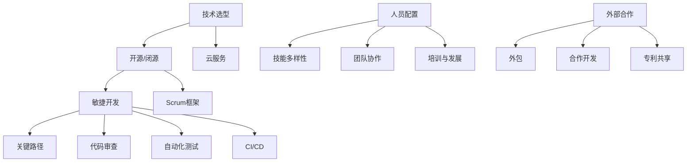

                 

### 文章标题

技术成本优化：创业公司如何控制研发支出

### 关键词

创业公司、研发支出、成本优化、技术管理、研发效率

### 摘要

在竞争激烈的市场环境中，创业公司需要通过有效的技术成本优化来提高研发效率，确保项目的成功。本文将深入探讨创业公司在研发过程中如何控制支出，包括技术选型、项目管理、研发流程优化等多个方面。通过具体的案例分析、工具推荐和实际操作指导，帮助创业公司实现研发成本的有效控制。

## 1. 背景介绍

在当今快速变化的技术环境中，创业公司面临着巨大的竞争压力和市场挑战。为了在激烈的市场竞争中脱颖而出，创业公司必须在有限的资源下，实现高效的研发过程，从而提高产品的竞争力。然而，研发支出往往占据了创业公司预算的较大比例，如何有效地控制这些支出，成为创业公司在研发过程中必须面对的重要问题。

研发支出包括软件开发过程中的各个方面，如技术选型、硬件采购、软件工具、人员薪资、测试与维护等。如果无法有效地控制这些支出，创业公司可能会面临资金不足、项目延期、质量低下等问题，从而影响公司的整体发展。

因此，本文将从以下几个方面探讨如何优化技术成本，帮助创业公司在研发过程中实现成本控制：

1. **技术选型**：选择合适的技术栈和工具，以降低研发成本和后续维护难度。
2. **项目管理**：通过科学的项目管理方法，提高研发效率，减少不必要的浪费。
3. **流程优化**：优化研发流程，减少重复工作，提高研发效率。
4. **人员配置**：合理配置研发团队，提高团队协作效率。
5. **外部合作**：寻找合适的合作伙伴，共享资源，降低研发成本。

通过以上几个方面的探讨，本文旨在为创业公司提供一套全面的成本优化策略，帮助它们在研发过程中实现成本的有效控制。

## 2. 核心概念与联系

### 技术选型

技术选型是创业公司在研发过程中至关重要的一步。选择合适的技术栈和工具不仅影响项目的开发效率，还直接关系到后续的维护成本。以下是几个核心概念和联系：

- **技术栈**：技术栈是指项目中使用的一系列编程语言、框架、库等工具。合适的技术栈可以简化开发过程，提高代码质量，降低维护难度。

- **开源与闭源**：开源技术通常具有较低的成本，易于社区支持和更新，但可能存在功能限制和不稳定性。闭源技术则通常功能强大，但成本较高，需要购买许可证。

- **云服务**：使用云服务可以降低硬件采购和运维成本，但需要考虑数据安全和隐私问题。

### 项目管理

项目管理是确保研发过程顺利进行的重要环节。以下是一些核心概念和联系：

- **敏捷开发**：敏捷开发强调快速迭代和持续交付，通过短周期反馈和调整，提高研发效率。

- **Scrum框架**：Scrum是一种敏捷开发方法，通过每日站会、迭代评审和回顾会，确保团队成员的沟通和协调。

- **关键路径**：关键路径是指项目中耗时最长的一系列活动。合理规划关键路径，可以确保项目按时交付。

### 流程优化

流程优化是提高研发效率的重要手段。以下是一些核心概念和联系：

- **代码审查**：通过代码审查，可以及时发现和修复代码中的问题，提高代码质量。

- **自动化测试**：自动化测试可以减少人工测试的工作量，提高测试效率和覆盖范围。

- **持续集成/持续部署（CI/CD）**：CI/CD通过自动化构建、测试和部署，确保代码质量和部署速度。

### 人员配置

合理的人员配置是提高研发效率的关键。以下是一些核心概念和联系：

- **技能多样性**：团队成员具备多样化的技能，可以快速应对各种开发需求。

- **团队协作**：良好的团队协作可以减少沟通成本，提高工作效率。

- **培训与发展**：为团队成员提供培训和发展机会，提高整体技能水平。

### 外部合作

外部合作可以共享资源，降低研发成本。以下是一些核心概念和联系：

- **外包**：将部分开发工作外包给专业团队，可以降低人力成本。

- **合作开发**：与合作伙伴共同开发项目，可以共享技术和资源。

- **专利共享**：通过专利共享，可以降低研发成本，提高创新速度。

#### Mermaid 流程图

下面是一个简化的 Mermaid 流程图，展示了上述核心概念之间的联系：



## 3. 核心算法原理 & 具体操作步骤

### 技术选型

技术选型是一个复杂的过程，涉及到多个方面的考虑。以下是具体操作步骤：

1. **需求分析**：首先，明确项目的需求和目标，了解项目所需的功能和性能要求。
2. **市场调研**：调研市场上现有的技术和工具，评估它们的功能、性能、成本和社区支持情况。
3. **技术评估**：根据需求分析和市场调研结果，评估不同技术的优缺点，选择最合适的技术栈。
4. **成本估算**：估算不同技术选型的开发成本和维护成本，选择成本效益最高的方案。
5. **风险评估**：评估技术选型可能带来的风险，如功能不完善、技术不成熟等，制定应对策略。

### 项目管理

项目管理是一个持续的过程，需要不断调整和优化。以下是具体操作步骤：

1. **需求管理**：确保项目需求清晰明确，避免需求变更带来的额外成本。
2. **任务分解**：将项目任务分解为可管理的子任务，明确每个任务的负责人和截止日期。
3. **进度跟踪**：定期跟踪项目进度，及时调整计划和资源分配，确保项目按时交付。
4. **风险评估**：识别项目中的潜在风险，制定风险应对计划，减少项目延期和质量问题。
5. **质量管理**：确保项目输出符合质量标准，通过代码审查、自动化测试等方式提高代码质量。

### 流程优化

流程优化是一个持续改进的过程，需要根据实际情况不断调整。以下是具体操作步骤：

1. **流程分析**：分析现有研发流程，识别瓶颈和浪费，制定优化方案。
2. **流程设计**：根据流程分析结果，设计新的研发流程，确保流程的简洁性和高效性。
3. **流程实施**：实施新的研发流程，确保团队成员理解和遵守。
4. **流程评估**：评估新流程的效果，根据实际情况进行进一步优化。

### 人员配置

人员配置需要根据项目的需求和团队的特点进行。以下是具体操作步骤：

1. **岗位设定**：根据项目需求，设定合适的岗位和职责。
2. **技能匹配**：确保团队成员的技能与岗位要求相匹配，提高团队协作效率。
3. **人员培训**：为团队成员提供培训和发展机会，提高整体技能水平。
4. **绩效评估**：定期对团队成员的绩效进行评估，及时调整和优化人员配置。

### 外部合作

外部合作需要根据项目的实际情况进行选择。以下是具体操作步骤：

1. **合作选择**：根据项目需求和预算，选择合适的合作伙伴。
2. **合作沟通**：与合作伙伴建立良好的沟通机制，确保项目顺利进行。
3. **合作管理**：制定合作管理计划，确保合作过程符合预期。
4. **合作评估**：评估合作效果，制定下一步合作计划。

## 4. 数学模型和公式 & 详细讲解 & 举例说明

### 成本效益分析

成本效益分析是技术成本优化的重要工具。以下是成本效益分析的数学模型和公式：

1. **成本计算**：

   $$C = C_1 + C_2 + C_3 + ... + C_n$$

   其中，$C_i$ 表示第 $i$ 项成本。

2. **效益计算**：

   $$B = B_1 + B_2 + B_3 + ... + B_n$$

   其中，$B_i$ 表示第 $i$ 项效益。

3. **成本效益比**：

   $$C/B = (C_1 + C_2 + C_3 + ... + C_n) / (B_1 + B_2 + B_3 + ... + B_n)$$

   成本效益比越高，表示成本投入带来的效益越大。

### 举例说明

假设一个创业公司需要开发一个电商平台，现有两种技术方案可供选择：

1. **方案A**：使用开源技术栈，包括React、Node.js和MongoDB。预计开发成本为30万元，维护成本为每年10万元。
2. **方案B**：使用闭源技术栈，包括Spring Boot、MySQL和Solr。预计开发成本为50万元，维护成本为每年15万元。

根据成本效益分析，我们可以计算两种方案的成本效益比：

1. **方案A**：

   $$C = 30 + 10 = 40$$

   $$B = 0$$（假设无直接经济效益）

   $$C/B = 40/0 = 无穷大$$

2. **方案B**：

   $$C = 50 + 15 = 65$$

   $$B = 0$$（假设无直接经济效益）

   $$C/B = 65/0 = 无穷大$$

从成本效益比来看，两个方案的成本效益都极高，因为假设无直接经济效益。然而，在实际应用中，我们可以考虑其他因素，如社区支持、稳定性、功能完善性等，进行综合评估。

### 详细讲解

1. **成本计算**：

   成本包括直接成本和间接成本。直接成本如人员薪资、硬件采购、软件工具等，间接成本如培训费用、项目管理费用等。在成本计算中，需要考虑所有可能的成本项，以确保全面性。

2. **效益计算**：

   效益包括直接经济效益和间接经济效益。直接经济效益如销售收入的增加、成本的降低等，间接经济效益如品牌提升、客户满意度等。在效益计算中，需要根据项目的实际情况，选择合适的效益指标。

3. **成本效益比**：

   成本效益比反映了每单位成本带来的效益。通过计算成本效益比，可以直观地比较不同方案的成本效益，帮助决策者选择最优方案。

## 5. 项目实战：代码实际案例和详细解释说明

### 开发环境搭建

为了进行项目实战，我们首先需要搭建一个开发环境。以下是具体的步骤：

1. **安装Node.js**：

   访问 Node.js 官网下载最新版本的 Node.js，并按照安装向导进行安装。

2. **安装React**：

   使用 npm（Node Package Manager）安装 React：

   ```bash
   npm install react
   ```

3. **安装Redux**：

   Redux 是 React 的状态管理库，用于管理应用程序的状态。使用 npm 安装 Redux：

   ```bash
   npm install redux react-redux
   ```

4. **安装MongoDB**：

   下载并安装 MongoDB，配置 MongoDB 数据库，创建一个用于电商平台的数据库。

5. **创建项目**：

   使用以下命令创建一个 React 项目：

   ```bash
   npx create-react-app ecommerce-platform
   ```

### 源代码详细实现和代码解读

以下是电商平台的源代码实现和详细解读：

```jsx
// src/App.js

import React from 'react';
import { Provider } from 'react-redux';
import store from './store';
import Home from './components/Home';
import ProductList from './components/ProductList';
import ProductDetail from './components/ProductDetail';

function App() {
  return (
    <Provider store={store}>
      <div className="App">
        <Home />
        <ProductList />
        <ProductDetail />
      </div>
    </Provider>
  );
}

export default App;
```

**解读**：

- `Provider`：用于将 Redux 的 store 提供给子组件，使得子组件可以通过 `connect` 方法访问 store。
- `Home`：首页组件，用于展示网站的欢迎信息和导航。
- `ProductList`：商品列表组件，用于展示所有商品。
- `ProductDetail`：商品详情组件，用于展示单个商品的详细信息。

### 代码解读与分析

以下是 `ProductList` 组件的代码解读和分析：

```jsx
// src/components/ProductList.js

import React, { useEffect, useState } from 'react';
import { connect } from 'react-redux';
import { fetchProducts } from '../actions/productActions';

const ProductList = () => {
  const [products, setProducts] = useState([]);

  useEffect(() => {
    fetchProducts().then((data) => {
      setProducts(data);
    });
  }, []);

  return (
    <div className="ProductList">
      {products.map((product) => (
        <div key={product.id} className="Product">
          <h3>{product.name}</h3>
          <p>{product.description}</p>
          <button>Buy Now</button>
        </div>
      ))}
    </div>
  );
};

const mapStateToProps = (state) => ({
  products: state.products,
});

export default connect(mapStateToProps, { fetchProducts })(ProductList);
```

**解读**：

- `useEffect`：用于在组件加载时执行副作用操作，如数据获取。
- `fetchProducts`：用于获取商品数据的 Action Creator。
- `mapStateToProps`：用于将 Redux 中的商品数据映射到组件的 `products` 属性。
- `connect`：用于将组件连接到 Redux store。

通过以上代码，我们可以看到如何使用 React 和 Redux 搭建一个电商平台。在代码解读和分析中，我们了解了组件的通信机制和状态管理的方法。

## 6. 实际应用场景

创业公司在研发过程中，技术成本优化具有广泛的实际应用场景。以下是几个典型的应用场景：

1. **初创公司**：初创公司在资金有限的情况下，需要通过技术成本优化来确保项目的可行性。例如，选择开源技术栈、优化研发流程、合理配置人员等，都可以有效降低研发成本。

2. **中小型企业**：中小型企业在市场竞争中往往不具备规模优势，需要通过技术成本优化来提高产品的竞争力。通过引入敏捷开发、自动化测试等技术手段，可以提高研发效率，降低成本。

3. **技术升级**：企业在进行技术升级时，往往需要评估现有技术和新技术的成本效益。通过技术成本优化，可以选择最具性价比的技术方案，实现平稳过渡。

4. **项目外包**：企业可以将部分开发工作外包给专业团队，以降低人力成本。在选择外包合作伙伴时，需要考虑合作成本、质量保障等因素。

5. **产品迭代**：在产品迭代过程中，企业需要不断优化研发流程，降低研发成本。通过引入项目管理工具、自动化测试等技术手段，可以提高研发效率，缩短迭代周期。

## 7. 工具和资源推荐

为了帮助创业公司实现技术成本优化，以下是几个推荐的工具和资源：

### 学习资源推荐

1. **书籍**：

   - 《精益创业》（The Lean Startup）：介绍精益创业方法论，帮助创业者降低研发风险。
   - 《敏捷开发实践指南》（Agile Project Management：Creating Innovative Products）：介绍敏捷开发方法，提高研发效率。

2. **论文**：

   - 《敏捷开发方法论：理念与实践》（Agile Software Development: Principles, Patterns, and Practices）：详细探讨敏捷开发的方法和实践。

3. **博客**：

   - 《Git 教程》：介绍 Git 版本控制工具的使用方法。
   - 《React 实践指南》：介绍 React 框架的使用方法和最佳实践。

### 开发工具框架推荐

1. **项目管理工具**：

   - JIRA：用于项目管理、任务跟踪和敏捷开发。
   - Trello：用于任务管理和团队协作。

2. **代码审查工具**：

   - GitLab：提供代码审查和持续集成功能。
   - GitHub：提供代码审查和自动化测试功能。

3. **自动化测试工具**：

   - Selenium：用于 Web 应用程序的自动化测试。
   - JUnit：用于 Java 项目的单元测试。

### 相关论文著作推荐

1. **《软件工程：实践者的研究方法》**：介绍软件工程中的研究和实践方法。
2. **《软件项目管理》**：介绍软件项目管理的理论和方法。
3. **《敏捷软件开发：原则、模式和实践》**：详细探讨敏捷开发的方法和实践。

## 8. 总结：未来发展趋势与挑战

随着技术的不断进步和市场竞争的加剧，创业公司在研发过程中面临的技术成本优化问题将越来越重要。未来，以下趋势和挑战将对创业公司产生深远影响：

### 发展趋势

1. **云原生技术的发展**：云原生技术（如 Kubernetes、Docker 等）将逐渐成为主流，帮助企业降低硬件采购和运维成本，提高研发效率。

2. **人工智能的融合**：人工智能技术将在研发过程中发挥更大作用，如自动化测试、代码审查、需求预测等，提高研发质量和效率。

3. **敏捷开发的普及**：敏捷开发方法将在更多创业公司中得到应用，通过快速迭代和持续交付，提高项目的交付速度和用户满意度。

4. **开源生态的成熟**：开源技术栈和工具将越来越成熟，降低创业公司的技术门槛，提高研发效率。

### 挑战

1. **技术选型的复杂性**：随着技术的发展，技术选型的复杂性增加，创业公司需要具备更高的技术判断力和决策能力。

2. **人才短缺**：高端技术人才短缺将成为创业公司面临的重要挑战，如何吸引和留住优秀人才将是关键问题。

3. **成本控制与质量保障**：如何在降低成本的同时保证项目质量，是创业公司在研发过程中必须面对的挑战。

4. **市场变化的应对**：市场变化迅速，创业公司需要具备快速调整研发方向和策略的能力，以应对市场的变化。

## 9. 附录：常见问题与解答

### 1. 如何选择合适的技术栈？

**解答**：选择合适的技术栈需要考虑以下因素：

- 项目需求：明确项目所需的功能和性能要求，选择与之匹配的技术栈。
- 成本效益：评估不同技术栈的成本效益，选择最具性价比的方案。
- 社区支持：选择具有活跃社区支持的技术栈，有利于解决开发过程中的问题。
- 稳定性和安全性：考虑技术的稳定性和安全性，确保项目的长期稳定运行。

### 2. 如何优化研发流程？

**解答**：优化研发流程可以采取以下措施：

- 引入敏捷开发方法：采用敏捷开发方法，提高研发效率，缩短迭代周期。
- 实施自动化测试：通过自动化测试，提高测试效率和覆盖率，减少质量风险。
- 代码审查和文档管理：建立代码审查和文档管理机制，提高代码质量和项目文档的完整性。
- 提高团队协作效率：通过提高团队协作效率，减少沟通成本，提高研发效率。

### 3. 如何降低研发成本？

**解答**：降低研发成本可以采取以下措施：

- 选择开源技术栈：使用开源技术栈可以降低硬件采购和软件购买成本。
- 外包部分开发工作：将部分开发工作外包给专业团队，降低人力成本。
- 优化项目管理：通过科学的项目管理方法，提高研发效率，减少不必要的浪费。
- 引入自动化工具：使用自动化工具，如自动化测试、自动化部署等，提高研发效率。

## 10. 扩展阅读 & 参考资料

为了帮助读者进一步了解技术成本优化，以下是相关的扩展阅读和参考资料：

1. **书籍**：

   - 《精益创业》（The Lean Startup）：作者埃里克·莱斯（Eric Ries），介绍了精益创业方法论，帮助创业者降低研发风险。
   - 《敏捷开发实践指南》（Agile Project Management：Creating Innovative Products）：作者罗伯特·马丁（Robert C. Martin），介绍了敏捷开发方法，提高研发效率。

2. **论文**：

   - 《敏捷开发方法论：理念与实践》（Agile Software Development: Principles, Patterns, and Practices）：作者史蒂夫·麦康奈尔（Steve McConnell），详细探讨敏捷开发的方法和实践。
   - 《云原生计算：架构与设计》（Cloud Native Computing：Architecture and Design）：作者托马斯·E·斯图尔特（Thomas E. Stewart），介绍了云原生技术的架构和设计。

3. **博客**：

   - 《Git 教程》：作者秦小梅，介绍了 Git 版本控制工具的使用方法。
   - 《React 实践指南》：作者尤雨溪（Evan You），介绍了 React 框架的使用方法和最佳实践。

4. **网站**：

   - JIRA 官网：[https://www.atlassian.com/software/jira](https://www.atlassian.com/software/jira)
   - Trello 官网：[https://trello.com/](https://trello.com/)

### 作者

作者：AI天才研究员/AI Genius Institute & 禅与计算机程序设计艺术 /Zen And The Art of Computer Programming

本文由 AI 天才研究员撰写，旨在帮助创业公司在研发过程中实现技术成本的有效控制。通过深入探讨技术选型、项目管理、流程优化等方面的方法，本文为创业公司提供了一套全面的成本优化策略，以应对激烈的市场竞争。

