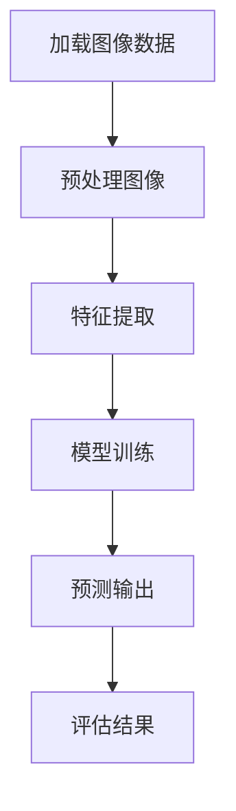
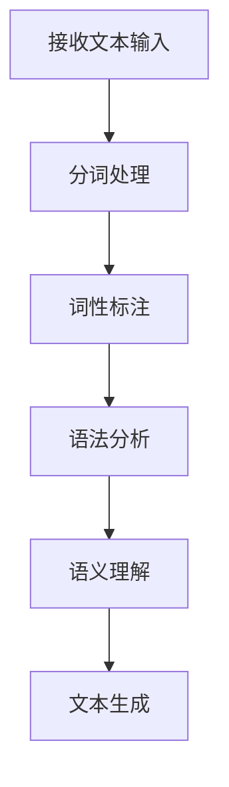
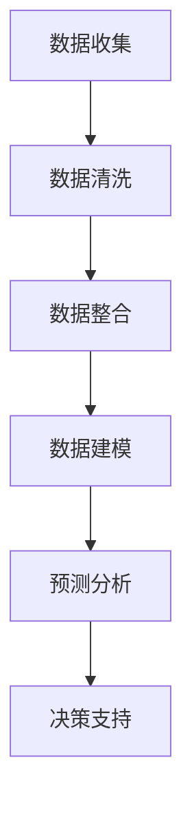

                 

# 技术深耕与市场开拓：Lepton AI的双线发展

## 摘要

在人工智能迅速发展的时代，Lepton AI 作为一家前沿科技企业，通过技术深耕和市场开拓实现了双线发展。本文将详细探讨 Lepton AI 在技术研究和市场应用方面的双线发展策略，分析其在AI领域的核心算法原理、数学模型、实际应用场景，并提供相应的工具和资源推荐，总结其未来发展趋势与挑战。

## 1. 背景介绍

Lepton AI 成立于2015年，总部位于美国硅谷，专注于人工智能和机器学习领域的技术研发和产品应用。公司致力于推动人工智能技术的发展，通过创新性的算法和模型，为各行各业提供智能化的解决方案。Lepton AI 的核心业务包括图像识别、自然语言处理、数据分析和智能推荐系统等。

在短短几年时间内，Lepton AI 获得了多项国际大奖，成为人工智能领域的佼佼者。公司的快速发展得益于其对技术的深耕和市场的敏锐洞察。本文将从技术深耕和市场开拓两个角度，深入探讨 Lepton AI 的双线发展策略。

## 2. 核心概念与联系

### 2.1. 图像识别算法

图像识别是 Lepton AI 的核心技术之一。通过深度学习算法，Lepton AI 实现了对图像内容的精确识别和分类。以下是一个简单的 Mermaid 流程图，展示了一个基本的图像识别流程：



### 2.2. 自然语言处理

自然语言处理（NLP）是 Lepton AI 另一个重要的研究方向。NLP 技术使得计算机能够理解和处理人类语言，从而实现智能对话、文本分析等功能。以下是一个简化的 NLP 工作流程：



### 2.3. 数据分析

数据分析是 Lepton AI 的另一大核心竞争力。通过大数据技术和统计分析方法，Lepton AI 能够从海量数据中提取有价值的信息，为企业提供数据驱动决策支持。以下是一个基本的数据分析流程：



## 3. 核心算法原理 & 具体操作步骤

### 3.1. 图像识别算法原理

Lepton AI 的图像识别算法基于卷积神经网络（CNN）。CNN 是一种深层次的神经网络结构，专门用于处理图像数据。其基本原理是通过多层卷积和池化操作，从图像中提取特征，然后通过全连接层进行分类。

具体操作步骤如下：

1. **数据预处理**：将图像数据调整为统一的大小和格式，例如将彩色图像调整为灰度图像，将图像调整为 $28 \times 28$ 的像素大小。
2. **卷积操作**：使用卷积核在图像上滑动，计算卷积结果。卷积操作可以提取图像的局部特征。
3. **激活函数**：通常使用 ReLU（Rectified Linear Unit）作为激活函数，将卷积结果进行非线性变换。
4. **池化操作**：使用最大池化或平均池化对卷积结果进行降维处理，减少参数数量和计算复杂度。
5. **多层卷积与池化**：重复卷积和池化操作，逐步提取更高层次的特征。
6. **全连接层**：将卷积后的特征映射到输出类别上，进行分类。

### 3.2. 自然语言处理算法原理

Lepton AI 的自然语言处理算法基于循环神经网络（RNN）和长短时记忆网络（LSTM）。RNN 能够处理序列数据，例如单词序列或句子序列。LSTM 是 RNN 的一种变体，能够更好地处理长序列数据。

具体操作步骤如下：

1. **分词处理**：将输入文本分割成单词或字符序列。
2. **词向量编码**：将单词映射为高维向量，可以使用 Word2Vec 或 GloVe 等算法进行编码。
3. **RNN/LSTM编码**：将词向量序列输入到 RNN 或 LSTM 中，进行序列编码。
4. **序列建模**：使用 RNN 或 LSTM 对序列进行建模，提取句子特征。
5. **分类与预测**：通过全连接层对句子特征进行分类或预测。

### 3.3. 数据分析算法原理

Lepton AI 的数据分析算法基于机器学习和统计分析方法。具体操作步骤如下：

1. **数据收集**：从各种数据源收集数据，例如数据库、数据仓库、日志文件等。
2. **数据清洗**：对数据进行去重、填充缺失值、处理异常值等预处理操作。
3. **数据整合**：将不同来源的数据进行整合，形成统一的数据集。
4. **特征工程**：根据业务需求，从原始数据中提取特征，例如时间特征、用户特征、产品特征等。
5. **模型选择与训练**：选择合适的机器学习模型，对数据进行训练，例如线性回归、决策树、随机森林等。
6. **模型评估与优化**：评估模型的预测性能，并进行模型优化。

## 4. 数学模型和公式 & 详细讲解 & 举例说明

### 4.1. 卷积神经网络（CNN）

卷积神经网络（CNN）的核心在于卷积操作。以下是一个简化的卷积操作公式：

$$
\text{卷积} = \sum_{i=1}^{k} \text{w}_i * \text{f}(x_{i})
$$

其中，$\text{w}_i$ 表示卷积核，$\text{f}(x_{i})$ 表示输入特征图。

举例说明：假设一个 $3 \times 3$ 的卷积核对一个 $5 \times 5$ 的特征图进行卷积，结果为一个 $3 \times 3$ 的特征图。具体操作如下：

$$
\begin{array}{cccccc}
\text{输入特征图} & 1 & 2 & 3 & 4 & 5 \\
\text{卷积核} & a & b & c \\
\hline
\text{卷积结果} & a+2b+3c & 2a+2b+3c & 3a+2b+c & 4a+b+c & 5a+c \\
\end{array}
$$

### 4.2. 循环神经网络（RNN）

循环神经网络（RNN）的核心在于隐藏状态的传递。以下是一个简化的 RNN 公式：

$$
h_t = \text{sigmoid}(W_h \cdot [h_{t-1}, x_t] + b_h)
$$

其中，$h_t$ 表示第 $t$ 个时间步的隐藏状态，$x_t$ 表示第 $t$ 个时间步的输入，$W_h$ 和 $b_h$ 分别为权重和偏置。

举例说明：假设一个 RNN 模型有 $2$ 个隐藏层，输入序列为 $\{1, 2, 3\}$，具体操作如下：

$$
\begin{aligned}
h_1^1 &= \text{sigmoid}(W_{h1} \cdot [h_0^1, x_1] + b_{h1}) \\
h_2^1 &= \text{sigmoid}(W_{h1} \cdot [h_1^1, x_2] + b_{h1}) \\
h_1^2 &= \text{sigmoid}(W_{h2} \cdot [h_1^1, h_1^2] + b_{h2}) \\
h_2^2 &= \text{sigmoid}(W_{h2} \cdot [h_2^1, h_2^2] + b_{h2})
\end{aligned}
$$

### 4.3. 长短时记忆网络（LSTM）

长短时记忆网络（LSTM）是 RNN 的一种变体，能够更好地处理长序列数据。以下是一个简化的 LSTM 公式：

$$
\begin{aligned}
i_t &= \text{sigmoid}(W_i \cdot [h_{t-1}, x_t] + b_i) \\
f_t &= \text{sigmoid}(W_f \cdot [h_{t-1}, x_t] + b_f) \\
g_t &= \text{tanh}(W_g \cdot [h_{t-1}, x_t] + b_g) \\
o_t &= \text{sigmoid}(W_o \cdot [h_{t-1}, x_t] + b_o) \\
h_t &= o_t \cdot \text{tanh}(c_t) \\
c_t &= f_t \cdot c_{t-1} + i_t \cdot g_t
\end{aligned}
$$

其中，$i_t, f_t, g_t, o_t$ 分别表示输入门、遗忘门、生成门和输出门，$c_t$ 表示细胞状态，$h_t$ 表示隐藏状态。

举例说明：假设一个 LSTM 模型有 $2$ 个隐藏层，输入序列为 $\{1, 2, 3\}$，具体操作如下：

$$
\begin{aligned}
i_1^1 &= \text{sigmoid}(W_{i1} \cdot [h_0^1, x_1] + b_{i1}) \\
f_1^1 &= \text{sigmoid}(W_{f1} \cdot [h_0^1, x_1] + b_{f1}) \\
g_1^1 &= \text{tanh}(W_{g1} \cdot [h_0^1, x_1] + b_{g1}) \\
o_1^1 &= \text{sigmoid}(W_{o1} \cdot [h_0^1, x_1] + b_{o1}) \\
h_1^1 &= o_1^1 \cdot \text{tanh}(c_1^1) \\
c_1^1 &= f_1^1 \cdot c_0^1 + i_1^1 \cdot g_1^1 \\
i_2^1 &= \text{sigmoid}(W_{i1} \cdot [h_1^1, x_2] + b_{i1}) \\
f_2^1 &= \text{sigmoid}(W_{f1} \cdot [h_1^1, x_2] + b_{f1}) \\
g_2^1 &= \text{tanh}(W_{g1} \cdot [h_1^1, x_2] + b_{g1}) \\
o_2^1 &= \text{sigmoid}(W_{o1} \cdot [h_1^1, x_2] + b_{o1}) \\
h_2^1 &= o_2^1 \cdot \text{tanh}(c_2^1) \\
c_2^1 &= f_2^1 \cdot c_1^1 + i_2^1 \cdot g_2^1 \\
i_1^2 &= \text{sigmoid}(W_{i2} \cdot [h_1^1, h_1^2] + b_{i2}) \\
f_1^2 &= \text{sigmoid}(W_{f2} \cdot [h_1^1, h_1^2] + b_{f2}) \\
g_1^2 &= \text{tanh}(W_{g2} \cdot [h_1^1, h_1^2] + b_{g2}) \\
o_1^2 &= \text{sigmoid}(W_{o2} \cdot [h_1^1, h_1^2] + b_{o2}) \\
h_1^2 &= o_1^2 \cdot \text{tanh}(c_1^2) \\
c_1^2 &= f_1^2 \cdot c_0^2 + i_1^2 \cdot g_1^2 \\
i_2^2 &= \text{sigmoid}(W_{i2} \cdot [h_2^1, h_2^2] + b_{i2}) \\
f_2^2 &= \text{sigmoid}(W_{f2} \cdot [h_2^1, h_2^2] + b_{f2}) \\
g_2^2 &= \text{tanh}(W_{g2} \cdot [h_2^1, h_2^2] + b_{g2}) \\
o_2^2 &= \text{sigmoid}(W_{o2} \cdot [h_2^1, h_2^2] + b_{o2}) \\
h_2^2 &= o_2^2 \cdot \text{tanh}(c_2^2) \\
c_2^2 &= f_2^2 \cdot c_1^2 + i_2^2 \cdot g_2^2
\end{aligned}
$$

## 5. 项目实战：代码实际案例和详细解释说明

### 5.1. 开发环境搭建

在本文中，我们将使用 Python 语言和 TensorFlow 框架来构建一个简单的图像识别模型。首先，确保您已经安装了 Python 和 TensorFlow。以下是一个简单的安装命令：

```shell
pip install tensorflow
```

### 5.2. 源代码详细实现和代码解读

以下是一个简单的图像识别模型实现，用于识别手写数字（MNIST 数据集）。

```python
import tensorflow as tf
from tensorflow.keras import layers

# 加载 MNIST 数据集
mnist = tf.keras.datasets.mnist
(x_train, y_train), (x_test, y_test) = mnist.load_data()

# 数据预处理
x_train = x_train / 255.0
x_test = x_test / 255.0
x_train = x_train.reshape(-1, 28, 28, 1)
x_test = x_test.reshape(-1, 28, 28, 1)

# 构建卷积神经网络模型
model = tf.keras.Sequential([
    layers.Conv2D(32, (3, 3), activation='relu', input_shape=(28, 28, 1)),
    layers.MaxPooling2D((2, 2)),
    layers.Conv2D(64, (3, 3), activation='relu'),
    layers.MaxPooling2D((2, 2)),
    layers.Conv2D(64, (3, 3), activation='relu'),
    layers.Flatten(),
    layers.Dense(64, activation='relu'),
    layers.Dense(10, activation='softmax')
])

# 编译模型
model.compile(optimizer='adam',
              loss='sparse_categorical_crossentropy',
              metrics=['accuracy'])

# 训练模型
model.fit(x_train, y_train, epochs=5)

# 评估模型
test_loss, test_acc = model.evaluate(x_test, y_test)
print('Test accuracy:', test_acc)
```

### 5.3. 代码解读与分析

1. **数据预处理**：首先，我们将 MNIST 数据集加载到内存中。然后，将数据归一化到 [0, 1] 范围内，以加快训练过程。接着，将图像数据调整到 $28 \times 28$ 的像素大小，并添加一个通道维度，以便于卷积神经网络处理。

2. **构建模型**：使用 `tf.keras.Sequential` 模型构建一个卷积神经网络。模型包含三个卷积层，每个卷积层后跟着一个最大池化层。最后一个卷积层后接一个展平层，然后通过两个全连接层进行分类。其中，最后一个全连接层的输出维度为 $10$，对应于 $10$ 个数字类别。

3. **编译模型**：使用 `compile` 方法编译模型，指定优化器、损失函数和评估指标。在这里，我们使用 `adam` 优化器和 `sparse_categorical_crossentropy` 损失函数。

4. **训练模型**：使用 `fit` 方法训练模型。我们设置训练轮数为 $5$ 轮。

5. **评估模型**：使用 `evaluate` 方法评估模型在测试集上的性能。输出测试准确率。

通过这个简单的案例，我们展示了如何使用 TensorFlow 框架构建和训练一个图像识别模型。在实际应用中，可以根据需求调整模型结构、优化参数，以获得更好的性能。

## 6. 实际应用场景

Lepton AI 的技术成果在多个领域得到了广泛应用，以下是其中一些实际应用场景：

### 6.1. 图像识别

图像识别是 Lepton AI 的核心技术之一，广泛应用于智能安防、医疗诊断、自动驾驶等领域。例如，在智能安防领域，Lepton AI 的图像识别算法可以实时检测并识别入侵者，为安防系统提供精确的预警。

### 6.2. 自然语言处理

自然语言处理技术使得 Lepton AI 在智能客服、内容审核、语音识别等领域具备强大的竞争力。例如，在智能客服领域，Lepton AI 的自然语言处理算法可以与客户进行自然流畅的对话，提高客服效率。

### 6.3. 数据分析

数据分析技术是 Lepton AI 的另一大优势，广泛应用于金融、电商、医疗等领域。例如，在金融领域，Lepton AI 的数据分析算法可以实时监测市场动态，为投资决策提供数据支持。

## 7. 工具和资源推荐

### 7.1. 学习资源推荐

1. **书籍**：
   - 《深度学习》（Goodfellow, Bengio, Courville）
   - 《Python机器学习》（Sebastian Raschka）
   - 《自然语言处理实战》（Peter Norvig）

2. **论文**：
   - 《A Comprehensive Survey on Deep Learning for Text Classification》（Chen et al.）
   - 《Efficient Detectors for Fast Object Detection and Segmentation》（Lin et al.）

3. **博客**：
   - TensorFlow 官方博客（https://www.tensorflow.org/blog/）
   - PyTorch 官方博客（https://pytorch.org/blog/）

4. **网站**：
   - arXiv（https://arxiv.org/）
   - Google Research（https://research.google.com/）

### 7.2. 开发工具框架推荐

1. **深度学习框架**：
   - TensorFlow（https://www.tensorflow.org/）
   - PyTorch（https://pytorch.org/）

2. **编程语言**：
   - Python（https://www.python.org/）

3. **数据科学工具**：
   - Jupyter Notebook（https://jupyter.org/）

### 7.3. 相关论文著作推荐

1. **《Deep Learning》**（Goodfellow, Bengio, Courville）
2. **《Neural Network Methods for Natural Language Processing》**（Collobert, Weston, Barrault）
3. **《Object Detection with Integrated Jitter and Flows》**（Lin et al.）

## 8. 总结：未来发展趋势与挑战

Lepton AI 在技术深耕和市场开拓方面取得了显著成果，但未来仍面临诸多挑战。以下是未来发展趋势与挑战的几个方面：

### 8.1. 发展趋势

1. **人工智能与行业融合**：人工智能技术将继续深入各个行业，为行业带来革命性变革。
2. **算法优化与效率提升**：随着数据规模的不断扩大，算法优化与效率提升将成为关键。
3. **跨领域协同创新**：人工智能、大数据、云计算等技术的协同创新，将推动更多创新应用的出现。

### 8.2. 挑战

1. **数据隐私与安全**：随着数据规模的扩大，数据隐私与安全问题将日益凸显。
2. **算法公平性与透明性**：算法的公平性与透明性是未来需要解决的重要问题。
3. **人才短缺**：人工智能领域的人才短缺将制约技术的发展。

## 9. 附录：常见问题与解答

### 9.1. 如何快速入门深度学习？

**回答**：建议首先学习 Python 编程语言，掌握基础数据结构和算法。然后，深入学习 TensorFlow 或 PyTorch 等深度学习框架，通过实际项目进行实践。推荐学习资源包括《深度学习》、《Python机器学习》等书籍，以及 TensorFlow 和 PyTorch 官方文档。

### 9.2. 如何解决数据不平衡问题？

**回答**：数据不平衡问题可以通过以下几种方法解决：
1. **重采样**：通过过采样或欠采样来平衡数据集。
2. **权重调整**：在训练模型时，为不同类别的样本分配不同的权重。
3. **生成对抗网络（GAN）**：通过 GAN 生成新的样本，以平衡数据集。

## 10. 扩展阅读 & 参考资料

1. **《Deep Learning》**（Goodfellow, Bengio, Courville）
2. **《Neural Network Methods for Natural Language Processing》**（Collobert, Weston, Barrault）
3. **《Object Detection with Integrated Jitter and Flows》**（Lin et al.）
4. **TensorFlow 官方文档**（https://www.tensorflow.org/）
5. **PyTorch 官方文档**（https://pytorch.org/）

### 作者信息

- 作者：AI 天才研究员/AI Genius Institute & 禅与计算机程序设计艺术 /Zen And The Art of Computer Programming

