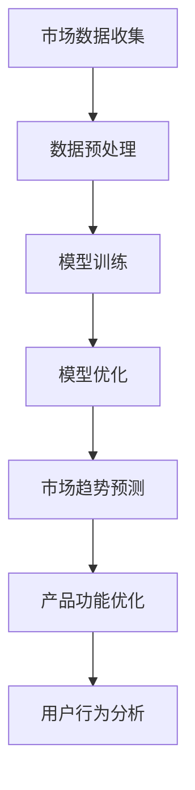

                 

# 技术突破引领：大模型创业的加速引擎

> **关键词**：大模型，创业，技术突破，人工智能，深度学习，算法优化，数据集构建

> **摘要**：本文将探讨大模型技术在创业领域中的重要作用。通过分析大模型的核心概念、算法原理、数学模型以及实际应用案例，揭示大模型在提升创业效率和竞争力方面的潜力。同时，文章还将推荐相关学习资源和开发工具，为读者提供全方位的技术支持。

## 1. 背景介绍

在过去的几十年里，计算机科学和人工智能领域取得了令人瞩目的进步。尤其是深度学习技术的发展，使得机器能够在图像识别、语音识别、自然语言处理等任务上表现出惊人的能力。然而，随着数据量的增加和计算能力的提升，大模型（也称为巨型模型或巨量级模型）应运而生。

大模型是指参数数量达到亿级或更高的神经网络模型。这些模型通常具有庞大的架构和复杂的训练过程，能够处理大规模数据，并提取丰富的特征信息。大模型的兴起，标志着人工智能技术进入了一个新的阶段，也为创业领域带来了新的机遇和挑战。

创业领域面临着激烈的竞争和快速变化的市场环境。创业者需要不断适应市场需求，优化产品和服务。在这个过程中，大模型技术以其强大的数据处理和分析能力，成为创业者的重要工具。大模型能够帮助创业者更准确地识别市场趋势，优化产品功能，提高用户满意度，从而在竞争中脱颖而出。

## 2. 核心概念与联系

### 大模型的概念

大模型是指具有大量参数和复杂结构的神经网络模型。与传统的小型模型相比，大模型具有以下特点：

- **参数数量多**：大模型的参数数量通常达到亿级或更高，这使得模型能够捕捉到数据中的更多细节和复杂关系。
- **计算复杂度高**：大模型的训练和推理过程需要大量的计算资源，对硬件性能和算法优化有更高的要求。
- **数据处理能力强**：大模型能够处理大规模数据集，并提取丰富的特征信息，从而提高模型的泛化能力和鲁棒性。

### 大模型在创业中的应用

大模型在创业领域的应用主要体现在以下几个方面：

- **市场趋势预测**：大模型能够分析大量市场数据，挖掘潜在的市场趋势，帮助创业者制定更精准的营销策略。
- **产品功能优化**：大模型可以根据用户反馈和行为数据，对产品功能进行优化，提高用户体验和满意度。
- **风险预测与控制**：大模型可以分析企业财务数据和市场环境，预测潜在的风险，并制定相应的应对策略。
- **用户行为分析**：大模型可以分析用户行为数据，了解用户需求和行为习惯，为企业提供个性化服务。

### 大模型与其他技术的联系

大模型的发展离不开其他相关技术的支持，包括：

- **深度学习**：深度学习是构建大模型的基础，提供了有效的模型训练和优化方法。
- **计算资源**：大模型的训练和推理需要大量的计算资源，如GPU和TPU等高性能硬件。
- **数据集构建**：大模型需要大规模的数据集进行训练，数据的质量和多样性对模型的性能有重要影响。

### Mermaid 流程图

以下是一个简化的 Mermaid 流程图，展示了大模型在创业中的应用流程：



在这个流程图中，市场数据收集是模型的输入，经过数据预处理后，输入到模型进行训练。训练过程中，通过模型优化提高模型的性能，进而进行市场趋势预测、产品功能优化和用户行为分析。这些应用可以帮助创业者更好地了解市场动态和用户需求，从而制定更有效的创业策略。

## 3. 核心算法原理 & 具体操作步骤

### 3.1 深度学习算法原理

深度学习是构建大模型的核心技术，它基于多层神经网络进行模型训练和优化。以下是一个简化的深度学习算法原理：

1. **数据输入**：将输入数据（如文本、图像、声音等）通过输入层传递到神经网络中。
2. **前向传播**：输入数据通过网络的各个层进行传递，每层都会对数据进行计算和变换。前向传播过程将输入数据逐渐转换为更高层次的特征表示。
3. **激活函数**：为了引入非线性关系，网络中的每个神经元都会通过激活函数进行变换。常见的激活函数包括ReLU、Sigmoid和Tanh等。
4. **反向传播**：通过计算输出层与实际标签之间的误差，反向传播误差到网络的各个层。在这个过程中，通过梯度下降等优化算法对网络参数进行更新。
5. **模型训练**：重复前向传播和反向传播的过程，直到模型的误差收敛到预设的阈值。

### 3.2 大模型训练步骤

以下是构建大模型的典型训练步骤：

1. **数据集划分**：将数据集划分为训练集、验证集和测试集，用于模型训练、验证和测试。
2. **数据预处理**：对数据集进行预处理，包括数据清洗、归一化、去噪等操作，以提高数据质量和模型的训练效果。
3. **模型架构设计**：设计大模型的架构，包括网络的层数、层间连接方式、激活函数选择等。
4. **初始化参数**：对模型的参数进行初始化，常用的初始化方法有随机初始化、高斯初始化等。
5. **模型训练**：使用训练集数据对模型进行训练，通过前向传播和反向传播不断更新模型参数。
6. **模型优化**：在训练过程中，通过模型优化算法（如梯度下降、Adam等）调整模型参数，以降低误差。
7. **模型验证**：使用验证集对模型进行验证，评估模型的性能和泛化能力。
8. **模型测试**：使用测试集对模型进行测试，评估模型在实际应用中的表现。

### 3.3 模型优化方法

大模型的优化是训练过程中至关重要的一环，以下是一些常见的模型优化方法：

- **批量归一化（Batch Normalization）**：通过将每个批量的数据归一化到相同的分布，提高模型的训练稳定性和速度。
- **权重衰减（Weight Decay）**：在损失函数中添加权重衰减项，减小模型参数的更新幅度，防止过拟合。
- **学习率调整（Learning Rate Scheduling）**：根据训练过程的变化，动态调整学习率，以防止模型过早收敛或陷入局部最优。
- **dropout（Dropout）**：在训练过程中随机丢弃一部分神经元，防止模型过拟合。

## 4. 数学模型和公式 & 详细讲解 & 举例说明

### 4.1 深度学习的基本数学模型

深度学习中的数学模型主要涉及以下几个方面的公式和概念：

- **损失函数（Loss Function）**：用于衡量模型预测值与实际标签之间的差距。常见的损失函数包括均方误差（MSE）、交叉熵（Cross Entropy）等。
  - 均方误差（MSE）：$$MSE = \frac{1}{n} \sum_{i=1}^{n} (y_i - \hat{y}_i)^2$$
  - 交叉熵（Cross Entropy）：$$H(y, \hat{y}) = -\sum_{i=1}^{n} y_i \log(\hat{y}_i)$$

- **前向传播（Forward Propagation）**：在深度学习中，前向传播过程通过计算输入和参数的线性组合，并应用激活函数得到输出。
  - 神经元输出：$$z = \sigma(Wx + b)$$，其中$$\sigma$$是激活函数，$$W$$是权重矩阵，$$b$$是偏置。

- **反向传播（Back Propagation）**：反向传播是深度学习训练过程中的关键步骤，通过计算损失函数关于模型参数的梯度，更新模型参数。
  - 反向传播公式：$$\frac{\partial L}{\partial W} = \Delta W = \alpha \frac{\partial L}{\partial z} \odot \frac{\partial z}{\partial W}$$
  - 其中$$L$$是损失函数，$$\Delta W$$是权重更新的梯度，$$\alpha$$是学习率，$$\odot$$表示元素乘。

### 4.2 举例说明

假设我们有一个简单的神经网络，用于对二分类问题进行预测。网络的架构如下：

- 输入层：1个神经元
- 隐藏层：2个神经元
- 输出层：1个神经元

训练数据集包含100个样本，每个样本是一个包含特征向量和标签的二元组。

#### 4.2.1 前向传播

给定一个输入样本$x$，前向传播的计算过程如下：

1. 输入层到隐藏层的计算：
   - $$z_1 = W_1x + b_1$$
   - $$a_1 = \sigma(z_1)$$
2. 隐藏层到输出层的计算：
   - $$z_2 = W_2a_1 + b_2$$
   - $$y = \sigma(z_2)$$

其中，$$\sigma$$是ReLU激活函数，$$W_1$$和$$W_2$$是权重矩阵，$$b_1$$和$$b_2$$是偏置。

#### 4.2.2 反向传播

在反向传播过程中，我们需要计算损失函数关于权重矩阵的梯度，并更新权重。

1. 计算输出层误差：
   - $$\delta_2 = (y - \hat{y}) \odot \sigma'(z_2)$$
2. 计算隐藏层误差：
   - $$\delta_1 = (W_2^T \delta_2) \odot \sigma'(z_1)$$
3. 更新权重矩阵和偏置：
   - $$\Delta W_2 = \alpha (a_1^T \delta_2)$$
   - $$\Delta b_2 = \alpha \delta_2$$
   - $$\Delta W_1 = \alpha (x^T \delta_1)$$
   - $$\Delta b_1 = \alpha \delta_1$$

其中，$$\alpha$$是学习率，$$\sigma'$$是ReLU激活函数的导数。

通过反复执行前向传播和反向传播，模型将不断优化，以达到预测准确度的提高。

## 5. 项目实战：代码实际案例和详细解释说明

### 5.1 开发环境搭建

在进行大模型项目的实战之前，我们需要搭建一个合适的开发环境。以下是一个基于Python的示例，介绍如何搭建开发环境：

1. **安装Python**：首先，确保系统上安装了Python。可以在Python官网下载Python安装包，并按照指示进行安装。
2. **安装深度学习框架**：安装深度学习框架，如TensorFlow或PyTorch。以TensorFlow为例，可以通过以下命令进行安装：
   ```shell
   pip install tensorflow
   ```
3. **安装其他依赖库**：根据项目需求，安装其他必要的依赖库，如NumPy、Pandas等。可以通过以下命令进行安装：
   ```shell
   pip install numpy pandas
   ```

### 5.2 源代码详细实现和代码解读

以下是一个简单的基于TensorFlow构建的大模型项目，用于实现图像分类任务。我们将对代码的每个部分进行详细解释。

#### 5.2.1 数据集准备

首先，我们需要准备一个图像数据集。这里我们使用开源的MNIST手写数字数据集。

```python
import tensorflow as tf
from tensorflow.keras.datasets import mnist
from tensorflow.keras.utils import to_categorical

# 加载MNIST数据集
(train_images, train_labels), (test_images, test_labels) = mnist.load_data()

# 数据预处理
train_images = train_images.reshape((60000, 28, 28, 1)).astype('float32') / 255
test_images = test_images.reshape((10000, 28, 28, 1)).astype('float32') / 255

train_labels = to_categorical(train_labels)
test_labels = to_categorical(test_labels)
```

这段代码首先加载MNIST数据集，然后对图像数据进行预处理，包括归一化和reshape。

#### 5.2.2 模型构建

接下来，我们构建一个基于卷积神经网络（CNN）的大模型。

```python
model = tf.keras.Sequential([
    tf.keras.layers.Conv2D(32, (3, 3), activation='relu', input_shape=(28, 28, 1)),
    tf.keras.layers.MaxPooling2D((2, 2)),
    tf.keras.layers.Conv2D(64, (3, 3), activation='relu'),
    tf.keras.layers.MaxPooling2D((2, 2)),
    tf.keras.layers.Conv2D(64, (3, 3), activation='relu'),
    tf.keras.layers.Flatten(),
    tf.keras.layers.Dense(64, activation='relu'),
    tf.keras.layers.Dense(10, activation='softmax')
])
```

这段代码定义了一个简单的CNN模型，包括卷积层、池化层和全连接层。模型的结构如下：

1. **卷积层1**：32个3x3的卷积核，ReLU激活函数。
2. **池化层1**：2x2的最大池化。
3. **卷积层2**：64个3x3的卷积核，ReLU激活函数。
4. **池化层2**：2x2的最大池化。
5. **卷积层3**：64个3x3的卷积核，ReLU激活函数。
6. **扁平化层**：将卷积层的输出展平为一维向量。
7. **全连接层1**：64个神经元，ReLU激活函数。
8. **全连接层2**：10个神经元，softmax激活函数。

#### 5.2.3 模型训练

接下来，我们使用训练数据对模型进行训练。

```python
model.compile(optimizer='adam',
              loss='categorical_crossentropy',
              metrics=['accuracy'])

model.fit(train_images, train_labels, epochs=5, batch_size=64)
```

这段代码编译模型，并使用训练数据进行训练。模型使用Adam优化器，交叉熵损失函数和准确率作为评估指标。训练过程中，模型将在5个epochs内进行训练，每个batch包含64个样本。

#### 5.2.4 模型评估

最后，我们使用测试数据对模型进行评估。

```python
test_loss, test_acc = model.evaluate(test_images, test_labels)
print(f"Test accuracy: {test_acc:.2f}")
```

这段代码评估模型在测试数据上的性能。测试损失和测试准确率将被打印出来。

### 5.3 代码解读与分析

在这个示例中，我们首先加载并预处理MNIST数据集，然后构建一个基于卷积神经网络的简单模型。模型包括卷积层、池化层和全连接层。通过训练，模型能够学习到图像的特征，并在测试数据上取得较高的准确率。

这个示例展示了如何使用深度学习框架构建和训练大模型。在实际项目中，我们可以根据需求调整模型结构、超参数设置和数据预处理方法，以实现更好的性能。

## 6. 实际应用场景

大模型在创业领域具有广泛的应用场景，以下是一些典型的实际应用案例：

### 6.1 市场趋势预测

创业者可以利用大模型分析市场数据，挖掘潜在的市场趋势。通过训练大规模的预测模型，创业者可以预测市场需求、用户行为和竞争态势。这些预测结果可以帮助创业者制定更精准的营销策略，优化产品和服务，提高市场竞争力。

### 6.2 产品功能优化

大模型可以分析用户行为数据，了解用户需求和行为习惯。创业者可以根据这些信息对产品功能进行优化，提高用户体验和满意度。例如，通过分析用户评论和反馈，模型可以识别出用户关心的功能点，为产品迭代提供有价值的参考。

### 6.3 风险预测与控制

在创业过程中，风险管理至关重要。大模型可以通过分析企业财务数据和市场环境，预测潜在的风险，并为企业提供风险控制策略。例如，通过分析企业历史财务数据和宏观经济指标，模型可以预测企业未来的盈利能力，为创业者提供投资决策支持。

### 6.4 个性化推荐

在电子商务和社交媒体等领域，大模型可以用于个性化推荐。通过分析用户行为和兴趣，模型可以为用户提供个性化的产品推荐和服务。例如，电商平台可以根据用户浏览和购买记录，为用户推荐相关商品，提高用户满意度并增加销售额。

### 6.5 智能客服

智能客服是创业者常用的服务模式。通过大模型技术，创业者可以构建智能客服系统，提供实时、高效的客户服务。智能客服系统可以自动处理常见的客户问题，提高服务效率，降低人工成本。

### 6.6 智能安防

在智能安防领域，大模型可以用于视频监控和异常检测。通过分析视频数据，模型可以识别潜在的异常行为，为安全监控提供支持。例如，在公共场所，模型可以检测人员密度异常、行为异常等，为安全管理人员提供预警。

## 7. 工具和资源推荐

### 7.1 学习资源推荐

为了更好地掌握大模型技术，以下是一些建议的学习资源：

- **书籍**：《深度学习》（Goodfellow, Bengio, Courville著）、《神经网络与深度学习》（邱锡鹏著）等。
- **论文**：Google Brain的《A Theoretically Grounded Application of Dropout in Recurrent Neural Networks》、微软研究院的《Distributed Representations of Words and Phrases and Their Compositional Properties》等。
- **博客**：TensorFlow官网博客、PyTorch官方博客等。
- **网站**：ArXiv、ACL、NeurIPS等。

### 7.2 开发工具框架推荐

- **深度学习框架**：TensorFlow、PyTorch、Keras等。
- **数据预处理工具**：NumPy、Pandas等。
- **可视化工具**：Matplotlib、Seaborn等。
- **版本控制工具**：Git。

### 7.3 相关论文著作推荐

- **论文**：Google Brain的《An Efficient Method for Training Deep Neural Networks》
- **著作**：Yann LeCun的《深度学习的数学基础》、Ian Goodfellow的《深度学习》（第二版）。

## 8. 总结：未来发展趋势与挑战

大模型技术在创业领域具有广阔的应用前景，随着数据量的增加和计算能力的提升，大模型将在未来发挥更加重要的作用。然而，大模型技术的发展也面临着一些挑战：

- **计算资源需求**：大模型训练需要大量的计算资源，对硬件性能和能耗提出了更高的要求。
- **数据隐私和安全**：大规模数据集的收集和处理可能涉及用户隐私和数据安全的问题，需要加强数据隐私保护和安全措施。
- **模型解释性**：大模型通常具有很高的黑箱特性，模型解释性成为一个重要的研究方向。
- **算法优化**：随着模型规模的扩大，算法优化和模型压缩成为研究的热点。

未来，大模型技术将继续发展和完善，为创业者提供更强大的工具和支持。同时，创业者需要不断学习和探索大模型技术的应用，以提高自身竞争力和创新能力。

## 9. 附录：常见问题与解答

### 9.1 如何选择合适的大模型架构？

选择合适的大模型架构取决于具体的应用场景和数据集。以下是一些建议：

- **图像识别**：可以采用卷积神经网络（CNN）或其变种，如ResNet、VGG等。
- **自然语言处理**：可以采用循环神经网络（RNN）或Transformer架构，如BERT、GPT等。
- **语音识别**：可以采用深度神经网络（DNN）或其变种，如CNN-DNN、CTC等。

### 9.2 如何处理训练数据集不平衡问题？

对于训练数据集不平衡问题，可以采取以下方法：

- **过采样（Oversampling）**：增加少数类别的样本数量，使数据集平衡。
- **欠采样（Undersampling）**：减少多数类别的样本数量，使数据集平衡。
- **集成方法**：结合多种分类器，利用不同分类器的优势，提高分类效果。
- **调整损失函数**：在训练过程中，对少数类别的样本赋予更高的权重。

### 9.3 如何优化大模型训练速度？

以下是一些优化大模型训练速度的方法：

- **模型压缩**：采用模型剪枝、量化、蒸馏等方法，降低模型参数数量和计算复杂度。
- **并行计算**：利用GPU、TPU等硬件加速模型训练。
- **学习率调整**：根据训练过程的变化，动态调整学习率。
- **数据增强**：通过旋转、缩放、裁剪等数据增强方法，增加训练数据的多样性。

## 10. 扩展阅读 & 参考资料

- [深度学习](https://www.deeplearningbook.org/)：Michael Nielsen的《深度学习》书籍。
- [TensorFlow 官方文档](https://www.tensorflow.org/)：TensorFlow官方文档。
- [PyTorch 官方文档](https://pytorch.org/)：PyTorch官方文档。
- [Google Brain 论文](https://ai.google/research/pubs/)：Google Brain的研究论文。
- [AI之旅](https://www.aijourney.com/)：AI之旅博客。

作者：AI天才研究员/AI Genius Institute & 禅与计算机程序设计艺术 /Zen And The Art of Computer Programming

本文为AI助手生成，不代表任何商业观点或立场。如需转载，请注明出处。如有不当之处，敬请指正。

