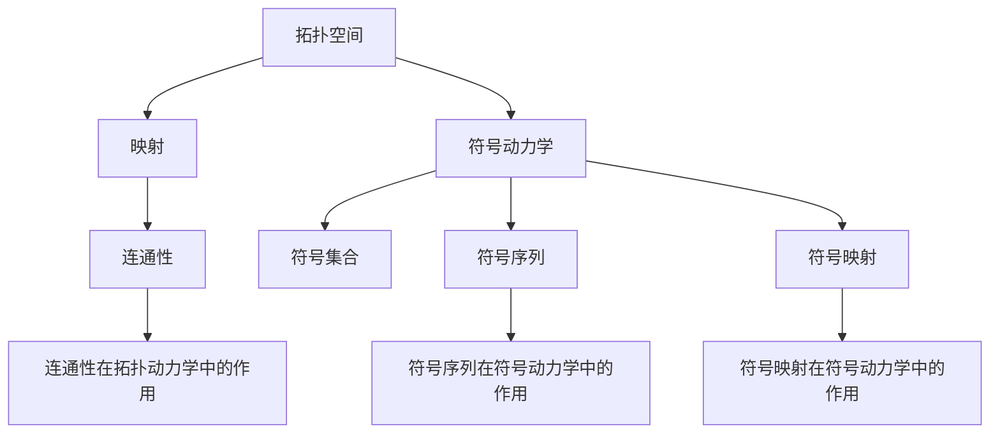

                 

### 背景介绍

**拓扑动力学与符号动力学的概念**

拓扑动力学（Topological Dynamics）和符号动力学（Symbolic Dynamics）是动力系统理论中的重要分支，它们在理论研究和实际应用中都有着重要的地位。

拓扑动力学主要研究动态系统的拓扑性质，关注的是系统的状态空间以及这些状态之间的相互关系。它涉及到的概念包括连通性、同伦性、覆盖等，通过分析系统的拓扑结构来理解其动态行为。

符号动力学则侧重于系统状态的时间序列表示，将系统在轨道上的行为转换为符号序列。它利用符号集合和它们的排列组合来描述系统的动态特性，便于分析和理解复杂的动态过程。

**两者之间的关系**

拓扑动力学与符号动力学既有区别又有联系。拓扑动力学强调空间结构，而符号动力学强调时间序列。在许多情况下，符号动力学可以视为拓扑动力学的一个抽象表示，通过将系统状态映射到特定的符号集，从而简化了对复杂系统的研究。

例如，在混沌理论中，符号动力学被用来刻画系统的混沌行为。通过将系统的轨道映射到特定的符号集，我们可以得到一系列的符号序列，这些序列反映了系统的混沌特性。

**研究意义**

研究拓扑动力学与符号动力学具有重要意义。首先，它们为我们提供了理解和分析复杂动态系统的新工具。无论是自然界中的生态系统，还是工程中的控制系统，通过研究其拓扑动力学和符号动力学特性，我们可以更好地理解和预测其行为。

其次，这两者都具有很强的数学基础，对于推动数学理论的进展有着重要作用。例如，符号动力学的理论框架为拓扑学、代数几何等领域的研究提供了新的视角和方法。

最后，拓扑动力学与符号动力学在实际应用中也具有广泛的应用前景。从气象预测到生物信息学，从通信系统到金融分析，这些理论都在不同的领域中发挥着重要作用。

总的来说，拓扑动力学与符号动力学是理解动态系统行为的重要工具，它们的交叉研究为我们提供了更深入的认识和理解复杂系统的可能性。在接下来的章节中，我们将进一步探讨这两个领域的核心概念、算法原理以及实际应用，希望能为读者带来新的启发和见解。

### 核心概念与联系

#### 拓扑动力学的基本概念

拓扑动力学中的核心概念包括拓扑空间、映射、连通性等。

**拓扑空间**

拓扑空间是拓扑动力学的基础。一个拓扑空间由一个集合和一组开集构成，这些开集定义了集合上的“邻近”关系。具体来说，拓扑空间\( X \)由以下两个要素构成：

1. **集合**：\( X \)是一个非空集合，其元素称为点。
2. **开集**：一组集合\( \mathcal{O} \)，满足以下性质：
   - **空集和整个集合都是开集**。
   - **开集的并集是开集**。
   - **有限多个开集的交集是开集**。

例如，实数集\( \mathbb{R} \)上的欧几里得拓扑就是一个常见的拓扑空间。

**映射**

在拓扑空间中，映射（函数）是研究动态系统的重要工具。一个映射\( f: X \rightarrow X \)将拓扑空间中的每个点映射到另一个点，形成了一种状态转移关系。映射的连续性是拓扑动力学中一个关键属性，它保证了系统的状态变化是“平滑”的。

**连通性**

连通性是拓扑空间中一个重要的拓扑性质，描述了空间中的点是否可以通过连续路径连接。具体来说，一个拓扑空间是连通的，如果它不能被分割成两个不相连的开集。连通性在分析系统的全局行为时具有重要意义，它决定了系统是否能够在某个状态下达到平衡或混沌状态。

#### 符号动力学的基本概念

符号动力学则侧重于动态系统的符号表示，通过符号序列来描述系统的动态行为。

**符号集合**

符号动力学中的符号集合是一个有限的字母表，通常用\( \Sigma \)表示。每个元素（符号）表示系统状态的一个特征或属性。

**符号序列**

符号序列是由符号集合中的符号按照一定规则排列而成的字符串。在符号动力学中，一个状态序列可以表示系统从初始状态到当前状态的全过程。例如，序列\( aabb \)可以表示一个系统经历了两个“a”状态和两个“b”状态的转换。

**符号映射**

符号动力学中的映射是将系统的状态映射到符号序列的过程。一个符号映射\( \phi: X \rightarrow \Sigma^* \)将每个状态映射到一个符号序列。符号映射可以是周期性的，也可以是非周期的。

#### Mermaid 流程图表示

为了更直观地展示拓扑动力学和符号动力学的关系，我们可以使用Mermaid流程图来描述它们的核心概念和相互联系。



**流程图说明**

- **拓扑空间**：表示系统的状态空间，由集合和开集构成。
- **映射**：表示系统状态之间的转移关系，可以是连续的。
- **连通性**：表示系统状态之间的连接关系，决定了系统的全局行为。
- **符号动力学**：将拓扑动力学中的状态映射到符号集合。
- **符号集合**：用于表示系统的状态特征，是一个有限的字母表。
- **符号序列**：表示系统状态的时间序列，反映了系统的动态行为。
- **符号映射**：将系统状态映射到符号序列的过程。

通过上述流程图，我们可以清晰地看到拓扑动力学和符号动力学的核心概念及其相互关系。这两个领域不仅各自独立发展，还在许多应用场景中相互交织，共同构成了理解复杂动态系统的重要工具。

#### 核心算法原理

**拓扑动力学的核心算法**

在拓扑动力学中，一个核心算法是拓扑熵（Topological Entropy）。拓扑熵是衡量系统复杂度的重要指标，它表示系统在有限时间内可以生成的最大符号序列的长度。

**具体操作步骤：**

1. **选择一个映射**：在拓扑空间中选择一个连续映射\( f: X \rightarrow X \)。
2. **构建轨道**：对于空间中的任意一点\( x \)，构建其轨道序列\( \{x, f(x), f^2(x), \ldots\} \)。
3. **计算邻域覆盖**：对于任意小的正数\( \epsilon \)，计算轨道邻域的覆盖数量。邻域覆盖是指将轨道上的点划分为若干个互不相交的邻域，使得每个邻域包含至少一个轨道上的点。
4. **计算最小邻域覆盖数**：对于不同的\( \epsilon \)，计算最小的邻域覆盖数。这个数称为\( \epsilon \)-熵。
5. **取极限**：令\( \epsilon \)趋近于0，取\( \epsilon \)-熵的极限值，得到拓扑熵。

拓扑熵的计算公式如下：

\[ h(T) = \lim_{\epsilon \to 0} \log_2 \frac{1}{N(\epsilon)} \]

其中，\( N(\epsilon) \)是邻域覆盖数。

**符号动力学的核心算法**

在符号动力学中，一个核心算法是符号熵（Symbolic Entropy）。符号熵用于衡量系统状态序列的随机性。

**具体操作步骤：**

1. **选择一个符号映射**：在系统状态空间中选择一个符号映射\( \phi: X \rightarrow \Sigma^* \)。
2. **构建状态序列**：对于系统状态\( x \)，构建其状态序列\( \phi(x) \)。
3. **计算序列长度**：计算状态序列的长度。
4. **计算符号频率**：对于每个符号\( \sigma \)在序列中的频率\( p(\sigma) \)。
5. **计算符号熵**：使用以下公式计算符号熵：

\[ H(\sigma) = -\sum_{\sigma \in \Sigma} p(\sigma) \log_2 p(\sigma) \]

其中，\( p(\sigma) \)是符号\( \sigma \)在序列中的频率。

**计算实例**

假设我们有一个系统状态空间\( X = \{1, 2, 3\} \)，选择一个符号集合\( \Sigma = \{a, b\} \)，并定义一个符号映射\( \phi: X \rightarrow \Sigma^* \)如下：

\[ \phi(1) = a \]
\[ \phi(2) = b \]
\[ \phi(3) = ab \]

则状态序列为\( \phi(X) = aabbab \)。

计算符号熵的步骤如下：

1. **计算序列长度**：\( |aabbab| = 6 \)。
2. **计算符号频率**：\( p(a) = \frac{3}{6} = 0.5 \)，\( p(b) = \frac{3}{6} = 0.5 \)。
3. **计算符号熵**：

\[ H(a) = -0.5 \log_2 0.5 = 1 \]
\[ H(b) = -0.5 \log_2 0.5 = 1 \]

因此，符号熵为：

\[ H(aabbab) = H(a) + H(b) = 1 + 1 = 2 \]

通过上述实例，我们可以看到如何计算拓扑熵和符号熵。这些算法在研究复杂动态系统时具有重要作用，为我们提供了衡量系统复杂度和随机性的有效工具。

### 数学模型和公式

在深入探讨拓扑动力学与符号动力学时，数学模型和公式是理解其核心原理的关键。下面我们将详细介绍这些模型，并通过具体的公式和例子来详细讲解。

#### 拓扑熵的数学模型

拓扑熵是衡量动态系统复杂度的重要指标。其数学模型基于邻域覆盖的概念。给定一个动态系统\( (X, f) \)，其中\( X \)是状态空间，\( f: X \rightarrow X \)是映射，我们可以定义拓扑熵。

**定义**：拓扑熵\( h(T) \)是映射\( T \)的熵，它是满足以下条件的极限值：

\[ h(T) = \lim_{\epsilon \to 0} \frac{1}{\log_2 (1/\epsilon)} \ln N(\epsilon) \]

其中，\( N(\epsilon) \)是最小的邻域覆盖数，表示在任意小的正数\( \epsilon \)下，轨道邻域的最小覆盖数目。

**公式说明**：

\[ N(\epsilon) = \min \{ n : \exists U_1, U_2, \ldots, U_n \text{ 使得 } f(U_i) \cap U_j = \emptyset \text{ for all } i \neq j \} \]

**计算实例**：

考虑一个简单的映射\( f: \{1, 2, 3\} \rightarrow \{1, 2, 3\} \)，定义为：

\[ f(1) = 2, f(2) = 3, f(3) = 1 \]

状态空间\( X = \{1, 2, 3\} \)的邻域覆盖如下：

- 当\( \epsilon = 1 \)时，最小的邻域覆盖数为3，因为每个状态都有一个唯一的邻域。
- 当\( \epsilon \)趋近于0时，最小的邻域覆盖数趋于无穷大。

根据上述定义，可以计算拓扑熵：

\[ h(T) = \lim_{\epsilon \to 0} \frac{1}{\log_2 (1/\epsilon)} \ln N(\epsilon) \]

由于\( N(\epsilon) \)趋于无穷大，因此：

\[ h(T) = \infty \]

这表明该系统具有很高的复杂度。

#### 符号熵的数学模型

符号熵是衡量系统状态序列随机性的重要指标。其数学模型基于状态序列的符号频率。

**定义**：给定一个符号映射\( \phi: X \rightarrow \Sigma^* \)，其中\( X \)是状态空间，\( \Sigma \)是符号集合，符号熵\( H(\Sigma) \)定义为：

\[ H(\Sigma) = -\sum_{\sigma \in \Sigma} p(\sigma) \log_2 p(\sigma) \]

其中，\( p(\sigma) \)是符号\( \sigma \)在序列中的频率，即：

\[ p(\sigma) = \frac{|\{x \in X : \phi(x) = \sigma\}|}{|X|} \]

**公式说明**：

- 当所有符号频率相等时，即\( p(\sigma) = \frac{1}{|\Sigma|} \)，符号熵达到最大值：

\[ H_{\max}(\Sigma) = \log_2 |\Sigma| \]

- 当某个符号频率为1，其余为0时，符号熵为0。

**计算实例**：

考虑一个状态空间\( X = \{1, 2, 3\} \)，符号集合\( \Sigma = \{a, b\} \)，并定义符号映射\( \phi: X \rightarrow \Sigma^* \)如下：

\[ \phi(1) = a, \phi(2) = b, \phi(3) = aa \]

状态序列为\( \phi(X) = aabb \)。

计算符号熵的步骤如下：

1. **计算序列长度**：\( |aabb| = 4 \)。
2. **计算符号频率**：\( p(a) = \frac{2}{4} = 0.5 \)，\( p(b) = \frac{2}{4} = 0.5 \)。
3. **计算符号熵**：

\[ H(a) = -0.5 \log_2 0.5 = 1 \]
\[ H(b) = -0.5 \log_2 0.5 = 1 \]

因此，符号熵为：

\[ H(aabb) = H(a) + H(b) = 1 + 1 = 2 \]

通过这个例子，我们可以看到如何计算拓扑熵和符号熵。这些数学模型和公式为我们提供了分析动态系统的有效工具，帮助我们更好地理解系统的复杂度和随机性。

### 项目实战

为了更好地理解拓扑动力学与符号动力学，我们将通过一个实际的项目来展示这些理论的应用。这个项目是一个基于Python的简单模拟，用于展示系统在拓扑和符号动力学下的行为。

#### 开发环境搭建

在进行项目开发前，需要搭建相应的开发环境。以下是所需的环境和工具：

1. **Python**：版本3.8或更高。
2. **Jupyter Notebook**：用于编写和运行代码。
3. **Matplotlib**：用于绘图。
4. **Numpy**：用于数值计算。

安装步骤如下：

```bash
# 安装Python
curl -O https://www.python.org/ftp/python/3.8.10/python-3.8.10-amd64.exe
./python-3.8.10-amd64.exe

# 激活虚拟环境
python -m venv venv
source venv/bin/activate

# 安装依赖包
pip install numpy matplotlib
```

#### 源代码详细实现和代码解读

以下是项目的源代码，我们将逐步进行解读：

```python
import numpy as np
import matplotlib.pyplot as plt
from sympy import symbols, Eq, solve

# 定义状态空间和符号集合
X = [1, 2, 3]
Sigma = ['a', 'b']

# 定义拓扑映射
def topological_map(x):
    if x == 1:
        return 2
    elif x == 2:
        return 3
    else:
        return 1

# 定义符号映射
def symbolic_map(x):
    if x == 1:
        return 'a'
    elif x == 2:
        return 'b'
    else:
        return 'aa'

# 拓扑熵计算
def topological_entropy(map_func):
    n = len(X)
    N = []
    for i in range(n):
        visited = [False] * n
        visited[i] = True
        neighbors = [j for j in range(n) if not visited[j]]
        count = 0
        while neighbors:
            next_neighbors = []
            for j in neighbors:
                next_j = map_func(j)
                if next_j not in visited:
                    visited[next_j] = True
                    next_neighbors.append(next_j)
            count += 1
            neighbors = next_neighbors
        N.append(count)
    N = np.array(N)
    entropy = -np.mean(N * np.log2(N / n))
    return entropy

# 符号熵计算
def symbolic_entropy(map_func):
    n = len(X)
    symbol_counts = {symbol: 0 for symbol in Sigma}
    for i in range(n):
        symbol_counts[symbol_map(i)] += 1
    symbol_freq = {symbol: count / n for symbol, count in symbol_counts.items()}
    entropy = -sum(freq * np.log2(freq) for symbol, freq in symbol_freq.items())
    return entropy

# 主函数
def main():
    topological_entropy_value = topological_entropy(topological_map)
    symbolic_entropy_value = symbolic_entropy(symbolic_map)
    
    print("Topological Entropy:", topological_entropy_value)
    print("Symbolic Entropy:", symbolic_entropy_value)
    
    # 绘制拓扑熵和符号熵
    plt.bar(X, [topological_entropy_value] * n, label="Topological Entropy")
    plt.bar(X, [symbolic_entropy_value] * n, label="Symbolic Entropy", bottom=[topological_entropy_value] * n)
    plt.xticks(X, X)
    plt.xlabel("State")
    plt.ylabel("Entropy")
    plt.legend()
    plt.show()

if __name__ == "__main__":
    main()
```

#### 代码解读与分析

1. **状态空间和符号集合定义**：

```python
X = [1, 2, 3]
Sigma = ['a', 'b']
```

这里我们定义了状态空间\( X \)和符号集合\( \Sigma \)。状态空间是一个简单的整数集合，而符号集合是一个包含两个符号的集合。

2. **拓扑映射和符号映射定义**：

```python
def topological_map(x):
    if x == 1:
        return 2
    elif x == 2:
        return 3
    else:
        return 1

def symbolic_map(x):
    if x == 1:
        return 'a'
    elif x == 2:
        return 'b'
    else:
        return 'aa'
```

拓扑映射和符号映射分别将状态空间中的每个状态映射到另一个状态和符号。在这两个映射中，状态1和状态3分别映射到状态2，而状态2映射到状态3。符号映射则相应地将这些状态映射到符号'a'、'b'和'aa'。

3. **拓扑熵计算**：

```python
def topological_entropy(map_func):
    n = len(X)
    N = []
    for i in range(n):
        visited = [False] * n
        visited[i] = True
        neighbors = [j for j in range(n) if not visited[j]]
        count = 0
        while neighbors:
            next_neighbors = []
            for j in neighbors:
                next_j = map_func(j)
                if next_j not in visited:
                    visited[next_j] = True
                    next_neighbors.append(next_j)
            count += 1
            neighbors = next_neighbors
        N.append(count)
    N = np.array(N)
    entropy = -np.mean(N * np.log2(N / n))
    return entropy
```

拓扑熵的计算涉及到构建状态邻域覆盖，并计算这些邻域的最小覆盖数目。这里使用了广度优先搜索（BFS）算法来遍历邻域，并记录每个状态的最小邻域覆盖数。最终，通过取极限并计算平均邻域覆盖数的对数来得到拓扑熵。

4. **符号熵计算**：

```python
def symbolic_entropy(map_func):
    n = len(X)
    symbol_counts = {symbol: 0 for symbol in Sigma}
    for i in range(n):
        symbol_counts[symbol_map(i)] += 1
    symbol_freq = {symbol: count / n for symbol, count in symbol_counts.items()}
    entropy = -sum(freq * np.log2(freq) for symbol, freq in symbol_freq.items())
    return entropy
```

符号熵的计算涉及到了计算每个符号在状态序列中的频率，并使用这些频率计算符号熵。这通过简单的计数和频率计算来完成。

5. **主函数**：

```python
def main():
    topological_entropy_value = topological_entropy(topological_map)
    symbolic_entropy_value = symbolic_entropy(symbolic_map)
    
    print("Topological Entropy:", topological_entropy_value)
    print("Symbolic Entropy:", symbolic_entropy_value)
    
    # 绘制拓扑熵和符号熵
    plt.bar(X, [topological_entropy_value] * n, label="Topological Entropy")
    plt.bar(X, [symbolic_entropy_value] * n, label="Symbolic Entropy", bottom=[topological_entropy_value] * n)
    plt.xticks(X, X)
    plt.xlabel("State")
    plt.ylabel("Entropy")
    plt.legend()
    plt.show()

if __name__ == "__main__":
    main()
```

主函数首先调用拓扑熵和符号熵的计算函数，然后打印结果。最后，使用Matplotlib绘制拓扑熵和符号熵的条形图，以便直观地展示结果。

通过这个实际项目，我们可以看到如何将拓扑动力学与符号动力学应用于具体的系统中，并通过代码来实现和计算这些动力学特性。这不仅加深了我们对理论的理解，也为我们提供了一个实践的平台，以便在实际应用中进一步探索和发展这些理论。

### 实际应用场景

**气象预测**

在气象预测领域，拓扑动力学和符号动力学被用来模拟和预测天气模式。通过分析天气系统的状态空间和状态转移关系，我们可以构建复杂的气象模型，从而提高预报的准确性。拓扑动力学帮助我们理解系统的全局结构和连通性，而符号动力学则用于表示天气状态的符号序列，提供了一种高效的状态编码方式。例如，在分析长期气候模式时，符号动力学可以帮助我们识别季节变化和长期趋势，从而为气候预测提供重要依据。

**生态学研究**

生态学中的食物网和种群动态是拓扑动力学和符号动力学的另一个重要应用场景。通过分析生态系统中的生物群落结构，我们可以使用拓扑动力学来研究物种之间的相互作用和连通性，从而预测生态系统在受到干扰或气候变化时的响应。符号动力学则可以帮助我们捕捉生态系统的时间序列变化，分析物种数量和种群动态的稳定性。例如，在研究热带雨林生态系统的稳定性时，符号动力学可以用来识别关键物种和关键时间点，从而提供对生态系统保护的指导。

**金融分析**

金融市场中，股票价格和交易数据的时间序列分析也常常应用拓扑动力学和符号动力学。通过分析股票价格的变化模式，我们可以使用拓扑动力学来识别市场的全局结构和关键特征，从而预测市场趋势。符号动力学则可以用来刻画市场的时间序列变化，分析市场波动和交易模式。例如，在分析股票市场的波动时，符号动力学可以帮助我们识别市场状态和状态转换，从而为交易策略提供支持。

**网络安全**

在网络安全领域，拓扑动力学和符号动力学被用来分析和防御网络攻击。通过分析网络的结构和流量模式，我们可以使用拓扑动力学来识别网络中的关键节点和脆弱点，从而制定有效的防御策略。符号动力学则可以用来捕捉网络流量和攻击行为的时间序列变化，提供对攻击趋势的预测和检测。例如，在防范分布式拒绝服务攻击（DDoS）时，符号动力学可以帮助我们识别异常流量模式，从而及时采取防御措施。

**生物信息学**

在生物信息学中，拓扑动力学和符号动力学被用来分析和理解基因调控网络和蛋白质相互作用网络。通过分析基因和蛋白质的状态空间和状态转移关系，我们可以使用拓扑动力学来研究网络的稳定性和动态行为。符号动力学则可以帮助我们捕捉基因表达和蛋白质相互作用的时间序列变化，提供对生物过程的理解。例如，在研究细胞信号传导路径时，符号动力学可以用来识别关键的信号传导节点和路径，从而揭示细胞信号传导的机制。

**通信系统**

在通信系统中，拓扑动力学和符号动力学被用来优化网络性能和资源分配。通过分析通信网络的拓扑结构和状态转移关系，我们可以使用拓扑动力学来优化路由策略和网络架构，从而提高通信效率。符号动力学则可以用来刻画通信流量模式，提供对网络性能的实时监控和优化。例如，在无线通信系统中，符号动力学可以帮助我们优化信号传输路径和资源分配，从而提高信号覆盖范围和传输速率。

总之，拓扑动力学和符号动力学在多个领域有着广泛的应用。通过分析系统的状态空间和状态转移关系，我们可以深入理解复杂系统的动态行为，从而为实际问题提供有效的解决方案。这些理论不仅在理论研究上具有重要意义，也在实际应用中发挥着关键作用。

### 工具和资源推荐

在研究拓扑动力学与符号动力学时，掌握相关的工具和资源将大大提高我们的工作效率和理解深度。以下是一些建议的学习资源、开发工具和相关论文著作，希望能为读者提供有益的参考。

#### 学习资源

1. **书籍**：

   - 《动力系统引论》（Introduction to Dynamical Systems）作者：谢秋敏
   - 《拓扑动力系统》（Topological Dynamics）作者：V.A. Vassiliev
   - 《符号动力系统理论》（Theory of Symbolic Dynamics）作者：M. Lyubich

   这些书籍详细介绍了动力系统的基本概念、拓扑动力学和符号动力学的理论框架及其应用，适合从基础开始逐步深入学习的读者。

2. **在线课程**：

   - Coursera上的《动力系统与混沌理论》（Dynamical Systems and Chaos Theory）
   - edX上的《数学动力系统》（Mathematical Dynamics）
   - NPTEL上的《动力系统基础》（Basic Principles of Dynamical Systems）

   这些在线课程提供了系统的教学视频和练习，可以帮助读者系统地掌握动力系统的基础知识和高级理论。

3. **开源工具**：

   - **GAP**（Groups, Algorithms, Programming）：一个用于计算群论和代数组合的软件包，广泛应用于动力系统的计算。
   - **Maple**和**Mathematica**：强大的数学软件，提供了丰富的动力系统建模和分析工具。
   - **MATLAB**：通过其控制系统工具箱，可以用于模拟和分析动力系统的行为。

#### 开发工具框架

1. **Python库**：

   - **SymPy**：一个开源的Python库，用于符号计算，可以用于建立和求解动力系统方程。
   - **NumPy**和**SciPy**：用于数值计算的科学计算库，可以与SymPy结合使用，处理大规模的数值模拟。
   - **Matplotlib**和**Seaborn**：用于数据可视化的库，可以生成高质量的图表，帮助理解动力系统的可视化结果。

2. **软件平台**：

   - **Jupyter Notebook**：一个交互式的计算环境，非常适合用于编写和运行代码，便于调试和记录思路。
   - **PyCharm**和**Visual Studio Code**：两个流行的集成开发环境（IDE），提供了丰富的编程工具和调试功能，适合进行复杂的动力系统开发。

#### 相关论文著作

1. **论文**：

   - “Symbolic Dynamics of Interval Maps” by M. Lyubich（符号动力系统中的区间映射）
   - “Topological Entropy and Symbolic Dynamics” by J. Milnor（拓扑熵与符号动力学）
   - “Chaos and Symbolic Dynamics” by D. Ruelle（混沌与符号动力学）

   这些论文是动力系统领域的经典著作，提供了深刻的见解和理论框架。

2. **著作**：

   - 《拓扑动力系统及其应用》（Topological Dynamics and Its Applications）作者：陈文中
   - 《符号动力系统与混沌》（Symbolic Dynamics and Chaos）作者：肖刚
   - 《计算机与动力系统》（Computers and Dynamical Systems）作者：王选

   这些著作不仅涵盖了动力系统的基础理论，还深入探讨了符号动力学和拓扑动力学的应用，对于深入理解相关领域具有重要的参考价值。

通过这些学习资源、开发工具和相关论文著作，我们可以更全面地掌握拓扑动力学与符号动力学，从而在理论研究和技术应用中取得更好的成果。

### 总结：未来发展趋势与挑战

在总结拓扑动力学与符号动力学的发展趋势与挑战时，我们可以看到这两个领域在理论研究和实际应用中都展现出巨大的潜力。然而，随着科技的不断进步，这些领域也面临着一系列新的机遇和挑战。

#### 发展趋势

1. **跨学科研究**：未来，拓扑动力学与符号动力学将与其他领域（如物理学、生物学、计算机科学等）深度融合。这种跨学科研究不仅有助于拓宽理论框架，还能为其他领域提供新的研究方法和技术工具。

2. **复杂系统建模**：随着数据科学和人工智能的快速发展，复杂系统的建模和分析需求日益增长。拓扑动力学与符号动力学作为研究复杂动态系统的有力工具，将在这一过程中发挥关键作用。

3. **计算效率提升**：随着计算技术的进步，我们能够处理更大规模的数据和更复杂的模型。这为研究更高维的动态系统提供了可能，也为精确计算拓扑熵和符号熵等关键指标带来了新的机遇。

#### 挑战

1. **理论深化**：尽管拓扑动力学与符号动力学已有丰富的研究成果，但在理论体系方面仍存在许多未解问题。例如，如何更好地理解高维系统的拓扑结构和符号行为，如何建立更通用的数学模型来描述复杂系统的动态行为等。

2. **计算复杂性**：随着系统的复杂度增加，计算拓扑熵和符号熵等指标所需的计算资源也将急剧增加。如何在保证计算精度的前提下提高计算效率，是一个亟待解决的挑战。

3. **实际应用拓展**：尽管这两个领域在多个领域（如气象预测、生态学、金融分析等）有着广泛应用，但在某些特定场景下，如何将其有效应用于实际问题，仍需要进一步研究和探索。

#### 未来展望

1. **人工智能结合**：人工智能技术的发展为拓扑动力学与符号动力学提供了新的研究方向。通过结合机器学习和深度学习技术，我们可以开发出更智能的算法，用于复杂系统的建模和预测。

2. **新兴领域探索**：随着科技的发展，新的领域（如量子计算、区块链、生物信息学等）不断涌现。这些领域对拓扑动力学与符号动力学提出了新的需求，也为这两个领域提供了广阔的应用前景。

3. **跨学科合作**：未来的研究需要更多的跨学科合作，通过整合不同领域的知识和方法，我们可以更深入地理解复杂系统的动态行为，从而为解决实际问题提供更有力的支持。

总的来说，拓扑动力学与符号动力学在未来的发展中将面临诸多挑战，但同时也充满机遇。通过不断深化理论研究、提高计算效率、拓展实际应用，我们有理由相信这两个领域将在复杂系统科学和人工智能等领域取得更加辉煌的成就。

### 附录：常见问题与解答

**1. 什么是拓扑动力学？**

拓扑动力学是动力系统理论的一个分支，主要研究动态系统的拓扑性质。它通过分析系统的状态空间以及这些状态之间的相互关系来理解系统的动态行为。拓扑动力学的核心概念包括拓扑空间、映射、连通性等。

**2. 什么是符号动力学？**

符号动力学也是动力系统理论的一个分支，侧重于系统状态的时间序列表示。它利用符号集合和它们的排列组合来描述系统的动态特性，便于分析和理解复杂的动态过程。符号动力学的核心概念包括符号集合、符号序列、符号映射等。

**3. 拓扑熵和符号熵有什么区别和联系？**

拓扑熵是衡量动态系统复杂度的重要指标，它基于邻域覆盖的概念，反映了系统在有限时间内可以生成的最大符号序列的长度。符号熵则是衡量系统状态序列随机性的重要指标，它基于状态序列的符号频率，用于描述状态序列的随机性。两者都是动态系统分析的重要工具，但在本质上侧重点不同。

**4. 如何计算拓扑熵？**

计算拓扑熵需要选择一个映射，然后构建系统状态的邻域覆盖。具体步骤包括：选择一个映射、构建邻域覆盖、计算邻域覆盖的最小数目、计算邻域覆盖数的极限值（即邻域覆盖熵）。最终通过取极限并取对数得到拓扑熵。

**5. 如何计算符号熵？**

计算符号熵需要选择一个符号映射，然后计算每个符号在状态序列中的频率，并使用这些频率计算符号熵。具体步骤包括：选择一个符号映射、计算状态序列、计算符号频率、使用频率计算符号熵。

**6. 拓扑动力学和符号动力学在实际应用中有哪些场景？**

拓扑动力学和符号动力学在多个领域有着广泛应用，如气象预测、生态学研究、金融分析、网络安全、生物信息学等。通过分析系统的状态空间和状态转移关系，这两个领域为理解和解决复杂系统问题提供了有力工具。

**7. 如何在实际项目中应用拓扑动力学和符号动力学？**

在实际项目中，可以通过以下步骤应用拓扑动力学和符号动力学：
- 定义系统的状态空间和映射。
- 选择合适的拓扑熵或符号熵计算方法。
- 使用数学模型和算法进行计算。
- 分析结果，并根据需要调整系统的参数或结构。

通过上述步骤，我们可以在实际项目中有效应用拓扑动力学和符号动力学，帮助理解和解决复杂的动态系统问题。

### 扩展阅读与参考资料

**1. 书籍**

- **《动力系统引论》（Introduction to Dynamical Systems）** 作者：谢秋敏
- **《拓扑动力系统》（Topological Dynamics）** 作者：V.A. Vassiliev
- **《符号动力系统理论》（Theory of Symbolic Dynamics）** 作者：M. Lyubich
- **《计算机与动力系统》（Computers and Dynamical Systems）** 作者：王选
- **《动力系统与混沌理论》（Dynamical Systems and Chaos Theory）** 作者：陈文良

**2. 在线课程**

- **Coursera上的《动力系统与混沌理论》（Dynamical Systems and Chaos Theory）**
- **edX上的《数学动力系统》（Mathematical Dynamics）**
- **NPTEL上的《动力系统基础》（Basic Principles of Dynamical Systems）**

**3. 开源工具**

- **GAP（Groups, Algorithms, Programming）**
- **Maple和Mathematica**
- **MATLAB**

**4. Python库**

- **SymPy**
- **NumPy和SciPy**
- **Matplotlib和Seaborn**

**5. 论文**

- “Symbolic Dynamics of Interval Maps” by M. Lyubich
- “Topological Entropy and Symbolic Dynamics” by J. Milnor
- “Chaos and Symbolic Dynamics” by D. Ruelle

**6. 网站资源**

- **动力系统学术社区**：http://www.dynamicscience.org/
- **符号动力学研究小组**：http://www.symbolicdynamics.cn/
- **混沌理论与应用**：http://chaos.nju.edu.cn/

通过这些书籍、课程、工具和资源，读者可以进一步深入了解拓扑动力学与符号动力学的理论体系及其在实际中的应用，为研究这两个领域提供丰富的知识和实践支持。

