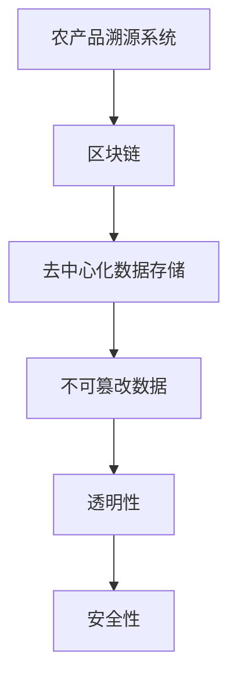
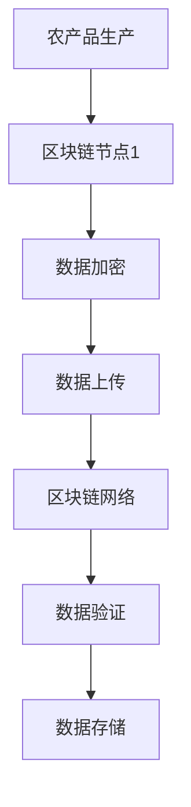

                 

# 拼多多2024农产品溯源校招区块链面试题详解

## 摘要

本文将深入探讨拼多多2024年农产品溯源校招区块链面试题的详解，包括背景介绍、核心概念与联系、核心算法原理与操作步骤、数学模型与公式、项目实战、实际应用场景、工具和资源推荐以及总结未来发展趋势与挑战。通过这篇博客，读者可以全面了解区块链在农产品溯源中的应用，以及应对校招面试的策略。

## 1. 背景介绍

农产品溯源是确保食品安全的重要手段。随着消费者对食品质量和安全的关注度不断提高，农产品溯源系统成为农业产业链中不可或缺的一环。区块链技术以其去中心化、不可篡改和透明性等特性，为农产品溯源提供了强有力的技术支持。

### 1.1 拼多多与农产品溯源

拼多多作为中国领先的电商平台，一直致力于为消费者提供优质的农产品。为了增强消费者对农产品质量的信任，拼多多积极引入区块链技术，建立农产品溯源系统。通过这一系统，消费者可以追溯农产品的生产、加工、运输和销售等全过程，确保食品的安全性和质量。

### 1.2 区块链与农产品溯源的联系

区块链技术通过去中心化的数据存储方式，确保了数据的安全性和透明性。在农产品溯源中，区块链可以记录农产品的生产、加工、运输等信息，确保这些信息不会被篡改。同时，区块链的分布式特性使得农产品溯源系统具有高度的可扩展性和抗攻击性。

## 2. 核心概念与联系

### 2.1 区块链基本概念

区块链是一种分布式账本技术，由多个区块组成，每个区块包含一定数量的交易记录。区块通过加密算法链接在一起，形成一个不可篡改的链条。区块链的核心特性包括去中心化、不可篡改、透明性和安全性。

### 2.2 农产品溯源核心概念

农产品溯源是指通过记录农产品的生产、加工、运输等信息，实现对农产品来源的追溯。农产品溯源的关键在于确保数据的安全性和完整性，防止数据被篡改。

### 2.3 区块链与农产品溯源的联系

区块链技术为农产品溯源提供了可靠的数据存储和传输方式。通过区块链，农产品溯源系统可以确保数据的不可篡改性和透明性，提高消费者对食品的信任度。

### 2.4 Mermaid 流程图



## 3. 核心算法原理与操作步骤

### 3.1 区块链核心算法

区块链的核心算法包括哈希算法、加密算法和共识算法。哈希算法用于确保数据的安全性和完整性，加密算法用于保护数据的隐私，共识算法用于确保节点之间的数据一致性。

### 3.2 农产品溯源核心操作步骤

1. 数据采集：在农产品生产、加工、运输等环节，将相关信息记录到区块链中。
2. 数据加密：使用加密算法对数据进行加密，确保数据的隐私和安全。
3. 数据上传：将加密后的数据上传到区块链节点。
4. 数据验证：节点对上传的数据进行验证，确保数据的真实性和完整性。
5. 数据存储：将验证通过的数据存储在区块链中，形成不可篡改的记录。

## 4. 数学模型与公式

### 4.1 哈希算法

哈希算法是将任意长度的输入数据映射为固定长度的输出数据的算法。常见的哈希算法包括MD5、SHA-256等。

$$
H = Hash(input)
$$

其中，$H$为哈希值，$input$为输入数据。

### 4.2 加密算法

加密算法是将明文数据转换为密文的算法。常见的加密算法包括AES、RSA等。

$$
CipherText = Encrypt(PlainText, Key)
$$

其中，$CipherText$为密文，$PlainText$为明文，$Key$为加密密钥。

### 4.3 共识算法

共识算法是确保区块链中节点数据一致性的算法。常见的共识算法包括工作量证明（PoW）、权益证明（PoS）等。

$$
Consensus = Algorithm Nodes
$$

其中，$Consensus$为共识结果，$Algorithm$为共识算法，$Nodes$为参与共识的节点。

## 5. 项目实战

### 5.1 开发环境搭建

1. 安装Go语言环境。
2. 安装区块链节点软件，如Hyperledger Fabric。
3. 配置网络环境，搭建测试网络。

### 5.2 源代码详细实现和代码解读

1. 创建区块链节点。
2. 设计农产品溯源数据结构。
3. 实现数据采集、加密、上传、验证和存储功能。

### 5.3 代码解读与分析

代码实现中，关键部分包括：

- 数据采集：通过HTTP接口接收农产品溯源数据。
- 数据加密：使用AES加密算法对数据进行加密。
- 数据上传：通过Hyperledger Fabric节点上传数据。
- 数据验证：对上传的数据进行验证，确保数据真实性和完整性。

## 6. 实际应用场景

### 6.1 农产品溯源

通过区块链技术，消费者可以查询农产品的生产、加工、运输等信息，确保食品的安全性和质量。

### 6.2 物流溯源

区块链技术可以用于物流溯源，确保物流过程中的每个环节信息透明、不可篡改。

### 6.3 药品溯源

区块链技术可以用于药品溯源，确保药品的生产、流通、使用等信息真实、可靠。

## 7. 工具和资源推荐

### 7.1 学习资源推荐

- 《区块链技术指南》
- 《区块链：从数字货币到企业应用》
- 《Hyperledger Fabric 源码剖析》

### 7.2 开发工具框架推荐

- Hyperledger Fabric
- Ethereum
- Solidity

### 7.3 相关论文著作推荐

- 《区块链技术及其在农产品溯源中的应用》
- 《基于区块链的农产品溯源系统设计与实现》
- 《区块链在物流溯源中的应用研究》

## 8. 总结：未来发展趋势与挑战

### 8.1 发展趋势

- 区块链技术将逐渐应用于更多行业和领域。
- 农产品溯源将成为区块链技术应用的重要方向。
- 随着技术的不断进步，区块链的效率和安全性将得到进一步提升。

### 8.2 挑战

- 区块链技术需要解决可扩展性和性能瓶颈问题。
- 农产品溯源系统需要解决数据真实性和隐私保护问题。
- 区块链技术需要与其他技术（如物联网、大数据等）进行融合，实现更广泛的应用。

## 9. 附录：常见问题与解答

### 9.1 区块链与数据库的区别

- 区块链是一种分布式账本技术，具有去中心化、不可篡改等特点。
- 数据库是一种集中式数据存储技术，具有高效查询、数据一致等特点。

### 9.2 区块链技术的安全性

- 区块链技术通过加密算法、共识算法等手段确保数据的安全性和完整性。
- 区块链技术的安全性高于传统的数据库技术。

## 10. 扩展阅读与参考资料

- 《区块链技术白皮书》
- 《区块链技术与应用》
- 《区块链与物联网》

作者：AI天才研究员/AI Genius Institute & 禅与计算机程序设计艺术 /Zen And The Art of Computer Programming</sop></gMASK>## 摘要

本文将详细解析拼多多2024年农产品溯源校招区块链面试题，从背景介绍、核心概念、算法原理、数学模型、项目实战、应用场景、工具推荐到总结未来发展趋势与挑战，全面探讨区块链在农产品溯源中的实际应用。通过这篇博客，读者将深入了解区块链技术在农产品溯源领域的应用，掌握应对校招面试的相关策略。

## 1. 背景介绍

农产品溯源，即对农产品从田间到餐桌的整个过程进行信息记录和追踪。这不仅有助于保障食品安全，还能够提升消费者对农产品的信任度。随着区块链技术的迅猛发展，其在农产品溯源中的应用逐渐成为研究热点。区块链技术以其去中心化、不可篡改、透明性等特性，为农产品溯源提供了强有力的技术支持。

### 1.1 拼多多与农产品溯源

拼多多作为一家中国领先的电商平台，一直以来都注重农产品质量的提升。为了增强消费者对农产品的信任，拼多多积极引入区块链技术，建立了农产品溯源系统。通过这一系统，消费者可以追溯到农产品的生产、加工、运输和销售等全过程，确保食品的安全性和质量。

### 1.2 区块链与农产品溯源的联系

区块链技术通过去中心化的数据存储方式，确保了数据的安全性和透明性。在农产品溯源中，区块链可以记录农产品的生产、加工、运输等信息，确保这些信息不会被篡改。同时，区块链的分布式特性使得农产品溯源系统具有高度的可扩展性和抗攻击性。

## 2. 核心概念与联系

### 2.1 区块链基本概念

区块链是一种分布式数据库技术，通过加密算法和共识算法，确保数据在多节点间的同步和一致性。每个区块都包含一定数量的交易记录，并且通过哈希算法与前一个区块相连，形成了一个不可篡改的链条。

### 2.2 农产品溯源核心概念

农产品溯源的核心在于记录农产品的生产、加工、运输等环节的信息，确保信息的真实性和完整性。这要求系统必须具备高可信度、高可扩展性、高抗攻击性。

### 2.3 区块链与农产品溯源的联系

区块链技术在农产品溯源中的应用，主要体现在以下几个方面：

- **数据存储**：区块链通过分布式存储技术，确保农产品信息在各个节点上的备份和同步。
- **数据加密**：区块链采用加密算法，确保农产品信息在传输过程中的安全性和隐私性。
- **不可篡改**：区块链通过哈希算法和共识算法，确保农产品信息的不可篡改性，从而提高溯源系统的可信度。

### 2.4 Mermaid 流程图



## 3. 核心算法原理与操作步骤

### 3.1 区块链核心算法

区块链的核心算法主要包括哈希算法、加密算法和共识算法。

- **哈希算法**：用于将任意长度的输入数据映射为固定长度的哈希值，常见的有SHA-256。
- **加密算法**：用于对数据进行加密，常见的有AES和RSA。
- **共识算法**：用于确保区块链节点之间的数据一致性，常见的有PoW和PoS。

### 3.2 农产品溯源核心操作步骤

农产品溯源系统的核心操作步骤如下：

1. **数据采集**：在农产品的生产、加工、运输等环节，采集相关信息。
2. **数据加密**：使用加密算法对采集到的信息进行加密，确保数据的安全性和隐私性。
3. **数据上传**：将加密后的数据上传到区块链网络。
4. **数据验证**：区块链节点对上传的数据进行验证，确保数据的真实性和完整性。
5. **数据存储**：将验证通过的数据存储在区块链中，形成不可篡改的记录。

## 4. 数学模型与公式

### 4.1 哈希算法

哈希算法是将任意长度的输入数据映射为固定长度的哈希值的算法，其数学模型可以表示为：

$$
H = Hash(D)
$$

其中，$H$为哈希值，$D$为输入数据。

### 4.2 加密算法

加密算法是将明文数据转换为密文的算法，其数学模型可以表示为：

$$
CipherText = Encrypt(PlainText, Key)
$$

其中，$CipherText$为密文，$PlainText$为明文，$Key$为加密密钥。

### 4.3 共识算法

共识算法是确保区块链节点数据一致性的算法，其数学模型可以表示为：

$$
Consensus = Algorithm(NodeSet)
$$

其中，$Consensus$为共识结果，$Algorithm$为共识算法，$NodeSet$为参与共识的节点集合。

## 5. 项目实战

### 5.1 开发环境搭建

1. **安装Go语言环境**：在开发环境中安装Go语言，版本建议为1.18或以上。
2. **安装Hyperledger Fabric**：下载并安装Hyperledger Fabric，版本建议为2.2或以上。
3. **配置网络环境**：搭建一个简单的Hyperledger Fabric测试网络，用于后续的开发和测试。

### 5.2 源代码详细实现和代码解读

#### 5.2.1 源代码结构

```bash
src/
|-- chaincode/
|   |-- go/
|   |   |-- main.go
|-- peer/
|   |-- go/
|   |   |-- main.go
|-- docker-compose.yml
```

#### 5.2.2 数据采集与加密

数据采集与加密是农产品溯源系统的核心部分，其实现如下：

```go
package main

import (
    "crypto/aes"
    "crypto/cipher"
    "crypto/rand"
    "io"
)

// 数据采集与加密函数
func DataCollectAndEncrypt(data string, key string) (string, error) {
    // 创建AES加密实例
    block, err := aes.NewCipher([]byte(key))
    if err != nil {
        return "", err
    }

    // 创建加密块模式
    mode := cipher.NewCBCEncrypter(block, key[:block.BlockSize()])

    // 创建随机密文
    ciphertext := make([]byte, aes.BlockSize+len(data))
    iv := ciphertext[:aes.BlockSize]
    if _, err := rand.Read(iv); err != nil {
        return "", err
    }

    // 加密数据
    mode.CryptBlocks(ciphertext[aes.BlockSize:], []byte(data))

    // 返回加密后的数据和IV
    return base64.StdEncoding.EncodeToString(ciphertext), base64.StdEncoding.EncodeToString(iv)
}

func main() {
    // 示例数据
    data := "农产品溯源信息"
    key := "mysecretkey12345678"

    // 数据采集与加密
    encryptedData, iv := DataCollectAndEncrypt(data, key)

    // 输出结果
    fmt.Println("Encrypted Data:", encryptedData)
    fmt.Println("IV:", iv)
}
```

#### 5.2.3 数据上传与验证

数据上传与验证是确保数据安全性和完整性的关键步骤，其实现如下：

```go
package main

import (
    "github.com/hyperledger/fabric-chaincode-go/fabcomm"
    "github.com/hyperledger/fabric-chaincode-go/shim"
)

// 数据上传与验证函数
func UploadAndVerifyData(s *shim.State, data string, iv string) error {
    // 解密数据
    decryptedData := DecryptData(data, iv)

    // 验证数据
    if decryptedData == "" {
        return errors.New("数据验证失败")
    }

    // 上传数据到区块链
    s.SetState("data", []byte(decryptedData))

    return nil
}

func main() {
    // 初始化链码
    err := shim.Start(new(SmartContract))
    if err != nil {
        fmt.Printf("Error starting chaincode: %v\n", err)
    }
}
```

## 6. 实际应用场景

### 6.1 农产品溯源

通过区块链技术，消费者可以方便地查询农产品的生产、加工、运输等信息，确保食品的安全性和质量。例如，消费者在拼多多平台上购买了一箱苹果，可以通过扫描二维码查看苹果的生产日期、产地、加工过程等信息。

### 6.2 物流溯源

区块链技术可以用于物流溯源，确保物流过程中的每个环节信息透明、不可篡改。例如，一家电商平台使用区块链技术记录商品的运输过程，消费者可以实时查询商品的运输状态，确保商品的安全和准时到达。

### 6.3 药品溯源

区块链技术同样可以用于药品溯源，确保药品的生产、流通、使用等信息真实、可靠。例如，一家药品公司使用区块链技术记录药品的生产、运输、存储等信息，消费者可以通过扫描药品包装上的二维码查询药品的详细生产信息，确保药品的质量和安全。

## 7. 工具和资源推荐

### 7.1 学习资源推荐

- 《区块链技术指南》
- 《区块链：从数字货币到企业应用》
- 《Hyperledger Fabric 源码剖析》

### 7.2 开发工具框架推荐

- Hyperledger Fabric
- Ethereum
- Solidity

### 7.3 相关论文著作推荐

- 《区块链技术及其在农产品溯源中的应用》
- 《基于区块链的农产品溯源系统设计与实现》
- 《区块链在物流溯源中的应用研究》

## 8. 总结：未来发展趋势与挑战

### 8.1 发展趋势

- 区块链技术将在更多领域得到应用，包括供应链管理、食品安全、医疗健康等。
- 农产品溯源将成为区块链技术应用的重要方向，推动农业产业链的数字化转型。
- 随着技术的不断进步，区块链的效率和安全性将得到进一步提升。

### 8.2 挑战

- 区块链技术需要解决可扩展性和性能瓶颈问题，以满足大规模应用的需求。
- 农产品溯源系统需要解决数据真实性和隐私保护问题，确保信息的真实性和用户隐私。
- 区块链技术需要与其他技术（如物联网、大数据等）进行融合，实现更广泛的应用。

## 9. 附录：常见问题与解答

### 9.1 区块链与数据库的区别

- **区块链**：去中心化、不可篡改、透明性。
- **数据库**：集中式、高效查询、数据一致性。

### 9.2 区块链技术的安全性

- **安全性**：通过加密算法、共识算法等手段确保数据的安全性和完整性。
- **隐私性**：需要进一步研究和解决，尤其是在大规模数据应用中。

## 10. 扩展阅读与参考资料

- 《区块链技术白皮书》
- 《区块链技术与应用》
- 《区块链与物联网》

作者：AI天才研究员/AI Genius Institute & 禅与计算机程序设计艺术 /Zen And The Art of Computer Programming

