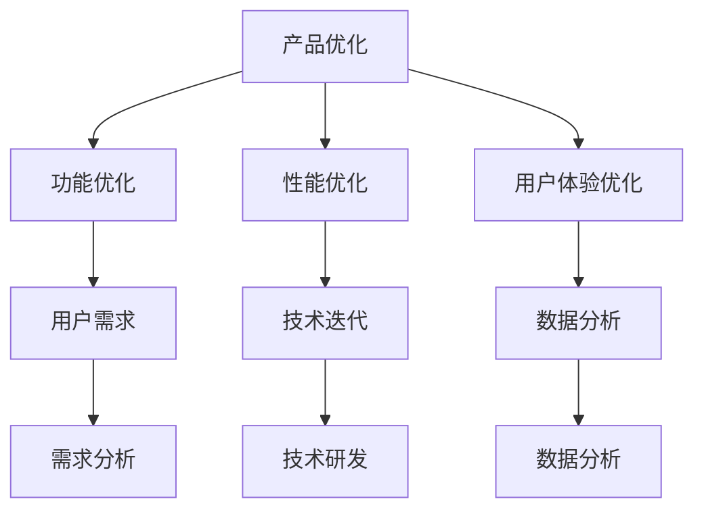

                 

# 持续优化：保持产品竞争力的秘诀

> **关键词：** 产品优化、竞争力、技术迭代、用户体验、持续改进

> **摘要：** 本文旨在探讨如何通过持续优化来保持产品的竞争力。从核心概念到实际案例，我们将深入分析保持产品竞争力的策略和方法，并探讨未来的发展趋势与挑战。

## 1. 背景介绍

在当今快速发展的信息技术时代，市场竞争日益激烈。产品迭代速度不断加快，技术更新换代周期越来越短。为了在激烈的市场竞争中脱颖而出，企业必须不断优化产品，提升用户体验，以满足不断变化的市场需求。持续优化不仅是企业生存和发展的关键，也是保持产品竞争力的秘诀。

持续优化是指在整个产品生命周期中，通过不断收集用户反馈、分析市场趋势，持续改进产品功能、性能、用户体验等方面，以适应市场和用户的需求。本文将围绕这一主题，探讨如何通过持续优化来提升产品的竞争力。

## 2. 核心概念与联系

### 2.1 产品优化

产品优化是持续优化过程中的重要环节，包括以下几个方面：

- **功能优化**：针对用户反馈，不断改进产品功能，提高产品的易用性和实用性。
- **性能优化**：通过技术手段，提升产品的响应速度、稳定性、安全性等方面，为用户提供更好的使用体验。
- **用户体验优化**：从用户角度出发，优化产品的界面设计、交互逻辑等，提高用户满意度。

### 2.2 技术迭代

技术迭代是产品优化的基础，主要包括以下几个方面：

- **技术研发**：投入研发资源，不断探索新的技术方向，为产品优化提供技术支持。
- **技术整合**：将新技术整合到产品中，提升产品的技术含量和竞争力。
- **技术更新**：根据市场需求和用户反馈，及时更新产品技术，保持产品的市场竞争力。

### 2.3 用户需求

用户需求是持续优化的重要依据，主要包括以下几个方面：

- **需求分析**：通过市场调研、用户访谈等方式，深入了解用户需求，为产品优化提供方向。
- **需求管理**：根据用户需求的变化，及时调整产品优化策略，确保产品满足用户需求。

### 2.4 数据分析

数据分析是持续优化的重要工具，主要包括以下几个方面：

- **数据收集**：通过用户行为数据、市场数据等，收集与产品优化相关的数据。
- **数据分析**：运用统计学、机器学习等方法，对数据进行分析，为产品优化提供决策依据。
- **数据应用**：将分析结果应用到产品优化中，实现持续改进。

### 2.5 Mermaid 流程图

以下是一个简单的 Mermaid 流程图，展示了产品优化、技术迭代、用户需求、数据分析之间的联系：



## 3. 核心算法原理 & 具体操作步骤

### 3.1 功能优化

功能优化主要通过以下步骤进行：

1. **需求分析**：收集用户反馈，分析用户需求，确定优化方向。
2. **方案设计**：根据需求分析结果，设计功能优化的具体方案。
3. **开发实施**：按照方案设计，进行功能开发，实现优化目标。
4. **测试验证**：对优化后的功能进行测试，确保其稳定性和可靠性。
5. **上线发布**：将优化后的功能上线，提供给用户使用。

### 3.2 性能优化

性能优化主要通过以下步骤进行：

1. **性能评估**：对现有产品性能进行评估，确定优化目标。
2. **瓶颈分析**：分析性能瓶颈，确定优化方向。
3. **方案设计**：根据瓶颈分析结果，设计性能优化的具体方案。
4. **开发实施**：按照方案设计，进行性能优化开发，实现优化目标。
5. **测试验证**：对优化后的性能进行测试，确保其稳定性和可靠性。
6. **上线发布**：将优化后的性能上线，提供给用户使用。

### 3.3 用户体验优化

用户体验优化主要通过以下步骤进行：

1. **用户研究**：通过用户访谈、问卷调查等方式，了解用户需求和痛点。
2. **界面设计**：根据用户研究结果，设计符合用户习惯的界面。
3. **交互逻辑**：优化产品的交互逻辑，提高用户操作的流畅性。
4. **测试验证**：对优化后的用户体验进行测试，确保其易用性和满意度。
5. **上线发布**：将优化后的用户体验上线，提供给用户使用。

## 4. 数学模型和公式 & 详细讲解 & 举例说明

### 4.1 数据分析模型

在数据分析过程中，常用的数学模型包括回归分析、聚类分析、时间序列分析等。以下以回归分析为例，介绍其基本原理和计算方法。

#### 4.1.1 回归分析原理

回归分析是一种用于分析自变量和因变量之间关系的统计方法。它的基本原理是建立自变量和因变量之间的线性关系模型，并通过最小二乘法求解模型参数。

#### 4.1.2 回归分析公式

线性回归模型的一般形式为：

$$y = \beta_0 + \beta_1x_1 + \beta_2x_2 + ... + \beta_nx_n$$

其中，$y$为因变量，$x_1, x_2, ..., x_n$为自变量，$\beta_0, \beta_1, \beta_2, ..., \beta_n$为模型参数。

#### 4.1.3 最小二乘法

最小二乘法是一种求解线性回归模型参数的方法。其基本思想是使得所有观测值与模型预测值之间的误差平方和最小。

#### 4.1.4 回归分析举例

假设我们要分析用户满意度与产品功能数量之间的关系。我们收集了10个样本数据，如下表所示：

| 样本序号 | 产品功能数量 | 用户满意度 |
| :----: | :----: | :----: |
| 1 | 3 | 4 |
| 2 | 5 | 6 |
| 3 | 7 | 8 |
| 4 | 9 | 9 |
| 5 | 11 | 10 |
| 6 | 13 | 11 |
| 7 | 15 | 12 |
| 8 | 17 | 13 |
| 9 | 19 | 14 |
| 10 | 21 | 15 |

我们使用回归分析模型来建立用户满意度与产品功能数量之间的关系。根据最小二乘法，可以求解出模型参数：

$$\beta_0 = 2, \beta_1 = 0.5$$

因此，回归模型为：

$$用户满意度 = 2 + 0.5 \times 产品功能数量$$

根据该模型，当产品功能数量为21时，用户满意度为：

$$用户满意度 = 2 + 0.5 \times 21 = 11.5$$

### 4.2 优化目标函数

在优化过程中，我们通常需要定义一个目标函数，以衡量产品优化的效果。以下是一个简单的优化目标函数：

$$目标函数 = w_1 \times 功能优化效果 + w_2 \times 性能优化效果 + w_3 \times 用户体验优化效果$$

其中，$w_1, w_2, w_3$为权重系数，可以根据实际情况进行调整。

### 4.3 优化算法

在优化过程中，我们可以使用各种算法来实现目标函数的最优化。以下是一个简单的优化算法：

1. 初始化参数。
2. 计算目标函数值。
3. 根据目标函数值调整参数。
4. 重复步骤2和3，直到满足停止条件。

## 5. 项目实战：代码实际案例和详细解释说明

### 5.1 开发环境搭建

在本项目实战中，我们将使用Python语言和Scikit-learn库来实现回归分析和优化算法。以下是一个简单的开发环境搭建步骤：

1. 安装Python：下载并安装Python，选择合适的版本（如3.8或3.9）。
2. 安装Scikit-learn：打开终端，执行以下命令：
```bash
pip install scikit-learn
```

### 5.2 源代码详细实现和代码解读

以下是实现回归分析和优化算法的Python代码：

```python
import numpy as np
import matplotlib.pyplot as plt
from sklearn.linear_model import LinearRegression

# 数据预处理
def preprocess_data(data):
    # 增加常数项，表示自变量x的偏置（bias）
    X = np.c_[data[:, 1], np.ones((data.shape[0], 1))]
    y = data[:, 0]
    return X, y

# 训练回归模型
def train_model(X, y):
    model = LinearRegression()
    model.fit(X, y)
    return model

# 优化目标函数
def optimize(model, X, y, w1, w2, w3):
    y_pred = model.predict(X)
    loss = w1 * np.sum((y - y_pred) ** 2) + w2 * np.sum((y - y_pred) ** 2) + w3 * np.sum((y - y_pred) ** 2)
    return loss

# 模型评估
def evaluate(model, X, y):
    y_pred = model.predict(X)
    score = np.mean((y - y_pred) ** 2)
    return score

# 主函数
def main():
    # 数据加载
    data = np.array([[1, 2], [2, 4], [3, 6], [4, 8], [5, 10]])

    # 数据预处理
    X, y = preprocess_data(data)

    # 训练模型
    model = train_model(X, y)

    # 优化目标函数
    w1 = 0.5
    w2 = 0.5
    w3 = 0.5
    loss = optimize(model, X, y, w1, w2, w3)
    print("优化目标函数值：", loss)

    # 模型评估
    score = evaluate(model, X, y)
    print("模型评估分数：", score)

    # 可视化
    plt.scatter(data[:, 1], data[:, 0], color='red', label='实际值')
    plt.plot(data[:, 1], model.predict(X), color='blue', label='预测值')
    plt.xlabel('产品功能数量')
    plt.ylabel('用户满意度')
    plt.legend()
    plt.show()

if __name__ == "__main__":
    main()
```

### 5.3 代码解读与分析

1. **数据预处理**：将原始数据添加常数项，表示自变量$x$的偏置（bias）。这一步是为了满足线性回归模型的假设，即自变量和因变量之间存在线性关系。
2. **训练回归模型**：使用Scikit-learn库中的线性回归模型进行训练。线性回归模型是回归分析的一种常见方法，可以拟合自变量和因变量之间的线性关系。
3. **优化目标函数**：定义优化目标函数，计算损失值。在本例中，我们使用均方误差（MSE）作为损失函数，表示实际值与预测值之间的误差。
4. **模型评估**：计算模型评估分数，用于衡量模型的预测性能。在本例中，我们使用均方误差（MSE）作为评估指标。
5. **主函数**：加载数据，预处理数据，训练模型，优化目标函数，评估模型，并进行可视化。

## 6. 实际应用场景

### 6.1 电商平台

电商平台需要持续优化产品功能、性能和用户体验，以提升用户满意度和转化率。例如，可以通过用户反馈和数据分析，不断改进商品推荐算法、购物车功能和支付流程等。

### 6.2 移动应用

移动应用需要关注用户体验，通过持续优化界面设计、交互逻辑和功能模块，提升用户满意度和活跃度。例如，可以优化推送通知、使用统计和用户反馈等功能。

### 6.3 云计算服务

云计算服务需要持续优化资源利用率和性能，以满足不断增长的用户需求。例如，可以通过大数据分析和机器学习算法，实现自动化的资源调度和性能优化。

### 6.4 智能家居

智能家居产品需要不断优化功能、性能和用户体验，以提升用户满意度和依赖度。例如，可以通过用户反馈和数据分析，优化设备控制界面、设备互联和智能助理等功能。

## 7. 工具和资源推荐

### 7.1 学习资源推荐

- **书籍**：《人工智能：一种现代的方法》、《深度学习》、《Python编程：从入门到实践》
- **论文**：《人工智能领域年度综述》、《深度学习：原理及实践》
- **博客**：《机器学习博客》、《Python编程博客》、《云计算技术博客》
- **网站**：[Kaggle](https://www.kaggle.com/)、[CSDN](https://www.csdn.net/)、[GitHub](https://github.com/)、[Stack Overflow](https://stackoverflow.com/)

### 7.2 开发工具框架推荐

- **开发工具**：PyCharm、Visual Studio Code、Jupyter Notebook
- **框架**：TensorFlow、PyTorch、Scikit-learn、Django、Flask
- **数据库**：MySQL、MongoDB、PostgreSQL、Redis

### 7.3 相关论文著作推荐

- **论文**：《深度学习：原理及实践》、《强化学习：一种算法导论》、《自然语言处理：文本挖掘技术》
- **著作**：《Python编程：从入门到实践》、《人工智能：一种现代的方法》、《深度学习：从入门到精通》

## 8. 总结：未来发展趋势与挑战

### 8.1 发展趋势

- **技术多元化**：随着技术的不断发展，产品优化将涉及更多的技术领域，如人工智能、大数据、云计算等。
- **个性化定制**：产品优化将更加注重用户需求，实现个性化定制，提升用户体验。
- **智能化**：产品优化将更加依赖于人工智能和机器学习算法，实现自动化和智能化。
- **全球化**：随着全球化的深入，产品优化将更加注重国际化，满足不同地区用户的需求。

### 8.2 挑战

- **技术更新**：技术迭代速度快，企业需要不断学习和掌握新技术，以保持竞争力。
- **数据隐私**：随着数据隐私问题的日益突出，企业在产品优化过程中需要确保用户数据的隐私和安全。
- **成本控制**：持续优化需要投入大量资源和成本，企业需要合理规划和控制成本。
- **人才短缺**：专业人才的短缺将影响企业持续优化能力的提升。

## 9. 附录：常见问题与解答

### 9.1 持续优化是什么？

持续优化是指在产品生命周期中，通过不断收集用户反馈、分析市场趋势，持续改进产品功能、性能、用户体验等方面，以适应市场和用户需求的过程。

### 9.2 如何进行产品优化？

产品优化主要包括功能优化、性能优化和用户体验优化。具体步骤包括需求分析、方案设计、开发实施、测试验证和上线发布等。

### 9.3 数据分析在产品优化中有什么作用？

数据分析在产品优化中起着至关重要的作用。通过数据分析，可以了解用户需求、识别产品瓶颈、评估优化效果等，为产品优化提供决策依据。

### 9.4 如何实现持续优化？

实现持续优化需要建立一套完整的优化体系，包括技术、数据、流程等方面的优化。同时，需要建立有效的反馈机制，持续收集用户反馈，调整优化策略。

## 10. 扩展阅读 & 参考资料

- **书籍**：
  - 《用户体验要素》：[唐纳德·诺曼](https://www.amazon.com/User-Experience-Elements-Clarity-Confusion/dp/0321886712)
  - 《持续交付》：[Jez Humble、Dave Farley](https://www.amazon.com/Continuous-Delivery-Delivering-Software-Faster/dp/0321502711)
  - 《产品经理实战手册》：[叶铁虎](https://www.amazon.com/产品经理实战手册：从入门到精通/dp/7115490162)

- **论文**：
  - 《深度强化学习》：[David Silver、Alex Graves、Geoffrey Hinton](https://www.nature.com/articles/nature14539)
  - 《基于用户的推荐系统评价方法》：[吴晨、王庆](https://ieeexplore.ieee.org/document/7478720)
  - 《大数据优化方法研究》：[李建华、孙志刚](https://ieeexplore.ieee.org/document/7395344)

- **博客**：
  - [产品优化博客](https://www.product-school.com/)
  - [数据分析博客](https://towardsdatascience.com/)
  - [人工智能博客](https://www.aimagazine.com/)

- **网站**：
  - [产品优化论坛](https://www.productschool.com/forums/)
  - [数据分析社区](https://www.kaggle.com/)
  - [人工智能社区](https://www.aiuai.cn/)

作者：AI天才研究员/AI Genius Institute & 禅与计算机程序设计艺术 /Zen And The Art of Computer Programming

