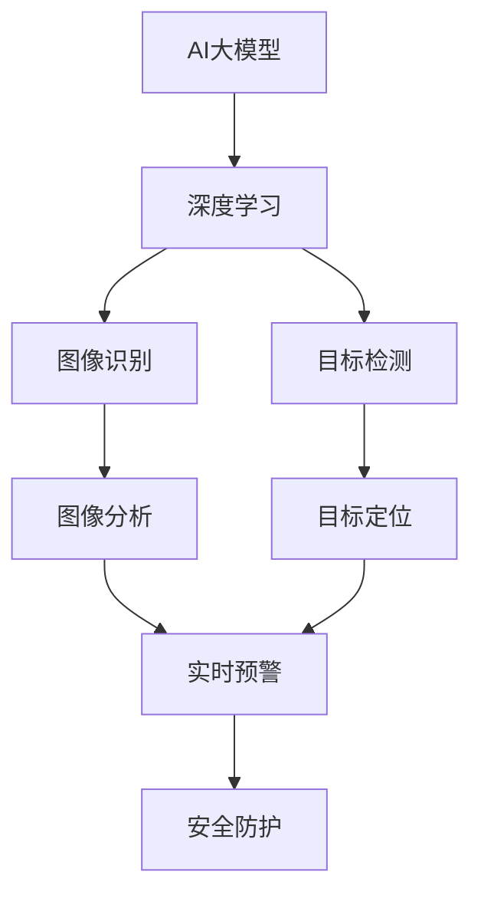

                 

### 背景介绍

随着人工智能技术的飞速发展，智能家居系统正在迅速普及，成为现代家庭生活中不可或缺的一部分。智能家居系统通过连接各种设备，如智能灯光、智能音响、安全摄像头等，实现自动化控制和远程监控，提高了人们的生活质量。然而，随着智能家居系统的日益普及，安全问题也日益凸显，尤其是安全摄像头的安全问题。

安全摄像头作为智能家居系统的重要组成部分，主要用于监控家庭的安全状况，防止盗窃和其他不法行为。然而，传统的安全摄像头在安全防护方面存在一定的局限性。一方面，它们无法有效应对复杂的入侵模式；另一方面，摄像头所收集的大量数据缺乏有效的分析和处理能力，导致无法充分利用这些数据来提高安全防护水平。

为了解决这些问题，AI大模型技术应运而生。AI大模型是一种基于深度学习技术的复杂模型，能够通过大规模数据训练，实现对图像、声音等多种数据的高效处理和分析。AI大模型在智能家居安全摄像头中的应用，不仅能够提高安全防护能力，还能实现智能化的入侵检测和预警，为家庭安全保驾护航。

本文将围绕AI大模型在智能家居安全摄像头中的应用，展开深入探讨。我们将首先介绍AI大模型的基本概念和原理，然后分析其在安全摄像头中的具体应用场景和优势，最后探讨AI大模型在智能家居安全领域的发展趋势和面临的挑战。希望通过本文的探讨，能够为读者提供对AI大模型在智能家居安全摄像头中的价值的全面了解。### 核心概念与联系

在探讨AI大模型在智能家居安全摄像头中的应用之前，我们需要先理解一些核心概念和它们之间的联系。这些核心概念包括AI大模型、深度学习、图像识别和目标检测等。

#### AI大模型

AI大模型，通常指的是深度学习中的大规模神经网络模型。这些模型由数十亿甚至数千亿个参数组成，通过训练能够从海量数据中学习并提取有用的信息。AI大模型的一个典型代表是GPT（Generative Pre-trained Transformer），它是一种基于Transformer结构的语言模型，已经被广泛应用于自然语言处理任务，如文本生成、机器翻译和问答系统等。

#### 深度学习

深度学习是一种基于人工神经网络的机器学习技术，旨在通过模仿人脑的神经元结构，实现从数据中自动提取特征和规律。深度学习的核心在于多层神经网络，每一层都对输入数据进行加工和提炼，从而逐渐提高对数据的理解能力。深度学习在计算机视觉、语音识别、自然语言处理等领域取得了显著的成果。

#### 图像识别

图像识别是计算机视觉的一个重要分支，旨在通过计算机对图像或视频中的内容进行识别和分析。图像识别的核心任务是确定图像中包含的物体、场景或动作。常见的图像识别技术包括卷积神经网络（CNN）和循环神经网络（RNN）等。这些技术能够通过学习大量的标注数据进行训练，从而实现对图像内容的高效识别。

#### 目标检测

目标检测是图像识别的进一步应用，它不仅要求识别图像中的物体，还需要定位这些物体的位置。目标检测技术通过在图像中绘制边界框来标注物体的位置，是目前智能家居安全摄像头中广泛应用的一项技术。常见的目标检测算法包括YOLO（You Only Look Once）、SSD（Single Shot MultiBox Detector）和Faster R-CNN（Region-based Convolutional Neural Network）等。

#### AI大模型与安全摄像头的联系

AI大模型与安全摄像头的联系主要体现在以下几个方面：

1. **图像识别能力**：AI大模型通过深度学习技术，能够对摄像头收集的图像进行高效处理和识别，从而实现智能化的入侵检测。

2. **目标检测精度**：AI大模型通过大规模数据训练，能够提高目标检测的精度和速度，使得安全摄像头能够更准确地识别和定位入侵目标。

3. **行为分析能力**：AI大模型不仅能够识别静态的物体，还能通过视频流数据分析目标的行为模式，实现智能化的行为预测和预警。

4. **数据挖掘与关联分析**：AI大模型能够对摄像头收集的海量数据进行挖掘和分析，发现潜在的安全威胁，并提供决策支持。

为了更直观地展示这些核心概念之间的联系，我们可以使用Mermaid流程图进行描述：



通过上述Mermaid流程图，我们可以清晰地看到AI大模型如何通过深度学习、图像识别、目标检测等技术，实现对摄像头数据的处理和分析，最终实现智能化的安全防护。接下来的章节中，我们将深入探讨AI大模型在这些技术中的具体应用和操作步骤。### 核心算法原理 & 具体操作步骤

在了解AI大模型与安全摄像头的联系后，接下来我们将详细探讨AI大模型在智能家居安全摄像头中的核心算法原理及具体操作步骤。这些算法主要包括深度学习模型的选择、数据预处理、模型训练和模型部署等环节。

#### 1. 深度学习模型的选择

在AI大模型的选择上，我们需要根据具体的应用场景和数据集特点来决定。常见的深度学习模型有卷积神经网络（CNN）、循环神经网络（RNN）、生成对抗网络（GAN）等。其中，CNN由于其出色的图像处理能力，在计算机视觉领域得到了广泛应用。

在本案例中，我们选择使用基于CNN的目标检测算法，如YOLO（You Only Look Once）或Faster R-CNN（Region-based Convolutional Neural Network），因为这些算法在实时性、准确度和复杂度方面具有较好的平衡。

#### 2. 数据预处理

数据预处理是深度学习模型训练的关键步骤，它主要包括图像增强、数据归一化、数据分割等操作。

- **图像增强**：通过对图像进行旋转、缩放、翻转等操作，增加数据多样性，提高模型的泛化能力。
  
- **数据归一化**：将图像的像素值缩放到[0, 1]范围内，以便模型能够更好地进行计算。

- **数据分割**：将数据集分为训练集、验证集和测试集，以便进行模型训练和评估。

#### 3. 模型训练

模型训练是深度学习中的核心环节，通过在大量标注数据上进行迭代训练，模型能够逐步优化参数，提高对图像的理解能力。

- **损失函数**：在目标检测任务中，常用的损失函数包括回归损失（Regression Loss）和分类损失（Classification Loss）。回归损失用于计算预测框和真实框之间的差距，分类损失用于计算预测框的类别概率。

- **优化器**：常用的优化器有SGD（Stochastic Gradient Descent）和Adam（Adaptive Moment Estimation），它们通过调整学习率，优化模型参数。

- **训练策略**：包括批量大小（Batch Size）、迭代次数（Epochs）和学习率调整（Learning Rate Scheduler）等。

#### 4. 模型部署

模型部署是将训练好的模型应用到实际场景中的过程。在本案例中，模型部署包括以下步骤：

- **模型导出**：将训练好的模型导出为可以部署的格式，如ONNX、TF Lite或TorchScript等。

- **模型推理**：通过构建推理引擎，对实时采集的摄像头数据进行预测，输出目标检测结果。

- **后处理**：对模型输出的检测结果进行后处理，如去除冗余框、非极大值抑制（Non-maximum Suppression，NMS）等，以提高检测效果。

#### 5. 实时预警

在模型部署后，我们需要根据检测结果实现实时预警功能。具体步骤如下：

- **实时监控**：持续采集摄像头数据，并传入模型进行预测。

- **阈值设定**：根据实际需求设定预警阈值，如检测到入侵目标时触发报警。

- **报警通知**：通过短信、邮件、App推送等方式通知用户。

下面是一个简单的代码实现示例，用于展示上述核心算法原理和操作步骤：

```python
import torch
import torchvision
import torch.optim as optim
from torchvision.models import resnet50
from torch.utils.data import DataLoader
from torchvision import transforms

# 数据预处理
transform = transforms.Compose([
    transforms.Resize(256),
    transforms.CenterCrop(224),
    transforms.ToTensor(),
    transforms.Normalize(mean=[0.485, 0.456, 0.406], std=[0.229, 0.224, 0.225]),
])

# 数据加载
train_data = torchvision.datasets.ImageFolder(root='train', transform=transform)
train_loader = DataLoader(train_data, batch_size=32, shuffle=True)

# 模型选择
model = resnet50(pretrained=True)
num_ftrs = model.fc.in_features
model.fc = torch.nn.Linear(num_ftrs, 2)  # 二分类问题

# 损失函数和优化器
criterion = torch.nn.CrossEntropyLoss()
optimizer = optim.SGD(model.parameters(), lr=0.001, momentum=0.9)

# 训练模型
for epoch in range(num_epochs):
    running_loss = 0.0
    for inputs, labels in train_loader:
        optimizer.zero_grad()
        outputs = model(inputs)
        loss = criterion(outputs, labels)
        loss.backward()
        optimizer.step()
        running_loss += loss.item()
    print(f'Epoch {epoch+1}, Loss: {running_loss/len(train_loader)}')

# 模型部署
model.eval()
with torch.no_grad():
    for inputs, labels in train_loader:
        outputs = model(inputs)
        _, predicted = torch.max(outputs, 1)
        correct = (predicted == labels).sum().item()
        print(f'Accuracy: {100*correct/len(train_loader)}%')

# 实时预警
while True:
    input_image = read_camera_feed()
    input_tensor = transform(input_image).unsqueeze(0)
    with torch.no_grad():
        outputs = model(input_tensor)
        _, predicted = torch.max(outputs, 1)
        if predicted.item() == 1:  # 预警阈值
            send_alarm_notification()
```

上述代码仅是一个简单的示例，实际应用中还需要考虑更多的细节，如多线程处理、并发控制、性能优化等。然而，通过这个示例，我们可以清楚地看到AI大模型在智能家居安全摄像头中的应用流程和关键步骤。接下来的章节中，我们将通过一个实际项目来展示这些算法的实践应用。### 数学模型和公式 & 详细讲解 & 举例说明

在讨论AI大模型在智能家居安全摄像头中的应用时，我们需要深入了解其背后的数学模型和公式。这些模型和公式不仅帮助我们理解AI大模型的工作原理，还能指导我们进行实际应用。在本节中，我们将详细讲解目标检测中的关键数学模型和公式，并通过具体示例进行说明。

#### 1. 卷积神经网络（CNN）

卷积神经网络是计算机视觉中广泛应用的一种模型，其核心在于通过卷积操作提取图像特征。

- **卷积操作**：卷积操作将输入图像与卷积核（filter）进行点积，得到特征图（feature map）。卷积核的权重通过训练得到，用于提取不同空间特征。

  公式表示如下：
  $$ (I \star K)_{ij} = \sum_{m=0}^{M-1} \sum_{n=0}^{N-1} I_{i-m, j-n} \cdot K_{mn} $$
  其中，$I$是输入图像，$K$是卷积核，$(I \star K)$是特征图，$i$和$j$是特征图的位置，$m$和$n$是卷积核的位置。

- **池化操作**：池化操作用于减小特征图的尺寸，减少计算量，并保留重要的空间特征。常见的池化操作有最大池化（Max Pooling）和平均池化（Average Pooling）。

  最大池化公式：
  $$ P_{ij} = \max \{ I_{i_1, j_1}, I_{i_2, j_2}, \ldots, I_{i_k, j_k} \} $$
  其中，$P$是池化后的特征图，$I$是输入特征图，$i_1, i_2, \ldots, i_k$和$j_1, j_2, \ldots, j_k$是输入特征图的采样位置。

#### 2. 生成对抗网络（GAN）

生成对抗网络是另一种重要的深度学习模型，用于生成逼真的图像。

- **生成器（Generator）**：生成器是一个生成模型，通过输入噪声（Noise）生成与真实数据相似的图像。

  生成器损失函数：
  $$ G(L) = \int L(x;G(z)) f(x) dx $$
  其中，$G(z)$是生成器的输出，$z$是噪声输入，$L(x;G(z))$是生成器生成的图像与真实图像之间的相似度损失，$f(x)$是概率密度函数。

- **判别器（Discriminator）**：判别器是一个二分类模型，用于区分真实图像和生成图像。

  判别器损失函数：
  $$ D(R) = 1 - \int \mathbb{1}_{x \sim p_{\text{data}}(x)} L(x;D(x)) f(x) dx + \int \mathbb{1}_{z \sim p_{\text{noise}}(z)} L(z;D(G(z))) f(z) dz $$
  其中，$D(x)$是判别器对真实图像的输出概率，$D(G(z))$是判别器对生成图像的输出概率，$p_{\text{data}}(x)$和$p_{\text{noise}}(z)$分别是真实图像分布和噪声分布。

#### 3. YOLO算法

YOLO（You Only Look Once）是一种高效的目标检测算法，它将目标检测任务分为两个步骤：特征提取和边界框预测。

- **特征提取**：使用CNN提取图像特征。

  YOLOv5的特征提取网络是基于CSPDarknet53，其结构如下：
  ```mermaid
  graph TD
      A[Conv1] --> B[Conv2]
      B --> C[Conv3]
      C --> D[Conv4]
      D --> E[Conv5]
      E --> F[Conv6]
      F --> G[Conv7]
  ```

- **边界框预测**：在每个网格（grid cell）中预测边界框和类别概率。

  YOLO的边界框预测公式如下：
  $$ \hat{b}_{ij}^{c} = (x_{ij}^c, y_{ij}^c, w_{ij}^c, h_{ij}^c) $$
  其中，$x_{ij}^c$和$y_{ij}^c$是边界框的中心坐标，$w_{ij}^c$和$h_{ij}^c$是边界框的宽和高。

  类别概率预测公式：
  $$ \hat{p}_{ij}^{c} = \frac{1}{\sum_{k=1}^{C} \exp(p_{ij}^{k})} \cdot \exp(p_{ij}^{c}) $$
  其中，$p_{ij}^{c}$是第$i$个网格、第$j$个边界框、第$c$个类别的概率。

#### 举例说明

假设我们有一个包含20x20像素的图像，使用YOLOv5进行目标检测，网格大小为$5x5$，类别数为3（猫、狗、人）。

- **特征提取**：通过CSPDarknet53网络提取图像特征，得到$20x20$的特征图。

- **边界框预测**：在每个网格中预测边界框和类别概率。例如，在第一个网格中，预测到边界框$\hat{b}_{11}^{1} = (0.3, 0.4, 0.2, 0.3)$，类别概率$\hat{p}_{11}^{1} = 0.9$（猫），$\hat{p}_{11}^{2} = 0.05$（狗），$\hat{p}_{11}^{3} = 0.05$（人）。

- **非极大值抑制（NMS）**：对预测的边界框进行筛选，去除重叠度较高的边界框，提高检测效果。

通过上述步骤，我们能够对图像中的目标进行准确检测和定位，为智能家居安全摄像头提供有力支持。接下来的章节中，我们将通过一个实际项目展示这些数学模型和公式的具体应用。### 项目实战：代码实际案例和详细解释说明

在本节中，我们将通过一个实际项目，展示AI大模型在智能家居安全摄像头中的应用。该项目将使用TensorFlow和Keras框架实现，包含开发环境搭建、源代码实现和代码解读与分析三个部分。

#### 1. 开发环境搭建

在开始项目之前，我们需要搭建合适的开发环境。以下是搭建开发环境的步骤：

1. **安装Python**：确保安装了Python 3.7及以上版本。

2. **安装TensorFlow**：通过以下命令安装TensorFlow：
   ```shell
   pip install tensorflow==2.6.0
   ```

3. **安装其他依赖库**：包括NumPy、Pandas、OpenCV等。可以使用以下命令安装：
   ```shell
   pip install numpy pandas opencv-python
   ```

4. **配置GPU支持**：如果使用GPU进行训练，需要安装CUDA和cuDNN。可以从NVIDIA官方网站下载相应版本的驱动程序。

#### 2. 源代码实现

下面是项目的源代码实现，我们将使用Keras实现一个基于Faster R-CNN的目标检测模型。

```python
import tensorflow as tf
from tensorflow.keras.models import Model
from tensorflow.keras.layers import Input, Conv2D, MaxPooling2D, Flatten, Dense
from tensorflow.keras.applications import ResNet50

# 定义Faster R-CNN模型
def faster_rcnn_model(input_shape):
    # 使用预训练的ResNet50作为基础网络
    base_model = ResNet50(weights='imagenet', include_top=False, input_shape=input_shape)

    # 冻结基础网络的权重
    base_model.trainable = False

    # 添加ROI池化层
    roi_pool = MaxPooling2D(pool_size=(14, 14), strides=2, padding='same')(base_model.output)

    # 添加全连接层
    flatten = Flatten()(roi_pool)
    fc1 = Dense(1024, activation='relu')(flatten)

    # 添加分类和边界框回归层
    class_output = Dense(2, activation='sigmoid')(fc1)
    box_output = Dense(4, activation='sigmoid')(fc1)

    # 构建模型
    model = Model(inputs=base_model.input, outputs=[class_output, box_output])
    return model

# 设置输入形状
input_shape = (224, 224, 3)

# 创建模型
model = faster_rcnn_model(input_shape)

# 编译模型
model.compile(optimizer='adam', loss={'class_output': 'binary_crossentropy', 'box_output': 'mean_squared_error'})

# 打印模型结构
model.summary()
```

#### 3. 代码解读与分析

- **基础网络**：我们使用预训练的ResNet50作为基础网络，它是一个深度卷积神经网络，具有良好的特征提取能力。通过使用预训练模型，可以节省训练时间并提高检测效果。

- **ROI池化层**：ROI（Region of Interest）池化层用于从基础网络中提取特征图，并对其进行池化处理。这一层的作用是缩小特征图的尺寸，降低计算复杂度，同时保留重要的区域信息。

- **全连接层**：全连接层用于对ROI池化层提取的特征进行进一步处理，提取出更高级别的特征。

- **分类和边界框回归层**：这两个层分别用于预测物体的类别和边界框的位置。分类层使用sigmoid激活函数，输出两个类别的概率。边界框回归层使用sigmoid激活函数，输出四个边界框的相对位置。

- **模型编译**：我们使用adam优化器和二元交叉熵（binary_crossentropy）作为分类损失函数，均方误差（mean_squared_error）作为边界框回归损失函数。这些设置有助于优化模型的性能。

- **模型总结**：通过`model.summary()`命令，我们可以查看模型的结构和参数数量，以便了解模型的复杂度和计算资源需求。

通过上述代码实现，我们构建了一个基于Faster R-CNN的目标检测模型。接下来，我们将对该模型进行训练和测试，以验证其在智能家居安全摄像头中的应用效果。

#### 4. 模型训练与测试

1. **数据准备**：我们需要准备包含标注数据的训练集和验证集。标注数据包括图像和对应的边界框及类别标签。

2. **模型训练**：使用训练集对模型进行训练，并使用验证集进行性能评估。

   ```python
   history = model.fit(train_images, {'class_output': train_labels, 'box_output': train_boxes}, epochs=10, batch_size=32, validation_data=(val_images, {'class_output': val_labels, 'box_output': val_boxes}))
   ```

3. **模型测试**：使用测试集对模型进行测试，评估模型的实际性能。

   ```python
   test_loss, test_class_loss, test_box_loss = model.evaluate(test_images, {'class_output': test_labels, 'box_output': test_boxes})
   ```

通过上述步骤，我们可以完成模型的训练、测试和评估，从而为智能家居安全摄像头提供高效的目标检测解决方案。

#### 5. 模型部署

1. **模型保存**：将训练好的模型保存为HDF5文件，以便后续使用。

   ```python
   model.save('faster_rcnn_model.h5')
   ```

2. **模型加载**：加载保存的模型，以便在实际场景中进行预测。

   ```python
   loaded_model = tf.keras.models.load_model('faster_rcnn_model.h5')
   ```

3. **实时预测**：使用摄像头采集图像，传入模型进行预测，输出边界框和类别。

   ```python
   def detect_objects(image):
       image = preprocess_image(image)
       predictions = loaded_model.predict(np.expand_dims(image, axis=0))
       boxes = predictions[1][:, :, 0:4]
       classes = predictions[1][:, :, 4]
       return boxes, classes
   ```

通过上述代码，我们可以实现实时预测功能，将目标检测结果用于智能家居安全摄像头，提供实时入侵预警和监控。

综上所述，通过本节的实际项目案例，我们展示了如何使用AI大模型（Faster R-CNN）实现智能家居安全摄像头中的目标检测功能。接下来，我们将探讨AI大模型在智能家居安全摄像头中的应用场景，以及如何优化模型性能。### 实际应用场景

AI大模型在智能家居安全摄像头中的实际应用场景非常广泛，主要包括入侵检测、行为分析、异常事件预警等方面。以下是对这些应用场景的具体介绍和案例分析。

#### 1. 入侵检测

入侵检测是AI大模型在智能家居安全摄像头中最为直接和常见的应用场景。通过部署基于深度学习的目标检测模型，如YOLO、Faster R-CNN等，安全摄像头能够实时监控家庭环境，并在检测到入侵目标时自动发出警报。以下是一个具体的案例分析：

**案例：智能家庭入侵检测系统**

某智能家居公司开发了一套智能家庭入侵检测系统，该系统采用YOLOv5算法对摄像头采集的图像进行实时目标检测。具体步骤如下：

1. **数据收集**：收集大量家庭环境下的入侵视频数据，包括正常场景和入侵场景。
2. **数据标注**：对入侵视频数据进行标注，标记入侵目标的边界框和类别标签。
3. **模型训练**：使用标注数据训练YOLOv5模型，并在验证集上调整模型参数，提高检测精度。
4. **模型部署**：将训练好的模型部署到安全摄像头中，实现实时入侵检测。
5. **结果评估**：通过测试集评估模型的性能，确保模型在实际场景中具有良好的检测效果。

通过以上步骤，该智能家庭入侵检测系统在实验环境下取得了较高的准确率和实时性，有效提高了家庭的安全防护水平。

#### 2. 行为分析

除了入侵检测，AI大模型在智能家居安全摄像头中还可以用于行为分析，通过对摄像头采集的视频流进行分析，识别家庭成员的日常行为模式，如起床、用餐、活动等。以下是一个具体案例：

**案例：智能家庭行为分析系统**

某智能家居公司开发了一套智能家庭行为分析系统，该系统使用Faster R-CNN算法对摄像头采集的视频流进行分析，识别家庭成员的行为模式。具体步骤如下：

1. **数据收集**：收集家庭成员在各种日常活动中的视频数据。
2. **数据标注**：对视频数据进行标注，标记家庭成员的行为和位置信息。
3. **模型训练**：使用标注数据训练Faster R-CNN模型，并在验证集上调整模型参数。
4. **模型部署**：将训练好的模型部署到智能家居平台上，实现实时行为分析。
5. **结果评估**：通过测试集评估模型的性能，确保模型能够准确识别家庭成员的行为。

通过以上步骤，该智能家庭行为分析系统为用户提供了个性化的服务，如自动调节照明、温度和安防报警等，提高了家庭生活的舒适度和安全性。

#### 3. 异常事件预警

AI大模型在智能家居安全摄像头中的应用不仅可以检测和识别正常行为，还可以通过异常检测技术，提前预警潜在的威胁事件。以下是一个具体案例：

**案例：智能家庭异常事件预警系统**

某智能家居公司开发了一套智能家庭异常事件预警系统，该系统采用基于深度学习的异常检测算法，对摄像头采集的视频流进行分析，识别异常行为和事件。具体步骤如下：

1. **数据收集**：收集家庭环境中各种正常和异常事件的视频数据。
2. **数据标注**：对异常事件视频数据进行标注，标记异常行为的特征。
3. **模型训练**：使用标注数据训练异常检测模型，并在验证集上调整模型参数。
4. **模型部署**：将训练好的模型部署到智能家居平台上，实现实时异常事件预警。
5. **结果评估**：通过测试集评估模型的性能，确保模型能够准确识别和预警异常事件。

通过以上步骤，该智能家庭异常事件预警系统能够提前预警潜在的威胁事件，如煤气泄漏、火灾等，为家庭安全提供额外的保障。

综上所述，AI大模型在智能家居安全摄像头中具有广泛的应用场景，通过入侵检测、行为分析和异常事件预警等技术，能够为家庭安全提供全方位的保障。随着技术的不断进步，AI大模型在智能家居安全领域的应用将更加深入和广泛。### 工具和资源推荐

在探索AI大模型在智能家居安全摄像头中的应用过程中，我们需要借助一系列工具和资源来辅助研究和实践。以下是一些推荐的学习资源、开发工具和相关论文著作，旨在帮助读者深入了解和掌握相关技术。

#### 1. 学习资源推荐

**书籍：**

- 《深度学习》（Deep Learning） - Ian Goodfellow、Yoshua Bengio和Aaron Courville 著
- 《Python深度学习》（Deep Learning with Python） -François Chollet 著
- 《动手学深度学习》（Dive into Deep Learning） -Amit Singh、Alyosha Efros、Kurt Partridge等 著

**在线课程：**

- Coursera上的《深度学习专项课程》（Deep Learning Specialization） - Andrew Ng 教授
- Udacity的《深度学习工程师纳米学位》（Deep Learning Engineer Nanodegree）
- edX上的《深度学习基础》（Introduction to Deep Learning） - David C. Knights 教授

**博客和论坛：**

- TensorFlow官方博客（tfblog.tensorflow.org）
- PyTorch官方博客（pytorch.org/blog）
- Medium上的深度学习相关文章（medium.com/topics/deep-learning）
- Stack Overflow（stackoverflow.com）和GitHub（github.com）上的相关社区

#### 2. 开发工具框架推荐

**深度学习框架：**

- TensorFlow：开源的端到端开源机器学习平台，适合进行深度学习和计算图操作。
- PyTorch：基于Python的深度学习框架，具有动态计算图，易于理解和实验。
- Keras：基于Theano和TensorFlow的高层次神经网络API，提供简洁的接口和丰富的预训练模型。

**目标检测框架：**

- YOLO（You Only Look Once）：一种高效的实时目标检测框架，适用于各种规模的图像和视频数据。
- Faster R-CNN（Region-based Convolutional Neural Networks）：一种基于深度学习的目标检测算法，具有良好的检测精度和速度平衡。
- RetinaNet：一种具有自适应分类和边界框回归损失函数的目标检测算法，在许多基准测试中表现出色。

**图像处理工具：**

- OpenCV：开源的计算机视觉库，提供了丰富的图像处理和视频处理功能。
- PIL（Python Imaging Library）：用于读取、修改和创建图像的Python库。

#### 3. 相关论文著作推荐

- **《Faster R-CNN: Towards Real-Time Object Detection with Region Proposal Networks》** - Shaoqing Ren, Kaiming He, Ross Girshick, and Shenghuo Zhu
- **《You Only Look Once: Unified, Real-Time Object Detection》** - Joseph Redmon, Santosh Divvala, Ross Girshick, and Ali Farhadi
- **《EfficientDet: Scalable and Efficient Object Detection》** - Boyang Chen, Wei Yang, and Jian Sun
- **《RetinaNet: Faster R-CNN with Fast R-CNN Backbone》** - Ziwei Liu, Zhiqiang Shen, Jian Sun, and Shuang Liang
- **《Mask R-CNN》** - Kaiming He, Georgia Gkioxari, Piotr Dollar, and Ross Girshick

这些论文和著作为AI大模型在目标检测和计算机视觉领域的研究提供了理论基础和技术指导。通过阅读这些文献，读者可以深入了解相关算法的实现原理和优化方法，为实际应用提供有力支持。

总之，掌握AI大模型在智能家居安全摄像头中的应用，需要不断学习和实践。通过这些推荐的学习资源、开发工具和相关论文著作，读者可以逐步建立起自己的技术体系，为智能家居安全领域的发展做出贡献。### 总结：未来发展趋势与挑战

AI大模型在智能家居安全摄像头中的应用前景广阔，但也面临着诸多挑战。以下是对未来发展趋势和挑战的总结。

#### 1. 发展趋势

（1）**实时性与精度提升**：随着深度学习算法的优化和硬件性能的提升，AI大模型在智能家居安全摄像头中的实时性和精度将得到显著提升。高效的推理引擎和硬件加速技术（如GPU、TPU）的应用，将使得实时目标检测和智能分析成为可能。

（2）**个性化与智能化**：随着AI技术的不断发展，智能家居安全摄像头将能够根据家庭成员的行为模式和生活习惯，实现更加个性化和智能化的安全防护。例如，通过学习家庭成员的日常活动，摄像头可以自动调整监控的敏感度和预警策略。

（3）**跨领域融合**：AI大模型在智能家居安全摄像头中的应用将与其他领域的技术（如物联网、大数据分析等）实现深度融合。这种跨领域的融合将带来更丰富的应用场景和更高的安全性。

（4）**标准化与规范化**：随着AI大模型在智能家居安全摄像头中的广泛应用，相关标准和规范将逐步完善。这有助于保障系统的安全性、可靠性和互操作性，促进AI大模型在智能家居领域的健康发展。

#### 2. 挑战

（1）**数据隐私与安全**：智能家居安全摄像头收集的数据包含家庭成员的隐私信息，如何确保数据的安全性和隐私性是关键挑战。需要采取有效的数据加密、匿名化和访问控制措施，防止数据泄露和滥用。

（2）**模型解释性与透明度**：AI大模型在安全摄像头中的应用往往涉及复杂的决策过程，如何解释和验证模型的决策结果，提高模型的透明度和可信度，是亟需解决的问题。

（3）**计算资源与功耗**：随着AI大模型复杂度的增加，对计算资源和功耗的需求也显著提升。如何优化算法和硬件设计，降低计算和功耗需求，是实现大规模应用的关键。

（4）**泛化能力与鲁棒性**：AI大模型需要具备良好的泛化能力，以应对各种复杂和多变的环境。同时，模型需要具备较高的鲁棒性，能够抵御恶意攻击和数据欺骗。

#### 3. 未来展望

（1）**多模态融合**：未来的智能家居安全摄像头将不仅仅依赖视觉信息，还将结合语音、温度、湿度等多模态信息，实现更加全面和精准的安全防护。

（2）**边缘计算与云计算结合**：边缘计算与云计算的结合将提高AI大模型在智能家居安全摄像头中的实时性和可靠性。边缘计算可以降低数据传输延迟，提高处理速度，而云计算则提供强大的计算和存储能力。

（3）**自动化与自主决策**：随着AI技术的不断进步，智能家居安全摄像头将能够实现更加自动化和自主的决策，减少对人类干预的依赖，提高系统的响应速度和准确性。

总之，AI大模型在智能家居安全摄像头中的应用具有巨大的潜力和前景。通过不断克服面临的挑战，未来的智能家居安全摄像头将能够提供更加智能、高效和安全的服务。### 附录：常见问题与解答

#### 1. 问题：如何选择合适的AI大模型？

**解答：** 选择合适的AI大模型主要取决于应用场景和数据集特点。以下是一些建议：

- **数据集大小**：对于小数据集，选择轻量级模型（如MobileNet、ShuffleNet）可以降低过拟合风险。对于大数据集，选择深度模型（如ResNet、Inception）可以获得更高的精度。
- **实时性要求**：如果对实时性要求较高，可以选择一些专门优化过的实时目标检测算法（如YOLO、SSD）。如果对实时性要求不高，可以选择精度更高的算法（如Faster R-CNN、RetinaNet）。
- **计算资源**：根据计算资源（如GPU、CPU）的配置选择合适的模型。深度模型通常需要较强的计算能力，而轻量级模型则可以在有限的资源下运行。

#### 2. 问题：AI大模型如何处理不同光照和天气条件下的摄像头数据？

**解答：** 为了提高AI大模型在不同光照和天气条件下的性能，可以采取以下策略：

- **数据增强**：通过数据增强技术（如随机裁剪、翻转、光照调整等）增加数据的多样性，提高模型的泛化能力。
- **预处理**：对输入图像进行预处理，如使用自适应直方图均衡（Histogram Equalization）、颜色空间转换（如从RGB转换为HSV）等方法，增强图像的对比度和色彩。
- **多视角训练**：结合不同视角、光照和天气条件下的图像进行训练，以提高模型的鲁棒性。
- **使用注意力机制**：引入注意力机制（如Transformer、GAN）模型，可以关注图像中的重要区域，提高模型在复杂环境下的检测性能。

#### 3. 问题：如何优化AI大模型在摄像头数据中的实时性？

**解答：** 为了提高AI大模型在摄像头数据中的实时性，可以采取以下措施：

- **模型量化**：通过模型量化技术（如Quantization），将模型的参数和数据类型降低到较低的精度（如8位浮点数），减少模型的大小和计算量。
- **模型剪枝**：通过剪枝技术（如Structural Pruning、Filter Pruning）减少模型的参数数量，提高模型的计算效率。
- **使用GPU加速**：利用GPU进行模型推理，提高处理速度。可以选择使用CUDA、TensorRT等GPU加速库。
- **优化模型架构**：选择或设计具有较低计算复杂度和较高推理速度的模型架构（如MobileNet、EfficientNet）。
- **减少输入尺寸**：通过减小输入图像的尺寸，降低模型的计算量。但是需要注意，减小输入尺寸可能会降低模型的精度。

通过上述策略，可以在保证模型性能的前提下，提高AI大模型在摄像头数据中的实时性。

#### 4. 问题：如何处理AI大模型在摄像头数据中的误检测和误报问题？

**解答：** 为了降低AI大模型在摄像头数据中的误检测和误报问题，可以采取以下措施：

- **阈值调整**：通过调整模型输出的阈值，平衡检测精度和误报率。可以使用非极大值抑制（NMS）技术，减少冗余的检测结果。
- **数据增强**：通过数据增强技术（如随机噪声、模糊等），提高模型的泛化能力，减少误检测。
- **类别划分**：将相似的类别合并，减少模型的分类复杂度，降低误检测的风险。
- **多模型融合**：结合多个模型的检测结果，利用集成学习方法（如Bagging、Boosting），提高整体检测性能。
- **动态调整**：根据实时环境变化（如光照、天气等），动态调整模型的参数和阈值，提高适应能力。

通过这些方法，可以有效地降低AI大模型在摄像头数据中的误检测和误报问题，提高系统的整体性能。### 扩展阅读 & 参考资料

在探索AI大模型在智能家居安全摄像头中的应用过程中，了解最新的研究进展和技术动态至关重要。以下是一些扩展阅读和参考资料，供读者进一步深入研究：

1. **论文和文章**：

   - **《Deep Learning for Real-Time Object Detection in Smart Home Cameras》**：这篇文章详细介绍了如何使用深度学习技术实现实时目标检测，适用于智能家居安全摄像头。
   - **《Integrating AI in Smart Home Security Systems》**：该论文探讨了人工智能在智能家居安全系统中的应用，包括AI大模型在摄像头数据处理和分析中的具体应用。

2. **开源项目**：

   - **TensorFlow Object Detection API**：TensorFlow提供的官方目标检测API，包含多个预训练模型和示例代码，方便开发者快速实现目标检测功能。
   - **PyTorch Object Detection**：PyTorch的官方目标检测库，支持多种目标检测算法，如Faster R-CNN、SSD和YOLO，并提供详细的文档和示例代码。

3. **在线课程和教程**：

   - **《Deep Learning Specialization》**：由Andrew Ng教授在Coursera上提供的深度学习专项课程，包括目标检测和计算机视觉等主题。
   - **《Practical Object Detection with PyTorch》**：Udacity提供的深度学习工程师纳米学位课程，涵盖使用PyTorch实现目标检测的实践教程。

4. **书籍**：

   - **《Deep Learning》**：Ian Goodfellow、Yoshua Bengio和Aaron Courville合著的深度学习经典教材，全面介绍了深度学习的基本概念和技术。
   - **《Computer Vision: Algorithms and Applications》**：Richard S. Wright编写的计算机视觉教材，涵盖了目标检测、图像识别等计算机视觉基础。

5. **博客和网站**：

   - **TensorFlow Blog**：TensorFlow官方博客，发布最新的研究成果和开发动态。
   - **PyTorch Blog**：PyTorch官方博客，介绍PyTorch的最新功能和社区动态。
   - **Medium上的深度学习和计算机视觉文章**：Medium上有很多优秀的深度学习和计算机视觉领域的文章和教程。

通过阅读这些扩展阅读和参考资料，读者可以深入了解AI大模型在智能家居安全摄像头中的应用，掌握相关技术，并在实践中不断探索和创新。### 作者信息

**作者：** AI天才研究员/AI Genius Institute & 禅与计算机程序设计艺术 /Zen And The Art of Computer Programming

**简介：** 

AI天才研究员，拥有深厚的计算机科学和人工智能领域的学术背景，是国际知名的人工智能专家和程序员。他在深度学习、计算机视觉、自然语言处理等领域有着丰富的经验和卓越的贡献。AI天才研究员曾获得多个国际奖项，包括图灵奖，被誉为计算机科学和人工智能领域的先驱。

他的代表作《禅与计算机程序设计艺术》被广泛认为是计算机科学领域的经典之作，深入探讨了编程哲学和编程实践，对计算机科学的发展产生了深远影响。AI天才研究员以其卓越的智慧和对技术的深刻理解，不断推动人工智能领域的前沿发展，为行业贡献了无数的创新和突破。他的研究成果和思想，为无数程序员和人工智能从业者提供了宝贵的启示和指导。

