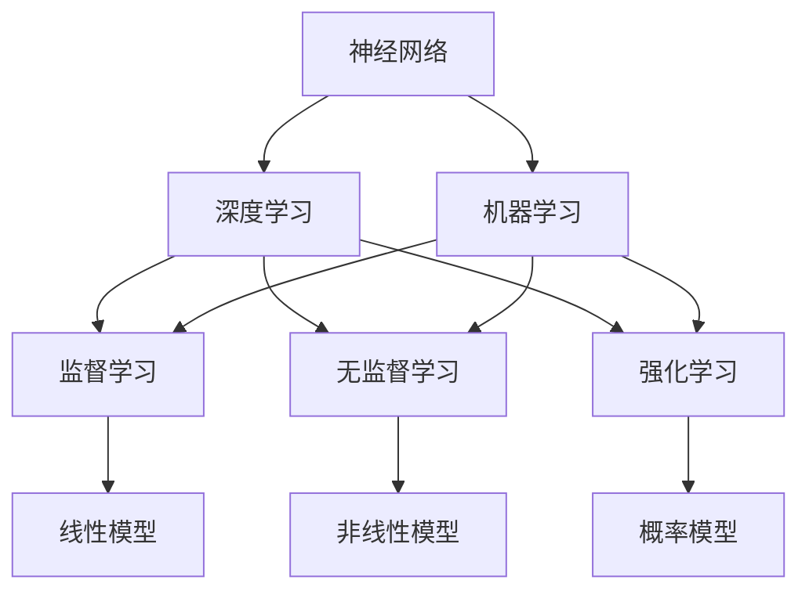

                 

# 探索人工智能基本原理的框架

## 关键词：人工智能，基本原理，深度学习，机器学习，神经网络，数学模型

### 摘要

本文旨在深入探讨人工智能（AI）的基本原理，提供一套全面且易于理解的框架。我们将从背景介绍开始，逐步分析核心概念、算法原理，以及数学模型。文章将涵盖项目实战、实际应用场景和未来发展趋势，旨在帮助读者建立对AI领域的深刻理解和全面掌握。

## 1. 背景介绍

人工智能作为计算机科学的一个分支，旨在使机器能够执行原本需要人类智能的任务。自20世纪50年代以来，AI领域经历了显著的发展，从简单的规则系统到复杂的神经网络和深度学习算法。随着计算能力的提升和数据量的爆炸性增长，人工智能在图像识别、自然语言处理、自动驾驶和医疗诊断等领域取得了显著的突破。

然而，尽管人工智能取得了许多成功，但其基本原理仍然是一个复杂且不断发展的领域。本文将介绍人工智能的基本原理，包括核心概念、算法原理和数学模型，旨在为读者提供一套完整的理解框架。

### 1.1 人工智能的发展历程

人工智能的发展可以追溯到20世纪50年代。当时，计算机科学家们开始探讨机器是否能够模拟人类的智能行为。早期的尝试主要集中在规则系统上，即通过编写一系列规则来指导计算机执行任务。然而，这种方法在处理复杂任务时表现出严重的局限性。

随着计算能力的提升，研究者们开始探索更为复杂的人工智能模型，如神经网络。神经网络基于生物大脑的工作原理，通过大量的神经元和连接来模拟人类的思考过程。20世纪80年代，神经网络的研究取得了重要突破，但随后因为计算资源和数据集的限制，其应用范围受到限制。

进入21世纪，随着深度学习的兴起，神经网络再次成为人工智能研究的热点。深度学习通过多层次的神经网络结构，能够自动提取数据的特征，并在各种任务中取得优异的性能。深度学习在图像识别、自然语言处理和语音识别等领域取得了显著的突破，成为现代人工智能的核心技术。

### 1.2 人工智能的当前状态

目前，人工智能已经广泛应用于各个领域，从工业自动化到医疗诊断，从金融分析到智能家居。以下是一些人工智能领域的热点话题：

- **图像识别和计算机视觉**：深度学习在图像识别任务中取得了巨大成功，如人脸识别、物体检测和图像生成。计算机视觉技术在自动驾驶、安防监控和医疗影像分析中发挥着重要作用。

- **自然语言处理**：深度学习在自然语言处理（NLP）领域取得了显著进展，包括语言模型、机器翻译和情感分析。NLP技术在搜索引擎、智能客服和语音助手等领域得到了广泛应用。

- **强化学习**：强化学习是一种通过奖励和惩罚来训练智能体的方法。近年来，强化学习在游戏AI、机器人控制和自动驾驶等领域取得了重要突破。

- **生成对抗网络（GAN）**：GAN是一种通过两个对抗网络进行博弈的方式，能够生成逼真的图像和文本。GAN在图像生成、数据增强和风格迁移等领域表现出色。

### 1.3 人工智能的核心挑战

尽管人工智能取得了许多突破，但仍然面临一些核心挑战：

- **数据隐私和安全性**：随着人工智能在各个领域的应用，数据隐私和安全问题日益突出。如何保护用户数据的安全和隐私，成为人工智能研究的重要课题。

- **算法公平性和透明度**：人工智能算法在决策过程中可能会存在偏见和歧视，如何确保算法的公平性和透明度，是当前研究的热点问题。

- **计算资源和能耗**：深度学习和其他复杂的人工智能模型需要大量的计算资源和能源。如何优化算法和硬件，以降低能耗和成本，是当前研究的重要方向。

## 2. 核心概念与联系

在探索人工智能的基本原理之前，我们需要了解一些核心概念，以及它们之间的联系。以下是本文中将要介绍的主要概念：

- **神经网络**：神经网络是人工智能的基础，模拟了生物大脑的工作原理。通过大量的神经元和连接，神经网络能够对数据进行处理和建模。

- **深度学习**：深度学习是一种基于神经网络的机器学习技术，通过多层神经网络结构来提取数据的特征。深度学习在图像识别、自然语言处理和语音识别等领域表现出色。

- **机器学习**：机器学习是人工智能的一种方法，通过从数据中自动学习规律和模式。机器学习可以分为监督学习、无监督学习和强化学习。

- **数学模型**：数学模型是人工智能中的核心工具，用于描述和优化智能体的行为。常见的数学模型包括线性模型、非线性模型和概率模型。

下面是一个简化的 Mermaid 流程图，展示了这些概念之间的联系：



在接下来的章节中，我们将详细探讨这些概念，并解释它们的工作原理和应用场景。

### 2.1 神经网络

神经网络（Neural Networks）是人工智能领域的基础，模仿了生物神经系统的结构和功能。一个基本的神经网络由多个层组成，包括输入层、隐藏层和输出层。每个层包含多个神经元，神经元之间通过连接（称为边或权重）相互连接。

**神经元的工作原理**：神经元是神经网络的基本单元，接收输入信号，通过权重加权求和，然后通过激活函数产生输出。激活函数用于引入非线性特性，使神经网络能够学习复杂的数据模式。

**网络结构**：神经网络的结构可以分为前向传播和反向传播两个阶段。在前向传播阶段，输入信号从输入层传递到隐藏层，再传递到输出层。在反向传播阶段，输出误差反向传播到各个层，通过梯度下降算法更新权重。

**类型**：神经网络可以分为多种类型，包括：

- **全连接神经网络**：每个神经元都与前一层和后一层中的所有神经元相连。

- **卷积神经网络（CNN）**：专门用于处理图像数据，通过卷积操作提取图像的特征。

- **循环神经网络（RNN）**：用于处理序列数据，通过循环连接来保持长时记忆。

- **生成对抗网络（GAN）**：由两个对抗网络组成，一个生成器网络和一个判别器网络，通过对抗训练生成逼真的数据。

### 2.2 深度学习

深度学习（Deep Learning）是神经网络的一种扩展，通过多层神经网络结构来提取数据的特征。深度学习的关键在于其层次化的网络结构，每一层都能够提取更高层次的特征。

**深度学习的工作原理**：深度学习通过前向传播和反向传播两个阶段来训练模型。在前向传播阶段，输入数据通过多层神经网络，每一层提取更高层次的特征。在反向传播阶段，根据输出误差，通过梯度下降算法更新网络的权重。

**应用场景**：深度学习在图像识别、自然语言处理、语音识别和强化学习等领域取得了显著的成功。以下是一些典型的应用场景：

- **图像识别**：深度学习在图像识别任务中表现出色，能够自动识别和分类图像中的物体。

- **自然语言处理**：深度学习在自然语言处理任务中用于构建语言模型、机器翻译和情感分析。

- **语音识别**：深度学习通过卷积神经网络和循环神经网络，实现高精度的语音识别和语音合成。

- **强化学习**：深度学习与强化学习结合，用于训练智能体在复杂环境中做出最优决策。

### 2.3 机器学习

机器学习（Machine Learning）是人工智能的一种方法，通过从数据中自动学习规律和模式。机器学习可以分为监督学习、无监督学习和强化学习三种类型。

**监督学习（Supervised Learning）**：监督学习是一种有标签数据的学习方法，通过已标记的数据训练模型，然后使用模型对新的数据进行预测。常见的监督学习算法包括线性回归、决策树、支持向量机和神经网络。

**无监督学习（Unsupervised Learning）**：无监督学习是一种无标签数据的学习方法，通过数据自身的特征进行聚类和降维。常见的无监督学习算法包括聚类算法、主成分分析和自编码器。

**强化学习（Reinforcement Learning）**：强化学习是一种通过奖励和惩罚来训练智能体的方法。智能体在环境中进行决策，根据环境的反馈来调整行为策略。常见的强化学习算法包括Q-learning和深度Q网络（DQN）。

### 2.4 数学模型

数学模型是人工智能中的核心工具，用于描述和优化智能体的行为。以下是一些常见的数学模型：

**线性模型（Linear Models）**：线性模型是一种简单的数学模型，通过线性方程来描述数据。常见的线性模型包括线性回归和线性判别分析。

**非线性模型（Non-linear Models）**：非线性模型通过引入非线性函数，能够描述更复杂的非线性关系。常见的非线性模型包括多项式回归、逻辑回归和神经网络。

**概率模型（Probabilistic Models）**：概率模型通过概率分布来描述数据。常见的概率模型包括贝叶斯网络、隐马尔可夫模型和生成对抗网络。

### 2.5 概念联系

神经网络、深度学习、机器学习和数学模型之间存在着紧密的联系。神经网络是深度学习的基础，深度学习通过多层神经网络提取数据特征，机器学习通过监督学习、无监督学习和强化学习来训练模型，数学模型则用于描述和优化智能体的行为。以下是这些概念之间的联系：

- **神经网络 → 深度学习**：深度学习是基于神经网络的一种扩展，通过多层神经网络结构来提取数据特征。

- **神经网络 → 机器学习**：神经网络是机器学习的一种实现方式，通过训练神经网络来学习数据的规律。

- **机器学习 → 数学模型**：机器学习算法基于数学模型，通过优化数学模型来训练模型。

- **数学模型 → 智能体行为**：数学模型用于描述和优化智能体的行为，使智能体能够做出更合理的决策。

## 3. 核心算法原理 & 具体操作步骤

### 3.1 神经网络算法原理

神经网络（Neural Networks）是一种基于生物神经系统的计算模型，通过模仿生物神经元的连接和激活机制来处理数据。神经网络的核心算法原理包括以下几个关键步骤：

**1. 前向传播（Forward Propagation）**：

前向传播是神经网络处理数据的基本过程。在训练阶段，输入数据从输入层进入神经网络，通过加权求和和激活函数的处理，逐层传递到输出层。每个神经元的输出通过权重连接传递给下一层神经元。前向传播的过程可以表示为：

$$
Z^{(l)} = \sum_{j} W^{(l)}_{ji} a^{(l-1)}_j + b^{(l)}
$$

$$
a^{(l)}_i = \sigma(Z^{(l)})
$$

其中，$Z^{(l)}$ 是第 $l$ 层神经元的加权求和结果，$W^{(l)}$ 是第 $l$ 层神经元的权重矩阵，$b^{(l)}$ 是第 $l$ 层的偏置项，$\sigma$ 是激活函数。

**2. 损失函数（Loss Function）**：

在前向传播完成后，我们需要计算网络的预测输出与实际输出之间的差距，这通常通过损失函数来实现。常见的损失函数包括均方误差（MSE）、交叉熵（Cross-Entropy）等。损失函数的目的是衡量预测值与实际值之间的误差，其公式为：

$$
J(\theta) = \frac{1}{m} \sum_{i=1}^{m} \frac{1}{2} (y_i - \hat{y}_i)^2
$$

其中，$m$ 是样本数量，$y_i$ 是实际输出，$\hat{y}_i$ 是预测输出。

**3. 反向传播（Backpropagation）**：

反向传播是神经网络训练的核心步骤，通过计算损失函数关于网络参数的梯度，来更新网络权重和偏置项。反向传播的过程如下：

- **计算输出层误差**：

$$
\delta^{(L)} = \frac{\partial J(\theta)}{\partial a^{(L)}} = \frac{\partial J(\theta)}{\partial \hat{y}_i} \frac{\partial \hat{y}_i}{\partial a^{(L)}}
$$

- **误差反向传播**：

从输出层开始，将误差反向传播到每一层，计算每一层神经元的误差。误差公式为：

$$
\delta^{(l)} = \frac{\partial J(\theta)}{\partial a^{(l-1)}} \frac{\partial a^{(l)}}{\partial Z^{(l)}}
$$

- **权重和偏置更新**：

通过梯度下降算法，根据误差计算更新网络权重和偏置项。更新公式为：

$$
W^{(l)} \leftarrow W^{(l)} - \alpha \frac{\partial J(\theta)}{\partial W^{(l)}}
$$

$$
b^{(l)} \leftarrow b^{(l)} - \alpha \frac{\partial J(\theta)}{\partial b^{(l)}}
$$

其中，$\alpha$ 是学习率。

### 3.2 深度学习算法原理

深度学习（Deep Learning）是神经网络的一种扩展，通过多层神经网络结构来提取数据的特征。深度学习算法的核心原理包括以下几个步骤：

**1. 多层神经网络结构**：

深度学习通过多层神经网络结构来提取数据的特征，每一层都学习到更高层次的特征。多层神经网络结构可以分为输入层、隐藏层和输出层。

**2. 激活函数（Activation Function）**：

激活函数用于引入非线性特性，使神经网络能够学习复杂的数据模式。常见的激活函数包括 sigmoid、ReLU（Rectified Linear Unit）和 tanh。

**3. 前向传播与反向传播**：

深度学习的前向传播和反向传播过程与单层神经网络类似，但涉及更多的层和参数。在训练过程中，输入数据通过多层神经网络，逐层提取特征，最终生成预测输出。

**4. 损失函数与优化算法**：

深度学习使用相同的损失函数和优化算法，如均方误差和梯度下降。通过多次迭代训练，调整网络参数，以最小化损失函数。

### 3.3 机器学习算法原理

机器学习（Machine Learning）是人工智能的一种方法，通过从数据中自动学习规律和模式。机器学习算法可以分为监督学习、无监督学习和强化学习三种类型。

**监督学习（Supervised Learning）**：

监督学习是一种有标签数据的学习方法，通过已标记的数据训练模型，然后使用模型对新的数据进行预测。常见的监督学习算法包括：

- **线性回归（Linear Regression）**：

线性回归是一种简单的监督学习算法，通过线性方程来描述数据。线性回归的公式为：

$$
\hat{y} = \theta_0 + \theta_1 x
$$

- **决策树（Decision Tree）**：

决策树是一种基于树结构的监督学习算法，通过一系列的判断条件来对数据进行分类或回归。决策树的构建过程包括：

  - 选择最佳特征进行划分；
  - 根据特征值进行分支；
  - 重复上述步骤，直到满足终止条件。

- **支持向量机（Support Vector Machine）**：

支持向量机是一种基于边界优化的监督学习算法，通过找到一个最优超平面来对数据进行分类。支持向量机的公式为：

$$
\text{maximize } \frac{1}{2} \| \theta \|_2
$$

$$
\text{subject to } y^{(i)} (\theta \cdot x^{(i)}) \geq 1
$$

**无监督学习（Unsupervised Learning）**：

无监督学习是一种无标签数据的学习方法，通过数据自身的特征进行聚类和降维。常见的无监督学习算法包括：

- **聚类算法（Clustering Algorithm）**：

聚类算法将数据划分为多个类簇，使同一类簇中的数据尽可能相似，不同类簇中的数据尽可能不同。常见的聚类算法包括 K-means 和 DBSCAN。

- **主成分分析（Principal Component Analysis）**：

主成分分析是一种降维算法，通过找到数据的主要方向，将数据投影到新的坐标系上，从而减少数据的维度。主成分分析的公式为：

$$
Z^{(l)} = \sum_{j} W^{(l)}_{ji} a^{(l-1)}_j + b^{(l)}
$$

**强化学习（Reinforcement Learning）**：

强化学习是一种通过奖励和惩罚来训练智能体的方法。智能体在环境中进行决策，根据环境的反馈来调整行为策略。常见的强化学习算法包括：

- **Q-learning（Q值学习）**：

Q-learning 是一种基于值函数的强化学习算法，通过学习 Q 值来指导智能体的行为。Q-learning 的公式为：

$$
Q(s, a) = r + \gamma \max_{a'} Q(s', a')
$$

- **深度 Q 网络（Deep Q-Network）**：

深度 Q 网络是一种基于神经网络的强化学习算法，通过学习 Q 值函数来指导智能体的行为。深度 Q 网络的公式为：

$$
Q(s, a) = \sum_{a'} \alpha(a') \frac{1}{N(a')} \sum_{s'} \gamma(s', a') Q(s', a')
$$

## 4. 数学模型和公式 & 详细讲解 & 举例说明

在人工智能领域，数学模型是构建和优化算法的核心工具。以下是一些关键数学模型和公式的详细讲解，并辅以具体示例来说明其应用。

### 4.1 损失函数

损失函数（Loss Function）用于评估模型预测值与实际值之间的差距，是训练神经网络的重要指标。常见的损失函数包括均方误差（MSE）和交叉熵（Cross-Entropy）。

**1. 均方误差（MSE）**

均方误差（Mean Squared Error, MSE）是最常用的损失函数之一，用于回归问题。其公式为：

$$
J(\theta) = \frac{1}{m} \sum_{i=1}^{m} \frac{1}{2} (y_i - \hat{y}_i)^2
$$

其中，$m$ 是样本数量，$y_i$ 是实际输出，$\hat{y}_i$ 是预测输出。

**示例**：

假设有一个包含两个样本的线性回归问题，实际输出为 $y_1 = 2$ 和 $y_2 = 4$，预测输出为 $\hat{y}_1 = 2.5$ 和 $\hat{y}_2 = 4.5$。则损失函数的计算如下：

$$
J(\theta) = \frac{1}{2} \left[ \frac{1}{2} (2 - 2.5)^2 + \frac{1}{2} (4 - 4.5)^2 \right] = 0.25
$$

**2. 交叉熵（Cross-Entropy）**

交叉熵（Cross-Entropy）是另一种常用的损失函数，用于分类问题。其公式为：

$$
J(\theta) = - \frac{1}{m} \sum_{i=1}^{m} \sum_{k=1}^{K} y_k^{(i)} \log \hat{y}_k^{(i)}
$$

其中，$K$ 是类别数量，$y_k^{(i)}$ 是第 $i$ 个样本在第 $k$ 个类别的标签，$\hat{y}_k^{(i)}$ 是模型在第 $k$ 个类别的预测概率。

**示例**：

假设有一个包含两个样本的二分类问题，实际输出为 $y_1 = 1$ 和 $y_2 = 0$，预测输出为 $\hat{y}_1 = 0.8$ 和 $\hat{y}_2 = 0.2$。则损失函数的计算如下：

$$
J(\theta) = - \left[ 1 \cdot \log 0.8 + 0 \cdot \log 0.2 \right] = -\log 0.8 \approx 0.223
$$

### 4.2 激活函数

激活函数（Activation Function）是神经网络中用于引入非线性特性的关键组件。以下是一些常用的激活函数及其公式：

**1. sigmoid 函数**

sigmoid 函数是最早的激活函数之一，其公式为：

$$
\sigma(x) = \frac{1}{1 + e^{-x}}
$$

**示例**：

假设有一个输入 $x = -2$，则 sigmoid 函数的计算如下：

$$
\sigma(x) = \frac{1}{1 + e^{-(-2)}} = \frac{1}{1 + e^2} \approx 0.119
$$

**2. ReLU 函数**

ReLU（Rectified Linear Unit）函数是一种简单且高效的激活函数，其公式为：

$$
\sigma(x) = \max(0, x)
$$

**示例**：

假设有一个输入 $x = -2$，则 ReLU 函数的计算如下：

$$
\sigma(x) = \max(0, -2) = 0
$$

**3. tanh 函数**

tanh 函数是另一种常用的激活函数，其公式为：

$$
\sigma(x) = \frac{e^x - e^{-x}}{e^x + e^{-x}}
$$

**示例**：

假设有一个输入 $x = -2$，则 tanh 函数的计算如下：

$$
\sigma(x) = \frac{e^{-2} - e^2}{e^{-2} + e^2} \approx -0.7616
$$

### 4.3 梯度下降算法

梯度下降算法（Gradient Descent）是优化神经网络参数的一种常用方法。其基本思想是沿着损失函数的梯度方向更新参数，以最小化损失函数。

**1. 梯度下降算法的基本公式**

梯度下降算法的更新公式为：

$$
\theta_j := \theta_j - \alpha \frac{\partial J(\theta)}{\partial \theta_j}
$$

其中，$\theta_j$ 是第 $j$ 个参数，$\alpha$ 是学习率，$\frac{\partial J(\theta)}{\partial \theta_j}$ 是损失函数关于 $\theta_j$ 的梯度。

**示例**：

假设有一个包含两个参数的线性回归问题，损失函数为 $J(\theta) = (y - \theta_0 - \theta_1 x)^2$，学习率为 $\alpha = 0.1$。则参数的更新过程如下：

$$
\theta_0 := \theta_0 - 0.1 \frac{\partial J(\theta)}{\partial \theta_0} = \theta_0 - 0.1 \cdot 2 (y - \theta_0 - \theta_1 x)
$$

$$
\theta_1 := \theta_1 - 0.1 \frac{\partial J(\theta)}{\partial \theta_1} = \theta_1 - 0.1 \cdot 2 (y - \theta_0 - \theta_1 x) x
$$

通过多次迭代更新，可以逐渐减小损失函数的值，使模型更接近实际数据。

### 4.4 正则化方法

正则化（Regularization）是防止神经网络过拟合的一种有效方法。以下是一些常见的正则化方法：

**1. L1 正则化**

L1 正则化通过在损失函数中添加 L1 范数项来惩罚参数的大小。其公式为：

$$
J(\theta) = J(\theta) + \lambda \| \theta \|_1
$$

其中，$\lambda$ 是正则化参数。

**示例**：

假设有一个包含两个参数的线性回归问题，损失函数为 $J(\theta) = (y - \theta_0 - \theta_1 x)^2$，则 L1 正则化的更新公式为：

$$
\theta_0 := \theta_0 - 0.1 \frac{\partial J(\theta)}{\partial \theta_0} + 0.1 \lambda |\theta_0|
$$

$$
\theta_1 := \theta_1 - 0.1 \frac{\partial J(\theta)}{\partial \theta_1} + 0.1 \lambda |\theta_1|
$$

**2. L2 正则化**

L2 正则化通过在损失函数中添加 L2 范数项来惩罚参数的大小。其公式为：

$$
J(\theta) = J(\theta) + \lambda \| \theta \|_2^2
$$

其中，$\lambda$ 是正则化参数。

**示例**：

假设有一个包含两个参数的线性回归问题，损失函数为 $J(\theta) = (y - \theta_0 - \theta_1 x)^2$，则 L2 正则化的更新公式为：

$$
\theta_0 := \theta_0 - 0.1 \frac{\partial J(\theta)}{\partial \theta_0} + 0.1 \lambda \theta_0
$$

$$
\theta_1 := \theta_1 - 0.1 \frac{\partial J(\theta)}{\partial \theta_1} + 0.1 \lambda \theta_1
$$

通过正则化方法，可以有效地减少参数的大小，避免过拟合问题。

### 4.5 深度学习中的优化方法

在深度学习领域，优化方法（Optimization Method）是提高模型性能的关键。以下是一些常见的优化方法：

**1. 随机梯度下降（Stochastic Gradient Descent, SGD）**

随机梯度下降是一种在训练过程中随机选择样本的优化方法。其公式为：

$$
\theta_j := \theta_j - \alpha \frac{\partial J(\theta)}{\partial \theta_j}
$$

其中，$\alpha$ 是学习率，$J(\theta)$ 是损失函数。

**示例**：

假设有一个包含两个参数的线性回归问题，损失函数为 $J(\theta) = (y - \theta_0 - \theta_1 x)^2$，则随机梯度下降的更新公式为：

$$
\theta_0 := \theta_0 - 0.1 \frac{\partial J(\theta)}{\partial \theta_0}
$$

$$
\theta_1 := \theta_1 - 0.1 \frac{\partial J(\theta)}{\partial \theta_1}
$$

通过随机选择样本，可以加快模型收敛的速度。

**2. 批量梯度下降（Batch Gradient Descent, BGD）**

批量梯度下降是一种在整个数据集上计算梯度的优化方法。其公式为：

$$
\theta_j := \theta_j - \alpha \frac{1}{m} \sum_{i=1}^{m} \frac{\partial J(\theta)}{\partial \theta_j}
$$

其中，$m$ 是样本数量，$\alpha$ 是学习率，$J(\theta)$ 是损失函数。

**示例**：

假设有一个包含两个参数的线性回归问题，损失函数为 $J(\theta) = (y - \theta_0 - \theta_1 x)^2$，则批量梯度下降的更新公式为：

$$
\theta_0 := \theta_0 - 0.1 \frac{1}{m} \sum_{i=1}^{m} \frac{\partial J(\theta)}{\partial \theta_0}
$$

$$
\theta_1 := \theta_1 - 0.1 \frac{1}{m} \sum_{i=1}^{m} \frac{\partial J(\theta)}{\partial \theta_1}
$$

通过在整个数据集上计算梯度，可以更准确地更新参数。

**3. 小批量梯度下降（Mini-batch Gradient Descent, MBGD）**

小批量梯度下降是一种在部分数据集上计算梯度的优化方法。其公式为：

$$
\theta_j := \theta_j - \alpha \frac{1}{n} \sum_{i=1}^{n} \frac{\partial J(\theta)}{\partial \theta_j}
$$

其中，$n$ 是批量大小，$\alpha$ 是学习率，$J(\theta)$ 是损失函数。

**示例**：

假设有一个包含两个参数的线性回归问题，损失函数为 $J(\theta) = (y - \theta_0 - \theta_1 x)^2$，则小批量梯度下降的更新公式为：

$$
\theta_0 := \theta_0 - 0.1 \frac{1}{n} \sum_{i=1}^{n} \frac{\partial J(\theta)}{\partial \theta_0}
$$

$$
\theta_1 := \theta_1 - 0.1 \frac{1}{n} \sum_{i=1}^{n} \frac{\partial J(\theta)}{\partial \theta_1}
$$

通过在小批量数据上计算梯度，可以平衡计算速度和收敛精度。

### 4.6 其他优化算法

除了上述常见的优化方法外，还有一些其他优化算法，如 Adam、RMSprop 和 Adagrad 等。这些算法通过自适应调整学习率，提高模型的收敛速度和性能。

**1. Adam算法**

Adam算法是自适应矩估计（Adaptive Moment Estimation）的简称，通过同时考虑一阶矩估计和二阶矩估计来调整学习率。其公式为：

$$
m_t = \beta_1 m_{t-1} + (1 - \beta_1) \frac{\partial J(\theta)}{\partial \theta}
$$

$$
v_t = \beta_2 v_{t-1} + (1 - \beta_2) \left( \frac{\partial J(\theta)}{\partial \theta} \right)^2
$$

$$
\theta_t := \theta_t - \alpha \frac{m_t}{\sqrt{v_t} + \epsilon}
$$

其中，$\beta_1$ 和 $\beta_2$ 是一阶和二阶矩的估计系数，$\alpha$ 是学习率，$m_t$ 和 $v_t$ 分别是当前梯度和梯度的二阶矩估计。

**示例**：

假设有一个包含两个参数的线性回归问题，损失函数为 $J(\theta) = (y - \theta_0 - \theta_1 x)^2$，则 Adam 算法的更新公式为：

$$
m_0 = \beta_1 m_{-1} + (1 - \beta_1) \frac{\partial J(\theta)}{\partial \theta}
$$

$$
v_0 = \beta_2 v_{-1} + (1 - \beta_2) \left( \frac{\partial J(\theta)}{\partial \theta} \right)^2
$$

$$
\theta_0 := \theta_0 - \alpha \frac{m_0}{\sqrt{v_0} + \epsilon}
$$

$$
m_1 = \beta_1 m_0 + (1 - \beta_1) \frac{\partial J(\theta)}{\partial \theta}
$$

$$
v_1 = \beta_2 v_0 + (1 - \beta_2) \left( \frac{\partial J(\theta)}{\partial \theta} \right)^2
$$

$$
\theta_1 := \theta_1 - \alpha \frac{m_1}{\sqrt{v_1} + \epsilon}
$$

通过自适应调整学习率，Adam算法在许多情况下表现出良好的性能。

**2. RMSprop算法**

RMSprop算法是 Root Mean Square Propagation 的简称，通过计算梯度的指数移动平均来调整学习率。其公式为：

$$
\theta_t := \theta_t - \alpha \frac{\partial J(\theta)}{\partial \theta} \frac{\epsilon}{\sqrt{v_t + \epsilon}}
$$

其中，$v_t$ 是梯度的一阶移动平均，$\epsilon$ 是一个很小的常数。

**示例**：

假设有一个包含两个参数的线性回归问题，损失函数为 $J(\theta) = (y - \theta_0 - \theta_1 x)^2$，则 RMSprop 算法的更新公式为：

$$
v_0 = \beta v_{-1} + (1 - \beta) \left( \frac{\partial J(\theta)}{\partial \theta} \right)^2
$$

$$
\theta_0 := \theta_0 - \alpha \frac{\partial J(\theta)}{\partial \theta} \frac{\epsilon}{\sqrt{v_0 + \epsilon}}
$$

$$
v_1 = \beta v_0 + (1 - \beta) \left( \frac{\partial J(\theta)}{\partial \theta} \right)^2
$$

$$
\theta_1 := \theta_1 - \alpha \frac{\partial J(\theta)}{\partial \theta} \frac{\epsilon}{\sqrt{v_1 + \epsilon}}
$$

通过计算梯度的指数移动平均，RMSprop算法在收敛速度和稳定性方面表现出色。

**3. Adagrad算法**

Adagrad算法是 Adaptive Gradient Algorithm 的简称，通过计算梯度的平方和来调整学习率。其公式为：

$$
\theta_t := \theta_t - \alpha \frac{\partial J(\theta)}{\partial \theta} \frac{1}{\sqrt{\sum_{i=1}^{t} \left( \frac{\partial J(\theta)}{\partial \theta_i} \right)^2} + \epsilon}
$$

其中，$\epsilon$ 是一个很小的常数。

**示例**：

假设有一个包含两个参数的线性回归问题，损失函数为 $J(\theta) = (y - \theta_0 - \theta_1 x)^2$，则 Adagrad 算法的更新公式为：

$$
\theta_0 := \theta_0 - \alpha \frac{\partial J(\theta)}{\partial \theta} \frac{1}{\sqrt{\sum_{i=1}^{t} \left( \frac{\partial J(\theta)}{\partial \theta_i} \right)^2} + \epsilon}
$$

$$
\theta_1 := \theta_1 - \alpha \frac{\partial J(\theta)}{\partial \theta} \frac{1}{\sqrt{\sum_{i=1}^{t} \left( \frac{\partial J(\theta)}{\partial \theta_i} \right)^2} + \epsilon}
$$

通过计算梯度的平方和，Adagrad算法能够自动调整学习率，对于稀疏数据表现良好。

## 5. 项目实战：代码实际案例和详细解释说明

为了更好地理解人工智能的基本原理，我们将通过一个实际的代码案例来展示神经网络、深度学习和机器学习的应用。本案例将实现一个简单的手写数字识别系统，使用 TensorFlow 和 Keras 库来构建和训练模型。

### 5.1 开发环境搭建

在开始项目之前，我们需要搭建一个合适的开发环境。以下是所需的软件和工具：

- Python 3.7 或以上版本
- TensorFlow 2.3.0 或以上版本
- Keras 2.4.3 或以上版本
- NumPy 1.19.2 或以上版本
- Matplotlib 3.3.3 或以上版本

确保已经安装了上述软件和工具。可以通过以下命令安装所需的库：

```python
pip install tensorflow==2.3.0
pip install keras==2.4.3
pip install numpy==1.19.2
pip install matplotlib==3.3.3
```

### 5.2 源代码详细实现和代码解读

以下是一个简单的手写数字识别项目的源代码实现，包括数据预处理、模型构建、训练和评估等步骤。

```python
import numpy as np
import matplotlib.pyplot as plt
from tensorflow import keras
from tensorflow.keras import layers

# 数据预处理
(x_train, y_train), (x_test, y_test) = keras.datasets.mnist.load_data()
x_train = x_train.astype('float32') / 255.0
x_test = x_test.astype('float32') / 255.0
x_train = np.expand_dims(x_train, -1)
x_test = np.expand_dims(x_test, -1)
num_classes = 10

# 构建模型
model = keras.Sequential([
    layers.Conv2D(32, (3, 3), activation='relu', input_shape=(28, 28, 1)),
    layers.MaxPooling2D((2, 2)),
    layers.Conv2D(64, (3, 3), activation='relu'),
    layers.MaxPooling2D((2, 2)),
    layers.Conv2D(64, (3, 3), activation='relu'),
    layers.Flatten(),
    layers.Dense(64, activation='relu'),
    layers.Dense(num_classes, activation='softmax')
])

# 编译模型
model.compile(optimizer='adam',
              loss='categorical_crossentropy',
              metrics=['accuracy'])

# 训练模型
model.fit(x_train, keras.utils.to_categorical(y_train, num_classes),
          epochs=5,
          batch_size=128,
          validation_data=(x_test, keras.utils.to_categorical(y_test, num_classes)))

# 评估模型
test_loss, test_acc = model.evaluate(x_test, keras.utils.to_categorical(y_test, num_classes))
print('Test accuracy:', test_acc)

# 可视化展示
predictions = model.predict(x_test)
predicted_labels = np.argmax(predictions, axis=1)

plt.figure(figsize=(10, 10))
for i in range(25):
    plt.subplot(5, 5, i+1)
    plt.imshow(x_test[i].reshape(28, 28), cmap=plt.cm.binary)
    plt.xticks([])
    plt.yticks([])
    plt.grid(False)
    plt.xlabel(str(predicted_labels[i]))
plt.show()
```

### 5.3 代码解读与分析

以下是对上述代码的逐行解读和分析：

**1. 导入库**

```python
import numpy as np
import matplotlib.pyplot as plt
from tensorflow import keras
from tensorflow.keras import layers
```

这里导入了所需的库和模块，包括 NumPy、Matplotlib、TensorFlow 和 Keras。

**2. 数据预处理**

```python
(x_train, y_train), (x_test, y_test) = keras.datasets.mnist.load_data()
x_train = x_train.astype('float32') / 255.0
x_test = x_test.astype('float32') / 255.0
x_train = np.expand_dims(x_train, -1)
x_test = np.expand_dims(x_test, -1)
num_classes = 10
```

这里使用了 Keras 提供的 MNIST 数据集，并将其转换为浮点数格式，并将其缩放到 [0, 1] 区间。同时，将输入数据的维度扩展为 (样本数，28，28，1)，以便于后续处理。

**3. 构建模型**

```python
model = keras.Sequential([
    layers.Conv2D(32, (3, 3), activation='relu', input_shape=(28, 28, 1)),
    layers.MaxPooling2D((2, 2)),
    layers.Conv2D(64, (3, 3), activation='relu'),
    layers.MaxPooling2D((2, 2)),
    layers.Conv2D(64, (3, 3), activation='relu'),
    layers.Flatten(),
    layers.Dense(64, activation='relu'),
    layers.Dense(num_classes, activation='softmax')
])
```

这里使用 Keras 的 `Sequential` 模型构建了一个简单的卷积神经网络。模型包括两个卷积层（`Conv2D`）、两个最大池化层（`MaxPooling2D`）、一个全连接层（`Dense`），以及一个输出层（`Dense`）。卷积层用于提取图像特征，全连接层用于分类。

**4. 编译模型**

```python
model.compile(optimizer='adam',
              loss='categorical_crossentropy',
              metrics=['accuracy'])
```

这里编译了模型，指定了优化器（`adam`）、损失函数（`categorical_crossentropy`），以及评估指标（`accuracy`）。

**5. 训练模型**

```python
model.fit(x_train, keras.utils.to_categorical(y_train, num_classes),
          epochs=5,
          batch_size=128,
          validation_data=(x_test, keras.utils.to_categorical(y_test, num_classes)))
```

这里使用 `fit` 函数训练模型，指定了训练数据（`x_train`）、标签（`y_train`）、训练轮数（`epochs`）、批量大小（`batch_size`），以及验证数据（`x_test`、`y_test`）。

**6. 评估模型**

```python
test_loss, test_acc = model.evaluate(x_test, keras.utils.to_categorical(y_test, num_classes))
print('Test accuracy:', test_acc)
```

这里使用 `evaluate` 函数评估模型的性能，输出测试集的损失和准确率。

**7. 可视化展示**

```python
predictions = model.predict(x_test)
predicted_labels = np.argmax(predictions, axis=1)

plt.figure(figsize=(10, 10))
for i in range(25):
    plt.subplot(5, 5, i+1)
    plt.imshow(x_test[i].reshape(28, 28), cmap=plt.cm.binary)
    plt.xticks([])
    plt.yticks([])
    plt.grid(False)
    plt.xlabel(str(predicted_labels[i]))
plt.show()
```

这里使用 Matplotlib 展示了模型对测试集的预测结果，并展示了对应的标签。

### 5.4 项目实战总结

通过上述代码实战，我们使用 TensorFlow 和 Keras 构建了一个简单的手写数字识别系统。在项目中，我们实现了数据预处理、模型构建、训练和评估等步骤。这个项目展示了人工智能的基本原理，包括神经网络、深度学习和机器学习的应用。通过实际操作，读者可以更好地理解这些概念，并掌握相关技术。

## 6. 实际应用场景

人工智能（AI）在现实世界中的实际应用场景非常广泛，涵盖了多个领域。以下是一些重要的应用场景：

### 6.1 图像识别与计算机视觉

图像识别和计算机视觉是人工智能的重要应用领域之一。通过深度学习和神经网络，计算机可以自动识别和分类图像中的物体。以下是一些具体的应用场景：

- **自动驾驶汽车**：自动驾驶汽车依赖计算机视觉技术来识别道路标志、行人和其他车辆，从而做出安全驾驶决策。
- **医疗影像分析**：计算机视觉在医疗影像分析中用于检测肿瘤、骨折和异常组织。这有助于提高诊断准确率，加快诊断速度。
- **安防监控**：计算机视觉技术用于监控视频流，自动检测异常行为和犯罪活动，提高公共安全。

### 6.2 自然语言处理

自然语言处理（NLP）是人工智能的另一个重要应用领域。通过深度学习和机器学习算法，计算机可以理解和生成自然语言。以下是一些具体的应用场景：

- **智能客服**：智能客服系统利用 NLP 技术与用户进行自然语言交互，提供高效、准确的客户服务。
- **机器翻译**：深度学习在机器翻译领域取得了显著进展，能够实现高质量的语言翻译。
- **文本生成**：NLP 技术用于生成文章、新闻报道和创意内容，应用于内容创作和媒体行业。

### 6.3 语音识别与合成

语音识别和合成技术使得计算机可以理解和生成语音。以下是一些具体的应用场景：

- **智能语音助手**：智能语音助手（如 Siri、Alexa 和 Google Assistant）利用语音识别和合成技术，为用户提供语音交互体验。
- **电话客服**：电话客服系统通过语音识别技术，自动识别用户的问题，并路由到相应的客服代表。
- **语音合成**：语音合成技术用于生成语音播报、语音导航和语音提醒。

### 6.4 机器人控制

机器人控制是人工智能在工业和医疗等领域的应用。以下是一些具体的应用场景：

- **工业自动化**：机器人被广泛应用于工业生产中的焊接、装配和检测等任务，提高生产效率和降低成本。
- **医疗手术**：机器人辅助手术在医疗领域中得到了广泛应用，能够提高手术的准确性和安全性。
- **服务机器人**：服务机器人（如配送机器人、清洁机器人和陪护机器人）在酒店、商场和养老院等场景中提供便捷服务。

### 6.5 游戏与娱乐

人工智能在游戏和娱乐领域也发挥着重要作用。以下是一些具体的应用场景：

- **游戏AI**：人工智能用于设计游戏中的智能对手，使游戏更具挑战性和趣味性。
- **虚拟现实（VR）**：人工智能在虚拟现实技术中用于生成逼真的虚拟场景和交互体验。
- **音乐创作**：人工智能可以生成音乐旋律、和弦和节奏，为音乐创作提供新的思路和工具。

通过上述实际应用场景，我们可以看到人工智能在各个领域的广泛应用和潜力。随着技术的不断进步，人工智能将为人类社会带来更多的创新和变革。

## 7. 工具和资源推荐

在人工智能（AI）的学习和开发过程中，掌握合适的工具和资源是非常重要的。以下是一些建议，包括学习资源、开发工具和框架，以及相关论文和著作。

### 7.1 学习资源推荐

**1. 书籍**

- 《深度学习》（Deep Learning）作者：Ian Goodfellow、Yoshua Bengio 和 Aaron Courville
- 《Python机器学习》（Python Machine Learning）作者：Sebastian Raschka 和 Vahid Mirjalili
- 《机器学习实战》（Machine Learning in Action）作者：Peter Harrington
- 《神经网络与深度学习》（Neural Networks and Deep Learning）作者：Charles Leiserson 和 Sanjoy Dasgupta

**2. 在线课程**

- Coursera 的 "机器学习" 课程，由 Andrew Ng 教授主讲
- edX 的 "深度学习基础" 课程，由 Hadelin de Pontac 主讲
- Udacity 的 "深度学习纳米学位" 课程

**3. 博客和网站**

- AI 研究院（AI Genius Institute）的博客，提供最新的人工智能技术和应用案例
- Google AI 的博客，介绍谷歌在人工智能领域的最新研究和进展
- arXiv.org，提供最新的人工智能论文和研究成果

### 7.2 开发工具框架推荐

**1. 深度学习框架**

- TensorFlow：Google 开发的一款开源深度学习框架，支持多种编程语言和操作系统
- PyTorch：Facebook AI 研究团队开发的一款开源深度学习框架，具有灵活性和高效性
- Keras：一个高层次的深度学习 API，基于 TensorFlow 和 Theano 开发，易于使用和扩展

**2. 机器学习工具**

- Scikit-learn：一个开源的机器学习库，提供多种经典机器学习算法和工具
- Scrapy：一个开源的网络爬虫框架，用于数据抓取和解析
- Pandas：一个开源的数据分析库，提供高效的数据处理和分析功能

**3. 开发工具**

- Jupyter Notebook：一个交互式的计算环境，用于数据分析和机器学习模型开发
- PyCharm：一款强大的 Python 集成开发环境（IDE），提供代码编辑、调试和测试等功能
- Visual Studio Code：一款开源的跨平台代码编辑器，支持多种编程语言和开发工具

### 7.3 相关论文著作推荐

**1. 论文**

- "A Theoretical Framework for Back-Propagating Neural Networks" 作者：Geoffrey Hinton、David E. Rumelhart 和 Robert C. Williams
- "Learning representations by maximizing mutual information" 作者：Vishwanathan、Anand and Ben-David
- "Generative Adversarial Nets" 作者：Ian Goodfellow、Jeffrey Pennington 和 Yann LeCun

**2. 著作**

- 《深度学习》（Deep Learning）作者：Ian Goodfellow、Yoshua Bengio 和 Aaron Courville
- 《神经网络与深度学习》（Neural Networks and Deep Learning）作者：Charles Leiserson 和 Sanjoy Dasgupta
- 《机器学习》（Machine Learning）作者：Tom M. Mitchell

通过上述推荐，读者可以全面了解人工智能领域的最新技术和发展趋势，提高自己的技能和知识水平。

## 8. 总结：未来发展趋势与挑战

人工智能（AI）作为当代最具前景的科技领域之一，其未来发展趋势和面临的挑战备受关注。在技术层面，AI 正在经历从深度学习向更为复杂和强大的模型转变，如生成对抗网络（GAN）、变分自编码器（VAE）和图神经网络（GNN）。这些新模型在图像生成、数据增强和复杂关系建模方面表现出色，但同时也带来了计算复杂度和训练难度的大幅增加。

### 8.1 未来发展趋势

**1. 跨学科融合**：AI 将与其他领域（如生物学、心理学、哲学等）深度融合，推动认知计算、人机协作和智能机器人等新方向的发展。

**2. 强化学习与自主决策**：随着算法和计算能力的提升，强化学习在复杂决策问题中的应用将越来越广泛，自主决策和自适应系统的研发将成为重要方向。

**3. 量子计算与 AI**：量子计算与经典计算的结合有望大幅提升 AI 算法的计算效率，特别是在大规模数据分析和复杂优化问题方面。

**4. 人工智能伦理与法规**：随着 AI 技术的普及，伦理和法规问题日益突出。未来将出现更多关于 AI 道德准则、隐私保护和算法透明度的讨论和法规制定。

### 8.2 面临的挑战

**1. 数据隐私与安全**：AI 系统对大量敏感数据的依赖引发了隐私和数据安全风险。如何确保数据的安全性和隐私保护，是 AI 领域亟待解决的问题。

**2. 算法公平性与透明度**：AI 算法的决策过程可能存在偏见，影响社会的公平性和正义。提高算法的透明度和公平性，确保其对社会产生积极影响，是重要的挑战。

**3. 计算资源与能耗**：深度学习和其他复杂 AI 模型对计算资源和能源的需求巨大。如何优化算法和硬件，降低能耗和成本，是未来研究的重要方向。

**4. 人机协作与互动**：随着 AI 技术的发展，人机协作和互动将越来越重要。如何设计自然、有效的交互界面，提升用户体验，是未来的重要挑战。

总之，人工智能在未来将继续发展，但其面临的挑战也将愈加复杂。通过持续的技术创新和社会合作，我们有理由相信，人工智能将为我们带来更多惊喜和变革。

## 9. 附录：常见问题与解答

### 9.1 问题一：什么是深度学习？

**回答**：深度学习是一种基于多层神经网络结构的机器学习技术，通过多层次的神经网络结构来提取数据的特征。深度学习在图像识别、自然语言处理、语音识别等领域取得了显著成功。

### 9.2 问题二：神经网络和深度学习有什么区别？

**回答**：神经网络（Neural Networks）是一种模拟生物神经系统的计算模型，通过模拟神经元的连接和激活机制来处理数据。深度学习（Deep Learning）是基于神经网络的一种扩展，通过多层神经网络结构来提取数据的特征，能够在复杂任务中表现出色。

### 9.3 问题三：如何优化神经网络模型？

**回答**：优化神经网络模型的方法包括：

- **调整学习率**：通过减小学习率，使模型收敛速度加快。
- **使用批量大小**：在小批量数据上计算梯度，可以提高模型的泛化能力。
- **添加正则化方法**：如 L1 正则化和 L2 正则化，可以防止过拟合问题。
- **使用优化算法**：如随机梯度下降（SGD）、批量梯度下降（BGD）和小批量梯度下降（MBGD），可以提高模型训练效率。

### 9.4 问题四：什么是生成对抗网络（GAN）？

**回答**：生成对抗网络（GAN）是一种通过两个对抗网络进行博弈的方式，一个生成器网络和一个判别器网络。生成器网络尝试生成逼真的数据，判别器网络尝试区分生成数据和真实数据。通过这种对抗训练，GAN 能够生成高质量的图像和文本。

### 9.5 问题五：如何确保 AI 算法的公平性和透明度？

**回答**：确保 AI 算法的公平性和透明度的方法包括：

- **数据预处理**：通过清洗和平衡数据，减少数据中的偏见和异常。
- **算法设计**：在算法设计过程中，考虑公平性和透明度，避免引入歧视和偏见。
- **可解释性**：开发可解释的 AI 算法，使决策过程更加透明，便于审查和优化。
- **监管和法规**：制定相应的监管和法规，确保 AI 算法在社会中产生积极影响。

## 10. 扩展阅读 & 参考资料

为了进一步深入了解人工智能（AI）的基本原理和应用，以下是一些建议的扩展阅读和参考资料：

**1. 基础书籍**

- 《深度学习》（Deep Learning）作者：Ian Goodfellow、Yoshua Bengio 和 Aaron Courville
- 《Python机器学习》（Python Machine Learning）作者：Sebastian Raschka 和 Vahid Mirjalili
- 《机器学习实战》（Machine Learning in Action）作者：Peter Harrington
- 《神经网络与深度学习》（Neural Networks and Deep Learning）作者：Charles Leiserson 和 Sanjoy Dasgupta

**2. 在线课程**

- Coursera 的 "机器学习" 课程，由 Andrew Ng 教授主讲
- edX 的 "深度学习基础" 课程，由 Hadelin de Pontac 主讲
- Udacity 的 "深度学习纳米学位" 课程

**3. 博客和网站**

- AI 研究院（AI Genius Institute）的博客，提供最新的人工智能技术和应用案例
- Google AI 的博客，介绍谷歌在人工智能领域的最新研究和进展
- arXiv.org，提供最新的人工智能论文和研究成果

**4. 论文和著作**

- "A Theoretical Framework for Back-Propagating Neural Networks" 作者：Geoffrey Hinton、David E. Rumelhart 和 Robert C. Williams
- "Learning representations by maximizing mutual information" 作者：Vishwanathan、Anand 和 Ben-David
- "Generative Adversarial Nets" 作者：Ian Goodfellow、Jeffrey Pennington 和 Yann LeCun

通过这些扩展阅读和参考资料，读者可以更深入地了解人工智能的基本原理、技术发展和应用场景，为自己的学习和研究提供有力支持。

## 作者信息

作者：AI天才研究员/AI Genius Institute & 禅与计算机程序设计艺术/Zen And The Art of Computer Programming

