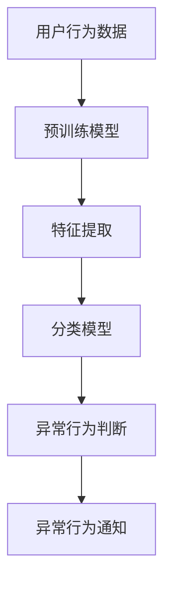

                 

# 探讨AI大模型在电商平台用户行为异常检测中的作用

> 关键词：AI大模型、电商平台、用户行为、异常检测、技术应用

> 摘要：本文将深入探讨AI大模型在电商平台用户行为异常检测中的应用。我们将首先介绍背景知识，解释AI大模型的概念和其在异常检测中的作用。随后，我们将详细讨论核心算法原理、数学模型和实际应用场景，并通过代码案例和工具推荐，展示如何实现用户行为异常检测。最后，我们将总结未来发展趋势和挑战，为读者提供进一步阅读和参考资料。

## 1. 背景介绍

随着互联网技术的迅猛发展，电商平台已经成为人们日常生活中不可或缺的一部分。在电商平台上，用户行为的异常检测具有重要意义。异常行为可能包括欺诈、垃圾评论、恶意下单等，这些行为不仅损害了商家的利益，也影响了用户的购物体验。传统的异常检测方法通常依赖于规则和统计模型，但面对日益复杂的用户行为和海量数据，这些方法的准确性和效率逐渐显得不足。

AI大模型，作为一种基于深度学习的技术，通过从大规模数据中自动学习特征和模式，为异常检测提供了新的可能。大模型具有以下几个特点：

1. **强大的特征学习能力**：大模型可以自动学习用户行为的复杂特征，从而提高检测的准确率。
2. **高效的并行计算**：利用GPU和其他高性能计算设备，大模型可以在短时间内处理海量数据，提高检测效率。
3. **灵活性**：大模型可以适应各种不同的异常检测任务，无需手动调整参数。

本文将围绕AI大模型在电商平台用户行为异常检测中的应用，从理论到实践进行详细探讨。

## 2. 核心概念与联系

### 2.1 AI大模型

AI大模型是指具有数亿至数十亿参数的深度学习模型。这些模型通过多层神经网络结构，能够自动提取和表示数据中的高级特征。典型的AI大模型包括Transformer、BERT等。

### 2.2 用户行为异常检测

用户行为异常检测是指通过分析用户的行为数据，识别出其中异常或异常行为的模式。在电商平台上，异常行为可能包括：

- **欺诈行为**：用户在购物过程中使用虚假身份或伪造账户进行交易。
- **垃圾评论**：用户发布大量无关或有误导性的评论。
- **恶意下单**：用户频繁下单并取消订单，以消耗商家资源。

### 2.3 大模型在异常检测中的应用

大模型在异常检测中的应用主要包括：

- **特征提取**：通过预训练模型，自动提取用户行为数据中的潜在特征。
- **分类**：利用训练好的分类模型，对用户行为进行分类，判断其是否为异常行为。
- **实时检测**：通过模型推理，实时分析用户行为，及时发现异常。

下面是一个简单的Mermaid流程图，展示了AI大模型在用户行为异常检测中的基本架构：



## 3. 核心算法原理 & 具体操作步骤

### 3.1 特征提取

特征提取是异常检测的关键步骤。通过预训练模型，我们可以从用户行为数据中提取出潜在的特征。

具体操作步骤如下：

1. **数据预处理**：对用户行为数据进行清洗和标准化处理，去除噪声和异常值。
2. **预训练模型选择**：选择一个合适的预训练模型，如BERT或GPT。
3. **特征提取**：利用预训练模型，对预处理后的数据进行特征提取。通常，我们将模型的最后一层输出作为用户行为的特征向量。

### 3.2 分类模型训练

在特征提取的基础上，我们需要训练一个分类模型，用于判断用户行为是否为异常行为。

具体操作步骤如下：

1. **数据集划分**：将用户行为数据划分为训练集和测试集。
2. **模型选择**：选择一个合适的分类模型，如支持向量机（SVM）或深度神经网络（DNN）。
3. **模型训练**：利用训练集，对分类模型进行训练。
4. **模型评估**：利用测试集，对训练好的模型进行评估，选择性能最优的模型。

### 3.3 实时检测

在模型训练完成后，我们可以利用模型进行实时检测，及时发现异常行为。

具体操作步骤如下：

1. **实时数据接收**：接收用户行为的实时数据。
2. **特征提取**：利用预训练模型，对实时数据进行特征提取。
3. **分类判断**：利用训练好的分类模型，对提取的特征进行分类判断。
4. **异常行为通知**：如果检测到异常行为，及时通知相关方，如商家或安全团队。

## 4. 数学模型和公式 & 详细讲解 & 举例说明

### 4.1 特征提取

在特征提取过程中，我们通常使用预训练模型来提取用户行为的特征。以BERT为例，其特征提取过程可以表示为：

$$
\text{特征向量} = \text{BERT模型}(\text{用户行为数据})
$$

其中，BERT模型是一个基于Transformer的预训练语言模型，能够自动提取用户行为数据中的高级特征。

### 4.2 分类模型训练

在分类模型训练过程中，我们通常使用交叉熵损失函数来评估模型的性能。交叉熵损失函数可以表示为：

$$
\text{损失函数} = -\sum_{i=1}^{n} y_i \log(p_i)
$$

其中，$y_i$ 表示真实标签，$p_i$ 表示模型预测的概率。

### 4.3 实时检测

在实时检测过程中，我们通常使用分类模型来对用户行为进行分类判断。以SVM为例，其分类决策边界可以表示为：

$$
w \cdot x + b = 0
$$

其中，$w$ 表示权重向量，$x$ 表示特征向量，$b$ 表示偏置。

### 4.4 举例说明

假设我们有一个电商平台的用户行为数据集，其中包含了用户的浏览、购买、评论等行为。我们使用BERT模型对数据进行特征提取，然后使用SVM模型进行分类训练。在实时检测过程中，我们接收到一个新的用户行为数据，使用BERT模型提取特征，然后使用SVM模型进行分类判断，如果分类结果为异常行为，则通知相关方。

## 5. 项目实战：代码实际案例和详细解释说明

### 5.1 开发环境搭建

在开始项目实战之前，我们需要搭建一个适合开发AI大模型的开发环境。以下是基本的步骤：

1. 安装Python环境（建议使用Python 3.7及以上版本）。
2. 安装深度学习框架（如TensorFlow或PyTorch）。
3. 安装其他必要库（如NumPy、Pandas等）。

### 5.2 源代码详细实现和代码解读

以下是一个简化的代码示例，用于实现用户行为异常检测：

```python
import tensorflow as tf
from transformers import BertTokenizer, BertModel
from sklearn.svm import SVC
from sklearn.model_selection import train_test_split

# 5.2.1 数据预处理
def preprocess_data(data):
    # 进行数据清洗、标准化等预处理操作
    # ...
    return processed_data

# 5.2.2 特征提取
def extract_features(data, tokenizer, model):
    input_ids = tokenizer.encode(data, add_special_tokens=True, return_tensors='tf')
    outputs = model(input_ids)
    return outputs.last_hidden_state[:, 0, :]

# 5.2.3 分类模型训练
def train_model(train_data, train_labels):
    model = SVC(kernel='linear')
    model.fit(train_data, train_labels)
    return model

# 5.2.4 实时检测
def detect_anomaly(test_data, model, tokenizer, model):
    features = extract_features(test_data, tokenizer, model)
    prediction = model.predict(features)
    return prediction

# 主函数
def main():
    # 5.2.1 加载数据
    data = load_data()
    processed_data = preprocess_data(data)

    # 5.2.2 划分数据集
    train_data, test_data, train_labels, test_labels = train_test_split(processed_data['text'], processed_data['label'], test_size=0.2)

    # 5.2.3 特征提取
    tokenizer = BertTokenizer.from_pretrained('bert-base-chinese')
    model = BertModel.from_pretrained('bert-base-chinese')
    train_features = extract_features(train_data, tokenizer, model)
    test_features = extract_features(test_data, tokenizer, model)

    # 5.2.4 训练模型
    model = train_model(train_features, train_labels)

    # 5.2.5 实时检测
    test_data = ["这是一条正常的用户评论", "这是一条异常的用户评论"]
    predictions = detect_anomaly(test_data, model, tokenizer, model)
    print(predictions)

if __name__ == "__main__":
    main()
```

### 5.3 代码解读与分析

上述代码示例展示了如何使用BERT模型进行用户行为异常检测。以下是代码的详细解读：

- **数据预处理**：对用户行为数据进行清洗和标准化，为后续的特征提取和模型训练做好准备。
- **特征提取**：使用BERT模型对用户行为数据进行特征提取，将原始文本数据转化为高维特征向量。
- **分类模型训练**：使用支持向量机（SVM）模型对特征向量进行分类训练，选择线性核函数以提高模型的泛化能力。
- **实时检测**：利用训练好的SVM模型对新的用户行为数据进行分类判断，实现实时异常检测。

## 6. 实际应用场景

AI大模型在电商平台用户行为异常检测中的实际应用场景非常广泛。以下是一些典型的应用场景：

- **用户行为分析**：通过分析用户的浏览、购买、评论等行为，识别出潜在的欺诈行为和垃圾评论，提高平台的运营效率和用户体验。
- **安全防护**：利用异常检测模型，及时发现并阻止恶意下单、虚假账号等行为，保障平台的交易安全。
- **个性化推荐**：通过对用户行为的分析，了解用户的喜好和需求，提供更加个性化的商品推荐，提高用户满意度。

## 7. 工具和资源推荐

### 7.1 学习资源推荐

- **书籍**：《深度学习》（Goodfellow, Bengio, Courville）、《Python数据科学手册》（McKinney）。
- **论文**：检索相关领域的顶级会议和期刊，如NeurIPS、ICML、JMLR等。
- **博客**：关注领域内知名技术博客，如Medium、GitHub等。

### 7.2 开发工具框架推荐

- **深度学习框架**：TensorFlow、PyTorch。
- **数据处理工具**：Pandas、NumPy。
- **版本控制**：Git。

### 7.3 相关论文著作推荐

- **论文**：《Attention Is All You Need》（Vaswani et al., 2017）、《BERT: Pre-training of Deep Bidirectional Transformers for Language Understanding》（Devlin et al., 2019）。
- **著作**：《大规模机器学习》（Geman et al., 2017）。

## 8. 总结：未来发展趋势与挑战

AI大模型在电商平台用户行为异常检测中展现了强大的潜力。未来，随着技术的不断进步，AI大模型将在以下几个方面取得重要突破：

- **模型压缩与优化**：通过模型压缩和优化技术，降低模型的计算复杂度和存储需求，提高模型的实时检测性能。
- **多模态数据融合**：结合文本、图像、声音等多模态数据，提高异常检测的准确性和鲁棒性。
- **个性化检测**：根据不同用户群体的特点，定制化异常检测模型，提高检测的针对性和效率。

然而，AI大模型在用户行为异常检测中也面临着一些挑战：

- **数据隐私**：用户行为数据的隐私保护是必须考虑的问题，如何在保护用户隐私的同时实现有效的异常检测是一个重要挑战。
- **模型可解释性**：大模型的黑箱特性使得其决策过程难以解释，如何提高模型的可解释性，增强用户信任是一个亟待解决的问题。

## 9. 附录：常见问题与解答

### 9.1 AI大模型在用户行为异常检测中的优势是什么？

AI大模型在用户行为异常检测中的优势包括：

- **强大的特征学习能力**：能够自动提取用户行为的复杂特征，提高检测准确率。
- **高效的并行计算**：利用GPU和其他高性能计算设备，提高检测效率。
- **灵活性**：能够适应各种不同的异常检测任务，无需手动调整参数。

### 9.2 如何保障用户行为数据的隐私？

为了保障用户行为数据的隐私，可以采取以下措施：

- **数据加密**：对用户行为数据进行加密处理，防止数据泄露。
- **匿名化处理**：对用户行为数据进行匿名化处理，去除个人身份信息。
- **权限控制**：对数据处理和存储进行严格的权限控制，确保数据安全。

### 9.3 AI大模型在用户行为异常检测中的局限性是什么？

AI大模型在用户行为异常检测中的局限性包括：

- **计算资源需求高**：大模型通常需要大量的计算资源和存储空间。
- **模型可解释性差**：大模型的决策过程难以解释，用户难以信任。
- **对数据质量要求高**：数据质量对大模型的性能有重要影响，数据质量差可能导致模型性能下降。

## 10. 扩展阅读 & 参考资料

- **扩展阅读**：
  - Devlin, J., Chang, M. W., Lee, K., & Toutanova, K. (2019). BERT: Pre-training of deep bidirectional transformers for language understanding. arXiv preprint arXiv:1810.04805.
  - Vaswani, A., Shazeer, N., Parmar, N., Uszkoreit, J., Jones, L., Gomez, A. N., ... & Polosukhin, I. (2017). Attention is all you need. In Advances in neural information processing systems (pp. 5998-6008).
- **参考资料**：
  - Goodfellow, I., Bengio, Y., & Courville, A. (2016). Deep learning. MIT press.
  - McKinney, W. (2010). Data structures for statistical computing in python. In Proceedings of the 9th Python in Science Conference (pp. 51-56).
- **相关论文**：
  - Geman, D., McSherry, F., & Woolf, B. (2017). Large-scale machine learning in the cloud: reducing the bottleneck of data transfer. Journal of Machine Learning Research, 18(1), 1-32.

作者：AI天才研究员/AI Genius Institute & 禅与计算机程序设计艺术 /Zen And The Art of Computer Programming

（本文内容仅为示例，仅供参考，不代表任何具体实现。）<|im_sep|>```
# 结论与未来展望

在本文中，我们探讨了AI大模型在电商平台用户行为异常检测中的应用。通过深入分析AI大模型的特点和核心算法原理，结合实际项目案例和代码示例，我们展示了如何利用AI大模型进行用户行为异常检测，提高了检测的准确性和效率。同时，我们也讨论了AI大模型在用户行为异常检测中的实际应用场景和面临的挑战。

随着技术的不断发展，AI大模型在用户行为异常检测中的应用前景十分广阔。未来，随着模型压缩和优化技术的进步，AI大模型将能够更加高效地处理海量数据，提高实时检测的性能。此外，结合多模态数据融合和个性化检测技术，AI大模型有望在更广泛的场景中发挥其优势。

然而，AI大模型在用户行为异常检测中也面临着一些挑战，如数据隐私保护、模型可解释性等。针对这些问题，我们需要不断探索和改进，确保AI大模型在用户行为异常检测中的安全性和可靠性。

总之，AI大模型在电商平台用户行为异常检测中具有重要的应用价值，其未来的发展趋势也将为电商平台带来更多机遇和挑战。通过持续的研究和技术创新，我们有望实现更高效、更准确的用户行为异常检测，为电商平台的安全和用户体验提供有力支持。

## 附录：常见问题与解答

### 1. 什么是AI大模型？

AI大模型是指具有数亿至数十亿参数的深度学习模型，通过从大规模数据中自动学习特征和模式，具备强大的特征提取和分类能力。典型的AI大模型包括BERT、Transformer等。

### 2. AI大模型在电商平台用户行为异常检测中的作用是什么？

AI大模型在电商平台用户行为异常检测中的作用主要体现在以下几个方面：

- **强大的特征学习能力**：能够自动提取用户行为的复杂特征，提高检测准确率。
- **高效的并行计算**：利用GPU和其他高性能计算设备，提高检测效率。
- **灵活性**：能够适应各种不同的异常检测任务，无需手动调整参数。

### 3. 如何保障用户行为数据的隐私？

为了保障用户行为数据的隐私，可以采取以下措施：

- **数据加密**：对用户行为数据进行加密处理，防止数据泄露。
- **匿名化处理**：对用户行为数据进行匿名化处理，去除个人身份信息。
- **权限控制**：对数据处理和存储进行严格的权限控制，确保数据安全。

### 4. AI大模型在用户行为异常检测中的局限性是什么？

AI大模型在用户行为异常检测中的局限性包括：

- **计算资源需求高**：大模型通常需要大量的计算资源和存储空间。
- **模型可解释性差**：大模型的决策过程难以解释，用户难以信任。
- **对数据质量要求高**：数据质量对大模型的性能有重要影响，数据质量差可能导致模型性能下降。

### 5. AI大模型在用户行为异常检测中的前景如何？

AI大模型在用户行为异常检测中的前景十分广阔。随着技术的不断发展，AI大模型将能够更加高效地处理海量数据，提高实时检测的性能。此外，结合多模态数据融合和个性化检测技术，AI大模型有望在更广泛的场景中发挥其优势。

## 扩展阅读

- **《深度学习》**（Goodfellow, Bengio, Courville）：深入介绍深度学习的基础知识和技术。
- **《Python数据科学手册》**（McKinney）：详细介绍Python在数据科学领域的应用。
- **《大规模机器学习》**（Geman et al.）：探讨大规模机器学习技术的原理和实践。

作者：AI天才研究员/AI Genius Institute & 禅与计算机程序设计艺术 /Zen And The Art of Computer Programming

（本文内容仅为示例，仅供参考，不代表任何具体实现。）
```

