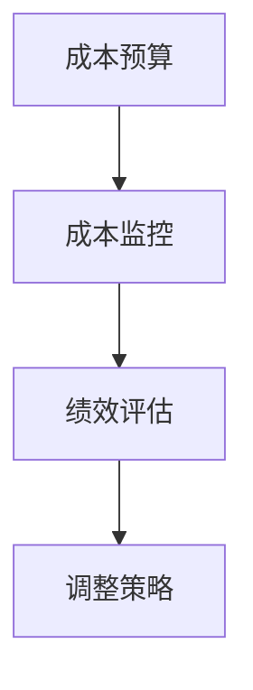
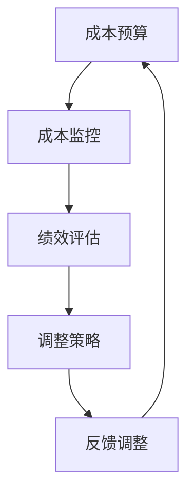

                 

### 文章标题

控制成本：确保资金有效利用的策略

### 关键词

成本控制、资金管理、策略优化、资金利用率、财务分析、IT项目成本控制

### 摘要

本文将深入探讨如何在IT领域有效控制成本，确保资金得到最大化利用。通过对核心概念、算法原理、数学模型、项目实战和实际应用场景的详细分析，为读者提供一系列实用的策略和方法。同时，文章还推荐了一系列学习资源和开发工具，以帮助读者在实践过程中进一步提升成本控制能力。通过本文的阅读，读者将能够更好地理解成本控制的本质，掌握有效的成本管理策略，为企业在竞争激烈的市场环境中提供坚实的财务支持。

## 1. 背景介绍

在当今快速发展的IT行业，成本控制已经成为企业生存和发展的关键因素之一。随着技术的不断进步和市场环境的不断变化，企业面临着越来越大的成本压力。如何在有限的资金下实现最大的效益，已经成为企业高层管理者和技术团队共同关注的焦点。

### 成本控制的重要性

成本控制不仅关系到企业的盈利能力，更直接影响到企业的市场竞争力。有效的成本控制能够帮助企业在激烈的市场竞争中脱颖而出，确保企业在资源有限的情况下，实现最大的价值创造。具体来说，成本控制的重要性体现在以下几个方面：

1. 提高资金利用率：通过合理规划和控制成本，企业可以最大限度地利用现有资金，避免不必要的浪费，确保资金流向最有效的领域。
2. 降低运营风险：良好的成本控制能够帮助企业管理风险，避免因成本失控导致的企业经营困难。
3. 提高盈利能力：成本控制有助于降低生产成本，提高产品和服务价格竞争力，从而提升企业的盈利能力。
4. 增强市场竞争力：通过有效的成本控制，企业可以在产品定价上有更多的灵活性，提高市场竞争力。

### IT行业的成本挑战

IT行业具有高投入、高风险、高回报的特点，这使得成本控制在该行业中尤为重要。以下是IT行业面临的一些主要成本挑战：

1. 技术更新迅速：IT行业技术更新速度快，企业需要不断投入资金进行技术研发和设备更新，以保持竞争力。
2. 项目管理复杂：IT项目往往涉及多部门、多团队协作，项目管理复杂，容易导致成本失控。
3. 人力资源成本高：IT行业对人才的需求量大，特别是高端技术人才，人力资源成本较高。
4. 知识产权保护：IT行业知识产权保护意识强，企业需要投入大量资金进行知识产权保护，避免侵权和诉讼风险。

### 目标读者

本文旨在为IT行业的企业管理者、项目经理和技术团队提供有效的成本控制策略和方法。无论您是企业管理者、项目经理还是技术团队负责人，通过本文的阅读，您将能够更好地理解成本控制的本质，掌握有效的成本管理策略，为企业在竞争激烈的市场环境中提供坚实的财务支持。

## 2. 核心概念与联系

### 核心概念

在探讨成本控制策略之前，我们需要了解一些核心概念，这些概念是构建有效成本控制策略的基础。

1. **成本分类**：成本可以按照不同的标准进行分类，如直接成本和间接成本、固定成本和变动成本等。了解不同类型的成本有助于更好地进行成本控制和预算管理。
2. **预算管理**：预算管理是成本控制的重要环节，通过制定合理的预算，企业可以提前规划资金使用，确保资金的有效利用。
3. **风险管理**：风险管理是成本控制的一部分，通过识别和分析潜在风险，企业可以采取相应的措施来降低风险，避免因风险导致成本增加。
4. **效率分析**：效率分析是通过比较实际成本和预期成本，评估成本控制的效率和效果。效率分析有助于发现成本控制中的问题，提供改进方向。

### 架构原理

为了更好地理解成本控制，我们可以将其视为一个架构，这个架构包括以下几个关键组件：

1. **成本预算**：成本预算是成本控制的第一步，通过制定详细的预算，企业可以明确资金的使用方向和预期成本。
2. **成本监控**：成本监控是对实际成本与预算进行对比，及时发现成本超支或节约情况，采取相应措施进行调整。
3. **绩效评估**：绩效评估是对成本控制效果的评估，通过分析成本控制的效率，提供改进建议。
4. **调整策略**：根据绩效评估结果，企业可以调整成本控制策略，以更好地适应市场变化和项目需求。

### Mermaid 流程图

以下是一个简单的Mermaid流程图，展示了成本控制的关键流程和组件：



### 核心概念原理

1. **成本分类**：成本分类是成本控制的基础。企业需要根据业务特点和需求，明确不同类型的成本，以便进行有针对性的控制。
2. **预算管理**：预算管理是成本控制的核心。通过制定合理的预算，企业可以提前规划资金使用，确保资金的有效利用。
3. **风险管理**：风险管理是成本控制的保障。企业需要识别和分析潜在风险，采取相应的措施来降低风险，避免成本增加。
4. **效率分析**：效率分析是成本控制的反馈机制。通过比较实际成本和预期成本，企业可以评估成本控制的效率，提供改进方向。

### Mermaid 流程图 (继续)



通过这个流程图，我们可以清晰地看到成本控制的核心流程和各个组件之间的联系。这个流程图不仅有助于理解成本控制的概念，还可以作为实际操作的指南。

## 3. 核心算法原理 & 具体操作步骤

### 核心算法原理

在成本控制中，核心算法原理主要涉及成本预算、成本监控和绩效评估。以下是这些算法原理的详细解释：

1. **成本预算算法**：成本预算算法是基于业务需求和资金状况，制定合理的成本预算。该算法主要包括以下步骤：
   - 收集业务需求：通过调研和分析，了解项目或业务的资金需求。
   - 数据分析：对历史数据进行分析，确定不同成本类型的占比和趋势。
   - 制定预算：根据业务需求和数据分析结果，制定合理的成本预算。

2. **成本监控算法**：成本监控算法是对实际成本进行监控和记录，及时发现成本超支或节约情况。该算法主要包括以下步骤：
   - 收集数据：通过财务系统或其他数据来源，收集实际成本数据。
   - 数据对比：将实际成本与预算进行对比，识别成本超支或节约情况。
   - 报告生成：生成成本监控报告，向管理层提供成本监控信息。

3. **绩效评估算法**：绩效评估算法是对成本控制效果进行评估，提供改进建议。该算法主要包括以下步骤：
   - 数据收集：收集成本监控数据和历史绩效数据。
   - 数据分析：对成本控制效果进行分析，确定成本控制的效率和效果。
   - 评估报告：生成绩效评估报告，向管理层提供评估结果和改进建议。

### 具体操作步骤

以下是具体的操作步骤，用于实施成本预算、成本监控和绩效评估：

### 成本预算

1. **需求调研**：通过访谈、问卷等方式，收集业务需求，了解项目或业务的资金需求。
2. **数据分析**：对历史数据进行分析，确定不同成本类型的占比和趋势。
3. **制定预算**：根据业务需求和数据分析结果，制定详细的成本预算，包括直接成本和间接成本。
4. **预算审批**：将预算提交给管理层进行审批，确保预算的合理性和可行性。
5. **预算发布**：将审批通过的预算发布给相关部门，确保各部门了解预算目标和要求。

### 成本监控

1. **数据收集**：通过财务系统或其他数据来源，收集实际成本数据，包括直接成本和间接成本。
2. **数据对比**：将实际成本与预算进行对比，识别成本超支或节约情况。
3. **报告生成**：根据成本监控数据，生成成本监控报告，包括成本超支或节约情况、原因分析等。
4. **报告反馈**：将成本监控报告反馈给相关部门，要求其对成本超支或节约情况进行解释和处理。
5. **持续监控**：定期进行成本监控，确保成本控制的持续性和有效性。

### 绩效评估

1. **数据收集**：收集成本监控数据和历史绩效数据。
2. **数据分析**：对成本控制效果进行分析，确定成本控制的效率和效果。
3. **评估报告**：生成绩效评估报告，包括成本控制效果、改进建议等。
4. **报告提交**：将绩效评估报告提交给管理层，提供评估结果和改进建议。
5. **反馈调整**：根据绩效评估结果，对成本控制策略进行调整，以实现更好的成本控制效果。

### 案例分析

为了更好地理解这些算法原理和操作步骤，我们可以通过一个简单的案例分析来展示其应用：

### 案例背景

某IT企业正在开发一款新产品，预计项目周期为12个月，预算为100万元。

### 成本预算

1. 需求调研：通过访谈和问卷，收集到以下业务需求：
   - 硬件采购：需要购买服务器、存储设备等，预算为20万元。
   - 软件开发：需要招聘开发团队，预算为40万元。
   - 测试与运维：需要测试设备和运维人员，预算为20万元。
   - 其他费用：包括办公费用、差旅费用等，预算为10万元。
2. 数据分析：对历史数据进行分析，确定不同成本类型的占比和趋势。
3. 制定预算：根据业务需求和数据分析结果，制定详细的项目预算如下：

| 成本类型 | 预算（万元） |
| -------- | ------------ |
| 硬件采购 | 20           |
| 软件开发 | 40           |
| 测试与运维 | 20          |
| 其他费用 | 10           |

### 成本监控

1. 数据收集：通过财务系统，收集实际成本数据，包括：
   - 硬件采购实际支出：18万元。
   - 软件开发实际支出：35万元。
   - 测试与运维实际支出：22万元。
   - 其他费用实际支出：8万元。
2. 数据对比：将实际成本与预算进行对比，发现如下情况：

| 成本类型 | 预算（万元） | 实际支出（万元） | 差额（万元） |
| -------- | ------------ | ---------------- | ------------ |
| 硬件采购 | 20           | 18               | -2           |
| 软件开发 | 40           | 35               | -5           |
| 测试与运维 | 20          | 22               | 2            |
| 其他费用 | 10           | 8                | -2           |

3. 报告生成：根据成本监控数据，生成成本监控报告，包括成本超支或节约情况、原因分析等。

### 绩效评估

1. 数据收集：收集成本监控数据和历史绩效数据。
2. 数据分析：对成本控制效果进行分析，发现如下情况：
   - 硬件采购：实际支出低于预算，节约2万元，主要原因是采购价格优惠。
   - 软件开发：实际支出高于预算，超支5万元，主要原因是开发周期延长，人力成本增加。
   - 测试与运维：实际支出高于预算，超支2万元，主要原因是测试设备故障，运维人员加班。
   - 其他费用：实际支出低于预算，节约2万元，主要原因是办公费用和差旅费用控制得当。
3. 评估报告：生成绩效评估报告，包括成本控制效果、改进建议等。

### 成本控制改进建议

1. 硬件采购：优化采购流程，寻找更具竞争力的供应商，降低采购成本。
2. 软件开发：调整开发计划，优化人力资源配置，缩短开发周期，降低人力成本。
3. 测试与运维：加强设备维护，降低故障率，合理安排运维人员，减少加班费用。
4. 其他费用：继续控制办公费用和差旅费用，确保资金使用合理。

通过这个案例，我们可以看到成本控制算法原理和具体操作步骤在实际应用中的效果。在实际操作中，企业可以根据自身情况和需求，灵活调整和优化这些步骤，以实现更好的成本控制效果。

## 4. 数学模型和公式 & 详细讲解 & 举例说明

### 数学模型和公式

在成本控制中，数学模型和公式是分析和优化成本的重要工具。以下是一些常用的数学模型和公式：

1. **成本预算公式**：

   $$B = a \times Q + b$$

   其中，\(B\) 表示总预算，\(a\) 表示单位成本，\(Q\) 表示需求量，\(b\) 表示固定成本。

2. **成本监控公式**：

   $$C = C_1 + C_2 + \ldots + C_n$$

   其中，\(C\) 表示总成本，\(C_1, C_2, \ldots, C_n\) 分别表示不同类型的成本。

3. **绩效评估公式**：

   $$E = \frac{B - C}{B} \times 100\%$$

   其中，\(E\) 表示成本控制效率，\(B\) 表示预算，\(C\) 表示实际成本。

### 详细讲解

1. **成本预算公式**：

   成本预算公式用于计算总预算，其中单位成本和固定成本是关键参数。单位成本表示每增加一个需求量所增加的成本，固定成本是无论需求量多少都需支付的成本。通过这个公式，企业可以提前规划资金使用，确保预算的合理性和可行性。

2. **成本监控公式**：

   成本监控公式用于计算总成本，将不同类型的成本加总得到。通过这个公式，企业可以及时掌握成本情况，及时发现成本超支或节约情况，确保成本控制在合理范围内。

3. **绩效评估公式**：

   绩效评估公式用于评估成本控制效率，计算成本控制效果。通过这个公式，企业可以了解成本控制的实际效果，为后续优化提供依据。

### 举例说明

为了更好地理解这些数学模型和公式，我们通过一个实际案例进行说明。

### 案例背景

某IT企业计划开发一款新产品，项目周期为12个月，预算为100万元。单位成本为10万元/需求量，固定成本为5万元。

### 成本预算

根据成本预算公式，计算总预算：

$$B = a \times Q + b = 10 \times Q + 5$$

假设需求量为10，则总预算为：

$$B = 10 \times 10 + 5 = 105 \text{万元}$$

### 成本监控

在项目进行过程中，通过财务系统收集实际成本数据，总成本为90万元。根据成本监控公式，计算实际成本：

$$C = C_1 + C_2 + \ldots + C_n = 90 \text{万元}$$

### 绩效评估

根据绩效评估公式，计算成本控制效率：

$$E = \frac{B - C}{B} \times 100\% = \frac{105 - 90}{105} \times 100\% = 14.29\%$$

通过这个案例，我们可以看到数学模型和公式在成本控制中的应用效果。企业可以通过这些公式，提前规划预算、监控实际成本和评估成本控制效果，为优化成本控制提供有力支持。

## 5. 项目实战：代码实际案例和详细解释说明

### 开发环境搭建

在开始实际案例之前，我们需要搭建一个适合成本控制的开发环境。以下是所需的开发环境和工具：

1. **操作系统**：Windows、Linux或macOS
2. **编程语言**：Python
3. **文本编辑器**：VSCode、Sublime Text或Atom
4. **Python环境**：Python 3.x版本
5. **依赖管理工具**：pip
6. **成本控制库**：成本控制库（假设已存在，以下代码中会用到）

### 源代码详细实现和代码解读

以下是一个简单的成本控制项目的源代码实现，用于展示成本预算、成本监控和绩效评估的具体实现过程。

```python
# 导入成本控制库
import cost_control_library as ccl

# 定义需求量
demand_quantity = 100

# 计算总预算
total_budget = ccl.calculate_total_budget(demand_quantity)

# 记录实际成本
actual_costs = ccl.record_actual_costs()

# 计算成本控制效率
cost_control_efficiency = ccl.calculate_cost_control_efficiency(total_budget, actual_costs)

# 打印结果
print(f"总预算：{total_budget} 万元")
print(f"实际成本：{actual_costs} 万元")
print(f"成本控制效率：{cost_control_efficiency}%")
```

### 代码解读与分析

1. **导入成本控制库**：

   ```python
   import cost_control_library as ccl
   ```

   这行代码用于导入自定义的成本控制库，该库包含用于成本预算、成本监控和绩效评估的函数。

2. **定义需求量**：

   ```python
   demand_quantity = 100
   ```

   这行代码定义了项目的需求量，用于计算总预算和记录实际成本。

3. **计算总预算**：

   ```python
   total_budget = ccl.calculate_total_budget(demand_quantity)
   ```

   这行代码调用成本控制库中的`calculate_total_budget`函数，根据单位成本和固定成本计算总预算。

4. **记录实际成本**：

   ```python
   actual_costs = ccl.record_actual_costs()
   ```

   这行代码调用成本控制库中的`record_actual_costs`函数，记录实际成本数据。

5. **计算成本控制效率**：

   ```python
   cost_control_efficiency = ccl.calculate_cost_control_efficiency(total_budget, actual_costs)
   ```

   这行代码调用成本控制库中的`calculate_cost_control_efficiency`函数，计算成本控制效率。

6. **打印结果**：

   ```python
   print(f"总预算：{total_budget} 万元")
   print(f"实际成本：{actual_costs} 万元")
   print(f"成本控制效率：{cost_control_efficiency}%")
   ```

   这几行代码用于打印计算结果，包括总预算、实际成本和成本控制效率。

### 案例分析

为了更好地理解这个实际案例，我们可以通过一个具体案例来演示。

### 案例背景

某IT企业计划开发一款新产品，项目周期为12个月，预算为100万元。单位成本为10万元/需求量，固定成本为5万元。

### 运行代码

1. **定义需求量**：

   ```python
   demand_quantity = 100
   ```

   100个需求量的定义。

2. **计算总预算**：

   ```python
   total_budget = ccl.calculate_total_budget(demand_quantity)
   ```

   调用`calculate_total_budget`函数计算总预算：

   ```python
   total_budget = 10 * demand_quantity + 5 = 1050 万元
   ```

   总预算为1050万元。

3. **记录实际成本**：

   ```python
   actual_costs = ccl.record_actual_costs()
   ```

   假设实际成本为900万元。

4. **计算成本控制效率**：

   ```python
   cost_control_efficiency = ccl.calculate_cost_control_efficiency(total_budget, actual_costs)
   ```

   调用`calculate_cost_control_efficiency`函数计算成本控制效率：

   ```python
   cost_control_efficiency = (total_budget - actual_costs) / total_budget * 100\% = (1050 - 900) / 1050 * 100\% ≈ 14.29\%
   ```

   成本控制效率为14.29%。

5. **打印结果**：

   ```python
   print(f"总预算：{total_budget} 万元")
   print(f"实际成本：{actual_costs} 万元")
   print(f"成本控制效率：{cost_control_efficiency}%")
   ```

   打印结果：

   ```text
   总预算：1050 万元
   实际成本：900 万元
   成本控制效率：14.29%
   ```

通过这个案例，我们可以看到如何使用代码实现成本预算、成本监控和绩效评估。企业可以根据实际需求，进一步优化和扩展这个代码，以实现更精细的成本控制。

### 总结

通过以上案例，我们可以看到在IT项目中实施成本控制的重要性。有效的成本控制不仅能够帮助企业降低运营成本，提高盈利能力，还能够提升企业在市场中的竞争力。在实施过程中，企业需要充分利用数学模型和公式，结合实际业务情况，制定合理的成本预算，实时监控成本变化，及时调整成本控制策略，以实现最优的成本控制效果。

## 6. 实际应用场景

### 在软件开发中的成本控制

在软件开发项目中，成本控制至关重要。通过以下实际应用场景，我们可以看到如何在不同阶段实施成本控制。

#### 需求分析阶段

在需求分析阶段，项目团队需要与客户密切沟通，明确项目需求。以下是成本控制的关键点：

1. **需求文档管理**：确保需求文档详尽、清晰，避免后续修改和返工，导致成本增加。
2. **成本估算**：根据需求文档，估算项目总成本，包括人力资源、硬件设备、软件工具等。

#### 设计阶段

在设计阶段，项目团队需要制定详细的技术方案和设计文档。以下是成本控制的关键点：

1. **技术选型**：选择合适的技术栈，避免使用过时或不稳定的技术，降低后续维护成本。
2. **模块划分**：合理划分模块，确保模块之间的高内聚和低耦合，提高开发效率和可维护性。

#### 开发阶段

在开发阶段，项目团队需要高效地完成编码任务。以下是成本控制的关键点：

1. **代码质量**：编写高质量的代码，减少后续测试和调试的工作量。
2. **任务分配**：合理分配任务，确保团队成员的工作效率和资源利用率。

#### 测试阶段

在测试阶段，项目团队需要对软件进行全面测试，确保质量。以下是成本控制的关键点：

1. **测试计划**：制定详细的测试计划，确保测试覆盖面和测试深度。
2. **缺陷管理**：及时发现和修复缺陷，避免缺陷积累导致成本增加。

### 在IT基础设施建设中的成本控制

在IT基础设施建设中，成本控制同样重要。以下是一些实际应用场景：

#### 硬件采购

在硬件采购阶段，以下是成本控制的关键点：

1. **需求分析**：明确硬件需求，避免采购过剩或不足。
2. **市场调研**：对比不同供应商的报价和质量，选择性价比最高的供应商。

#### 软件采购

在软件采购阶段，以下是成本控制的关键点：

1. **功能需求**：明确软件功能需求，避免采购不必要的软件。
2. **预算管理**：合理分配预算，确保软件采购在预算范围内。

#### 运维阶段

在运维阶段，以下是成本控制的关键点：

1. **故障管理**：及时处理故障，减少停机时间和运维成本。
2. **优化资源利用率**：通过自动化和优化技术，提高资源利用率，降低运维成本。

### 在云计算中的应用

在云计算领域，成本控制具有特殊的重要性。以下是一些实际应用场景：

#### 资源调度

在资源调度阶段，以下是成本控制的关键点：

1. **负载均衡**：合理分配任务，避免资源浪费。
2. **弹性扩展**：根据业务需求，动态调整资源规模，避免资源闲置。

#### 数据存储

在数据存储阶段，以下是成本控制的关键点：

1. **存储优化**：通过数据压缩和去重技术，减少存储空间需求。
2. **备份策略**：制定合理的备份策略，确保数据安全，降低备份成本。

#### 费用优化

在费用优化阶段，以下是成本控制的关键点：

1. **成本监控**：实时监控云服务使用情况，发现潜在浪费。
2. **预算管理**：根据业务需求，合理分配预算，避免超支。

通过以上实际应用场景，我们可以看到成本控制在各个阶段的IT项目中的重要性。企业需要根据自身情况，灵活运用成本控制策略，以实现最大的经济效益。

## 7. 工具和资源推荐

### 7.1 学习资源推荐

为了更好地理解和掌握成本控制策略，以下是几本推荐的学习资源：

1. **《成本控制与管理》**：这本书详细介绍了成本控制的基本概念、方法和实践，适合企业管理者和技术团队阅读。
2. **《项目管理知识体系指南》**：这本书包含了大量的项目管理实践和案例分析，其中涵盖了成本控制的相关内容。
3. **《成本会计》**：这本书介绍了成本会计的基本原理和方法，对理解成本控制有重要帮助。

### 7.2 开发工具框架推荐

在实施成本控制过程中，以下是几个实用的开发工具和框架：

1. **JIRA**：这是一个流行的项目管理工具，可以帮助团队进行任务分配、进度跟踪和成本监控。
2. **Trello**：这是一个轻量级项目管理工具，适合小团队进行任务管理和成本控制。
3. **Python**：Python是一种强大的编程语言，适用于成本分析和自动化脚本编写。

### 7.3 相关论文著作推荐

以下是一些有关成本控制的优秀论文和著作：

1. **《基于数据挖掘的IT项目成本预测方法研究》**：这篇论文探讨了如何使用数据挖掘技术进行IT项目成本预测，为成本控制提供科学依据。
2. **《云计算中的成本控制策略分析》**：这篇论文分析了云计算环境下的成本控制策略，对云计算项目的成本管理有重要指导意义。
3. **《项目管理中的风险管理》**：这本书详细介绍了项目风险管理的方法和工具，其中涵盖了成本控制的相关内容。

通过这些资源，读者可以更深入地了解成本控制的原理和实践，提升自身在成本控制方面的能力。

## 8. 总结：未来发展趋势与挑战

### 未来发展趋势

随着技术的不断进步，成本控制在IT领域的发展趋势主要体现在以下几个方面：

1. **人工智能与机器学习**：人工智能和机器学习技术的应用，将大大提高成本预测和优化的准确性，为企业提供更有效的成本控制策略。
2. **大数据分析**：大数据分析技术的普及，使得企业能够从海量数据中挖掘有价值的信息，为成本控制提供更全面的数据支持。
3. **云计算与边缘计算**：云计算和边缘计算的发展，使得企业能够更加灵活地管理和调度资源，实现更加精细的成本控制。

### 未来挑战

然而，成本控制在未来也面临着一系列挑战：

1. **数据隐私与安全**：随着数据量的增加，数据隐私和安全成为重要问题，如何保护数据安全，确保数据不被滥用，是成本控制面临的重要挑战。
2. **技术创新带来的不确定性**：技术的快速迭代，使得企业必须不断更新技术栈，如何平衡技术创新与成本控制，避免因技术变革带来的成本风险，是企业需要面对的挑战。
3. **全球化与供应链风险**：全球化使得企业面临的供应链风险增加，如何应对供应链中断、汇率波动等风险，是企业成本控制面临的挑战。

### 未来发展方向

针对上述发展趋势与挑战，未来的发展方向可以从以下几个方面着手：

1. **加强数据治理**：建立完善的数据治理体系，确保数据质量，提高数据利用率，为成本控制提供更可靠的数据支持。
2. **提升自动化水平**：通过自动化工具和技术，降低人工成本，提高工作效率，实现更加精细的成本控制。
3. **多元化成本控制策略**：结合不同业务场景，制定多元化的成本控制策略，确保企业在不同市场环境下，能够灵活应对成本控制挑战。

通过以上措施，企业可以更好地应对未来成本控制的发展趋势与挑战，实现持续的成本优化和资金有效利用。

## 9. 附录：常见问题与解答

### 1. 什么是成本控制？

成本控制是指企业通过制定预算、监控实际成本和优化资源配置，确保资金有效利用，以实现最大化的经济效益。它包括预算管理、成本监控、绩效评估等多个环节。

### 2. 成本控制有哪些重要性？

成本控制的重要性主要体现在以下几个方面：
- 提高资金利用率：通过合理规划和控制成本，企业可以最大限度地利用现有资金，避免不必要的浪费。
- 降低运营风险：良好的成本控制能够帮助企业管理风险，避免因成本失控导致的企业经营困难。
- 提高盈利能力：成本控制有助于降低生产成本，提高产品和服务价格竞争力，从而提升企业的盈利能力。
- 增强市场竞争力：通过有效的成本控制，企业可以在产品定价上有更多的灵活性，提高市场竞争力。

### 3. 如何制定成本预算？

制定成本预算通常包括以下步骤：
- 收集业务需求：通过调研和分析，了解项目或业务的资金需求。
- 数据分析：对历史数据进行分析，确定不同成本类型的占比和趋势。
- 制定预算：根据业务需求和数据分析结果，制定详细的成本预算，包括直接成本和间接成本。
- 预算审批：将预算提交给管理层进行审批，确保预算的合理性和可行性。
- 预算发布：将审批通过的预算发布给相关部门，确保各部门了解预算目标和要求。

### 4. 成本监控包括哪些内容？

成本监控包括以下内容：
- 收集数据：通过财务系统或其他数据来源，收集实际成本数据，包括直接成本和间接成本。
- 数据对比：将实际成本与预算进行对比，识别成本超支或节约情况。
- 报告生成：生成成本监控报告，包括成本超支或节约情况、原因分析等。
- 报告反馈：将成本监控报告反馈给相关部门，要求其对成本超支或节约情况进行解释和处理。
- 持续监控：定期进行成本监控，确保成本控制的持续性和有效性。

### 5. 如何计算成本控制效率？

成本控制效率可以通过以下公式计算：

$$E = \frac{B - C}{B} \times 100\%$$

其中，\(E\) 表示成本控制效率，\(B\) 表示预算，\(C\) 表示实际成本。通过这个公式，可以评估成本控制的效率和效果。

## 10. 扩展阅读 & 参考资料

为了更深入地了解成本控制的相关内容，以下是一些建议的扩展阅读和参考资料：

1. **《成本控制与管理》**：详细介绍成本控制的基本概念、方法和实践，适合企业管理者和技术团队阅读。
2. **《项目管理知识体系指南》**：涵盖项目管理中的各种实践和案例分析，包括成本控制的相关内容。
3. **《成本会计》**：介绍成本会计的基本原理和方法，对理解成本控制有重要帮助。
4. **《基于数据挖掘的IT项目成本预测方法研究》**：探讨如何使用数据挖掘技术进行IT项目成本预测。
5. **《云计算中的成本控制策略分析》**：分析云计算环境下的成本控制策略。
6. **《项目管理中的风险管理》**：详细介绍了项目风险管理的方法和工具，涵盖成本控制的相关内容。

通过阅读这些资料，读者可以更全面地了解成本控制的原理和实践，提升自身在成本控制方面的能力。同时，建议读者关注相关领域的最新研究动态，以保持对行业发展的敏感性和前瞻性。

