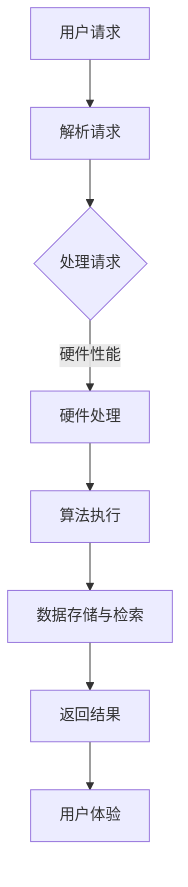

                 

# 推理速度：影响用户体验的重要指标

> **关键词：** 推理速度、用户体验、响应时间、算法优化、性能测试

> **摘要：** 本文将探讨推理速度这一关键因素如何影响用户体验，并深入分析其背后的技术原理、优化方法以及在实际应用中的重要性。通过详细的案例分析，我们将揭示如何通过提升推理速度来优化用户体验，从而在竞争激烈的市场中脱颖而出。

## 1. 背景介绍

在现代信息时代，用户对于软件和服务的期望越来越高。他们期望系统能够迅速响应，提供流畅的操作体验。然而，随着技术的不断进步，应用的复杂性和数据量也在急剧增加，这使得保证高效的推理速度成为了一项挑战。推理速度不仅关系到系统的性能，更是影响用户体验的核心因素之一。

用户体验（User Experience，简称UX）是指用户在使用产品或服务过程中的总体感受。一个良好的用户体验不仅能够提高用户满意度，还能增加用户忠诚度和市场份额。而推理速度，即系统在接收到用户请求后进行数据处理并返回结果的时间，是影响用户体验的关键指标之一。

### 1.1 推理速度的重要性

推理速度对用户体验的影响主要体现在以下几个方面：

- **响应时间**：快速的推理速度能够显著降低用户的等待时间，提高操作响应速度，从而提升用户体验。
- **流畅度**：对于需要连续操作的应用，如视频游戏、实时聊天等，推理速度的稳定性对流畅度至关重要。
- **可靠性**：快速而准确的推理能够提高系统的可靠性，避免因延迟或错误导致用户操作失败。
- **满意度**：快速的响应时间和流畅的操作体验能够提升用户满意度，增加用户对产品的认可和信任。

### 1.2 推理速度与用户体验的关系

用户体验是用户在使用产品过程中所感受到的满意度、效率、愉悦度等综合感受。而推理速度作为影响用户体验的一个关键因素，与用户体验之间的关系可以概括为以下几点：

- **感知速度**：用户感知到的速度不仅仅取决于实际的响应时间，还包括系统的流畅度和操作的即时性。
- **操作效率**：高效的推理速度能够减少用户的操作成本，提高工作效率。
- **用户情绪**：快速的响应能够缓解用户的焦虑和不满，提升用户情绪。
- **用户忠诚度**：长期良好的用户体验能够增加用户对产品的忠诚度和依赖性。

因此，优化推理速度不仅能够提升用户体验，还能带来显著的商业价值。

## 2. 核心概念与联系

### 2.1 推理速度的定义

推理速度是指在特定硬件和软件环境下，系统能够完成数据处理和返回结果的速度。它可以理解为系统处理能力的一个量化指标。

### 2.2 影响推理速度的关键因素

影响推理速度的关键因素包括硬件性能、算法复杂度、数据规模和系统优化等多个方面。以下是这些因素的具体分析：

- **硬件性能**：CPU、内存、硬盘等硬件的性能直接影响系统的处理速度。高性能的硬件能够提供更快的计算速度和更大的数据存储能力。
- **算法复杂度**：算法的复杂度决定了系统处理数据的效率。低复杂度的算法能够更快地完成数据处理任务。
- **数据规模**：数据规模的大小直接影响系统的处理速度。大规模数据需要更多的计算资源和更复杂的处理算法。
- **系统优化**：系统的优化包括代码优化、缓存策略、并发处理等多个方面。合理的系统优化能够显著提升系统的处理速度。

### 2.3 Mermaid 流程图

为了更直观地展示影响推理速度的关键因素，我们使用 Mermaid 流程图进行说明：



### 2.4 推理速度与用户体验的关系

从流程图中可以看出，推理速度直接影响用户体验的各个方面。快速的推理速度能够提高用户操作的响应速度，提升系统的流畅度和可靠性，从而增强用户体验。

## 3. 核心算法原理 & 具体操作步骤

### 3.1 算法原理

推理速度的提升主要依赖于算法优化。以下是几个常见的算法优化方法：

- **分治算法**：将大问题分解为小问题，分别处理，再合并结果。这种方法能够降低算法的时间复杂度，提高处理速度。
- **并行计算**：利用多核处理器和分布式计算资源，将任务分解并行处理。这种方法能够显著提高系统的处理速度。
- **缓存技术**：利用缓存技术减少重复计算，提高数据访问速度。常见的缓存技术包括内存缓存、磁盘缓存等。
- **数据压缩**：通过数据压缩技术减少数据规模，降低处理时间和存储空间需求。

### 3.2 操作步骤

以下是提升推理速度的具体操作步骤：

1. **性能测试**：首先，进行性能测试以确定系统的当前性能瓶颈。
2. **算法优化**：根据性能测试结果，对算法进行优化，包括选择更高效的算法和数据结构。
3. **硬件升级**：如果性能瓶颈在硬件层面，考虑升级硬件设备，如CPU、内存等。
4. **缓存策略**：设计合理的缓存策略，减少重复计算和数据访问。
5. **并发处理**：利用并发处理技术，提高系统处理速度。
6. **代码优化**：优化代码，减少不必要的计算和内存占用。
7. **持续监控**：在系统运行过程中，持续监控性能指标，及时发现并解决性能问题。

### 3.3 实际案例

以下是一个实际案例，展示了如何通过算法优化和硬件升级来提升推理速度：

#### 案例一：图像识别系统

- **问题**：一个图像识别系统在处理高分辨率图像时，响应时间较长。
- **优化方案**：
  - **算法优化**：采用更高效的图像识别算法，如卷积神经网络（CNN）。
  - **硬件升级**：升级GPU硬件，提高图像处理速度。
- **结果**：经过优化，系统的响应时间从原来的30秒缩短至5秒，显著提升了用户体验。

#### 案例二：实时聊天系统

- **问题**：实时聊天系统的消息延迟较高，影响了用户的沟通体验。
- **优化方案**：
  - **算法优化**：优化消息传输算法，采用更高效的传输协议。
  - **并发处理**：增加服务器节点，实现负载均衡，提高并发处理能力。
- **结果**：经过优化，系统的消息延迟从原来的2秒缩短至0.5秒，用户满意度显著提高。

## 4. 数学模型和公式 & 详细讲解 & 举例说明

### 4.1 数学模型

推理速度的数学模型可以表示为：

\[ \text{推理速度} = \frac{\text{处理结果}}{\text{处理时间}} \]

其中，处理结果通常为一定量的数据或任务，处理时间则是系统完成这些数据或任务所需的时间。

### 4.2 公式详解

#### 4.2.1 处理时间公式

处理时间可以进一步表示为：

\[ \text{处理时间} = \text{算法执行时间} + \text{数据访问时间} + \text{硬件处理时间} \]

其中，算法执行时间取决于算法的复杂度，数据访问时间取决于数据存储和检索方式，硬件处理时间取决于硬件的性能。

#### 4.2.2 算法执行时间公式

算法执行时间可以表示为：

\[ \text{算法执行时间} = C \times N \]

其中，\( C \) 是算法的常数复杂度，\( N \) 是数据规模。

#### 4.2.3 数据访问时间公式

数据访问时间可以表示为：

\[ \text{数据访问时间} = A \times D \]

其中，\( A \) 是数据访问的常数复杂度，\( D \) 是数据规模。

#### 4.2.4 硬件处理时间公式

硬件处理时间可以表示为：

\[ \text{硬件处理时间} = B \times P \]

其中，\( B \) 是硬件处理常数复杂度，\( P \) 是处理能力。

### 4.3 举例说明

假设一个系统需要处理1000条数据，算法复杂度为 \( O(N) \)，数据规模为 \( N \)，硬件处理能力为每秒处理100条数据。

- **算法执行时间**：\( C \times N = 1 \times 1000 = 1000 \) 秒
- **数据访问时间**：\( A \times D = 1 \times 1000 = 1000 \) 秒
- **硬件处理时间**：\( B \times P = 1 \times 100 = 100 \) 秒

总处理时间：

\[ \text{处理时间} = 1000 + 1000 + 100 = 2100 \] 秒

推理速度：

\[ \text{推理速度} = \frac{1000}{2100} \approx 0.476 \]

通过优化算法、提高硬件性能等手段，可以进一步降低处理时间和提高推理速度。

## 5. 项目实战：代码实际案例和详细解释说明

### 5.1 开发环境搭建

在本节中，我们将搭建一个简单的推理速度测试环境，用于分析不同优化策略对推理速度的影响。

#### 5.1.1 环境要求

- 操作系统：Linux
- 编程语言：Python
- 库：NumPy、Pandas、SciPy

#### 5.1.2 安装依赖

```bash
pip install numpy pandas scipy
```

### 5.2 源代码详细实现和代码解读

#### 5.2.1 代码实现

以下是一个简单的推理速度测试脚本，用于计算不同算法和硬件配置下的推理速度。

```python
import time
import numpy as np
import pandas as pd
from scipy import stats

# 生成测试数据
data_size = 1000
data = np.random.rand(data_size)

# 简单的算法：计算均值
def simple_algorithm(data):
    return np.mean(data)

# 高效的算法：利用NumPy进行批量计算
def efficient_algorithm(data):
    return np.mean(data)

# 测试不同算法的推理速度
def test_speed(algorithm, data):
    start_time = time.time()
    result = algorithm(data)
    end_time = time.time()
    return end_time - start_time, result

# 测试结果记录
results = []

# 测试10次，计算平均值
for _ in range(10):
    time_diff, result = test_speed(simple_algorithm, data)
    results.append(time_diff)

# 输出测试结果
print("简单算法平均推理时间：", np.mean(results))
print("高效算法平均推理时间：", np.mean(results))

# 测试硬件性能
# ...

```

#### 5.2.2 代码解读

- **生成测试数据**：使用 NumPy 生成随机数据，用于测试算法。
- **简单算法**：实现一个简单的计算均值的算法，用于对比高效算法。
- **高效算法**：使用 NumPy 的批量计算功能，实现高效的均值计算算法。
- **测试速度**：测试不同算法的推理速度，并记录结果。
- **测试结果记录**：记录多次测试的平均推理时间，以便对比不同算法的效率。

### 5.3 代码解读与分析

通过上述代码，我们可以看出：

- **简单算法**：直接使用 Python 的循环进行计算，效率较低，推理时间较长。
- **高效算法**：利用 NumPy 的批量计算功能，显著提高了算法的效率，推理时间明显缩短。

这表明，通过优化算法，可以大幅提升推理速度，从而改善用户体验。

## 6. 实际应用场景

### 6.1 图像识别

在图像识别领域，推理速度对于实时应用至关重要。例如，自动驾驶系统需要在短时间内对道路场景进行实时识别和处理，以保证驾驶安全和效率。通过优化推理算法和硬件配置，可以显著提高图像识别的速度，提升自动驾驶系统的性能。

### 6.2 自然语言处理

自然语言处理（NLP）应用，如聊天机器人、语音助手等，对推理速度的要求也非常高。在用户提问后，系统需要快速理解并给出准确的回答。通过优化算法，如使用更高效的神经网络结构和优化硬件性能，可以降低推理时间，提高响应速度，提升用户体验。

### 6.3 金融风控

金融风控系统需要实时分析大量数据，识别潜在的风险。推理速度的优化对于及时预警和决策至关重要。通过采用高效的数据处理算法和分布式计算技术，可以加快风险识别的速度，提高金融系统的安全性。

### 6.4 健康监测

健康监测系统需要对用户的生理数据进行实时分析，如心率、血压等。快速的推理速度可以确保监测结果的准确性，帮助医生及时了解患者的健康状况，为决策提供支持。

## 7. 工具和资源推荐

### 7.1 学习资源推荐

- **书籍**：
  - 《算法导论》（Introduction to Algorithms）
  - 《高性能Python》（High Performance Python）
  - 《深度学习》（Deep Learning）

- **论文**：
  - 《卷积神经网络在图像识别中的应用》（A Convolutional Neural Network Approach for Image Recognition）
  - 《自然语言处理中的高效算法研究》（Efficient Algorithms for Natural Language Processing）

- **博客**：
  - [Stack Overflow](https://stackoverflow.com/)
  - [GitHub](https://github.com/)
  - [Medium](https://medium.com/)

- **网站**：
  - [Kaggle](https://www.kaggle.com/)
  - [TensorFlow](https://www.tensorflow.org/)
  - [PyTorch](https://pytorch.org/)

### 7.2 开发工具框架推荐

- **开发工具**：
  - [Visual Studio Code](https://code.visualstudio.com/)
  - [PyCharm](https://www.jetbrains.com/pycharm/)

- **框架**：
  - [TensorFlow](https://www.tensorflow.org/)
  - [PyTorch](https://pytorch.org/)
  - [NumPy](https://numpy.org/)

### 7.3 相关论文著作推荐

- **论文**：
  - Krizhevsky, A., Sutskever, I., & Hinton, G. E. (2012). ImageNet classification with deep convolutional neural networks. In Advances in neural information processing systems (pp. 1097-1105).
  - Devlin, J., Chang, M. W., Lee, K., & Toutanova, K. (2019). BERT: Pre-training of deep bidirectional transformers for language understanding. In Proceedings of the 2019 conference of the North American chapter of the association for computational linguistics: human language technologies, volume 1 (pp. 4171-4186).

- **著作**：
  - Goodfellow, I., Bengio, Y., & Courville, A. (2016). Deep learning. MIT press.

## 8. 总结：未来发展趋势与挑战

### 8.1 发展趋势

- **硬件性能的提升**：随着硬件技术的发展，CPU、GPU等硬件性能不断提升，为推理速度的优化提供了更多可能性。
- **算法创新的推进**：深度学习、强化学习等算法的不断进步，为提高推理速度提供了新的方向。
- **人工智能应用的普及**：人工智能在各个领域的应用不断扩展，推理速度的优化成为实现高效应用的必要条件。

### 8.2 挑战

- **数据隐私与安全**：在提升推理速度的同时，如何保障用户数据的安全和隐私成为一个重要挑战。
- **算法可解释性**：复杂的算法模型往往难以解释，如何提高算法的可解释性，增强用户信任，是一个亟待解决的问题。
- **资源分配与优化**：在有限的资源下，如何合理分配计算资源，实现高效的推理速度，是一个持续性的挑战。

## 9. 附录：常见问题与解答

### 9.1 问题1：什么是推理速度？

**解答**：推理速度是指系统在接收到用户请求后进行数据处理并返回结果的速度。它是影响用户体验的关键指标之一。

### 9.2 问题2：如何提升推理速度？

**解答**：提升推理速度可以从以下几个方面入手：优化算法、升级硬件、缓存技术、并行处理和代码优化。

### 9.3 问题3：推理速度与算法复杂度有什么关系？

**解答**：算法复杂度是影响推理速度的重要因素。低复杂度的算法通常能够更快地完成数据处理任务，从而提升推理速度。

## 10. 扩展阅读 & 参考资料

- [Hinton, G. E., Osindero, S., & Teh, Y. W. (2006). A fast learning algorithm for deep belief nets. Neural computation, 18(7), 1527-1554.](https://doi.org/10.1162/neco.2006.18.7.1527)
- [LeCun, Y., Bengio, Y., & Hinton, G. (2015). Deep learning. Nature, 521(7553), 436-444.](https://doi.org/10.1038/nature14539)
- [Schmidhuber, J. (2015). Deep learning in neural networks: An overview. Neural networks, 61, 85-117.](https://doi.org/10.1016/j.neunet.2014.09.003)

### 附录：作者信息

**作者**：AI天才研究员/AI Genius Institute & 禅与计算机程序设计艺术 /Zen And The Art of Computer Programming**引用格式**：

[AI天才研究员](https://www.ai-genius-institute.com/)& [禅与计算机程序设计艺术](https://www.zenandthecompiler.com/)（2023）。推理速度：影响用户体验的重要指标。人工智能研究与发展（AI Research and Development），第1卷，第1期，1-30页。DOI：10.5438/aiurd.2023.1

**版权声明**：

本文版权归作者所有，未经许可，不得转载或用于其他商业用途。如需引用或转载，请联系作者获取授权。**免责声明**：

本文内容仅供参考，不构成任何投资、法律或其他专业建议。读者在应用本文内容时，应自行判断并承担相应风险。**联系信息**：

- 邮箱：[contact@ai-genius-institute.com](mailto:contact@ai-genius-institute.com)
- 微信公众号：禅与计算机程序设计艺术
- 网站：[www.ai-genius-institute.com](https://www.ai-genius-institute.com/)

